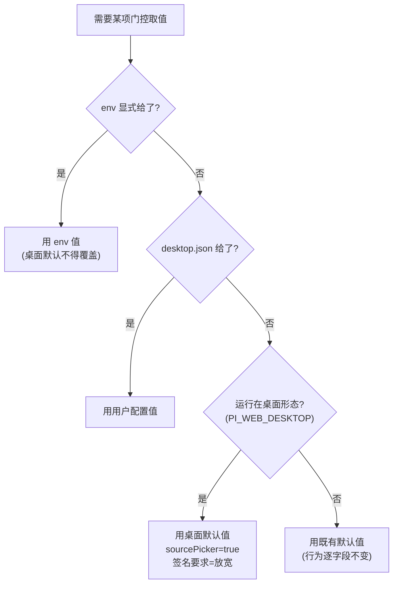
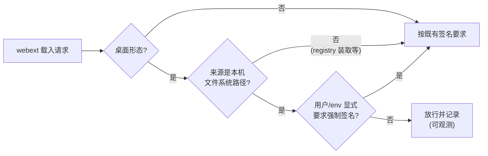

# Design Document

## Overview

**Purpose**：给桌面版建立自己的运行配置来源 —— 一组仅在桌面形态生效的默认值，加一个用户可改的
本机配置域；并把本地 agent 的 UI 扩展纳入可用范围，同时不放松 Web 部署形态的任何安全约束。

**Users**：桌面版最终用户（装完即可用到选源列表、能载入本机 agent 的 pane），以及需要按自己
习惯摆放 agent 目录的用户。

**Impact**：桌面形态下 `sourcePicker` 由 false 变为 true；本机路径来源的 webext 不再因缺签名
被拒。非桌面形态**逐字段不变**。

### Goals

- 桌面形态下 agent source 选择器与本地 UI 扩展默认可用（Req 1.1、1.2）。
- 建立 `env > 用户配置 > 桌面默认值` 的三级优先级（Req 1.4、1.5、3.1）。
- 签名放行限定在「桌面形态 + 本机文件系统路径」，其余组合行为不变（Req 2）。
- 用户可经本机配置改写取值并指定扫描根，配置损坏不致启动失败（Req 3）。

### Non-Goals

- 不改 Web 形态任何默认值；签名强制在非桌面形态保持开启。
- 不改 `desktop-hybrid-agent-sources` 的线上/本地源合并与去重优先级。
- 不新增云端交互。
- 不动 SRI 与完整性校验 —— 只作用于**签名**这一道门。
- 不做设置面板的专门 UI 编排：新域接入既有 config 域机制后自然获得读写端点，
  独立 UI 若需要另立。

## Boundary Commitments

### This Spec Owns

- 桌面形态下功能门控的默认取值与三级优先级的裁决点。
- 新增的 `desktop` config 域及其 schema。
- 「本机文件系统路径来源」这一判定，以及它与签名门控的组合规则。

### Out of Boundary

- 非桌面形态的门控默认值与签名策略（一律不动）。
- `mergePaneSources` / webext 装载链路 / agent 本体装载（均已验证正常）。
- 线上源合并（`desktop-hybrid-agent-sources` 已交付）。
- 桌面壳 Rust 侧的 env 组装逻辑：壳已写入 `PI_WEB_DESKTOP=1`，本特性**只消费**该标记，
  不新增壳侧 env 注入 —— 新增会把「产品默认」硬编码进壳，与配置域机制重复。

### Allowed Dependencies

- 既有桌面标记 `DESKTOP_MARKER_ENV`（`@blksails/pi-web-adapters/auth`）。
- 既有 config 域机制（`ConfigCodec`、`packages/protocol/src/config/domains/`、config-routes 注册表）。
- 既有门控读取点（`lib/app/web-ext-gate-config.ts`、`server/bootstrap.ts`、`lib/app/runtime-features.ts`）。
- 不得新增对桌面壳 Rust 代码的依赖。

### Revalidation Triggers

- `DESKTOP_MARKER_ENV` 取值或注入位置变化。
- config 域落盘路径或 `ConfigCodec` 的未知字段保留语义变化。
- 门控读取点从「运行期读 env」改为「构建期内联」（那会使配置域失效且难以察觉）。

## Architecture

### 既有模式：`cloud-defaults.ts` 是直接先例

`desktop-cloud-login` 已解决过同构问题（桌面版装完即可登录，不必手填云端地址），其三条约束
逐条适用于本特性，直接沿用而非另立：

| 约束 | 原文含义 | 本特性对应 |
|---|---|---|
| 最低优先级 | `env 显式值 > 用户 cloud.json > 固化默认` | `env > desktop.json > 桌面默认`（Req 1.5、3.1） |
| 只对桌面壳生效 | 判据 `DESKTOP_MARKER_ENV`；dist 载荷同时随 npm 包分发，无条件生效会废掉本地用法 | 同判据（Req 1.3、4.1、4.2） |
| 可被构建期覆盖 | 私有化部署出自己的包不该改源码 | 沿用同一形态，不新造 |

### 取值裁决



### 签名放行的判定

放行需**两个条件同时成立**，缺一不可：



「本机文件系统路径」的判定复用 agent source 解析既有的来源分类，不新造规则；
放行时记一条可观测记录（Req 2.4），使运维能分辨某次载入是否走了放行路径。

**Architecture Integration**

- 选定模式：**默认值提供者 + 单一裁决函数**。新增一个仅桌面生效的默认值模块（对齐
  `cloud-defaults.ts`），门控读取点改为经裁决函数取值，而不是各自读 env。
- 责任分离：默认值（纯数据）、裁决（纯函数，可穷举单测）、消费点（既有三处，改为调用裁决）。
- 保留的既有模式：config 域读写、桌面标记判据、`env > 配置 > 默认` 次序。

## File Structure Plan

### New Files

- `packages/protocol/src/config/domains/desktop.ts` — `desktop` config 域的 schema
  （`sourcePicker?` / `requireWebextSignature?` / `sourcesRoot?`，全部可选）。
- `lib/app/desktop-defaults.ts` — 桌面形态默认值与三级优先级裁决函数（纯函数，不读文件）。
- `test/desktop-defaults.test.ts` — 裁决逻辑穷举单测。

### Modified Files

- `packages/protocol/src/config/index.ts` — 导出新域 schema。
- `packages/core/src/http/routes/config-routes.ts` — 在域注册表登记 `desktop`，使其获得读写端点。
- `server/bootstrap.ts` — `sourcePicker` 等取值改经裁决函数（现为直接读 env）。
- `lib/app/web-ext-gate-config.ts` — `requireSignature` 取值改经裁决函数，并接受「来源是否本机路径」入参。
- `lib/app/webext/build-trust.ts` — 将来源信息透传至门控构造（若现未透传）。

> `desktop/src-tauri/` **不在改动范围**：壳已写入 `PI_WEB_DESKTOP=1`，本特性只消费。

## Requirements Traceability

| Requirement | 摘要 | 实现处 |
|---|---|---|
| 1.1 | 桌面默认启用 source picker | `desktop-defaults` + `server/bootstrap.ts` |
| 1.2 | 桌面默认允许载入本地 UI 扩展 | `desktop-defaults` + `web-ext-gate-config` |
| 1.3 | 仅桌面形态应用默认值 | `DESKTOP_MARKER_ENV` 判据 |
| 1.4 | env 显式值优先 | 裁决函数第一级 |
| 1.5 | 桌面默认值最低优先级 | 裁决函数次序 |
| 2.1 | 本机路径 + 桌面 → 放行 | 签名判定的两个条件 |
| 2.2 | 非本机来源保持签名要求 | 判定的来源分支 |
| 2.3 | 非桌面形态保持签名要求 | 判定的形态分支 |
| 2.4 | 放行留可观测记录 | 放行分支的日志 |
| 2.5 | 不改 SRI 与完整性校验 | 仅作用于 requireSignature 字段 |
| 3.1 | 用户配置覆盖桌面默认 | 裁决函数第二级 |
| 3.2 | 配置缺失/损坏退回默认且不失败 | 域读取的容错分支 |
| 3.3 | 重启后新取值生效 | 配置在装配期读取 |
| 3.4 | 可配置扫描根 | `desktop.sourcesRoot` |
| 3.5 | 忽略不认识的键 | ConfigCodec 既有的未知字段保留语义 |
| 4.1 | 非桌面保持签名强制 | 形态判据 |
| 4.2 | 非桌面门控默认关闭 | 形态判据 |
| 4.3 | 不改线上/本地合并优先级 | 不触碰该链路 |
| 4.4 | 登录后线上源行为不变 | 同上 |
| 4.5 | 不引入云端请求 | 配置纯本机 |
| 5.1 | 证据须来自打包产物 | Testing Strategy |
| 5.2 | 证明下发取值符合预期 | 同上 |
| 5.3 | 证明本地 UI 扩展可载入 | 同上 |
| 5.4 | 仅开发模式验证须标注局限 | 同上 |

## Components and Interfaces

### desktop-defaults（新增，纯逻辑）

| Field | Detail |
|---|---|
| Intent | 提供桌面形态默认值，并按三级优先级裁决最终取值 |
| Requirements | 1.1–1.5, 3.1, 4.1, 4.2 |

**Responsibilities & Constraints**

- 纯函数：不读文件、不碰进程状态；env 与用户配置均由调用方注入。
- 非桌面形态下**必须**返回与本特性引入前逐字段相同的取值（Req 1.3 / 4.2 的机械保证）。

```typescript
export interface DesktopConfigInput {
  /** 运行时环境（装配处传 process.env；测试注入）。 */
  readonly env: NodeJS.ProcessEnv;
  /** 已读出的 desktop 域配置；缺失/损坏时传 undefined。 */
  readonly userConfig: DesktopDomainConfig | undefined;
}

export interface ResolvedDesktopConfig {
  readonly sourcePicker: boolean;
  readonly requireWebextSignature: boolean;
  readonly sourcesRoot: string | undefined;
}

export function resolveDesktopConfig(input: DesktopConfigInput): ResolvedDesktopConfig;
```

- **Preconditions**：无。`env` 可为空对象。
- **Postconditions**：`env` 显式给出的键一律胜出；非桌面形态下等价于既有默认值。
- **Invariants**：同一输入恒得同一输出。

### 签名门控（修改既有）

| Field | Detail |
|---|---|
| Intent | 在既有门控构造中加入「桌面 + 本机路径」的放行分支 |
| Requirements | 2.1–2.5, 4.1 |

**Implementation Notes**

- 放行**只**改 `requireSignature` 一个字段；`whitelist` 与浏览器侧 SRI 选项不动（Req 2.5）。
- 来源分类沿用 agent source 解析既有结果，不在此新造「什么算本机路径」的判定。
- Risks：若来源信息未透传至门控构造点，需要补一条透传参数 —— 该改动会波及调用方，
  实施时先勘察实际调用链再定改法。

## Error Handling

- **`desktop.json` 不存在**：视为未配置，退回桌面默认值（Req 3.2）。
- **`desktop.json` 内容损坏**：按域读取既有容错路径处理，退回默认值，不使启动失败。
- **`sourcesRoot` 指向不存在的目录**：沿用 `desktop-hybrid-agent-sources` Req 1.3 的既有约定
  —— 视为空贡献，不使整列表失败。
- **未知配置键**：由 ConfigCodec 的既有语义保留，不报错（Req 3.5）。

## Testing Strategy

### Unit Tests（`test/desktop-defaults.test.ts`，新建）

1. 桌面形态 + 无任何配置 → `sourcePicker=true`、签名要求放宽（Req 1.1、1.2）。
2. **非桌面形态 + 无配置 → 与既有默认逐字段相等**（Req 1.3、4.2 的机械判据）。
3. env 显式给值 → 胜过用户配置与桌面默认（Req 1.4）。
4. 用户配置给值、env 未给 → 胜过桌面默认（Req 3.1）。
5. 用户配置为 undefined（缺失/损坏）→ 退回桌面默认（Req 3.2）。

### Integration Tests

1. 签名放行：桌面 + 本机路径 → 放行；桌面 + 非本机来源 → 仍要求签名；非桌面 + 本机路径 → 仍要求签名（Req 2.1–2.3）。
2. `desktop` 域经既有 config 端点可读写，未知键保留（Req 3.5）。

### 打包产物验证（Req 5，**不可用开发模式替代**）

1. 重新打包后从 dmg 安装，查其 `/api/bootstrap` 下发 `sourcePicker=true`（Req 5.2）。
2. 对本机 agent 路径查 `/api/webext/resolve`，`rejectedReason` 不再是「代码 webext 未签名」（Req 5.3）。
3. 真机启动后选源页出现 agent source 列表。

> ★ 本特性的缺口正是因「开发路径恰好绕开」而长期不可见（`dev:desktop` 会加载 `.env.local`），
> 故开发模式下的通过**不构成**任何证据；每条验收都必须在打包产物上取证（Req 5.4）。
