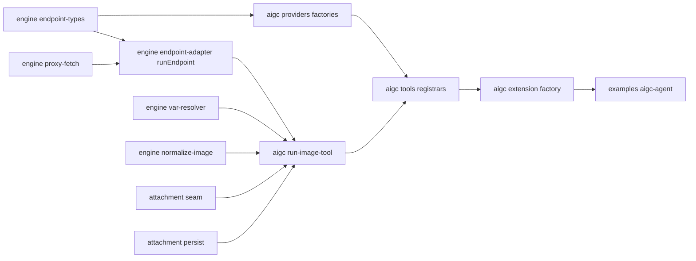
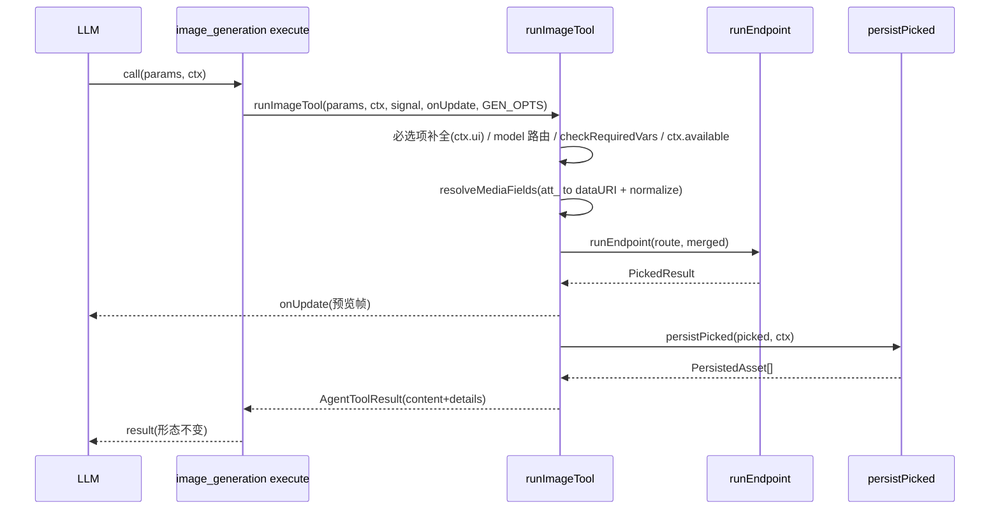

# Design Document

## Overview

**Purpose**: 删除 `packages/tool-kit` 的声明式工具框架(`ToolSpec` 类型 + `compileTool` 通用编译器),把 AIGC 图像工具改写为基于 `pi.registerTool` 的进程内 `ExtensionFactory`,使所有内置工具统一为普通 pi extension 形态;同时把附件 seam 与通用执行层降级为可被任意手写 `execute` 复用的共享工具集并保留。

**Users**: pi-web 框架维护者(获得一致的内置工具注册/装配机制与更低的认知成本);最终用户与 agent 作者(AIGC 画图/编辑功能与工具协议形态完全不变)。

**Impact**: 内置工具从"AIGC 走 ToolSpec/customTools、其余走 extension"的双机制收敛为"全部走 pi extension"。改动限定在 tool-kit 内部与 `examples/aigc-agent` 的装配方式;前端、协议、附件存储后端、provider HTTP 业务逻辑均不变。

### Goals
- 移除 `ToolSpec` 与 `compileTool`,无悬空引用(typecheck 通过)。
- AIGC 以 `aigcExtension`(in-process `ExtensionFactory`)经 `AgentDefinition.extensions` 装配。
- 保留 `runEndpoint`/`var-resolver`/`normalize-image`/`proxy-fetch`/附件 seam/provider 工厂逻辑为可复用 util。
- 新增 `runImageTool` 运行时编排器,消除两工具重复。
- 工具 name 与 result(`content`/`details`)形态零变化;前端/协议零改动。

### Non-Goals
- 不改 `extension-manager` / `auto-title`(已是 extension)。
- 不改附件存储后端、前端 renderer/webext、SSE 协议 schema。
- 不改 provider 端点的 HTTP 请求/响应业务逻辑(仅去 `ModelRoute` 包装)。
- 不引入通用"内置工具注册表/manifest 框架"(已评估为过度抽象)。

## Boundary Commitments

### This Spec Owns
- `packages/tool-kit/src/engine/` 的去留与重组(删 `compile-tool.ts`、拆 `types.ts`)。
- `packages/tool-kit/src/aigc/` 的全部改造:工具改 `pi.registerTool`、新增 `extension.ts` 与 `run-image-tool.ts`、provider 工厂去 `ModelRoute` 包装。
- `tool-kit` 主入口(`src/index.ts`)与 `runtime` 子入口(`src/runtime.ts`)的导出面契约。
- `examples/aigc-agent` 的装配方式(改 `extensions`)。
- 上述范围的单元/集成/e2e 测试与 `docs/product/11-aigc-tools.md` / `09` 章更新。

### Out of Boundary
- `extension-manager` / `auto-title` 扩展实现。
- 附件存储后端、attachment-bridge 闸门实现(仅依赖其既有行为)。
- 前端 renderer / webext 组件;`@blksails/pi-web-protocol` schema。
- provider 端点的请求/响应业务语义。

### Allowed Dependencies
- pi SDK:`@earendil-works/pi-coding-agent`(`registerTool`/`ExtensionFactory`/`ExtensionContext`/`ExtensionAPI`/`AgentToolResult`)、`@earendil-works/pi-ai`(`Type`/`TSchema`)。
- `agent-kit` 暴露的 `ExtensionFactory` / `AttachmentToolContext` 类型。
- runner 既有的 `extensions` 透传(`option-mapper.ts:121-123`)、attachment seam(`SEAM_KEY`)、attachment-bridge 闸门。
- **约束**:`tool-kit` 主入口不得引入 pi SDK / node-only 运行时值导入(前端安全);含值导入的全部留 `runtime` 子入口。

### Revalidation Triggers
- AIGC 工具 name 或 result `content`/`details` 形态变化 → 前端 renderer/webext 须复检。
- `runtime` / 主入口导出面增删 → 下游消费者(examples、server)须复检。
- `extensions` 装载契约或 `ExtensionContext` execute 签名变化 → 装配链须复检。
- 附件 seam key 或 `persistPicked` 契约变化 → 工具落库路径须复检。

## Architecture

### Existing Architecture Analysis
- 现状:`AIGC_TOOLS`(ToolSpec 数据)→ `compileTool`(schema→pi Type 映射 + model enum 注入 + `runExecute` 编排)→ `ToolDefinition[]` → `examples/aigc-agent` 的 `customTools`。
- `compileTool` 用 `defineTool`,execute 第 5 参为 `ExtensionContext`(含 `ctx.ui`)——交互补全本就可用,转 extension 非能力补缺。
- 附件能力经 globalThis seam 注入,与工具来源无关;attachment-bridge 闸门按 args `att_` 引用工作,与来源无关 → 改装配方式不影响其行为(零外溢基础)。

### Architecture Pattern & Boundary Map
- **Selected pattern**: 进程内 extension factory + 运行时编排器复用共享 util。
- **依赖方向(单向,左→右不可逆)**:`engine/endpoint-types`(类型)→ `engine/*` 与 `attachment/*`(util)→ `aigc/run-image-tool`(编排)→ `aigc/tools/*`(registrar)→ `aigc/extension`(factory)。
- **保留模式**:前端安全的主入口/runtime 子入口分层;附件 seam;provider 工厂封装。



### Technology Stack

| Layer | Choice / Version | Role in Feature | Notes |
|-------|------------------|-----------------|-------|
| Backend / Runtime | `@earendil-works/pi-coding-agent` | `registerTool`/`ExtensionFactory`/`ExtensionContext` | 替代 `defineTool`+`customTools` 路径 |
| Backend / Runtime | `@earendil-works/pi-ai` (`Type`) | 手写工具 `parameters` schema | 取代 ToolSpec inputSchema→Type 映射 |
| Tooling | TypeScript strict | 无 `any`、无悬空引用 | typecheck 为去除验证手段 |
| Test | vitest + Playwright | 单元/集成 + e2e(stub provider) | 注意 tool-kit 子路径 alias |

## File Structure Plan

### New Files
```
packages/tool-kit/src/
├── engine/
│   └── endpoint-types.ts        # 执行层类型(从 types.ts 迁出):EndpointBehavior/AsyncSpec/PickedResult/RunStage/ToolProgress/BuildBodyContext/LocalExecuteHook
└── aigc/
    ├── run-image-tool.ts        # runImageTool 运行时编排器 + RunImageToolOptions/InteractionParam/ToolExecuteDetails
    └── extension.ts             # aigcExtension: ExtensionFactory(注册两工具)
```

### Modified Files
- `packages/tool-kit/src/aigc/tools/image-generation.ts` — 由"导出 ToolSpec 数据"改为导出 `registerImageGeneration(pi: ExtensionAPI)`:`pi.registerTool` + 手写 `Type.Object` parameters + `execute` 调 `runImageTool`;内联 `routes`/`defaultModel`/`requiredParams`/`mediaFields`。
- `packages/tool-kit/src/aigc/tools/image-edit.ts` — 同上(含 `mediaFields: ["image","mask","reference_images"]`)。
- `packages/tool-kit/src/aigc/providers/{dashscope,newapi,openrouter}.ts` — 工厂返回 `EndpointBehavior`(+ 轻量 `{ id, label }`),去 `ModelRoute`;保留 `buildBody`/`pickResult`/`detectError`/`async`/端点常量/`IMAGE_EDIT_MAX_IMAGES`/`DASHSCOPE_MODELS`。
- `packages/tool-kit/src/aigc/index.ts` — 去 `AIGC_TOOLS`/`buildAigcTools`;转出 `aigcExtension`(runtime-only)。
- `packages/tool-kit/src/engine/endpoint-adapter.ts` — 类型 import 改自 `endpoint-types.ts`。
- `packages/tool-kit/src/runtime.ts` — 删 `compileTool`/`CompileDeps`/`ToolExecuteDetails`(迁 run-image-tool)/`buildAigcTools`/`AIGC_TOOLS`;新增 `aigcExtension`;保留 `runEndpoint`/`resolveVars*`/`checkRequiredVars`/`proxyFetch`/`normalizeImageDataUri`/`getAttachmentToolContext`/`SEAM_KEY`/`persistPicked`/`resolveInputToDataUri`。
- `packages/tool-kit/src/index.ts` — 删 `export * from engine/types`、`AIGC_TOOLS`、`imageGeneration`/`imageEdit`;保留 `BUILTIN_COMMANDS` 及命令类型。
- `examples/aigc-agent/index.ts` — `customTools: buildAigcTools()` → `extensions: [aigcExtension]`(保留 `noTools:"builtin"`)。
- `docs/product/11-aigc-tools.md` / `09-extensions-and-skills.md` — 接入改 `extensions`;删/改"声明式引擎结构"章节;补"内置能力默认走 `pi.registerTool`"边界说明。

### Deleted Files
- `packages/tool-kit/src/engine/compile-tool.ts`
- `packages/tool-kit/src/engine/types.ts`(执行层类型迁出后删除)
- `packages/tool-kit/test/engine/compile-tool.test.ts` / `compile-tool-media.test.ts` / `compile-tool-interactive.test.ts`

### Modified Tests
- `packages/tool-kit/test/aigc/{image-generation.integration,image-edit,image-edit-ownership,agent-assembly}.test.ts` — 改为测 `aigcExtension` 注册 + execute(mock provider/ctx/ui)。
- `packages/tool-kit/test/aigc/providers/{newapi,openrouter}.test.ts` — 改为测工厂返回的 `EndpointBehavior`。
- 新增 `run-image-tool` 单元测、`aigc-extension` 注册集成测。
- vitest alias:同步 tool-kit 子入口路径(历史坑)。

## System Flows

`image_generation` 一次成功调用(经 extension 注册后):



降级分支(任一命中即早返回 `ok:false`,不调 provider):用户取消补全 / 必选项缺失无 UI 无 fallback / `requiredVars` 缺失 / attachment 不可用 / 零产物。

## Requirements Traceability

| Requirement | Summary | Components | Interfaces | Flows |
|-------------|---------|------------|------------|-------|
| 1.1–1.5 | AIGC 行为/参数/result 形态不变 | run-image-tool, tools registrars, providers | `runImageTool`, `buildImageResult` | 成功流 |
| 2.1–2.5 | 统一为 extension 装配 | aigc/extension, tools registrars, examples/aigc-agent | `aigcExtension`, `registerImage*` | — |
| 3.1–3.4 | 移除 ToolSpec/compileTool | engine(删 compile-tool/types) | runtime/index 导出面 | — |
| 4.1–4.4 | 保留通用 util + provider 工厂 + helper | engine util, attachment seam, providers, run-image-tool | runtime 导出面, `EndpointBehavior` | 成功流 |
| 5.1–5.7 | 交互补全与降级 | run-image-tool | `runImageTool`(补全/降级分支) | 降级分支 |
| 6.1–6.4 | 前端/协议零外溢 | tools registrars, index 主入口 | result 形态契约, 前端安全边界 | 成功流 |
| 7.1–7.4 | 测试与 e2e | 全部 + 测试 | — | 成功流/降级分支 |

## Components and Interfaces

| Component | Layer | Intent | Req Coverage | Key Dependencies (P0/P1) | Contracts |
|-----------|-------|--------|--------------|--------------------------|-----------|
| runImageTool | aigc/编排 | 复用通用 util 完成图像工具编排 | 1, 4, 5 | runEndpoint(P0), persistPicked(P0), seam(P0), var-resolver(P1), normalize-image(P1) | Service, State |
| aigcExtension + registrars | aigc/装配 | 以 pi.registerTool 注册两工具的 ExtensionFactory | 1, 2, 6 | runImageTool(P0), pi.registerTool(P0) | Service |
| provider factories | aigc/provider | 返回 EndpointBehavior 的端点行为 | 4 | endpoint-types(P0) | Service |
| engine util(保留) | engine | runEndpoint/var/normalize/proxy | 4 | endpoint-types(P0) | Service |
| tool-kit 导出面 | 包边界 | 主入口前端安全 + runtime 执行层 | 3, 4, 6 | — | API(模块导出) |

### aigc/编排

#### runImageTool

| Field | Detail |
|-------|--------|
| Intent | 接收显式编排参数,复用通用 util 串起图像工具执行 |
| Requirements | 1.2, 1.3, 1.4, 4.4, 5.1–5.7 |

**Responsibilities & Constraints**
- 编排:必选项补全 → model 路由 → `checkRequiredVars` → attachment ctx 检查 → 媒体字段解析 → `runEndpoint` → 乐观预览 `onUpdate` → `persistPicked` → `buildImageResult` 组装。
- 不拥有 provider HTTP 语义(委托 `routes` 的 `EndpointBehavior`)、不拥有附件后端(委托 seam/persist)。
- result 的 `content`/`details` 组装必须复用现 `buildImageResult` 逻辑,保证形态不变(6.x)。
- `mediaFields` 显式声明替代 `mediaKind` 遍历;`options` 哨兵 `"$models"` 展开为 `Object.keys(routes)`。

**Contracts**: Service [x] / State [x]

##### Service Interface
```typescript
import type { ExtensionContext, AgentToolResult } from "@earendil-works/pi-coding-agent";
import type { EndpointBehavior } from "../engine/endpoint-types.js";

export interface InteractionParam {
  param: string;                       // "model" | "size" | "prompt"
  via: "select" | "input";
  title: string;
  placeholder?: string;
  options?: readonly string[];         // 含哨兵 "$models" → 运行时展开为 Object.keys(routes)
  fallback?: string;
}

export type ToolExecuteDetails =
  | { ok: true; model: string; assets: { attachmentId: string; displayUrl: string; mimeType: string; name: string }[] }
  | { ok: false; error: string };

export interface RunImageToolOptions {
  toolName: string;
  routes: Record<string, EndpointBehavior>;
  defaultModel: string;                // 必须存在于 routes
  requiredParams: readonly InteractionParam[];
  mediaFields: readonly string[];      // 形如 ["image","mask","reference_images"]
  deps?: { getCtx?: () => import("@blksails/pi-web-agent-kit").AttachmentToolContext; fetchImpl?: typeof fetch };
}

export function runImageTool(
  params: Record<string, unknown>,
  ext: ExtensionContext | undefined,
  signal: AbortSignal | undefined,
  onUpdate: ((partial: AgentToolResult<ToolExecuteDetails>) => void) | undefined,
  opts: RunImageToolOptions,
): Promise<AgentToolResult<ToolExecuteDetails>>;
```
- Preconditions: `opts.defaultModel ∈ keys(opts.routes)`;`opts.routes` 非空。
- Postconditions: 返回 `AgentToolResult`;失败路径 `details.ok===false` 且不调用 provider;成功路径产物已落库。
- Invariants: result `content`/`details` 形态与重构前一致。

**Implementation Notes**
- Integration: 从 `compile-tool.ts:372-495` 抽取,`buildParameters`/`buildDescription`/`jsonSchemaToType` 不迁移(由各工具手写 `Type.Object` 与 description 取代)。
- Validation: 复用 `checkRequiredVars`/`resolveInputToDataUri`/`normalizeImageDataUri`/`previewAssetsFromPicked`/`persistPicked`。
- Risks: 媒体字段显式列表须与工具 parameters 一致,否则漏解析 → 单元测覆盖。

### aigc/装配

#### aigcExtension + registrars

| Field | Detail |
|-------|--------|
| Intent | 以 `pi.registerTool` 注册 `image_generation`/`image_edit` 的进程内 ExtensionFactory |
| Requirements | 1.1, 1.5, 2.1, 2.2, 6.x |

**Contracts**: Service [x]

##### Service Interface
```typescript
import type { ExtensionAPI, ExtensionFactory } from "@earendil-works/pi-coding-agent";

export function registerImageGeneration(pi: ExtensionAPI): void;
export function registerImageEdit(pi: ExtensionAPI): void;

// 进程内 factory:examples/aigc-agent 以 extensions:[aigcExtension] 装载
export const aigcExtension: ExtensionFactory;
```
- 每个 registrar 内:`pi.registerTool({ name, label, description, parameters: Type.Object({...}), execute })`;`execute(_id, params, signal, onUpdate, ctx)` 调 `runImageTool(params, ctx, signal, onUpdate, OPTS)`。
- `parameters` 手写,含 `model: Type.Optional(Type.Union([Type.Literal(...)]))`(枚举 = routes 键),取代 compileTool 的自动注入。
- `description` 含可用 model 列表(复刻原 `buildDescription` 文案),保证 LLM 可见信息不退化。

**Implementation Notes**
- Integration: 形态对齐 `extension-manager.ts:186-235`;`Type` 来自 `@earendil-works/pi-ai`。
- Risks: 注册时机须在工具表构建前 → 集成测试断言工具就绪后可见;`noTools:"builtin"` 不影响 extension 工具(`agent-kit/types.ts:70`)→ 测试覆盖。

### aigc/provider(改造,summary)
- 工厂(`createDashscopeSyncT2I`/`createDashscopeImageEdit`/`createDashscopeAsyncT2I`/`createNewApiImage`/`createNewApiImageEdit`/`createOpenRouterImage`/`createOpenRouterImageEdit`)返回 `EndpointBehavior`(+ 轻量 `{ id, label }`);内部 `buildBody`/`pickResult`/`detectError`/`async`/端点常量保持。工具侧把工厂产物收进 `routes: Record<id, EndpointBehavior>`。

### engine util(保留,summary)
- `runEndpoint`/`resolveVars*`/`checkRequiredVars`/`proxyFetch`/`normalizeImageDataUri` 不改逻辑,仅 `endpoint-adapter` 的类型 import 改自 `endpoint-types.ts`。

## Error Handling

### Error Strategy
顶层 try/catch + 早返回 `ok:false`(沿用现有 `runExecute` 语义),任何失败不崩溃子进程(fail-soft)。

### Error Categories and Responses
| 场景 | 触发(Req) | 响应 |
|------|-----------|------|
| 必选项缺失 + 有 UI | 5.1 | `ctx.ui.select/input` 提示补全 |
| 用户取消补全 | 5.2 | `ok:false`,不调 provider |
| 必选项缺失 + 无 UI + 无 fallback | 5.3 | `ok:false`(prompt 无兜底) |
| `requiredVars` 缺失 | 5.4 | `ok:false` 降级 |
| attachment ctx 不可用 | 5.5 | `ok:false` 降级 |
| 零有效产物 | 5.6 | `ok:false`(非误导成功) |
| provider/网络异常 | — | catch → `ok:false`,error 文案 |

### Monitoring
复用 `toolkit:tool` 命名空间日志(provider 返回 / persist 耗时),走 stderr sentinel,默认门控由 runner 决定。

## Testing Strategy

### Unit Tests
- `run-image-tool`:必选项补全(select/input)、取消、fallback、`$models` 展开、model 路由选择、各降级分支(requiredVars/ctx/零产物)、result 形态断言。(5.1–5.7, 1.4)
- provider 工厂:`createNewApi*` / `createDashscope*` / `openrouter` 返回的 `EndpointBehavior` 的 `buildBody`/`pickResult`/`detectError`。(4.3)
- 保留:`endpoint-adapter`/`var-resolver`/`normalize-image`/`proxy-fetch`/`persist`/`seam` 测试。(4.1, 4.2, 7.1)

### Integration Tests
- `aigcExtension` 注册:断言 `pi.registerTool` 被以 `image_generation`/`image_edit` 调用,parameters 含 `model` 枚举。(2.1, 2.5)
- execute 全链(mock provider + mock attachment ctx + mock `ctx.ui`):成功落库 + result `content`/`details` 形态符合 1.4。(1.2, 1.3, 6.3)
- `noTools:"builtin"` 下 extension 工具仍可用。(2.4)

### E2E Tests
- 经 `extensions: [aigcExtension]` 装载 `aigc-agent`,prompt 触发 `image_generation`(stub provider):验证产物回流 + 工具卡渲染 + result 形态。(2.2, 7.3)
- 验证前端 renderer 无需改动即正确渲染(零外溢)。(6.2)

### Type/Build
- `pnpm typecheck` 全量(strict、无 `any`、无悬空 ToolSpec 引用)。(3.4, 7.4)
