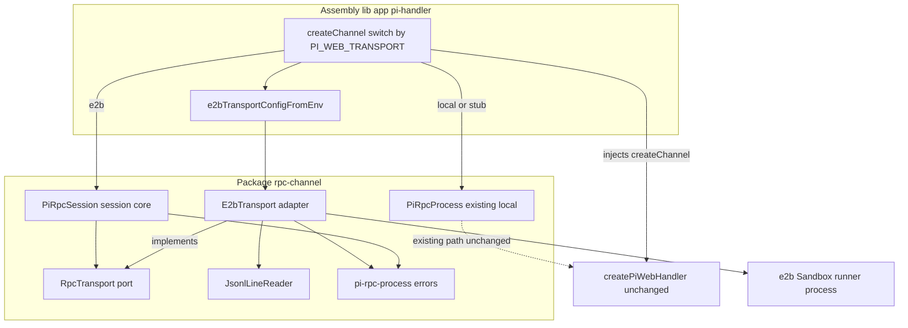

# Design Document — e2b-sandbox-transport

## Overview

**Purpose**: 为 pi-web 的会话执行桥新增一个 **e2b 云沙盒传输后端**,使 agent 子进程改在 e2b 隔离云沙盒里运行,而用户仍通过既有 pi-web 网页(SSE/HTTP 前端零改动)交互。

**Users**: pi-web 维护者与部署者。维护者获得一个可复用的「传输无关会话核心 + 可替换传输 adapter」结构;部署者可经环境变量 `PI_WEB_TRANSPORT` 在本地进程与云沙盒之间切换执行面。

**Impact**: 当前每个会话在本地 `child_process`(`PiRpcProcess`)里 spawn agent。本设计把「JSONL 分帧 + 三类消息分发 + 命令封装」从本地进程传输中剥离为传输无关的 `PiRpcSession`,并新增 `E2bTransport` 适配器;`PiRpcSession(new E2bTransport(...))` 复用同一核心。接入仅发生在 `rpc-channel` 层与装配层 `lib/app/pi-handler.ts`,组合根 `createPiWebHandler`、前端与 `@blksails/pi-web-protocol` 均不改。

### Goals
- 抽出传输无关会话核心 `PiRpcSession`,消费 `RpcTransport` 端口、产出完整 `SessionChannel`(Req 1)。
- 实现 `E2bTransport` 适配器,把传输七方法映射到 e2b 沙盒内长驻 runner 进程(Req 2)。
- 装配层按 `PI_WEB_TRANSPORT` 切换 local/e2b,缺配置清晰失败不静默回退(Req 3)。
- 前端与协议逐字节透明(Req 4);跑通 PoC 最小闭环(Req 5)。
- 单元 + 集成 + e2e 三层测试且有新鲜运行证据(Req 7)。

### Non-Goals
- **不**把既有 local `PiRpcProcess` 迁移到 `PiRpcSession`(二期消重;一期只要求复用核心时回归绿,Req 1.4)。
- **不**做跨机器附件共享、多会话沙盒复用、保活/断线重连、生产级凭据分发(均为二期,Req 6.4)。
- **不**改任何 `@blksails/pi-web-protocol` zod schema/类型,**不**改前端 transport/SSE/stream-route(Req 4.2)。
- **不**在一期沙盒会话中启用附件能力(避免本地磁盘签名 URL 401,Req 6.3)。

## Boundary Commitments

### This Spec Owns
- `RpcTransport` 传输端口契约(`packages/server/src/rpc-channel/transport.ts`)。
- 传输无关会话核心 `PiRpcSession`(`.../pi-rpc-session.ts`):分帧、三类分发、命令封装、监听器、`SessionChannel` 结构契约的产出。
- e2b 传输适配器 `E2bTransport`(`.../e2b-transport.ts`):沙盒生命周期、runner 后台进程、stdin/stdout/stderr 分流、health、错误传播。
- e2b 传输配置解析 `e2bTransportConfigFromEnv`(缺配置的清晰失败语义)。
- 装配层 `PI_WEB_TRANSPORT` 切换分支(`lib/app/pi-handler.ts` 的 `createChannel`)。
- 上述组件的单元/集成/e2e 测试。

### Out of Boundary
- 组合根 `createPiWebHandler` 及其注入面(不改)。
- 前端 react transport / SSE stream-route / 协议 schema(不改)。
- 既有 local `PiRpcProcess` 内部实现(不动;仅要求其测试保持绿)。
- 附件跨机器后端(cloud-http/UnionBlobStore)、`PI_WEB_ATTACHMENT_SECRET` 两端一致——二期锚点,仅在文档标注。
- e2b 自定义 template 的构建(PoC 前置条件:预装 node + pi + 最小 agent 源;本 spec 只约定其存在,不产出 template 制品)。

### Allowed Dependencies
- `e2b` npm SDK(新增 `@blksails/pi-web-server` 生产依赖,v1.x)。
- `@blksails/pi-web-protocol` 的既有类型(`SpawnSpec`/`AgentEvent`/`RpcResponse`/`RpcExtensionUIRequest`/`ImageContent`/`ThinkingLevel`)——只读,不改。
- `rpc-channel` 内既有原语:`JsonlLineReader`、`pi-rpc-process.errors`(`SpawnError`/`ChildCrashError`/`ChannelClosedError`)、`pi-rpc-channel` 端口类型。
- 依赖方向:`transport`(端口)← `e2b-transport`(adapter)/`pi-rpc-session`(核心)→ 二者被装配层组合。核心**不**依赖 e2b;adapter **不**依赖会话核心。

### Revalidation Triggers
- `RpcTransport` 端口方法签名变化 → e2b/未来 ssh/device adapter 与 `PiRpcSession` 需重校。
- `SessionChannel` 契约新增方法 → `PiRpcSession` 须同步补齐(与 `PiRpcProcess` 同步)。
- `CreateChannelOpts` 形状变化 → 装配层 e2b 分支需重校。
- 若二期把 local 迁到 `PiRpcSession` → 需重跑全部既有 local 测试面。

## Architecture

### Existing Architecture Analysis
- **端口已就位**:`PiRpcChannel`(`pi-rpc-channel.ts`)自设计起即为 e2b/ssh/device 预留(签名不泄漏进程/管道类型)。本 spec 是首个非 local 传输实现,验证该抽象可替换。
- **注入点已就位**:`createPiWebHandler(opts.createChannel)`(`create-handler.ts:89`,`createChannel = opts.createChannel ?? defaultCreateChannel`)。装配层 `lib/app/pi-handler.ts` 的 `createChannel` 闭包已有 stub/real 两分支,e2b 为第三分支。
- **fd1 铁律**(既有不变式):上行只走子进程 stdout 协议帧;stderr 必须分流,绝不混入 `onLine`,否则云沙盒下污染上行帧通道(掉 log 黑洞)。`RpcTransport` 以 `onLine`(仅 fd1)与 `onStderr`(分流)两方法固化该铁律。
- **就绪握手已就位**:`session-readiness-handshake` 经 `getCommands` 探针 + 粘性 `session-status` 帧 + `onRestart` 重跑探针。`E2bTransport` 的异步 boot 经 `onSpawn` 触发就绪,复用该机制容忍冷启延迟(Req 5.4)。

### Architecture Pattern & Boundary Map

选定 **Ports & Adapters**:`RpcTransport` 为端口,`E2bTransport` 与(二期)`LocalTransport` 为 adapter,`PiRpcSession` 为传输无关核心。



**Architecture Integration**:
- Selected pattern: Ports & Adapters —— 传输端口 + 可替换 adapter + 无感核心。
- Domain/feature boundaries:核心(分帧/分发/命令)⟂ 传输(沙盒/进程 IO)⟂ 装配(env 切换)。三者无共享所有权。
- Existing patterns preserved:`PiRpcChannel` 端口、`JsonlLineReader` 分帧、`pi-rpc-process.errors` 错误语义、`satisfies SessionChannel` 结构校验、`*ConfigFromEnv` 纯函数。
- New components rationale:`RpcTransport`(端口)/`PiRpcSession`(核心)/`E2bTransport`(adapter)/`e2bTransportConfigFromEnv`(配置)各为 Req 1/1/2/3 的唯一职责载体。
- Steering compliance:TypeScript strict、无 `any`、fd1 铁律、单一事实来源(协议类型不重定义)。

### Technology Stack

| Layer | Choice / Version | Role in Feature | Notes |
|-------|------------------|-----------------|-------|
| Backend / Services | `e2b` ^1.x (JS SDK) | 起沙盒 + 后台 runner + stdin/stdout/stderr | 新增 `@blksails/pi-web-server` 生产依赖 |
| Backend / Services | Node `node:crypto` `randomUUID` | 命令 id 生成 | 既有 |
| Messaging / Events | JSONL over stdin/stdout | 双向 RPC 帧 | 复用 `JsonlLineReader`,不用 `readline` |
| Infrastructure / Runtime | e2b custom template | 预装 node + pi + 最小 agent 源 | PoC 前置;非本 spec 制品 |

## File Structure Plan

### Directory Structure
```
packages/server/src/rpc-channel/
├── transport.ts              # 新增:RpcTransport 端口(传输七方法),已草拟
├── pi-rpc-session.ts         # 新增:PiRpcSession 传输无关会话核心,已草拟
├── e2b-transport.ts          # 新增:E2bTransport adapter + E2bTransportConfig,已草拟(待修 close 错误)
├── e2b-config.ts             # 新增:e2bTransportConfigFromEnv(env→E2bTransportConfig,缺配置抛错)
└── index.ts                  # 修改:barrel 追加导出 RpcTransport/PiRpcSession/E2bTransport/E2bTransportConfig/e2bTransportConfigFromEnv

packages/server/test/rpc-channel/
├── pi-rpc-session.test.ts    # 新增:mock RpcTransport 覆盖分帧/id 匹配/send/close/health/退出拒绝
├── e2b-transport.test.ts     # 新增:mock e2b SDK 覆盖 boot/outbox flush/onStdout 分帧/stderr 分流/close/health/boot 失败传播
└── e2b-transport.integration.test.ts  # 新增:真实 e2b(缺 E2B_API_KEY 时 skip),起最小 agent 跑一轮 prompt→流式回复→close

packages/server/test/
└── e2b-assembly.test.ts      # 新增:装配切换单测(PI_WEB_TRANSPORT 解析 + 缺配置清晰失败;stub 传输验证切换路径)
```

### Modified Files
- `packages/server/src/rpc-channel/index.ts` — barrel 追加 e2b 相关导出(供装配层 `@blksails/pi-web-server` 引入)。
- `packages/server/package.json` — `dependencies` 加 `e2b`。
- `lib/app/pi-handler.ts` — `buildSingleton()` 的 `createChannel` 闭包新增 `PI_WEB_TRANSPORT==="e2b"` 分支;e2b 配置经 `e2bTransportConfigFromEnv` 解析,缺配置在 createChannel 调用时抛清晰错误;e2b 分支禁用附件相关 env 注入(Req 6.3),不注入热重载(Req 6.1)。

## Components & Interfaces

| Component | Domain | Intent | Requirements | Key Dependencies | Contracts |
|-----------|--------|--------|--------------|------------------|-----------|
| `RpcTransport` | rpc-channel/端口 | 传输无关双向 JSONL 端口(七方法) | 1.1, 2.2, 2.3 | `ChannelHealth`/`ExitInfo`/`Unsubscribe`(既有) | Service |
| `PiRpcSession` | rpc-channel/核心 | 消费传输、产出 `SessionChannel` | 1.1–1.5 | `RpcTransport`、`ChannelClosedError`、协议类型 | Service |
| `E2bTransport` | rpc-channel/adapter | 传输→e2b 沙盒 runner 映射 | 2.1–2.7 | `e2b` SDK、`JsonlLineReader`、错误类 | Service |
| `e2bTransportConfigFromEnv` | rpc-channel/配置 | env→`E2bTransportConfig`,缺配置抛错 | 3.2, 3.3 | 无(纯函数) | Service |
| 装配切换分支 | assembly | 按 env 注入 createChannel | 3.1–3.4, 6.1–6.3 | 上述全部、`PiRpcSession`/`E2bTransport` | Integration |

### Component: `RpcTransport`(端口)

**Contracts**: Service。已草拟于 `transport.ts`。

```ts
export interface RpcTransport {
  send(line: string): void;                              // 写一行到 runner stdin
  onLine(cb: (line: string) => void): Unsubscribe;       // 仅 fd1 stdout 协议帧
  onStderr(cb: (chunk: string) => void): Unsubscribe;    // stderr 分流,绝不混入 onLine
  onExit(cb: (info: ExitInfo) => void): Unsubscribe;     // 进程/沙盒退出
  onSpawn(cb: () => void): Unsubscribe;                  // 就绪/重生(供就绪握手)
  close(): Promise<void>;                                // 关闭并干净退出
  health(): ChannelHealth;                               // { alive, exitCode, signal }
}
```

- **Preconditions**: `send`/`onLine` 仅在未关闭时有意义。
- **Postconditions**: `close()` resolve 后 `health().alive === false`。
- **Invariants**: 签名不泄漏 e2b/ChildProcess 类型;fd1 铁律经 `onLine`/`onStderr` 分离固化。

### Component: `PiRpcSession`(会话核心)

**Contracts**: Service。已草拟于 `pi-rpc-session.ts`。消费 `RpcTransport`,结构满足 `SessionChannel`(不 `implements` 以免 rpc-channel↔session 循环依赖;装配层 `satisfies SessionChannel` 校验)。

关键方法(与 `PiRpcProcess.#dispatchLine` 等价):
- `#dispatchLine(line)`:`JSON.parse` 失败静默忽略;`type==="response"`+`id` → 兑现待决;`type==="event"` → 广播 `onEvent`;其余 → 通知 `onExtensionUIRequest`。
- `#sendCommand(type, payload)`:`randomUUID()` 生成 id → 登记 pending → `transport.send(JSON.stringify({id,type,...payload}))` → 返回匹配 `response` 时兑现的 Promise;`send` 抛错即删 pending 并拒绝。
- 监听器:`onEvent`/`onExtensionUIRequest`/`onExit`/`onStderr`/`onRestart`。传输 `onExit` → 广播 + `ChannelClosedError` 拒绝全部待决;传输 `onSpawn` → 触发 `onRestart`。
- 命令方法(16):`prompt`/`steer`/`followUp`/`abort`/`setModel`/`cycleModel`/`getAvailableModels`/`setThinkingLevel`/`getState`/`getMessages`/`getSessionStats`/`getCommands`/`fork`/`getForkMessages`/`bash`/`abortBash` + `newSession`;`respondExtensionUI`(fire-and-forget)。
- `close()`:置关闭标志 → `transport.close()` → `ChannelClosedError` 拒绝待决。

**Implementation Notes**
- Integration:一期仅 e2b 经 `PiRpcSession` 复用;local 仍走 `PiRpcProcess`(Req 1.4 回归面)。
- Validation:mock `RpcTransport`(可编程注入行、触发 onExit/onSpawn)单测全分支(Req 7.1)。
- Risks:分帧必须复用 `JsonlLineReader`(经传输侧);核心侧只对已分好的整行 `JSON.parse`(Req 1.5)。

### Component: `E2bTransport`(adapter)

**Contracts**: Service。已草拟于 `e2b-transport.ts`。构造入参 `(spawnSpec: SpawnSpec, cfg: E2bTransportConfig)`。

```ts
export interface E2bTransportConfig {
  readonly apiKey: string;                        // e2b API key(仅服务端读)
  readonly template: string;                      // e2b template id
  readonly timeoutMs?: number;                    // 沙盒超时
  readonly runnerCmd?: string;                    // 默认 "pi --mode rpc"
  readonly sandboxCwd?: string;                   // 沙盒内工作目录
  readonly envPassthrough?: readonly string[];    // 从 spawnSpec.env 透传的键白名单
}
```

行为映射:
- **boot**(构造触发):`Sandbox.create(template, { apiKey, timeoutMs })` → `commands.run(runnerCmd, { background:true, cwd, envs, onStdout, onStderr })` → 取 `CommandHandle.pid`;`onStdout` 数据块经 `JsonlLineReader.push` 逐行喂 `onLine`;`onStderr` 直喂 `onStderr`;`#alive=true`;flush `#outbox`;触发 `onSpawn`(Req 2.1/2.2)。
- **send**:`#command` 就绪 → `commands.sendStdin(pid, line+"\n")`;未就绪 → 入 `#outbox`(Req 2.3)。
- **close**:`commands.kill(pid)` → `sandbox.kill()`;置 `#alive=false`;触发 `onExit`(reason `close`);resolve 后 `health().alive===false`(Req 2.4)。
- **health**:`{ alive: #alive && !#closed, exitCode, signal }`(Req 2.5)。
- **错误传播**(Req 2.6):boot 失败包 `SpawnError` 并经 `onExit` 通知(使核心拒绝全部待决);`sendStdin` 失败经 `onStderr` 记诊断,不静默吞。**修正点**:`close()` 中原草稿 `new ChildCrashError(message, { kind })` 与真实签名 `(code:number|null, signal:string|null, message?)` 不符,须改为 `new ChildCrashError(null, null, message)`(strict 编译门 + 单测把关)。

**Implementation Notes**
- Integration:agent 源投递 PoC 走自定义 template 预装(Req 2.7);二期用 `sbx.files.write` + 真实 `spawnSpec`。
- Validation:mock e2b SDK(可控 `Sandbox.create`/`commands.run`/`sendStdin`/`kill`/`sandbox.kill`,可注入 onStdout/onStderr 数据、boot 抛错)单测(Req 7.1)。
- Risks:`onStdout` 是数据块非行 → 必须经 `JsonlLineReader`;沙盒泄漏 → close 先 kill 进程再 kill 沙盒 + 集成测试断言。

### Component: `e2bTransportConfigFromEnv`(配置解析)

**Contracts**: Service。新增 `e2b-config.ts`。

```ts
export function e2bTransportConfigFromEnv(
  env: Record<string, string | undefined>,
): E2bTransportConfig;
```

- 读取:`E2B_API_KEY`(必需)、`PI_WEB_E2B_TEMPLATE`(必需)、`PI_WEB_E2B_TIMEOUT_MS`(可选,数字)、`PI_WEB_E2B_RUNNER_CMD`(可选)、`PI_WEB_E2B_CWD`(可选)、`PI_WEB_E2B_ENV_PASSTHROUGH`(可选,逗号分隔)。
- 缺 `E2B_API_KEY` 或 template → `throw new Error("PI_WEB_TRANSPORT=e2b 需要 E2B_API_KEY 与 PI_WEB_E2B_TEMPLATE ...")`(Req 3.3,不静默回退)。

### Component: 装配切换分支(`lib/app/pi-handler.ts`)

**Contracts**: Integration。

- 在 `buildSingleton()` 读取 `const transport = process.env.PI_WEB_TRANSPORT ?? "local"`。
- `createChannel(resolved, opts)` 分支:
  - `config.stubAgent` → 既有 stub(不变)。
  - `transport === "e2b"` → `const cfg = e2bTransportConfigFromEnv(process.env)`(缺配置在此抛,Req 3.3);组装 e2b `spawnSpec`(附会话对齐 args `--session-id`/`--model`,复用既有逻辑;**不注入附件 env**(Req 6.3)、**不注入热重载**(Req 6.1)、**不依赖 project-trust cwd**(Req 6.2));`return new PiRpcSession(new E2bTransport(spec, cfg)) satisfies SessionChannel`。
  - 否则(`local`/未设)→ 既有 real `new PiRpcProcess(spec)`(不变,Req 3.1)。

## Requirements Traceability

| Requirement | Summary | Components | Interfaces | Flows |
|-------------|---------|------------|-----------|-------|
| 1.1–1.5 | 传输无关会话核心抽取 | `PiRpcSession`、`RpcTransport` | `RpcTransport`、`SessionChannel` 结构 | send→onLine→dispatch |
| 2.1–2.7 | e2b 沙盒传输通道 | `E2bTransport` | `E2bTransportConfig`、e2b SDK | boot→run→stdin/stdout/stderr→close |
| 3.1–3.4 | 组合根按环境切换 | 装配分支、`e2bTransportConfigFromEnv` | `PI_WEB_TRANSPORT` env | createChannel switch |
| 4.1–4.3 | 前端与协议零改动 | `PiRpcSession`(同构帧) | 无新契约 | 同 local SSE 帧序列 |
| 5.1–5.4 | 最小闭环可用性 | 装配分支、`E2bTransport` | 就绪握手(既有) | 网页 prompt→沙盒 agent→流式回传 |
| 6.1–6.4 | 本地假设绕过 | 装配分支 | env 门控 | e2b 分支不注入热重载/附件/trust |
| 7.1–7.5 | 测试与验证 | 全部 + 测试文件 | mock 传输/mock e2b SDK | 单元+集成+e2e+回归 |

## Testing Strategy

按 Req 7 与既有 `test/rpc-channel/*` 风格。

- **单元 — `PiRpcSession`**(Req 7.1,1.2/1.3):mock `RpcTransport`;验证 ① 收 `response` 帧兑现对应 id 的 pending、② 收 `event` 帧广播 `onEvent`、③ 收其它帧通知 `onExtensionUIRequest`、④ 非 JSON 行静默忽略、⑤ 命令方法生成唯一 id 并经 `send` 写出、⑥ 传输 `onExit` 后全部待决被 `ChannelClosedError` 拒绝、⑦ `close()` 后新命令立即拒绝、⑧ `health()` 透传传输。
- **单元 — `E2bTransport`**(Req 7.1,2.2–2.6):mock e2b SDK;验证 ① boot 起沙盒+后台 runner(参数含 template/cwd/envs)、② `onStdout` 数据块经分帧只喂 `onLine`(含跨块半行)、③ stderr 只喂 `onStderr` 不混入 `onLine`、④ 就绪前 `send` 进 outbox、就绪后 flush 并调 `sendStdin(pid, ...)`、⑤ `close()` 先 `commands.kill` 后 `sandbox.kill` 且 `health().alive===false`、⑥ boot 失败传播 `SpawnError` 并经 `onExit` 通知。
- **单元 — 配置/装配**(Req 7.3,3.2/3.3):`e2bTransportConfigFromEnv` 缺 `E2B_API_KEY`/template 抛清晰错误、齐全时正确解析;装配切换以 stub 传输验证 `PI_WEB_TRANSPORT` 路径选择(不真连 e2b)。
- **集成 — 真实 e2b**(Req 7.2,5.1/5.2/5.3):缺 `E2B_API_KEY` 时 `skip` 并明确报告;有 key 时起最小 agent,`PiRpcSession(new E2bTransport(...))` 跑一轮 `prompt`→收到 `event` 流式回复→`close()` 后 `health().alive===false`(不泄漏沙盒)。
- **回归**(Req 7.4):既有 `test/rpc-channel/*`(`pi-rpc-process.*`、`jsonl-reader`)与会话层测试保持全绿。
- **e2e**(Req 7.3):无凭据环境以 stub/local 验证装配层切换路径不破坏既有最小闭环(既有 e2e 基线不回归)。

## Open Questions / Risks
- **真实 e2b template**:PoC 前置(预装 node+pi+最小 agent 源)。本 spec 不产出 template;集成测试在无 key/template 时 skip,CI 默认跳过真连。
- **`pi --mode rpc` 在沙盒内可用性**:依赖 template 内 pi CLI 的 dual-mode fallback;集成测试为唯一真机验证点,单测以 mock 覆盖逻辑。
- **附件二期依赖**:一期 e2b 会话禁用附件(Req 6.3),避免本地磁盘签名 URL 401;二期依赖 cloud-http/UnionBlobStore 共享后端 + 两端 `PI_WEB_ATTACHMENT_SECRET` 一致。
