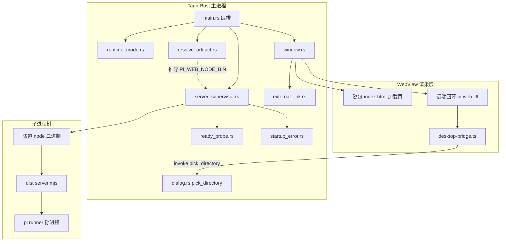
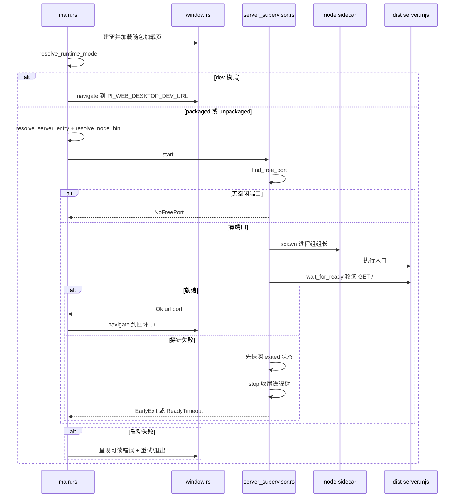
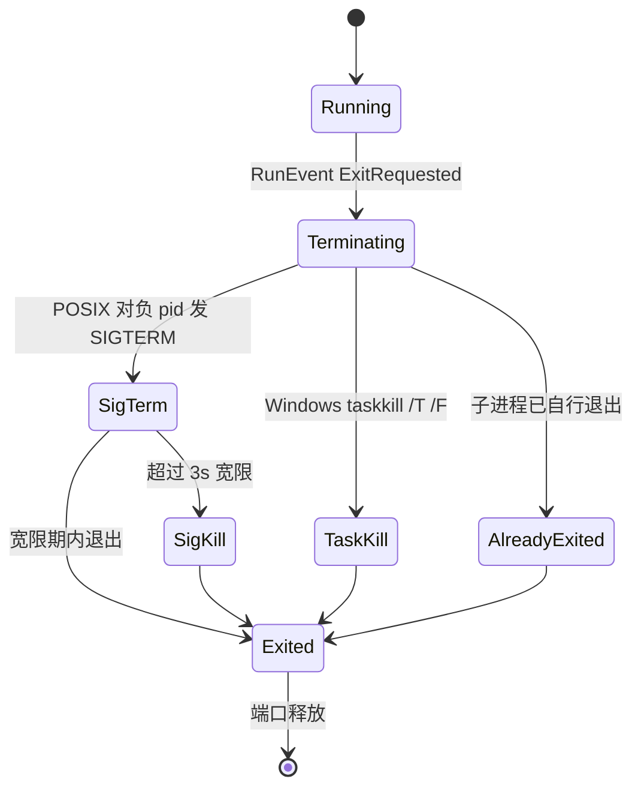
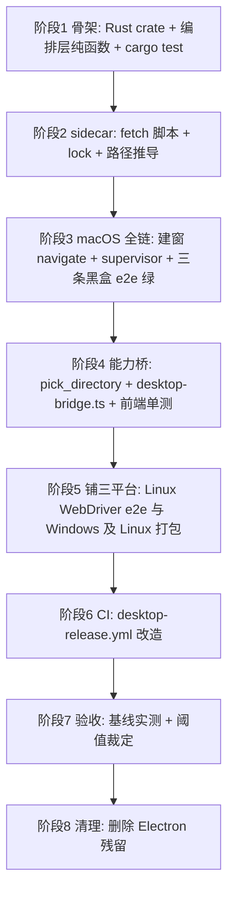

# Design Document — electron-to-tauri

## Overview

**Purpose**: 本迁移把 pi-web 桌面壳的宿主运行时由 Electron 换成 Tauri v2，以降低空闲常驻内存与冷启动开销、缩减安装包体积。桌面壳不含业务逻辑，只做四件事：拉起本地后端、开窗加载本地回环 UI、提供两项原生能力（目录选择、外链打开）、退出时收尾进程树。

**Users**: pi-web 桌面版终端用户（感知为「更轻、更快、更小」），以及维护者（感知为一条改造后的三平台发布流水线）。

**Impact**: `desktop/` 由 726 行 TypeScript（Electron 主进程 + preload，esbuild → electron-builder）原地替换为一个 Rust crate（Tauri v2 + Node sidecar，`tauri build`）。前端改动收敛为 `lib/app/desktop-bridge.ts` 一个文件的内部实现。除本文档显式列出的差异外，用户与运维者可观察的行为保持等价。

Electron 通过 `ELECTRON_RUN_AS_NODE` 让自身二进制充当 Node，从而无需系统 Node。Tauri 不捆绑 JS 运行时，故本设计以 **随包 Node 二进制（`bundle.externalBin` sidecar）** 承接该保证：`PI_WEB_NODE_BIN` 指向随包 node 的绝对路径，经 env 透传链下达 pi runner 孙进程。这是本迁移最大的工作量与体积代价来源。

### Goals

- 行为等价：Requirement 1–8 所述的一切可观察行为在替换后保持一致。
- 保住「无系统 Node 可用」保证，且以剥空 PATH 的端到端验证证明之（10.2）。
- 三平台发布流水线按目标架构展开，sidecar 二进制经入库校验和验证（9.x）。
- 以实测数据裁定迁移动机是否兑现（11.x）。

### Non-Goals

- 代码签名、公证、自动更新（沿用未签名分发现状）。
- Electron 壳与 Tauri 壳并存（已定为原地替换）。
- 新增任何 Electron 时代不存在的原生能力（托盘、通知、菜单）。
- 改动 pi-web 后端、前端 UI、会话/附件/agent 载入等任何业务逻辑。

## Boundary Commitments

### This Spec Owns

- `desktop/` 目录的全部内容：Tauri Rust crate、`tauri.conf.json`、capabilities、permissions、sidecar 二进制的获取与放置。
- 桌面壳的进程编排契约：端口选取、就绪判定、启动失败分类、进程树收尾。
- 桌面壳向渲染层暴露的能力面（当前恰为：目录选择）及其授权配置。
- `lib/app/desktop-bridge.ts` 的**内部实现**（如何探测并合成能力桥）。
- `e2e/desktop/**` 与 `.github/workflows/desktop-release.yml`。
- `scripts/fetch-node-sidecar.mjs` 与 `desktop/node-sidecar.lock.json`。

### Out of Boundary

- `PiWebDesktopBridge` 的**公开接口形状**（本设计承诺不改；消费方 `components/chat-app.tsx` 与 `components/agent-source-picker.tsx` 零改动）。
- 自包含产物 `dist/` 的构建方式（`pnpm build:dist` / `scripts/pack-dist.mjs`）。本设计只消费其产物，且依赖「入口恒为产物根 `dist/server.mjs`」。
- pi-web 后端的就绪语义（`GET /` 返回任意响应即就绪）。本设计只复用，不定义。
- `bin/pi-web.mjs` 的 CLI 行为。本设计**不再从中内联代码**，也不修改它。
- 代码签名 / 公证 / 自动更新。
- `~/.pi/agent` 目录的结构与语义。

### Allowed Dependencies

- Tauri v2（**≥ 2.11.1**，因安全公告 GHSA-7gmj-67g7-phm9；实测编译到 2.11.5）、`tauri-plugin-dialog`、`tauri-plugin-opener`。
- Node.js 官方发布的二进制（v22.22.0，与 `tech.md` 的 `>=22.19.0` 约束一致）。
- 自包含产物 `dist/`（只读消费）。
- 前端仅可依赖 `window.__TAURI__`（PoC 实证在远端回环页面可用），不得依赖任何 Tauri npm 包（远端页面无法 import 随包模块）。

### Revalidation Triggers

以下变更须触发依赖方重新验证：

- `PiWebDesktopBridge` 接口形状变化 → `components/chat-app.tsx`、`components/agent-source-picker.tsx`、`test/desktop-bridge.test.ts`。
- 自包含产物入口位置离开产物根（`dist/server.mjs`）→ `resolve_artifact` 与 packaged e2e。
- 后端就绪语义变化（不再是 `GET /` 任意响应）→ Rust `wait_for_ready` 与 `bin/pi-web.mjs` 两侧。
- `buildEnv` 注入键表变化 → Rust `build_env` 与 CLI 两侧。
- sidecar 落盘位置或 Node 版本变化 → `resolve_artifact`、`node-sidecar.lock.json`、发布流水线矩阵。

## Architecture

### Existing Architecture Analysis

现有 Electron 壳的分层是清晰的，本设计逐层对应迁移，不重新发明结构：

| Electron 侧 | 职责 | Tauri 侧对应 |
|---|---|---|
| `src/runtime-mode.ts` | dev/packaged/unpackaged 判定 | `runtime_mode.rs` |
| `src/resolve-artifact.ts` | 产物入口定位 | `resolve_artifact.rs`（并新增 sidecar 路径推导） |
| `src/server-supervisor.ts` | 端口/spawn/就绪/收尾 | `server_supervisor.rs` + `ready_probe.rs` |
| `src/startup-error.ts` | 失败三态可读描述 | `startup_error.rs` |
| `src/external-link.ts` | 外链放行判定 | `external_link.rs` |
| `src/dialog-bridge.ts` | 目录选择 IPC handler | `dialog.rs`（`pick_directory` command） |
| `src/window.ts` | 窗口 + 加载页 + 外链 handler | `window.rs` |
| `src/preload.ts` | contextBridge 注入 `window.piWebDesktop` | **无对应**：改由前端 `desktop-bridge.ts` 探测 `window.__TAURI__` 合成 |
| `src/main.ts` | 编排 + before-quit 收尾 | `main.rs` + `RunEvent::ExitRequested` |
| `build.mjs`（esbuild 内联 CLI 原语） | — | **消失**：原语在 Rust 侧重实现 |
| `electron-builder.yml` | 打包 | `tauri.conf.json` |

必须保留的既有约束（违反即运行时崩溃，非风格问题）：

- **入口必须在产物根**：supervisor 以 `dirname(server.mjs)` 作子进程 cwd，否则 `packages/server` 的路径解析回退失效。
- **产物必须是真实文件**：被 spawn 的 node 子进程要用真实路径动态加载用户代码。Electron 侧靠 `extraResources` 逃出 asar；Tauri 的 `bundle.resources` 本就是真实文件，此坑自然消失。
- **就绪超时与后端早退不得混淆**：探针失败时必须先快照进程退出状态，再收尾。

### Architecture Pattern & Boundary Map



**Architecture Integration**:

- **Selected pattern**：分层纯函数 + 一个有状态的 supervisor。编排层（端口、就绪、错误分类、路径解析、外链判定、目录归一化）全部为**不依赖 Tauri 运行时的纯函数**，由 `cargo test` 直接覆盖；只有 `main.rs`/`window.rs`/`dialog.rs` 触碰 Tauri API。这直接沿袭 Electron 侧「纯逻辑与宿主 API 分离」的既有设计（`test/desktop/*.test.ts` 正是这样测的）。
- **Domain boundaries**：Rust 主进程拥有一切进程与窗口决策；渲染层只拥有 UI；两者之间的唯一通路是白名单化的 `pick_directory` command。
- **Dependency direction**：`types → runtime_mode / external_link / startup_error`（叶子纯函数）`→ ready_probe → resolve_artifact → server_supervisor → window → main`。每个模块只依赖其左侧。`dialog.rs` 是独立叶子，仅被 `main.rs` 注册。**任何反向导入视为错误。**
- **New components rationale**：`ready_probe.rs` 独立出来，因为它是与 `bin/pi-web.mjs` 存在分叉风险的唯一模块，需要单独的契约测试锁定。

### Technology Stack

| Layer | Choice / Version | Role in Feature | Notes |
|-------|------------------|-----------------|-------|
| 桌面宿主 | Tauri `2.11.5`（约束 ≥2.11.1） | 窗口、WebView、IPC、打包 | ≥2.11.1 因 GHSA-7gmj-67g7-phm9 |
| 宿主语言 | Rust（edition 2021，toolchain 1.92） | 主进程编排 | 本机已装 `aarch64-apple-darwin` + `x86_64-apple-darwin` target |
| 原生对话框 | `tauri-plugin-dialog` v2 | `pick_folder` | 仅 Rust 侧调用；渲染层不直接授权 `dialog:allow-open` |
| 外链 | `tauri-plugin-opener` v2 | 交系统默认浏览器 | 仅 Rust 侧调用 |
| 随包 JS 运行时 | Node `v22.22.0` 官方二进制（`strip` 后） | 执行 `dist/server.mjs` 及 pi runner | 经 `bundle.externalBin` |
| 前端 | 现有 pi-web 前端（无新依赖） | — | 仅 `desktop-bridge.ts` 内部实现变更 |
| 打包 | `tauri build`（dmg / nsis / appimage） | 三平台安装包 | 替换 electron-builder |
| CI | `tauri-apps/tauri-action` | 按 target triple 矩阵构建并附加 Release | 替换 electron-builder 矩阵 |
| e2e | Node 黑盒脚本（macOS）+ `tauri-driver` + WebdriverIO（Linux） | 见 Testing Strategy | Playwright `_electron` 全部退场 |

## File Structure Plan

### Directory Structure

```
desktop/
├── package.json                  # 保留包名 @blksails/pi-web-desktop 与 workspace 成员身份;
│                                 # scripts 改为驱动 tauri CLI;移除 electron/electron-builder/esbuild
├── node-sidecar.lock.json        # Node 版本 + 每 target triple 的期望 sha256(信任锚点)
├── src-tauri/
│   ├── Cargo.toml
│   ├── build.rs                  # tauri_build::build()
│   ├── tauri.conf.json           # externalBin / resources / withGlobalTauri / bundle targets
│   ├── icons/icon.png            # 必需(缺失则 generate_context! 编译期 panic)
│   ├── binaries/                 # gitignored;由 fetch-node-sidecar.mjs 填入 node-<triple>
│   ├── capabilities/
│   │   └── default.json          # windows:["main"] + remote.urls 回环白名单 + permissions
│   ├── permissions/
│   │   ├── pick-directory.toml   # allow-pick-directory(远端来源调自定义 command 的前提)
│   │   └── lifecycle.toml        # allow-retry / allow-quit(错误页两个按钮;缺则被 ACL 拒)
│   ├── frontend/
│   │   └── index.html            # 随包加载页 + 错误页(即原 static/loading.html);frontendDist 指向此处
│   └── src/
│       ├── main.rs               # 编排 + RunEvent::ExitRequested 收尾
│       ├── types.rs              # RuntimeMode / ServerStartError / ServerStartOutcome 等判别式类型
│       ├── runtime_mode.rs       # dev / packaged / unpackaged 判定
│       ├── external_link.rs      # 外链放行判定(纯函数)
│       ├── startup_error.rs      # 失败三态 → 可读描述(纯函数)
│       ├── ready_probe.rs        # find_free_port + wait_for_ready(与 CLI 的契约同步点)
│       ├── resolve_artifact.rs   # server.mjs 入口 + sidecar node 绝对路径推导
│       ├── server_supervisor.rs  # spawn / 就绪 / 判别式错误 / 幂等进程树收尾
│       ├── dialog.rs             # pick_directory command + 归一化纯函数 + env stub 接缝
│       └── window.rs             # 建窗、加载页、navigate、外链 handler
└── (删除) src/*.ts, build.mjs, electron-builder.yml, tsconfig.json, static/

scripts/
├── fetch-node-sidecar.mjs        # 下载 + 比对入库 sha256 + strip + 重命名为 node-<triple>
└── measure-desktop-baseline.mjs  # RSS / 冷启动 / 包体 三项实测(迁移前后同口径)

e2e/desktop/
├── shared.mjs                    # 黑盒 e2e 共用:mock provider / 临时 agentDir / 端口探测 / 进程断言
├── desktop-real.mjs              # 未打包真实会话(黑盒)
├── desktop-no-node.mjs           # 剥空 PATH + 真实会话 + 退出后端口释放(不可降级)
├── desktop-packaged.mjs          # 已打包产物真实会话(捕获资源缺失类回归)
└── webdriver/
    ├── wdio.conf.mjs             # Linux CI: tauri-driver + WebKitWebDriver + xvfb
    └── bridge.e2e.mjs            # 经桥 invoke pick_directory + 严格 CSP 下 invoke 复验
```

### Modified Files

- `lib/app/desktop-bridge.ts` — **仅内部实现**：`getPiWebDesktopBridge()` 优先读 `window.piWebDesktop`（向后兼容），否则检测 `window.__TAURI__` 并合成同形状桥。`PiWebDesktopBridge` 接口不变。
- `test/desktop-bridge.test.ts` — 增补 `__TAURI__` 注入态用例；保留既有三条（无注入 / 有桥 / 旧壳无 `pickDirectory`）。
- `package.json`（根） — `e2e:desktop:*` 三条脚本指向改造后的黑盒脚本；新增 `e2e:desktop:webdriver`、`desktop:sidecar`、`desktop:baseline`。
- `pnpm-workspace.yaml` — 不变（`desktop` 仍是成员）。
- `.github/workflows/desktop-release.yml` — 全面改造（见 Components）。

### Deleted Files

`desktop/src/*.ts`（8 个）、`desktop/build.mjs`、`desktop/electron-builder.yml`、`desktop/tsconfig.json`、`desktop/static/`、`desktop/src/bin-pi-web.d.ts`、`test/desktop/*.test.ts`（7 个，其行为契约迁入 Rust `#[cfg(test)]`）、`e2e/desktop/desktop-directory-picker.mjs`（其覆盖迁入 Linux WebDriver e2e）。

## System Flows

### 启动流程（含失败分支）



关键决策（不重复图中步骤）：

- **快照先于收尾**：`stop()` 会使子进程退出，若在收尾后再读退出状态，`ReadyTimeout` 会被误判成 `EarlyExit`。这是 Electron 侧已踩过并修复的坑，Rust 侧必须复刻其时序。
- **加载页不是空窗口**：窗口在任何后端动作之前即加载随包 `index.html`，故 dev 与失败分支都不会出现白屏（1.4）。

### 退出收尾



幂等性由「取走并置空持有的子进程句柄」保证：重复调用 `stop()` 时句柄已空，直接返回。

## Requirements Traceability

| Requirement | Summary | Components | Interfaces | Flows |
|---|---|---|---|---|
| 1.1 | dev 模式加载开发地址不拉起后端 | `runtime_mode.rs`, `main.rs` | `resolve_runtime_mode` | 启动流程 |
| 1.2 | packaged 从随包资源定位入口 | `resolve_artifact.rs` | `resolve_server_entry` | 启动流程 |
| 1.3 | unpackaged 从构建产物定位入口 | `resolve_artifact.rs` | `resolve_server_entry` | 启动流程 |
| 1.4 | 未就绪时显示加载页 | `window.rs` | 随包 `frontend/index.html` | 启动流程 |
| 1.5 | 就绪后加载回环地址 | `window.rs`, `main.rs` | `WebviewWindow::navigate` | 启动流程 |
| 1.6 | macOS Dock 激活重开窗口 | `main.rs` | `RunEvent::Reopen` | — |
| 1.7 | 非 macOS 窗口全关即退出 | `main.rs` | `RunEvent::WindowEvent` | — |
| 2.1 | 递增探测选空闲回环端口 | `ready_probe.rs` | `find_free_port` | 启动流程 |
| 2.2 | 轮询 `GET /` 任意响应即就绪 | `ready_probe.rs` | `wait_for_ready` | 启动流程 |
| 2.3 | 后端早退立即停止轮询 | `server_supervisor.rs` | `ServerStartError::EarlyExit` | 启动流程 |
| 2.4 | 60s 未就绪且进程存活 → 就绪超时 | `ready_probe.rs`, `server_supervisor.rs` | `ServerStartError::ReadyTimeout` | 启动流程 |
| 2.5 | 无空闲端口且不启动进程 | `server_supervisor.rs` | `ServerStartError::NoFreePort` | 启动流程 |
| 2.6 | 失败时收尾已拉起进程 | `server_supervisor.rs` | `stop` | 启动流程 |
| 2.7 | 超时与早退不混淆 | `server_supervisor.rs` | 快照先于 `stop` | 启动流程 |
| 3.1 | 失败呈现区分三类的可读说明 | `startup_error.rs`, `window.rs` | `describe_startup_error` | 启动流程 |
| 3.2 | 早退含退出码与 stderr 尾部 | `startup_error.rs`, `server_supervisor.rs` | `EarlyExit { code, stderr_tail }` | — |
| 3.3 | 就绪超时含等待时长 | `startup_error.rs` | `ReadyTimeout { timeout_ms }` | — |
| 3.4 | 早退无 stderr 仍可读 | `startup_error.rs` | — | — |
| 3.5 | 重试重跑完整拉起 | `main.rs`, `window.rs` | `retry` command | 启动流程 |
| 3.6 | 退出选项退出应用 | `main.rs`, `window.rs` | `quit` command | — |
| 4.1 | 退出前终止进程及子孙 | `server_supervisor.rs`, `main.rs` | `stop` / `ExitRequested` | 退出收尾 |
| 4.2 | 收尾幂等 | `server_supervisor.rs` | `stop` | 退出收尾 |
| 4.3 | 已自行退出则跳过 | `server_supervisor.rs` | `stop` | 退出收尾 |
| 4.4 | 宽限期后强制终止 | `server_supervisor.rs` | SIGTERM→3s→SIGKILL | 退出收尾 |
| 4.5 | 退出后端口可再占 | `server_supervisor.rs` | — | 退出收尾 |
| 5.1 | 随包携带匹配架构的 JS 运行时 | `tauri.conf.json`, `fetch-node-sidecar.mjs` | `bundle.externalBin` | — |
| 5.2 | 用随包运行时执行后端入口 | `server_supervisor.rs`, `resolve_artifact.rs` | `resolve_node_bin` | 启动流程 |
| 5.3 | 经 env 下达运行时绝对路径 | `resolve_artifact.rs`, `server_supervisor.rs` | `PI_WEB_NODE_BIN` | 启动流程 |
| 5.4 | 剥空 PATH 下真实会话跑通 | 全链 | — | `desktop-no-node.mjs` |
| 5.5 | 不注入 agentDir，与 CLI 共享 | `server_supervisor.rs` | `build_env` 不含 `PI_WEB_AGENT_DIR` | — |
| 6.1 | 暴露形状一致的能力桥 | `lib/app/desktop-bridge.ts` | `PiWebDesktopBridge` | — |
| 6.2 | 调用打开原生文件夹对话框 | `dialog.rs` | `pick_directory` | — |
| 6.3 | 仅回传绝对路径字符串 | `dialog.rs` | `normalize_pick_result` | — |
| 6.4 | 取消/无选择回传无结果 | `dialog.rs` | `normalize_pick_result` | — |
| 6.5 | 异常降级为无结果不 reject | `dialog.rs` | `normalize_pick_result` | — |
| 6.6 | 不回传目录内容或元数据 | `dialog.rs` | 返回类型 `Option<String>` | — |
| 6.7 | 浏览器态读不到桥、不渲染入口 | `lib/app/desktop-bridge.ts` | `getPiWebDesktopBridge` 返回 `undefined` | — |
| 7.1 | 外部 http(s) 交系统浏览器 | `external_link.rs`, `window.rs` | `decide_external_open` | — |
| 7.2 | 回环地址拒绝 | `external_link.rs` | `decide_external_open` | — |
| 7.3 | 非 http(s) scheme 拒绝 | `external_link.rs` | `decide_external_open` | — |
| 7.4 | 非法地址拒绝不抛错 | `external_link.rs` | `decide_external_open` | — |
| 8.1 | 后端仅监听回环 | `server_supervisor.rs` | `HOSTNAME=127.0.0.1` | — |
| 8.2 | 端口按可用性选取 | `ready_probe.rs` | `find_free_port` | — |
| 8.3 | 仅授予明确需要的能力 | `capabilities/default.json`, `permissions/` | `allow-pick-directory` | — |
| 8.4 | 授权来源限定回环 | `capabilities/default.json` | `remote.urls` | — |
| 8.5 | 不新增宿主能力 | `capabilities/default.json` | — | — |
| 9.1 | 四目标产出安装包 | `desktop-release.yml` | 矩阵 | — |
| 9.2 | 按目标架构展开矩阵 | `desktop-release.yml` | `--target <triple>` | — |
| 9.3 | 为该架构准备匹配 sidecar | `fetch-node-sidecar.mjs` | — | — |
| 9.4 | 校验和失败即构建失败 | `fetch-node-sidecar.mjs`, `node-sidecar.lock.json` | 非零退出 | — |
| 9.5 | 单平台失败不阻断其余 | `desktop-release.yml` | `fail-fast: false` | — |
| 9.6 | tag 触发时附加到 Release | `desktop-release.yml` | `tauri-action` `tagName` | — |
| 9.7 | 手动触发只产出工作流产物 | `desktop-release.yml` | 条件化 `tagName` | — |
| 9.8 | 附加前对打包产物做真实会话冒烟 | `desktop-packaged.mjs`, `desktop-release.yml` | — | — |
| 9.9 | Linux 可执行名不含非法字符 | `tauri.conf.json` | `productName: pi-web` | — |
| 10.1 | 覆盖迁移前四条 e2e 的可观察事实 | `e2e/desktop/**` | — | — |
| 10.2 | no-node 实际剥 PATH，不得降级 | `desktop-no-node.mjs` | — | — |
| 10.3 | packaged 用实际打包产物 | `desktop-packaged.mjs` | — | — |
| 10.4 | 无 WebView 驱动的平台走黑盒 | `e2e/desktop/*.mjs`（macOS） | — | — |
| 10.5 | 编排逻辑有非 GUI 自动化测试 | Rust `#[cfg(test)]` | `cargo test` | — |
| 10.6 | 以实际运行输出为证据 | 全部验证脚本 | — | — |
| 11.1 | 空闲常驻内存实测对比 | `measure-desktop-baseline.mjs` | — | — |
| 11.2 | 冷启动耗时实测对比 | `measure-desktop-baseline.mjs` | — | — |
| 11.3 | 三平台包体实测对比 | `measure-desktop-baseline.mjs`, `desktop-release.yml` | — | — |
| 11.4 | 包体对比显式计入 sidecar | `measure-desktop-baseline.mjs` | — | — |
| 11.5 | 净收益不显著则交回裁定 | 验收报告 | 阈值 0.75 | — |
| 11.6 | 不以理论论证替代实测 | 验收报告 | — | — |

## Components and Interfaces

| Component | Domain/Layer | Intent | Req Coverage | Key Dependencies (P0/P1) | Contracts |
|---|---|---|---|---|---|
| `types.rs` | 基础类型 | 判别式类型定义 | 2.3–2.5, 3.1–3.3 | — | State |
| `runtime_mode.rs` | 编排·叶子 | 三态运行模式判定 | 1.1–1.3 | — | Service |
| `external_link.rs` | 编排·叶子 | 外链放行判定 | 7.1–7.4 | — | Service |
| `startup_error.rs` | 编排·叶子 | 失败三态可读描述 | 3.1–3.4 | `types.rs` (P0) | Service |
| `ready_probe.rs` | 编排 | 端口选取与就绪探针 | 2.1, 2.2, 2.4, 8.2 | — | Service |
| `resolve_artifact.rs` | 编排 | 入口与 sidecar 路径推导 | 1.2, 1.3, 5.2, 5.3 | `runtime_mode.rs` (P0) | Service |
| `server_supervisor.rs` | 编排·有状态 | spawn / 就绪 / 错误 / 树收尾 | 2.3, 2.5–2.7, 4.1–4.5, 5.2, 5.3, 5.5, 8.1 | `ready_probe.rs` (P0), `resolve_artifact.rs` (P0) | Service, State |
| `dialog.rs` | 宿主能力 | `pick_directory` command | 6.2–6.6 | `tauri-plugin-dialog` (P0) | API |
| `window.rs` | 宿主 UI | 建窗、加载页、navigate、外链 | 1.4, 1.5, 3.1, 7.1 | `external_link.rs` (P0), `tauri-plugin-opener` (P1) | Service |
| `main.rs` | 编排入口 | 生命周期与退出收尾 | 1.1–1.7, 3.5, 3.6, 4.1 | 全部 (P0) | Service |
| `capabilities/` + `permissions/` | 安全配置 | 能力白名单 | 8.3–8.5 | — | State |
| `lib/app/desktop-bridge.ts` | 前端 | 能力桥探测与合成 | 6.1, 6.7 | `window.__TAURI__` (P0) | Service |
| `fetch-node-sidecar.mjs` | 构建 | sidecar 获取与校验 | 5.1, 9.3, 9.4 | `node-sidecar.lock.json` (P0) | Batch |
| `desktop-release.yml` | CI | 三平台四架构发布 | 9.1–9.9 | `tauri-action` (P0) | Batch |
| `measure-desktop-baseline.mjs` | 验收 | 内存/启动/包体实测 | 11.1–11.4 | — | Batch |

### 编排层（Rust，不依赖 Tauri 运行时）

#### ready_probe.rs

| Field | Detail |
|-------|--------|
| Intent | 端口选取与后端就绪判定；与 `bin/pi-web.mjs` 的唯一契约同步点 |
| Requirements | 2.1, 2.2, 2.4, 8.2 |

**Responsibilities & Constraints**

- 拥有「什么算就绪」的 Rust 侧实现，但**不拥有该语义的定义**（定义属 pi-web 后端）。
- 与 `bin/pi-web.mjs` 存在实现分叉风险，故其行为由下表锁定为单一事实源，两侧单测各自断言。

**就绪与端口契约（单一事实源）**

| 行为 | 取值 | 说明 |
|---|---|---|
| 端口探测起点 | `PI_WEB_DESKTOP_PORT` 或 `3000` | 递增 |
| 最大尝试次数 | `20` | 超出返回「无空闲端口」 |
| 「被占」判据 | TCP `connect` 成功 | — |
| 「空闲」判据 | `connect` 出错，或 `1000ms` 超时 | — |
| 探测主机映射 | `0.0.0.0` / `::` → `127.0.0.1` | 通配不可 connect |
| 就绪探测端点 | `GET /` | — |
| 就绪判据 | **任何 HTTP 响应**（不看状态码） | 与 CLI 一致 |
| 就绪轮询间隔 | `300ms` | — |
| 就绪总超时 | `60_000ms` | 对应 3.3 的「等待时长」 |
| 单次请求超时 | `2_000ms` | — |
| 中止条件 | 子进程已退出 → 立即失败 | 对应 2.3 |

**Contracts**: Service [x]

```rust
pub fn find_free_port(host: &str, start_port: u16, max_tries: u16) -> Option<u16>;

/// `is_exited` 由调用方注入（读子进程退出状态），使本函数可脱离进程管理单测。
pub fn wait_for_ready(host: &str, port: u16, is_exited: &dyn Fn() -> bool) -> Result<(), ReadyError>;

pub enum ReadyError { Aborted, Timeout { timeout_ms: u64 } }
```

- Preconditions：`start_port >= 1`。
- Postconditions：`find_free_port` 返回的端口在返回瞬间空闲（TOCTOU 由后续 spawn 失败兜底）。
- Invariants：`wait_for_ready` 在 `is_exited()` 为真时**必须**在下一个轮询点前返回 `Aborted`。

**Implementation Notes**

- Integration：`server_supervisor` 注入 `is_exited` 闭包，读 `Child::try_wait()`。
- Validation：`cargo test` 覆盖——全占端口返回 `None`；`0.0.0.0` 映射；就绪即返回；`is_exited` 触发 `Aborted`；超时返回 `Timeout`。
- Risks：与 CLI 分叉（R6）。缓解见上表 + 两侧单测。

#### resolve_artifact.rs

| Field | Detail |
|-------|--------|
| Intent | 按运行模式推导后端入口，以及随包 node 的绝对路径 |
| Requirements | 1.2, 1.3, 5.2, 5.3 |

**Responsibilities & Constraints**

- **硬约束**：返回的 `server.mjs` 必须位于产物根，其 `dirname` 即子进程 cwd。
- sidecar 与主可执行**同目录**（macOS `Contents/MacOS/`），而 `dist/` 在 `resource_dir()`（macOS `Contents/Resources/`）—— 两者路径来源不同，不可混用。

**Contracts**: Service [x]

```rust
pub struct ArtifactPaths { pub server_js: PathBuf, pub node_bin: PathBuf }

/// dev 模式返回 None（不拉起后端）。
pub fn resolve_artifact(mode: &RuntimeMode, deps: &ResolveDeps) -> Result<Option<ArtifactPaths>, ResolveError>;

pub struct ResolveDeps {
    /// packaged 态：app.path().resource_dir()
    pub resource_dir: Option<PathBuf>,
    /// current_exe()?.parent()?  —— sidecar 落盘目录
    pub exe_dir: PathBuf,
    /// unpackaged 态：构建产物布局下的 server.mjs（e2e 经 PI_WEB_DESKTOP_SERVER_JS 覆盖）
    pub cli_dist_server_js: Option<PathBuf>,
}
```

- Postconditions：`node_bin` 为 `exe_dir.join("node")`（Windows 为 `node.exe`）；packaged 的 `server_js` 为 `resource_dir/dist/server.mjs`。
- Errors：packaged 缺 `resource_dir` → `ResolveError::MissingResourceDir`；unpackaged 缺 `cli_dist_server_js` → `ResolveError::MissingCliEntry`。

**Implementation Notes**

- Risks：R4（跨平台路径推导错误）。仅 `desktop-packaged.mjs` 能抓到此类回归；单测按平台分别断言。

#### server_supervisor.rs

| Field | Detail |
|-------|--------|
| Intent | 受监管拉起后端并幂等收尾其进程树 |
| Requirements | 2.3, 2.5–2.7, 4.1–4.5, 5.2, 5.3, 5.5, 8.1 |

**Responsibilities & Constraints**

- 拥有子进程句柄，是唯一有状态组件。
- 以 `std::process::Command` spawn（**不用** `tauri_plugin_shell`，其 Command 不暴露进程组，`kill()` 触不到 pi runner 孙进程）。
- POSIX：`process_group(0)` 使子进程成组长，收尾时对**负 pid** 发信号。Windows：`taskkill /PID <pid> /T /F`。
- **不注入 `PI_WEB_AGENT_DIR`**（5.5），使会话落 `~/.pi/agent` 与 CLI 共享。

**子进程环境变量注入表（单一事实源，对齐 `bin/pi-web.mjs` 的 `buildEnv`）**

| 键 | 取值 | 条件 |
|---|---|---|
| `PORT` | 实际选中端口 | 恒有 |
| `HOSTNAME` | `127.0.0.1` | 恒有（8.1） |
| `PI_WEB_AUTOSTART` | `1` | 恒有 |
| `PI_WEB_DEFAULT_SOURCE` | 绝对化后的源路径 | 有默认源时 |
| `PI_WEB_DEFAULT_CWD` | 默认 cwd | 恒有 |
| `PI_WEB_NODE_BIN` | 随包 node 绝对路径 | 恒有（5.3） |
| `PI_WEB_AGENT_DIR` | — | **永不注入**（5.5） |
| `ELECTRON_RUN_AS_NODE` | — | **移除**（Tauri 下无意义） |

**Contracts**: Service [x] / State [x]

```rust
pub struct ServerStartOptions {
    pub server_js: PathBuf,
    pub node_bin: PathBuf,
    pub host: String,
    pub start_port: u16,
    pub base_env: BTreeMap<String, String>,
}

pub enum ServerStartError {
    NoFreePort { tried_from: u16 },
    EarlyExit { code: Option<i32>, stderr_tail: String },
    ReadyTimeout { timeout_ms: u64 },
}

impl ServerSupervisor {
    pub fn start(&mut self, opts: ServerStartOptions) -> Result<ServerStartResult, ServerStartError>;
    /// 幂等；已退出则跳过；POSIX SIGTERM → 3s 宽限 → SIGKILL；Windows taskkill /T /F。
    pub fn stop(&mut self);
}
```

- **Invariant（2.7，最易复刻错）**：`wait_for_ready` 失败后，**必须先读取子进程退出状态快照**，再调用 `stop()`。否则 `stop()` 使进程退出，`ReadyTimeout` 被误判为 `EarlyExit`。
- Postconditions：`start` 返回 `Err` 时，其 spawn 的进程树已被收尾（2.6，不留孤儿）。
- stderr 尾部保留上限 `4096` 字节（对齐 Electron 侧）。

**Implementation Notes**

- Integration：`main.rs` 在 `RunEvent::ExitRequested` 时 `stop()` 后再放行退出。
- Validation：`cargo test` 覆盖——就绪成功；早退（带码与 stderr）；无空闲端口时**不 spawn**；就绪超时且已收尾；`stop` 幂等；`stop` 后孙进程不存活且端口可再占。
- Risks：R2、R3。

### 宿主能力层（Rust，依赖 Tauri）

#### dialog.rs

| Field | Detail |
|-------|--------|
| Intent | 向渲染层暴露受控的目录选择能力 |
| Requirements | 6.2–6.6 |

**Responsibilities & Constraints**

- 唯一暴露给渲染层的 command。仅回传绝对路径字符串；**绝不**回传目录内容或 fs 元数据（6.6，由返回类型 `Option<String>` 静态保证）。
- 取消 / 无选择 / 异常 → 一律 `None`（6.4、6.5），不使 IPC reject。异常记 stderr。
- **可测接缝**：读到非空 `PI_WEB_DESKTOP_STUB_PICK_DIR` 时直接返回该路径、不弹对话框。该 env 不出现在任何随包默认环境中。

**Contracts**: API [x]

| Command | 参数 | 返回 | 错误 |
|---|---|---|---|
| `pick_directory` | 无 | `Option<String>`（绝对路径 / 无结果） | 不返回错误（异常降级为 `None`） |

```rust
/// 归一化纯函数（不依赖 Tauri 运行时，供 cargo test 直接覆盖）。
pub fn normalize_pick_result(result: Result<Option<PathBuf>, DialogError>) -> Option<String>;

#[tauri::command]
pub async fn pick_directory(app: tauri::AppHandle) -> Option<String>;
```

**授权配置（8.3、8.4）**

```toml
# permissions/pick-directory.toml —— 远端来源调用应用自身 command 的前提（PoC 实证：缺此则被 ACL 拒）
[[permission]]
identifier = "allow-pick-directory"
commands.allow = ["pick_directory"]
```

```json
// capabilities/default.json
{
  "identifier": "pi-web-desktop",
  "windows": ["main"],
  "remote": { "urls": ["http://127.0.0.1:*", "http://127.0.0.1:*/*"] },
  "permissions": ["core:default", "allow-pick-directory", "allow-retry", "allow-quit"]
}
```

- **不**授予 `dialog:allow-open`：对话框由 Rust 侧调用，渲染层无需该 permission。
- `remote.urls` 只含回环，落实 8.4。

**Implementation Notes**

- Risks：stub env 是生产二进制中的测试分支。其风险面被限制为「仅改变对话框来源」——不放宽任何 permission、不改变返回类型、不回传目录内容，故不构成 8.5 意义上的新增能力。`cargo test` 断言 env 缺失时走真实对话框路径。

#### window.rs

| Field | Detail |
|-------|--------|
| Intent | 建窗、加载页、就绪后导航、外链治理、错误呈现 |
| Requirements | 1.4, 1.5, 3.1, 7.1 |

**Responsibilities & Constraints**

- 窗口以 `WebviewUrl::App("index.html")` 建立（随包加载页），**先于**任何后端动作 → 保证不出现空白窗口（1.4）。
- 后端就绪后 `WebviewWindow::navigate(url)` 切至回环 UI（1.5）。
- 启动失败时 navigate 回随包错误页并附带 `describe_startup_error` 的文案（3.1）。
- 外链：`on_navigation` / 新窗请求经 `decide_external_open` 判定，`open-external` 交 `tauri-plugin-opener`，其余一律拒绝且不在应用内开新窗（7.1–7.4）。

**Implementation Notes**

- Integration：`frontendDist` 指向 `src-tauri/frontend/`，其 `index.html` 即原 `static/loading.html`（同时承载加载态与错误态，由 query 或 `postMessage` 切换）。

#### main.rs

| Field | Detail |
|-------|--------|
| Intent | 生命周期编排与退出收尾 |
| Requirements | 1.1–1.7, 3.5, 3.6, 4.1 |

**Responsibilities & Constraints**

- `setup`：建窗 → 判模式 → dev 直接 navigate；否则解析路径 → `supervisor.start()` → 成功 navigate / 失败呈现错误。
- `RunEvent::ExitRequested`：`api.prevent_exit()` 一次 → `supervisor.stop()` → 放行退出（4.1）。以布尔标志防重入。
- `RunEvent::Reopen`（macOS）：无窗口时重开（1.6）。
- 非 macOS 窗口全关 → `app.exit(0)`（1.7）。
- `retry` / `quit` 两个 command 服务错误页（3.5、3.6）。**它们同样是应用自身的 command，必须在 `permissions/lifecycle.toml` 声明 `allow-retry` / `allow-quit` 并加入 capability**，否则错误页的按钮会被 ACL 拒（PoC 实证：未声明的自定义 command 报 `not allowed. Plugin not found`）。

### 前端层

#### lib/app/desktop-bridge.ts

| Field | Detail |
|-------|--------|
| Intent | 探测宿主并合成能力桥；浏览器态返回 `undefined` |
| Requirements | 6.1, 6.7 |

**Responsibilities & Constraints**

- **公开接口 `PiWebDesktopBridge` 不变**，唯一消费方 `components/chat-app.tsx` 零改动（Out of Boundary）。
- 探测顺序：`window.piWebDesktop`（向后兼容旧壳） → `window.__TAURI__`（合成桥） → `undefined`。
- 合成桥的 `pickDirectory` 经 `window.__TAURI__.core.invoke('pick_directory')`；`platform` 由 `window.__TAURI__.os` 不可得时降级为 `navigator.platform` 的归一化值或常量 `"unknown"`。

**Contracts**: Service [x]

```typescript
export interface PiWebDesktopBridge {
  readonly readonly: true;
  readonly platform: string;
  readonly pickDirectory?: () => Promise<string | undefined>;
}
export function getPiWebDesktopBridge(): PiWebDesktopBridge | undefined;
```

- Postconditions：SSR / 浏览器态恒返回 `undefined`（6.7），从而 `AgentSourcePicker` 不渲染「浏览」按钮。
- Invariants：`pickDirectory` 的 rejection 必须被吞掉并 resolve 为 `undefined`（对齐 6.5 的「不 reject」语义）。

**Implementation Notes**

- Risks：不得 import 任何 `@tauri-apps/*` npm 包——远端页面无法加载随包模块，只能用 `withGlobalTauri` 暴露的全局（PoC 实证）。

### 构建与发布层

#### fetch-node-sidecar.mjs + node-sidecar.lock.json

| Field | Detail |
|-------|--------|
| Intent | 按 target triple 获取并校验 Node 二进制，放入 `src-tauri/binaries/` |
| Requirements | 5.1, 9.3, 9.4 |

**Contracts**: Batch [x]

- Trigger：本地 `pnpm desktop:sidecar --target <triple>`；CI 每个矩阵分支构建前。
- Input：`node-sidecar.lock.json`（Node 版本 + 每 triple 的官方压缩包 sha256）。
- 处理：下载官方压缩包 → 比对**入库** sha256（不信任上游 `SHASUMS256.txt`）→ 解压取 `bin/node` → `strip`（省约 21MB）→ 重命名为 `node-<triple>`（Windows 为 `node-<triple>.exe`）。
- Output：`desktop/src-tauri/binaries/node-<triple>`（gitignored）。
- **Idempotency**：目标文件已存在且校验通过则跳过下载。
- **失败语义**：校验和不匹配 → 打印期望值与实际值 → 非零退出（9.4，构建随之失败）。

映射表（triple → 官方包）：

| Target triple | 官方包 | 压缩包体积 |
|---|---|---|
| `aarch64-apple-darwin` | `node-v22.22.0-darwin-arm64.tar.xz` | 24.4MB |
| `x86_64-apple-darwin` | `node-v22.22.0-darwin-x64.tar.xz` | 25.9MB |
| `x86_64-unknown-linux-gnu` | `node-v22.22.0-linux-x64.tar.xz` | 29.3MB |
| `x86_64-pc-windows-msvc` | `node-v22.22.0-win-x64.zip` | 33.9MB |

#### desktop-release.yml

| Field | Detail |
|-------|--------|
| Intent | 按目标架构展开的三平台发布流水线 |
| Requirements | 9.1–9.9 |

**Contracts**: Batch [x]

- Trigger：push tag `v*`；`workflow_dispatch`。
- **构建/打包分离仍成立**：`dist/` 与平台无关（Vite + esbuild 产物，`pack-dist.mjs` 已做无符号链接实体树），故仍在 Ubuntu 构建一次并作为 artifact 分发给各矩阵分支。
- **矩阵按 target triple 展开**（9.2）：

| runner | target triple | bundle |
|---|---|---|
| `macos-latest` | `aarch64-apple-darwin` | dmg |
| `macos-latest` | `x86_64-apple-darwin` | dmg |
| `ubuntu-22.04` | `x86_64-unknown-linux-gnu` | AppImage |
| `windows-latest` | `x86_64-pc-windows-msvc` | nsis |

- 每分支步骤：checkout → 取 `dist` artifact → `pnpm desktop:sidecar --target <triple>`（9.3、9.4）→ `tauri-action` with `args: --target <triple>`。
- `fail-fast: false`（9.5）。
- tag 触发 → `tagName` 附加到 Release（9.6）；`workflow_dispatch` → 不传 `tagName`，仅 `uploadWorkflowArtifacts`（9.7）。
- **冒烟位置**（9.8）：macOS arm64 分支在 `tauri-action` 之后、Release 附加之前跑 `node e2e/desktop/desktop-packaged.mjs`。因 `tauri-action` 内部完成上传，冒烟须置于独立 job：`package`（产出 artifact，不上传 Release）→ `smoke`（macOS，跑 packaged e2e）→ `release`（下载 artifact 并附加）。
- Linux 依赖：`libwebkit2gtk-4.1-dev build-essential curl wget file libxdo-dev libssl-dev libayatana-appindicator3-dev librsvg2-dev`。
- `productName: pi-web` 使 Linux 可执行名不含 `@`（9.9）。

#### measure-desktop-baseline.mjs

| Field | Detail |
|-------|--------|
| Intent | 迁移前后同口径实测内存、冷启动、包体 |
| Requirements | 11.1–11.4 |

**Contracts**: Batch [x]

- **空闲常驻内存**（11.1）：启动 → 会话就绪 → 空闲 30s → 汇总**应用进程树全部进程**的 RSS（Electron 是多进程，Tauri 是主进程 + WebView 进程；只测主进程会系统性低估 Electron，构成不公平对比）。
- **冷启动**（11.2）：从 spawn 到 **server 首次收到 `GET /`**（由 server 侧打点）。该口径在两侧完全一致且可自动化；不依赖 WebDriver。
- **包体**（11.3、11.4）：三平台四架构安装包字节数；单列 sidecar node 贡献值（strip 后 86MB 未压缩 / 约 35MB 压缩态）。
- **裁定阈值**（11.5）：以 macOS arm64 安装包为基准，若 `tauri_size > electron_size × 0.75` → 判为净收益不显著 → **停止并交回决策者**，不默认继续。

## Error Handling

### Error Strategy

启动路径的失败以**判别式类型**建模（`ServerStartError` 三态），而非字符串或异常。`describe_startup_error` 是唯一把类型翻成用户可读文案的地方；错误页只消费文案，不解析类型。

### Error Categories and Responses

- **启动失败（可重试）**：`NoFreePort` → 提示端口占用；`EarlyExit` → 附退出码与 stderr 尾部（无 stderr 时给通用可读文案，3.4）；`ReadyTimeout` → 附等待时长。三者均提供「重试 / 退出」（3.5、3.6）。
- **目录选择失败**：一律降级为「无结果」，不使 IPC reject（6.5）。诊断记 stderr（主进程日志，非浏览器面板）。
- **外链请求非法**：静默拒绝，不抛错（7.4）。
- **打包态资源缺失**：`ResolveError::MissingResourceDir` 属编程/打包错误，直接呈现启动错误页。

### Monitoring

Rust 侧诊断写 stderr（与既有 Electron 壳一致，主进程日志不进浏览器面板）。`EarlyExit` 的 stderr 尾部保留 4096 字节，是排查 packaged 态后端崩溃的主要线索。

## Testing Strategy

### Unit Tests（Rust `cargo test`，全平台，覆盖 10.5）

逐条对应现有 7 个 `test/desktop/*.test.ts` 的行为契约：

1. `find_free_port`：全占返回 `None`；`0.0.0.0`/`::` 探测映射为 `127.0.0.1`。
2. `wait_for_ready`：任何 HTTP 响应即就绪；`is_exited()` 为真 → `Aborted`；超时 → `Timeout{60000}`。
3. `resolve_runtime_mode`：unpackaged + devUrl → dev；packaged 优先；空白 devUrl 不算 dev。
4. `resolve_artifact`：packaged → `resource_dir/dist/server.mjs`；`node_bin` = `exe_dir/node`（Windows `node.exe`）；dev → `None`；packaged 缺 `resource_dir` → `MissingResourceDir`。
5. `server_supervisor`：注入 env 含 `PI_WEB_NODE_BIN` 且**不含** `PI_WEB_AGENT_DIR`；早退 → `EarlyExit{code, stderr_tail}`；无空闲端口 → **不 spawn**；就绪超时 → `ReadyTimeout` 且已收尾（**断言不被误判为 EarlyExit**，对应 2.7）。
6. `server_supervisor::stop`：孙进程不存活、端口可再占、二次调用幂等不 panic。
7. `decide_external_open`：外部 https → 外开；`127.0.0.1`/`localhost`/`[::1]` → deny；`file:`/`javascript:`/`data:` → deny；非法 URL → deny 不 panic。
8. `describe_startup_error`：三态文案分别含退出码+stderr / 等待时长 / 端口起点；早退无 stderr 仍可读。
9. `normalize_pick_result`：选中 → `Some(path)`；取消 → `None`；空选择 → `None`；错误 → `None` 不 panic。stub env 缺失时走真实对话框分支。

### 前端 Unit Tests（vitest）

10. `getPiWebDesktopBridge`：无注入 → `undefined`；`window.piWebDesktop` 存在 → 透传（旧壳兼容）；仅 `window.__TAURI__` 存在 → 合成桥且 `pickDirectory` 可调；`invoke` reject → resolve 为 `undefined`（不向上抛）。

### E2E — macOS 黑盒（覆盖 10.1–10.4、10.6）

11. `desktop-real.mjs`：未打包二进制 → 窗口进程存活 → 回环端点可用 → 经 HTTP API 完成一次经 mock provider 的真实会话（含 runner 子进程被调用）。
12. `desktop-no-node.mjs`（**不可降级**，10.2）：从 PATH 剥除所有含 `node`/`node.exe` 的目录 → 先断言 `which node` 确已失效 → 启动应用 → 真实会话跑通（证明用的是随包 node，5.4）→ 退出后轮询断言端口释放（4.5）。
13. `desktop-packaged.mjs`（10.3）：启动**实际 `.app`** → 真实会话跑通。这是唯一能捕获 `bundle.resources` / sidecar 落盘位置错误的验证（R4）。

### E2E — Linux WebDriver（`tauri-driver` + WebKitWebDriver + xvfb）

14. `bridge.e2e.mjs`：页面内断言 `window.__TAURI__` 存在 → 经合成桥调用 `pickDirectory()` → 在 `PI_WEB_DESKTOP_STUB_PICK_DIR` 下返回该路径。这条覆盖 macOS 测不到的「渲染层经桥拿到路径」（R7），并在真实严格 CSP 下复验 `invoke`（R1 的唯一自动化证据）。

### 性能/体积（覆盖 11.1–11.4）

15. `measure-desktop-baseline.mjs` 在迁移前（`main` 的 Electron 壳）与迁移后（本分支）各跑一次，同口径产出 RSS / 冷启动 / 包体三组数值，写入 `evidence/baseline-comparison.md`。

## Security Considerations

- **仅回环 + 随机端口**（8.1、8.2）：`HOSTNAME=127.0.0.1` 恒定注入；端口按可用性选取。
- **能力面最小化**（8.3、8.5）：渲染层只能调用 `pick_directory`、`retry`、`quit` 三个 command，各自在 `permissions/*.toml` 显式声明。**不授予** `shell:allow-execute`、`fs:*`、`dialog:allow-open`。相比 Electron 侧（preload 暴露 `pickDirectory` 一项），新增的 `retry`/`quit` 仅作用于本应用生命周期、不接受参数、不返回数据，故不构成 8.5 意义上的能力扩张。
- **授权来源限定回环**（8.4）：capability 的 `remote.urls` 仅含 `http://127.0.0.1:*`。**不包含 `localhost`** —— 窗口导航目标恒为 `127.0.0.1`（`display_host` 已做映射），收窄白名单可减少 DNS 重绑定类攻击面。
- **Tauri 版本下限**：≥ 2.11.1（GHSA-7gmj-67g7-phm9，`is_local_url()` origin 绕过）。以 `Cargo.toml` 版本约束固定。
- **外链治理**（7.x）：`decide_external_open` 先校验 scheme 再校验 host，防止把不受信 URL 交给系统 opener。
- **stub env**：`PI_WEB_DESKTOP_STUB_PICK_DIR` 只改变对话框来源，不放宽 permission、不改变返回类型；不出现在随包默认环境。

## Migration Strategy

原地替换，无并存期。风险控制靠**任务顺序**而非回滚开关（Boundary：不保留 Electron 壳）。



- **阶段 3 是关键闸门**：macOS 全链（含 `desktop-no-node.mjs`）跑绿之前，不铺任何其他平台。这落实 requirements 决策 3 对「无兜底壳」的风险约束。
- **阶段 8 才删 Electron 残留**：在此之前 `desktop/src/*.ts` 保留在工作树中作为行为对照的活参考（但已不参与构建）。
- **阶段 7 可能中止迁移**：若包体未达 0.75 阈值，按 11.5 交回决策者。
