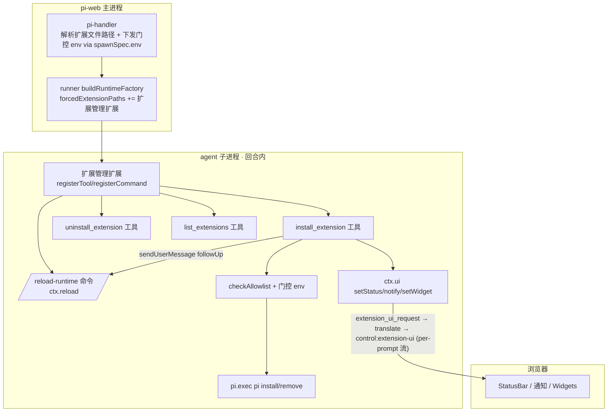

# Design Document — extension-install-agent-tools

## Overview

**Purpose**：把扩展安装从「server 侧 host 命令 `/plugin` + 前端模态 `PluginPanel`」彻底改为「agent 回合内的内置工具」，安装信息/进度走 pi 原生 `ctx.ui`（StatusBar/通知/Widget，ambient 非模态）。机制：pi-web 自带一个「扩展管理扩展」，经 `forcedExtensionPaths` 强制注入每个会话，向所有 agent 提供 `install_extension`/`uninstall_extension`/`list_extensions` 工具与 `/reload-runtime` 命令。

**Users**：pi-web 用户（让 agent 装/卸/列扩展）、pi-web 维护者（保安全门控 + 单一路径）。

**Impact**：当前 `/plugin` 是 host 命令、不在 agent 回合内、ctx.ui 不可达、无 SSE 流，且用模态面板。本特性把安装搬进 agent 回合（ctx.ui 天然可用、per-prompt 流已开），用 pi 原生扩展机制注入工具，移除 host 命令 + 面板。

### Goals
- 三工具（install/uninstall/list）对**所有 agent** 生效（强制注入，不需用户 agent 改 index.ts）。
- 安装进度/结果/列表经 `ctx.ui`（setStatus/notify/setWidget）ambient 呈现。
- 安装后经 `/reload-runtime` follow-up 自动应用（pi 原生，不死锁）。
- 来源白名单门控完整保留（与旧 host 命令同语义），装到会话自身 agentDir，不污染真实 `~/.pi`。
- 移除 `/plugin` host 命令、内置斜杠命令、模态面板及相关测试；`/clear` 不受影响。

### Non-Goals
- 不改 pi SDK；不在工具内直接调 PackageManager（pi 未暴露，用 `pi.exec`）。
- 不做 webext 运行时 UI 安装（另有 spec）；不动 REST `/extensions` 路由。
- 不提供「点击卸载」按钮（无面板；卸载经 `uninstall_extension` 工具 / agent）。

## Boundary Commitments

### This Spec Owns
- **扩展管理扩展**（pi-web 自带 pi 扩展资产）：`registerTool` install/uninstall/list + `registerCommand` reload-runtime；用 `pi.exec` 装包、`ctx.ui` 呈现、`pi.sendUserMessage(followUp)` 排队 reload、装前 `checkAllowlist` 门控。
- **强制注入接线**：runner `buildRuntimeFactory` 把扩展文件路径加入 `forcedExtensionPaths`；pi-handler 解析路径 + 下发门控 env（spawn env）。
- **清理**：移除 `/plugin` host 命令注册、`plugin-host-command.ts`、内置 `/plugin` 斜杠命令、`PluginPanel` 及 chat-app/pi-chat 的相关 wiring（含本会话临时加的 onCommandStart/busy/notify-open-panel）。
- **测试**：扩展工具单测（装包 args/门控拒绝/排队 reload/ctx.ui 调用）、注入接线单测、e2e（隔离 HOME + 真实 pi）。

### Out of Boundary
- pi SDK 源码；REST `/extensions` 路由与其 `source-allowlist`/`install-args`/`pi-cli`（保留，新扩展复用 allowlist 判定）。
- `/clear` host 命令、`onCommandResult` 的 clear-transcript（保留）。
- 既有沙箱 enforcement（`PI_WEB_SANDBOX_ENTRY`，共用 forcedExtensionPaths 数组、不冲突）。

### Allowed Dependencies
- pi SDK `@earendil-works/pi-coding-agent@0.79.6`（**只读消费**：`ExtensionAPI.registerTool/registerCommand/exec/sendUserMessage`、`ExtensionCommandContext.reload`、`ctx.ui.*`）。
- 既有 `checkAllowlist`（`packages/server/src/extensions/install/source-allowlist.ts`，纯函数）——扩展 import 复用（避免门控逻辑分叉）。
- 既有 spawn-env 范本（`attachmentSpawnEnv` / `PI_WEB_SANDBOX_ENTRY`）、forcedExtensionPaths 机制。

### Revalidation Triggers
- pi SDK 升级改变 `forcedExtensionPaths`/`ExtensionAPI`/`sendUserMessage(followUp)`/`pi.exec` 语义 → 扩展 + 注入需回归。
- `checkAllowlist` / 门控 env 名变更 → 工具侧门控需同步。
- `ctx.ui` setStatus/setWidget RPC 帧形状变更 → 呈现需回归。
- next standalone 打包：扩展文件须纳入 `outputFileTracingIncludes`（否则 CLI 模式加载失败）。

## Architecture

### 关键流程：install_extension(source)
1. 工具 `execute`（agent 回合内）→ `ctx.ui.setStatus("ext-install", "安装中: <source>…")`。
2. 门控：读 `process.env` 门控开关 → `checkAllowlist(source, allowlist)`；不放行 → `ctx.ui.notify("来源被拒: …","error")` + 清状态 + 返回（不装）。
3. 装包：`pi.exec("pi", ["install", sourceArg, "--no-approve"], {signal, timeout})`；非零退出 → notify 失败 + 清状态。
4. 成功 → `ctx.ui.setStatus("ext-install", undefined)`(清) + `ctx.ui.notify("已安装: <source>","info")`。
5. 应用：`pi.sendUserMessage("/reload-runtime", { deliverAs: "followUp" })`；`/reload-runtime` handler `await ctx.reload()` 重载扩展。
6. list：`pi.exec("pi", ["list"])` 解析 → `ctx.ui.setWidget("ext-list", [lines…])`（ambient widget）。

## Components and Interfaces

### 1. 扩展管理扩展（新增，pi 扩展资产）
- 形态：pi `ExtensionFactory`（默认导出 `(pi) => { pi.registerTool(...); pi.registerCommand(...); }`），被 pi 按 forcedExtensionPaths 加载。
- 工具签名（TS）：
  - `install_extension({ source: string, local?: boolean })`
  - `uninstall_extension({ name: string })`
  - `list_extensions({})`
- 命令：`reload-runtime`（handler 用 `ExtensionCommandContext.reload()`）。
- 门控：`function gateInstall(source): { allowed: boolean; reason?: string }` —— 读门控 env + `checkAllowlist`。
- 优雅降级：env 缺失/加载失败 → 工具不抛、notify 不可用原因（不破坏会话）。

### 2. runner 注入接线（修改 option-mapper / runner）
- `buildRuntimeFactory`：`forcedExtensionPaths` 在 `PI_WEB_SANDBOX_ENTRY` 之外，追加扩展管理扩展路径（经新 env `PI_WEB_EXT_TOOLS_ENTRY`，主进程解析下发；空则不注入）。
- 路径解析：参照 `resolvePiCliEntry` / runner bootstrap，解析 pi-web 自带扩展文件的绝对路径（standalone 可重定位）。

### 3. pi-handler 接线（修改）
- 解析扩展管理扩展文件路径 → 经 `spawnSpec.env.PI_WEB_EXT_TOOLS_ENTRY` 下发。
- 门控 env（`PI_WEB_EXT_ADMIN_ALLOW_ANY`/`PI_WEB_EXT_ALLOW_LOCAL`/`PI_WEB_EXT_ALLOW_NPM`）经 `spawnSpec.env` 下发给子进程（新增 `extToolsSpawnEnv()`，仿 `attachmentSpawnEnv`）。
- 移除 hostCommands 的 plugin 注册（留 clear）。

### 4. 清理（删除/修改）
- 见《File Structure Plan》。

## File Structure Plan

| 文件 | 操作 | 责任 |
|---|---|---|
| `packages/tool-kit/src/extension-tools/extension-manager.ts`（新）| 新增 | 扩展管理扩展：install/uninstall/list 工具 + reload-runtime 命令 + gateInstall |
| `packages/tool-kit/src/extension-tools/gate.ts`（新）| 新增 | 读门控 env + checkAllowlist 封装（工具侧门控） |
| `packages/tool-kit/src/extension-tools/index.ts`（新）| 新增 | barrel + 解析扩展文件路径的导出 |
| `packages/tool-kit/test/extension-tools/extension-manager.test.ts`（新）| 新增 | 工具单测：装包 args、门控拒绝、排队 reload、ctx.ui 调用（注入假 pi/ctx） |
| `packages/server/src/runner/option-mapper.ts` | 修改 | forcedExtensionPaths 追加 `PI_WEB_EXT_TOOLS_ENTRY` |
| `packages/server/src/runner/ext-tools-wiring.ts`（新，可选）| 新增 | 解析扩展文件绝对路径（standalone 可重定位），供 pi-handler/runner 调 |
| `lib/app/pi-handler.ts` | 修改 | 下发 PI_WEB_EXT_TOOLS_ENTRY + 门控 spawn env；移除 plugin hostCommand 注册 |
| `lib/app/plugin-command/plugin-host-command.ts` | 删除 | host 命令整文件 |
| `packages/tool-kit/src/commands/builtin.ts` | 修改 | BUILTIN_COMMANDS 去掉 PLUGIN，留 CLEAR |
| `components/plugin-panel.tsx` | 删除 | 模态面板整文件 |
| `components/chat-app.tsx` | 修改 | 删 plugin state/wiring/PluginPanel/onCommandStart 接线（含本会话临时加项） |
| `packages/ui/src/chat/pi-chat.tsx` | 修改 | 删 onCommandStart prop（本会话临时加） |
| `test/plugin-host-command.test.ts` | 删除 | 随 host 命令删 |
| `e2e/browser/plugin-command.e2e.ts` | 删除 | 随面板删 |
| `test/chat-app.test.tsx` | 修改 | 删本会话加的 2 个 plugin 测试 |
| `test/builtin-command-merge.test.ts` | 修改 | 期待值去掉 plugin |
| `packages/server/test/http/host-command-routes.test.ts` | 修改 | mock registry 去掉 plugin |
| `examples/*`（新增示例 agent，可选）| 新增 | 演示 agent 让 LLM 调 install_extension（e2e 锚点；注意 example 易被用户删，e2e 优先用 stub/最小 source）|
| `next.config.ts` | 修改 | outputFileTracingIncludes 纳入扩展管理扩展文件（standalone）|
| `lib/app/stub-agent-process.mjs` | 修改 | 加 sentinel 模拟扩展工具发的 setStatus/notify 帧（node e2e 用）|

> `extension-manager` 放 `tool-kit` 包：它是 pi-web 内置工具资产，且需 import `checkAllowlist`（server 包，纯函数）——确认 tool-kit 可依赖 server 的 allowlist 子模块；若引入循环/重依赖，则把 `source-allowlist` 抽到 protocol/独立小模块共享（见 R2）。

## Testing Strategy

### 单元测试（vitest，注入假 `pi`/`ctx`）
- **装包 happy path**（1.2, 2.1, 2.2）：install_extension → 调 `pi.exec("pi",["install",sourceArg,"--no-approve"])`、`ctx.ui.setStatus("ext-install","安装中…")` 先于 exec、成功后 `setStatus(undefined)` + `notify("已安装…")`。
- **门控拒绝**（4.1, 4.2, 4.3, 4.4）：来源不在白名单 / 门控关 → 不调 `pi.exec`、`notify` 来源被拒；放行开关分别放行 local/npm/any。
- **失败路径**（2.3）：`pi.exec` 非零 → notify 失败 + 清状态。
- **排队 reload**（3.1, 3.2）：成功后调 `pi.sendUserMessage("/reload-runtime",{deliverAs:"followUp"})`；reload-runtime 命令 handler 调 `ctx.reload()`。
- **list**（2.4）：list_extensions → `pi.exec("pi",["list"])` 解析 → `ctx.ui.setWidget("ext-list",[…])`。
- **gate 单测**（4.x）：gateInstall 读各门控 env 组合 → 正确 allow/deny。
- **注入接线**（1.1）：option-mapper 在 `PI_WEB_EXT_TOOLS_ENTRY` 存在时把路径加入 forcedExtensionPaths；空则不加。
- **清理回归**（6.1, 6.4）：builtin-command-merge 不含 plugin、含 clear；host-command-routes 无 plugin。

### e2e
- **node e2e**（隔离）：可用 stub 模拟扩展工具发的 control:extension-ui 帧（setStatus/notify）验 translate → SSE 回流（不依赖真 LLM）。
- **browser e2e**（隔离 HOME + 真实 pi CLI，2.x/3.x/4.x/5.x）：真实 runner + 最小 source（不依赖易删的 example，优先用一个稳定的 fixture 目录或 stub-driven），让 agent（或经 sentinel）触发 install_extension → 断言 StatusBar 出现「安装中→已安装」、`<HOME>/.pi/agent/settings.json` 写入包、reload 后扩展生效、真实 `~/.pi` 零污染；门控关时拒绝非白名单源。须 `PI_WEB_DISABLE_STANDALONE=1` + `NEXT_DIST_DIR=.next-e2e` + `rm -rf .next-e2e` 防 stale 缓存（见运维记忆）。
- **清理回归 e2e**：`/plugin` 不再出现在命令面板、不开面板。

## Requirements Traceability

| 需求 | 设计落点 |
|---|---|
| 1.1–1.5 工具 + 回合内 | 扩展管理扩展 registerTool；forcedExtensionPaths 强制注入；工具在 execute(回合内) |
| 2.1–2.5 ctx.ui ambient | setStatus(安装中)/notify(结果)/setWidget(list)；移除模态面板 |
| 3.1–3.3 reload | reload-runtime 命令 + sendUserMessage(followUp)；失败降级 notify 提示手动 |
| 4.1–4.4 门控 | gate.ts 读门控 env + checkAllowlist；spawn env 下发 |
| 5.1–5.2 隔离 | pi.exec 用会话 agentDir/HOME；不写真实全局（除非会话指向）|
| 6.1–6.5 清理 + 验收 | File Structure Plan 删除/修改；单测 + e2e |
