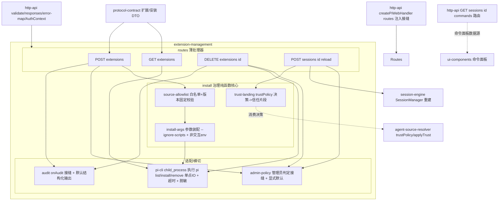
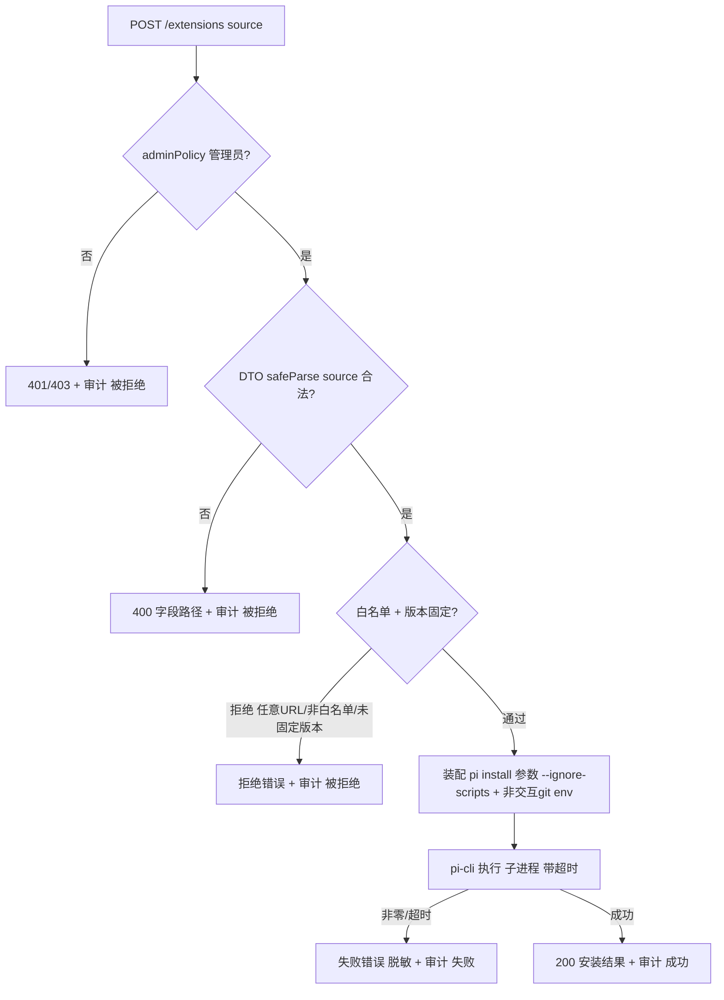
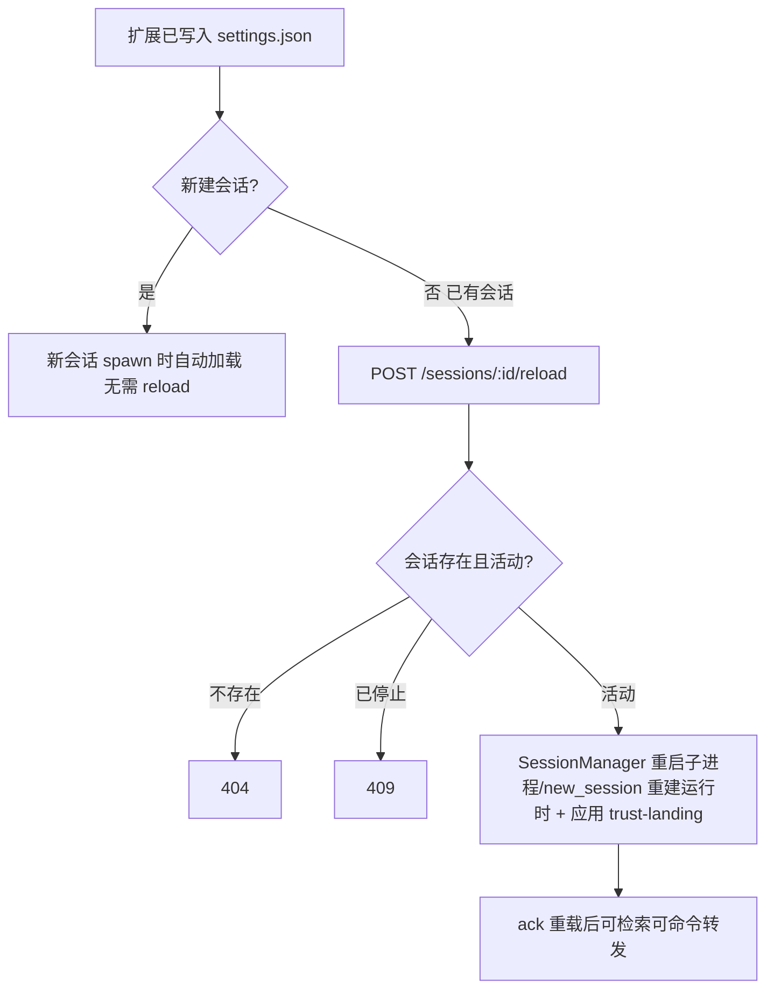
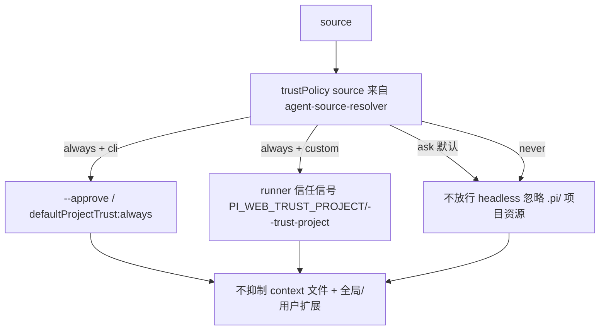

# Design Document — extension-management

## Overview

**Purpose**:本特性交付 pi-web 的**受控扩展管理面**:一组挂载在 `http-api` 之上的新 REST 路由(`GET /extensions`、`POST /extensions`、`DELETE /extensions/:id`、`POST /sessions/:id/reload`),把 pi 的 `pi install/list/remove` 能力以**受治理**的方式暴露给 Web 侧,并把 `agent-source-resolver` 的 `trustPolicy` 决策在安装/会话场景**落地**。核心是把"装扩展 = RCE"这一风险用**仅管理员 + 来源白名单 + 版本固定 + `--ignore-scripts` + 非交互 git env + 审计**收敛为可单测的安装管线。

**Users**:运维/管理员经管理端调用安装/卸载/重载;前端命令面板(由 `ui-components` 渲染)消费由 `http-api` 拥有的 `GET /sessions/:id/commands` 数据(本 spec 不实现该路由);`http-api` 宿主经 `createPiWebHandler` 的 `routes?` 注入接缝把本 spec 提供的路由并入路由表。

**Impact**:把 `PLAN.md` §10.1.2 的扩展管理 route 表、§10.1.3 的 RCE 治理、§10.0.C 的信任落地收敛为边界清晰、可单测的薄层。本 spec **消费**上游契约(`http-api` 的 handler/路由注入接缝/鉴权接缝、`session-engine` 的 `PiSession` 与 `SessionManager`、`agent-source-resolver` 的 `trustPolicy`、`@pi-web/protocol` 的 DTO),**不重定义**。命令面板数据源 `GET /sessions/:id/commands` 由 `http-api` 拥有,本 spec 仅在文档/集成场景**消费**其输出,不实现该路由。

### Goals

- 注册并实现四个端点:扩展列出/安装/卸载、会话重载。
- 把"装扩展 = RCE"治理为可单测管线:来源白名单 + 版本固定 + `--ignore-scripts` + 非交互 git env;非白名单/未固定版本在执行命令前拒绝。
- 把安装/卸载/重载限定为**仅管理员**(复用 `http-api` 鉴权接缝),并对每次操作(含被拒绝)产出**脱敏审计记录**(经 `onAudit` 接缝)。
- 把 `agent-source-resolver` 的 `trustPolicy` 决策映射到 `.pi/` 项目资源的加载方式(CLI `--approve`/`defaultProjectTrust`、custom runner 信任传递),headless 不交互。
- 满足"测试 + e2e(硬性)":单元(白名单/参数装配/信任决策/审计)、集成(fixture 扩展 install→list→消费 `http-api` 的 `GET /sessions/:id/commands` 验证命令出现→remove)、e2e(装本地扩展→新会话/reload→经 `http-api` 的 `GET /sessions/:id/commands` 含 `/command`→prompt 调用生效)。

### Non-Goals

- 不实现 `GET /sessions/:id/commands` 路由(归 `http-api`;本 spec 仅消费其输出作为命令面板数据源,reload 后验证命令出现)。
- 不渲染命令面板 / 扩展管理 UI(归 `ui-components`)。
- 不实现沙箱 / 容器隔离执行(`PLAN.md` §11.2 生产硬化;仅引用)。
- 不实现 HTTP handler 工厂 / 路由器 / SSE 编码 / 鉴权接缝接口(归 `http-api`;本 spec 注册路由 + 复用接缝)。
- 不实现 `get_commands` 的 RPC 转发本体、会话对象、`SessionManager` 重启编排细节(归 `session-engine`;仅消费其 `PiSession`/`SessionManager` 契约)。
- 不实现 `trustPolicy` 默认值与决策算法、`spawnSpec` 装配(归 `agent-source-resolver`;仅消费决策结果并落地)。
- 不定义 protocol 类型 / zod schema / `protocolVersion` 常量(归 `protocol-contract`;仅消费)。
- 不落地完整身份认证 / 多租户隔离 / 密钥管理 / 审计持久化(生产硬化;仅留接缝)。

## Boundary Commitments

### This Spec Owns

- **路由注册集**:把扩展管理四端点(`GET /extensions`、`POST /extensions`、`DELETE /extensions/:id`、`POST /sessions/:id/reload`)作为可经 `http-api` `createPiWebHandler` 的 `routes?` 注入接缝(`PiWebHandlerOptions.routes: ReadonlyArray<{method,path,handler}>`)装配的路由处理器集导出。`GET /sessions/:id/commands` **不归本 spec**——它由 `http-api` 拥有,本 spec 仅消费其输出。
- **安装治理管线**(纯逻辑核心):来源白名单 + 版本固定校验、`pi install`/`pi remove` 参数装配(含 `--ignore-scripts`、非交互 git env)、命令拒绝判定。
- **CLI 适配器**:执行 `pi list/install/remove` 的薄 `node:child_process` 适配点(唯一 IO、可 mock),注入超时与非交互 env、脱敏错误构造。
- **信任落地映射**:把 `trustPolicy(source)` 决策映射为会话创建/重载时传给子进程的信任片段(CLI `--approve`/`defaultProjectTrust`、custom runner 信号)的**调用约定**;落地的具体 args/env 形状沿用 `agent-source-resolver` 的 `applyTrust`。
- **管理员授权门控**:在安装/卸载/重载端点处理器入口判定"是否管理员"的 `adminPolicy` 接缝(接口 + 显式默认),并在不通过时拒绝。
- **审计接缝**:`onAudit` 接口 + 默认结构化输出实现 + 调用点(安装/卸载/被拒绝)。

### Out of Boundary

- HTTP handler 工厂 / `Router` / SSE 编码 / `createPiWebHandler` 的 `routes?` 注入接缝**接口定义** / `authResolver`/`authorizeSession` 接缝**接口定义** / `GET /sessions/:id/commands` 路由本体(`http-api`;本 spec 经 `routes?` 接缝注册自身路由并复用接缝产出的 `AuthContext`,且消费 `http-api` 的命令面板路由输出)。
- `PiSession` 对象 / 广播 / `get_commands` RPC 转发本体 / `SessionManager` 创建与重启编排实现(`session-engine`;仅消费 `PiSession.getCommands()`、`SessionManager` 重建语义)。
- `trustPolicy` 默认值 / 决策算法 / `applyTrust` 的 args-env 映射本体 / `spawnSpec` 装配(`agent-source-resolver`;仅消费决策并触发其落地)。
- protocol 类型 / zod schema / `protocolVersion` 定义(`protocol-contract`)。
- 沙箱隔离 / 身份认证 / 多租户 / 密钥管理 / 审计持久化落库(生产硬化;仅留接缝)。
- 命令面板与扩展管理 UI(`ui-components`)。

### Allowed Dependencies

- **上游 spec(运行时)**:`http-api`——`RouteHandler`/`RequestContext`/`AuthContext` 类型、统一错误响应构造(`responses.ts`)、错误映射(`error-map.ts`)、`validate.ts`(protocol DTO `safeParse`)、`createPiWebHandler` 的 `routes?` 注入接缝(`PiWebHandlerOptions.routes: ReadonlyArray<{method,path,handler}>`)、`GET /sessions/:id/commands` 路由(本 spec 消费其输出作为命令面板数据源);`session-engine`——`SessionManager`(重建会话)、`SessionStore.get`、`PiSession`(`status`/`stop`);`agent-source-resolver`——经其 PUBLIC 包入口暴露的 `TrustDecision`/`TrustFragment` 类型与 `applyTrust`(落地约定),不经 `source/types` 等 deep path;`@pi-web/protocol`——扩展列表 DTO、安装/卸载请求 DTO、`protocolVersion`(单一事实来源 + 边界校验)。
- **运行时**:Node `>=22.19.0`;`node:child_process`(执行 `pi`/git,仅 CLI 适配器内)、`node:timers`(子进程超时);系统 `pi` CLI 与 `git`。**仅 Node runtime**。
- **依赖方向**:`protocol-contract ← http-api ← extension-management`;`session-engine ← extension-management`;`agent-source-resolver ← extension-management`。禁止反向(本 spec 不被任何 spec 依赖)。
- **开发/测试**:`vitest`;集成/e2e 用本地 fixture 扩展 + `session-engine` 经 rpc-channel 的 stub agent 或真实 `pi --mode rpc`;CLI 适配器在单元/集成测试中以受控替身或真实 `pi` 替换——不进运行时依赖。

### Revalidation Triggers

- `pi` CLI 的 `install`/`list`/`remove` 子命令、标志(`--ignore-scripts`、`-l`、`-e`)或输出格式变更(对齐 pi 版本)。
- `http-api` 的 `RouteHandler`/`RequestContext`/`AuthContext`/错误响应/`createPiWebHandler` 的 `routes?` 注入接缝(`PiWebHandlerOptions.routes`)/`GET /sessions/:id/commands` 路由契约变更。
- `session-engine` 的 `SessionManager` 重建语义、`PiSession.status`/`stop` 签名变更。
- `agent-source-resolver` 的 PUBLIC 包入口对 `trustPolicy`/`TrustDecision`/`TrustFragment`/`applyTrust` 的导出契约或信任落地映射(CLI 标志、custom 信号、env 名)变更。
- `@pi-web/protocol` 的扩展列表/命令清单/安装请求 DTO 或 `protocolVersion` 承载约定变更。
- 来源白名单策略 / 版本固定规则 / 管理员判定接缝约定变更。

## Architecture

### Architecture Pattern & Boundary Map

模式:**薄路由处理器 + 治理管线纯函数核心 + 单点 CLI 适配器(Imperative Shell)**。四个端点是经 `http-api` `createPiWebHandler` 的 `routes?` 注入接缝挂入路由表的薄 `RouteHandler`(命令面板数据源 `GET /sessions/:id/commands` 归 `http-api`,本 spec 不实现);安装治理(白名单/版本固定/参数装配/信任落地)是**纯函数核心**,可脱离子进程单测;唯一有副作用的 IO(执行 `pi`/git)集中在 `pi-cli.ts` 适配器,便于 mock。管理员门控经 `adminPolicy` 接缝(复用 `http-api` 的 `AuthContext`),审计经 `onAudit` 接缝。安全做成可替换策略而非硬编码(structure.md)。



**Architecture Integration**:

- **Selected pattern**:薄路由 + 治理纯函数核心 + 单点 CLI 适配器 + 安全策略接缝。理由:Req 2/9 要求 RCE 治理可单测且在执行命令前拒绝——把白名单/版本固定/参数装配做成纯函数(Req 10.1/10.5);Req 7/8 要求管理员门控与审计做成可替换策略(structure.md "安全是可替换策略而非硬编码")。本 spec 的四个路由经 `http-api` 的 `createPiWebHandler` `routes?` 注入接缝并入路由表;命令面板数据 `GET /sessions/:id/commands` 由 `http-api` 拥有,本 spec 仅消费。
- **Domain/feature boundaries**:`routes/`(端点薄转发)、`install/`(治理纯函数:白名单/参数/信任落地)、`cli/`(唯一子进程 IO)、`security/`(管理员接缝 + 审计接缝)四块职责分离,经类型契约衔接。
- **Dependency direction**:`http-api + session-engine + agent-source-resolver + protocol ← extension-management`;本 spec 不被反向依赖。
- **New components rationale**:`routes`(端点单职责)、`source-allowlist`/`install-args`/`trust-landing`(可单测治理核心)、`pi-cli`(唯一 IO 点,可 mock)、`admin-policy`/`audit`(安全接缝)——各单一职责。
- **Steering compliance**:TypeScript strict、禁 `any`;仅 Node runtime + `node:child_process`(tech.md);安全做成可替换策略(`adminPolicy`/`onAudit`/`trustPolicy`,structure.md);消费上游契约不重定义(structure.md "spec 边界 = 包/层边界");非交互 git env(§10.1.3)。

### Technology Stack

| Layer | Choice / Version | Role in Feature | Notes |
|-------|------------------|-----------------|-------|
| Frontend / CLI | — | 产出扩展列表/命令清单 DTO 供前端命令面板消费 | UI 渲染归 `ui-components` |
| Backend / Services | TypeScript strict;经 `createPiWebHandler` `routes?` 接缝挂载于 `http-api` 的 `RouteHandler`;治理纯函数核心 | 四端点处理器、白名单/版本固定/参数装配/信任落地、管理员门控、审计 | 仅 Node 标准 + 注入依赖 |
| Data / Storage | 无持久化(扩展状态由 pi `settings.json` 拥有;审计默认结构化输出,持久化留接缝) | 经 `pi list`/settings 读取扩展;`onAudit` 默认输出 | §11.7 审计落库归生产 |
| Messaging / Events | 消费 `http-api` 拥有的 `GET /sessions/:id/commands`(其内部透传 `PiSession.getCommands()`/RPC `get_commands`)作为命令面板数据源 | 命令面板数据源(本 spec 不实现该路由) | 帧/DTO 由 `@pi-web/protocol` 定义 |
| Infrastructure / Runtime | **Node `>=22.19.0` only**;`node:child_process`(执行 `pi`/git)、`node:timers`(超时);系统 `pi` CLI + `git`;`vitest`(测试);fixture 扩展 + rpc-channel stub(集成/e2e) | 子进程执行、超时、测试 | 非交互 env:`GIT_TERMINAL_PROMPT=0`、`GIT_SSH_COMMAND` BatchMode、`--ignore-scripts`(§10.1.3) |

## File Structure Plan

### Directory Structure

```
lib/pi/extensions/
├── routes.ts                  # 导出可经 http-api createPiWebHandler routes? 接缝装配的路由表(METHOD+path → RouteHandler)
├── routes/
│   ├── list-extensions.ts     # GET /extensions:经 pi-cli 列出/读 settings → 扩展列表 DTO
│   ├── install-extension.ts   # POST /extensions:adminPolicy→校验DTO→allowlist→install-args→pi-cli→audit
│   ├── remove-extension.ts    # DELETE /extensions/:id:adminPolicy→存在性→pi-cli remove→audit
│   └── reload-session.ts      # POST /sessions/:id/reload:adminPolicy→存在/活动校验→SessionManager 重建(含 trust-landing)→ack
│   # 注:GET /sessions/:id/commands 归 http-api 拥有,本 spec 不实现该路由,仅消费其输出
├── install/
│   ├── source-allowlist.ts    # ★ 纯函数:解析 source + 白名单校验 + 版本固定校验 → 通过/拒绝(含原因)
│   ├── install-args.ts        # ★ 纯函数:装配 pi install/remove 参数(--ignore-scripts)+ 非交互 git env
│   └── trust-landing.ts       # ★ 纯函数:trustPolicy(source) 决策 → 会话重建信任片段(消费 agent-source-resolver applyTrust 约定)
├── cli/
│   └── pi-cli.ts              # 唯一 IO:node:child_process 执行 pi list/install/remove;注入超时+非交互env;脱敏错误构造
├── security/
│   ├── admin-policy.ts        # adminPolicy 接缝接口 + 显式默认(默认拒绝/可配置)+ AuthContext 消费
│   └── audit.ts               # onAudit 接缝接口 + 默认结构化输出 + 审计记录构造(脱敏)
└── ext.types.ts               # 本层类型:ExtSource(npm/git/local 判别)、AllowlistDecision、InstallArgs、AuditRecord、ExtManagementOptions
```

### Test Structure

```
lib/pi/extensions/__tests__/
├── source-allowlist.test.ts          # 白名单拒绝任意 URL/非白名单源;版本固定校验(npm 缺@、git 缺 ref)(Req 2.3,2.4,10.1)
├── install-args.test.ts              # 参数装配含 --ignore-scripts;git 源注入非交互 env;敏感值不入参数日志(Req 2.5,9.2,9.3,10.1)
├── trust-landing.test.ts             # trustPolicy always/never/ask × cli/custom → 信任片段;ask/never 不放行;不抑制 context/全局(Req 6.1-6.6,10.1)
├── admin-policy.test.ts              # 非管理员→拒绝;默认显式可见(不静默放行);只读端点不门控(Req 7.1-7.5,10.1)
├── audit.test.ts                     # 安装/卸载/被拒绝各产一条记录;字段完整;env 敏感值脱敏(Req 8.1-8.4,9.3,10.1)
├── list-extensions.test.ts           # mock pi-cli:列出含作用域/来源类型;空列表;pi list 失败→可识别错误(Req 1.1-1.5,10.1)
├── install-extension.test.ts         # mock pi-cli+admin+audit:成功;缺source 400;非白名单拒绝;未固定版本拒绝;子进程非零→失败;非管理员→403(Req 2.x,7.x,8.x,10.1)
├── remove-extension.test.ts          # mock pi-cli:卸载成功;不存在→404;失败→错误;非管理员→403(Req 3.x,7.x,10.1)
├── reload-session.test.ts            # mock SessionManager/store:重载活动会话 ack;不存在→404;已停止→409;非管理员→403(Req 4.x,7.x,10.1)
├── ext.integration.test.ts           # 本地 fixture 扩展 + 真实/受控 pi:install→list 出现→新会话经 http-api 的 GET /sessions/:id/commands 出现→remove 移除(Req 10.2)
└── ext.e2e.test.ts                   # 装本地 .pi/extensions/pi package→新会话或 reload 后经 http-api 的 GET /sessions/:id/commands 含 /command→prompt 调用生效(Req 10.3)
```

### Modified Files

- `http-api` 路由注册点:本 spec 导出的 `routes.ts` 由 `http-api` 宿主在装配 `createPiWebHandler` 时经其 `routes?` 注入接缝(`PiWebHandlerOptions.routes: ReadonlyArray<{method,path,handler}>`)并入路由表(接线随上层装配处理)。本 spec 创建自身模块文件与测试,不修改 `http-api` 内部实现,也不实现 `http-api` 拥有的 `GET /sessions/:id/commands`。
- 若 monorepo 已存在 `package.json`,需将 `http-api`/`session-engine`/`agent-source-resolver`/`@pi-web/protocol` 模块与 `vitest` 纳入依赖——接线随仓库初始化处理。

> 每文件单一职责。`install/` 全为纯函数(白名单/参数/信任落地),直接驱动单测;唯一子进程 IO 集中在 `cli/pi-cli.ts`;安全策略(`admin-policy`/`audit`)为可替换接缝。命令面板数据源路由(`GET /sessions/:id/commands`)不在本结构内——归 `http-api`。

## System Flows

### 安装(治理管线:管理员 → 白名单 → 版本固定 → 参数装配 → 执行 → 审计)



要点:管理员门控与白名单/版本固定均在**执行 `pi install` 之前**完成(Req 2.3/2.4/7.1);无论拒绝/失败/成功都产生审计记录(Req 8.1/8.4);错误与审计脱敏(Req 9.3)。

### 安装后生效:新会话自动 vs 已有会话 reload



`reload` 经 `session-engine` 的 `SessionManager` 以重启子进程 / `new_session` 重建会话运行时(RPC 无原生 reload,§10.1.2);重建时经 `trust-landing` 应用该来源的 `trustPolicy` 决策。

### 信任落地决策(trustPolicy → 信任片段)



`ask`/`never` 不产生任何放行信号且 headless 不交互(Req 6.3/6.5);任何取值都不抑制 `AGENTS.md`/全局扩展(Req 6.4);决策算法本身归 `agent-source-resolver`(Req 6.6)。

## Requirements Traceability

| Requirement | Summary | Components | Interfaces | Flows |
|-------------|---------|------------|------------|-------|
| 1.1 | GET /extensions 列出含来源/版本/作用域 | list-extensions.ts, pi-cli.ts | `listExtensions` | — |
| 1.2 | 区分全局/项目作用域 | list-extensions.ts | 列表映射 | — |
| 1.3 | pi list 失败→可识别错误不泄敏 | list-extensions.ts, pi-cli.ts, error-map(http-api) | 脱敏错误 | — |
| 1.4 | 无扩展→空列表非错误 | list-extensions.ts | 列表映射 | — |
| 1.5 | 响应形状取自 protocol DTO | list-extensions.ts | 扩展列表 DTO | — |
| 2.1 | 合法 source→白名单后 pi install | install-extension.ts, source-allowlist.ts, install-args.ts, pi-cli.ts | `installExtension` | 安装管线 |
| 2.2 | 缺/非法 source→400 不执行 | install-extension.ts, validate(http-api) | `safeParse` | 安装管线 |
| 2.3 | 非白名单/任意URL→拒绝不执行 | source-allowlist.ts | `checkAllowlist` | 安装管线 |
| 2.4 | 未固定版本→拒绝不执行 | source-allowlist.ts | `checkAllowlist` | 安装管线 |
| 2.5 | 参数含 --ignore-scripts + 非交互git env | install-args.ts | `assembleInstallArgs` | 安装管线 |
| 2.6 | 子进程非零/超时→失败脱敏 | pi-cli.ts, install-extension.ts | `runPiCommand` | 安装管线 |
| 2.7 | 非交互执行不挂起 | pi-cli.ts | 非交互 env + 超时 | 安装管线 |
| 3.1 | DELETE /extensions/:id→pi remove | remove-extension.ts, pi-cli.ts | `removeExtension` | — |
| 3.2 | :id 不存在→404 不执行 | remove-extension.ts | 存在性判定 | — |
| 3.3 | remove 非零/超时→失败脱敏 | remove-extension.ts, pi-cli.ts | `runPiCommand` | — |
| 3.4 | 非交互执行卸载 | pi-cli.ts | 非交互 env | — |
| 4.1 | reload 活动会话→重建运行时加载新扩展 | reload-session.ts, SessionManager(session-engine), trust-landing.ts | `rebuildSession` | reload 流 |
| 4.2 | :id 不存在→404 | reload-session.ts | store.get | reload 流 |
| 4.3 | 已停止会话→409 | reload-session.ts, error-map(http-api) | status 判定 | reload 流 |
| 4.4 | 重载完成→ack 可检索可命令 | reload-session.ts | ack 响应 | reload 流 |
| 4.5 | 重载不静默丢弃 | reload-session.ts | 明确收束 | reload 流 |
| 5.1 | 命令面板数据源 = 消费 http-api 的 GET /sessions/:id/commands(本 spec 不实现该路由) | http-api(路由所有者) | 消费契约 | — |
| 6.1 | always+cli→--approve/defaultProjectTrust | trust-landing.ts | `landTrust` | 信任落地 |
| 6.2 | always+custom→runner 信任信号 | trust-landing.ts | `landTrust` | 信任落地 |
| 6.3 | ask/never→不放行 | trust-landing.ts | `landTrust` | 信任落地 |
| 6.4 | 任何取值不抑制 context/全局扩展 | trust-landing.ts | 不抑制约定 | 信任落地 |
| 6.5 | headless 不交互不挂起 | trust-landing.ts, pi-cli.ts | 非交互 | 信任落地 |
| 6.6 | 消费 trustPolicy 不重定义算法 | trust-landing.ts | `trustPolicy`(agent-source) | 信任落地 |
| 7.1 | 安装/卸载/重载先判管理员 | install/remove/reload-session.ts, admin-policy.ts | `adminPolicy` | 安装管线 |
| 7.2 | 非管理员→403/401 不执行 | admin-policy.ts, routes/*, error-map(http-api) | 拒绝路径 | 安装管线 |
| 7.3 | 默认显式可见不静默放行 | admin-policy.ts | 显式默认 | — |
| 7.4 | 只读端点不强制管理员门控 | list-extensions.ts | 无门控 | — |
| 7.5 | 复用 http-api 鉴权接缝 | admin-policy.ts | `AuthContext` 消费 | — |
| 8.1 | 安装/卸载产审计记录(成功/失败) | audit.ts, install/remove-extension.ts | `onAudit` | 安装管线 |
| 8.2 | 审计不含 env 敏感值 | audit.ts | 脱敏构造 | — |
| 8.3 | onAudit 接缝 + 默认结构化输出 | audit.ts | `onAudit` 默认实现 | — |
| 8.4 | 被拒绝安装也产审计记录 | audit.ts, install-extension.ts | `onAudit` | 安装管线 |
| 9.1 | 安装视为 RCE;沙箱归生产仅引用 | (文档/约束), install-extension.ts | 边界约束 | — |
| 9.2 | 子进程非交互 env + 超时上限 | pi-cli.ts, install-args.ts | 非交互 env + timeout | 安装管线 |
| 9.3 | 错误/审计/日志脱敏 | pi-cli.ts, audit.ts | 脱敏构造 | — |
| 9.4 | 仅 Node runtime 经 child_process | pi-cli.ts | 边界约束 | — |
| 10.1 | 单元:白名单/参数/信任/审计 | __tests__/source-allowlist,install-args,trust-landing,admin-policy,audit,各 route | vitest | — |
| 10.2 | 集成:fixture install→list→消费 http-api commands→remove | __tests__/ext.integration | vitest | — |
| 10.3 | e2e:装扩展→reload/新会话→经 http-api commands 含 /command→prompt 调用 | __tests__/ext.e2e | vitest | reload 流 |
| 10.4 | 单一命令运行全部 + 替身回退 | vitest 配置, pi-cli.ts | `vitest run` | — |
| 10.5 | 子进程逻辑可注入/可 mock | pi-cli.ts, routes/* | 接口注入 | — |

## Components and Interfaces

| Component | Layer | Intent | Req Coverage | Key Dependencies (P0/P1) | Contracts |
|-----------|-------|--------|--------------|--------------------------|-----------|
| routes.ts | routes | 导出可经 http-api createPiWebHandler routes? 接缝装配的路由表 | 1.x,2.x,3.x,4.x | http-api routes? 注入接缝 (P0), routes/* (P0) | Service |
| routes/list-extensions.ts | routes | 列出已安装扩展端点 | 1.1–1.5,7.4 | pi-cli (P0), protocol DTO (P0) | API |
| routes/install-extension.ts | routes | 安装端点(治理编排) | 2.1–2.7,7.1,7.2,8.1,8.4,9.1 | admin-policy (P0), source-allowlist (P0), install-args (P0), pi-cli (P0), audit (P0) | API |
| routes/remove-extension.ts | routes | 卸载端点 | 3.1–3.4,7.1,7.2,8.1 | admin-policy (P0), pi-cli (P0), audit (P0) | API |
| routes/reload-session.ts | routes | 会话重载端点 | 4.1–4.5,7.1,7.2 | admin-policy (P0), SessionManager (P0), trust-landing (P1) | API |
| install/source-allowlist.ts | install (纯核心) | 白名单 + 版本固定校验 | 2.3,2.4,10.1 | ext.types (P0) | Service |
| install/install-args.ts | install (纯核心) | pi 命令参数装配 + 非交互 env | 2.5,9.2,9.3 | ext.types (P0) | Service |
| install/trust-landing.ts | install (纯核心) | trustPolicy 决策→信任片段 | 6.1–6.6 | agent-source-resolver trustPolicy/applyTrust (P0) | Service |
| cli/pi-cli.ts | cli (IO shell) | 执行 pi list/install/remove 单点 IO | 1.1,2.6,3.3,9.2,9.3,9.4,10.5 | node:child_process/timers (P0) | Service |
| security/admin-policy.ts | security | 管理员判定接缝 + 显式默认 | 7.1–7.5 | http-api AuthContext (P0) | Service |
| security/audit.ts | security | 审计接缝 + 脱敏默认输出 | 8.1–8.4,9.3 | ext.types (P1) | Service, Event |
| ext.types.ts | types | 本层类型与判别联合 | 1.5,2.x,8.1 | @pi-web/protocol (P1), agent-source-resolver 公共入口 (P1) | State |

### routes 层

#### routes.ts(路由注册)

| Field | Detail |
|-------|--------|
| Intent | 把四个端点处理器作为 `(METHOD, path-pattern) → RouteHandler` 表导出,供 `http-api` `createPiWebHandler` 的 `routes?` 注入接缝装配 |
| Requirements | 1.x, 2.x, 3.x, 4.x |

**Responsibilities & Constraints**
- 导出与 `http-api` `RouteHandler` 类型对齐、可被 `PiWebHandlerOptions.routes`(`ReadonlyArray<{method,path,handler}>`)消费的路由表;不实现 `Router` 本体或 `routes?` 接缝本身(归 `http-api`)。
- 不导出 `GET /sessions/:id/commands`——该路由归 `http-api`;命令面板数据由 `http-api` 路由提供,本 spec 仅消费。
- 经工厂注入本层依赖(`pi-cli`、`adminPolicy`、`onAudit`、`SessionManager`/`SessionStore`、`trustPolicy`),使路由处理器无全局状态、可单测。

**Contracts**: Service [x]

##### Service Interface
```typescript
import type { RouteHandler } from "<http-api>/http/handler.types";
import type { SessionManager, SessionStore } from "<session-engine>/session";
import type { TrustDecision } from "agent-source-resolver"; // PUBLIC 包入口,非 deep path
import type { PiCli } from "./cli/pi-cli";
import type { AdminPolicy } from "./security/admin-policy";
import type { OnAudit } from "./security/audit";

export interface ExtManagementOptions {
  readonly piCli: PiCli;                                   // 默认 child_process 实现;测试可注入替身
  readonly store: SessionStore;                            // 会话检索(reload/commands)
  readonly manager: SessionManager;                        // 会话重建(reload)
  readonly adminPolicy?: AdminPolicy;                      // 默认显式实现(Req 7.3)
  readonly onAudit?: OnAudit;                              // 默认结构化输出(Req 8.3)
  readonly trustPolicy?: (source: string) => TrustDecision; // 消费 agent-source-resolver(默认 "ask")
  readonly piInstallTimeoutMs?: number;                    // 子进程超时上限(Req 9.2)
}

export function createExtensionRoutes(
  opts: ExtManagementOptions,
): ReadonlyArray<{ method: string; path: string; handler: RouteHandler }>;
```
- Preconditions:`piCli`/`store`/`manager` 必须提供;`adminPolicy`/`onAudit`/`trustPolicy` 缺省走显式默认。
- Postconditions:返回的路由表(四端点,不含 `GET /sessions/:id/commands`)形状与 `http-api` 的 `PiWebHandlerOptions.routes` 一致,可经 `createPiWebHandler({ routes })` 注入接缝直接装配。
- Invariants:处理器无状态;安全策略经接缝注入可替换。

**Implementation Notes**
- Integration:`http-api` 宿主在装配 `createPiWebHandler` 时把本表经 `routes?` 注入接缝(`PiWebHandlerOptions.routes`)并入路由表。
- Validation:各路由 `*.test.ts` 以 mock 依赖断言行为。

#### routes/install-extension.ts(安装端点,治理编排)

| Field | Detail |
|-------|--------|
| Intent | 编排安装治理:管理员门控 → DTO 校验 → 白名单/版本固定 → 参数装配 → 执行 → 审计 |
| Requirements | 2.1–2.7, 7.1, 7.2, 8.1, 8.4, 9.1 |

**Responsibilities & Constraints**
- 入口先经 `adminPolicy(ctx.auth)` 判定管理员,非管理员立即拒绝(403/401)并产"被拒绝"审计(Req 7.1/7.2/8.4)。
- 用 `http-api` 的 `validate`(protocol 安装请求 DTO `safeParse`)校验 `source`,失败→400(Req 2.2)。
- 调 `source-allowlist.checkAllowlist(source)`:非白名单/任意 URL/未固定版本→拒绝(不执行,产"被拒绝"审计)(Req 2.3/2.4/8.4)。
- 通过后 `install-args.assembleInstallArgs(source)` → `pi-cli.runPiCommand`(带超时);非零/超时→失败响应 + 失败审计(Req 2.5/2.6/8.1)。
- 成功→200 安装结果 + 成功审计(Req 2.1/8.1)。

**Contracts**: API [x]

##### API Contract(端点汇总)
| Method | Endpoint | Request(protocol DTO) | Success | Errors |
|--------|----------|------------------------|---------|--------|
| GET | /extensions | — | 200 ExtensionListResponse | 401, 500(脱敏) |
| POST | /extensions | InstallExtensionRequest {source} | 200 InstallResultResponse | 400, 401, 403, 422(白名单/版本), 500(安装失败,脱敏) |
| DELETE | /extensions/:id | — | 200/204 ack | 401, 403, 404, 500(脱敏) |
| POST | /sessions/:id/reload | (空/ReloadRequest) | 200 ack | 401, 403, 404, 409 |

> 上表为本 spec 拥有的四端点。`GET /sessions/:id/commands`(命令面板数据源)归 `http-api`,本 spec 不实现,仅消费其输出。所有 DTO 形状取自 `@pi-web/protocol`(扩展列表 / 安装请求);本 spec 不重定义。错误码经 `http-api` `error-map`/`responses` 构造;白名单/版本固定拒绝映射为一个明确的客户端错误码(422 或等价,由 `http-api` 错误结构承载)。

#### routes/list-extensions.ts · remove-extension.ts · reload-session.ts

**Summary-only**:
- `list-extensions`:经 `pi-cli.listExtensions()`(`pi list` 或读 settings)取已安装清单,映射为 protocol 扩展列表 DTO(含来源类型/版本/作用域),空→空列表,失败→脱敏可识别错误;**只读,不强制管理员门控**(Req 1.x/7.4)。
- `remove-extension`:`adminPolicy` 门控 → 经 `:id` 在已安装清单中定位(不存在→404)→ `pi-cli.runPiCommand(["remove", source], 非交互)` → 成功 ack / 失败脱敏错误 → 审计(Req 3.x/7.x/8.1)。
- `reload-session`:`adminPolicy` 门控 → `store.get(:id)`(不存在→404)→ 检查 `status`(已停止→409)→ 调 `manager` 以重启子进程 / `new_session` 重建运行时(重建时经 `trust-landing` 应用 `trustPolicy`)→ ack(Req 4.x/7.x/6.x)。

> 命令面板数据源 `GET /sessions/:id/commands` 归 `http-api`,本 spec 不实现该路由;reload 后命令是否出现经消费 `http-api` 的该路由在集成/e2e 中验证(Req 5.1)。

Contracts: API。

### install 层(纯函数核心)

#### source-allowlist.ts

| Field | Detail |
|-------|--------|
| Intent | 解析 `source` 并执行来源白名单 + 版本固定校验,纯函数返回通过/拒绝(含原因) |
| Requirements | 2.3, 2.4, 10.1 |

**Responsibilities & Constraints**
- 解析 `source` 为判别联合 `ExtSource`:`npm:@scope/pkg@ver` / `git:host/user/repo@ref`(或 `https://...@ref` git URL)/ `local:<path>`。
- 白名单:仅允许配置内的 npm scope 集合与 git host 集合;任意裸 `http(s)://` URL、未列入白名单的 scope/host → 拒绝(Req 2.3)。
- 版本固定:npm 必须含 `@x.y.z`(精确版本,非 range/dist-tag);git 必须含 pinned ref(commit/tag,非分支名约定由配置);未固定 → 拒绝(Req 2.4)。
- 纯函数:无 IO、确定输出;拒绝返回结构化原因供审计与错误响应使用。

**Contracts**: Service [x]

##### Service Interface
```typescript
export type ExtSource =
  | { kind: "npm"; scope?: string; name: string; version: string }
  | { kind: "git"; host: string; repoPath: string; ref: string }
  | { kind: "local"; path: string };

export interface AllowlistConfig {
  readonly npmScopes: readonly string[];   // 允许的 npm scope(如 ["@pi-web","@earendil-works"])
  readonly gitHosts: readonly string[];     // 允许的 git host
  readonly allowLocal: boolean;             // 是否允许 local:<path>(默认仅受控环境)
}

export type AllowlistDecision =
  | { allowed: true; source: ExtSource }
  | { allowed: false; reason: string };     // 拒绝原因(脱敏,供审计/错误)

export function checkAllowlist(rawSource: string, cfg: AllowlistConfig): AllowlistDecision;
```
- Postconditions:`allowed:false` 时携带可读拒绝原因;`allowed:true` 时 `source` 已含固定版本/ref。
- Invariants:纯函数;任何无法解析或未固定版本/非白名单均判 `allowed:false`,绝不"放行存疑源"。

#### install-args.ts · trust-landing.ts

**Summary-only**:
- `install-args.assembleInstallArgs(source, cfg)` → `{ args: string[]; env: Record<string,string> }`:`args` 形如 `["install", <canonical-source>, "--ignore-scripts"]`(卸载为 `["remove", <source>]`);`env` 合并非交互 git env(`GIT_TERMINAL_PROMPT=0`、`GIT_SSH_COMMAND="ssh -o BatchMode=yes -o StrictHostKeyChecking=accept-new"`);敏感值不写入返回的可日志字段(Req 2.5/9.2/9.3)。纯函数。
- `trust-landing.landTrust(source, mode, trustPolicy, applyTrust)` → `TrustFragment`:调用注入的 `trustPolicy(source)` 得 `TrustDecision`,再经 `agent-source-resolver` 的 `applyTrust(mode, decision)` 映射为信任片段(cli:`--approve`;custom:runner 信号 env/arg);`ask`/`never` 产空片段(headless 忽略 `.pi/`);任何取值不抑制 context/全局扩展(Req 6.1–6.6)。`TrustDecision`、`TrustFragment` 与 `applyTrust` 均从 `agent-source-resolver` 的 PUBLIC 包入口导入(非 `source/types` 等 deep path)。纯函数,**消费**上游决策与映射,不重定义。

Contracts: Service。**Implementation Notes**:两者均为纯函数,直接驱动决策矩阵单测(Req 10.1)。

### cli 层(IO shell)

#### pi-cli.ts

| Field | Detail |
|-------|--------|
| Intent | 唯一执行 `pi list/install/remove` 子进程的 IO 适配点;注入超时与非交互 env;脱敏错误构造 |
| Requirements | 1.1, 2.6, 3.3, 9.2, 9.3, 9.4, 10.5 |

**Responsibilities & Constraints**
- 经 `node:child_process` 执行系统 `pi`,以传入 args/env 运行;强制超时上限(`piInstallTimeoutMs`,默认值由实现给定),超时杀进程并报失败(Req 9.2)。
- 注入非交互 env(由 `install-args`/`trust-landing` 给定),确保子进程不挂起等待终端输入(Req 2.7/3.4)。
- 子进程非零退出 / 超时 → 抛或返回失败结果,**剥离 env 敏感值与命令行中的凭据**(Req 2.6/3.3/9.3)。
- `listExtensions()`:执行 `pi list`(或读 settings),解析为结构化扩展条目;失败→脱敏可识别错误(Req 1.1/1.3)。
- 唯一 IO 点:接口可注入替身,使治理核心与 route 在单元/集成测试中无需真实 `pi`(Req 10.5)。

**Contracts**: Service [x]

##### Service Interface
```typescript
export interface PiCommandResult {
  readonly ok: boolean;
  readonly stdout: string;
  readonly exitCode: number | null;
  readonly errorSummary?: string;   // 脱敏(无 env/凭据)
}
export interface InstalledExtension {
  readonly id: string;              // 来源标识(规范化)
  readonly kind: "npm" | "git" | "local";
  readonly version?: string;        // 版本/ref(如有)
  readonly scope: "global" | "project";
}
export interface PiCli {
  runPiCommand(args: readonly string[], env: Record<string, string>, opts?: { timeoutMs?: number }): Promise<PiCommandResult>;
  listExtensions(): Promise<readonly InstalledExtension[]>;
}
export class ChildProcessPiCli implements PiCli { /* node:child_process 实现 */ }
```
- Invariants:仅此处 spawn 子进程;错误/结果不含敏感 env;始终非交互;始终带超时。

**Implementation Notes**
- Integration:route 经注入的 `PiCli` 调用;测试注入 `FakePiCli` 记录调用 args/env 并模拟结果。
- Risks:`pi list` 输出格式漂移 → 解析集中此处,漂移以集成测试上游暴露。

### security 层

#### admin-policy.ts · audit.ts

**Summary-only**:
- `admin-policy`:定义 `AdminPolicy` 接缝(消费 `http-api` 的 `AuthContext`)而不自建认证:
  ```typescript
  import type { AuthContext } from "<http-api>/auth/auth.types";
  export type AdminPolicy = (auth: AuthContext) => boolean;     // true=管理员
  ```
  默认实现为**显式可见的安全决策**:默认拒绝(`anonymous` 上下文判非管理员),或经配置显式开启"开发放行";绝不静默把任意调用方视为管理员(Req 7.3)。安装/卸载/重载路由在入口调用;只读端点不调用(Req 7.1/7.4/7.5)。
- `audit`:定义 `OnAudit` 接缝与脱敏记录构造:
  ```typescript
  export interface AuditRecord {
    readonly actor: string;                 // 来自 AuthContext(userId/匿名)
    readonly at: string;                    // ISO 时间戳
    readonly action: "install" | "remove";
    readonly source: string;                // 来源标识(脱敏)
    readonly outcome: "success" | "failure" | "rejected";
    readonly reason?: string;               // 失败/拒绝原因摘要(无 env/凭据)
  }
  export type OnAudit = (record: AuditRecord) => void;
  ```
  默认实现至少结构化输出(stdout/logger),生产可替换为持久化落库(Req 8.3,§11.7);记录构造剥离 env 敏感值(Req 8.2/9.3);安装/卸载的成功、失败、被拒绝路径均调用(Req 8.1/8.4)。

Contracts: Service / Event。

### types 层

#### ext.types.ts

**Summary-only**:导出 `ExtSource`(npm/git/local 判别联合)、`AllowlistConfig`/`AllowlistDecision`、`InstallArgs`(`{args,env}`)、`AuditRecord`、`ExtManagementOptions`。`TrustDecision`/`TrustFragment` 不在此本地定义——从 `agent-source-resolver` 的 PUBLIC 包入口 re-export/导入(非 deep path)。扩展列表 / 安装请求的对外 DTO 形状优先从 `@pi-web/protocol` 导入;若上游尚未导出,则在此以与 protocol 一致命名本地定义并注明对齐来源(Req 1.5)。命令清单 DTO 归 `http-api` 的 commands 路由消费,本 spec 不在此定义。Contracts: State。

## Data Models

### Data Contracts & Integration

- **核心对外契约**:`GET /extensions` 的扩展列表 DTO、`POST /extensions` 的安装请求/结果 DTO——形状一律取自 `@pi-web/protocol`,本 spec 不重定义(单一事实来源,Req 1.5)。命令清单 DTO 归 `http-api` 的 `GET /sessions/:id/commands` 路由承载,本 spec 仅消费(Req 5.1)。
- **扩展状态所有权**:已安装扩展的真实状态由 pi 的 `settings.json` 拥有;本 spec 经 `pi list`/settings **读取**,经 `pi install/remove` **变更**,不维护独立状态库。
- **审计数据**:`AuditRecord`(脱敏);默认结构化输出,持久化经 `onAudit` 接缝替换(§11.7,留接缝)。
- **信任片段**:`TrustFragment { extraArgs, extraEnv }`,消费 `agent-source-resolver` 的 `applyTrust` 产出,随会话重建传给子进程。
- **脱敏不变量**:任何错误响应 / 审计记录 / 日志均不含 env 敏感值与子进程命令行凭据(Req 9.3)。

## Error Handling

### Error Strategy

- **管理员门控失败**(Req 7.1/7.2):`adminPolicy` 判非管理员→401(未认证)/403(无权限),不执行任何子进程,并产"被拒绝"审计(Req 8.4)。
- **请求校验失败**(Req 2.2):`http-api` `validate` `safeParse` 失败→400 + 字段路径,不执行命令。
- **白名单/版本固定拒绝**(Req 2.3/2.4):`checkAllowlist` 判 `allowed:false`→明确客户端错误(422 或等价),不执行 `pi install`,产"被拒绝"审计。
- **会话不存在/已停止**(Req 4.2/4.3/5.3/5.4):`store.get` 未命中→404;`status` 非活动→409(经 `http-api` `error-map`)。
- **扩展不存在**(Req 3.2):卸载前在已安装清单定位失败→404。
- **子进程失败/超时**(Req 2.6/3.3/9.2):`pi-cli` 非零退出/超时→失败响应(脱敏原因)+ 失败审计;超时强制杀进程防挂起。
- **list 失败**(Req 1.3):`pi list`/settings 读取失败→可识别错误(非误判 500 或带脱敏摘要),不泄敏。
- **脱敏兜底**(Req 9.3):所有错误响应、审计、日志经统一脱敏构造,剥离 env/凭据/命令行敏感片段。
- **fail fast**:管理员/白名单/版本固定均在执行命令前判定,拒绝即早退,绝不"先执行再校验"。

### Monitoring

- 安装/卸载/被拒绝经 `onAudit` 对运维可见(谁/何时/源/结果);默认结构化输出,生产经接缝落库(§11.7)。
- 子进程 stderr 摘要(脱敏)随失败错误返回;集中监控/计费归生产硬化。

## Testing Strategy

测试项直接源自验收标准(硬性:测试 + e2e)。单一命令(`vitest run`)运行全部(Req 10.4)。

### Unit Tests
- **来源白名单**(`source-allowlist.test.ts`):任意 `https://` URL→拒绝;非白名单 npm scope / git host→拒绝;npm 缺 `@x.y.z` / git 缺 pinned ref→拒绝;合法精确版本 npm / pinned git→通过且 `source` 已规范化;拒绝携带可读原因。(2.3, 2.4, 10.1)
- **安装参数装配**(`install-args.test.ts`):`assembleInstallArgs` 始终含 `--ignore-scripts`;git 源注入 `GIT_TERMINAL_PROMPT=0` + `GIT_SSH_COMMAND` BatchMode;卸载装配 `remove`;返回的可日志字段不含敏感 env。(2.5, 9.2, 9.3, 10.1)
- **信任决策**(`trust-landing.test.ts`):`trustPolicy` 返回 always × {cli,custom} → 对应信任片段(cli `--approve`/custom 信号);`ask`/`never` → 空片段(不放行);任何取值断言不抑制 context/全局扩展;消费注入的 `trustPolicy`/`applyTrust` 不重定义。(6.1–6.6, 10.1)
- **管理员门控**(`admin-policy.test.ts`):匿名/非管理员 `AuthContext`→判非管理员;默认实现显式可见(默认拒绝,不静默放行);只读端点不调用门控。(7.1–7.5, 10.1)
- **审计**(`audit.test.ts`):安装成功/失败/被拒绝各产一条记录,字段(actor/at/action/source/outcome/reason)完整;断言记录与 reason 不含 env 敏感值/凭据。(8.1–8.4, 9.3, 10.1)
- **端点处理器**(`list/install/remove/reload-session.test.ts`,mock `pi-cli`/`adminPolicy`/`onAudit`/`store`/`manager`):列出含作用域 + 空列表 + list 失败可识别错误;安装成功 / 缺 source 400 / 非白名单拒绝 / 未固定版本拒绝 / 子进程非零失败 / 非管理员 403;卸载成功 / 不存在 404 / 非管理员 403;reload 活动 ack / 不存在 404 / 已停止 409 / 非管理员 403。(1.x, 2.x, 3.x, 4.x, 7.x, 10.1)

### Integration Tests
- **fixture 扩展全链路**(`ext.integration.test.ts`):用本地 fixture 扩展(本地路径源或受控 npm/git)经真实 `pi`(或受控 `pi` 替身)执行 `POST /extensions` 安装 → `GET /extensions` 列表出现该扩展 → `session-engine` 经 rpc-channel 起新会话后,经 `http-api` 拥有的 `GET /sessions/:id/commands`(本 spec 仅消费,不实现)出现该扩展注册的命令 → `DELETE /extensions/:id` 后列表移除该扩展。断言安装写入 settings、列表与命令面板一致、卸载生效。(10.2, 1.1, 2.1, 3.1, 5.1)

### E2E Tests
- **装扩展→reload/新会话→命令生效**(`ext.e2e.test.ts`):安装一个本地 `.pi/extensions` 或本地 pi package → 经新会话(自动加载)或对已有会话 `POST /sessions/:id/reload`(重启子进程/`new_session` 重载,含 `trust-landing` 信任落地)后,经 `http-api` 拥有的 `GET /sessions/:id/commands`(本 spec 仅消费,不实现)含该扩展注册的 `/command` → 通过 `POST /sessions/:id/messages` 以该 `/command` 作为 prompt 调用,断言命令在会话中生效(产生对应事件/响应)。真实 `pi` 不可用时回退受控替身验证装配与透传链路。(10.3, 4.1, 5.1)

### 运行约定
- 单一命令(`vitest run`)运行全部单元/集成/e2e;集成/e2e 在真实 `pi` 不可用时回退受控 `pi` 替身与 rpc-channel stub 进程。(10.4)

## Security Considerations

- **扩展安装 = RCE**(Req 9.1,§10.1.3):本 spec 用**仅管理员 + 来源白名单 + 版本固定 + `--ignore-scripts` + 非交互 git env + 审计**收敛风险;**沙箱/容器隔离是生产硬化关注点**(§11.2),本 spec 引用而不实现,部署方在受控/沙箱环境内启用安装能力。
- **管理员门控**(Req 7.x):安装/卸载/重载在执行任何子进程前经 `adminPolicy` 判定;默认显式拒绝,绝不静默把任意调用方视为管理员;复用 `http-api` 鉴权接缝产出的 `AuthContext` 而不自建认证。
- **来源治理**(Req 2.3/2.4):白名单拒绝任意 URL 与未列入的 scope/host;强制版本固定(npm 精确版本、git pinned ref),杜绝"装到可变 ref 被供应链投毒"。
- **非交互 + 超时**(Req 2.7/3.4/9.2):`GIT_TERMINAL_PROMPT=0` + ssh BatchMode + `--ignore-scripts` + 子进程超时,杜绝交互挂起、凭据提示与 npm 生命周期脚本 RCE。
- **脱敏**(Req 8.2/9.3):env(provider key 等)与命令行凭据不入审计、错误响应或日志。
- **信任默认安全**(Req 6.3/6.6):`.pi/` 项目资源默认 `ask`/headless 忽略;仅 `trustPolicy` 显式 `always` 才放行,且建议仅用于可信来源 + 沙箱内(§10.0.C)。
- **仅 Node runtime**(Req 9.4):经 `node:child_process` 调用系统 `pi`/git;不在 Edge/Serverless 假设下工作。
