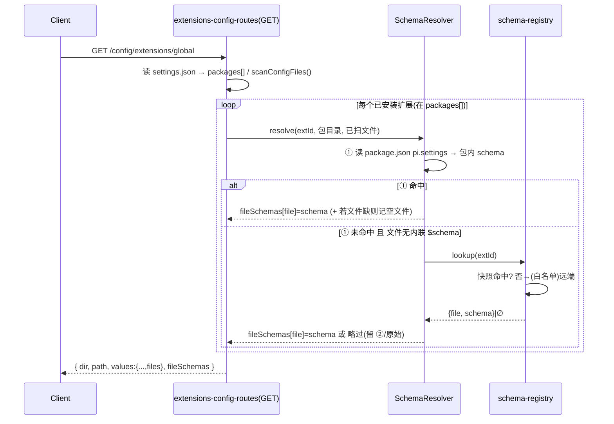

# Design Document

## Overview

**Purpose**：为**已安装** pi 扩展提供通用、schema 驱动的设置 UI。对每个已安装扩展，服务端按优先级从三源解析其设置 schema（① 包自带 → ② 配置文件内联 `$schema` → ③ 第三方 registry），随扩展配置端点回传给前端，由既有的通用 `SchemaForm` 渲染层渲染为类型化表单。

**Users**：扩展作者（低成本得到设置界面）、终端用户（在「设置 → 扩展」配置已装扩展）、平台维护者（为长尾扩展集中补 schema）。

**Impact**：把现有「文件存在即渲染、且依赖远端托管 `$schema`」的窄路径，升级为「按已安装扩展门控、schema 可来自包内/registry/内联三源、并支持动态键 map 与空表单新建」的通用机制。不改 pi 本体，不改扩展读取配置的方式，仅改「配置如何被编辑/创建」。

### Goals
- 服务端按 `packages[]` 解析已安装扩展，从包自带（`package.json` `pi.settings`）或 registry 取得 schema，经 `fileSchemas` 回传；install 门控、离线可用。
- 配置文件尚不存在时也能依据 schema 渲染空表单并新建保存。
- 表单生成器支持 `additionalProperties`/`patternProperties`（动态键 map → `record`）。
- 远端 schema 拉取走 host 白名单（SSRF 防护）。
- 保留内联 `$schema`（②）现状与既有 KV/命令/configFiles 行为，异常输入安全降级。

### Non-Goals
- 从配置值推断结构的「无 schema 兜底结构化编辑器」。
- 按扩展版本区间细分 schema（v1 每包一份最新）。
- 在 pi 本体新增扩展配置声明/读取 API。
- 为单个扩展手写专属 React 界面。

## Boundary Commitments

### This Spec Owns
- 服务端「已安装扩展 → settings schema」三源解析逻辑与其 install 门控。
- `pi.settings` 包内声明约定的读取与语义。
- 第三方 schema registry 的内置快照、查询与（白名单）远端刷新。
- 扩展配置 GET 响应新增的 `fileSchemas` 契约字段，及其经 react/ui 到 `ConfigFilesField` 的贯通通道。
- `json-schema-to-form-schema` 对 `additionalProperties`/`patternProperties` 的 `record` 映射。

### Out of Boundary
- pi 本体的扩展加载、`packages[]` 的写入（由现有扩展安装/管理特性负责）。
- 扩展运行时如何读取自身配置文件（扩展自理，本特性不触碰）。
- 内联 `$schema`(②) 的客户端拉取实现（沿用现状，仅保证不回归）。
- AIGC/附件等其它配置域。

### Allowed Dependencies
- `@blksails/pi-web-protocol`：`FormSchema` IR、`jsonSchemaToFormSchema`（含本特性新增的 record 支持）。
- 已安装包在本地磁盘的布局（`~/.pi/agent/npm/node_modules`、`git/<host>/<path>`、local 绝对路径）及其 `package.json` 可读。
- 既有 `extensions-config-routes` 的 `extIdFromPackage`/`scanConfigFiles`/非破坏写盘。
- 依赖方向保持 `protocol ← react ← ui ← server/app` 单向。

### Revalidation Triggers
- 扩展配置 GET 响应形状变化（新增/改名 `fileSchemas`）。
- `ConfigDomainIO.load()` 返回契约变化（由 `FormValues` 改为 `{ values, fileSchemas? }`）——所有配置域 IO 实现与其测试需复核。
- `FieldProps`/`SchemaFormProps` 新增 `fileSchemas` 透传位。
- `pi.settings` 约定字段或 registry 条目结构变化。
- 远端拉取白名单/`PI_WEB_SCHEMA_REGISTRY_URL` 语义变化。

## Architecture

### Existing Architecture Analysis
- 配置 UI 以 schema 为单一事实源：`zod/JSON Schema → FormSchema(IR) → SchemaForm + FieldRenderer + FieldRegistry`，依赖方向 `protocol ← react ← ui ← server/app` 严格单向（见 `docs/product/12-config-ui`）。
- 扩展配置域走专属路由 `GET·PUT /config/extensions/{global|project}`（不入通用 `/config/:domain`），值结构 `{ commands, extensions, files }`，写回非破坏。
- `configFiles` 仅识别内联 `$schema`(https) 并由客户端 fetch；这是要被「服务端三源解析 + `fileSchemas` 回传」补强的接缝。

### Architecture Pattern & Boundary Map

```mermaid
flowchart TD
  subgraph server[server: extensions-config-routes]
    GET[GET /config/extensions/scope] --> RES[SchemaResolver]
    RES -->|① 包自带| PKG[读 packages[] → 本地包目录 → package.json pi.settings → 包内 schema]
    RES -->|③ registry| REG[schema-registry: 快照 + 白名单远端]
    RES --> FS[(fileSchemas: file→JSON Schema)]
    GET --> BODY["{ dir, path, values:{...,files}, fileSchemas }"]
  end
  subgraph react[react]
    IO[ConfigDomainIO.load → {values, fileSchemas}] --> HOOK[useConfigDomain]
  end
  subgraph ui[ui]
    SHELL[SettingsShell] --> FORM[SchemaForm fileSchemas]
    FORM --> FR[FieldRenderer] --> CFF[ConfigFilesField]
    CFF -->|fileSchemas[name] 优先, 同步| JS2F[jsonSchemaToFormSchema]
    CFF -->|否则内联 $schema ②| FETCH[客户端 fetch 现状]
    CFF -->|皆无| RAW[原始 JSON]
  end
  BODY --> IO
  HOOK --> SHELL
  JS2F --> SF2[结构化 SchemaForm]
```

**Architecture Integration**：
- 选型：**复用既有 schema→表单管线**，仅在两端补强——服务端新增「已装扩展→schema」解析与 `fileSchemas` 回传；前端新增 `fileSchemas` 透传位并让 `ConfigFilesField` 优先采用服务端结果。
- 边界分离：服务端负责需读盘/受控联网的 ①③；客户端继续负责浏览器内 fetch 的 ②；IR 转换 `jsonSchemaToFormSchema` 在 protocol 共享。
- 保留模式：`FieldRegistry`/`SchemaForm`/`RecordField`/非破坏写盘/作用域分离全部不变。

### Technology Stack

| Layer | Choice | Role | Notes |
|-------|--------|------|-------|
| Frontend (UI) | React + `SchemaForm`/`FieldRenderer` | 渲染类型化表单 | 新增 `fileSchemas` 透传位 |
| Backend (server) | Node route handler | 三源 schema 解析 + 白名单远端拉取 | 新 `schema-resolver.ts` / `schema-registry.ts` |
| Protocol | `jsonSchemaToFormSchema` | JSON Schema → IR | 新增 record 支持 |
| Runtime | `~/.pi/agent` 本地包树 | 包自带 schema 来源 | 离线、install-gated |

## File Structure Plan

### New Files
```
packages/server/src/config/
├── schema-resolver.ts        # 已装扩展→settings schema 三源解析(①包自带→②跳过留客户端→③registry);install 门控;产出 fileSchemas + 需补的空文件清单
├── schema-registry.ts        # registry 快照载入 + 按 id 查询 + createSchemaFetcher({allowHosts}) 白名单远端拉取 + 缓存
└── schema-registry.data.json # 内置 registry 离线快照(按扩展 id 索引)
```

### Modified Files
- `packages/server/src/config/extensions-config-routes.ts` — GET 调用 `schema-resolver` 得 `fileSchemas` 并补空目标文件入 `values.files`，响应体加 `fileSchemas`；PUT 跳过「空且原不存在」文件的落盘。
- `packages/protocol/src/config/json-schema-to-form-schema.ts` — 对象分支前置识别 `additionalProperties`/`patternProperties` → `record`。
- `packages/protocol/src/config/domains/extensions.ts` — 文档/类型补充 GET 响应可选 `fileSchemas?: Record<string, unknown>`（不入 zod 表单值，仅响应元数据）。
- `packages/react/src/config/settings-registry.ts` — `ConfigDomainIO.load(): Promise<ConfigDomainData>`，`ConfigDomainData = { values: FormValues; fileSchemas?: Record<string, unknown> }`。
- `packages/react/src/config/use-config-domain.ts` — 捕获并暴露 `fileSchemas`。
- `packages/react/src/config/make-config-domain-io.ts`（及 `lib/settings/register-panels.ts` 的 `makeUrlIO`、sandbox project IO）— 适配新 `load` 返回 `{ values, fileSchemas? }`。
- `packages/ui/src/config/settings-shell.tsx` — 把 `fileSchemas` 传入 `<SchemaForm>`。
- `packages/ui/src/config/schema-form.tsx` — `SchemaFormProps.fileSchemas?`，于顶层 `FieldRenderer` 透传。
- `packages/ui/src/config/field-renderer.tsx` + `field-registry.ts` — `FieldProps.fileSchemas?` 透传位。
- `packages/ui/src/config/fields/config-files-field.tsx` — `FileEditor` 优先 `fileSchemas[name]`（同步转换免 fetch），无则维持内联 `$schema`；支持空内容文件渲染空表单。

## System Flows

### 服务端 schema 解析（GET /config/extensions/{scope}）

- 门控：只遍历 `packages[]`（已启用）扩展；未安装者既不解析也不出现。
- 降级：包目录/`package.json`/schema 文件读失败、registry 远端不可用或非白名单 host → 略过该来源，回退快照或客户端 ②/原始 JSON，绝不抛致面板整体失败。

### 客户端单文件 schema 选择（FileEditor）
```mermaid
flowchart LR
  A[file name+content] --> B{fileSchemas[name]?}
  B -->|有| C[jsonSchemaToFormSchema 同步 → 结构化表单]
  B -->|无| D{content.$schema https?}
  D -->|有| E[客户端 fetch → 结构化表单(现状)]
  D -->|无| F[原始 JSON 编辑]
```

## Requirements Traceability

| Requirement | Summary | Components | Flows |
|---|---|---|---|
| 1.1–1.5 | 包自带 schema、install 门控、离线、回填 | `schema-resolver`、`extensions-config-routes`、`SchemaForm` | 服务端解析 |
| 2.1–2.3 | 配置文件缺失时空表单 + 新建 | `schema-resolver`(补空文件)、`extensions-config-routes`(PUT)、`config-files-field` | 两流程 |
| 3.1–3.4 | 三源优先级、命中即停、install 一致 | `schema-resolver`、`config-files-field` | 两流程 |
| 4.1–4.2 | 内联 `$schema` 兼容与失败回退 | `config-files-field` | 客户端选择 |
| 5.1–5.5 | registry 查询、快照、远端覆盖、回退 | `schema-registry` | 服务端解析 |
| 6.1–6.3 | 远端白名单、拒绝回退、缓存 | `schema-registry`/`createSchemaFetcher` | 服务端解析 |
| 7.1–7.3 | 动态键 map → record | `json-schema-to-form-schema`、`RecordField` | — |
| 8.1–8.4 | 兼容、非破坏写盘、作用域、降级 | `extensions-config-routes`、`schema-resolver` | 两流程 |

## Components and Interfaces

| Component | Layer | Intent | Req | Contracts |
|---|---|---|---|---|
| SchemaResolver | server | 已装扩展→fileSchemas + 空文件清单 | 1,2,3,8 | Service |
| schema-registry | server | 快照+查询+白名单远端 | 5,6 | Service |
| extensions GET/PUT | server | 注入 fileSchemas / 非破坏写盘 + 跳空文件 | 1,2,8 | API |
| jsonSchemaToFormSchema | protocol | additionalProperties/patternProperties→record | 7 | Service |
| ConfigDomainIO/useConfigDomain | react | 贯通 fileSchemas | 1,3 | State |
| SchemaForm/FieldProps/ConfigFilesField | ui | 优先服务端 schema、空表单、回退 | 1,2,3,4,7 | State |

### server

#### SchemaResolver (`schema-resolver.ts`)
```typescript
interface ResolvedExtensionSchemas {
  /** 文件名 → 已解析的 JSON Schema(原始 JSON, 未转 IR)。 */
  readonly fileSchemas: Record<string, unknown>;
  /** 声明了 schema 但磁盘缺失、需补空内容以供新建的文件名。 */
  readonly missingFiles: readonly string[];
}
interface SchemaResolverDeps {
  readonly agentDir: string;                 // 全局包树根(~/.pi/agent)
  readonly registry: SchemaRegistry;
  readonly readPackageSettings: (pkgDir: string) => Promise<PiSettings | undefined>;
}
/** pi.settings：扩展在 package.json `pi` 块下声明。 */
type PiSettings = { file: string; schema: string } | ReadonlyArray<{ file: string; schema: string }>;
function resolveInstalledExtensionSchemas(
  settings: Record<string, unknown>,   // settings.json(取 packages[])
  scannedFiles: Record<string, unknown>, // scanConfigFiles 结果(含各文件内容, 用于判断内联 $schema)
  deps: SchemaResolverDeps,
): Promise<ResolvedExtensionSchemas>;
```
- **Responsibilities**：解析 `packages[]`→extId→本地包目录（`npm:`→`<agentDir>/npm/node_modules/<id>`；`git:host/path`→`<agentDir>/git/host/path`；`local:/abs`→`/abs`）；读包内 `pi.settings` 与 schema 文件（①）；①未命中且该 file 内容无内联 `$schema` 时查 registry（③）；②留客户端不在此解析。
- **Constraints**：仅处理 `packages[]` 内扩展（install 门控）；任一来源读取异常即略过该扩展、不抛。

#### schema-registry (`schema-registry.ts`)
```typescript
interface SchemaRegistryEntry { readonly file: string; readonly schema: string | Record<string, unknown>; } // schema: URL 或内联
interface SchemaRegistry { lookup(extId: string): Promise<{ file: string; schema: unknown } | undefined>; }
interface SchemaRegistryOptions {
  readonly snapshot: Record<string, SchemaRegistryEntry>; // 内置离线快照
  readonly remoteUrl?: string;          // PI_WEB_SCHEMA_REGISTRY_URL
  readonly allowHosts: readonly string[]; // 默认 raw.githubusercontent.com, pi.dev
  readonly fetchImpl?: typeof fetch;     // 测试注入
}
function createSchemaRegistry(opts: SchemaRegistryOptions): SchemaRegistry;
/** 预留接缝实现:仅放行白名单 host 的 URL,失败/越权返回 undefined。 */
function createSchemaFetcher(opts: { allowHosts: readonly string[]; fetchImpl?: typeof fetch }):
  (url: string) => Promise<unknown | undefined>;
```
- **Constraints**：远端 registry 与 entry.schema(URL) 一律经 `createSchemaFetcher` 白名单校验；非白名单 host 拒绝；结果按 key/URL 缓存；远端不可用回退快照。

#### extensions-config-routes（API 契约）
| Method | Endpoint | Response | Notes |
|---|---|---|---|
| GET | /config/extensions/{global\|project} | `{ dir, path, values:{commands?,extensions?,files?}, fileSchemas?: Record<string,unknown> }` | `values.files` 含「缺失但有 schema」的空 `{}` 占位 |
| PUT | 同上 | 200/422/403/404 | 对「空且原不存在」文件不落盘；其余非破坏写盘不变 |

### protocol

#### jsonSchemaToFormSchema record 支持
- 在 `nodeToField` 对象判定（现 `t==="object" || properties`）**之前/之内**：若节点有 `additionalProperties`(对象 schema) 或 `patternProperties`，产出 `record`：
  - 值 schema 为对象 → `{ kind:"record", fields: fieldsFromObject(valueSchema, root) }`（`RecordField` 按 `fields` 渲染每条目子字段）。
  - 值 schema 为标量 → `{ kind:"record", itemKind: <string|number|boolean> }`。
  - `patternProperties` 取首个模式的值 schema 作为值模板。
- 既有 `properties`/array/oneOf/enum 行为保持；`additionalProperties:false` 或 `true`(布尔) 不触发 record。

### react / ui（贯通契约）
```typescript
// settings-registry.ts
type ConfigDomainData = { readonly values: FormValues; readonly fileSchemas?: Record<string, unknown> };
interface ConfigDomainIO { load(): Promise<ConfigDomainData>; save(v: FormValues): Promise<void>; }
// SchemaFormProps / FieldProps 各新增： readonly fileSchemas?: Record<string, unknown>;
```
- `useConfigDomain`：`const { values, fileSchemas } = await panel.load(); reset(values);` 并暴露 `fileSchemas`。
- `SettingsShell` → `<SchemaForm fileSchemas={fileSchemas}>` → 顶层 `FieldRenderer` 透传 → `ConfigFilesField`。
- `ConfigFilesField.FileEditor`：`fileSchemas?.[name]` 命中 → 同步 `jsonSchemaToFormSchema` 渲染（无网络）；否则内联 `$schema`(现状)；皆无 → 原始 JSON。空内容 + 有 schema → 渲染空结构化表单。

## Data Models

### `pi.settings` 约定（扩展侧）
```jsonc
// 扩展 package.json(既有 pi 块下新增 settings)
"pi": { "extensions": ["./index.ts"], "settings": { "file": "mcp.json", "schema": "./schema.json" } }
```
- pi 仅消费 `pi.extensions`/`pi.image`，忽略未知子键 → 与 pi 本体零冲突。

### registry 快照（`schema-registry.data.json`）
```jsonc
{ "pi-mcp-adapter": { "file": "mcp.json", "schema": "https://raw.githubusercontent.com/<owner>/pi-mcp-adapter/main/schema.json" },
  "@aizigao/pi-proxy-fetch": { "file": "proxy.json", "schema": "https://raw.githubusercontent.com/aizigao/pi-proxy-fetch/master/schema.json" } }
```

### `fileSchemas`（响应元数据）
- `Record<配置文件名, 原始 JSON Schema>`；**不**进表单值/不参与 zod 校验，仅 GET 响应附带、前端用于选择渲染方式。

## Error Handling

### Error Strategy（全程「安全降级，不致面板崩」）
| 场景 | 处理 |
|---|---|
| 包目录/`package.json`/包内 schema 读失败 | 略过该扩展①；尝试③或留②/原始 |
| registry 远端不可用/超时 | 回退离线快照（R5.5） |
| 远端 URL host 非白名单 | 拒绝拉取，回退（R6.2） |
| schema 损坏/不支持构造 | `jsonSchemaToFormSchema` 既有降级（不支持构造→string，不抛）；该文件退原始 JSON |
| 内联 `$schema` fetch 失败 | 该文件退原始 JSON，不阻断其它文件（R4.2/现状） |
| 未安装扩展 | 不解析、不出现（R1.3/3.4） |

### Monitoring
- 解析/拉取失败经既有 logger 记 warn（命名空间 `config`/`extensions`），不输出到响应主体。

## Testing Strategy

### Unit Tests
- `json-schema-to-form-schema`：`additionalProperties`(对象)→`record`+`fields`；`additionalProperties`(标量)→`record`+`itemKind`；`patternProperties`→record；`additionalProperties:false/true` 不触发；既有 properties/array/oneOf 用例不回归（R7）。
- `schema-resolver`：packages 规格→本地目录解析（npm/git/local）；读 `pi.settings` 单个/数组；①命中产出 fileSchemas + missingFiles；未安装扩展不解析（R1,2,3）。
- `schema-registry`：快照命中；远端覆盖快照；非白名单 host 拒绝；远端失败回退快照；缓存命中（R5,6）。
- `config-files-field`：`fileSchemas[name]` 优先于内联 `$schema`（不发 fetch）；空内容+schema→空结构化表单；皆无→原始 JSON（R1,2,3,4）。

### Integration Tests（server，真实 route handler + 临时 agentDir）
- 种入临时 agentDir：含一个「已安装」假包（`npm/node_modules/<id>/package.json` 带 `pi.settings` + 包内 `schema.json`）+ `settings.json packages[]` 含该包；GET `/config/extensions/global` → 断言 `fileSchemas[file]` 存在、`values.files[file]` 有空占位（文件原缺失时）。
- 同 agentDir 但把包移出 `packages[]`（卸载）→ 断言 `fileSchemas` 不含其 file（install 门控）。
- registry-only：包不带 `pi.settings`、文件无内联 `$schema`、registry 快照有该 id（schema 内联避免联网）→ GET 断言 fileSchemas 命中。

### E2E Tests
- **Node 端 e2e（主证据，确定性、无网络）**：`PI_WEB_STUB_AGENT` 模式经真实 `createPiWebHandler` 路由，端到端验证 GET 解析（①包自带 + ③registry-内联）与 install 门控、PUT 新建文件落盘与非破坏写盘；用临时 agentDir 种子。隔离构建/隔离 agentDir。
- **浏览器 e2e（可行则补）**：Playwright（`NEXT_DIST_DIR=.next-e2e` 外部 server）打开 `/settings` → 「扩展」→ 对种入的假包断言渲染出结构化表单（含 `mcpServers` 这类 record 控件的 `data-pi-record-entry`），并对未安装包断言无表单。

## Security Considerations
- **SSRF**：服务端任何远端拉取（registry 远端、entry.schema URL）必须经 `createSchemaFetcher` host 白名单；默认仅 `raw.githubusercontent.com`/`pi.dev`，可经配置扩充；内联 `$schema`(②) 维持客户端浏览器 fetch（不新增服务端 SSRF 面）。
- **Install 门控**：仅 `packages[]` 内扩展被解析，杜绝任意盘上文件被当作扩展 schema。
- **路径安全**：复用 `isSafeConfigFileName`（basename、`.json`、非保留、无穿越）；包目录解析限定在 `agentDir` 子树或显式 local 绝对路径。
- **写盘**：非破坏合并 + `0600`（auth 等敏感域不受本特性影响）。
