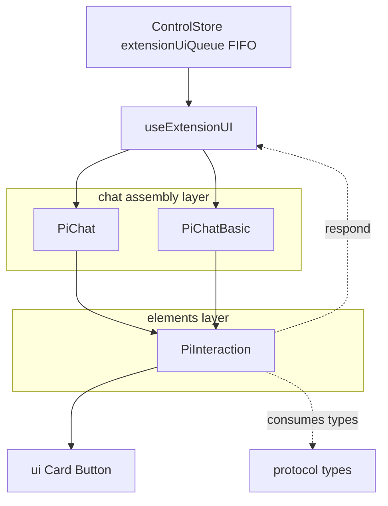
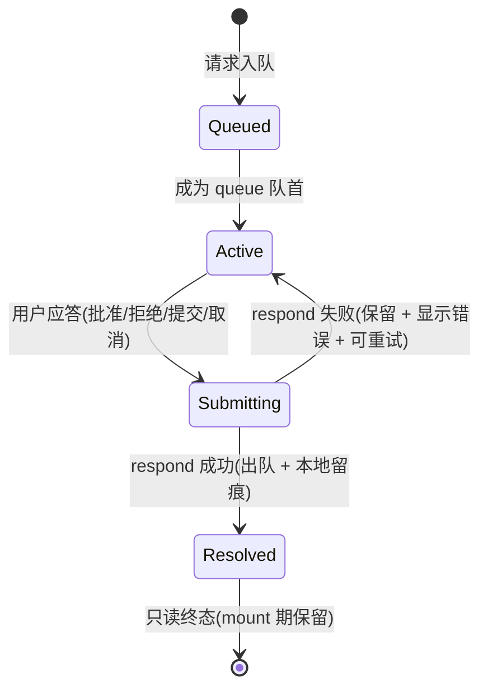
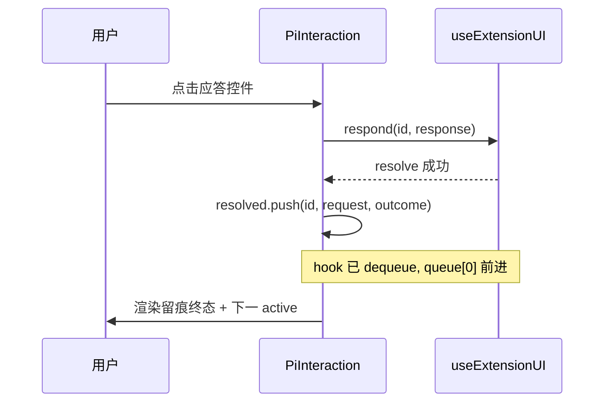

# Design Document

## Overview

**Purpose**：将扩展 UI 的四类交互（confirm / select / input / editor）从模态弹窗改造为**对话消息流末尾的内联卡片**，交互嵌入对话上下文、弱打断，应答后保留只读结果留痕。

**Users**：使用 pi-web 聊天界面的最终用户在对话流内响应 agent 发起的交互请求；集成 `PiChat`/`PiChatBasic` 的开发者获得行为一致、零协议改动的内联交互呈现。

**Impact**：以新的无状态元件 `PiInteraction` 取代模态 `PiPermissionDialog`；交互数据源（`useExtensionUI` 队列）与扩展 UI 协议契约**不变**；应答后在客户端本地保留终态留痕（mount 生命周期）。

### Goals
- 四类交互在对话流末尾内联呈现、可应答、应答后保留只读终态留痕。
- 多请求 FIFO 串行；仅队首为可应答（active）。
- 弱打断可达性：播报、滚动可见、聚焦首动作但不锁定焦点。
- 富聊天与基础聊天两个装配行为一致；扩展 UI 协议、ambient 能力、Suggestion 组件均不受影响。

### Non-Goals
- 不改 `@blksails/protocol` 请求/响应结构与 `useExtensionUI` hook。
- 不改 ambient 能力（notify / status / widget / title / 编辑器文本注入）与 Suggestion 组件。
- 不做交互留痕的跨会话/持久化保存（刷新即清空）。
- 不做多请求并发应答（保持 FIFO 串行）。

## Boundary Commitments

### This Spec Owns
- 新元件 `PiInteraction`（`elements/pi-interaction.tsx`）：四类交互的内联呈现、应答回传包装、本地终态留痕、FIFO active 选取、可达性行为。
- `PiChat` / `PiChatBasic` 中交互呈现的**挂载位置**从模态浮层迁移到消息流末尾。
- 交互卡的 `data-*` 测试钩子契约与中文终态文案。

### Out of Boundary
- 扩展 UI 协议契约（`RpcExtensionUIRequest` / `UiResponseRequest`）—— 不变。
- `useExtensionUI` hook 行为与 `ControlStore` 队列/出队逻辑 —— 不变。
- ambient 能力（notify/status/widget/title/editorText）与 Suggestion 组件 —— 不变。
- 交互留痕的持久化 —— 明确不做。

### Allowed Dependencies
- `@blksails/react`：`UseExtensionUIResult`（`queue`/`current`/`respond`/`error`/`pending`）。
- `@blksails/protocol`：`RpcExtensionUIRequest`、`UiResponseRequest`（仅类型消费）。
- `@blksails/ui` 内部：`ui/card.tsx`、`ui/button.tsx`、`lib/cn.ts`、`lucide-react` 图标。
- 约束：不得反向依赖 `chat/` 装配层；不得新增对 transport/server/协议的运行时依赖。

### Revalidation Triggers
- `RpcExtensionUIRequest` 的 method 集合或字段形状变化（新增交互类型 / 改字段）。
- `UiResponseRequest` 响应判别式（`value`/`confirmed`/`cancelled`）变化。
- `useExtensionUI` 暴露面（`queue`/`current`/`respond`/`error`/`pending`）变化。
- `@blksails/ui` 公开入口移除/重命名 `PiInteraction` 导出。

## Architecture

### Existing Architecture Analysis
- **旁路队列**：扩展 UI 经 SSE control frame 入 `ControlStore.extensionUiQueue`（FIFO），不入 `useChat.messages`。`useExtensionUI` 以 `useSyncExternalStore` 订阅，暴露 `current = queue[0]`；`respond` 成功后 `dequeueExtensionUi` 使队列前进。此契约**保留**。
- **现状呈现**：`PiPermissionDialog` 用 Radix Dialog 模态呈现 `current` 首项，应答即消失、无留痕。`PiChat:584` 与 `PiChatBasic:198` 两处挂载。
- **分层约束**（steering structure.md）：`protocol ← 所有`；`react`/`ui` 与后端解耦；元件层（`elements/`）无 pi 接线逻辑，由装配层（`chat/`）组合。`PiInteraction` 属元件层，仅消费 hook 结果与类型，符合依赖方向。

### Architecture Pattern & Boundary Map



**Architecture Integration**：
- Selected pattern：无状态展示元件 + 命令式 props（沿用 `elements/` 既有约定）。
- Domain boundaries：数据/出队归 hook 与 store；呈现/留痕/FIFO active 选取归 `PiInteraction`；挂载位置归装配层。
- Existing patterns preserved：CSS 变量主题、`cn` 合并、lucide 图标、`data-*` 测试钩子、降级（无 extensionUI 不渲染）。
- New components rationale：`PiInteraction` 是唯一新增，承载内联呈现 + 本地留痕这一新职责。
- Steering compliance：依赖方向单向（ui → react/protocol 仅类型）；TypeScript strict、禁 `any`；无硬编码颜色。

### Technology Stack

| Layer | Choice / Version | Role in Feature | Notes |
|-------|------------------|-----------------|-------|
| Frontend | React 18/19 + `@blksails/ui`（shadcn Card/Button + Tailwind v4） | 内联交互卡渲染 | 复用既有等价层，不引入 AI Elements 包 |
| Frontend | `lucide-react` | 终态/请求图标 | 既有依赖 |
| 数据 | `@blksails/react` `useExtensionUI` | 请求队列与回传（不改） | 仅消费 |
| 类型 | `@blksails/protocol` | 请求/响应类型（不改） | 仅类型导入 |

## File Structure Plan

### Created
```
packages/ui/src/elements/
└── pi-interaction.tsx   # 内联交互元件:active 表单(四类) + resolved 留痕 + FIFO + 可达性 + respond 包装
```

### Modified
- `packages/ui/src/elements/index.ts` — 导出 `PiInteraction` / `PiInteractionProps`。
- `packages/ui/src/index.ts` — 移除 `PiPermissionDialog` / `PiPermissionDialogProps` 导出；改导出 `PiInteraction`。
- `packages/ui/src/chat/pi-chat.tsx` — 移除 `PiPermissionDialog` import 与根部挂载（45、583-585 行）；在 `Conversation` 消息容器末尾（`ChatError` 之后）挂 `<PiInteraction>`；空态分支也挂（兜底）。
- `packages/ui/src/chat/pi-chat-basic.tsx` — 移除 `PiPermissionDialog` import 与挂载（20、197-199 行）；在 `data-pi-chat-messages` 容器末尾挂 `<PiInteraction>`。

### Deleted
- `packages/ui/src/dialog/pi-permission-dialog.tsx` — 模态实现移除（`dialog/` 目录若仅此文件则一并移除）。

### Tests（随实现更新）
- `packages/ui/test/dialog/pi-permission-dialog.test.tsx` → 重写为 `packages/ui/test/elements/pi-interaction.test.tsx`。
- `packages/ui/test/index-exports.test.ts` — 断言改为 `PiInteraction` 存在、`PiPermissionDialog` 不再导出。
- `packages/ui/test/chat/pi-chat.integration.test.tsx` — 选择器 `[data-pi-permission-dialog]` → `[data-pi-interaction]` 等。
- `e2e/browser/{custom-agent,extension-ui-surfaces,rich-chat,cli-fallback}.e2e.ts` — 选择器迁移 + 留痕断言。
- `examples/{hello-agent,ui-demo-agent,extension-ui-form-agent}` — 注释文案由 `<PiPermissionDialog>` 改为内联交互描述。

> 责任边界对齐：所有新增/修改文件均落在 `elements/` 元件、`chat/` 挂载、入口导出与对应测试；不触碰 `protocol`/`react`/`server`。

## System Flows

### 交互生命周期（pending → active → resolved 留痕）



**关键决策**：
- `Active` 仅取 `queue[0]` 且其 id 不在本地 `resolved` 中；其后排队项不可应答（4.1、4.2）。
- `Submitting` 期间 `extensionUI.pending` 为真 → 禁用动作控件防重复提交（7.4）。
- `respond` 成功后由 hook 出队，`queue[0]` 前进为下一 active（4.3）；本地 `resolved` 追加该项终态（3.1）。
- 失败不追加 `resolved`，active 保持并展示错误（7.1–7.3）。

### 应答回传时序



## Requirements Traceability

| Requirement | Summary | Components | Interfaces | Flows |
|-------------|---------|------------|------------|-------|
| 1.1–1.4 | 四类交互内联呈现于流末尾，非模态 | PiInteraction + 两装配挂载 | `PiInteractionProps` | 生命周期 |
| 2.1–2.6 | confirm/select/input/editor 应答与取消回传 | PiInteraction | `respond` 包装 + `UiResponseRequest` | 应答时序 |
| 2.7 | 响应携带匹配请求 id | PiInteraction | `respond(request.id, …)` | 应答时序 |
| 3.1–3.7 | 应答后只读终态留痕（含各类文案/折叠） | PiInteraction `resolved` 渲染 | `ResolvedInteraction` | 生命周期 |
| 4.1–4.4 | FIFO active 选取 + 留痕排序 | PiInteraction active 选取 | `queue`/`current` | 生命周期 |
| 5.1–5.5 | 播报/滚动/聚焦/不锁定/分组语义 | PiInteraction 可达性副作用 | `role=group`、`aria-live` | — |
| 6.1–6.3 | 留痕会话内生命周期、非持久 | PiInteraction 本地 `useState` | 组件本地状态 | 生命周期 |
| 7.1–7.4 | 失败保留/错误/重试/提交期禁用 | PiInteraction 错误态 | `error`/`pending` | 生命周期 |
| 8.1 | 无 extensionUI 优雅降级 | 两装配条件挂载 | props 可选 | — |
| 8.2–8.3 | 不改 ambient / Suggestion | （边界约束，无新增代码路径） | — | — |
| 8.4 | 两装配一致 | PiChat + PiChatBasic | 同一 `PiInteraction` | — |
| 8.5 | 不改协议契约 | （边界约束） | 仅类型消费 | — |

## Components and Interfaces

| Component | Domain/Layer | Intent | Req Coverage | Key Dependencies (P0/P1) | Contracts |
|-----------|--------------|--------|--------------|--------------------------|-----------|
| PiInteraction | UI / elements | 内联交互卡：呈现+应答+留痕+FIFO+可达性 | 1,2,3,4,5,6,7,8 | useExtensionUI 结果 (P0), ui Card/Button (P1) | State |
| PiChat / PiChatBasic（挂载点修改） | UI / chat | 在消息流末尾挂载 PiInteraction，移除模态 | 1.1,8.1,8.4 | PiInteraction (P0) | — |

### UI / elements

#### PiInteraction

| Field | Detail |
|-------|--------|
| Intent | 在对话流末尾内联呈现扩展 UI 交互、回传应答、保留终态留痕 |
| Requirements | 1.1–1.4, 2.1–2.7, 3.1–3.7, 4.1–4.4, 5.1–5.5, 6.1–6.3, 7.1–7.4, 8.1, 8.4 |

**Responsibilities & Constraints**
- 唯一拥有：active 表单渲染（按 method）、终态留痕渲染（按 outcome）、FIFO active 选取、本地留痕状态、`respond` 包装与可达性副作用。
- 不拥有：队列出队（hook 负责）、协议形状、挂载位置（装配层负责）。
- 数据所有权：仅本地 `resolved` 留痕数组（瞬时、mount 生命周期、不持久化）。

**Dependencies**
- Inbound: `PiChat` / `PiChatBasic` — 在消息流末尾渲染（P0）。
- Outbound: `useExtensionUI.respond` — 回传应答（P0）；`ui/card`、`ui/button`、`lucide-react`（P1）。
- External: 无新增运行时依赖。

**Contracts**: State [x]

##### State Management
- **State model**（本地）：
```typescript
import type {
  RpcExtensionUIRequest,
  UiResponseRequest,
} from "@blksails/protocol";
import type { UseExtensionUIResult } from "@blksails/react";

/** 交互类请求(沿用旧定义:四类 method)。 */
type InteractiveRequest = Extract<
  RpcExtensionUIRequest,
  { method: "select" | "confirm" | "input" | "editor" }
>;

/** 应答结果(判别式联合),驱动终态留痕文案。 */
type InteractionOutcome =
  | { readonly kind: "confirm"; readonly confirmed: boolean }
  | {
      readonly kind: "value";
      readonly method: "select" | "input" | "editor";
      readonly value: string;
    }
  | { readonly kind: "cancelled" };

/** 已应答留痕项(本地、按应答先后保留)。 */
interface ResolvedInteraction {
  readonly id: string;
  readonly request: InteractiveRequest;
  readonly outcome: InteractionOutcome;
}

export interface PiInteractionProps {
  readonly extensionUI: UseExtensionUIResult;
  readonly className?: string;
}

export function PiInteraction(props: PiInteractionProps): React.JSX.Element | null;
```
- **Persistence & consistency**：`resolved` 仅存于组件 `useState`，不写持久层/消息历史（6.3）；刷新或重挂载即清空（6.2）。
- **Active 选取规则**：`active = isInteractive(queue[0]) && !resolvedIds.has(queue[0].id) ? queue[0] : undefined`。渲染顺序：先 `resolved`（按数组序，最早在上），后 `active`（最新，位于其后）（4.4）。
- **respond 包装**（pre/post）：
  - Preconditions：`request` 为 active；`extensionUI.pending` 为假。
  - 行为：`await extensionUI.respond(request.id, response)`；成功 → `setResolved(prev => [...prev, { id, request, outcome }])`；失败 → 不改 `resolved`，置本地错误文案（与 `extensionUI.error` 合并展示）。
  - Postconditions：成功后该 id 出现在 `resolved` 且不再 active；失败后仍 active 可重试（7.1–7.3）。

**Implementation Notes**
- Integration：
  - active 卡 = `ui/card` 容器 + 按 method 的控件（confirm→批准/拒绝；select→选项 radiogroup + 提交/取消；input→单行 input + 提交/取消；editor→textarea 含 prefill + 提交/取消）。回传：confirm→`{ confirmed }`；select/input/editor 提交→`{ value }`；取消→`{ cancelled: true }`（均带 `id`，2.7）。
  - 终态文案（中文，3.2–3.6）：已批准 / 已拒绝 / 已选择：{value} / 已提交：{value} / 已提交（editor，长文 `line-clamp` 折叠）/ 已取消。终态卡只读、无可交互控件（3.7）。
  - 可达性（5.1–5.5）：容器 `role="group"` + `aria-label`（如「扩展交互」）；active 区 `aria-live="polite"` 播报；`useEffect` 在 active id 变化时 `scrollIntoView` + 聚焦首个动作控件；非模态、不做 focus trap（5.4）。
  - 挂载（8.1、8.4）：`extensionUI === undefined` 时装配不渲染本组件；无 active 且无 resolved 时组件返回 `null`。
- Validation：`isInteractive` 复用旧守卫（仅四类 method 进入交互呈现，notify/status 等 ambient 不在此）。`pending` 为真时禁用全部动作控件（7.4）。
- 测试钩子（`data-*`）：容器 `data-pi-interaction`；active 卡 `data-pi-interaction-active`、`data-pi-interaction-method={method}`；留痕卡 `data-pi-interaction-resolved`、`data-pi-interaction-outcome={kind}`；confirm `data-pi-confirm-ok` / `data-pi-confirm-cancel`；select `data-pi-select-option={opt}`；input `data-pi-input`；editor `data-pi-editor`；提交 `data-pi-interaction-submit`；select/input/editor 取消 `data-pi-interaction-cancel`；错误 `data-pi-interaction-error`。
- Risks：留痕与出队竞争 → "先成功后追加"消解；过长 editor 文本 → 折叠展示防溢出。

### UI / chat（挂载点修改）

`PiChat` / `PiChatBasic` 为 summary-only 修改：移除 `PiPermissionDialog` import 与模态挂载，改在消息流容器末尾渲染 `extensionUI !== undefined ? <PiInteraction extensionUI={extensionUI} /> : null`。`PiChat` 在 `Conversation` 内 `ChatError` 之后、且空态分支兜底；`PiChatBasic` 在 `data-pi-chat-messages` 容器末尾。

## Error Handling

### Error Strategy
应答提交失败属可恢复瞬时错误：保留 active 卡、就地显示错误、允许重试，不丢请求、不出队。

### Error Categories and Responses
- **回传失败**（网络/后端）：`respond` 抛错 → 捕获置本地错误文案，`data-pi-interaction-error` 区以 `role="alert"` 展示；卡保持 active（7.1、7.2）。重试即再次 `respond`（7.3）。
- **提交中重复点击**：`pending` 为真禁用动作控件（7.4）。
- **能力缺失**：无 `extensionUI` → 不渲染（8.1，降级不报错）。

### Monitoring
沿用既有前端错误呈现约定；无新增遥测。

## Testing Strategy

### Unit Tests（`packages/ui/test/elements/pi-interaction.test.tsx`）
- confirm 批准/拒绝分别以 `{ confirmed: true/false }` 调用 `respond`，应答后渲染「已批准/已拒绝」只读留痕（2.1、2.2、3.2）。
- select 选项提交以所选 `{ value }` 回传，留痕显示所选值；input/editor 提交回传输入文本，留痕显示值（2.3–2.5、3.3–3.5）。
- 取消以 `{ cancelled: true }` 回传，留痕显示「已取消」（2.6、3.6）。
- 多请求时仅 `queue[0]` 为 active 且其后请求不可应答；应答后下一项前进、留痕堆其上方（4.1–4.4）。
- `respond` 拒绝（reject）时保留 active 卡 + 显示错误 + 可重试；`pending` 期间动作控件禁用（7.1–7.4）。
- 无 `extensionUI`/无 active 且无留痕时返回 null（8.1）。

### Integration Tests（`packages/ui/test/chat/pi-chat.integration.test.tsx`）
- `current` 为交互类请求时，`PiChat` 在消息流内（`[data-pi-interaction]`）呈现而非模态（1.1、1.2）；`PiChatBasic` 同步验证一致性（8.4）。

### E2E Tests（browser）
- `extension-ui-surfaces.e2e.ts`：select→confirm 闭环改为内联交互断言；保留"ambient 推送不阻塞交互"语义（请求经 `[data-pi-interaction]` 可答、会话继续）。
- `custom-agent.e2e.ts` / `rich-chat.e2e.ts`：`[data-pi-permission-dialog]` → `[data-pi-interaction]`，新增应答后留痕（`[data-pi-interaction-resolved]`）可见断言。
- `cli-fallback.e2e.ts`：confirm 相关选择器迁移到新钩子。

### 导出契约（`packages/ui/test/index-exports.test.ts`）
- `PiInteraction` 为函数导出；`PiPermissionDialog` 不再导出。
