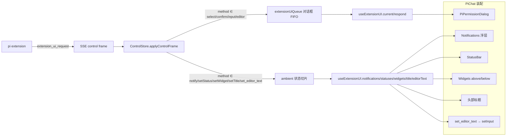

# Design Document — extension-ui-surfaces

## Overview

**Purpose**: 为 pi 扩展经 RPC/SSE 控制通道发出的 5 个"单向推送(fire-and-forget)"类 UI 方法补齐 web 端呈现:`notify`、`setStatus`、`setWidget`、`setTitle`、`set_editor_text`,并把富聊天组件收敛为默认导出的 `PiChat`。

**Users**: pi-web 终端用户(看到扩展的通知/状态/widget/标题、被扩展预填输入框)与集成方(默认即获得富 `PiChat`)。

**Impact**: 当前这 5 个 method 虽被协议层解析,却被一律塞进**交互对话框 FIFO 队列**(`ControlStore.extensionUiQueue`),既无呈现、又会在排到队首时阻塞其后的 `select/confirm/input/editor` 对话框(`useExtensionUI.current = queue[0]`,而 `PiPermissionDialog` 只渲染交互类 4 方法,推送类永不出队)。本设计把推送类方法从对话框队列中**分流**到独立的可观察 ambient 状态,并新增无状态展示元件由 `PiChat` 装配渲染。

本特性**零协议改动、零 server 改动**:`RpcExtensionUIRequestSchema` 已解析全部 9 个 method;`RpcExtensionUIResponseSchema` 仅有 `value/confirmed/cancelled` 三分支 → 推送类 5 方法无回包、不需要 `respond/ack`。

### Goals
- 推送类 5 方法各有面向用户的 web 呈现(通知浮层 / 状态条 / widget 区 / 会话标题 / 写入输入框)。
- 修复"推送方法阻塞交互对话框队列"的缺陷:推送类不入对话框队列。
- 富组件成为默认导出 `PiChat`;原最小组件非破坏保留;`PiChatPro` 作为废弃别名。
- 全程不回归既有测试与类型检查。

### Non-Goals
- 不改 `@blksails/protocol` 契约与 `@blksails/server` 路由(5 方法已解析、无回包)。
- 不实现仅存在于 TUI、不可序列化的富 `Component`(`custom`/`setFooter`/`setHeader`/`setEditorComponent`/autocomplete)。
- 不做推送类状态的持久化或跨会话恢复。

## Boundary Commitments

### This Spec Owns
- `ControlStore` 中推送类 5 方法的 ambient 状态切片(notifications / statuses / widgets / title / editorText)及其入帧分流逻辑。
- `useExtensionUI` 对上述 ambient 状态的只读暴露与 `dismissNotification` 操作。
- 三个无状态展示元件:`Notifications`(通知浮层 / toasts)、`StatusBar`、`Widgets`。
- `PiChat`(由原 `PiChatPro` 收敛而来)对上述元件的装配渲染与 `set_editor_text → setInput`、`setTitle → 头部` 接线。
- `@blksails/ui` 的 `PiChat` / `PiChatBasic` / `PiChatPro`(别名)导出收敛。

### Out of Boundary
- 协议 schema、SSE 帧结构、server 路由与会话引擎(均无需改动)。
- 交互类 4 方法(`select/confirm/input/editor`)的对话框渲染逻辑(`PiPermissionDialog`)——仅确保其不再被推送类阻塞,不改其内部行为。
- TUI-only 富组件能力(后续 Tier)。

### Allowed Dependencies
- 上游:`@blksails/protocol`(`RpcExtensionUIRequest` 类型,只读消费)、`@blksails/react`(`ControlStore` / `useExtensionUI` / 连接)、`@blksails/ui` 既有元件与 `cn`。
- 依赖方向保持 `protocol → react → ui → app`,只向左依赖。

### Revalidation Triggers
- 若 pi 未来为推送类方法引入回包(`RpcExtensionUIResponse` 新分支)→ 需重审"是否需要 ack"。
- 若协议为这些 method 增删字段(如 `setWidget` 的 placement 取值)→ 需重审 ambient 状态与元件 props。
- `PiChat`/`PiChatBasic`/`PiChatPro` 导出名变更 → 通知 `app-shell` 及任何第三方消费者。

## Architecture

### Existing Architecture Analysis
- **控制旁路**:SSE 控制帧经 `connection.ts` 解析 → `ControlStore.applyControlFrame(payload)`,按 `control` 子类型(queue/stats/error/extension-ui)更新不可变快照;`useSyncExternalStore` 订阅,引用稳定防撕裂。
- **现状缺陷**:`case "extension-ui"` 一律 `enqueueExtensionUi(request)`,把推送类与交互类混入同一 FIFO `extensionUiQueue`。`useExtensionUI` 以 `current = queue[0]` 暴露;`PiPermissionDialog` 用 `isInteractive(current)` 守卫只渲染交互类 → 推送类落在队首时不渲染、不出队、阻塞后续交互对话框。
- **装配**:`PiChatPro` 通过 `extensionUI?: UseExtensionUIResult` prop 注入,自身持有 `input` state 与 `setInput`,并渲染 `<PiPermissionDialog extensionUI={extensionUI} />`。头部目前仅来自 `slots.header`。

### Architecture Pattern & Boundary Map



**Architecture Integration**:
- 选定模式:**单 store 双通道**——`ControlStore` 在同一 `extension-ui` 入帧点按 `method` 判别,交互类走原 FIFO 队列(需回包),推送类写入键控/列表 ambient 切片(无回包)。复用既有 `useSyncExternalStore` 订阅,不引入新 store。
- 边界分离:react 层只负责"分流 + 暴露状态";ui 元件层只负责"无状态展示";装配层只负责"接线 + 位置"。
- 保留模式:不可变快照 + 稳定引用、shadcn CSS 变量主题、元件无 pi 接线。
- 新组件理由:三个元件分别承载三类视觉面;ambient 切片承载键控替换/删除语义。

### Technology Stack

| Layer | Choice / Version | Role in Feature | Notes |
|-------|------------------|-----------------|-------|
| Frontend | React 19 + TS strict | 元件与装配 | 无 any,shadcn CSS 变量 |
| State | `ControlStore` + `useSyncExternalStore` | ambient 状态分流与订阅 | 复用既有旁路 store |
| Icons | lucide-react | 通知级别图标 / 关闭按钮 | 既有依赖 |
| Test | vitest + @testing-library + Playwright | 单测 / 集成 / e2e | 既有栈 |

## File Structure Plan

### Directory Structure
```
packages/react/src/
├── sse/control-store.ts          # [改] 新增 ambient 切片 + applyControlFrame 按 method 分流 + dismissNotification/pushEditorText 等
├── hooks/use-extension-ui.ts     # [改] UseExtensionUIResult 增 ambient 字段 + dismissNotification
└── index.ts                      # [改] 导出新 ambient 类型(ExtensionNotification/ExtensionWidget/...)

packages/ui/src/
├── elements/
│   ├── notifications.tsx         # [新] Notifications(toasts):info/warning/error + 自动消失 + 手动关闭
│   ├── status-bar.tsx            # [新] StatusBar:键控状态 pill 行
│   ├── widgets.tsx               # [新] Widgets:按 placement 渲染多行
│   └── index.ts                  # [改] 导出三个新元件
├── chat/
│   ├── pi-chat.tsx               # [改/移] 收敛为富组件(原 pi-chat-pro 内容),导出 PiChat/PiChatProps;接线 ambient 面
│   ├── pi-chat-basic.tsx         # [新/移] 原最小 PiChat 内容,导出 PiChatBasic/PiChatBasicProps
│   └── pi-chat-pro.tsx           # [改] 废弃别名:re-export { PiChat as PiChatPro, PiChatProps as PiChatProProps }
└── index.ts                      # [改] 导出 PiChat(富)/ PiChatBasic(最小)/ PiChatPro(别名)

lib/app/
├── (chat 装配点)                 # [改] 导入由 PiChatPro → PiChat
└── stub-agent-process.mjs        # [改] e2e:handlePrompt 增发 5 个推送帧(置于 confirm 帧之前)
```

### Modified Files
- `packages/react/src/sse/control-store.ts` — `ControlSnapshot` 增 ambient 字段;`applyControlFrame` 的 `extension-ui` 分支按 `request.method` 分流;新增 `dismissNotification(id)`、内部 setter。
- `packages/react/src/hooks/use-extension-ui.ts` — 从快照读出 ambient 字段并入 `UseExtensionUIResult`;`dismissNotification` 委托 store。
- `packages/ui/src/chat/pi-chat.tsx` — 承载富组件并渲染 `Notifications/StatusBar/Widgets`、注入 title、`editorText.seq` effect → `setInput`。
- `packages/ui/src/index.ts` / `elements/index.ts` — 导出收敛与新元件。
- `lib/app/*`、`lib/app/stub-agent-process.mjs` — 装配点切换 + e2e stub 发帧。

> 文件移动:仓库内 `PiChatPro` 无包内/应用引用(已核实),收敛影响面集中在 ui index 与 app 装配点。

## Requirements Traceability

| Requirement | Summary | Components | Interfaces |
|-------------|---------|------------|------------|
| 1.1–1.6 | notify 浮层/级别/自动消失/手动关闭/堆叠/空态 | ControlStore.notifications, Notifications, PiChat | `appendNotification`, `dismissNotification` |
| 2.1–2.5 | setStatus 键控展示/替换/删除/并列/空态 | ControlStore.statuses, StatusBar, PiChat | `setStatus(key,text?)` |
| 3.1–3.5 | setWidget 键控/placement/替换/删除/空态 | ControlStore.widgets, Widgets, PiChat | `setWidget(key,lines?,placement)` |
| 4.1–4.3 | setTitle 头部标题/替换/默认 | ControlStore.title, PiChat 头部 | `setTitle(title)` |
| 5.1–5.4 | set_editor_text 写入/最新/可继续编辑/仅推送时写 | ControlStore.editorText, PiChat effect | `pushEditorText(text)` → `setInput` |
| 6.1–6.4 | 推送不弹窗/不阻塞交互/不回包/交互行为不变 | ControlStore 分流, useExtensionUI, PiPermissionDialog | `applyControlFrame` 分支 |
| 7.1–7.4 | PiChat 收敛/最小保留/别名/app 默认富 | ui index, pi-chat*.tsx, app 装配 | 导出契约 |
| 8.1–8.4 | 主题/a11y/非回归/互不干扰 | 全部新元件 | shadcn CSS 变量, aria |

## Components and Interfaces

| Component | Layer | Intent | Req | Contracts |
|-----------|-------|--------|-----|-----------|
| ControlStore(扩展) | react/state | 推送类分流为 ambient 切片 | 1–6 | State |
| useExtensionUI(扩展) | react/hook | 暴露 ambient 状态 + dismiss | 1–6 | State |
| Notifications | ui/element | 通知浮层(toasts) | 1, 8 | Props |
| StatusBar | ui/element | 键控状态行 | 2, 8 | Props |
| Widgets | ui/element | placement 多行 widget | 3, 8 | Props |
| PiChat(收敛) | ui/assembly | 装配渲染 ambient 面 + 收敛导出 | 4,5,6,7,8 | Props |

### react / state

#### ControlStore(扩展)

| Field | Detail |
|-------|--------|
| Intent | 在同一 extension-ui 入帧点按 method 分流;推送类写入 ambient 切片(无回包),交互类仍入 FIFO 队列 |
| Requirements | 1.1–1.6, 2.1–2.5, 3.1–3.5, 4.1–4.3, 5.1–5.4, 6.1–6.4 |

**Responsibilities & Constraints**
- 不可变快照更新,沿用 `emit`;无变更不换引用。
- statuses/widgets 为键控:`statusText`/`widgetLines` 为 `undefined` 即删除该键(Req 2.3/3.4)。
- notifications 为有序追加列表;`dismissNotification(id)` 移除;设软上限(保留最近 100)防御非挂载场景增长。
- editorText 为一次性信号 `{text, seq}`,每次 `set_editor_text` 自增 `seq`(消费方据 seq 变化触发一次)。
- 交互类(select/confirm/input/editor)路径与既有完全一致。

**State Management**
```typescript
export interface ExtensionNotification {
  readonly id: string;            // 帧 id
  readonly message: string;
  readonly notifyType: "info" | "warning" | "error";  // 帧缺省时归一为 "info"
}
export interface ExtensionWidget {
  readonly lines: readonly string[];
  readonly placement: "aboveEditor" | "belowEditor";  // 帧缺省时归一为 "aboveEditor"
}
export interface EditorTextSignal {
  readonly text: string;
  readonly seq: number;           // 单调递增;消费方据变化触发一次 setInput
}
export interface AmbientUiSnapshot {
  readonly notifications: readonly ExtensionNotification[];
  readonly statuses: Readonly<Record<string, string>>;
  readonly widgets: Readonly<Record<string, ExtensionWidget>>;  // 键 = widgetKey
  readonly title: string | undefined;
  readonly editorText: EditorTextSignal | undefined;
}
// ControlSnapshot 增字段:readonly ambient: AmbientUiSnapshot;
```
- `applyControlFrame` 的 `extension-ui` 分支改为:
  - `select|confirm|input|editor` → `enqueueExtensionUi(request)`(不变)
  - `notify` → 追加 notification(归一 notifyType)
  - `setStatus` → `statusText===undefined` 删键,否则置键
  - `setWidget` → `widgetLines===undefined` 删键,否则置键(归一 placement)
  - `setTitle` → 置 title
  - `set_editor_text` → 置 `{text, seq: prev+1}`
- 新公开方法:`dismissNotification(id: string): void`。
- Invariants:交互类项绝不进入 ambient;推送类项绝不进入 `extensionUiQueue`。

#### useExtensionUI(扩展)

| Field | Detail |
|-------|--------|
| Intent | 从快照读出 ambient 状态并入返回值;新增 dismissNotification;推送类不调 client.uiResponse |
| Requirements | 1–6 |

**Contracts**: State
```typescript
export interface UseExtensionUIResult {
  // 既有(交互类,不变):
  readonly queue: readonly RpcExtensionUIRequest[];
  readonly current: RpcExtensionUIRequest | undefined;
  respond(requestId: string, response: UiResponseRequest): Promise<void>;
  readonly error: unknown;
  readonly pending: boolean;
  // 新增(推送类 ambient,只读 + 一个本地操作):
  readonly notifications: readonly ExtensionNotification[];
  readonly statuses: Readonly<Record<string, string>>;
  readonly widgets: Readonly<Record<string, ExtensionWidget>>;
  readonly title: string | undefined;
  readonly editorText: EditorTextSignal | undefined;
  dismissNotification(id: string): void;
}
```
- 向后兼容:纯增字段;无连接时各 ambient 字段回落为空(EMPTY 常量 / undefined),`dismissNotification` no-op。

### ui / elements(无状态,shadcn CSS 变量,a11y)

#### Notifications(toasts)
| Field | Detail |
|-------|--------|
| Intent | 堆叠展示通知,按 notifyType 配色,自动消失 + 手动关闭 | 
| Requirements | 1.1, 1.2, 1.3, 1.4, 1.5, 8.1, 8.2 |

**Props & 行为**
```typescript
export interface NotificationsProps {
  readonly notifications: readonly ExtensionNotification[];
  readonly onDismiss: (id: string) => void;
  readonly autoDismissMs?: number;   // 默认 ~5000;<=0 关闭自动消失
  readonly className?: string;
}
```
- 每条 toast 用 `id` 作 key;挂载后 `setTimeout(onDismiss, autoDismissMs)`,卸载清理。
- 配色经 CSS 变量:info → `--muted`/`--foreground`;warning/error → 既有语义变量(如 `--destructive` 用于 error);不硬编码颜色。
- a11y:error → `role="alert"`,info/warning → `role="status"`;关闭按钮带 `aria-label`。
- 空列表返回 `null`(Req 1.6),容器 `data-pi-notifications`,每条 `data-pi-notification` + `data-pi-notify-type`。

#### StatusBar
| Field | Detail |
|-------|--------|
| Intent | 并列展示键控状态项(小 pill) |
| Requirements | 2.1, 2.4, 2.5, 8.1 |

```typescript
export interface StatusBarProps {
  readonly statuses: Readonly<Record<string, string>>;
  readonly className?: string;
}
```
- 空对象返回 `null`(Req 2.5)。按键稳定顺序渲染(`Object.keys` 排序或保持插入序——用排序以稳定)。`data-pi-status-bar`,每项 `data-pi-status` + `data-status-key`。

#### Widgets
| Field | Detail |
|-------|--------|
| Intent | 渲染某 placement 的 widget 文本行 |
| Requirements | 3.1, 3.2, 3.5, 8.1 |

```typescript
export interface WidgetsProps {
  readonly widgets: readonly { readonly key: string; readonly lines: readonly string[]; readonly placement: "aboveEditor" | "belowEditor" }[];
  readonly placement: "aboveEditor" | "belowEditor";
  readonly className?: string;
}
```
- 仅渲染匹配 `placement` 的项;过滤后为空返回 `null`(Req 3.5)。多行用等宽/逐行渲染。`data-pi-widgets` + `data-pi-widget-placement`,每项 `data-pi-widget` + `data-widget-key`。

### ui / assembly

#### PiChat(由 PiChatPro 收敛)
| Field | Detail |
|-------|--------|
| Intent | 渲染 ambient 面 + 接线 title/editorText;成为默认导出 PiChat |
| Requirements | 4.1–4.3, 5.1–5.4, 6.1, 7.1, 7.4, 8.1, 8.4 |

**接线**
- 从 `extensionUI`(扩展后的 `UseExtensionUIResult`)取 ambient 状态;无 `extensionUI` 时各面不渲染(降级)。
- **Notifications**:固定定位浮层(容器根加 `relative`),传 `notifications` + `dismissNotification`。
- **StatusBar + title**:内部头部带:title 存在时渲染标题;statuses 非空时渲染 StatusBar。该内部头部独立于 `slots.header`,置于主列顶部(`slots.header` 仍渲染)。
- **Widgets**:把 `widgets` 由 `Record` 派生为数组(`useMemo`),在 `promptInput` 上方渲染 `<Widgets placement="aboveEditor">`、下方渲染 `belowEditor`;空态与会话态两分支共用(抽到包裹 promptInput 的小片段)。
- **set_editor_text**:`useEffect` 依赖 `extensionUI?.editorText?.seq`,变化时 `setInput(editorText.text)`(Req 5.1/5.2);仅推送触发,不改写用户输入(Req 5.4)。首次挂载若已有信号也应用一次。
- **不回包**:推送类不经任何 `respond`(Req 6.3)——本就由 hook 保证(ambient 不入队)。
- props 上新增可选 `notificationsAutoDismissMs?` 透传给 Notifications(便于测试与定制)。

#### PiChat 导出收敛(Req 7)
- `pi-chat.tsx` 导出 `PiChat` / `PiChatProps`(= 原 `PiChatPro` 全部能力 + 上述 ambient 接线)。
- `pi-chat-basic.tsx` 导出 `PiChatBasic` / `PiChatBasicProps`(= 原最小 PiChat,不变)。
- `pi-chat-pro.tsx` 仅 `export { PiChat as PiChatPro, type PiChatProps as PiChatProProps } from "./pi-chat.js";`(废弃别名,Req 7.3,带 `@deprecated` JSDoc)。
- `index.ts` 同时导出三者;`app-shell` 装配点导入改为 `PiChat`(Req 7.4)。

## Data Models

仅前端内存态(无持久化)。键控替换/删除语义:
- statuses:`Record<statusKey, string>`,删除 = `delete`。
- widgets:`Record<widgetKey, {lines, placement}>`,删除 = `delete`。
- notifications:有序数组,追加 + 按 id 移除,软上限 100。
- title:`string | undefined`。
- editorText:`{text, seq}`,seq 单调递增。

## Error Handling

### Error Strategy
- 推送类为 fire-and-forget:无回包、不抛错;格式非法的帧在协议层已被 `RpcExtensionUIRequestSchema` 拦截,不进入 store。
- 降级:无 `extensionUI` prop / 无连接 → ambient 字段为空 → 各面不渲染,不报错(Req 1.6/2.5/3.5/4.3)。

### Error Categories and Responses
- **User Errors**:无(推送类无用户输入)。
- **System Errors**:连接缺失 → 空态降级。
- **Business Logic**:删除不存在的 status/widget 键 → no-op;dismiss 不存在的通知 id → no-op。

### Monitoring
- 复用既有控制帧路径;不新增日志面。`data-*` 属性供测试/调试观察。

## Testing Strategy

### Unit Tests(react)
1. `control-store`:`notify` 帧 → notifications 追加且 notifyType 归一;多条堆叠并存。
2. `control-store`:`setStatus` 置键/同键替换/`undefined` 删键;多键并列。
3. `control-store`:`setWidget` 置键/替换/`undefined` 删键/placement 归一;`setTitle` 置/替换;`set_editor_text` seq 单调递增。
4. `control-store`:交互类 4 方法仍入 `extensionUiQueue`,**不**进 ambient;推送类**不**进队列(防阻塞回归)。
5. `dismissNotification` 移除指定 id,其余不变;软上限生效。

### Unit Tests(ui 元件)
1. `Notifications`:空 → null;多条渲染 + key;手动关闭调 onDismiss;自动消失(fake timers)调 onDismiss;error→role=alert,info/warning→role=status。
2. `StatusBar`:空 → null;多键并列;键序稳定。
3. `Widgets`:空/无匹配 placement → null;仅渲染匹配 placement;多行渲染。

### Integration Tests(ui 装配)
1. `PiChat`:注入 notify/setStatus/setWidget/setTitle 帧(经 mock extensionUI 结果)→ 各面渲染;title 进头部;StatusBar/Widgets 就位。
2. `PiChat`:注入 `set_editor_text` → 输入框值变为该文本;再注入新文本 → 取最新(seq 变化)。
3. `PiChat`:推送类与交互类同时存在 → PiPermissionDialog 仍弹出(队列未被阻塞,Req 6.2)。
4. 收敛冒烟:`PiChat` 即富界面(原 PiChatPro 测试迁移);`PiChatBasic` 仍可渲染;`PiChatPro` 别名等价。

### E2E(浏览器,确定性 stub)
1. stub `handlePrompt` 在 confirm 帧**之前**增发 notify/setStatus/setWidget/setTitle/set_editor_text 帧;断言:toast 文本可见、状态项可见、widget 行可见、头部标题可见、输入框被写入;随后 confirm 对话框仍可见并可应答(证明未被阻塞,Req 6.2)。
2. 复用 `PI_WEB_STUB_AGENT=1` + `PI_WEB_E2E_EXTERNAL_SERVER` 既有运行方式。

### 基线回归
- 全量 `pnpm test` + `pnpm typecheck` 全绿;无硬编码颜色;无 any(Req 8.3)。
