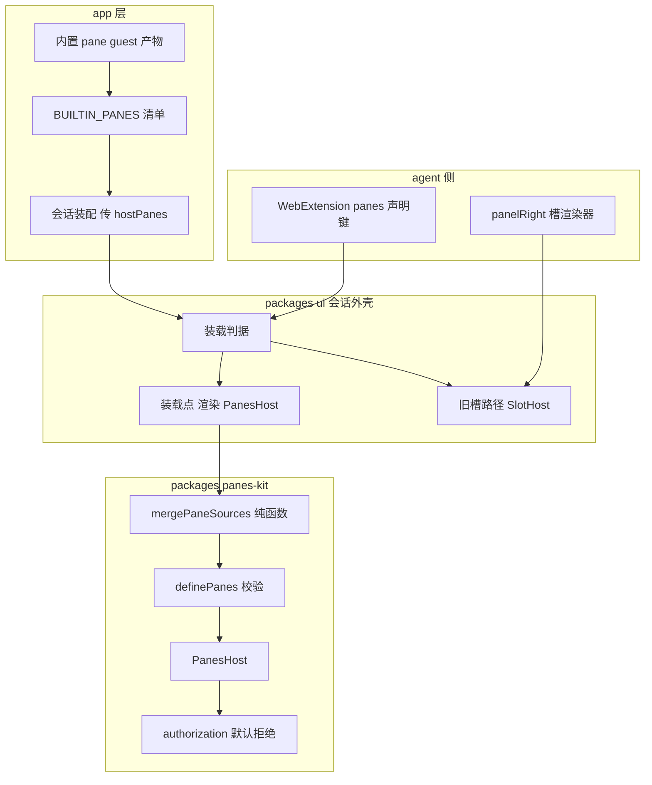
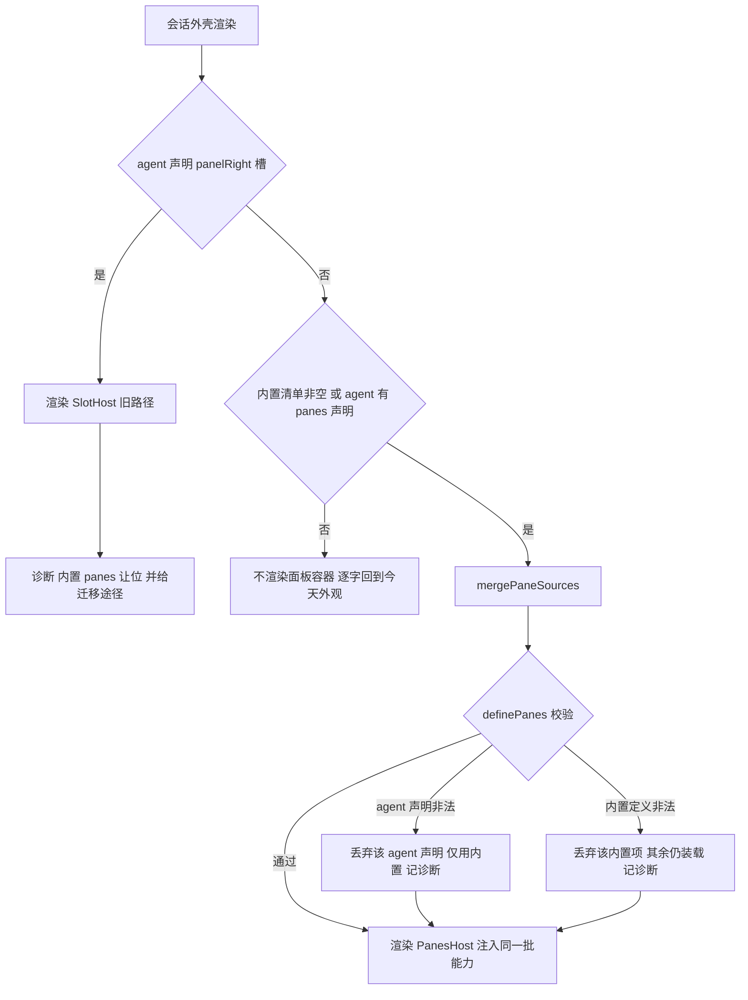
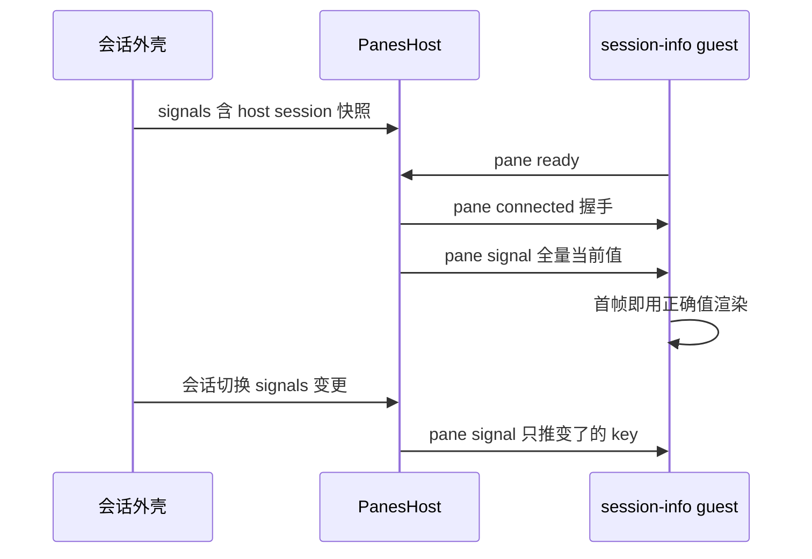

# Design Document — host-builtin-panes

## Overview

**Purpose**:把 panes 从「agent 的私有装饰」提升为「宿主对所有会话都成立的能力」。
宿主持有一份内置 pane 定义清单,在会话外壳侧装载 `PanesHost`;agent 若声明 pane,
则与内置集合在装载期合并为单一定义。

**Users**:使用任意 agent 的终端用户(尤其是用不带 web extension 的 agent 的用户);
以及为 pi-web 提供通用能力的宿主维护者。

**Impact**:改变今天「右侧面板整体以 `extension?.slots?.panelRight !== undefined` 为启用
判据」这一事实 —— 该判据被替换为「宿主内置集合非空 **或** agent 有 pane 贡献」。面板容器、
显示/隐藏开关、连续宽度拖拽、比例切换器、以及只注入给该区域的 agent 状态访问与空闲控制流,
随之对所有会话可用。

### Goals

- 宿主内置 pane 在每个会话中装载,与 agent 是否提供 web extension、以何模式运行无关(1.x)。
- 内置 ⊕ agent 的合并语义明确、顺序稳定、上限不缩水(2.x)。
- 内置 pane 的身份不产生任何额外权限(4.x)。
- 既有 agent 侧 panes 零回退(5.x)。
- 交付一个真实可点开的最小内置 pane,使装载链路的通/断在观察上可区分(6.x)。

### Non-Goals

- 不实现 file_explorer / code_editor / logging / browser 四个内置 pane(下游 spec)。
- 不定义文件系统、日志等宿主能力接口(→ `pane-host-capabilities`)。
- 不改动 panes-kit 的五种 guest 操作与四种下行消息(合并只消费既有契约)。
- 不引入 pane 来源的运行时插件式注册(泛化留在接口签名,不建注册表多态)。
- 不承担部署形态判定(→ `desktop-account-login`)。

## Boundary Commitments

### This Spec Owns

- **宿主内置 pane 清单**:单一权威数组,新增内置 pane 只改一处(镜像 `BUILTIN_EXTENSIONS` 纪律)。
- **pane 来源合并**:纯函数,输入若干来源、输出单一 `PanesDefinition`,含冲突与上限合成规则。
- **保留命名空间**:内置 pane 标识的前缀约定,及对 agent 冒用的拒绝。
- **宿主侧装载判据与装载点**:会话外壳何时渲染 `PanesHost`、注入哪些能力。
- **`WebExtension.panes` 声明键**:agent 让宿主可枚举其 pane 贡献的唯一途径(领域中立搬运)。
- **最小内置 pane `host:session-info`** 及其数据通道选择。

### Out of Boundary

- 任何具体业务 pane 的领域行为与 UI。
- 宿主能力 route(文件/日志)的接口与鉴权。
- panes-kit 的授权模型本身 —— 本设计**消费**它,不修改、不放宽。
- agent 侧 pane 工具与路由的绑定校验(`composePaneAgentModules`,既有能力,不改)。

### Allowed Dependencies

依赖方向严格单向,自左向右,不得反向:

```
panes-kit(契约/宿主组件/授权) → ui(会话外壳渲染) → app 层(内置清单 + 装配)
web-kit(WebExtension 契约) → ui
```

- `packages/ui` **不得**知道任何具体内置 pane 是什么 —— 它只接受一份 `PanesDefinition`。
  这条是 SES-H1 宿主中立线的同类纪律:领域内容不进通用 UI 包。
- `packages/panes-kit` **不得**反向依赖 `ui` 或 app 层。
- 内置 pane 的 guest 代码**不得**从宿主 realm import 任何东西(它跑在独立 realm)。

### Revalidation Triggers

以下改动须让下游 spec 与 agent 作者重新核对集成:

- `WebExtension.panes` 声明键的形状变化。
- 保留命名空间前缀的变化(会让既有内置 pane 标识全部失效)。
- 合并规则中「顺序」「上限合成」「初始打开集合」任一条语义变化。
- 内置 pane 的 document 形态从内联切换为宿主 serve 的 URL(引入静态资源路径前提)。
- `PiChat` 的 `hostPanes` 契约变化。

## Architecture

### Existing Architecture Analysis

勘察确认的既有事实(决定了本设计的形状):

| 事实 | 位置 | 对本设计的约束 |
|------|------|----------------|
| 右侧面板整体启用判据 = agent 声明了 `panelRight` 槽 | `packages/ui/src/chat/pi-chat.tsx:1290`、`:902`;`components/chat-app.tsx:654` | 判据必须改写为「内置非空 ∨ agent 有贡献」,否则「零改动即可见」无从成立 |
| `panelRight` 是**唯一**被注入 agent 状态访问的区域,且声明它的扩展须常开空闲控制流 | `pi-chat.tsx:896-903` | 宿主装载时必须等价地注入,否则 agent 快照更新会丢 |
| slot 实际注入面远宽于 `SlotRenderProps` 的声明 | `apply-extension.tsx:165-204` 的 `SlotHost` | 宿主装载点须复用同一批注入值,不可只传 definition |
| agent 的 pane 定义只活在其槽渲染器闭包里 | `examples/panes-agent/web/web.config.tsx:36` | 宿主无从枚举 → 必须新增声明键 |
| `definePanes` 已做全部结构校验(标识唯一、实例上限、初始集合、同时打开上限) | `packages/panes-kit/src/contract.ts:188-211` | 合并结果过一遍它即得 2.3 全部约束,**不自建校验** |
| pane document 仅两形态:内联 `srcDoc` 与 `html` 的 `src` | `contract.ts:34-38`;渲染在 `panes-host.tsx:539-540` | 内置 pane 需二选一(见下方决策) |
| iframe 固定 `sandbox="allow-scripts"`(无 `allow-same-origin`) | `panes-host.tsx:539` | 两形态都是 opaque origin,隔离性一致 |
| 生产 CSP 已含 `frame-src 'self' blob: data:` | `server/static.ts:190` | `html` 形态在生产可行(已验证,非假设) |
| 授权只源于已装载定义,guest 自报标识不产生权限 | `packages/panes-kit/src/authorization.ts` | 4.x 由「不碰它」自动满足;内置 pane 走同一路径 |

### Architecture Pattern & Boundary Map



**Architecture Integration**:

- **选定模式**:来源合并 + 单一渲染点。两个来源(内置、agent 声明)在装载期折叠为一份
  `PanesDefinition`,由**一个** `PanesHost` 渲染。理由:两个并存的 `PanesHost` 会产生两套
  tab 与两套实例生命周期,用户看到的是分裂的面板;而合并只需一个纯函数。
- **责任分离**:合并规则(领域无关)下沉 `panes-kit`;内置清单(领域内容)留 app 层;
  `ui` 只做判据与渲染,对 pane 内容零认知。
- **保留的既有模式**:旧槽路径完整保留(5.3);面板宽度/比例/开关逻辑原样复用(1.5);
  授权模型零改动(4.x)。
- **新组件理由**:`mergePaneSources` 是本 spec 唯一的新领域无关原语 —— 它承载 2.x 与 3.x
  的全部规则,且可穷举单测。

### 四个关键决策

**D1 · 内置 pane 的 document 用内联 `srcDoc`,不用宿主 serve 的 URL。**
`html` 形态在生产 CSP 下可行(`frame-src 'self'` 已放开,已核实),但它引入「宿主静态资源
路径在五种部署形态(dev / standalone / desktop / 云端 / e2b 沙箱)下都必须正确」这个前提。
该前提在本仓有前科(runner bootstrap 路径的五形态解析、内置扩展解析根随包走)。内联 srcDoc
零网络、零路由,形态无关,且与 `examples/*/build.ts` 既有模式同构(可复用 `build:webext-examples`
的脚本形态)。**逃生门**:契约本就支持 `html` 形态,将来体积大的内置 pane(如编辑器)可单独切换,
切换即触发 Revalidation。

**D2 · 合并结果一律过 `definePanes`。**
2.3 要求「合并结果满足与单一来源定义相同的结构约束」。`definePanes` 已实现全部该类校验,
故合并函数只做**拼接与冲突判定**,结构合法性交给它 —— 不自建第二套校验(否则两套规则必然漂移)。

**D3 · agent 用旧槽形态时,内置 panes 让位而非并存。**
旧槽渲染器占满面板区域,无处再放内置 panes;两个 `PanesHost` 并存会造成分裂 UI。故:
agent 声明了 `panelRight` 槽 → 走旧路径,内置 panes 不显示,并输出一条可定位的诊断说明
迁移途径(改用 `panes` 声明键即可与内置合并)。

该让位语义已回写为 1.2 —— 设计评审时发现它与 1.1 原措辞(「不以 agent 是否声明右侧面板槽为
前提」)字面冲突,故回到需求阶段把例外显式化,而不是在设计里辩解一个需求没说的例外。

**D4 · `host:session-info` 的数据走 `pane:signal`,不新增能力。**
五种 guest 操作里没有「读会话信息」,而 6.1 要求不依赖范围外新能力。`pane:signal` 的设计
意图正是「搬运只存在于宿主 realm 的东西」,且语义是最后值即真值(晚连/重连不丢)。宿主把
会话标识、agent 源、工作目录作为一个具名信号下推即可,零新增契约。

### Technology Stack

| Layer | Choice | Role in Feature | Notes |
|-------|--------|-----------------|-------|
| Frontend | 既有 `packages/panes-kit` React 宿主组件 | 渲染与隔离 | 零版本变动 |
| Frontend | 既有 `packages/ui` 会话外壳 | 装载判据与装载点 | 加一个 prop |
| Build | esbuild(仓内既有) | 内置 pane guest 打包为 srcDoc | 复用 `build:webext-examples` 脚本形态 |
| Contract | 既有 `packages/web-kit` | 新增 `panes` 声明键 | 本 spec 唯一契约新增 |

**无新依赖。**

## File Structure Plan

### Directory Structure

```
packages/panes-kit/src/
└── merge.ts                      # 新增:mergePaneSources 纯函数 + 保留命名空间常量与判定

lib/app/builtin-panes/
├── index.ts                      # 新增:BUILTIN_PANES 单一权威清单(新增内置 pane 只改这里)
├── session-info.ts               # 新增:host:session-info 的 PaneDefinition(含 srcDoc 产物引入)
└── session-signal.ts             # 新增:会话信息 → pane:signal 的组装(领域内容,不进 ui 包)

panes/                            # 新增:内置 pane 的 guest 源码(独立 realm,不 import 宿主)
└── session-info/
    ├── main.tsx                  # guest 入口:connectPaneGuest + 订阅 host:session 信号
    └── generated.d.ts            # srcDoc 产物的类型垫片(产物本身不入库)

scripts/
└── build-builtin-panes.ts        # 新增:panes/ → srcDoc 产物(镜像 build-webext-examples.ts)
```

### Modified Files

- `packages/web-kit/src/define-web-extension.ts` — `WebExtension` 增 `panes?: PanesDefinitionInput`
  声明键;宿主对其领域中立(只搬运)。文档注明与 `slots.panelRight` 的互斥语义(D3)。
- `packages/ui/src/chat/pi-chat.tsx` — 加 `hostPanes?: PanesDefinition` prop;把
  `hasPanelRight`(:1290)与 `hasSurfacePanel`(:902)判据改为「内置非空 ∨ agent 有贡献」;
  装载点(:1994)按 D3 在「渲染 `PanesHost`」与「渲染 `SlotHost`」间分派,两条路径注入同一批能力。
- `components/chat-app.tsx` — `hasPanelRight`(:654)判据同步改写;把 `BUILTIN_PANES` 与
  会话信号经 prop 传入 `PiChat`。
- `packages/panes-kit/src/index.ts` — 导出 `mergePaneSources` 与命名空间常量。
- `examples/panes-agent/web/web.config.tsx` — 迁到 `panes` 声明键,验证合并路径(2.x)。
- `package.json` — 加 `build:builtin-panes`,并挂到既有 client 构建链前。
- `examples/aigc-canvas-agent/` — **刻意不动**:保留旧槽形态作为 5.3 的回归守卫。

## System Flows

### 装载判据与分派



关键决策:校验失败**不整体不装载** —— 单个来源的非法只淘汰该来源(5.4/7.2)。
「agent 声明非法」与「某内置项非法」是两条独立的降级路径,不可合并为一个 try/catch。

### 会话信息下推



## Requirements Traceability

| Requirement | Summary | Components | Interfaces | Flows |
|-------------|---------|------------|------------|-------|
| 1.1, 1.3 | 内置 panes 默认装载 | 装载判据、装载点 | `hostPanes` prop | 装载判据与分派 |
| 1.2 | 旧槽形态下内置让位 | 装载判据(分派) | — | 装载判据与分派(Legacy 分支) |
| 1.4 | cli 模式同等 | 装载判据 | — | 判据不含 agent 运行模式,取证覆盖 |
| 1.5 | 宽度与比例能力 | 装载点 | 复用既有 panelRatio/panelWidth | — |
| 1.6 | 初始打开与空态 | `mergePaneSources` | `initialPaneIds` 合成 | 装载判据与分派 |
| 1.7 | 空集合逐字回退 | 装载判据 | — | 装载判据与分派(Nothing 分支) |
| 2.1 | 内置在前顺序稳定 | `mergePaneSources` | — | — |
| 2.2 | agent 声明可枚举 | `WebExtension.panes` | 声明键 | — |
| 2.3 | 合并结果结构合法 | `mergePaneSources` + `definePanes` | — | 装载判据与分派(Valid) |
| 2.4 | 上限取较大者 | `mergePaneSources` | `maxOpenPanes` 合成 | — |
| 2.5 | agent 初始集合优先 | `mergePaneSources` | `initialPaneIds` 合成 | — |
| 3.1–3.4 | 保留命名空间 | 命名空间常量 + 合并期判定 | — | 装载判据与分派 |
| 4.1–4.4 | 内置身份不提权 | 复用 `authorization` | — | — |
| 5.1–5.3 | 既有 panes 不回退 | 旧槽路径保留 | `SlotHost` 原样 | 装载判据与分派(Legacy) |
| 5.4 | agent 声明非法降级 | 装载点 | — | 装载判据与分派(Fallback) |
| 6.1–6.3 | 最小内置 pane | `host:session-info` + 会话信号 | `pane:signal` | 会话信息下推 |
| 7.1, 7.2 | 诊断与部分降级 | 全部降级路径 | 既有 logger | 装载判据与分派 |
| 7.3, 7.4 | 取证方式 | — | — | 见 Testing Strategy |

## Components and Interfaces

| Component | Layer | Intent | Req Coverage | Key Dependencies | Contracts |
|-----------|-------|--------|--------------|------------------|-----------|
| `mergePaneSources` | panes-kit | 多来源折叠为单一定义 | 2.1–2.5, 3.1–3.4, 1.5 | `definePanes` (P0) | Service |
| `BUILTIN_PANES` | app | 内置 pane 单一权威清单 | 1.1, 6.1, 7.2 | pane 定义各文件 (P0) | State |
| 装载判据与装载点 | ui | 何时渲染、注入什么、如何分派 | 1.1–1.7, 5.1–5.4 | `PanesHost` (P0), `SlotHost` (P0) | Service |
| `WebExtension.panes` | web-kit | agent 贡献对宿主可枚举 | 2.2 | — | API |
| `host:session-info` | app + guest | 装载链路的可取证载体 | 6.1–6.3 | `pane:signal` (P0) | State |

### panes-kit

#### mergePaneSources

| Field | Detail |
|-------|--------|
| Intent | 把若干 pane 来源按规则折叠为单一 `PanesDefinition`,并淘汰非法来源 |
| Requirements | 1.6, 2.1, 2.3, 2.4, 2.5, 3.1, 3.2, 3.3, 3.4 |

**Responsibilities & Constraints**

- 纯函数,无 I/O、无 React、无全局状态 —— 可穷举单测。
- 顺序权威:内置来源在前,agent 来源在后,输出顺序只由输入顺序决定,不受装载时序影响(2.1)。
- 结构合法性**不自证**,一律交 `definePanes`(D2)。
- 单个来源非法只淘汰该来源,不影响其余(5.4, 7.2)。
- 不认识任何具体 pane 的语义 —— 领域中立。

**Dependencies**

- Outbound:`definePanes` — 合并结果的结构校验(P0)。
- Inbound:ui 会话外壳的装载点(P0)。

**Contracts**: Service [x]

##### Service Interface

```typescript
/** 保留给宿主内置 pane 的标识前缀。agent 声明该前缀即被拒绝。 */
export const HOST_PANE_ID_PREFIX = "host:";

export type PaneSourceKind = "builtin" | "agent";

export interface PaneSource {
  readonly kind: PaneSourceKind;
  /** 来源标识,仅用于诊断(如 agent 的 manifestId、"builtin")。 */
  readonly origin: string;
  readonly definition: PanesDefinitionInput;
}

export interface PaneMergeRejection {
  readonly origin: string;
  readonly kind: PaneSourceKind;
  /** 被拒的是整个来源还是其中某些 pane。 */
  readonly scope: "source" | "panes";
  readonly paneIds: readonly string[];
  readonly reason:
    | "reserved-namespace"
    | "invalid-definition"
    | "duplicate-pane-id";
  readonly detail: string;
}

export interface PaneMergeResult {
  /** 合并且校验通过的定义;所有来源都被淘汰时为 undefined。 */
  readonly definition: PanesDefinition | undefined;
  /** 全部淘汰记录,调用方据此输出诊断(7.1)。 */
  readonly rejections: readonly PaneMergeRejection[];
}

export function mergePaneSources(
  sources: readonly PaneSource[],
): PaneMergeResult;
```

- **Preconditions**:`sources` 顺序即优先顺序;调用方保证 `kind: "builtin"` 的来源确实是宿主自己的。
- **Postconditions**:
  - `definition` 非空时必已通过 `definePanes`。
  - `kind: "agent"` 的来源中任何使用 `HOST_PANE_ID_PREFIX` 的 pane 均被淘汰并记入 `rejections`
    (3.2),该来源的其余合法 pane 仍保留(3.2 的「不连坐」)。
  - `kind: "builtin"` 的 pane 允许且必须使用该前缀;违反者记 `rejections` 并淘汰。
  - agent 的 pane 永不覆盖同标识的内置 pane —— 前缀规则使同标识在结构上不可能(3.1, 3.3)。
  - `maxOpenPanes` = 各来源声明值的最大者(2.4)。
  - `initialPaneIds` = agent 来源的初始集合完整保留,内置的默认打开项仅在追加后不超
    `maxOpenPanes` 时追加;超出则丢弃内置项(2.5)。
- **Invariants**:输出的 pane 标识唯一;输出顺序 = 输入来源顺序 × 各来源内声明顺序。

**Implementation Notes**

- Integration:唯一调用方是 ui 的装载点;`rejections` 由调用方转成诊断日志,合并函数自身不打日志
  (保持纯函数,便于单测)。
- Validation:`definePanes` 抛错即视为该来源 `invalid-definition`;须逐来源单独校验后再整体校验,
  否则无法区分「谁非法」。
- Risks:整体校验可能因**跨来源**的组合而失败(如初始集合超上限),此时不可归因于单一来源 ——
  设计上由 `initialPaneIds` 合成规则(2.5)提前保证不会越界,而非依赖整体校验兜底。

### ui(会话外壳)

#### 装载判据与装载点

| Field | Detail |
|-------|--------|
| Intent | 决定是否渲染面板、渲染哪条路径、注入哪些能力 |
| Requirements | 1.1, 1.2, 1.3, 1.4, 1.5, 1.6, 1.7, 5.1, 5.2, 5.3, 5.4, 7.1, 7.2 |

**Responsibilities & Constraints**

- 对 pane 内容零认知:只接受 `hostPanes`,不知道里面是文件浏览器还是会话信息。
- 两条路径注入**同一批**能力(`state / surface / upload / baseUrl / sessionId / syncSignal /
  conversation / signals`),否则宿主装载的 pane 会缺失 agent 快照(5.2)。
- 判据改写必须同时覆盖 `hasPanelRight` 与 `hasSurfacePanel` —— 后者控制空闲控制流,漏改会
  表现为「pane 起来了但快照永不更新」。

**Contracts**: Service [x] / State [x]

##### Service Interface

```typescript
/** PiChat 的新增 prop(其余 prop 不变)。 */
interface PiChatHostPanesProps {
  /**
   * 宿主内置 pane 定义。app 层装配,ui 包对其内容领域中立。
   * undefined 或 panes 为空 → 面板容器整体不渲染(1.7)。
   */
  readonly hostPanes?: PanesDefinition;
  /** 宿主 realm 的具名信号,透传给 PanesHost(承载 host:session 等)。 */
  readonly paneSignals?: Readonly<Record<string, unknown>>;
}
```

##### State Management

- 状态模型:`hasAgentSlot`(agent 是否声明旧槽)、`agentPaneDecl`(agent 的 `panes` 声明)、
  `hostPanes` 三者决定分派;合并结果按 `useMemo` 缓存,依赖三者的引用。
- 一致性:合并必须是**渲染期纯计算**,不可放进 effect —— 否则首帧无 definition,`PanesHost`
  会以空定义建连,产生一次无效握手。
- 并发:无 —— 合并无副作用。

**Implementation Notes**

- Integration:装载点在 `pi-chat.tsx:1994` 现有 `showPanelRight` 分支内分派;`chat-app.tsx:654`
  的同名判据须同步,否则外层容器与内层内容对不上(一个显示一个不显示)。
- Validation:`rejections` 非空时经既有 logger 输出,须含来源标识与 pane 标识(7.1)。
- Risks:★ 这是时序敏感面。既有教训:panes-kit 组件级测试 31/31 全绿而真实浏览器 4 套 e2e
  全红。判据改写触及 `hasSurfacePanel` → 空闲控制流开启条件 → 快照时序,必须以真实浏览器取证(7.3)。

### app 层

#### BUILTIN_PANES 清单

| Field | Detail |
|-------|--------|
| Intent | 内置 pane 的单一权威来源,新增只改一处 |
| Requirements | 1.1, 6.1, 7.2 |

**Contracts**: State [x]

```typescript
/** 单一权威清单。新增内置 pane = 加一个文件 + 在此加一行(镜像 BUILTIN_EXTENSIONS 纪律)。 */
export const BUILTIN_PANES: readonly PaneDefinitionInput[] = [sessionInfoPane];

/** 组装为一个来源;panes 为空时返回 undefined,使装载判据落到 1.6 的回退分支。 */
export function builtinPaneSource(): PaneSource | undefined;
```

**Implementation Notes**

- Integration:`chat-app.tsx` 消费它并连同会话信号传入 `PiChat`。
- Validation:清单内每项的标识必须带 `HOST_PANE_ID_PREFIX`,由 `mergePaneSources` 强制(不在此重复校验)。
- Risks:清单若被下游 spec 改成按条件过滤,会重新引入「某形态下静默缺失」——过滤逻辑应落
  各 pane 定义内部(能力不可用时自行降级),不落清单。这与「门控落能力内部」的既有纪律一致。

#### host:session-info(最小内置 pane)

| Field | Detail |
|-------|--------|
| Intent | 使装载链路的通/断在观察上可区分 |
| Requirements | 6.1, 6.2, 6.3 |

**Contracts**: State [x]

- 数据通道:`pane:signal` 的 `host:session` 键(D4),载荷为会话标识、agent 源标识、工作目录。
- capabilities:**全空** —— 它不需要任何 route / surface / attachment / conversation 授权。
  这同时是 4.x 的活体证据:一个零授权的 pane 确实什么都调不动。
- guest 侧须对信号载荷做运行期校验(缺字段显示空态而非崩)—— `guest.query` 泛型是断言不是校验,
  同类教训已在 Wave 5 出现过。

**Implementation Notes**

- Integration:guest 源码在 `panes/session-info/`,经 `scripts/build-builtin-panes.ts` 打成 srcDoc。
- Validation:产物**不入库**(与 `examples/*/build.ts` 同纪律),构建完即用;类型侧由 `.d.ts` 垫片兜住,
  故 typecheck 不依赖构建产物。
- Risks:若产物入库,会出现「本地绿是因为工作树里躺着一份没人生成的产物」——本仓已有三次前科。

### web-kit

#### WebExtension.panes 声明键

| Field | Detail |
|-------|--------|
| Intent | 让 agent 的 pane 贡献对宿主可枚举 |
| Requirements | 2.2 |

**Contracts**: API [x]

```typescript
interface WebExtension {
  // …既有键不变
  /**
   * 该 agent 贡献的 pane 定义。宿主领域中立:只与内置集合合并,不解析 pane 内部语义。
   * 与 `slots.panelRight` 互斥 —— 同时声明时旧槽优先、本键被忽略并记诊断(D3)。
   */
  readonly panes?: PanesDefinitionInput;
}
```

- 向后兼容:该键可选,既有扩展零改动仍按旧槽路径工作(5.3)。

## Error Handling

### Error Strategy

**分级降级,不整体失败** —— 单个来源或单个 pane 的问题不得让整个面板不可用。

| 情形 | 处理 | Req |
|------|------|-----|
| agent 声明使用保留前缀 | 淘汰这些 pane,保留该来源其余 pane 与全部内置 | 3.2 |
| agent 声明整体非法 | 淘汰该来源,仅用内置装载 | 5.4 |
| 某内置项非法 | 淘汰该项,其余内置仍装载 | 7.2 |
| 全部来源被淘汰 | 面板容器不渲染,退回 1.6 的外观 | 1.6 |
| agent 同时声明旧槽与 `panes` | 旧槽优先,`panes` 忽略并记诊断 | D3 |

所有降级路径**必须**输出含来源标识 + pane 标识 + 原因的诊断(7.1),且时机在会话装载期,
不得推迟到用户点开 pane(3.4)。

### Monitoring

复用既有 logger,命名空间与既有 pane 相关日志一致;`rejections` 逐条一行,便于 grep 定位。

## Testing Strategy

### Unit Tests

1. `mergePaneSources` — 顺序稳定性:内置在前、agent 在后,交换输入顺序不改变输出内部顺序(2.1)。
2. `mergePaneSources` — `maxOpenPanes` 取最大者;`initialPaneIds` 中 agent 集合完整保留、
   内置默认项在越界时被丢弃而非丢弃 agent 的(2.4, 2.5)。
3. `mergePaneSources` — agent 冒用保留前缀:该 pane 被淘汰、同来源其余 pane 存活、`rejections`
   含 pane 标识(3.2)。
4. `mergePaneSources` — 单来源非法不连坐:agent 来源整体非法时仍返回仅含内置的合法定义(5.4);
   某内置项非法时其余内置仍在(7.2)。
5. `BUILTIN_PANES` — 清单内每项标识均带保留前缀(守住 3.1 的前提)。

### Integration Tests

1. 装载判据 — `hostPanes` 非空且 agent 无任何贡献时,面板容器与开关渲染(1.1, 1.2)。
2. 装载判据 — `hostPanes` 为 undefined 且 agent 无贡献时,**不出现**面板容器、开关与比例
   切换器(1.7);该用例须能在判据写错时报红。
3. 分派 — agent 声明旧槽时走 `SlotHost` 且内置让位,同时产生迁移诊断(5.3, D3)。
4. 注入等价性 — 宿主装载路径注入的能力集合与旧槽路径逐项一致(5.2);缺任一项即报红。
5. 授权 — 零 capabilities 的内置 pane 发起 route/surface 调用被拒,拒绝载荷与第三方 pane
   在相同情形下一致(4.1, 4.2)。

### E2E/UI Tests(真实浏览器,7.3 的判据)

1. **不带 web extension 的 agent** — 打开会话 → 右侧面板可见 → 点开 `host:session-info` →
   显示真实会话标识(1.2, 6.2)。这是本 spec 的核心验收路径。
2. **cli 模式 agent** — 同上链路成立(1.4)。
3. **带 `panes` 声明键的 agent**(迁移后的 `panes-agent`)— 内置与 agent pane 同时出现、
   顺序为内置在前(2.1),且两者都能正常建连。
4. **带旧槽的 agent**(`aigc-canvas-agent`,刻意不迁)— 行为与本 spec 实施前一致(5.1, 5.3)。

★ 7.4 要求上述四种组合**各自**有证据;仅在其中一种上取证不构成覆盖。

### 取证纪律

- 组件级全绿不构成达标(7.3),既有教训:panes-kit 单测 31/31 绿而真实浏览器 4 套 e2e 全红。
- 每条「不应出现」类断言(1.7)必须先证明它在缺陷存在时会报红 —— 否则「为空/没出现」与
  「判据没装上」在观察上无法区分。

## Security Considerations

本特性触及授权边界,但**采取的策略是不碰它**:

- 内置 pane 与第三方 pane 走同一 `authorization` 路径,内置身份不进入任何判定条件(4.1, 4.3)。
- 保留命名空间使「agent 冒用内置 pane 身份」在结构上不可能(3.1)——这是本设计对未来
  `pane-host-capabilities` 的关键前置:文件读写能力将授予内置 pane 标识,身份可冒用即等于权限可窃取。
- `host:session-info` 的 capabilities 全空,作为「内置不提权」的活体证据。
- 会话信息经 `pane:signal` 下推,载荷限于会话标识、agent 源、工作目录 —— 不含凭据、不含
  绝对路径以外的宿主环境信息。工作目录本身对该会话的 agent 已然可见,故不构成新增暴露。
