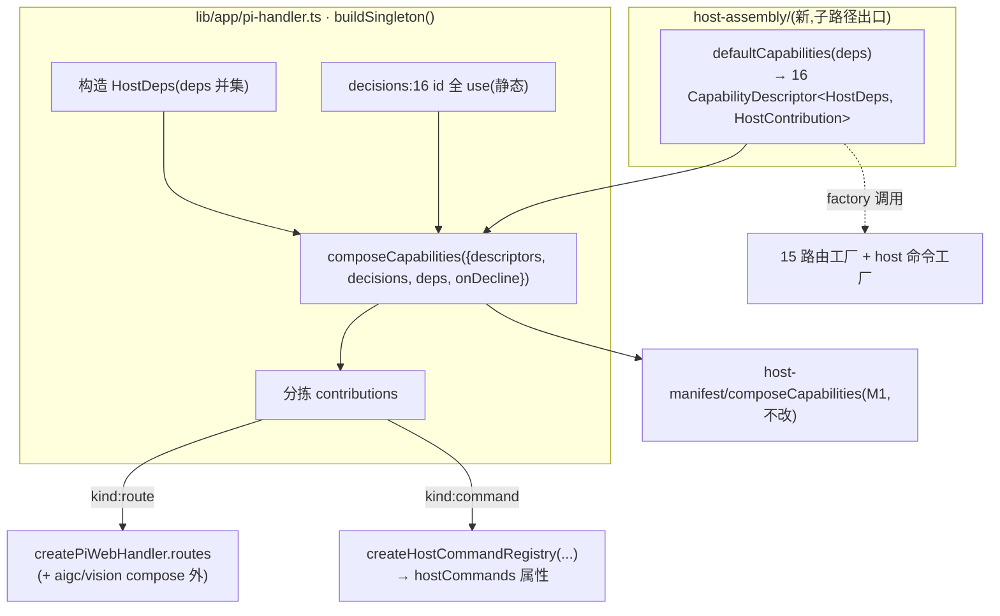

# Design Document

## Overview

**Purpose**: 建 `defaultCapabilities(deps)` 把 §5.3 的 16 个冻结 id 绑定到 pi-web 现有的路由/命令工厂,并把 `lib/app/pi-handler.ts` 的唯一装配点从「裸 spread 15 个工厂 + 独立 `hostCommands`」改为「经 `composeCapabilities` 强制全表态后分拣」。这是宿主契约 v1 的 **M3**:让 pi-web 自身成为「强制表态」的第一个遵守者。

**Users**: pi-web 本地装配(行为零变化,不感知);真正受益者是 pi-clouds(C2)与 desktop(D4)——它们据 `defaultCapabilities` 的 descriptors 各自给 `decisions`,漏掉任一 id 即**组装期失败**,消灭「12 个能力面在云端静默消失」(`pi-clouds/apps/cloud/lib/handler.ts:487-505`)的现状。

**Impact**: pi-handler 装配路径改造;新增一个**独立子路径出口** `@blksails/pi-web-server/host-assembly`(承载 `defaultCapabilities` / `HostDeps` / `HostContribution`)。M1 的 `composeCapabilities` 引擎与名册**零改动**。

### Goals
- `defaultCapabilities(deps): readonly CapabilityDescriptor<HostDeps, HostContribution>[]` 返回恰好 16 个 descriptor,id 集 = `HOST_CAPABILITY_IDS_V1`。
- pi-handler 经 `composeCapabilities` 全表态装配,产出的路由集 + 命令集与现状**逐一致(行为零变化)**。
- `host.commands`(非路由)与 15 个路由能力面在**同一次** compose、**同一份** decisions 里被强制表态。
- 条件挂载(llm/ai/auth)在 compose 下与现状三元逐一致。
- 装配级等价测试作为行为零变化的核心守卫。

### Non-Goals
- **不删除** `aigc.models` / `vision.models`(§5.4 独立拆分,属后续);它们不入 16 名册,M3 维持其现状接线(compose 之外)。
- **不改** M1 冻结面:`composeCapabilities` / `CapabilityDescriptor` / `CapabilityDecision` / `HOST_CAPABILITY_IDS_V1` / `CapabilityProvider`(P2)。
- **不实现** `EnvCapabilityProvider` / `HttpCapabilityProvider`(P2 内建实现)。
- **不改** 任何路由工厂自身的实现或对外签名(只改「它们如何被装配」)。
- **不迁移** store 到 Workspace(M4)。

## Boundary Commitments

### This Spec Owns
- `packages/server/src/host-assembly/`(新目录):`HostDeps`、`HostContribution`、`defaultCapabilities`、贡献包装 helper。
- `lib/app/pi-handler.ts` 装配点的改造(构造 `HostDeps` + `decisions` + compose + 分拣)。
- 装配行为零变化的回归基线(装配级等价测试 + 既有工厂单测 + http e2e)。
- `packages/server/package.json` 的 `./host-assembly` 子路径出口。

### Out of Boundary
- M1 `host-manifest/*`(引擎/名册/描述符类型)—— 只**消费**,不改。
- 各路由工厂实现与签名 —— 只**调用**,不改。
- `aigc.models` / `vision.models` 的删除 —— 后续 spec。
- pi-clouds / desktop 侧的 `decisions` —— 两端各自的工作(C2/D4)。

### Allowed Dependencies
- `host-manifest` 出口:`composeCapabilities`、`CapabilityDescriptor`/`CapabilityDecision` 类型、`CapabilityCompositionError`、`HOST_CAPABILITY_IDS_V1`。
- 15 个路由工厂 + `host.commands` handler 工厂(`createClearHostCommand`/`createInstallHostCommand`)。
- `http/handler.types.ts` 的 `InjectedRoute`(type)、`commands/host-command-registry.ts` 的 `HostCommandHandler`(type)。
- 依赖方向:`host-assembly` → `host-manifest` + 各工厂(单向);**`host-assembly` 绝不经 server 主 barrel `src/index.ts` 导出**(见 D0)。

### Revalidation Triggers
- `HOST_CAPABILITY_IDS_V1` 名册变化 → 触发 `defaultCapabilities` 与两端 decisions 重新核对。
- `HostContribution` 形状变化 → 触发装配层分拣逻辑与两端表态类型。
- 任一工厂 deps 契约变化 → 触发 `HostDeps` 收敛面。
- `defaultCapabilities` 签名变化 → 破坏 pi-clouds/desktop 的引用(跨仓公开面)。

## Existing Architecture Analysis

### 现状装配(Explore 已证,`lib/app/pi-handler.ts:818-998`)
- `routes: [ ...createMcpConfigRoutes(...), ...createConfigRoutes(...), ... ]`——15 个工厂 spread 汇入单个数组字面量(`:849-994`);3 个条件挂载用三元 `cond ? createX(...) : []`(llm `:944` / ai `:953` / auth `:964`)。
- `hostCommands: createHostCommandRegistry([createClearHostCommand(), installHostCommand])`——**独立顶层属性**(`:824-827`),不在 routes 数组。
- `aigc.models` / `vision.models`(`createAigcModelsRoute` `:925` / `createVisionModelsRoute` `:932`)也在 routes 数组,但**不在 16 名册**。

### 类型链(Explore E)
- 工厂 → `InjectedRoute[]`(`{method,path,handler}`,`http/handler.types.ts:35-39`)→ `createPiWebHandler` 的 `routes` → `Router`(`router.ts:70-89`)编译 + 过滤 builtin 冲突 → `matchPath` 执行。
- `hostCommands` → `HostCommandRegistry`(`has`/`execute`)→ 作为 ui-rpc builtin 端点依赖(`create-handler.ts:190-193`),**不经 Router 注册路径**。

### deps 来源(Explore A3)
- `AppConfig` 派生:`agentDir`、`defaultCwd`、`llmGateway`(`lib/app/config.ts:22`)。
- `buildSingleton` 内单例:`store`(`:496`)、`manager`(`:521`)、`attachmentStore`、`aiGwConfig`(`:446`)+ `aiGatewayKeyResolver`(`:447`)、`cloudLoginConfig`(`:453`)+ `authSessionState`(`:454`)、扩展接缝(`extPiCli`/`extAllowlist`/`reloadRunner`)、工厂函数接缝(`makeModelCatalog`/`makeSourceSettingsResolver`)、env 门控。
- 两个工厂用**双位置参数**:`createAttachmentRoutes(store, options)`、`createBashRoutes(store, options)`。

## Architecture

### 改建后装配



### 关键设计决策

**D0 — `defaultCapabilities` 放 `host-assembly` 子路径出口,绝不进主 barrel(pi-SDK-free 铁律)**
`defaultCapabilities` 的 `factory` 必须 import 真实工厂(`createConfigRoutes` 等,含 pi SDK 传递依赖)。若经 server 主 barrel `src/index.ts`(`export *`)导出,会把 pi SDK 值导入拖进 routes bundle → `node:fs` 崩(见记忆 [[pi-web-pi-sdk-dev-external]] / host-contract-ports barrel 纪律)。
故新建 `packages/server/src/host-assembly/`,经**独立子路径出口** `@blksails/pi-web-server/host-assembly`(`package.json` `exports` 加一条,类比 M1 的 `./testing`)。该出口**允许**重依赖(不经主 barrel),既让 pi-clouds/desktop 跨仓 import `defaultCapabilities`,又不污染 routes bundle。M1 的 `host-manifest`(纯类型/常量/函数)仍留在主 barrel。

**D1 — `TRoute = HostContribution` 可判别联合(统一容纳路由与命令)**
```typescript
export type HostContribution =
  | { readonly kind: "route"; readonly route: InjectedRoute }
  | { readonly kind: "command"; readonly command: HostCommandHandler };
```
15 个路由能力面的 factory 产 `{kind:"route"}` 贡献,`host.commands` 的 factory 产 `{kind:"command"}` 贡献。于是 16 id 在**同一次** `composeCapabilities<HostDeps, HostContribution>` 调用、**同一份** decisions 里被强制表态(M1 引擎泛型 `TRoute`,无需改)。装配层 compose 后按 `kind` 分拣。这直接回应「host.commands 因不产路由而游离于表态之外」的根因。

**D2 — `defaultCapabilities(deps)` 结构**
```typescript
const asRoutes = (rs: readonly InjectedRoute[]): HostContribution[] =>
  rs.map((route) => ({ kind: "route", route }));
const asCommands = (cs: readonly HostCommandHandler[]): HostContribution[] =>
  cs.map((command) => ({ kind: "command", command }));

export function defaultCapabilities(
  deps: HostDeps,
): readonly CapabilityDescriptor<HostDeps, HostContribution>[] {
  return [
    { id: "config.domains", factory: (d) => asRoutes(createConfigRoutes({ rootDir: d.agentDir, listModelOptions: d.listModelOptions })) },
    { id: "config.mcp", factory: (d) => asRoutes(createMcpConfigRoutes({ agentDir: d.agentDir })) },
    // … config.sandboxProject / config.source / config.extensions / session.list / session.actions
    // … agentSource.list / agentSource.favorites
    { id: "gateway.llm", factory: (d) => (d.llmGateway?.serve ? asRoutes(createLlmGatewayRoutes({ secret: d.llmGatewaySecret, registry: d.llmGatewayRegistry })) : []) },  // D3
    { id: "gateway.ai", factory: (d) => (d.aiGateway ? asRoutes(createAiGatewayRoutes({ ...d.aiGateway })) : []) },       // D3
    { id: "auth.session", factory: (d) => (d.cloudLogin ? asRoutes(createAuthRoutes({ state: d.authSessionState })) : []) }, // D3
    { id: "attachment.routes", factory: (d) => asRoutes(createAttachmentRoutes(d.attachmentStore, { resolveWriteBackend: d.resolveWriteBackend })) },
    { id: "shell.bash", factory: (d) => asRoutes(createBashRoutes(d.store, { enabled: d.bashEnabled })) },
    { id: "extension.manage", factory: (d) => asRoutes(createExtensionRoutes({ ...d.extension })) },
    { id: "host.commands", factory: (d) => asCommands(d.hostCommandHandlers) },  // 非路由,产 command 贡献
  ];
}
```
descriptor 顺序**不完全等于** `HOST_CAPABILITY_IDS_V1` 名册顺序。⚠ **更正(实现中发现,原稿论断有误)**:Router **对 injected 顺序敏感** —— 它按注册顺序匹配、首个 `method+path` 命中即返回(`router.ts:163` `for...break`)。`/config/mcp` 与 `/config/:domain` 同为 2 段 GET,若 `config.domains` 在前,GET /config/mcp 会被 `:domain`(="mcp") 抢匹配 → `DOMAIN_NOT_FOUND`。故 `defaultCapabilities` **必须**让 `config.mcp` 排在 `config.domains` 之前(复刻现状 pi-handler 既有约束),其余能力面 path 前缀互不冲突故顺序无关。id 集仍等于名册(装配级守卫①),仅**顺序**偏离名册。装配级测试守卫⑦锁死此顺序。

**D3 — 条件挂载映射为 factory 内条件 + `decisions` 恒 `use`**
现状三元 `cond ? createX(...) : []` 的条件**内聚到能力面 factory**(读 `deps` 中的 config)。pi-web 的 `decisions` 对 llm/ai/auth **恒 `use`**(静态、可读);未配置时 factory 返回 `[]`(等价现状空 spread)。**不**用动态 `decline`——「未启用」不是「弃用」,且动态 decisions 会让表态不可静态审阅。行为逐一致(启用挂、未启用不挂)。

**D4 — `HostDeps` 收敛(deps 并集)**
```typescript
export interface HostDeps {
  readonly agentDir: string;
  readonly defaultCwd: string;
  readonly store: SessionStore;
  readonly manager: SessionManager;
  readonly attachmentStore: AttachmentStore;
  readonly listModelOptions: () => readonly ModelOption[];
  readonly resolveSettings: SourceSettingsResolver;
  readonly onSourceSettingsSaved: (key: string) => void;
  readonly sessionStoreConfig: SessionStoreConfig;
  readonly sessionsGlobalEnabled: boolean;
  readonly sessionsManageEnabled: boolean;
  readonly sourcesScanRoots: readonly string[];
  readonly sourcesRegistryPath: string;
  readonly llmGateway: LlmGatewayConfig | undefined;
  readonly llmGatewaySecret: string; readonly llmGatewayRegistry: /*…*/;
  readonly aiGateway: /* {baseUrl,secret,keyResolver,timeoutMs} */ | undefined;
  readonly cloudLogin: /* config */ | undefined; readonly authSessionState: AuthSessionState;
  readonly resolveWriteBackend: (id: string) => /*…*/;
  readonly bashEnabled: boolean;
  readonly extension: ExtManagementOptions;
  readonly hostCommandHandlers: readonly HostCommandHandler[];
}
```
> 精确字段以实现时对齐各工厂 opts 为准(Explore A3 表);此处列出并集意图。`HostDeps` 在 `buildSingleton()` 内**一次构造**,传给 `defaultCapabilities` 与 compose。`requires` 字段保持声明性、**装配期不校验**(契约勘误⑬:`HostDeps` 收敛后校验仍恒真,本期不启用——诚实边界)。

**D5 — 装配层分拣**
```typescript
const descriptors = defaultCapabilities(deps);
const decisions = piWebDecisions;  // 16 个 { kind: "use" }
const contributions = composeCapabilities({ descriptors, decisions, deps, onDecline });
const composedRoutes = contributions.filter((c) => c.kind === "route").map((c) => c.route);
const composedCommands = contributions.filter((c) => c.kind === "command").map((c) => c.command);

createPiWebHandler({
  routes: [...composedRoutes, ...createAigcModelsRoute({...}), ...createVisionModelsRoute({...})], // D6:aigc/vision compose 外
  hostCommands: createHostCommandRegistry(composedCommands),
  // …其余 options 不变
});
```

**D6 — `aigc.models` / `vision.models` 维持现状(compose 外)**
两端点不入 16 名册,M3 保持它们在 `routes` 数组中以原方式 spread(compose 结果之后)。其 path(`/aigc/models` / `/vision/models`)与其它能力面 path 前缀互不冲突,故置于 compose 结果之后不改变匹配行为(注:Router 一般是顺序敏感的,见 D2 更正;此处安全仅因 path 不冲突)。其删除属后续 spec。

**D7 — `onDecline` 记启动日志**
`composeCapabilities` 的 `onDecline?(id, reason)` 接一个 `logger.info`(namespace `server:host-assembly`),把弃用 id + reason 记入启动日志(契约 §5.2 第 2 条)。pi-web 本地默认全 `use`,故本地不触发;此接线是给两端(pi-clouds decline 某些能力面)用的。

## File Structure Plan

### New Files
- `packages/server/src/host-assembly/host-contribution.ts` — `HostContribution` 联合 + `asRoutes`/`asCommands` helper。
- `packages/server/src/host-assembly/host-deps.ts` — `HostDeps` 接口。
- `packages/server/src/host-assembly/default-capabilities.ts` — `defaultCapabilities(deps)`(import 各工厂)。
- `packages/server/src/host-assembly/index.ts` — 子路径出口(导出上述三者的公开面)。
- `packages/server/test/host-assembly/default-capabilities.test.ts` — 装配级等价测试(D8)。

### Modified Files
- `packages/server/package.json` — `exports` 增 `"./host-assembly": "./src/host-assembly/index.ts"`。
- `lib/app/pi-handler.ts` — `buildSingleton()` 内:构造 `HostDeps` + `decisions` + `composeCapabilities` + 分拣(D5);routes 改为 `[...composedRoutes, ...aigc, ...vision]`;`hostCommands` 改为 `createHostCommandRegistry(composedCommands)`。**net import 面不变**(工厂 import 从散落改为经 defaultCapabilities 集中,pi-handler 改 import `defaultCapabilities`)。

### Unchanged (显式声明)
- `host-manifest/{compose,types,capability-ids}.ts`(M1)、各路由工厂、`src/index.ts` 主 barrel(不加 host-assembly)。

## Requirements Traceability

| Requirement | 实现要素 |
|-------------|---------|
| 1.1–1.4 | D2 `defaultCapabilities` 16 descriptor;装配级测试断言 id 集 = 名册 |
| 2.1–2.5 | D5 装配经 compose;`decisions` 全 use;`onDecline`(D7);M1 引擎不改 |
| 3.1–3.4 | D1 `HostContribution` 联合;D5 分拣;host.commands decline→空命令集 |
| 4.1–4.4 | D3 条件内聚 factory + decisions 恒 use |
| 5.1–5.4 | D4 `HostDeps` 收敛;双位置参数适配;buildSingleton 构造;requires 不校验 |
| 6.1–6.5 | D8 装配级等价测试(路由集/命令集/两态);既有单测+http e2e;aigc/vision 仍可达 |
| 7.1–7.4 | D0 不进主 barrel;不改 M1/工厂;不删 aigc/vision |
| 8.1–8.4 | 回归 + fresh-evidence |

## Components and Interfaces

### host-assembly

#### defaultCapabilities
| Field | Detail |
|-------|--------|
| Intent | 把 16 冻结 id 绑定到现有工厂,产 `CapabilityDescriptor<HostDeps, HostContribution>[]` |
| Requirements | 1.1–1.4, 2.1, 3.1, 4.1–4.4, 5.1–5.2 |

**Contracts**: Service [x]
```typescript
export function defaultCapabilities(
  deps: HostDeps,
): readonly CapabilityDescriptor<HostDeps, HostContribution>[];
```
- Postcondition: 返回长度 16,id 集 = `HOST_CAPABILITY_IDS_V1`;每 factory 纯(同 deps 同产出,除工厂自身副作用)。
- Invariant: 不经主 barrel 导出(D0)。

#### pi-handler 装配(改造)
**Responsibilities**: 构造 `HostDeps`、提供 pi-web 的 16 `use` decisions、调 compose、分拣、注入 `createPiWebHandler`。
**Implementation Notes**: net 行为 = 现状;aigc/vision 保留 compose 外;`onDecline`→logger。

## Error Handling
- `composeCapabilities` 在 `missing-decision`/`unknown-id`/`empty-reason` 时抛 `CapabilityCompositionError`(M1)——M3 的 pi-web decisions 若漏 id 会**启动即失败**(这正是目的)。装配级测试须覆盖「故意漏一个 id → 抛 missing-decision」。
- 各工厂自身错误处理不变(M3 不碰工厂)。

## Testing Strategy

### Unit / 装配级(核心守卫,D8)
`test/host-assembly/default-capabilities.test.ts`:
1. **id 集等于名册**:`defaultCapabilities(deps).map(d=>d.id)` 排序后 === `HOST_CAPABILITY_IDS_V1` 排序(杀「多/少一个 descriptor」)。
2. **路由集等价**:构造代表性 `HostDeps`(启用全部条件工厂),`composeCapabilities(descriptors, 全 use)` 的 `route` 贡献 `{method,path}` 集合,== 直接调 15 工厂(相同 deps)的并集(杀「某能力面漏绑/绑错工厂」)。
3. **命令集等价**:`command` 贡献接成的 registry,命令名集 == 现状 `[createClearHostCommand(), installHostCommand]` 的名集(杀「host.commands 漏绑」)。
4. **条件两态**:llm/ai/auth 在「未配置 deps」下产空、「已配置 deps」下产对应工厂路由(杀「条件映射错误」,等价现状三元)。
5. **强制表态**:decisions 故意漏一个 id → `composeCapabilities` 抛 `CapabilityCompositionError` code `missing-decision`(杀「表态不全被静默放过」)。
6. **host.commands decline**:decisions 把 host.commands 设 decline(带 reason)→ 命令贡献为空、不抛,onDecline 收到 (id, reason)(杀「非路由能力面无法弃用」)。

> 变异判据:每条须能被一个具体错误实现杀死(见括注)。

### Integration / E2E(行为零变化)
- 既有各工厂单测(`config-routes`/`session-list-routes`/`ai-gateway/routes`/`auth-routes`/…)全绿,不改断言。
- `test/http/http.e2e.test.ts`(经 `createPiWebHandler` 的装配级 e2e,最接近整装配回归)全绿。
- `aigc-models-routes.test.ts` / vision 相关全绿(维持现状)。
- node e2e 受影响面(`http` 装配相关)全绿,或对既有失败做基线对照。

### 回归验证(R8,fresh-evidence)
- `packages/server` 全量单测(真实计数,防假绿)+ typecheck 0 + 受影响 node e2e;命令+计数+时间戳落 `verification/`。
