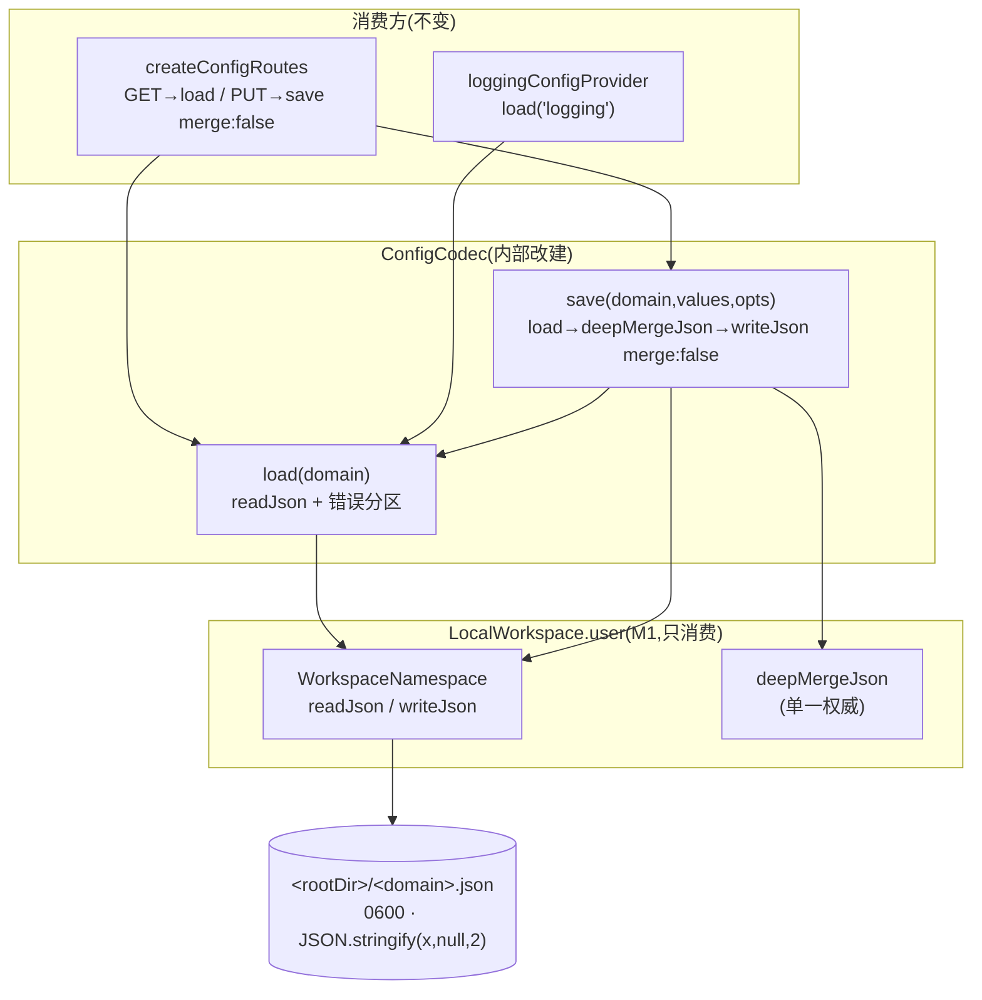

# Design Document

## Overview

**Purpose**: 把 config 域的落盘从独立的 `ConfigCodec`(直接 `node:fs` + 私有 `deepMerge`)改建到 M1 已交付的 `LocalWorkspace` `user` 命名空间之上,作为 pi-web 宿主契约 v1 的**垂直切片验证**——证明「config 域这一刀切到 Workspace 端口上,pi-web 本地行为逐字节零变化」。

**Users**: 直接受益者是 config 域的既有调用方(前端 Settings、`createConfigRoutes`、`loggingConfigProvider`),它们**不感知**这次改建。真正的受益者是 pi-clouds(云端)与 desktop(桌面):模型一旦验证成立,云端实现一个 `TenantWorkspace` 即白拿 `ConfigStore`(C3),桌面沿用 `LocalWorkspace` 零工作量(D1)。

**Impact**: `ConfigCodec` 内部实现从「持有 `rootDir` + `node:fs` + 私有 `deepMerge`」变为「持有一个 `WorkspaceNamespace` + 委托 + 精确的错误分区」。公开接口(构造 + `load` + `save`)与磁盘落盘(路径、权限、字节)保持不变。全仓 merge 实现从三份减为两份(config 一份归并入 Workspace 的 `deepMergeJson`)。

### Goals
- config 五域(`auth`/`settings`/`sandbox`/`logging`/`aigc`)经 `/config/:domain` 的 GET/PUT 可观测行为**逐字节零变化**。
- `ConfigCodec` 的所有读写经 `LocalWorkspace.user` 命名空间,不再直接 `node:fs`。
- 三处「收紧」(损坏 JSON 抛错、写入上限、原子写)在 `ConfigCodec` 层被精确处置,使既有可观测行为不变。
- config 的 `deepMerge` 私有副本删除,合并语义收敛到 `deepMergeJson` 单一权威。
- 既有 config 回归套件全绿,作为「本地全绿」的新鲜证据。

### Non-Goals
- **不迁移** `mcp-config-routes.ts` / `extensions-config-routes.ts` / `source-settings-codec.ts`(三个独立 codec,不经 `ConfigCodec`)。
- **不做** M3(`composeCapabilities` 装配改建)、M4(其余五个 store 迁 Workspace)。
- **不改** `LocalWorkspace` 本体的类型或语义(M1 已冻结)。
- **不收敛** `source-settings-codec.ts` 的第三份 merge 副本(诚实记录其仍待后续处理,但不属本期)。

## Boundary Commitments

### This Spec Owns
- `packages/server/src/config/config-codec.ts` 的内部实现改建。
- config 五域读写经 `LocalWorkspace.user` 的等价映射与三处收紧的处置。
- config 域的行为零变化回归基线(既有测试 + e2e 全绿)。

### Out of Boundary
- 三个独立 codec(mcp / extensions / source-settings)—— 一律不触碰。
- `LocalWorkspace` / `WorkspaceNamespace` / `deepMergeJson` / 四个错误类 —— 只**消费**,不修改(M1 冻结面)。
- config 路由与 `loggingConfigProvider` 的**业务逻辑** —— 仅允许因类型更名产生的等价 import/构造改写,不改调用契约。

### Allowed Dependencies
- `packages/server/src/workspace/` 的公开出口:`createLocalWorkspaceNamespace`、`deepMergeJson`、`WorkspaceNamespace` 类型、四个错误类(按 `code` 判别)、`resolveWorkspaceValueLimit`(若需尊重 env 上限)。
- `@blksails/pi-web-protocol` 的 `ConfigDomainId`(既有依赖,不变)。
- 依赖方向约束:`config` → `workspace`(同包内,单向)。**不得**让 `workspace` 反向依赖 `config`。

### Revalidation Triggers
- 若改建要求改动 `LocalWorkspace` 的任何签名/语义 → 说明契约有缺口,回到 `docs/pi-web-host-contract-v1.md` 修契约,而非在本 spec 打补丁(契约 §7.5)。
- 若 config 域的落盘路径/权限/字节格式发生任何变化 → 触发 config 域全部消费方(前端 Settings、路由)重新验收。
- 若 `deepMergeJson` 语义变化 → 触发本 spec 与 `source-settings-codec` 的合并行为重新核对。

## Existing Architecture Analysis

### 现状(改建前)
`ConfigCodec`(`config-codec.ts:51`)持有 `rootDir`(= `PI_WEB_AGENT_DIR ?? ~/.pi/agent`),两个方法:

| 方法 | 现状实现 | 关键语义 |
|------|---------|---------|
| `load(domain)` | `fs.readFile(<rootDir>/<domain>.json)` → `JSON.parse` | ENOENT→`{}`;损坏 JSON→`{}`(静默,`:86-88`);非对象→`{}`(`:82-85`);**其他读错→throw**(`:78`) |
| `save(domain, values, {merge?})` | `mkdir 0700` + `writeFile 0600` | 缺省 `merge:true`→`deepMerge(load(domain), values)`(`:108-109`);`merge:false`→整值覆盖;`JSON.stringify(x,null,2)` 无尾换行(`:112`) |

**消费方**(改建后必须行为不变):
- `createConfigRoutes`(`config-routes.ts:84`):GET→`load`;PUT→`save(..., { merge: false })`(**恒 false**,`:183`)。
- `loggingConfigProvider`(`pi-handler.ts:504`):仅 `load("logging")`。

### `LocalWorkspace` 相对 `ConfigCodec` 的三处「收紧」(改建必须处置)
| # | 维度 | `ConfigCodec` | `LocalWorkspace` | 处置 |
|---|------|--------------|------------------|------|
| ① | 损坏/非对象 JSON | `load`→`{}`(静默) | `readJson`→抛 `WorkspaceCorruptError`(code `corrupt`) | `ConfigCodec.load` catch `corrupt`→`{}`+log |
| ② | 写入大小上限 | 无上限 | `writeJson` 按 `maxValueBytes` 校验→抛 `WorkspaceLimitError` | 保留上限作安全网(正常路径不可达),见 D5 |
| ③ | 原子写 | 直接 `writeFile` 覆盖 | temp+rename | 白拿(增强);字节内容一致(D6 回归验证) |

### 天然一致的维度(无需处置)
- **落盘路径**:`ConfigCodec` `join(rootDir, "<domain>.json")` ≡ `LocalWorkspace.user` `join(userRoot, "<domain>.json")`(同源 env、同默认、同 `join`)。
- **权限位**:两者均 0700/0600(`local-workspace.ts:56-59` 显式标注「与 config-codec 一致」)。
- **merge 语义**:`deepMergeJson` 与 `ConfigCodec.deepMerge` 逐项字面等价(Explore D14 双向核对无差异)。

## Architecture

### 改建后结构



**Architecture Integration**:
- **选定模式**:Adapter / 委托 —— `ConfigCodec` 保留公开接口,内部从「fs 适配器」变为「Workspace 命名空间适配器」。
- **保留的既有模式**:`ConfigCodec` 的公开面(构造 + `load` + `save`)、消费方调用契约、磁盘落盘契约。
- **消除的重复**:config 私有 `deepMerge`(`config-codec.ts:25-49`)删除,合并归并入 `deepMergeJson`。

### 关键设计决策

**D1 — 保留 `ConfigCodec` 类名,内部委托 `WorkspaceNamespace`(不新建类)**
契约 §3.7 称其为「`ConfigStore`(由 `ConfigCodec` 降级而来)」——「降级」指职责变薄(不再自管 fs/merge),**非必须改名**。保留 `ConfigCodec` 公开签名使两个消费方零改动,最小化「行为零变化」的风险面。构造改为 `this.ns = createLocalWorkspaceNamespace(rootDir ?? resolveDefaultRoot(), ...)`。

**D2 — `load` 逐分区复刻 `ConfigCodec` 的错误语义**(见 Error Handling 表)。核心:`corrupt`→`{}`,`io`→rethrow(**不**降级,保持既有 `:78` 的 throw),ENOENT 由 `readJson` 自身归零。

**D3 — `save` 在 `ConfigCodec` 层做 read-modify-write,底层 `writeJson` 恒 `{merge:false}`**
这是「行为零变化」的关键。若直接 `writeJson(key, values, {merge: opts.merge})` 让 workspace 内部 merge,则 `merge:true` 遇损坏磁盘时 `writeJson.readAt` 抛 `corrupt`,与 `ConfigCodec.save`(用 `this.load`→损坏当 `{}` 合并,`:109`)**不等价**。故在 `ConfigCodec` 层复刻原结构:
```
const next = opts.merge === false ? values : deepMergeJson(await this.load(domain), values);
await this.ns.writeJson(`${domain}.json`, next, { merge: false });
```
`this.load` 已统一处理 corrupt 降级;底层恒 `{merge:false}` 整值写,不触发二次 read。逐字节复刻 `config-codec.ts:108-113`。

**D4 — merge 收敛到 `deepMergeJson`**,删除 config 私有 `deepMerge`(R5)。语义已证等价。第三份 `source-settings-codec.ts` 副本本期不动(Non-Goal),设计明确记录其仍待收敛。

**D5 — 保留 `LocalWorkspace` 的写入大小上限作安全网(取缺省 1 MiB,不经 env 解析)**
config 五域实际值均远小于 1 MiB,上限**在正常路径不可达**,故对既有可观测行为零影响。构造时**不传** `maxValueBytes`,取 `createLocalWorkspaceNamespace` 的缺省 `DEFAULT_WORKSPACE_MAX_VALUE_BYTES`(1 MiB)。**刻意不经 `resolveWorkspaceValueLimit(process.env)`**:后者在 env 非法时抛 `WorkspaceConfigError`,若接入会给 config 域引入「非法 env → 构造抛错」的新失败模式,偏离「行为零变化」——`ConfigCodec` 原本与该 env 无关。代价是 config 的上限固定 1 MiB、不随 `PI_WEB_WORKSPACE_MAX_VALUE_BYTES` 变化,但因正常 config 不可达,此差异不可观测。**差异边界(诚实记录)**:超 1 MiB 的 config 写入会抛 `WorkspaceLimitError`(`ConfigCodec` 原本无上限);因正常 config 不可达,不构成可观测的行为变化。若 `writeJson` 抛 `limit`,由既有 config 路由错误处理承接(不透 5xx)。

**D6 — 原子写白拿**;落盘字节须与既有逐字节一致(`JSON.stringify(x,null,2)` 无尾换行)。由 `config-codec.test.ts` 的 roundtrip/权限断言在回归中锁死。

## File Structure Plan

### Modified Files
- `packages/server/src/config/config-codec.ts` — **唯一核心改动**。内部从 fs+私有 merge 改为持有 `WorkspaceNamespace` + 委托 + 错误分区。删除私有 `deepMerge`(`:25-49`)。公开面(class `ConfigCodec` / 构造 / `load` / `save`)签名不变。
- `packages/server/test/config/config-codec.test.ts` — 仅在必要时做**等价改写**(如断言损坏 JSON 仍降级 `{}`、补一条 corrupt 降级用例);**不得**放宽/删除既有断言。可新增针对三处收紧的守卫用例。

### Unchanged (显式声明不动)
- `config-routes.ts` / `pi-handler.ts`(消费方)——除非出现类型更名导致的等价 import 调整;本设计 D1 保留类名,故预期**零改动**。
- `mcp-config-routes.ts` / `extensions-config-routes.ts` / `source-settings-codec.ts` —— Out of boundary。
- `packages/server/src/config/index.ts`(barrel)—— `ConfigCodec` 导出名不变,预期零改动。

## Requirements Traceability

| Requirement | Summary | 实现要素 |
|-------------|---------|---------|
| 1.1–1.5 | 改建到 Workspace.user | D1;构造 `createLocalWorkspaceNamespace(rootDir)`;键 `<domain>.json`;路径/权限天然一致 |
| 2.1 | GET 等价 | `load` 分区复刻(D2) |
| 2.2 | PUT 整值等价 | `save` merge:false 分支 → `writeJson(key,values,{merge:false})` |
| 2.3 | merge 逐项等价 | D3 + D4(`deepMergeJson`) |
| 2.4 | 既有测试全绿 | 回归基线 |
| 2.5 | 原子写不产生字节差异 | D6 |
| 3.1–3.4 | 损坏/非对象降级 | D2:catch code `corrupt`→`{}`+log |
| 4.1–4.3 | 上限等价处置 | D5 |
| 5.1–5.3 | merge 收敛 | D4;source-settings 记录待收敛 |
| 6.1–6.3 | 消费方/接口稳定 | D1(保留类名);barrel 不变 |
| 7.1–7.4 | 范围隔离 | 三独立 codec 不动;遇耦合即停 |
| 8.1–8.4 | 回归验证 | 全量单测+e2e+typecheck,fresh-evidence 落盘 |

## Components and Interfaces

### config / storage

#### ConfigCodec(改建后)

| Field | Detail |
|-------|--------|
| Intent | config 域读写的 Workspace 命名空间适配器 |
| Requirements | 1.1–1.5, 2.1–2.5, 3.1–3.4, 4.1–4.3, 5.1–5.2, 6.1–6.3 |

**Responsibilities & Constraints**
- 持有单个 `WorkspaceNamespace`(user 根),委托所有读写。
- `load`/`save` 的可观测行为与改建前逐分支/逐字节等价。
- 不直接触碰 `node:fs`;不保留私有 merge。

**Dependencies**
- Outbound: `createLocalWorkspaceNamespace`(P0)、`deepMergeJson`(P0)、`resolveWorkspaceValueLimit`(P1,上限解析)、四个错误类的 `code` 判别(P0)。

**Contracts**: State [x]

##### Service Interface(公开面不变)
```typescript
class ConfigCodec {
  constructor(rootDir?: string);
  load(domain: ConfigDomainId): Promise<Record<string, unknown>>;
  save(domain: ConfigDomainId, values: Record<string, unknown>, opts?: { readonly merge?: boolean }): Promise<void>;
}
```
- Precondition: `rootDir`(若传)为 user 根目录(与既有一致)。
- Postcondition(`save`):`<rootDir>/<domain>.json` 落盘内容 = `JSON.stringify(next, null, 2)`,权限 0600,目录 0700。
- Invariant:公开签名、落盘路径/权限/字节格式与改建前不变。

##### 等价映射(改建前 → 改建后)
| 调用 | 改建前(`config-codec.ts`) | 改建后 |
|------|---------------------------|--------|
| `load` 缺文件 | `readFile` ENOENT→`{}` | `ns.readJson`(内部 ENOENT→`{}`) |
| `load` 损坏/非对象 | `catch/return {}` | `catch code==="corrupt"→{}`+log |
| `load` 其他读错 | `throw err` | rethrow(非 corrupt) |
| `save merge:false` | `writeFile(values)` | `ns.writeJson(key, values, {merge:false})` |
| `save merge:true` | `deepMerge(load, values)` 后 `writeFile` | `deepMergeJson(await load, values)` 后 `ns.writeJson(..., {merge:false})` |

## Error Handling

### Error Strategy — `load` 的精确错误分区(零变化的核心)

| 磁盘状态 | 底层 `readJson` | `ConfigCodec.load` 处置 | 与改建前一致? |
|---------|----------------|------------------------|---------------|
| 文件不存在 | 返回 `{}` | 直接返回 `{}` | ✅(原 ENOENT→`{}`) |
| 非法 JSON | 抛 `WorkspaceCorruptError`(code `corrupt`) | catch→`{}` + `log.warn` | ✅(原静默→`{}`,新增日志符合 §3.6) |
| 合法但非对象 | 抛 `corrupt` | catch→`{}` + `log.warn` | ✅(原→`{}`) |
| 权限/IO 错误 | 抛 `WorkspaceIoError`(code `io`) | rethrow | ✅(原 `:78` throw) |

- 判别**一律用 `err.code`,不用 `instanceof`**(契约 §3.6:跨包 `instanceof` 假阴性)。
- `save` 路径:`writeJson(merge:false)` 不触发内部 read,不产生 `corrupt`;若抛 `limit`(D5,正常不可达)向上传播,由既有路由错误处理承接,不透 5xx(R3.3/R4.3)。

### Monitoring
- 损坏降级须 `log.warn`(带 domain + 原因),使既有的「静默吞掉损坏配置」变为可观测,不改变返回值语义。

## Testing Strategy

### Unit Tests(`config-codec.test.ts`,行为零变化基线)
1. **既有全绿**:缺文件→`{}`、roundtrip、未知字段保留 merge、0600 权限、目录递归创建、多次 save 累积 —— 一条不改断言,全部通过。
2. **收紧① 守卫(新增)**:磁盘为非法 JSON → `load` 返回 `{}`(不抛)+ 触发 log;磁盘为数组/标量 → `load` 返回 `{}`。
3. **收紧① 反向(新增)**:`load` 遇模拟的 io 错误(非 corrupt)→ **rethrow**(证明 io 未被误降级,守住与 ConfigCodec `:78` 的等价)。
4. **merge 等价(新增/复用)**:`save(merge:true)` 深合并结果与 `deepMergeJson` 一致;磁盘损坏时 `save(merge:true)` 以 `{}` 为基底合并(复刻 `this.load` 降级),不抛。
5. **落盘字节守卫**:`save` 后读原始文件文本 = `JSON.stringify(x,null,2)`(无尾换行),权限 0600。

> 变异测试判据:每条断言须能被一个具体的错误实现杀死(如「删掉 corrupt catch」应让 #2 转红;「把 io 也降级为 {}」应让 #3 转红;「writeJson 用 merge:true」应让 #4 损坏基底用例转红)。

### Integration / E2E Tests
1. `e2e/node/config-domains.e2e.test.ts` —— 五域经真实 `/config/:domain` GET/PUT roundtrip 全绿(改建后不变)。
2. `logging-config.test.ts` / `sandbox-config.test.ts` —— 域专属路由行为不变。
3. `config-routes.test.ts` —— PUT `{merge:false}` 覆盖语义(含 secret clear 不复活)不变。

### 回归验证(R8,fresh-evidence)
- `packages/server` 全量单测(真实计数,防 vitest 假绿:`no tests` 或 `Errors N error` 均不算过)。
- `packages/server` typecheck 零错误。
- config e2e 全绿。
- 命令 + 真实计数 + 时间戳落 `.kiro/specs/host-contract-config-on-workspace/verification/`。
