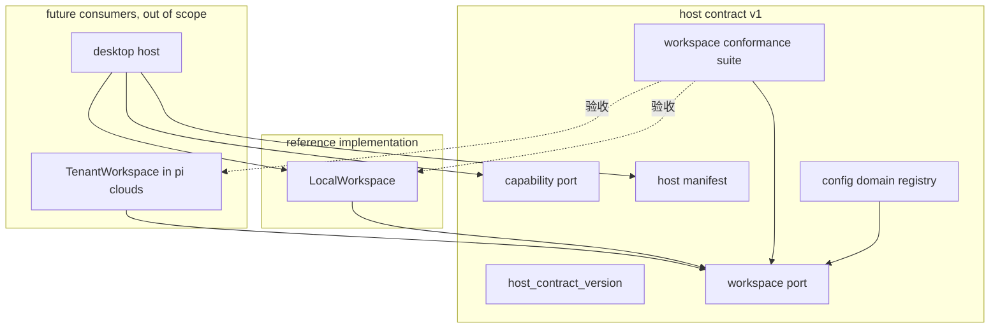
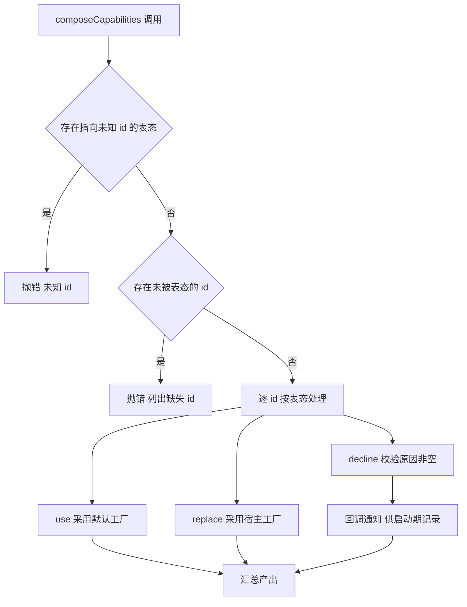

# Design Document — host-contract-ports

## Overview

**Purpose**: 本特性交付 pi-web 与其两类宿主（云端 pi-clouds、桌面 desktop）之间的**中间标准本体**——四个宿主端口的类型契约、其中可纯逻辑实现的部分，以及一套跨仓可运行的一致性测试套件。

**Users**: 两端宿主实现者按同一标准各自实现并各自验收；pi-web 维护者借能力面清单获得「新增能力面必然打断两端」的信号。

**Impact**: 本期**不改变任何既有可观测行为**。四个新模块与既有装配点并存、互不接线。既有存储的迁移、装配点改造均属后续阶段。本期的价值在于**解除两端阻塞**，而非完成改造。

权威依据：`docs/pi-web-host-contract-v1.md`（v1 已冻结 + 2026-07-21 实现前勘误三处）。设计与契约冲突时以契约为准。

### Goals

- 四个端口的类型契约可被两端 import 并据以实现
- 一致性测试套件可被 pi-web 与 pi-clouds 双方引用，且**不强加测试框架**
- `LocalWorkspace` 作为参照实现通过全部一致性用例，证明标准可被满足
- 既有全量单测、集成测试与浏览器 e2e 保持全绿

### Non-Goals

- 不实现 `LocalWorkspace` 之外的任何 Workspace 后端
- 不迁移任何既有存储（`ConfigCodec`、收藏、信任库、附件描述符）
- 不改动 `lib/app/pi-handler.ts` 的既有装配，不绑定 16 个能力 id 到真实工厂
- 不涉及 `SessionEntryStore`（契约 §3.9：语义正交，三后端均不迁）
- 不涉及附件**字节**存储、agent 运行时真实文件系统与进程传输

---

## Boundary Commitments

### This Spec Owns

- **宿主状态存储端口**（`Workspace` / `WorkspaceNamespace`）的类型、键空间规则、值上限规则、错误分类与判别式
- **参照实现** `LocalWorkspace`（本地文件系统）
- **能力授予端口**（`CapabilityProvider` / `CapabilitySnapshot`）的类型与不变式
- **能力面清单机制**：描述符类型、表态类型、组装函数、v1 冻结的能力 id 名册
- **配置域注册表**（`ConfigDomainRegistry`）及宿主关切域的默认注册
- **一致性测试套件**及其对外子路径导出
- **契约版本常量**与版本比对语义

### Out of Boundary

- 任何非本地 Workspace 后端 —— 归各宿主
- 既有存储改建于 Workspace 之上 —— 后续阶段
- `defaultCapabilities()` 中**能力 id 到真实路由工厂的绑定** —— 需改既有装配，违反 10.4，属后续阶段。本期只交付 id 名册与组装引擎
- `EnvCapabilityProvider` / `HttpCapabilityProvider` 实现 —— 前者等价于既有 `resolveCloudLoginConfig` 的搬迁（属迁移），后者属云端接入阶段
- 登录状态机、降级行为本身 —— 归各消费方（见 requirements 的 Adjacent expectations）
- 配置写面鉴权策略 —— 归宿主，且必须先于配置面上云落地

### Allowed Dependencies

- `zod@^3.23.8`（既有 dependency，v3 非 v4）
- `@blksails/pi-web-protocol` 的**纯类型**（`FormSchema`）
- `packages/server/src/auth/egress-model.ts` 的**纯类型** `EgressModel`
- Node 内置：`node:fs/promises`、`node:path`、`node:os`、`node:assert`
- **禁止**：任何 pi SDK 值导入；任何测试框架 import；`lib/app/**`

### Revalidation Triggers

- `Workspace` / `WorkspaceNamespace` 方法签名或语义变化
- 键空间规则、值上限语义、错误 `code` 取值集合变化
- `CapabilitySnapshot` 字段增删或作用域语义变化
- 能力 id 名册增删或改名
- 一致性套件用例的断言口径变化（会使已通过的实现失效）
- 契约版本号变化

---

## Architecture

### Existing Architecture Analysis

三条既有纪律直接约束本设计：

1. **主 barrel 的 pi-SDK-free 纪律**（`packages/server/src/index.ts:3-8`）：每个 `export * from` 行须有注释论证无 pi SDK 值导入；违反会把 pi SDK 打进路由 bundle 并触发 `node:fs` 崩溃。本 spec 四模块全部纯逻辑，**可**进主 barrel。
2. **env fail-fast 三段式**（`ai-gateway/config.ts:1-11`）：未设→`undefined`；设了但非法→类型化错误；不静默降级。签名收 `env: NodeJS.ProcessEnv`。
3. **模块 = 目录 + 具名 re-export 的 barrel**；类型集中 `types.ts`；错误类必写 `this.name`；测试全在 `packages/server/test/` 镜像目录。

### Architecture Pattern & Boundary Map

选定模式：**Ports & Adapters（四个独立端口 + 一个参照适配器）**。四模块互不依赖，唯一内部边是 `config-domain → workspace`（域 id 复用键空间校验，Requirement 7.5）。



**Architecture Integration**：

- **依赖方向**（自左向右，禁止反向）：`host-contract-version` → `workspace` → `config-domain`；`capability` 与 `host-manifest` 为独立叶子。`testing` 只依赖 `workspace`。
- **边界隔离靠泛型而非具体类型**：`host-manifest` 对路由类型与依赖对象均泛型化，因而**不依赖 `http/` 模块**，也不需要枚举 17 个工厂的 deps —— 这是本期能在不改既有装配（10.4）的前提下交付组装引擎的关键。
- **新组件理由**：四端口各对应契约的一个 P，职责单一；`LocalWorkspace` 是套件的第一个验收对象（无它则套件正确性自证循环）。
- **既有模式保留**：barrel 具名导出、`types.ts` 集中类型、错误类 `this.name`、env fail-fast 三段式、测试镜像目录。

### Technology Stack

| Layer | Choice / Version | Role in Feature | Notes |
|-------|------------------|-----------------|-------|
| Backend / Services | TypeScript strict（既有） | 四端口类型契约 | 禁 `any`；错误用判别式而非 `instanceof` |
| Data / Storage | Node `fs/promises`（既有运行时） | `LocalWorkspace` 落盘 | 0700/0600；write-temp + rename 保原子 |
| Validation | `zod@^3.23.8`（既有 dependency） | 配置域 schema 承载 | v3，不升 v4 |
| Testing | 框架无关套件 + `node:assert` | 一致性验收 | 套件**不 import** 任何测试框架 |
| Packaging | `exports` 子路径（发布 TS 源码，无 build） | `./testing` 对外导出 | pi-web 首个 `./testing` 子路径 |

---

## File Structure Plan

### Directory Structure

```
packages/server/src/
├── host-contract-version.ts          # 契约版本常量 + 版本比对（根级单文件模块，先例:source-key.ts）
├── workspace/
│   ├── index.ts                      # barrel(具名导出;标注 pi-SDK-free)
│   ├── types.ts                      # Workspace/WorkspaceNamespace/WorkspaceKey/错误类与 code
│   ├── key.ts                        # 键空间校验(安全边界,纯函数)
│   ├── limit-config.ts               # PI_WEB_WORKSPACE_MAX_VALUE_BYTES 解析(env fail-fast)
│   ├── merge.ts                      # deepMergeJson(与 ConfigCodec 语义等价)
│   ├── local-workspace.ts            # LocalWorkspace 参照实现(fs)
│   └── testing/
│       ├── index.ts                  # ./testing 子路径入口
│       └── conformance-suite.ts      # runWorkspaceConformance(框架无关)
├── capability/
│   ├── index.ts
│   └── types.ts                      # CapabilityProvider/CapabilitySnapshot/各 grant
├── host-manifest/
│   ├── index.ts
│   ├── types.ts                      # CapabilityDescriptor/CapabilityDecision(泛型)
│   ├── capability-ids.ts             # v1 冻结的 16 个 id 名册
│   └── compose.ts                    # composeCapabilities(组装期校验)
└── config-domain/
    ├── index.ts
    ├── types.ts                      # ConfigDomainDescriptor/ConfigDomainRegistry
    ├── registry.ts                   # createConfigDomainRegistry
    └── default-domains.ts            # 宿主关切域默认注册(不含 aigc)
```

测试镜像（`packages/server/test/`）：`workspace/{key,limit-config,merge,local-workspace.conformance}.test.ts`、`host-manifest/compose.test.ts`、`config-domain/registry.test.ts`、`host-contract-version.test.ts`、`capability/types.test-d.ts`（类型层结构兼容断言）。

> ⚠️ 套件自检所需的**内存实现**（一个合规、一个故意违规）属**测试夹具**，落 `packages/server/test/workspace/` 镜像目录，**不得**放进 `src/workspace/testing/`——否则会随 `./testing` 子路径成为对外公开面，而本 spec 只认 `LocalWorkspace` 一个参照实现。

### Modified Files

- `packages/server/src/index.ts` — 新增**五条** `export * from`（四个端口模块 + 根级版本常量模块），每条按既有约定附「无 pi SDK 值导入」注释。**不删改任何既有导出行。** ⚠️ 版本常量必须一并导出，否则 9.1「版本标识可被程序读取」在包主入口不成立。
- `packages/server/package.json` — `exports` 新增 `"./testing": "./src/workspace/testing/index.ts"`。**不改 dependencies**（zod 已在）。

> ⚠️ 本期**不改** `lib/app/pi-handler.ts`、不改 `vitest.config.ts`（根 app 不消费 `./testing`；pi-web 侧套件调用发生在 `packages/server/test/` 内，走包内相对路径）。跨仓 alias 由 pi-clouds 侧接线时自行添加。

---

## System Flows

能力面组装是本特性唯一有分支语义的流程：



**关键决策**：两类校验都在**组装期**完成并抛错，而非请求期返回 404。当前云端缺失的能力面表现为运行期 404 或「命令不存在」，与有意关闭不可区分；组装期失败才能把遗漏变成必须处理的信号（6.2）。校验顺序为「先未知后缺失」，使宿主拼错 id 时得到精确提示而非笼统的「缺失」。

---

## Requirements Traceability

| Requirement | Summary | Components | Interfaces | Flows |
|-------------|---------|------------|------------|-------|
| 1.1–1.6 | 键空间规则（安全边界） | `workspace/key.ts` | `validateWorkspaceKey` | — |
| 2.1–2.9 | 读写语义 | `workspace/types.ts`、`local-workspace.ts`、`merge.ts` | `WorkspaceNamespace` | — |
| 3.1–3.5 | 单键值上限（可配、只写校验） | `workspace/limit-config.ts`、`local-workspace.ts` | `resolveWorkspaceValueLimit` | — |
| 4.1–4.4 | 双根命名空间 | `workspace/local-workspace.ts` | `Workspace` | — |
| 5.1–5.7 | 能力授予 | `capability/types.ts` | `CapabilityProvider` | — |
| 6.1 | 能力 id 名册 | `host-manifest/capability-ids.ts` | `HOST_CAPABILITY_IDS_V1` | — |
| 6.2–6.7 | 显式表态与组装期失败 | `host-manifest/compose.ts` | `composeCapabilities` | 组装流程 |
| 7.1–7.5 | 配置域运行时注册 | `config-domain/registry.ts`、`default-domains.ts` | `ConfigDomainRegistry` | — |
| 8.1–8.6 | 一致性套件（含工厂可指定上限） | `workspace/testing/conformance-suite.ts`、`workspace/testing/index.ts` | `runWorkspaceConformance`、`ConformanceTargetOptions` | — |
| 9.1–9.3 | 契约版本与兼容 | `host-contract-version.ts` | `assertHostContractVersion` | — |
| 10.1–10.4 | 既有行为不变 | 全部（新增并存，零接线） | — | — |

---

## Components and Interfaces

| Component | Domain/Layer | Intent | Req Coverage | Key Dependencies (P0/P1) | Contracts |
|-----------|--------------|--------|--------------|--------------------------|-----------|
| `workspace/types` | 端口 | 宿主状态存储的类型与错误分类 | 1, 2, 3, 4 | 无 (P0) | Service, State |
| `workspace/key` | 纯逻辑 | 键空间校验（安全边界） | 1.1–1.6 | 无 (P0) | Service |
| `workspace/limit-config` | 纯逻辑 | 值上限 env 解析 | 3.1–3.3 | 无 (P0) | Service |
| `workspace/merge` | 纯逻辑 | 深度合并语义 | 2.3, 2.4 | 无 (P0) | Service |
| `LocalWorkspace` | 适配器 | 本地文件系统参照实现 | 2, 3, 4, 8.5 | `key`/`merge`/`limit-config` (P0)、`node:fs` (P0) | Service, State |
| `conformance-suite` | 测试基建 | 契约的可执行部分 | 8.1–8.6 | `workspace/types` (P0) | Service |
| `capability/types` | 端口 | 能力授予契约 | 5.1–5.7 | `auth/egress-model` 纯类型 (P1) | Service |
| `host-manifest` | 端口 + 纯逻辑 | 能力面名册与组装引擎 | 6.1–6.7 | 无 (P0) | Service |
| `config-domain` | 端口 + 纯逻辑 | 配置域运行时注册 | 7.1–7.5 | `workspace/key` (P0)、protocol 纯类型 (P1) | Service, State |
| `host-contract-version` | 常量 | 版本标识与比对 | 9.1–9.3 | 无 (P0) | Service |

---

### 端口层

#### Workspace（宿主状态存储）

| Field | Detail |
|-------|--------|
| Intent | 定义宿主状态的读写底座；两端各自实现，由一致性套件统一验收 |
| Requirements | 1.1–1.6, 2.1–2.9, 3.4, 3.5, 4.1–4.4 |

**Responsibilities & Constraints**

- 只管**状态**：不涉及计算（归 `RpcTransport`）与网络（归 `CapabilityProvider`）。此边界写死，防止端口演变为万能对象。
- 双根 `user` / `project` **从 v1 即固定**，不可事后合并或追加。
- 无跨键事务；只保证**单键**原子可见性。
- 键空间规则是**安全边界**，实现不得放宽。

**Dependencies**：Inbound: `config-domain`（复用键校验，P0）、`testing`（P0）、`LocalWorkspace`（P0）。Outbound: 无。External: 无。

**Contracts**: Service [x] / API [ ] / Event [ ] / Batch [ ] / State [x]

##### Service Interface

```typescript
export type WorkspaceKey = string;

export type WorkspaceErrorCode = "key" | "limit" | "corrupt" | "io";

export abstract class WorkspaceError extends Error {
  abstract readonly code: WorkspaceErrorCode;
}

export class WorkspaceKeyError extends WorkspaceError {
  readonly code = "key" as const;
  constructor(readonly key: string, reason: string) { /* name = "WorkspaceKeyError" */ }
}
export class WorkspaceLimitError extends WorkspaceError {
  readonly code = "limit" as const;
  constructor(readonly key: string, readonly size: number, readonly limit: number) {}
}
export class WorkspaceCorruptError extends WorkspaceError {
  readonly code = "corrupt" as const;
  constructor(readonly key: string, readonly cause?: unknown) {}
}
export class WorkspaceIoError extends WorkspaceError {
  readonly code = "io" as const;
  constructor(readonly key: string, readonly cause?: unknown) {}
}

export type JsonObject = Readonly<Record<string, unknown>>;

export interface WorkspaceWriteOptions {
  /** 缺省 true = 与既有值深度合并；false = 整体覆盖（保留删除语义）。 */
  readonly merge?: boolean;
}

export interface WorkspaceNamespace {
  readJson(key: WorkspaceKey): Promise<JsonObject>;
  writeJson(key: WorkspaceKey, values: JsonObject, opts?: WorkspaceWriteOptions): Promise<void>;
  /** 直接子级中**持有值**的键，字典序升序；分组不返回也不展开。 */
  list(prefix: WorkspaceKey): Promise<readonly WorkspaceKey[]>;
  delete(key: WorkspaceKey): Promise<void>;
  exists(key: WorkspaceKey): Promise<boolean>;
}

export interface Workspace {
  readonly contractVersion: typeof HOST_CONTRACT_VERSION;
  readonly user: WorkspaceNamespace;
  readonly project: WorkspaceNamespace;
}
```

- **Preconditions**：所有方法先经键校验；非法键在触及任何存储**之前**抛 `WorkspaceKeyError`（1.1–1.4）。
- **Postconditions**：`writeJson` resolve 后，同实例 `readJson` 必返回本次结果（2.5）。`delete` 对不存在的键 resolve 成功（2.8）。
- **Invariants**：并发读取只见某次写入的**完整值**，绝不见字段混合体（2.6）；两个命名空间的同名键互不影响（4.2–4.4）。

##### State Management

- **State model**：键 → JSON 对象。键为 `/` 分隔相对路径。
- **Persistence & consistency**：单键原子可见；无跨键事务。
- **Concurrency strategy**：由实现保证「写入不可被观察到中间态」。本地实现用同目录 temp 文件 + `rename`。

**Implementation Notes**

- Integration: 本期无生产调用方，仅供套件验收与两端参照。
- Validation: 键校验与上限校验均为纯函数，可独立单测。
- Risks: 键校验若有疏漏即为路径穿越漏洞——用例必须穷举非法形态（含 `..`、前导 `/`、`//`、`\`、NUL、空串、`.`）。

---

#### CapabilityProvider（能力授予）

| Field | Detail |
|-------|--------|
| Intent | 定义宿主向 pi-web 授予云端能力的契约；本期只交付类型与不变式 |
| Requirements | 5.1–5.7 |

**Responsibilities & Constraints**

- **「能力不可用」与「加载失败」必须可区分**：前者以字段缺失表达（正常态，宿主据此降级）；后者以抛错表达（异常态，宿主据此拒绝进入登录态）。二者混同会导致「未登录」无法与「故障」区分，或伪造凭据被当作「未启用」而静默放行。
- 附件授予**必须**带会话作用域；不得存在公司级附件授权（否则同租户用户可互读会话附件）。
- 授予中的凭据**禁止**写入 Workspace、日志或任何持久介质。

**Dependencies**：External: `auth/egress-model.ts` 的纯类型 `EgressModel`（P1）。

**Contracts**: Service [x] / API [ ] / Event [ ] / Batch [ ] / State [ ]

##### Service Interface

```typescript
export interface CapabilityGrantBase {
  /** 授予失效时刻（epoch 秒），供调用方缓存与续期决策（5.7）。 */
  readonly expiresAt: number;
}

export interface CapabilityTenant {
  readonly userId: string;
  readonly companyId: string;
  readonly role: string;
}

/** 结构等价于 EgressModelSourceInput，但不 import 该文件（见下方 Risks）。 */
export interface CapabilityEgressGrant extends CapabilityGrantBase {
  readonly baseUrl: string;
  readonly models: readonly EgressModel[];
}

export interface CapabilityTokenGrant extends CapabilityGrantBase {
  readonly baseUrl: string;
  readonly token: string;
}

export interface CapabilitySnapshot {
  readonly tenant?: CapabilityTenant;
  readonly egress?: CapabilityEgressGrant;
  readonly sources?: CapabilityTokenGrant;
  /** 仅当 load 传入 sessionId 时可能出现（5.3/5.4）。 */
  readonly attachments?: CapabilityTokenGrant;
}

export interface CapabilityProvider {
  readonly contractVersion: typeof HOST_CONTRACT_VERSION;
  load(sessionId?: string): Promise<CapabilitySnapshot>;
}
```

- **Preconditions**：不传 `sessionId` 时不得返回 `attachments`（5.3）。
- **Postconditions**：整体失败以 rejected promise 表达，且不返回部分快照（5.5）。
- **Invariants**：任一能力不可用以字段缺失表达，不以抛错表达（5.2）。

**Implementation Notes**

- Integration: 本期不提供任何实现；`EnvCapabilityProvider` / `HttpCapabilityProvider` 属后续阶段。
- Validation: 以类型层测试断言 `CapabilityEgressGrant` 与既有 egress 输入形状结构兼容。
- Risks: **不得 import `auth/egress-model-source.ts`** —— 该文件静态导入 pi SDK 值（`AuthStorage`/`ModelRegistry`），一旦引入会破坏主 barrel 的 pi-SDK-free 纪律并导致 pi SDK 进路由 bundle。只允许从纯类型文件 `auth/egress-model.ts` 取 `EgressModel`。

---

#### Host Manifest（能力面清单）

| Field | Detail |
|-------|--------|
| Intent | 以「必须全表态」把宿主遗漏从运行期 404 提前为组装期失败 |
| Requirements | 6.1–6.7 |

**Responsibilities & Constraints**

- 对**路由类型**与**依赖对象**均泛型化，因而不依赖 `http/` 模块、也不需枚举既有工厂的 deps —— 这是不改既有装配（10.4）仍能交付组装引擎的前提。
- id 名册 v1 冻结；改名视为破坏性变更。
- 本期**只交付名册与引擎**；id 到真实工厂的绑定属后续阶段（Out of Boundary）。

**Contracts**: Service [x] / API [ ] / Event [ ] / Batch [ ] / State [ ]

##### Service Interface

```typescript
export type CapabilityFactory<TDeps, TRoute> = (deps: TDeps) => readonly TRoute[];

export interface CapabilityDescriptor<TDeps, TRoute> {
  readonly id: string;
  readonly factory: CapabilityFactory<TDeps, TRoute>;
  readonly requires?: readonly string[];
}

export type CapabilityDecision<TDeps, TRoute> =
  | { readonly kind: "use" }
  | { readonly kind: "replace"; readonly factory: CapabilityFactory<TDeps, TRoute> }
  | { readonly kind: "decline"; readonly reason: string };

export class CapabilityCompositionError extends Error {
  readonly code: "missing-decision" | "unknown-id" | "empty-reason";
  readonly ids: readonly string[];
}

export interface ComposeCapabilitiesInput<TDeps, TRoute> {
  readonly descriptors: readonly CapabilityDescriptor<TDeps, TRoute>[];
  readonly decisions: Readonly<Record<string, CapabilityDecision<TDeps, TRoute>>>;
  readonly deps: TDeps;
  /** 弃用通知，供宿主在启动期记录原因（6.6）。 */
  readonly onDecline?: (id: string, reason: string) => void;
}

export function composeCapabilities<TDeps, TRoute>(
  input: ComposeCapabilitiesInput<TDeps, TRoute>,
): readonly TRoute[];

/** v1 冻结名册（16 项）。 */
export const HOST_CAPABILITY_IDS_V1: readonly string[];
```

- **Preconditions**：每个描述符 id 必须有表态；表态不得指向名册外的未知 id。
- **Postconditions**：`decline` 的 id 不产出任何路由，且其原因经 `onDecline` 通知。
- **Invariants**：校验顺序为「先未知 id、后缺失表态」，使拼错 id 得到精确提示。

**Implementation Notes**

- Integration: 本期无调用方；M3 阶段由 `pi-handler.ts` 接入。
- Validation: 空白 `reason`（空串或纯空白）按 `empty-reason` 抛错（6.5）。
- Risks: 泛型化虽解耦，但也使「id 与工厂是否匹配」无法在本期由类型保证；由 M3 接入时的类型绑定兜底。

---

#### ConfigDomainRegistry（配置域注册表）

| Field | Detail |
|-------|--------|
| Intent | 以运行时注册取代硬编码字面量联合，使宿主与 source 可注册各自的域 |
| Requirements | 7.1–7.5 |

**Responsibilities & Constraints**

- 默认只注册**宿主关切**域：`auth` / `settings` / `sandbox` / `logging`。
- **不注册任何具体工具领域的域**（`aigc` 属工具领域，由 source 侧注册）。
- 域 id 须满足键空间规则且不含分隔符（落盘键为 `<id>.json`）。

**Dependencies**：Outbound: `workspace/key`（键校验，P0）。External: protocol 的纯类型 `FormSchema`（P1）、`zod`（P1）。

**Contracts**: Service [x] / API [ ] / Event [ ] / Batch [ ] / State [x]

##### Service Interface

```typescript
export interface ConfigDomainDescriptor {
  readonly id: string;
  readonly schema: ZodTypeAny;
  readonly formSchema: FormSchema;
}

export class ConfigDomainRegistrationError extends Error {
  readonly code: "duplicate" | "invalid-id";
  readonly id: string;
}

export interface ConfigDomainRegistry {
  register(descriptor: ConfigDomainDescriptor): void;
  get(id: string): ConfigDomainDescriptor | undefined;
  list(): readonly ConfigDomainDescriptor[];
}

export function createConfigDomainRegistry(): ConfigDomainRegistry;
/** 注册宿主关切域；不含任何工具领域域。 */
export function registerHostConfigDomains(registry: ConfigDomainRegistry): void;
```

- **Preconditions**：id 非空、满足键规则、不含 `/`。
- **Postconditions**：注册后立即可 `get` / `list`。
- **Invariants**：重复 id 抛错而非静默覆盖（7.2）；`list()` 顺序按注册顺序稳定。

**Implementation Notes**

- Integration: 与既有 `CONFIG_FORM_SCHEMAS` / `DOMAIN_SCHEMAS` **并存不接线**（10.4）。既有 config 路由行为完全不变。
- Risks: 并存期两份域清单可能漂移；后续阶段以「既有表改为由注册表派生」收敛。

---

### 适配器层

#### LocalWorkspace（参照实现）

| Field | Detail |
|-------|--------|
| Intent | 本地文件系统实现，作为套件的第一个验收对象与两端参照 |
| Requirements | 2.1–2.9, 3.4, 3.5, 4.1–4.4, 8.5 |

**Responsibilities & Constraints**

- 键 → 路径映射：`user` 根 = `PI_WEB_AGENT_DIR ?? ~/.pi/agent`；`project` 根 = `<cwd>/.pi`。
- 落盘语义须与既有 `ConfigCodec` **逐字节等价**：目录 `0700`、文件 `0600`、deepMerge 规则一致、`merge:false` 覆盖写。
- 原子写：同目录 temp 文件 + `rename`。

##### Service Interface

```typescript
export interface LocalWorkspaceOptions {
  readonly userRoot: string;
  readonly projectRoot: string;
  /** 缺省取 resolveWorkspaceValueLimit(process.env)。 */
  readonly maxValueBytes?: number;
}
export function createLocalWorkspace(opts: LocalWorkspaceOptions): Workspace;
/** 三段式 env 解析：未设→默认；非法→抛错（3.1–3.3）。 */
export function resolveWorkspaceValueLimit(env: NodeJS.ProcessEnv): number;
export const WORKSPACE_MAX_VALUE_BYTES_ENV = "PI_WEB_WORKSPACE_MAX_VALUE_BYTES";
export const DEFAULT_WORKSPACE_MAX_VALUE_BYTES = 1_048_576;
```

**Implementation Notes**

- Integration: 本期**无生产调用方**——这是有意的，它是标准的可执行证明而非死代码。
- Validation: 读取遇 `ENOENT` → `{}`；JSON 非法 → `WorkspaceCorruptError`；其余 → `WorkspaceIoError`。
- Risks: 上限只在写时校验；读路径**不得**加上限判断，否则调小上限会使既有数据不可达（3.5）。

---

### 测试基建层

#### runWorkspaceConformance（契约的可执行部分）

| Field | Detail |
|-------|--------|
| Intent | 使「是否符合契约」由测试判定，而非由各端对文档的解读判定 |
| Requirements | 8.1–8.6 |

**Responsibilities & Constraints**

- **框架无关**：不 import `vitest`/`jest`/`node:test`；由调用方传入 `describe`/`it`；断言用 `node:assert`。
- **错误判别用 `code`，不用 `instanceof`** —— 跨包/跨仓时同名类可能来自不同模块实例。
- 用例逐条锚定需求编号，复核时按需求而非按实现读（防自证循环）。

##### Service Interface

```typescript
export interface SuiteRunner {
  describe(name: string, fn: () => void): void;
  it(name: string, fn: () => void | Promise<void>): void;
}
export interface ConformanceTarget {
  readonly workspace: Workspace;
  cleanup(): Promise<void>;
}
/** 套件向工厂索取被测实例；缺省上限由实现自定。 */
export interface ConformanceTargetOptions {
  readonly maxValueBytes?: number;
}
export function runWorkspaceConformance(
  runner: SuiteRunner,
  name: string,
  factory: (opts?: ConformanceTargetOptions) => Promise<ConformanceTarget>,
): void;
```

> **工厂必须可指定上限**（8.6）：套件验证的是上限**行为**而非上限**来源**。若套件为构造「上限调小」场景而改写 `process.env`，既违反 env 装配期 fail-fast 纪律，也对不读该变量的云端实现无意义。

**套件必含的用例组**（对齐 8.2–8.4）

| 组 | 覆盖 | 备注 |
|---|---|---|
| 键空间 | 1.1–1.6 | 穷举非法形态；断言按 `code === "key"` |
| 读写语义 | 2.1–2.9 | 含损坏抛错、两种 merge、`list` 非递归且字典序、`delete` 幂等、读己之写 |
| 原子可见性 | 2.6 | 见 8.4；`Promise.all` 编排，禁固定 sleep |
| **上限三例** | 3.4, 3.5 + 8.3 | ① 写超限抛 `limit` ② **经工厂参数**指定更大上限后新上限生效 ③ **上限调小后既有超限值仍可读** |
| 双根隔离 | 4.1–4.4 | 同键分写两根、删除互不影响、`list` 互不串 |

> 8.3 要求这三例存在于**套件内**（而非仅存在于 pi-web 自己的单测中），因为两端各自的实现必须同样被这三例约束。第 ③ 例须先以大上限写入、再以小上限取得新实例读回，故工厂会被多次调用并携带不同 `maxValueBytes`（8.6）。

**Implementation Notes**

- Integration: 经 `packages/server/package.json` 的 `"./testing"` 子路径导出。
- Validation: 套件自身不含断言库依赖；`factory` 每次调用须产出**独立隔离**的目标（不同临时根），否则用例间会串数据。
- Risks: ⚠️ 跨仓消费方配置 alias 时，**子路径必须列在裸包名之前**，否则子路径被裸名吞掉，且报错与顺序无关、极难定位（`vitest.config.ts:35-37` 已有同类注释）。此点须写入云端接入说明。

---

---

### 常量层

#### host-contract-version（版本标识与比对）

| Field | Detail |
|-------|--------|
| Intent | 使版本错配在启动期即失败，而非以难以定位的运行期异常呈现 |
| Requirements | 9.1–9.3 |

**Responsibilities & Constraints**

- 版本是**整个契约**的版本，不按端口分别版本化。
- 比对失败**拒绝启动**，不降级运行（9.2）——降级会让两端在不一致的语义下静默跑一段时间，故障点远离根因。
- 同版本内只允许增量演进（新增可选成员、新增端口），故比对用**相等**而非「大于等于」。

**Dependencies**：Inbound: 四个端口模块均引用该常量作为自身 `contractVersion` 字段的类型与值。Outbound: 无。

**Contracts**: Service [x] / API [ ] / Event [ ] / Batch [ ] / State [ ]

##### Service Interface

```typescript
export const HOST_CONTRACT_VERSION = 1 as const;

export class HostContractVersionError extends Error {
  readonly code = "version-mismatch" as const;
  constructor(readonly expected: number, readonly actual: number) {}
}

/** 宿主装配期自检；不一致即抛，调用方不得捕获后继续。 */
export function assertHostContractVersion(declared: number): void;
```

- **Preconditions**：宿主在装配期、任何端口被使用之前调用。
- **Postconditions**：一致则静默返回；不一致抛 `HostContractVersionError` 并携带双方版本号。
- **Invariants**：判定为严格相等；不存在「向下兼容旧版本」的分支。

**Implementation Notes**

- Integration: 端口对象经 `readonly contractVersion: typeof HOST_CONTRACT_VERSION` 自带版本，使实现在**类型层**即无法声明错误版本；`assertHostContractVersion` 覆盖跨仓运行期（类型擦除后）的场景。
- Risks: 跨仓时两侧可能引入**不同副本**的常量；故运行期断言不可省，不能只靠类型。

---

## Data Models

本特性不引入持久化 schema 变更。`LocalWorkspace` 的物理布局即键到路径的直接映射：

| 命名空间 | 根 | 键 `a/b.json` 落点 |
|---|---|---|
| `user` | `PI_WEB_AGENT_DIR ?? ~/.pi/agent` | `<root>/a/b.json` |
| `project` | `<cwd>/.pi` | `<root>/a/b.json` |

**不变式**：键校验保证映射后的路径必落在根内（无 `..`、无绝对路径），故路径穿越在校验层即被阻断，实现层无需二次防御——但实现层仍须使用 `path.join` 而非字符串拼接。

---

## Error Handling

### Error Strategy

全部错误为**类型化错误 + 稳定 `code` 判别式**，遵循既有约定（`this.name` 必写、携带 `readonly` 上下文字段、经 barrel 导出）。

### Error Categories and Responses

| 类别 | 错误 | 触发 | 调用方期望处置 |
|---|---|---|---|
| 输入错误 | `WorkspaceKeyError` (`key`) | 键违反键空间规则 | 视为**编程错误**，不降级；这是安全边界 |
| 输入错误 | `WorkspaceLimitError` (`limit`) | 写入值超上限 | 向用户呈现体积超限，不静默截断 |
| 数据错误 | `WorkspaceCorruptError` (`corrupt`) | 既有值非法 JSON | **不得**当作空配置——否则下一次写入会静默覆盖损坏数据造成丢失 |
| 系统错误 | `WorkspaceIoError` (`io`) | 后端 I/O 失败（权限、网络） | 各 store 自定；多数应降级为空并记日志，不把 500 透给前端（沿用 `vision-models-routes.ts:11` 惯例） |
| 装配错误 | `CapabilityCompositionError` | 缺表态 / 未知 id / 空原因 | **构建期失败**，不可降级 |
| 装配错误 | `ConfigDomainRegistrationError` | 重复 id / 非法 id | 构建期失败 |
| 装配错误 | 上限 env 非法 | `PI_WEB_WORKSPACE_MAX_VALUE_BYTES` 不可解析/非正整数 | 装配期抛错，**不静默回落默认** |

### Monitoring

`onDecline` 回调是本特性唯一的可观测接缝：宿主借此在启动期记录被弃用的能力面及原因，使「有意弃用」留痕可审。

---

## Testing Strategy

### Unit Tests

1. **键空间校验**（1.1–1.6）：穷举非法形态——`..`、`.`、前导 `/`、连续 `//`、尾随 `/`、`\`、NUL、空串；并验证合法多段键被接受、键大小写敏感。
2. **上限 env 解析**（3.1–3.3）：未设 → 1 MiB；设为正整数 → 生效；设为 `0` / 负数 / 小数 / 非数字 / 空白 → 装配期抛错（逐形态断言，对齐 `test/ai-gateway/config.test.ts` 的四分组风格）。
3. **深度合并语义**（2.3, 2.4）：嵌套对象递归合并、数组整体替换、`merge:false` 使缺失字段被删除——断言与既有 `ConfigCodec` 行为一致。
4. **能力面组装**（6.2–6.7）：缺表态抛错并列出缺失 id；未知 id 抛错；`decline` 空白原因抛错；`replace` 采用宿主工厂；`onDecline` 被调用且携带原因。
5. **配置域注册**（7.1–7.5）：注册后可 get/list；重复 id 抛错；非法 id 抛错；默认注册集恰为四个宿主域且**不含 `aigc`**。

### Integration Tests

1. **`LocalWorkspace` 通过完整一致性套件**（8.5）——本特性最重要的单项验收，覆盖 1.1–4.4 全部行为。
2. **跨命名空间隔离**（4.2–4.4）：同键分别写入两根，各自独立读回；一侧删除不影响另一侧；一侧 `list` 不返回另一侧的键。
3. **原子可见性**（2.6）：并发发起多次互不相同的整值写入与若干次读取，断言每次读回**完整等于**某一次写入的输入或初始空对象，绝不出现字段来自不同批次的混合体。用 `Promise.all` 编排，**不使用固定 sleep**（防 flaky）。
4. **上限的读写不对称**（3.4, 3.5）：先以大上限写入超过默认值的大对象，再以更小上限重建实例，断言写入被拒（`limit`）而读取仍能完整返回。
5. **损坏值不被当作空配置**（2.2）：直接落一份非法 JSON，断言读取抛 `corrupt` 而非返回 `{}`。

### E2E / 回归（Requirement 10）

1. **既有 server 全量单测**：`pnpm --filter @blksails/pi-web-server test` 全绿（10.2）。
2. **既有浏览器 e2e 检阅**：本期新增模块零接线，e2e 必须与基线逐项一致（10.3）。**执行前须先取基线**——若某用例在改动前即失败，须先记录为既有问题，不得混入本期结论。
3. **类型检查**：`tsc --noEmit` 零错误，含新增的类型层结构兼容断言（`CapabilityEgressGrant` 与既有 egress 输入形状）。

---

## Security Considerations

- **键空间规则是安全控制而非便利检查**：本地实现将键直接映射为路径，任何校验疏漏即为路径穿越。故校验必须在**触及存储之前**执行（1.1），且用例穷举非法形态。
- **凭据零持久化**：`CapabilitySnapshot` 中的 token 禁止写入 Workspace、日志或任何持久介质（5.6）。本期虽不提供 Provider 实现，该约束仍以类型文档与契约形式固化，供两端遵循。
- **损坏即报错**：读取遇非法 JSON 必须抛错。静默返回空对象会使一次损坏被后续写入覆盖，造成**静默数据丢失**——这是数据完整性问题而非可用性问题。
- **配置写面鉴权不属本期**：但必须在配置面上云**之前**落地，否则等于把未鉴权写面暴露到多租户环境。本设计将其记为 Out of Boundary 并在契约云端起步点标注为 C3 前置。
