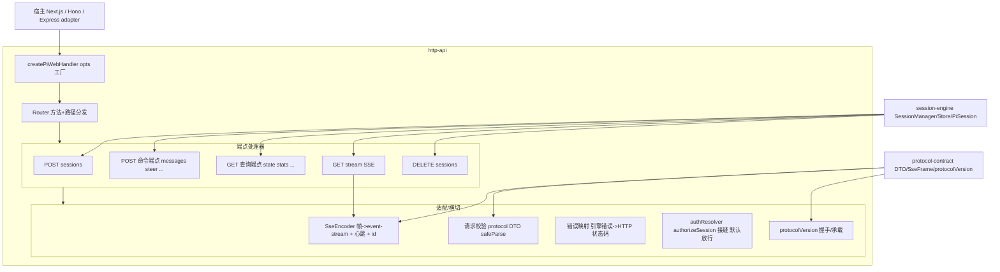
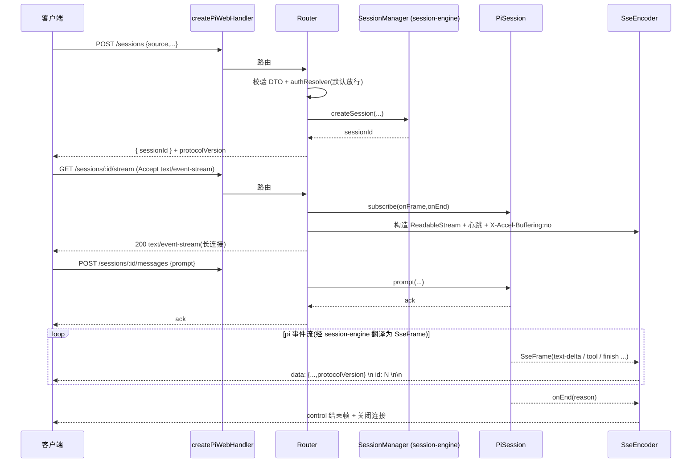
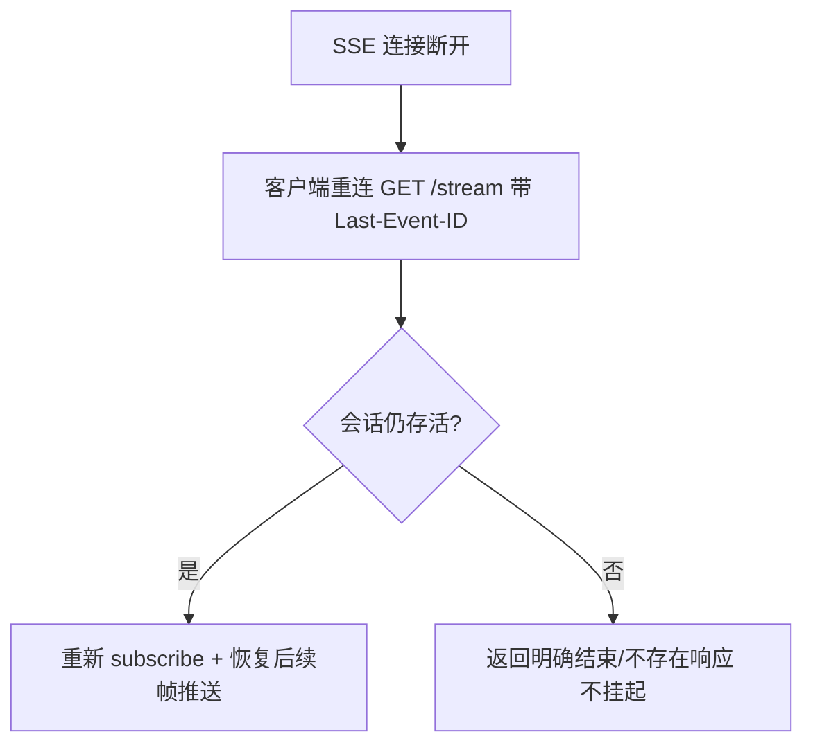
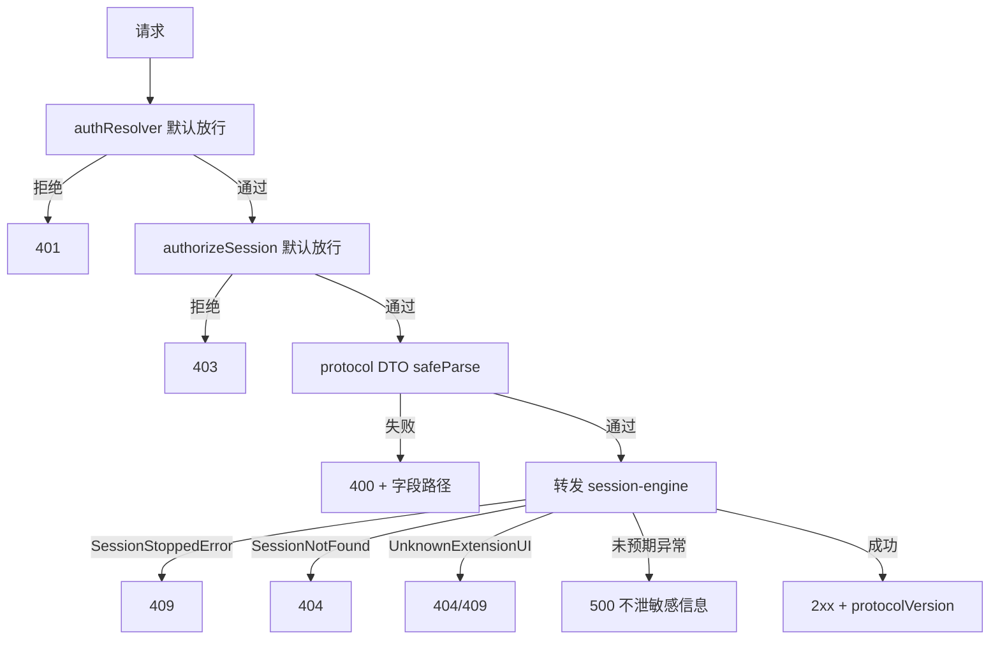

# Design Document — http-api

## Overview

**Purpose**:本特性交付 pi-web 后端的**对外开放面**:一套稳定的 **REST + SSE 契约** + 框架无关入口 `createPiWebHandler(opts)`(返回标准 Web Fetch `(Request) => Promise<Response>`)。它把上游 `session-engine` 的进程内会话抽象(`SessionManager`/`SessionStore`/`PiSession`)经 HTTP 暴露给浏览器前端与任意语言/框架客户端,并把 `PiSession.subscribe()` 的 `SseFrame` 流编码为 `text/event-stream`。

**Users**:`react-client`(`PiTransport`)、第三方语言无关客户端、以及任意把 pi-web 挂到 Next.js Route Handler / Hono / Express 的集成方。它们只面向 HTTP/SSE 契约,不接触 pi 原生事件或内部对象。

**Impact**:把 `PLAN.md` §3.3 的 Route Handlers、§13.2 的 `createPiWebHandler`、§11.5 的 SSE 反代要点、§14.1③ 的"网关只转发、状态在通道背后"收敛为边界清晰、可单测的 HTTP 层。本 spec **消费**上游契约(`@blksails/pi-web-protocol` 的 DTO/SSE 帧/`protocolVersion`、`session-engine` 的 `PiSession` API),不重定义。

### Goals

- 提供 `createPiWebHandler(opts)`:标准 Web Fetch 处理器,内部方法+路径路由到端点处理器;可挂 Next.js/Hono/Express(adapter)。
- 实现全部 REST 端点(创建/命令转发/查询/删除)与 SSE 流端点,边界处用 `@blksails/pi-web-protocol` DTO `safeParse` 校验,失败映射统一错误码。
- 实现 `SseFrame` → `text/event-stream` 编码:`data:`/`event:`/`id:` 行 + 心跳注释帧 + `X-Accel-Buffering: no` + 禁压缩。
- 支持断线重连续流(`id:` 行 + `Last-Event-ID` 重新 `subscribe()`)。
- 在响应/帧承载 `protocolVersion`,提供版本握手/协商。
- 留可插拔鉴权接缝 `authResolver` / `authorizeSession`(**仅接口,默认放行**)。
- 满足"测试 + e2e(硬性)":单元(每 handler 校验 + 错误码 + SSE 编码)、集成(真实 engine + stub agent)、e2e(POST→stream→messages→逐字 delta→finish;abort;重连续流)。

### Non-Goals

- 不 spawn 子进程、不实现 JSONL framing / `PiRpcChannel`(归 `rpc-channel`)。
- 不实现会话对象/广播/事件→UIMessage 翻译/生命周期/`SessionStore` 实现(归 `session-engine`,仅消费)。
- 不定义 protocol 类型/zod schema/`protocolVersion` 常量(归 `protocol-contract`,仅消费)。
- 不落地完整鉴权/多租户/密钥管理(仅留接缝,默认放行)。
- 不构建前端 UI(`react-client`/`ui-components`)、不实现扩展安装(`extension-management`)。
- 不支持 Edge/Serverless 运行(子进程驻留 + SSE 长连接,仅 Node runtime);沙箱 provider 留接缝不落地。
- **本批次不在 REST 面暴露以下下层(`session-engine`/pi)已具备的命令**:`compact`、`fork`、`clone`、`bash`/`abortBash`、`cycleModel`、`getAvailableModels`。这是**有意延后**(deferred),不是疏漏的覆盖缺口——它们在更低层可用但本 spec 的 REST 端点表刻意不映射;待后续批次按需补充对应端点 + DTO + 测试时再纳入。

## Boundary Commitments

### This Spec Owns

- 框架无关入口 `createPiWebHandler(opts)`:Web Fetch 处理器、内部路由(方法+路径 → 端点处理器)、`opts` 注入面(会话依赖 + 可选鉴权接缝 + 可选 SSE 调参)。
- 全部端点处理器:`POST /sessions`;`POST /sessions/:id/{messages,steer,follow_up,abort,model,thinking,ui-response}`;`GET /sessions/:id/{state,stats,messages,commands}`;`GET /sessions/:id/stream`(SSE);`DELETE /sessions/:id`。其中 `GET /sessions/:id/commands` 是**纯 `PiSession` 查询**(返回会话当前可用命令列表),无任何安装/信任治理语义,故由 http-api **独占拥有**;`extension-management` 等下游 spec **消费**该端点而非重新实现,避免端点重复定义。
- 请求边界校验(用 `@blksails/pi-web-protocol` DTO `safeParse`)与统一错误响应结构 + HTTP 状态码映射。
- SSE 帧编码器:`SseFrame` → `text/event-stream` 文本(`data:`/`event:`/`id:` 行)、心跳注释帧、`X-Accel-Buffering: no`、禁压缩、连接关闭与订阅清理。
- 断线重连续流接线(`id:` 行 + `Last-Event-ID` → 重新 `subscribe()`)。
- `protocolVersion` 在响应/帧的承载与握手/协商响应。
- 可插拔鉴权接缝接口 `authResolver` / `authorizeSession`(接口 + 默认放行实现 + 调用点)。

### Out of Boundary

- 子进程 spawn / JSONL framing / `PiRpcChannel` 与命令负载形状(`rpc-channel`)。
- 会话对象 / 事件广播 / 事件→UIMessage 翻译 / 生命周期 / `SessionStore` 实现(`session-engine`,仅消费其接口)。
- agent 源解析 / `spawnSpec` / 信任决策(`agent-source-resolver`)。
- protocol 类型 / zod schema / `protocolVersion` 常量定义(`protocol-contract`,仅消费)。
- 具体鉴权策略 / 密钥管理 / 多租户隔离 / 计费 / 可观测落地(生产硬化;仅留接缝)。
- 前端 UI、扩展安装、Edge/Serverless 适配、沙箱 provider 落地。

### Allowed Dependencies

- **上游 spec(运行时)**:`@blksails/pi-web-protocol`(REST DTO schema、`SseFrameSchema`、`protocolVersion`,单一事实来源 + 边界校验);`session-engine` 的 `SessionManager`/`SessionStore` 接口与 `PiSession` 对外契约(`subscribe`/命令转发方法/`stop`/`getCachedState`)与错误类型(`SessionStoppedError`/`SessionNotFoundError`/`UnknownExtensionUIError`/`MissingInputError`)。
- **运行时**:Web 标准 `Request`/`Response`/`ReadableStream`/`TextEncoder`/`URL`(同构,Node `>=22.19.0` 原生支持);**仅 Node runtime**(子进程驻留 + 长连接)。可用 `node:timers` 做心跳。
- **依赖方向**:`protocol-contract ← http-api`;`session-engine ← http-api`;`http-api ← react-client`、`http-api ← extension-management`(下游)。禁止反向。
- **开发/测试**:`vitest`;集成/e2e 经 `session-engine` + rpc-channel 的 stub agent(`rpc-stub-process.mjs`)或真实 `pi --mode rpc`——不进运行时依赖。

### Revalidation Triggers

- `@blksails/pi-web-protocol` 的 REST DTO / `SseFrameSchema` / `protocolVersion` 承载约定变更。
- `session-engine` 的 `SessionManager`/`SessionStore`/`PiSession` 对外签名或错误类型变更。
- 端点路径/方法、错误码映射、SSE 帧编码格式或重连续流约定变更。
- `createPiWebHandler(opts)` 的注入面(会话依赖、鉴权接缝、SSE 调参)变更。
- 运行时前提从"Node-only + 长连接"放宽/收紧(影响宿主集成与反代约定)。

## Architecture

### Architecture Pattern & Boundary Map

模式:**框架无关的薄网关(Thin Fetch Gateway)+ 端点处理器分发 + SSE 编码适配器**。`createPiWebHandler` 是工厂,产出一个纯函数式 `(Request) => Promise<Response>`;内部 `Router` 按方法+路径匹配到端点处理器;处理器在边界用 protocol DTO 校验后调用注入的 `session-engine`,把结果序列化为 `Response`;SSE 端点用 `SseEncoder` 把 `PiSession.subscribe()` 帧流转为 `ReadableStream`。鉴权经 `authResolver`/`authorizeSession` 接缝(默认放行)。**网关只转发、状态在通道背后**(§14.1③)。



**Architecture Integration**:

- **Selected pattern**:薄网关 + 端点分发 + SSE 编码适配器。理由:Req 1 要求标准 Web Fetch 入口与框架无关;Req 9.4 要求网关只转发、状态在通道背后;SSE 编码是唯一有状态长连接逻辑,隔离为适配器便于单测(Req 10.1)。
- **Domain/feature boundaries**:`handler`(工厂+路由)、`routes/`(逐端点处理器)、`sse/`(帧编码 + 心跳 + 重连)、`http/`(校验/错误映射/响应构造)、`auth/`(接缝接口 + 默认放行)四块职责分离,经类型契约衔接;均不持有会话状态。
- **Dependency direction**:`protocol + session-engine ← http-api ← react-client/extension-management`。处理器只依赖注入的 `session-engine` 接口与 protocol schema,不反向依赖。
- **New components rationale**:`createPiWebHandler`(框架无关单点入口)、`Router`(方法+路径分发)、各 `route` 处理器(单端点单职责)、`SseEncoder`(唯一长连接逻辑)、`http` 横切(校验/错误/版本)、`auth` 接缝——各单一职责。
- **Steering compliance**:TypeScript strict、禁 `any`;Node-only runtime(子进程驻留 + SSE,§11.1);SSE 反代要点(§11.5);鉴权外置为接口(§13.4);网关无状态转发(§14.1③);消费协议契约不重定义(§13.5)。

### Technology Stack

| Layer | Choice / Version | Role in Feature | Notes |
|-------|------------------|-----------------|-------|
| Frontend / CLI | — | 产出 HTTP/SSE 契约供前端/第三方消费 | 不含前端代码 |
| Backend / Services | TypeScript strict;Web Fetch 标准(`Request`/`Response`/`ReadableStream`/`TextEncoder`/`URL`) | 处理器工厂、路由、端点、SSE 编码 | 仅 Web 标准 + 注入依赖,框架无关 |
| Data / Storage | 无(网关无状态;会话状态在 `session-engine`/通道背后) | — | §14.1③:状态不在网关 |
| Messaging / Events | SSE(`text/event-stream`);消费 `PiSession.subscribe()` 的 `SseFrame` 流 | 把帧编码为 event-stream,心跳防断,`id:` 重连 | 帧形状由 `@blksails/pi-web-protocol` 定义 |
| Infrastructure / Runtime | **Node `>=22.19.0` only**(子进程驻留 + 长连接,NOT Edge/Serverless);`node:timers`(心跳);`vitest`(测试);`session-engine` + rpc-channel stub(集成/e2e) | 运行、心跳、测试 | 反代需关闭缓冲/禁压缩/长超时(§11.5) |

## File Structure Plan

### Directory Structure

```
lib/pi/http/
├── create-handler.ts          # createPiWebHandler(opts):组装 Router + 注入依赖,返回 (Request)=>Promise<Response>
├── router.ts                  # Router:方法+路径匹配(含 :id 参数提取)→ 端点处理器;404/405
├── handler.types.ts           # PiWebHandlerOptions、RequestContext(身份/sessionId/parsedBody)、RouteHandler 类型
├── routes/
│   ├── create-session.ts      # POST /sessions:校验建会话 DTO → SessionManager.createSession → { sessionId };停机 503
│   ├── command-routes.ts      # POST messages/steer/follow_up/abort/model/thinking/ui-response:校验→转发 PiSession 命令→ack
│   ├── query-routes.ts        # GET state/stats/messages/commands:转发 PiSession 查询→响应 DTO
│   ├── stream-route.ts        # GET stream(SSE):订阅 PiSession→SseEncoder→Response(ReadableStream)
│   └── delete-session.ts      # DELETE /sessions/:id:PiSession.stop/SessionManager 删除→ack
├── sse/
│   ├── sse-encoder.ts         # SseFrame → event-stream 文本(data:/event:/id: 行);帧序号→id;protocolVersion 承载
│   ├── sse-response.ts        # 构造 SSE Response:ReadableStream 桥接 subscribe、心跳定时器、连接关闭→unsubscribe、响应头(X-Accel-Buffering:no/禁压缩)
│   └── reconnect.ts           # Last-Event-ID 解析 + 重连续流策略(重新 subscribe;会话已结束→明确结束响应)
├── http/
│   ├── validate.ts            # 用 @blksails/pi-web-protocol DTO safeParse 校验请求体/参数;返回校验错误或 typed body
│   ├── responses.ts           # JSON 响应构造、统一错误响应结构、protocolVersion 响应头/体注入
│   ├── error-map.ts           # session-engine 错误 → HTTP 状态码映射(Stopped→409, NotFound→404, UnknownExtensionUI→404/409, MissingInput→400, 未知→500)
│   └── version.ts             # protocolVersion 握手:请求版本兼容判定 + 不兼容协商响应(426/400)
└── auth/
    ├── auth.types.ts          # AuthResolver / AuthorizeSession 接口类型 + AuthContext
    └── default-allow.ts       # 默认放行实现(未注入时使用)
```

### Test Structure

```
lib/pi/http/__tests__/
├── router.test.ts                     # 方法+路径匹配、:id 提取、404/405、外部注入路由可达且不能遮蔽内置(Req 1.2,1.4,1.5,1.7)
├── validate.test.ts                   # 各端点请求体/参数 DTO 校验正反例 + 字段路径错误(Req 2.2,3.3,10.1)
├── error-map.test.ts                  # 引擎错误→HTTP 状态码映射(Req 3.4,3.5,9.1,9.2,10.1)
├── version.test.ts                    # protocolVersion 承载 + 不兼容协商(Req 7.1,7.2,7.3)
├── auth.test.ts                       # 默认放行;authResolver 拒绝→401;authorizeSession 拒绝→403(Req 8.x)
├── sse-encoder.test.ts                # SseFrame→event-stream 文本、心跳注释帧、id: 行、protocolVersion(Req 5.2,5.4,6.1,10.1)
├── create-session.test.ts             # mock manager:建会话成功/缺 source 400/停机 503(Req 2.1,2.2,2.5,10.1)
├── command-routes.test.ts             # mock PiSession:各命令转发 ack + 校验失败 400 + 已停止 409 + 未知 ui-response(Req 3.x,10.1)
├── query-routes.test.ts               # mock PiSession:state/stats/messages/commands 返回响应 DTO(Req 4.x,10.1)
├── stream-route.test.ts               # mock PiSession.subscribe:SSE 头、帧推送、断开→unsubscribe、不存在→404(Req 5.1,5.3,5.5,5.6,5.7,10.1)
├── http.integration.test.ts           # 真实 session-engine + rpc-channel stub:起 handler,POST 命令 + 订阅 SSE 一致(Req 10.2)
└── http.e2e.test.ts                   # POST /sessions→GET /stream→POST /messages→逐字 text-delta→finish;abort 收束;断线重连续流(Req 10.3,10.4,10.5)
```

### Modified Files

- 无(greenfield 新模块)。若 monorepo 已存在 `package.json`,需将 `@blksails/pi-web-protocol` + `session-engine` 模块与 `vitest` 纳入依赖——接线随仓库初始化处理,本 spec 创建模块自身文件与测试。宿主挂载示例(Next.js Route Handler / Hono / Express adapter)作为文档/示例随上层装配,不属本模块运行时文件。

> 每文件单一职责。`sse/` 集中唯一的有状态长连接逻辑(其余处理器为请求-响应纯转发);`http/` 为横切纯函数(校验/错误映射/版本/响应构造),直接驱动单测。

## System Flows

### create → stream → prompt → 逐字 delta(e2e 主链路)



REST 命令与 SSE 流是两条独立连接:`POST /messages` 触发 prompt 后立即 ack;增量经已建立的 `/stream` 连接推送(§13.2 的双连接模型)。

### 断线重连续流



`id:` 行承载帧序号供 `Last-Event-ID` 定位;重连即重新 `subscribe()` 续推后续帧(会话状态在通道背后,网关不缓存历史帧)。

### 请求校验与错误映射



## Requirements Traceability

| Requirement | Summary | Components | Interfaces | Flows |
|-------------|---------|------------|------------|-------|
| 1.1 | 导出 createPiWebHandler 返回 Web Fetch | create-handler.ts | `createPiWebHandler` | 主链路 |
| 1.2 | 按方法+路径路由 | router.ts | `Router.route` | 主链路 |
| 1.3 | opts 注入会话依赖,不 spawn/不解析/不定义 schema | create-handler.ts, handler.types.ts | `PiWebHandlerOptions` | — |
| 1.4 | 未知路径 404 | router.ts, responses.ts | `Router` | 错误映射 |
| 1.5 | 方法不允许 405 | router.ts, responses.ts | `Router` | 错误映射 |
| 1.6 | 仅依赖 Web Fetch 标准 | create-handler.ts, router.ts | Web `Request`/`Response` | — |
| 1.7 | 外部路由注入接缝;内置路由对冲突优先,外部不可遮蔽 | create-handler.ts, router.ts, handler.types.ts | `PiWebHandlerOptions.routes`, `RouteHandler` | 主链路 |
| 2.1 | POST /sessions 校验通过→创建→{sessionId} | create-session.ts, validate.ts | `createSession` | 主链路 |
| 2.2 | 缺 source→400+字段路径 | create-session.ts, validate.ts, responses.ts | `safeParse` | 错误映射 |
| 2.3 | DELETE 停止+移除→ack | delete-session.ts | `PiSession.stop`/store | — |
| 2.4 | sessionId 不存在→404 | router.ts, error-map.ts | store `get` | 错误映射 |
| 2.5 | 停机时新建→503 | create-session.ts | 停机标志 | — |
| 3.1 | POST messages 校验→prompt 转发→ack | command-routes.ts, validate.ts | `PiSession.prompt` | 主链路 |
| 3.2 | steer/follow_up/abort/model/thinking/ui-response 转发 | command-routes.ts | 各命令方法 | 主链路 |
| 3.3 | 命令校验失败→400 不转发 | command-routes.ts, validate.ts | `safeParse` | 错误映射 |
| 3.4 | 已停止会话命令→409 | command-routes.ts, error-map.ts | `SessionStoppedError`→409 | 错误映射 |
| 3.5 | 未知 ui-response ID→404/409 | command-routes.ts, error-map.ts | `UnknownExtensionUIError` | 错误映射 |
| 3.6 | 仅转发不改写语义 | command-routes.ts | 转发 | — |
| 4.1–4.4 | GET state/stats/messages/commands→响应 DTO | query-routes.ts | `PiSession` 查询方法 | — |
| 4.5 | 响应形状以 protocol DTO 为准 | query-routes.ts, responses.ts | protocol 响应 DTO | — |
| 5.1 | GET stream→event-stream 长连接 + subscribe | stream-route.ts, sse-response.ts | `PiSession.subscribe` | 主链路 |
| 5.2 | SseFrame→event-stream 文本 + protocolVersion | sse-encoder.ts | `encodeFrame` | 主链路 |
| 5.3 | X-Accel-Buffering:no + 禁压缩 | sse-response.ts | 响应头 | — |
| 5.4 | 心跳注释帧 | sse-response.ts | 心跳定时器 | — |
| 5.5 | 会话结束→结束信号+关闭 | sse-response.ts, sse-encoder.ts | `onEnd` | 主链路 |
| 5.6 | 客户端断开→unsubscribe 释放 | sse-response.ts | stream cancel | — |
| 5.7 | 不存在会话 stream→404 | stream-route.ts, error-map.ts | store `get` | 错误映射 |
| 6.1 | 帧带 id: 行供重连定位 | sse-encoder.ts | 帧序号→id | 重连续流 |
| 6.2 | 带 Last-Event-ID 重连→重新订阅续流 | reconnect.ts, stream-route.ts | `Last-Event-ID` | 重连续流 |
| 6.3 | 已结束会话重连→明确结束响应 | reconnect.ts | 结束判定 | 重连续流 |
| 6.4 | 续流保持 protocolVersion 一致 | sse-encoder.ts, version.ts | `protocolVersion` | 重连续流 |
| 7.1 | 响应/帧携带 protocolVersion | version.ts, responses.ts, sse-encoder.ts | `protocolVersion` | — |
| 7.2 | 不兼容版本→协商错误(426/400) | version.ts | 兼容判定 | 错误映射 |
| 7.3 | protocolVersion 单一来源 | version.ts | `@blksails/pi-web-protocol` | — |
| 8.1 | authResolver 接口 | auth.types.ts, create-handler.ts | `AuthResolver` | 错误映射 |
| 8.2 | authorizeSession 接口 | auth.types.ts | `AuthorizeSession` | 错误映射 |
| 8.3 | 未配置默认放行 | default-allow.ts | 默认实现 | — |
| 8.4 | authResolver 拒绝→401 | router.ts, auth.types.ts, error-map.ts | 调用点 | 错误映射 |
| 8.5 | authorizeSession 拒绝→403 | router.ts, error-map.ts | 调用点 | 错误映射 |
| 8.6 | 仅定义/调用接缝不落地策略 | auth/* | 接口 | — |
| 9.1 | 统一错误结构 + 状态码区分 | responses.ts, error-map.ts | 错误响应 | 错误映射 |
| 9.2 | 引擎已知错误→对应状态码非 500 | error-map.ts | 错误映射表 | 错误映射 |
| 9.3 | 未预期异常→500 不泄敏感 | responses.ts, error-map.ts | 兜底处理 | 错误映射 |
| 9.4 | 网关只转发状态在通道背后 | create-handler.ts, 全部 routes | 无状态转发 | — |
| 10.1 | 单元:校验+错误码+SSE 编码 | __tests__/validate,error-map,sse-encoder,各 route | vitest | — |
| 10.2 | 集成:真实 engine+stub→POST+SSE | __tests__/http.integration | vitest | 主链路 |
| 10.3 | e2e:POST→stream→messages→delta→finish | __tests__/http.e2e | vitest | 主链路 |
| 10.4 | e2e:abort 生效收束 | __tests__/http.e2e | vitest | 主链路 |
| 10.5 | e2e:断线重连续流 | __tests__/http.e2e | vitest | 重连续流 |
| 10.6 | 单一命令运行全部测试 | vitest 配置 | `vitest run` | — |

## Components and Interfaces

| Component | Layer | Intent | Req Coverage | Key Dependencies (P0/P1) | Contracts |
|-----------|-------|--------|--------------|--------------------------|-----------|
| create-handler.ts | handler | 工厂:组装路由+注入(含外部 routes 接缝),返回 Web Fetch | 1.1,1.3,1.6,1.7,9.4 | Router (P0), session-engine (P0), auth (P1) | Service |
| router.ts | handler | 方法+路径分发 + :id 提取 + auth 调用点 + 外部路由合并(内置优先) + 404/405 | 1.2,1.4,1.5,1.7,2.4,8.4,8.5 | routes (P0), error-map (P0) | Service |
| routes/create-session.ts | routes | 建会话端点 | 2.1,2.2,2.5 | SessionManager (P0), validate (P0) | API |
| routes/command-routes.ts | routes | 命令转发端点 | 3.1–3.6 | PiSession (P0), validate (P0), error-map (P0) | API |
| routes/query-routes.ts | routes | 查询端点 | 4.1–4.5 | PiSession (P0) | API |
| routes/stream-route.ts | routes | SSE 流端点 | 5.1,5.7,6.2 | PiSession.subscribe (P0), sse-response (P0) | API, Event |
| routes/delete-session.ts | routes | 删除会话端点 | 2.3 | PiSession/store (P0) | API |
| sse/sse-encoder.ts | sse | 帧→event-stream 文本编码 | 5.2,5.5,6.1,6.4,7.1 | @blksails/pi-web-protocol (P0) | Event |
| sse/sse-response.ts | sse | SSE Response 构造 + 心跳 + 关闭清理 | 5.1,5.3,5.4,5.5,5.6 | sse-encoder (P0), node:timers (P1) | Event |
| sse/reconnect.ts | sse | Last-Event-ID 续流策略 | 6.2,6.3 | PiSession (P0) | Service |
| http/validate.ts | http | protocol DTO safeParse 校验 | 2.2,3.3,4.5 | @blksails/pi-web-protocol (P0) | Service |
| http/responses.ts | http | JSON/错误响应构造 + 版本承载 | 9.1,9.3,7.1 | version (P1) | Service |
| http/error-map.ts | http | 引擎错误→HTTP 状态码 | 3.4,3.5,9.1,9.2,9.3 | session-engine errors (P0) | Service |
| http/version.ts | http | protocolVersion 握手/承载 | 7.1,7.2,7.3,6.4 | @blksails/pi-web-protocol (P0) | Service |
| auth/auth.types.ts · default-allow.ts | auth | 鉴权接缝接口 + 默认放行 | 8.1–8.6 | handler.types (P1) | Service |

### handler 层

#### createPiWebHandler(create-handler.ts)

| Field | Detail |
|-------|--------|
| Intent | 工厂:接收注入依赖与可选接缝(含外部 routes),组装 `Router`,返回标准 Web Fetch 处理器 |
| Requirements | 1.1, 1.3, 1.6, 1.7, 9.4 |

**Responsibilities & Constraints**
- 返回 `(req: Request) => Promise<Response>`,仅依赖 Web Fetch 标准类型(Req 1.1/1.6)。
- 经 `opts` 接收 `SessionManager`/`SessionStore`(或等价注入)、可选 `authResolver`/`authorizeSession`、可选外部 `routes`(路由注入接缝)、可选 SSE 调参(心跳间隔等);不 spawn、不解析源、不定义 schema(Req 1.3)。
- 把 `opts.routes` 外部路由传给 `Router` 合并;内置路由对精确 `path`+`method` 冲突优先,外部路由不能覆盖内置端点(Req 1.7)。
- 不持有会话状态;每次调用经 `Router` 分发到无状态端点处理器(Req 9.4)。
- 暴露上游 `shutdown()` 透传入口供宿主在 `SIGTERM` 调用(注册点归宿主)。

**Dependencies**
- Inbound: 宿主(Next.js/Hono/Express adapter)— 调用处理器 (P0)
- Outbound: `Router`(P0)、`session-engine`(`SessionManager`/`SessionStore`,P0)
- External: Web Fetch 标准 (P0);`auth` 接缝 (P1)

**Contracts**: Service [x]

##### Service Interface
```typescript
import type { SessionManager, SessionStore } from "<session-engine>/session";
import type { AuthResolver, AuthorizeSession } from "./auth/auth.types";
import type { RouteHandler } from "./handler.types";

export interface PiWebHandlerOptions {
  readonly manager: SessionManager;        // 来自 session-engine(已装配)
  readonly store: SessionStore;            // 会话检索(:id 端点用)
  readonly authResolver?: AuthResolver;    // 可选;未提供→默认放行(Req 8.3)
  readonly authorizeSession?: AuthorizeSession; // 可选;未提供→默认放行
  readonly routes?: ReadonlyArray<{        // 可选外部路由注入接缝(Req 1.7);供 extension-management 等下游挂载
    readonly method: string;               // HTTP 方法
    readonly path: string;                 // 路径模式(同内部路由,支持 :id)
    readonly handler: RouteHandler;        // 复用 RequestContext 契约
  }>;
  readonly sse?: {
    readonly heartbeatMs?: number;         // 心跳间隔(默认值由实现给定)
    readonly basePath?: string;            // 可选路由前缀(如 /api)
  };
}

export type PiWebHandler = (req: Request) => Promise<Response>;

export function createPiWebHandler(opts: PiWebHandlerOptions): PiWebHandler;
```
- Preconditions:`manager`/`store` 必须提供(来自 `session-engine`)。
- Postconditions:返回的处理器对任意 `Request` 解析并返回 `Response`;不抛未捕获异常(兜底 500,Req 9.3)。
- Invariants:处理器无状态;会话状态在通道背后(Req 9.4)。
- **路由注入接缝**(Req 1.7):内部 `Router` 把 `opts.routes` 的外部路由与内置路由**合并**;在精确 `path`+`method` 冲突时**内置路由优先**,外部路由**不能覆盖/遮蔽**内置端点。外部路由经与内置端点相同的 `RequestContext`(含 auth 接缝与 `:id` 提取)分发,以保持鉴权与边界语义一致。

**Implementation Notes**
- Integration:Next.js `app/api/[...path]/route.ts` 导出 `GET/POST/DELETE = handler`;Hono `app.all('*', c => handler(c.req.raw))`;Express 经 Web-Fetch adapter。
- Validation:`router.test.ts` 断言路由/404/405;`create-handler` 经各 route 单测间接覆盖。
- Risks:框架对 `Request.body`/流的支持差异 → 仅用标准 API,adapter 责任在宿主侧。

#### Router(router.ts)

| Field | Detail |
|-------|--------|
| Intent | 按方法+路径匹配端点处理器,提取 `:id`,调用 auth 接缝,合并外部注入路由(内置优先),产出 404/405 |
| Requirements | 1.2, 1.4, 1.5, 1.7, 2.4, 8.4, 8.5 |

**Responsibilities & Constraints**
- 解析 `req.method` 与 `new URL(req.url).pathname`(去 `basePath`),匹配端点表;不匹配路径→404(Req 1.4),路径匹配方法不符→405(Req 1.5)。
- 提取路径参数 `:id` 注入 `RequestContext`;`:id` 端点经 `store.get(id)` 校验存在,不存在→404(Req 2.4)。
- 在分发前调用 `authResolver(req)`(拒绝→401,Req 8.4)与 `authorizeSession(ctx)`(拒绝→403,Req 8.5);未注入→默认放行(Req 8.3)。
- 合并 `opts.routes` 外部注入路由与内置端点表;精确 `path`+`method` 冲突时**内置路由优先**,外部路由不能覆盖/遮蔽内置端点(Req 1.7)。匹配到的外部路由经与内置端点相同的 `RequestContext`/auth 接缝分发。

**Contracts**: Service [x]

##### Service Interface
```typescript
export interface RequestContext {
  readonly req: Request;
  readonly sessionId?: string;       // 由 :id 提取
  readonly auth: AuthContext;        // authResolver 结果(默认放行时为匿名上下文)
}
export type RouteHandler = (ctx: RequestContext) => Promise<Response>;
```
- Invariants:auth 与存在性校验在分发前完成;处理器只在通过后被调用。

**Implementation Notes**
- Integration:端点表把 `(METHOD, path-pattern)` 映射到 `routes/*` 处理器。
- Validation:`router.test.ts` 覆盖匹配、`:id` 提取、404/405、auth 拒绝路径、外部注入路由可达且不能遮蔽内置(Req 1.2/1.4/1.5/1.7/8.4/8.5)。

### routes 层

#### create-session.ts / command-routes.ts / query-routes.ts / delete-session.ts

**Summary-only**:各端点处理器在边界用 `validate.ts`(`@blksails/pi-web-protocol` DTO `safeParse`)校验请求体/参数,失败→400(附字段路径);通过后转发到注入的 `SessionManager.createSession` 或 `PiSession` 的命令/查询方法,把结果用 `responses.ts` 序列化为带 `protocolVersion` 的 `Response`;引擎抛出的已知错误经 `error-map.ts` 映射状态码。`create-session` 在停机标志置位时返回 503(Req 2.5);`delete-session` 触发 `PiSession.stop()` 并依赖上游经 `onClosed` 从 store 移除。Contracts: API。覆盖 Req 2.x、3.x、4.x。

##### API Contract(端点汇总)
| Method | Endpoint | Request(protocol DTO) | Success | Errors |
|--------|----------|------------------------|---------|--------|
| POST | /sessions | CreateSessionRequest {source,cwd?,model?,env?} | 200/201 {sessionId} | 400, 401, 503 |
| POST | /sessions/:id/messages | PromptRequest | 200 ack | 400, 404, 409 |
| POST | /sessions/:id/steer | SteerRequest | 200 ack | 400, 404, 409 |
| POST | /sessions/:id/follow_up | FollowUpRequest | 200 ack | 400, 404, 409 |
| POST | /sessions/:id/abort | (空/AbortRequest) | 200 ack | 404, 409 |
| POST | /sessions/:id/model | SetModelRequest | 200 ack | 400, 404, 409 |
| POST | /sessions/:id/thinking | SetThinkingRequest | 200 ack | 400, 404, 409 |
| POST | /sessions/:id/ui-response | ExtensionUIResponse | 200 ack | 400, 404, 409 |
| GET | /sessions/:id/state | — | 200 StateResponse | 404 |
| GET | /sessions/:id/stats | — | 200 StatsResponse | 404 |
| GET | /sessions/:id/messages | — | 200 MessagesResponse | 404 |
| GET | /sessions/:id/commands | — | 200 CommandsResponse | 404 |
| GET | /sessions/:id/stream | — (SSE) | 200 text/event-stream | 404 |
| DELETE | /sessions/:id | — | 200/204 ack | 404 |

> 所有 DTO 形状取自 `@blksails/pi-web-protocol`;命令负载子类型取自其 `RpcCommand`/REST DTO。命令端点不重定义负载形状。
>
> `GET /sessions/:id/commands` 由 http-api **独占拥有**(纯 `PiSession` 查询,无安装/信任治理);`extension-management` 等下游 spec **消费**此端点而非重新实现,以防跨 spec 端点重复定义。

### sse 层

#### SseEncoder(sse-encoder.ts)

| Field | Detail |
|-------|--------|
| Intent | 把单个 `SseFrame` 编码为 SSE 规范文本(`data:`/`event:`/`id:` 行),帧序号→`id`,承载 `protocolVersion` |
| Requirements | 5.2, 5.5, 6.1, 6.4, 7.1 |

**Responsibilities & Constraints**
- 输入 `SseFrame`(`@blksails/pi-web-protocol`,`uiMessageChunk` 与 `control` 两类)+ 单调帧序号;输出 `text/event-stream` 文本块:`event:`(可选,按帧类别)、`data: <json>`、`id: <seq>`,以空行分隔(Req 5.2/6.1)。
- 每帧 JSON 承载 `protocolVersion`(取自帧或由 `version.ts` 注入),续流保持一致(Req 6.4/7.1)。
- 会话结束帧编码为 control 结束/错误帧(Req 5.5)。
- 纯函数:无 I/O、不启计时器、确定输出,直接单测。

**Contracts**: Event [x]

##### Event Contract
- 输入:`SseFrame`(上游 `PiSession.subscribe` 产出)+ `seq: number`。
- 输出:已编码 SSE 文本块(`Uint8Array`/`string`)。
- Ordering:按帧到达顺序编码;`id` 单调递增供 `Last-Event-ID` 定位。

**Implementation Notes**
- Integration:`sse-response.ts` 在 `ReadableStream` 中对每个 subscribe 帧调用本编码器写入。
- Validation:`sse-encoder.test.ts` 断言两类帧文本格式、`id:` 行、心跳注释帧分隔、`protocolVersion` 字段(Req 5.2/6.1/7.1)。
- Risks:SSE 多行 `data` 转义(换行)→ 编码时按规范拆 `data:` 行。

#### SseResponse(sse-response.ts) / reconnect.ts

**Summary-only**:`sse-response.ts` 用 Web `ReadableStream` 构造 SSE `Response`:`start` 时 `PiSession.subscribe(onFrame,onEnd)`,`onFrame` 经 `SseEncoder` `enqueue`,`onEnd` 写结束帧并 `close`;`node:timers` 周期 `enqueue` 心跳注释帧(`: keep-alive`,Req 5.4);响应头设 `Content-Type: text/event-stream`、`Cache-Control: no-cache`、`Connection: keep-alive`、`X-Accel-Buffering: no`、禁压缩(Req 5.3);`cancel`(客户端断开)时清心跳定时器并 `unsubscribe`,不影响他者(Req 5.6)。`reconnect.ts` 解析 `Last-Event-ID`,会话存活→重新 `subscribe()` 续推后续帧(Req 6.2),已结束→返回明确结束/不存在响应不挂起(Req 6.3)。Contracts: Event / Service。

### http 层

#### validate.ts / responses.ts / error-map.ts / version.ts

**Summary-only**:
- `validate.ts`:对请求体/参数调用 `@blksails/pi-web-protocol` DTO `safeParse`,失败返回带字段路径的校验错误,成功返回 typed body(Req 2.2/3.3/4.5)。
- `responses.ts`:JSON 成功响应与统一错误响应结构(`{ error: { code, message, fields? } }`)构造,注入 `protocolVersion` 响应头/体;500 兜底不泄露 env/凭据/堆栈(Req 9.1/9.3/7.1)。
- `error-map.ts`:把 `session-engine` 错误映射 HTTP 状态码——`SessionStoppedError`→409、`SessionNotFoundError`→404、`UnknownExtensionUIError`→404/409、`MissingInputError`→400、未知→500(Req 3.4/3.5/9.2)。
- `version.ts`:以 `@blksails/pi-web-protocol` 的 `protocolVersion` 为唯一来源(Req 7.3),承载到响应/帧(Req 7.1),请求声明不兼容版本时产出 426/400 协商响应(Req 7.2)。

Contracts: Service。

### auth 层

#### auth.types.ts / default-allow.ts

**Summary-only**:定义接缝接口而不落地策略(Req 8.6):
```typescript
export interface AuthContext { readonly userId?: string; readonly tenantId?: string; readonly anonymous: boolean; }
export type AuthResolver = (req: Request) => Promise<AuthContext | { reject: 401 }>;
export type AuthorizeSession = (input: { auth: AuthContext; sessionId: string; req: Request }) => Promise<boolean>;
```
`default-allow.ts` 提供:`authResolver` 缺省返回匿名 `AuthContext`(`anonymous: true`),`authorizeSession` 缺省返回 `true`(Req 8.3)。`Router` 在分发前调用;`authResolver` 拒绝→401(Req 8.4),`authorizeSession` 返回 false→403(Req 8.5)。Contracts: Service。

## Data Models

### Data Contracts & Integration

- **核心对外契约**:REST 端点(请求/响应 DTO)与 SSE 帧——形状一律取自 `@blksails/pi-web-protocol`(`CreateSessionRequest`/各命令 DTO/各响应 DTO/`SseFrame`),本 spec 不重定义(单一事实来源,Req 4.5)。
- **序列化格式**:REST 走 JSON;SSE 走 `text/event-stream`(`data:`/`event:`/`id:` 行 + 心跳注释帧)。
- **版本**:`protocolVersion`(`@blksails/pi-web-protocol`)承载于 REST 响应头/体与每个 SSE 帧,供前后端协商(Req 7.x);唯一来源,网关不自定义。
- **网关无状态**:不持久化会话状态(§14.1③);`sessionId` 仅作 `store.get` 检索键;SSE 重连经 `Last-Event-ID` 重新订阅,网关不缓存历史帧(Req 6.2)。
- **错误体**:统一 `{ error: { code, message, fields? } }`(Req 9.1)。

## Error Handling

### Error Strategy

- **请求校验失败**(Req 2.2/3.3):边界 `safeParse`,失败→400 + `fields`(字段路径),不向会话转发。
- **鉴权/授权拒绝**(Req 8.4/8.5):`authResolver` 拒绝→401;`authorizeSession` 拒绝→403;均在分发前,不触达会话。
- **路由错误**(Req 1.4/1.5):未知路径→404;方法不允许→405。
- **会话不存在**(Req 2.4/5.7):`store.get` 未命中→404。
- **引擎已知错误**(Req 3.4/3.5/9.2):经 `error-map.ts` 映射——已停止→409、未知扩展 UI ID→404/409、缺入参→400;不退化为 500。
- **版本不兼容**(Req 7.2):请求声明不兼容 `protocolVersion`→426/400 协商响应。
- **停机**(Req 2.5):`shutdown` 置位后 `POST /sessions`→503。
- **未预期异常**(Req 9.3):处理器外层 try/catch 兜底→500,响应体不含 env/凭据/堆栈细节。
- **SSE 连接异常**:客户端断开→`cancel` 清心跳 + `unsubscribe`(Req 5.6);会话结束→写结束/错误帧并 `close`(Req 5.5)。
- **fail fast**:对不存在/已停止会话的操作立即拒绝而非挂起。

### Monitoring

- 会话生命周期/错误经 SSE control 错误帧对前端可见;审计/计费/结构化日志钩子归生产硬化(§11.7),本 spec 仅留 `authResolver`/`authorizeSession` 接缝。
- 本层不做集中监控;运行时可观测由上层装配。

## Testing Strategy

测试项直接源自验收标准(硬性:测试 + e2e)。单一命令(`vitest run`)运行全部(Req 10.6)。

### Unit Tests
- **路由**(`router.test.ts`):方法+路径匹配、`:id` 提取、未知路径 404、方法不允许 405、auth 接缝拒绝路径(401/403);注入的外部路由可达,且与内置端点精确 `path`+`method` 冲突时内置优先(外部不能遮蔽)。(1.2,1.4,1.5,1.7,8.4,8.5)
- **请求校验**(`validate.test.ts`):各端点请求体/参数 `safeParse` 正反例;缺 `source`/类型错→400 且 `fields` 含字段路径。(2.2,3.3,4.5,10.1)
- **错误映射**(`error-map.test.ts`):`SessionStoppedError`→409、`SessionNotFoundError`→404、`UnknownExtensionUIError`→404/409、`MissingInputError`→400、未知→500(不泄敏感)。(3.4,3.5,9.1,9.2,9.3,10.1)
- **版本**(`version.test.ts`):响应/帧承载 `protocolVersion`;不兼容请求→协商错误;来源为 `@blksails/pi-web-protocol`。(7.1,7.2,7.3)
- **鉴权接缝**(`auth.test.ts`):未注入→默认放行;`authResolver` 拒绝→401;`authorizeSession` false→403。(8.1–8.6)
- **SSE 编码**(`sse-encoder.test.ts`):两类帧→`data:`/`event:`/`id:` 文本;心跳注释帧;每帧含 `protocolVersion`;`id` 单调。(5.2,5.4,6.1,7.1,10.1)
- **端点处理器**(`create-session/command-routes/query-routes/stream-route.test.ts`,mock manager/PiSession):建会话成功/缺 source 400/停机 503;各命令转发 ack + 校验 400 + 已停止 409 + 未知 ui-response;查询返回响应 DTO;SSE 头/帧推送/断开 unsubscribe/不存在 404。(2.x,3.x,4.x,5.1,5.3,5.5,5.6,5.7,10.1)

### Integration Tests
- **真实 engine + stub agent**(`http.integration.test.ts`):用 `session-engine` 经 rpc-channel 起真实 `PiSession`(stub agent `rpc-stub-process.mjs`),装配 `createPiWebHandler`;`POST /sessions` 建会话→`GET /stream` 订阅→`POST /sessions/:id/messages` 发命令,断言命令经引擎转发且 SSE 上收到对应帧序列一致。(10.2,3.1,5.1,5.2)

### E2E Tests
- **全链路**(`http.e2e.test.ts`):HTTP `POST /sessions`(真实 engine + stub/真实 pi)→`GET /sessions/:id/stream`→`POST /sessions/:id/messages` 后在 SSE 上接收逐字 `text-delta` 直至 `finish`;`POST /sessions/:id/abort` 后流以结束信号收束;断开 SSE 连接后携带 `Last-Event-ID` 重连 `GET /stream`,恢复后续帧推送(续流);`DELETE /sessions/:id` 后会话移除。(10.3,10.4,10.5,5.5,6.2)

### 运行约定
- 单一命令(`vitest run`)运行全部单元/集成/e2e;集成/e2e 在真实 pi 不可用时回退 rpc-channel 的 stub 进程。(10.6)

## Security Considerations

- 鉴权/授权/多租户为接缝(`authResolver`/`authorizeSession`),默认放行(Req 8.3);本 spec 不落地策略、密钥管理、跨用户隔离(§11.4 归生产硬化)。部署方接入接缝前应自行限制暴露面。
- 错误响应不泄露敏感信息:500 兜底不含 env/凭据/堆栈;SSE 错误帧仅含 reason 摘要(env/凭据不外泄,Req 9.3)。
- 网关无状态、只转发(§14.1③),不在网关持久化会话状态或凭据;`env` 等敏感建会话入参仅透传给 `session-engine`,不回显、不写入日志/帧。
- SSE 长连接资源:客户端断开必须 `unsubscribe` + 清心跳(Req 5.6),避免订阅/计时器泄漏导致资源耗尽。
- 仅 Node runtime:Edge/Serverless 不支持(子进程驻留),避免在无子进程语义环境误部署导致功能性安全假设失效。
