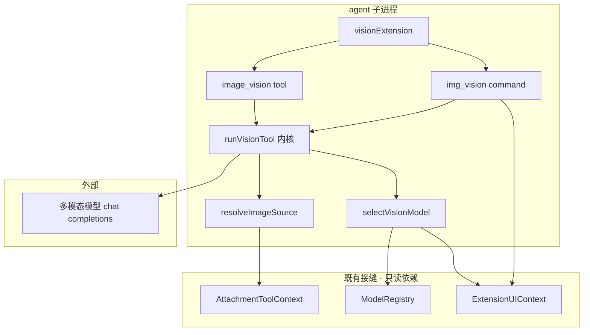
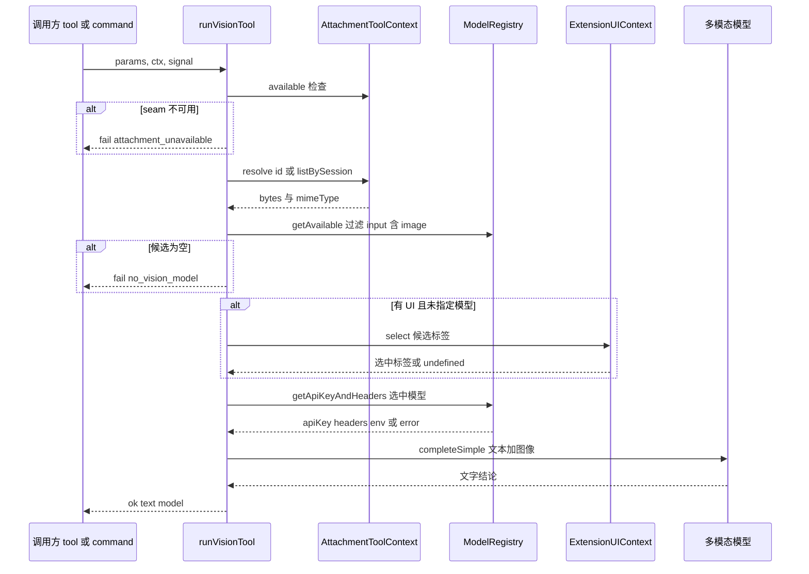
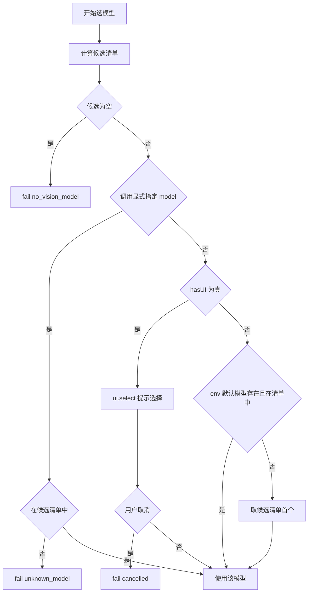

# Design Document — image-vision-tool

## Overview

**Purpose**：本特性给 pi-web 的 agent 一个显式的**图像理解**能力，使其能够「回看」已落库的附件图
（AIGC 生成图、Canvas 图、工具产出图）。这些图当前在对话上下文里只留下
`[attachment id=att_… ]` 文本标记，模型读得到 id、读不到像素。

**Users**：LLM 在推理中自主调用 `image_vision` 工具；终端用户主动敲 `/img_vision` 命令。
两个入口汇入同一内核 `runVisionTool()`，行为完全一致。

**Impact**：新增一个进程内 pi extension（`visionExtension`），经 `AgentDefinition.extensions` 装载。
不改 protocol、不加 provider、不改后端路由。前端仅需一处 prop（命令补全白名单，见 6.1）。
识别请求交由**支持图像输入的模型**处理，返回**文字结论**，图像字节不进对话历史。

### Goals

- 从 `att_<id>` 引用或「会话内最近一张图」缺省规则定位图像，取回字节。
- 候选模型自动来自用户既有模型配置（`input` 含 `"image"` 且凭据可用），零新增模型清单。
- 交互式选模型（`ctx.ui.select`），无 UI 时按确定顺序降级且不阻塞。
- 全链路 fail-soft：任何失败返回结构化 `{ ok: false, reason }`，绝不抛出中断会话。
- 单元测试 + node e2e，均不产生真实 LLM 调用成本。

### Non-Goals

- **inline 回看**（把图像字节内联进工具结果供主模型亲自复看，`details.keepInlineImages`）。
- config 域 `vision` 与 `/settings` 表单；M1 的默认模型只从环境变量读。
- 结构化输出（JSON schema 约束）、OCR / 目标检测预设 prompt。
- 图像**生成 / 编辑**（已由既有 AIGC 能力承担）。

---

## Boundary Commitments

### This Spec Owns

- `tool-kit/src/vision/**` 的全部代码：图像来源解析、模型选择与降级、识别执行、失败枚举。
- `image_vision` 工具契约（参数与结果形状）与 `/img_vision` 命令契约（args 解析与呈现方式）。
- `VisionFailureReason` 判别联合 —— 本 spec 是该枚举的唯一权威。
- `PI_WEB_VISION_MODEL` 环境变量的语义与解析。

### Out of Boundary

- 附件的存储、生命周期、属主校验与签名分发 —— 归 `attachment/` 与 `attachment-bridge/`。
- 模型配置的加载与凭据解析实现 —— 归 pi SDK 的 `ModelRegistry`。
- 扩展命令的执行拦截与控制流点亮 —— 已由 `pi-chat.tsx:972-996` 承担，本 spec **不修改**它。
- AIGC 的 `endpoint-adapter` / `var-resolver` / provider 工厂 —— 本 spec 一行不碰，也不复用。
- 主模型的 vision 上行链路（`body.images`）—— 与本特性正交，不得触碰。

### Allowed Dependencies

- `AttachmentToolContext`（经全局 seam `getAttachmentToolContext()`）：仅用 `available` /
  `resolve(id)` / `listBySession()`。**不得**调用 `putOutput` / `setMeta`（本特性不产出附件）。
- `ExtensionContext`：`ui` / `hasUI` / `modelRegistry` / `model` / `signal`。
- `@earendil-works/pi-ai/compat` 的 `completeSimple`；`@earendil-works/pi-ai` 的类型。
- 依赖方向：`types → resolve-image / select-model → run-vision-tool → tools + extension`。
  左侧不得导入右侧。

### Revalidation Triggers

- `AttachmentToolContext` 的 `resolve` / `listBySession` 签名或 `Attachment` 字段变化。
- pi SDK `ModelRegistry.getAvailable` / `getApiKeyAndHeaders` / `Model.input` 契约变化。
- `completeSimple` 的凭据解析行为变化（见「关键决策 1」）。
- `RegisteredCommand.handler` 签名变化（当前返回 `Promise<void>`）。
- `PiCommandPalette` 扩展命令可见策略变化（当前默认隐藏）。

---

## Architecture

### Existing Architecture Analysis

本特性是既有系统的**扩展**，落在已成熟的三条接缝上：

1. **attachment seam**：runner 在子进程 `globalThis` 注入 `AttachmentToolContext`
   （`server/src/runner/attachment-wiring.ts:151`），工具经 `getAttachmentToolContext()` 读取。
2. **进程内 extension**：`AgentDefinition.extensions?: Array<string | ExtensionFactory>`
   （`agent-kit/src/types.ts:133`），`aigcExtension` 即经此装载（`examples/aigc-agent/index.ts:48`）。
3. **runtime 子入口**：含 pi SDK 值导入的模块只从 `@blksails/pi-web-tool-kit/runtime` 导出
   （`tool-kit/src/runtime.ts`）。`visionExtension` 挂此入口，**无需新增子入口**，
   从而绕开 root `tsconfig.json` paths 同步的已知坑。

沿用的既有模式：
- **依赖注入的 LLM 调用**：`auto-title` 的 `createAutoTitleHandler({ complete, resolveModel })`
  使核心逻辑可在无 LLM 成本下单测。本设计照此形态。
- **fail-soft**：`run-image-tool` 任何失败返回 `{ ok: false }` 不抛。
- **交互补全**：`run-image-tool.ts:156-194` 的 `ctx.hasUI` 守卫 + `ctx.ui.select`。

技术债规避：**不复用 AIGC 的 `endpoint-adapter`**。它服务于图像生成 API（provider 工厂 +
`${VAR}` 占位 env + 裸 fetch），与 VLM 走的 chat/completions 语义不同。混用会诱导后人误接。

### Architecture Pattern & Boundary Map



**Architecture Integration**：

- **Selected pattern**：单内核 + 双入口（tool / command）。内核纯函数化、依赖注入，入口只做适配。
- **Domain boundaries**：`vision/` 独立目录，与 `aigc/`（产图）语义隔离；只读消费 attachment 与
  model registry 两个既有接缝。
- **Existing patterns preserved**：runtime 子入口边界、fail-soft、`ctx.hasUI` 守卫、deps 注入。
- **New components rationale**：见 File Structure Plan，每文件单一职责。
- **Steering compliance**：TypeScript strict 无 `any`；依赖方向单向；单元 + e2e 双证据。

### Technology Stack

| Layer | Choice / Version | Role in Feature | Notes |
|-------|------------------|-----------------|-------|
| Frontend / CLI | `@blksails/pi-web-ui`（既有） | `extensionCommands.allowlist` 放行 `/img_vision` 补全 | 仅一处 prop，无结构改动 |
| Backend / Services | 无改动 | — | 不改路由、不改 protocol |
| Agent runtime | `@earendil-works/pi-coding-agent` 0.80.3 | `registerTool` / `registerCommand` / `ModelRegistry` | 既有依赖 |
| Model call | `@earendil-works/pi-ai` 0.80.3 `compat.completeSimple` | 调用多模态模型 | 既有依赖；**凭据须显式传入** |
| Data / Storage | 既有 attachment store | 只读取图像字节 | 本特性不写入 |

---

## File Structure Plan

### Directory Structure

```
packages/tool-kit/src/vision/
├── types.ts              # VisionResult 判别联合、VisionFailureReason、VisionParams、Deps 契约
├── errors.ts             # fail(reason, detail) 构造器；无副作用
├── resolve-image.ts      # att_id | 缺省 → { base64, mimeType }；含「最近一张图」规则
├── select-model.ts       # 候选清单 + 交互选择 + 无 UI 降级链
├── run-vision-tool.ts    # 内核编排：解析图 → 选模型 → 解析凭据 → 调模型 → 组装结果
├── tools/
│   └── image-vision.ts   # pi.registerTool 适配层（参数 schema + execute）
├── command.ts            # pi.registerCommand 适配层（args 解析 + ctx.ui.notify 呈现）
└── extension.ts          # visionExtension / makeVisionExtension(deps) 工厂
```

依赖方向（左不导入右）：`types/errors → resolve-image, select-model → run-vision-tool → tools, command → extension`。

### Modified Files

- `packages/tool-kit/src/runtime.ts` — 追加导出 `visionExtension` / `makeVisionExtension`
  （及其类型）。不新增子入口。
- `packages/tool-kit/package.json` — **无需改动**（沿用既有 `./runtime`）。
- `components/chat-app.tsx` — 在既有 `EXTENSION_COMMAND_POLICY.allowlist` 中加入 `"img_vision"`，
  使 `/img_vision` 在补全中可见（满足 6.1；平台默认隐藏所有扩展命令）。**不打开** `enabled`。
- `packages/server/src/runner/agent-loader.ts` — **实现期发现的必要修复**（见下）。
- `examples/vision-agent/index.ts`（新建 example）— `extensions: [aigcExtension, visionExtension]`，
  使「生成图 → 回看图」闭环可在单个 agent 内演示。
- `e2e/fixtures/vision-e2e-agent/index.ts`（新建）— e2e fixture：注入确定性假附件上下文，
  `complete` 走**真实** `completeSimple` 打向 mock provider。

> **实现期发现（Out of Boundary 的例外，已确认必要）**：
> jiti 的 `alias` 是**前缀替换**，`@earendil-works/pi-ai` → 包目录，于是子路径
> `@earendil-works/pi-ai/compat` 被改写成 `<pkgDir>/compat`（真实文件在 `<pkgDir>/dist/compat.js`），
> 包自身的 `exports` 不再被查询；且该子路径的 `exports` **只声明 `import` 条件、无 `require`**。
> 结果：任何经 agent-loader 加载、并（传递地）import `pi-ai/compat` 的 agent 都会在 runner 启动时
> fatal（`Cannot find module …/pi-ai/compat`）。
> 修复 = `agent-loader.ts` 注册精确子路径 alias（直指 `dist/compat.js`）+ `vision/extension.ts`
> 用动态 import 延后加载。这是**通用基础设施缺陷**，不是 vision 专属；`auto-title` 未暴露它，
> 因为它经 `forcedExtensionPaths` 由 pi 自己的 ESM loader 加载。

---

## System Flows

### 主流程（工具与命令共用内核）



**关键流程决策**：

- **seam 可用性先于一切**：`available === false` 直接短路，不触碰 registry（避免误报无模型）。
- **模型选择晚于取图**：取图失败率更高且更便宜，先失败先返回，避免无谓弹窗打扰用户。
- **凭据解析在选模型之后、调用之前**，失败归入 `model_auth_failed`（区别于 `call_failed`）。

### 模型选择与降级（状态分支）



> 注意：`ui.select` 返回**选中的字符串本身**（非索引），故需维护 label ↔ model 的反查表。
> 取消时返回 `undefined`，天然对应 3.3。

---

## Requirements Traceability

| Requirement | Summary | Components | Interfaces | Flows |
|---|---|---|---|---|
| 1.1 | 按附件引用取图 | `resolve-image.ts` | `AttachmentToolContext.resolve` | 主流程 |
| 1.2 | 缺省取最近一张图 | `resolve-image.ts` | `listBySession` | 主流程 |
| 1.3 | 引用不存在 → 失败 | `resolve-image.ts` | `fail("attachment_not_found")` | 主流程 |
| 1.4 | 非图像 → 失败 | `resolve-image.ts` | `fail("not_an_image")` | 主流程 |
| 1.5 | 会话无图 → 失败 | `resolve-image.ts` | `fail("no_image")` | 主流程 |
| 2.1 | 仅列支持图像输入的模型 | `select-model.ts` | `Model.input.includes("image")` | 选择分支 |
| 2.2 | 仅列凭据可用的模型 | `select-model.ts` | `ModelRegistry.getAvailable()` | 选择分支 |
| 2.3 | 新增模型自动可选 | `select-model.ts` | 无静态清单 | 选择分支 |
| 2.4 | 无候选 → 失败 | `select-model.ts` | `fail("no_vision_model")` | 选择分支 |
| 3.1 | 有 UI 且未指定 → 提示选择 | `select-model.ts` | `ctx.ui.select` | 选择分支 |
| 3.2 | 显式指定 → 不提示 | `select-model.ts` | — | 选择分支 |
| 3.3 | 取消 → 失败 | `select-model.ts` | `fail("cancelled")` | 选择分支 |
| 3.4 | 指定模型不在清单 → 失败 | `select-model.ts` | `fail("unknown_model")` | 选择分支 |
| 4.1 | 无 UI 不阻塞 | `select-model.ts` | `ctx.hasUI` 守卫 | 选择分支 |
| 4.2 | 无 UI + 显式模型 | `select-model.ts` | — | 选择分支 |
| 4.3 | 无 UI + 默认模型 | `select-model.ts` | `PI_WEB_VISION_MODEL` | 选择分支 |
| 4.4 | 无 UI + 取首个 | `select-model.ts` | — | 选择分支 |
| 4.5 | 无 UI + 空清单 → 失败 | `select-model.ts` | `fail("no_vision_model")` | 选择分支 |
| 5.1 | 用所选模型产出结论 | `run-vision-tool.ts` | `completeSimple` | 主流程 |
| 5.2 | 结论作为结果返回 | `run-vision-tool.ts` | `VisionOk.text` | 主流程 |
| 5.3 | 结果标明所用模型 | `run-vision-tool.ts` | `VisionOk.model` | 主流程 |
| 5.4 | 图像字节不进对话历史 | `run-vision-tool.ts` | 结果仅含 text | 主流程 |
| 5.5 | 调用失败/超时 → 失败 | `run-vision-tool.ts` | `fail("call_failed")` | 主流程 |
| 5.6 | 中止信号 → 停止 | `run-vision-tool.ts` | `StreamOptions.signal` | 主流程 |
| 6.1 | 提供 `/img_vision` 命令 | `command.ts` + `chat-app.tsx` | `pi.registerCommand` + `extensionCommands.allowlist` | — |
| 6.2 | 命令走同一流程 | `command.ts` | `runVisionTool` | 主流程 |
| 6.3 | 命令经 UI 呈现结论 | `command.ts` | `ctx.ui.notify` | — |
| 6.4 | 不依赖助手消息流 | `command.ts` | handler 返回 `void` | — |
| 6.5 | 命令与工具行为一致 | `run-vision-tool.ts` | 共用内核 | 主流程 |
| 7.1 | 失败不中断会话 | `run-vision-tool.ts` | try/catch 兜底 | 主流程 |
| 7.2 | 可区分失败原因 | `types.ts` | `VisionFailureReason` 判别联合 | — |
| 7.3 | 装载后对话流不变 | `extension.ts` | 仅 registerTool/Command | — |
| 7.4 | 未装载与不存在等价 | `extension.ts` | 无全局副作用 | — |

---

## Components and Interfaces

| Component | Domain/Layer | Intent | Req Coverage | Key Dependencies (P0/P1) | Contracts |
|---|---|---|---|---|---|
| `types.ts` / `errors.ts` | 契约层 | 结果判别联合与失败构造 | 7.2 | — | State |
| `resolve-image.ts` | 领域层 | 定位并取回图像字节 | 1.1–1.5 | `AttachmentToolContext` (P0) | Service |
| `select-model.ts` | 领域层 | 候选、选择与降级 | 2.1–2.4, 3.1–3.4, 4.1–4.5 | `ModelRegistry` (P0), `ExtensionUIContext` (P1) | Service |
| `run-vision-tool.ts` | 编排层 | 内核编排 + 凭据解析 + 模型调用 | 5.1–5.6, 6.5, 7.1 | 上述两者 (P0), `completeSimple` (P0) | Service |
| `tools/image-vision.ts` | 适配层 | `registerTool` 适配 | 5.2, 5.3 | `run-vision-tool` (P0) | Service |
| `command.ts` | 适配层 | `registerCommand` 适配 + UI 呈现 | 6.1–6.4 | `run-vision-tool` (P0), `ctx.ui` (P0) | Service |
| `extension.ts` | 装配层 | ExtensionFactory | 7.3, 7.4 | 上述适配层 (P0) | Service |

---

### 契约层

#### `types.ts`

| Field | Detail |
|---|---|
| Intent | 定义结果判别联合与依赖契约，供全模块引用 |
| Requirements | 7.2 |

**Responsibilities & Constraints**
- 本 spec 是 `VisionFailureReason` 的唯一权威；新增原因须同步更新 7.2 的可区分性断言。
- 零运行时依赖，纯类型 + 常量。

**Contracts**: Service [ ] / API [ ] / Event [ ] / Batch [ ] / State [x]

##### State Management

```typescript
/** 失败原因（判别联合的判别键）。 */
export type VisionFailureReason =
  | "attachment_unavailable"  // seam 不可用（env 缺失）
  | "no_image"                // 会话内无图像且未指定（1.5）
  | "attachment_not_found"    // 指定引用无法解析（1.3）
  | "not_an_image"            // 指定附件非图像（1.4）
  | "no_vision_model"         // 无候选模型（2.4 / 4.5）
  | "unknown_model"           // 显式指定的模型不在候选中（3.4）
  | "cancelled"               // 用户取消选择（3.3）
  | "aborted"                 // 中止信号（5.6）
  | "model_auth_failed"       // 凭据解析失败
  | "call_failed";            // 模型调用失败或超时（5.5）

export interface VisionOk {
  readonly ok: true;
  /** 模型产出的文字结论（5.2）。 */
  readonly text: string;
  /** 实际使用的模型，形如 `provider/modelId`（5.3）。 */
  readonly model: string;
}

export interface VisionFail {
  readonly ok: false;
  readonly reason: VisionFailureReason;
  /** 人类可读补充说明；不含图像字节。 */
  readonly detail?: string;
}

export type VisionResult = VisionOk | VisionFail;

/** 调用方入参（工具与命令归一后的形状）。 */
export interface VisionParams {
  /** `att_<id>` 引用；省略则取会话内最近一张图（1.2）。 */
  readonly image?: string;
  /** 要问图像什么。 */
  readonly question: string;
  /** 形如 `provider/modelId`；省略则交互选择或降级（3.1/3.2）。 */
  readonly model?: string;
}

/** 已取回的图像（裸 base64，无 `data:` 前缀）。 */
export interface ResolvedImage {
  readonly base64: string;
  readonly mimeType: string;
  readonly attachmentId: string;
}

/** 依赖注入契约：使内核可在无 LLM 成本下单测（沿用 auto-title 形态）。 */
export interface VisionRunnerDeps {
  readonly complete: CompleteFn;
  /**
   * seam 恒返回一个上下文（不可用时以 `available:false` 降级，而非 `undefined`），
   * 故此处不是 optional —— 与 `getAttachmentToolContext()` 的真实签名一致。
   */
  readonly getAttachmentCtx: () => AttachmentToolContext;
  /** 默认视觉模型来源；缺省读 `process.env.PI_WEB_VISION_MODEL`。 */
  readonly defaultModel: () => string | undefined;
}
```

- Invariants：`VisionOk.text` 非空；`VisionFail` 绝不携带图像字节；结果永不为 `undefined`。

---

### 领域层

#### `resolve-image.ts`

| Field | Detail |
|---|---|
| Intent | 把 `image?` 参数解析为可送模型的 `ResolvedImage` |
| Requirements | 1.1, 1.2, 1.3, 1.4, 1.5 |

**Responsibilities & Constraints**
- 「最近一张图」= `listBySession()` 过滤 `mimeType.startsWith("image/")`，按 `createdAt`
  （ISO 8601 字符串）降序取首个。`Attachment` 已含 `mimeType` 与 `createdAt`
  （`protocol/src/attachment/attachment-dto.ts:24-33`），无需额外查询。
- **裸 base64**：`ImageContent.data` 不带 `data:` 前缀。本模块直接由 `handle.bytes()`
  → `Buffer.from(bytes).toString("base64")`，**不复用** `resolveInputToDataUri`（它产 data URI）。
- 不做属主校验（已由 `beforeToolCall` 前置保证）。

**Dependencies**
- Outbound: `AttachmentToolContext.resolve / listBySession` — 取图与枚举 (P0)

**Contracts**: Service [x]

##### Service Interface

```typescript
export function resolveImageSource(
  image: string | undefined,
  attCtx: AttachmentToolContext,
): Promise<ResolvedImage | VisionFail>;
```

- Preconditions：`attCtx.available === true`（由内核前置检查）。
- Postconditions：成功时 `base64` 为裸 base64；失败时 reason ∈
  `{no_image, attachment_not_found, not_an_image}`。
- Invariants：`resolve()` 抛出的任何错误被捕获并映射为 `attachment_not_found`，绝不外泄。

---

#### `select-model.ts`

| Field | Detail |
|---|---|
| Intent | 计算候选、交互选择、无 UI 降级 |
| Requirements | 2.1–2.4, 3.1–3.4, 4.1–4.5 |

**Responsibilities & Constraints**
- 候选 = `registry.getAvailable().filter(m => m.input.includes("image"))`。
  `getAvailable()` 本身即 `models.filter(hasConfiguredAuth)`，恰好满足 2.2；**不得**用 `getAll()`。
- 无任何静态模型清单 → 2.3 自动成立。
- `ctx.ui.select(title, options: string[])` 返回**选中的字符串**，故须维护
  `Map<label, Model<Api>>` 反查；`undefined` ⇒ `cancelled`。
- 模型标识统一为 `` `${provider}/${id}` ``（与 auto-title 的 `resolveTitleModel` 解析形态一致）。
- 降级顺序严格为：显式 `model` → `defaultModel()` → 候选首个 → `no_vision_model`。

**Dependencies**
- Outbound: `ModelRegistry.getAvailable` — 候选来源 (P0)
- Outbound: `ExtensionUIContext.select` — 交互选择 (P1，`hasUI` 为假时不触碰)

**Contracts**: Service [x]

##### Service Interface

```typescript
export interface SelectModelInput {
  readonly requested: string | undefined;   // params.model
  readonly registry: ModelRegistry;
  readonly ui: ExtensionUIContext | undefined;
  readonly hasUI: boolean;
  readonly defaultModel: string | undefined;
}

export function selectVisionModel(
  input: SelectModelInput,
): Promise<Model<Api> | VisionFail>;

/** 候选清单（导出以便单测与命令层复用）。 */
export function listVisionModels(registry: ModelRegistry): Model<Api>[];
```

- Preconditions：无。
- Postconditions：返回的 `Model` 必属候选清单；失败 reason ∈
  `{no_vision_model, unknown_model, cancelled}`。
- Invariants：`hasUI === false` 时**绝不**调用 `ui.select`（4.1）。

---

### 编排层

#### `run-vision-tool.ts`

| Field | Detail |
|---|---|
| Intent | 内核编排：取图 → 选模型 → 解析凭据 → 调模型 → 组装结果 |
| Requirements | 5.1–5.6, 6.5, 7.1 |

**Responsibilities & Constraints**
- **关键决策 1（凭据）**：`completeSimple` **不会**从 `models.json` 解析凭据。其内部
  `withEnvApiKey`（`pi-ai/dist/compat.js:141-148`）仅在 `options.apiKey` 缺省时回落**环境变量**。
  本仓目标 provider（如 `apiservices`）的 key 只存在于 `~/.pi/agent/models.json`，
  因此**必须**显式解析并传入：

  ```typescript
  const auth = await registry.getApiKeyAndHeaders(model);   // ResolvedRequestAuth
  if (!auth.ok) return fail("model_auth_failed", auth.error);
  const msg = await deps.complete(model, context, {
    apiKey: auth.apiKey,     // StreamOptions.apiKey
    headers: auth.headers,   // StreamOptions.headers
    env: auth.env,           // StreamOptions.env
    signal,                  // StreamOptions.signal（5.6）
  });
  ```

  > `auto-title` 未做这一步是因为它用 `ctx.model`（主模型，key 恰在 env 中）。**照抄会 401。**

- **关键决策 2（消息形状）**：单条 user message，`content` 为
  `[{type:"text",text:question}, {type:"image",data:base64,mimeType}]`
  （`UserMessage.content: string | (TextContent | ImageContent)[]`）。
- **关键决策 3（fail-soft）**：整个 `execute` 体包在 try/catch 中，未预期异常映射为
  `call_failed`；`signal.aborted` 映射为 `aborted`（7.1）。
- 结果只含文字（5.4）；不调用 `putOutput`，不产生附件。

**Dependencies**
- Outbound: `resolveImageSource` (P0)、`selectVisionModel` (P0)
- Outbound: `ModelRegistry.getApiKeyAndHeaders` — 凭据 (P0)
- External: `completeSimple` — 模型调用 (P0)；经 `deps.complete` 注入以便测试

**Contracts**: Service [x]

##### Service Interface

```typescript
export type CompleteFn = (
  model: Model<Api>,
  context: Context,
  options: SimpleStreamOptions,
) => Promise<AssistantMessage>;

export function createVisionRunner(
  deps: VisionRunnerDeps,
): (
  params: VisionParams,
  ctx: ExtensionContext,
  signal: AbortSignal | undefined,
) => Promise<VisionResult>;
```

- Preconditions：`params.question` 非空字符串。
- Postconditions：永远返回 `VisionResult`，**永不抛出**（7.1）。
- Invariants：`ok:true` ⟹ `text` 非空且 `model` 形如 `provider/id`。

**Implementation Notes**
- Integration：`attCtx.available === false` → `attachment_unavailable`，早于 registry 访问。
- Validation：从 `AssistantMessage` 提取文本时，拼接全部 `type:"text"` 部分；结果为空 ⇒ `call_failed`。
- Risks：`signal` 在命令入口不来自形参而来自 `ctx.signal`（可能 `undefined`），见 `command.ts`。

---

### 适配层与装配层

#### `tools/image-vision.ts`

| Field | Detail |
|---|---|
| Intent | `pi.registerTool` 适配：参数 schema + execute |
| Requirements | 5.2, 5.3 |

**Responsibilities & Constraints**
- 工具名固定 `image_vision`。参数用 `@earendil-works/pi-ai` 的 `Type`（TypeBox），与
  `aigc/tools/image-edit.ts:131-179` 同形。
- `execute(_toolCallId, params, signal, _onUpdate, ctx)` → `runVisionTool(params, ctx, signal)`。
- 返回 `AgentToolResult`：`content: [{type:"text", text: 结论或失败说明}]`，
  `details: VisionResult`。**`content` 中不放 `ImageContent`**（M1 无 inline，且会被 base64 闸门剥离）。

**Contracts**: Service [x]

#### `command.ts`

| Field | Detail |
|---|---|
| Intent | `pi.registerCommand` 适配：args 解析 + `ctx.ui` 呈现 |
| Requirements | 6.1, 6.2, 6.3, 6.4 |

**Responsibilities & Constraints**
- `RegisteredCommand.handler: (args: string, ctx: ExtensionCommandContext) => Promise<void>` ——
  **返回 `void`**，故结论只能经 `ctx.ui.notify(text, "info")` 呈现；失败经
  `ctx.ui.notify(说明, "error")`。6.3/6.4 由类型强制，非约定。
- `args` 是裸 string：整段作为 `question`；为空时用默认提问（如「描述这张图」）。
  图像固定走「最近一张图」缺省规则（命令不接受 att_id 参数，避免用户手抄 id）。
- `signal` 取自 `ctx.signal`（命令 handler 无 `signal` 形参）。
- handler 内部**吞掉一切异常**（7.1）：内核已 fail-soft，此处仅兜底 `notify`。

**Dependencies**
- Outbound: `runVisionTool` (P0)、`ctx.ui.notify` (P0)

**Contracts**: Service [x]

**Implementation Notes**
- Integration：`/img_vision` 的**执行**路径已由 `pi-chat.tsx:972-996` 承担
  （`source==="extension"` → `armExtControlStream()` + fire-and-forget），本 spec 不改它。
- Integration：`/img_vision` 的**可见性**需 app 层放行 —— 平台默认隐藏所有扩展命令
  （`pi-command-palette.tsx:9-15`）。`webVisible` 由 server 依据命令 `sourceInfo` 解析所属
  **插件包的 `pi-plugin.json`** 回填，进程内 extension 无此清单、拿不到该标记，
  故走 `extensionCommands={{ allowlist: ["img_vision"] }}`（6.1 的显式交付项，不可遗漏）。
- Risks：若遗漏 allowlist，命令仍可手敲执行，但不出现在补全中 → 6.1 不达标。

#### `extension.ts`

| Field | Detail |
|---|---|
| Intent | ExtensionFactory：注册工具与命令 |
| Requirements | 6.5, 7.3, 7.4 |

**Responsibilities & Constraints**
- `makeVisionExtension(deps: Partial<VisionRunnerDeps>): ExtensionFactory` —— 供测试注入。
- `visionExtension: ExtensionFactory` —— 生产默认（`complete = completeSimple`，
  `getAttachmentCtx = getAttachmentToolContext`）。
- 仅调用 `pi.registerTool` 与 `pi.registerCommand`，**无任何全局副作用**（7.4）。
- 不注册任何 `pi.on(...)` 事件钩子 ⇒ 对话流零影响（7.3）。

**Contracts**: Service [x]

---

## Error Handling

### Error Strategy

单一出口：内核返回 `VisionResult` 判别联合，**永不抛出**。适配层据 `ok` 分流：
工具写入 `content` + `details`；命令写入 `ctx.ui.notify`。

### Error Categories and Responses

| 类别 | reason | 触发 | 响应 |
|---|---|---|---|
| 环境缺失 | `attachment_unavailable` | seam `available === false` | 提示附件能力不可用 |
| 用户输入 | `attachment_not_found` / `not_an_image` / `unknown_model` | 引用或模型名有误 | 说明具体不可用项 |
| 无可用资源 | `no_image` / `no_vision_model` | 会话无图 / 无候选模型 | 指引上传图或配置模型 |
| 用户意图 | `cancelled` / `aborted` | 取消选择 / 中止信号 | 静默返回，不视为错误 |
| 外部失败 | `model_auth_failed` / `call_failed` | 凭据解析或模型调用失败 | 携带 detail，便于排查 |

`cancelled` 与 `aborted` 在命令入口以 `"info"` 级别 notify（非 `"error"`），避免把用户主动
取消渲染成故障。

### Monitoring

复用 `@blksails/pi-web-logger`。命名空间 `vision:run`，记录：所选模型、图像 mimeType 与字节数、
耗时、失败 reason。**不记录** base64 内容与 apiKey。

---

## Testing Strategy

> 项目硬性要求：单元/集成测试 + e2e，且以新鲜运行输出为证（`.kiro/steering/tech.md`）。
> 全部测试**不产生真实 LLM 调用成本**（`complete` 经 `deps` 注入 fake）。

### Unit Tests

1. `resolveImageSource` — 指定 `att_id` 取回裸 base64（断言**无** `data:` 前缀）；`resolve` 抛错
   → `attachment_not_found`；`mimeType: "text/plain"` → `not_an_image`（1.1/1.3/1.4）。
2. `resolveImageSource` — 缺省时按 `createdAt` 降序在多张图中选中最新一张，且跳过非图像附件；
   会话无图 → `no_image`（1.2/1.5）。
3. `listVisionModels` — 过滤掉 `input: ["text"]` 的模型；断言使用 `getAvailable()` 而非
   `getAll()`（以只在 `getAll` 中出现的无凭据模型不得入选来断言）（2.1/2.2）。
4. `selectVisionModel` — 降级链四分支：显式模型命中/不在清单（`unknown_model`）、
   `hasUI:false` 走 env 默认、env 缺省取首个、空清单 → `no_vision_model`（3.2/3.4/4.2/4.3/4.4/4.5）。
5. `selectVisionModel` — `hasUI:true` 且未指定 → 调用 `ui.select` 一次；返回 `undefined`
   → `cancelled`；断言 `hasUI:false` 时 `ui.select` **零调用**（3.1/3.3/4.1）。
6. `createVisionRunner` — 断言传给 `complete` 的 `options` 含由 `getApiKeyAndHeaders` 返回的
   `apiKey`/`headers`/`env`，且 `context.messages[0].content` 为 `[text, image]` 两段、
   `image.data` 为裸 base64（5.1，**关键决策 1 与 2 的回归锁**）。
7. `createVisionRunner` — `getApiKeyAndHeaders` 返回 `{ok:false}` → `model_auth_failed`；
   `complete` 抛错 → `call_failed`；`signal.aborted` → `aborted`；断言全程**不抛出**（5.5/5.6/7.1）。
8. `types` — `VisionFailureReason` 十种取值两两可区分（7.2 的机械断言）。

### Integration Tests

1. `visionExtension` 装载后，`pi.registerTool` 与 `pi.registerCommand` 各被调用一次且名称为
   `image_vision` / `img_vision`；断言**未注册任何事件钩子**（7.3/7.4）。
   （手法沿用 `test/aigc/canvas-extra-commands.test.ts:189` 的 `registerCommand: vi.fn()`。）
2. 命令 handler：成功路径调用 `ctx.ui.notify(结论, "info")`；失败路径 notify `"error"`；
   `cancelled` 走 `"info"`。断言 handler 返回 `undefined` 且不抛（6.3/6.4）。
3. 工具 `execute`：结果 `content` 仅含 `type:"text"`，**不含** `ImageContent`（5.4）。

### E2E Tests (node)

沿用 `e2e/node/extension-ui-select.e2e.test.ts` 的离线 stub 形态
（`PI_WEB_STUB_AGENT=1` + 真实 HTTP handler + SSE）。

1. **工具闭环**：上传一张图 → prompt 触发 `image_vision` → 断言 SSE 上出现工具调用与
   文字结论，且结论中含 stub 模型标识（5.1/5.2/5.3）。
2. **`ui.select` 往返**：`hasUI` 为真时，断言 `extension_ui_request(select)` 帧出现、
   `ui-response` 回传后识别继续（3.1）。
3. **命令闭环**：`/img_vision` 经 fire-and-forget 投递 → 断言**无用户气泡、无消息历史增量**，
   结论经控制流 `notify` 到达（6.2/6.3/6.4）。

### 手工验收（记入完成证据）

- 真实 `gpt-5.4`（apiservices 网关）跑一次 AIGC 生成图 → `/img_vision` 描述该图，
  验证「关键决策 1」在真实网关上成立（凭据来自 `models.json` 而非 env）。

---

## Security Considerations

- **凭据不外泄**：`apiKey` / `headers` 仅在调用瞬间传入 `completeSimple`，不写日志、不进结果。
- **base64 不落历史**：`VisionFail.detail` 与日志均禁止携带图像内容；结果只含文字（5.4）。
- **属主边界**：附件属主校验由既有 `beforeToolCall` 承担，本特性不放宽。
  `listBySession()` 天然以当前会话闭包限定，不存在跨会话读图。
- **命令的默认隐藏是安全网**：本 spec 仅把 `img_vision` 单个命令加入 allowlist，
  **不得**打开 `extensionCommands.enabled = true`（那会放行全部扩展命令，多数会在 web 端卡死）。
