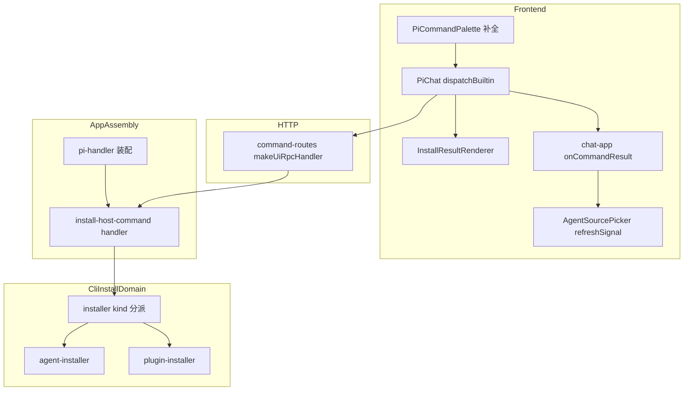
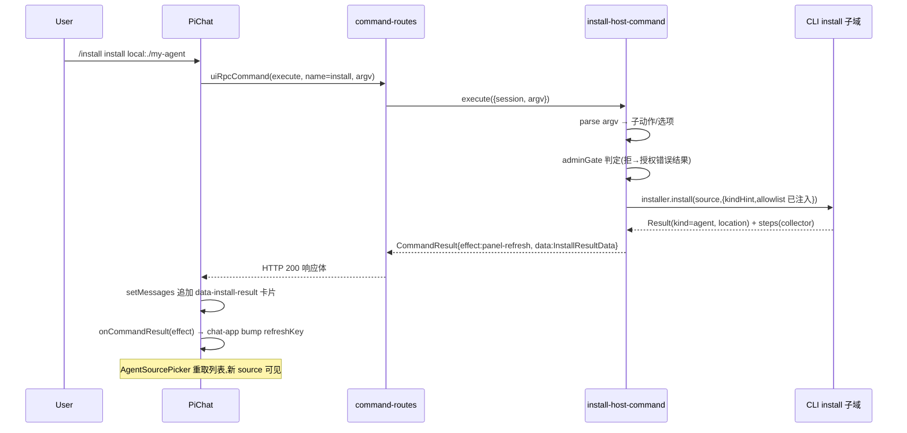

# Design Document — install-host-command

## Overview

**Purpose**: 本特性为 web 会话操作者提供 host 命令 `/install`,在聊天输入框按 kind 安装/卸载/列出/更新 agent 与 plugin,复用 CLI install 子域的既有实现,并摘除旧的 agent 侧 `/plugin` 命令。

**Users**: web 会话操作者(装卸包)、部署运维者(门控不扩面)、维护者(单一安装实现)。

**Impact**: 命令面板新增 builtin 词条 `/install`(host 通道同步执行);`CommandResult.data` 首次获得进聊天流的卡片通路(`resultDataPart` 词条声明 + `data-install-result` 渲染器);`effect:"panel-refresh"` 首次获得前端落地(source 选择器刷新信号);CLI install 子域获得 allowlist 注入接缝与 component 显式拒绝(邻接缺陷修复);agent 侧 `/plugin` 命令退场。

### Goals
- `/install` 四子动作(install/uninstall/list/update)在 web 面可用,结果以结构化卡片呈现
- 门控与 REST `POST /extensions` 共享同一份配置(adminGate + extAllowlist + env 放行),零新增配置面
- 生效分道:plugin→当前会话 reload;agent→选择器免刷新可见、不重启会话
- component 包在 web 与 CLI 两个 install 通道被显式拒绝并指引 `pi-web add`
- 旧 `/plugin` 干净摘除,补全词条迁移为 `/install`

### Non-Goals
- REST `POST /extensions` 增加 agent 通道(REST 保持现状)
- 授权粒度细化(沿全局 adminGate)
- component 经 `/install` 安装;registry/marketplace 远端;`pi-web add` 车道变更
- agent 的 update 通道(CLI 亦无;update 仅 plugin)

## Boundary Commitments

### This Spec Owns
- `lib/app/install-host-command.ts`:/install 的 handler(argv 解析、门控、kind 分派、collector reporter、结果组装、用法文本)
- `packages/protocol` 的 `InstallResultData` 契约(卡片 data 的 schema)
- `BuiltinCommandSpec.resultDataPart` 可选字段与 `dispatchBuiltin` 的通用卡片追加语义
- `data-install-result` 渲染器;`/install` 补全词条(install-arg-provider)
- `AgentSourcePicker` 的 `refreshSignal` 刷新语义与 chat-app 的 `onCommandResult` 接线
- CLI install 子域的两笔接缝改造:`CreateInstallerOptions.allowlistConfig` 注入、kind 分派层的 component 显式拒绝
- agent 侧 `/plugin` 命令与其放行项的摘除(含测试改写)

### Out of Boundary
- host 命令通道本身(registry/command-routes,决策A 既有骨架,不改语义)
- CLI `pi-web install/uninstall/list/update` 的词条与行为(除 component 拒绝外不动)
- `GET /agent-sources`、`GET /extensions`、`GET /sessions/:id/install-sources` 端点(只读消费)
- tool-kit 的 `reload-runtime` 命令与 `install_extension`/`uninstall_extension`/`list_extensions` 三个 agent 工具(另一张脸,保留)
- REST `POST /extensions` 与其五步编排

### Allowed Dependencies
- 依赖方向(违者即错):`packages/protocol` ← `packages/server`/`packages/react`/`packages/ui`/`packages/tool-kit` ← 应用层(`lib/app`、`components/`、`server/cli`)。
- `lib/app/install-host-command.ts` 可同时 import `packages/server` 的契约(`HostCommandHandler`)与 `server/cli/install/*` 的实现(两者都在 app 装配层可达);**`packages/server` 不得 import `server/cli/*`**。
- 前端组件只消费 protocol 契约与既有端点,不认识 CLI 子域。

### Revalidation Triggers
- `CommandResult`/`CommandExecutePayload` schema 变化(protocol semver)
- `HostCommandContext` 形状变化(argv 串→结构化)
- CLI install 子域端口签名变化(`Installer`/`PluginInstaller`/`ProgressReporter`)
- `GET /agent-sources` 的扫描∪注册表语义变化(影响 agent 装后可见性)

## Architecture

### Existing Architecture Analysis
- host 命令通道(决策A):`makeUiRpcHandler` 拦截 `point:"command"/action:"execute"`,registry 同步执行,结果在 HTTP 响应体;registry 捕获 handler 异常转 `effect:"notify"`,**handler 内部无需兜底 try/catch 到进程层**。
- 前端命令识别:`PiChat.onSubmit` 按 `builtinCommands` 名匹配 → `dispatchBuiltin` → `executeHostCommand`;effect 仅 `clear-transcript` 有内置处理,其余经可选 `onCommandResult` 上抛。
- 卡片注入唯一先例:bang 命令构造 `UIMessage{parts:[{type:"data-bash-result",data}]}` 经 `setMessages` 追加,渲染靠 `registerDataPartRenderer`。
- 装配料全在 `lib/app/pi-handler.ts`:`extPiCli`/`extAllowMutate`/`extAllowlist`/`reloadRunner`/`sourcesRoot`/`registryPath`,REST 扩展路由消费同一份。

### Architecture Pattern & Boundary Map



**Architecture Integration**:
- Selected pattern:host 命令 handler 放应用装配层(`lib/app/`,与 `clear-host-command.ts` 同级),依赖注入闭包在 `pi-handler.ts` 完成——`packages/server` 与 `server/cli` 互不相识。
- 复用纪律:安装编排只有 CLI 子域一份;web handler 是薄适配(argv→选项、reporter→steps、Result→CommandResult),不复制安装逻辑。
- 门控纪律:`extAllowlist`/`adminGate(extAllowMutate)` 与 REST 同变量;`CLI_ALLOWLIST` 仅在 CLI 缺省路径存续。

### Technology Stack

| Layer | Choice / Version | Role in Feature | Notes |
|-------|------------------|-----------------|-------|
| Frontend | React 18 + packages/ui 渲染注册表 | 卡片渲染、补全、刷新信号 | 无新依赖 |
| Backend | packages/server host-command 骨架 + server/cli install 子域 | 命令执行与安装编排 | 无新依赖 |
| Contract | packages/protocol zod schema | InstallResultData | protocol 加法,不破坏既有 |
| Testing | vitest + Playwright(第三套 webServer) | 单测/集成/e2e | stub agent 环境 |

## File Structure Plan

### New Files
```
packages/protocol/src/web-ext/install-command.ts   # InstallResultData zod schema + 类型(卡片契约)
lib/app/install-host-command.ts                    # createInstallHostCommand:argv 解析/门控/kind 分派/steps 收集/结果组装/用法文本
packages/ui/src/chat/install-result-renderer.tsx   # data-install-result 渲染器(BashResultRenderer 同型)
packages/ui/src/controls/install-arg-provider.ts   # INSTALL_SPEC 词条 + listArgs(替代 plugin-arg-provider)
test/commands/install-host-command.test.ts         # handler 单测(fake 端口)
e2e/browser/install-host-command.e2e.ts            # 安装旅程 + component 拒绝(第三套 webServer)
e2e/browser/install-subcommand-completion.e2e.ts   # 补全三态(迁移自 plugin-subcommand-completion)
```

### Modified Files
- `server/cli/install/installer.ts` — `CreateInstallerOptions.allowlistConfig?` 注入接缝;`install()`/`uninstall()` kind 分派加 `component` 显式拒绝分支(`KIND_COMPONENT_UNSUPPORTED` + `pi-web add` 指引)
- `packages/protocol/src/web-ext/index.ts`(或对应 barrel)— 导出 install-command 契约
- `packages/tool-kit/src/commands/types.ts` — `BuiltinCommandSpec` 加可选 `resultDataPart?: string`
- `packages/tool-kit/src/commands/builtin.ts` — 新增 INSTALL 词条(`resultDataPart:"data-install-result"`)
- `packages/tool-kit/src/extension-tools/extension-manager.ts` — 摘除 `registerCommand("plugin")` 块(保留 reload-runtime 与三工具)
- `packages/tool-kit/test/extension-tools/extension-manager.test.ts` — 命令清单断言与 /plugin describe 块改写
- `packages/ui/src/chat/pi-chat.tsx` — `dispatchBuiltin` 通用卡片追加(词条声明 `resultDataPart` 且 result.data 存在时);注册 install renderer;provider 换 `createInstallArgProvider`
- `packages/ui/src/controls/plugin-arg-provider.ts` — 删除(被 install-arg-provider 取代;若有共享工具函数迁入新文件)
- `components/chat-app.tsx` — extensionCommandPolicy 移除 `"plugin"` 项;新增 `agentSourcesRefreshKey` + `onCommandResult`(effect==="panel-refresh" 时 bump);两处 `<AgentSourcePicker>` 传 `refreshSignal`
- `components/agent-source-picker.tsx` — `refreshSignal?: number` prop,进 `useAgentSourceList` 依赖数组
- `lib/app/pi-handler.ts` — hostCommands 数组追加 `createInstallHostCommand({...装配料})`
- `playwright.config.ts` — 第三套 webServer(专用端口;env:`PI_WEB_EXT_ALLOW_LOCAL=1`、`PI_WEB_EXT_ADMIN_ALLOW_ANY=1`、临时 `PI_WEB_SOURCES_ROOT`/`PI_CODING_AGENT_DIR`)
- `test/cli/installer.test.ts` — component 拒绝用例 + allowlistConfig 注入用例
- `e2e/browser/plugin-subcommand-completion.e2e.ts` — 删除(由 install-subcommand-completion 取代,覆盖面不缩)

## System Flows



流程级决策:plugin 通道成功时 handler 服务端调用 `reloadRunner(session)` 后才返回(effect:"notify");agent 通道不触碰 runner。授权/白名单拒绝在进入 CLI 子域**之前**发生并记审计。registry 捕获一切异常,handler 只需把业务错误组装为失败卡片结果。

## Requirements Traceability

| Requirement | Summary | Components | Interfaces |
|-------------|---------|------------|------------|
| 1.1-1.7 | 子动作面与同步语义 | InstallHostCommand, BuiltinInstallEntry | HostCommandHandler, InstallResultData |
| 2.1-2.4 | kind 判别与覆盖 | InstallHostCommand → CLI installer(determineKind 复用) | InstallOptions.kindHint |
| 2.5, 2.6 | component 双通道拒绝 | InstallerKindDispatch(CLI 侧改造) | InstallerError KIND_COMPONENT_UNSUPPORTED |
| 3.1-3.5 | 三门共享与审计 | InstallHostCommand(adminGate/allowlistConfig 注入), PiHandlerAssembly | CreateInstallerOptions.allowlistConfig |
| 4.1 | plugin reload | InstallHostCommand(reloadRunner 注入) | SessionReloader |
| 4.2-4.4 | agent 分道与选择器刷新 | ChatAppCommandResult, AgentSourcePickerRefresh | onCommandResult, refreshSignal |
| 5.1-5.4 | 卡片呈现与脱敏 | InstallResultRenderer, CollectorReporter, dispatchBuiltin 卡片追加 | InstallResultData, resultDataPart |
| 6.1, 6.2 | 旧 /plugin 摘除 | ExtensionManagerRemoval | — |
| 6.3-6.5 | 补全迁移 | InstallArgProvider | CommandArgProvider |
| 6.6 | 新旧共存 | (命名天然成立,e2e 佐证) | — |
| 7.1-7.4 | e2e 与回归 | InstallE2E, CompletionE2E, 既有测试面 | — |

## Components and Interfaces

| Component | Domain/Layer | Intent | Req Coverage | Key Dependencies | Contracts |
|-----------|--------------|--------|--------------|------------------|-----------|
| InstallResultData 契约 | protocol | 卡片 data schema | 5.1, 5.4 | zod (P0) | State |
| InstallHostCommand | lib/app | /install handler | 1.x, 2.1-2.5, 3.x, 4.1, 4.2 | CLI install 子域 (P0), host registry 契约 (P0) | Service |
| InstallerKindDispatch 改造 | server/cli | allowlist 接缝 + component 拒绝 | 2.5, 2.6, 3.4 | source-resolver (P0) | Service |
| BuiltinInstallEntry | tool-kit | /install 词条 + resultDataPart 字段 | 1.5, 5.1 | — | State |
| DispatchBuiltinCard | packages/ui | 通用卡片追加 | 5.1, 5.2 | resultDataPart (P0) | State |
| InstallResultRenderer | packages/ui | data-install-result 渲染 | 5.1, 5.4 | InstallResultData (P0) | State |
| InstallArgProvider | packages/ui | 补全词条与候选 | 6.3-6.5 | 三个只读端点 (P1) | Service |
| ChatAppCommandResult | components | effect→refreshKey 接线 | 4.3, 4.4 | PiChat onCommandResult (P0) | State |
| AgentSourcePickerRefresh | components | refreshSignal prop | 4.3, 4.4 | useAgentSourceList (P0) | State |
| ExtensionManagerRemoval | tool-kit | 摘除旧 /plugin | 6.1, 6.2 | — | — |
| PiHandlerAssembly | lib/app | 装配注入 | 3.1, 4.1 | 既有装配料 (P0) | — |

### protocol

#### InstallResultData 契约

| Field | Detail |
|-------|--------|
| Intent | /install 结果卡片的 data 契约,handler 与 renderer 共享 |
| Requirements | 5.1, 5.4 |

```typescript
const InstallStepSchema = z.object({
  stage: z.string(),                       // reporter 的 ProgressStage
  status: z.enum(["complete", "failed"]),
  detail: z.string().optional(),           // 已脱敏
});

const InstallResultDataSchema = z.object({
  action: z.enum(["install", "uninstall", "list", "update"]),
  ok: z.boolean(),
  kind: PluginKindSchema.optional(),       // list 无单一 kind
  id: z.string().optional(),               // 包名/source 名
  location: z.string().optional(),         // agent 落点
  guidance: z.string().optional(),         // agent:如何在选择器切换;component 拒绝:pi-web add 指引
  steps: z.array(InstallStepSchema).default([]),
  items: z.array(z.object({                // list 子动作的表体
    id: z.string(), version: z.string().optional(),
    scope: z.string().optional(), kind: z.string().optional(),
  })).optional(),
  error: z.object({ code: z.string(), message: z.string() }).optional(),
});
export type InstallResultData = z.infer<typeof InstallResultDataSchema>;
```

- Invariants:所有 string 字段在组装时已过 `redactSecrets`;`ok:false` 时 `error` 必填。

### lib/app

#### InstallHostCommand

| Field | Detail |
|-------|--------|
| Intent | /install 的 HostCommandHandler:argv 解析、门控、kind 分派、结果组装 |
| Requirements | 1.1-1.7, 2.1-2.5, 3.1-3.5, 4.1, 4.2, 5.2-5.4 |

**Responsibilities & Constraints**
- 薄适配:不含安装逻辑;所有依赖构造期注入,handler 内不读 `process.env`。
- argv 解析:空白分词后 `node:util parseArgs`(与 CLI runInstall 同风格);v1 不支持引号包裹。
- 门控顺序:子动作/参数校验 → adminGate → (进入 CLI 子域,allowlist 拒绝由 `resolveSource` 在编排内发生) → 结果组装;拒绝路径记审计。
- 输出纪律:message 与 steps 一律过 `redactSecrets`;帮助/用法(裸 `/install`、未知子动作、参数缺失)返回 `effect:"none"` 纯 message,**不带 data**(不出卡片,Req 5.2);执行类结果带 `data`(卡片)。

**Dependencies**
- Outbound:`server/cli/install/installer.ts` `createInstaller`(P0)、`plugin-installer` `createPluginInstaller`(P0)、`reporter` `redactSecrets`(P0)
- Inbound:`pi-handler.ts` 装配(P0)、host-command-registry 调用(P0)

**Contracts**: Service [x]

```typescript
interface InstallHostCommandDeps {
  readonly installer: Installer;             // 已注入 extAllowlist 的实例
  readonly pluginInstaller: PluginInstaller;
  readonly adminGate: () => boolean;          // extAllowMutate 同源
  readonly reloadRunner: (session: PiSession) => Promise<void>;
  readonly audit?: (event: InstallAuditEvent) => void; // 与 REST 扩展路由同一实例(实现时核对其端口形状)
  readonly cwd?: string;                      // resolveSource 的本地源基准
}
function createInstallHostCommand(deps: InstallHostCommandDeps): HostCommandHandler;
```

- Preconditions:deps.installer 由装配方以 `allowlistConfig: extAllowlist` 构造。
- Postconditions:返回值恒为 `CommandResult`(不 throw 业务错误);`effect` ∈ notify(plugin 成败/list/update/授权拒绝)、panel-refresh(agent install/uninstall 成功)、none(用法文本)。
- Invariants:plugin install/uninstall/update 成功 → 先 `reloadRunner(ctx.session)` 再返回;agent 通道恒不调用 reloadRunner。

**Implementation Notes**
- Integration:collector reporter = `ProgressReporter` 的内存实现,`start` 记 stage、`complete/fail` 落 `InstallStep`;fail 的 CliError.message 组装前过 redactSecrets(CLI 的 createProgressReporter 只在打印面脱敏,collector 需自带)。
- Validation:`--kind` 非法值、缺参、未知子动作各有独立错误文本;update 收到**任何** `--kind` 输入均以用法错误拒绝(update 仅 plugin 通道,不接受 kind 选择)。
- Risks:`HostCommandContext.argv` 是原始串,分词歧义(路径含空格)在 v1 明确不支持——用法文本注明。

### server/cli

#### InstallerKindDispatch 改造

| Field | Detail |
|-------|--------|
| Intent | allowlist 注入接缝 + component 显式拒绝(CLI/web 共享) |
| Requirements | 2.5, 2.6, 3.4 |

**Contracts**: Service [x]

```typescript
interface CreateInstallerOptions {
  // ...既有字段不变
  /** 注入来源白名单;缺省沿 CLI_ALLOWLIST(+env allowAnyNpm)。web 面必须显式传 extAllowlist。 */
  readonly allowlistConfig?: AllowlistConfig;
}
// InstallerError 增加错误码
type InstallerErrorCode = /* 既有 */ | "KIND_COMPONENT_UNSUPPORTED";
```

- Postconditions:`install()`/`uninstall()` 在 kind 判别为 `component` 时立即返回 `{ok:false, error:{code:"KIND_COMPONENT_UNSUPPORTED", message:"组件包请在目标 source 目录用 pi-web add 安装"}}`,不触碰任何通道。
- Invariants:未注入 `allowlistConfig` 时行为与现状逐字节一致(CLI 回归护栏)。

### packages/ui / tool-kit(前端面)

#### DispatchBuiltinCard + BuiltinInstallEntry(summary-only)
- `BuiltinCommandSpec` 加 `resultDataPart?: string`;`/install` 词条 `{name:"install", description:"安装 agent/plugin(host 通道)", target:{kind:"server-action"}, userOnly:true, resultDataPart:"data-install-result"}`。
- `dispatchBuiltin`:命令执行后,若词条声明 `resultDataPart` 且 `outcome.result?.data` 存在,构造 assistant `UIMessage{parts:[{type: spec.resultDataPart, data: result.data}]}` 经 `setMessages` 追加(bang 模式);`message` 存在而 `data` 不存在时以纯文本形态追加(用法/帮助)。effect 处理保持现状(clear-transcript 内置,其余上抛 `onCommandResult`)。

#### InstallResultRenderer(summary-only)
- `data-install-result` 渲染器,BashResultRenderer 同型:头行(action/kind/id/成败)、location 与 guidance 行、steps 列表(失败步红色)、list 的 items 表。data 先过 `InstallResultDataSchema.safeParse`,解析失败降级为 JSON 预格式块(不崩)。在 pi-chat.tsx 与 bash renderer 同点注册。

#### InstallArgProvider

| Field | Detail |
|-------|--------|
| Intent | /install 的补全词条与参数候选 |
| Requirements | 6.3, 6.4, 6.5 |

**Contracts**: Service [x](实现既有 `CommandArgProvider`)

- `INSTALL_SPEC`:command `"install"`,subcommands `install`(argKind localSource)/`uninstall`(argKind installedPackage)/`list`(terminal)/`update`(argKind installedPackage,可选参)。
- `listArgs` 数据源:`install`→`GET /sessions/:id/install-sources?q=`(现状复用);`uninstall`→`GET /extensions`(plugin,insertText=id)∪`GET /agent-sources`(agent,**insertText=`<name> --kind agent`**,detail 标注 agent——规避缺省 kind 走错通道);`update`→`GET /extensions`。
- 旧 `plugin-arg-provider.ts` 删除;`pi-chat.tsx` 换 `createInstallArgProvider`。

### components(应用壳)

#### ChatAppCommandResult + AgentSourcePickerRefresh(summary-only)
- chat-app:`const [agentSourcesRefreshKey, setAgentSourcesRefreshKey] = useState(0)`;`onCommandResult={(name, outcome) => { if (outcome.ok && outcome.result?.effect === "panel-refresh") setAgentSourcesRefreshKey(n => n + 1); }}` 传给 `<PiChat>`;两处 `<AgentSourcePicker refreshSignal={agentSourcesRefreshKey}>`。同时从 `extensionCommandPolicy` allowlist 移除 `"plugin"`。
- agent-source-picker:`refreshSignal?: number` prop → `useAgentSourceList(enabled, listAgentSources, refreshSignal)`,加入 effect 依赖数组(reqIdRef 竞态守卫已有,直接受益)。

### tool-kit(摘除面)

#### ExtensionManagerRemoval(summary-only)
- 摘除 `extension-manager.ts` 的 `pi.registerCommand("plugin", ...)` 块与其专用 helper;保留 `reload-runtime` 与三个 agent 工具。测试:命令清单断言改 `["reload-runtime"]`,删除/plugin describe 块(工具面的测试保留)。

### lib/app(装配)

#### PiHandlerAssembly(summary-only)
- `hostCommands: createHostCommandRegistry([createClearHostCommand(), createInstallHostCommand({ installer, pluginInstaller, adminGate, reloadRunner, audit, cwd })])`。
- `installer = createInstaller({ allowlistConfig: extAllowlist, agentInstallerOptions: { sourcesRoot, registryPath }, piCli: extPiCli })`;`pluginInstaller = createPluginInstaller({ piCli: extPiCli })`;`adminGate = () => extAllowMutate`;`reloadRunner` 复用 :418 既有函数;`sourcesRoot`/`registryPath` 复用 agent-sources 段(:499-504)同值。

## Error Handling

### Error Strategy
- registry 层兜底(异常→notify),handler 层组装业务错误为失败卡片(`ok:false` + `error{code,message}` + 失败 step),用户错误(用法/参数)为纯 message。
- 错误码直通:CLI 子域的 `InstallerError`/`PluginInstallError` code 原样进 `InstallResultData.error.code`,message 过 redactSecrets。

### Error Categories and Responses
- **用户错误**:缺参/未知子动作/非法 `--kind` → 用法文本(effect none);component 包 → `KIND_COMPONENT_UNSUPPORTED` 失败卡片含 `pi-web add` 指引(guidance 字段)。
- **授权错误**:adminGate 拒 → 失败卡片,message 说明需管理员放行(`PI_WEB_EXT_ADMIN_ALLOW_ANY`);allowlist 拒(resolveSource 内) → 失败卡片,message 说明对应 env 放行途径(Req 3.3)。两者记审计。
- **系统错误**:pi CLI 不存在/命令失败/网络 → CLI 子域错误码直通失败卡片;不半成功(Req 5.4)。

### Monitoring
- 审计事件与 REST 安装同机制;handler 日志走既有 logger 命名空间(装配处已有先例)。

## Testing Strategy

### Unit Tests
1. `install-host-command.test.ts`(fake Installer/PluginInstaller/reloadRunner/audit):argv 解析全矩阵(1.5/1.6/2.3/2.4);adminGate 拒绝含审计(3.2/3.5);plugin 成功→reloadRunner 恰被调一次且在返回前(4.1);agent 成功→reloadRunner 不被调 + effect panel-refresh + guidance(4.2);component 错误直通 guidance(2.5);steps 与 message 脱敏(5.3,含 Bearer/token/URL 凭据样本);list --outdated 诚实转达(1.3);update 逐项 outcomes 与 hasFailures→失败卡片(1.4/5.4)。
2. `test/cli/installer.test.ts` 增补:注入 `allowlistConfig{allowLocal:false}` 时本地源拒绝(3.4);不注入时行为不变(回归);本地 component 清单→install/uninstall 均 `KIND_COMPONENT_UNSUPPORTED`(2.6)。
3. `install-arg-provider` 单测:specFor 词条;uninstall 候选合并两端点且 agent 项 insertText 带 `--kind agent`(6.4);install 候选走 install-sources(6.5)。
4. `install-result-renderer` 单测:成功/失败/list 表体/schema 解析失败降级(5.1/5.4)。

### Integration Tests
1. command-routes 层:注册真实 `createInstallHostCommand`(fake 安装端口)+ 真会话 store,POST uiRpcCommand execute → 同步响应体含 CommandResult(1.1/1.7)。
2. tool-kit:摘除后命令清单断言(6.1)。

### E2E/UI Tests(Playwright,第三套 webServer:放行 env + 临时 sourcesRoot/agentDir)
1. `/install install <本地 agent 源>` → data-install-result 卡片可见 → 打开 source 选择器新 source 可见(7.1, 4.3)。
2. `/install install <component 包>`(examples/canvas-component-watermark)→ 失败卡片含 `pi-web add` 指引(7.2)。
3. `/install ` 子动作四候选 → `install` 参数位本地源候选 → `uninstall` 参数位已装候选(7.3,迁移自 plugin-subcommand-completion,断言 `data-pi-command-item` 与 stage 属性)。
4. 回归:既有 e2e(FS/sqlite 两套)与 `test/cli` 全量、workspace 测试保持绿(7.4)。

## Security Considerations
- 三门(adminGate/extAllowlist/env 放行)与 REST 同源同值,/install 不新增放行面;`CLI_ALLOWLIST` 只在 CLI 缺省路径可达(3.4 有单测钉住)。
- 输出脱敏统一在 collector/组装层(5.3);e2e 环境的放行 env 仅挂第三套 webServer,不弱化既有用例。
- agent 落盘写入面(sourcesRoot/registry)只经 CLI 子域既有实现,不在 handler 层新增文件写入。
