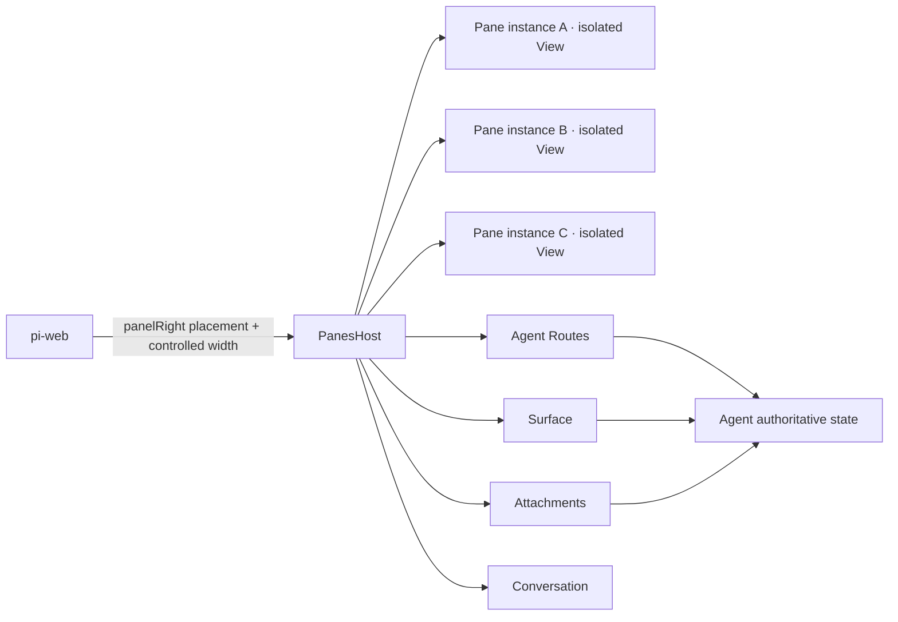
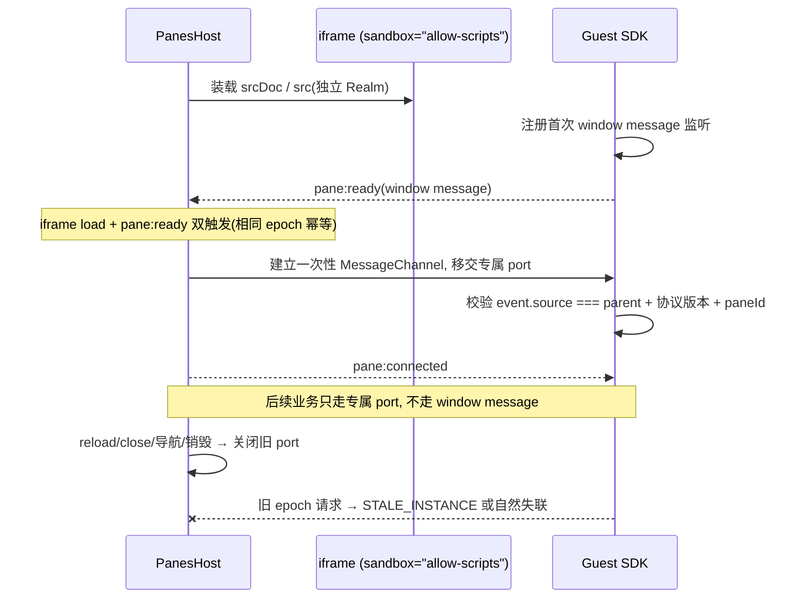
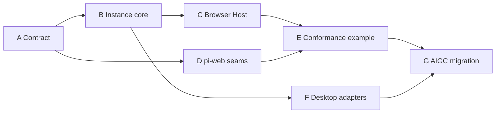

# Design Document — isolated-panes

## Overview

**Purpose**: 为 pi-web 建立领域中立的 `pane` 运行地基:Agent 声明可多开的 Pane,pi-web 只提供右侧 placement、会话能力与连续宽度,每个 Pane 实例运行在独立 iframe 或 Tauri WebView 中。

**Users**: pane 作者(agent source 开发者)经公开包声明与实现 Pane;pi-web 维护者获得一套不解释业务领域的隔离宿主;AIGC 等业务团队在地基验收后按领域拆 Pane 迁移。

**Impact**: 在 `panelRight` placement 上新增 `PanesHost` 装载路径与连续宽度接线;不改变无 Panes Agent、普通 WebExt 与无 panelRight 页面的既有行为。

### Goals

- 冻结领域中立公开契约:descriptors、envelopes、错误码、grant、大小限制。
- 一个 Tab 一个 `PaneInstance` 一个独立 JS Realm;同一 `PaneDefinition` 按 `allowMultiple/maxInstances` 多开。
- 权限默认拒绝,按 Agent Route、HTTP method、Surface key/action、附件、Conversation 分项授予。
- Browser 与 Tauri 复用同一 contract、Guest SDK 和 conformance suite,只替换 View/transport adapter(Electron 壳已由 spec electron-to-tauri 移除;第三方 Electron 宿主可基于同一抽象自行实现)。
- panelRight 接入 PiChat 已有 `panelWidth/onPanelWidthChange` 连续拖拽,宿主受控宽度。

### Non-Goals

- 不在地基内重做 Canvas:Canvas Pane 直接复用 `@blksails/pi-web-canvas-ui` 的 `CanvasPanel` 与既有 Canvas Surface/附件/Conversation 链路。
- 不引入 `frame-rpc` 依赖:Pane 内部隔离通信使用 `MessageChannel` 或原生 IPC relay。
- 不提供任意 URL、任意 HTTP method、任意宿主函数或远程代码执行入口。
- 不改动既有离散比例 `panelRatio` 模式(仅保持向后兼容)。
- AIGC 业务迁移本身的领域设计(仅约束其通道与验收门)。

## Boundary Commitments

### This Spec Owns

- `packages/panes-kit` 公开契约与其默认值、错误码、大小限制。
- 多实例工作区纯状态模型(`createPaneWorkspace/reducePaneWorkspace`)。
- Browser Host(sandbox iframe + `MessageChannel` 双握手)、Guest SDK 与 React Host/Guest 接口。
- pi-web 能力代理接缝:Agent Routes adapter、Surface 镜像、附件上传、Conversation 提交。
- `PanePort/PaneViewAdapter` 抽象、共用中继原语(adapters/relay.ts)与 Tauri adapter(含 desktop Rust relay)。
- `examples/panes-agent` 一致性范例。

### Out of Boundary

- Canvas 领域状态、schema、reducer 与画布 UI(归 Canvas 领域;若需每实例独立文档,应在 Canvas 领域增加 documentId)。
- Agent Routes、Surface、附件系统、Conversation 的既有实现(只消费、只做错误映射)。
- PiChat 连续拖拽分隔条实现(只接线)。
- AIGC 业务 Pane 的领域实现(Wave 5 迁移,不得反向污染地基)。

### Allowed Dependencies

- pi-web 既有 Agent Routes、Surface、附件、Conversation 链路(能力面)。
- PiChat `panelWidth/onPanelWidthChange`(placement 宽度)。
- `@blksails/pi-web-canvas-ui` 的 `CanvasPanel`(仅范例内复用)。
- 平台原生:iframe/`MessageChannel`、Tauri WebView 与原生 IPC。
- 约束:业务范例只消费公开包,不得成为第二套 Host core;Desktop 只替换 adapter,不增加 Guest 专属 API。

### Revalidation Triggers

- 公开契约变化:envelope、operation 集合、错误码、grant 结构、默认限制。
- 实例模型语义变化:`instanceId:epoch` key、open/activate/move/reload/close。
- Agent Routes 地址或错误映射变化(`HOST_UNAVAILABLE`、readiness 重试窗口)。
- WebExt `panelWidth` 配置形状或 ChatApp 受控宽度链路变化。
- `PanePort/PaneViewAdapter` 形状变化(双宿主 conformance 须重跑)。

## Architecture

### Existing Architecture Analysis

- pi-web WebExt 已有 `panelRight` placement;PiChat 已实现 `panelWidth/onPanelWidthChange` 连续拖拽与离散 `panelRatio` 切换。
- Agent Routes 已提供 `sessions/{sessionId}/agent-routes/{route}` HTTP 面;Surface、附件、Conversation 为既有能力链路。
- Canvas 已有完整 UI(`CanvasPanel`)、`canvasSurfaceExtension`、AIGC 与 vision extensions;地基不得平行实现。
- 须保持:无 Panes 的 Agent 零行为变化;普通 WebExt 与无 panelRight 页面零回归。

### Architecture Pattern & Boundary Map



**Architecture Integration**:

- 三层边界:
  - **pi-web**:WebExt 把一个 `PanesHost` 根组件放入 `panelRight`;`config.panelWidth` 存在时,ChatApp 持有宽度状态并接入 PiChat 已有的 `panelWidth/onPanelWidthChange` 连续拖拽;不解释 Pane、Canvas、文件或业务消息。
  - **Agent**:声明 Panes、实例上限和能力白名单;持有 Agent Route handlers、Surface、附件元数据及 LLM 可见工具;业务写入采用 schema 校验、revision CAS 和 change journal。
  - **Pane Host / Guest**:Host 管理实例、Tab、epoch、View、端口、授权和能力代理;Guest 通过 `PaneGuestProvider/usePaneGuest` 使用窄接口;Pane 内的 Dialog、路由、局部状态和复杂布局均属于 Pane 自身。
- 安全边界始终是独立 View、端口、schema 与 grant;React Provider/HOC 只约束作者接口。
- 通道选择(数据面分工):

| 数据 | 通道 | 例子 |
|---|---|---|
| 高频轻状态 | Surface | revision、dirty、任务进度、资产引用 |
| 冷数据和 mutation | Agent Routes | 文件正文、Diff、领域写入 |
| 二进制 | Attachments | 图片、视频、导出物 |
| 显式进入 LLM | Conversation | "解释当前 Diff" |
| View 内部隔离通信 | PanePort | Guest 请求、结果、生命周期、Surface 镜像 |

PanePort 不提供任意 URL、任意 HTTP method、任意宿主函数或远程代码执行入口。

### Technology Stack

| Layer | Choice / Version | Role in Feature | Notes |
|-------|------------------|-----------------|-------|
| 契约与核心 | TypeScript(纯包,无框架) | descriptors/envelopes/授权/实例 reducer | `packages/panes-kit` |
| Browser Host | sandbox iframe + `MessageChannel` | 实例隔离与端口通信 | `sandbox="allow-scripts"` |
| React 层 | React Provider/hook/HOC | Host 装载与 Guest 作者接口 | `panes-kit/react` |
| Desktop | Tauri WebView + Rust relay | View/transport adapter | 复用同一 contract 与 Guest SDK |
| 数据面 | 既有 Agent Routes/Surface/附件/Conversation | 能力代理 | 不新增数据面 |

## File Structure Plan

### Directory Structure

```text
packages/panes-kit/
├─ src/
│  ├─ contract.ts          # descriptors, envelopes, errors
│  ├─ instances.ts         # multi-instance/epoch workspace model
│  ├─ authorization.ts     # default-deny grants and limits
│  ├─ agent-routes.ts      # typed HTTP adapter and error mapping
│  ├─ guest.ts             # framework-neutral Guest SDK
│  ├─ host-ports.ts        # MessagePort/native relay common seam
│  ├─ adapters/            # relay primitives + Tauri adapter/bootstrap
│  └─ react/
│     ├─ panes-host.tsx    # iframe host and multi-open tabs
│     └─ pane-guest.tsx    # Provider, hook, HOC
└─ test/

examples/panes-agent/
├─ index.ts                # Agent extensions, routes, LLM inspector
├─ panes-state.ts          # example domain state
├─ routes/pane-data.ts
├─ web/                    # author source
└─ .pi/web/dist/           # compiled WebExt artifact only
```

### Modified Files

- ChatApp(pi-web 前端装配)——`config.panelWidth` 存在时持有宽度受控状态并接入 PiChat 连续拖拽,隐藏离散比例切换器;未声明时走既有 `panelRatio` 路径。
- WebExt panelRight 装载——挂载 `PanesHost` 根组件;无 Panes 声明时行为不变。

## System Flows

### Browser Host 握手与端口生命周期



opaque-origin iframe 无法依赖精确 origin,故边界由 `event.source`、sandbox、一次性 port、schema 和 grant 共同构成。

### 实例状态机(reducePaneWorkspace)

- `open`:若允许多开,创建新 `instanceId`;否则激活既有实例。
- `activate`:只改变可见实例,兄弟实例保持独立运行。
- `move`:只重排实例,不改变授权或 Realm。
- `reload`:`epoch++`,旧端口关闭,新 View 重新握手。
- `close`:发送 `closing`、撤销订阅和端口,再选中相邻实例。

Tab 的 key 必须是 `instanceId:epoch`,禁止用 `paneId` 作为运行实例 key。

## Requirements Traceability

| Requirement | Summary | Components | Interfaces | Flows |
|-------------|---------|------------|------------|-------|
| 1 | 领域中立公开契约 | contract.ts | `definePanes`/envelopes/错误码 | — |
| 2 | 多实例工作区模型 | instances.ts | `createPaneWorkspace/reducePaneWorkspace` | 实例状态机 |
| 3 | Browser Host 隔离装载 | react/panes-host.tsx, host-ports.ts | iframe + `MessageChannel` | 握手流程 |
| 4 | 默认拒绝授权 | authorization.ts | `PaneCapabilities` | — |
| 5 | Agent Routes adapter | agent-routes.ts | 标准地址 + 错误映射 | — |
| 6 | Surface/附件/Conversation 代理 | guest.ts, host-ports.ts | Surface proxy / `attachment.put` / `conversation.submit` | — |
| 7 | panelRight 连续宽度 | ChatApp 接线 | `panelWidth/min/max` | — |
| 8 | 范例与 Canvas 复用 | examples/panes-agent | Guest SDK 适配层 | — |
| 9 | Desktop adapters | host-ports.ts + src/adapters + desktop pane_relay.rs | `PanePort`/`PaneViewAdapter` | — |
| 10 | AIGC 迁移 | (Wave 5, 业务侧) | 既有通道 | — |
| 11 | 回归与测试门 | test/ + conformance | — | — |

## Components and Interfaces

### contract 层(contract.ts)

#### 公开入口与核心定义

| Field | Detail |
|-------|--------|
| Intent | 领域中立的 descriptors、envelopes、错误码与默认值 |
| Requirements | 1.1–1.6 |

公开入口:

```ts
import {
  definePanes,
  definePaneDefinition,
  connectPaneGuest,
} from "@blksails/pi-web-panes-kit";
import {
  PanesHost,
  PaneGuestProvider,
  usePaneGuest,
  withPaneGuest,
} from "@blksails/pi-web-panes-kit/react";
```

核心定义:

```ts
interface PanesDefinition {
  id: string;
  panes: PaneDefinition[];
  initialPaneIds?: string[];
  maxOpenPanes: number;
}

interface PaneDefinition {
  id: string;
  title: string;
  icon?: string;
  document:
    | { kind: "inline"; srcDoc: string }
    | { kind: "html"; src: string };
  capabilities: PaneCapabilities;
  allowMultiple: boolean;
  maxInstances: number;
  lifecycle: {
    keepAlive: boolean;
    suspendWhenHidden: boolean;
  };
}

interface PaneInstance {
  instanceId: string;
  paneId: string;
  epoch: number;
  state: "creating" | "connecting" | "ready" | "hidden" | "failed" | "disposed";
}
```

`definePanes` 负责 schema、唯一 ID、初始 Pane 和多开约束验证。默认 `allowMultiple=false`、`maxInstances=1`、`maxOpenPanes=16`。

#### 消息协议

| Field | Detail |
|-------|--------|
| Intent | Guest 上行五种请求 + Host 四种下行, 无宿主对象泄露 |
| Requirements | 1.5, 1.6 |

```ts
type PaneGuestRequest =
  | { type: "pane:request"; requestId: string; operation: "route.query"; route: string; query?: Record<string, string> }
  | { type: "pane:request"; requestId: string; operation: "route.mutate"; route: string; body: unknown }
  | { type: "pane:request"; requestId: string; operation: "surface.run"; domain: string; action: string; args?: unknown }
  | { type: "pane:request"; requestId: string; operation: "attachment.put"; name: string; mimeType: string; bytes: ArrayBuffer }
  | { type: "pane:request"; requestId: string; operation: "conversation.submit"; text: string; attachmentIds?: string[] };
```

Host 下行只有 `pane:connected`、`pane:result`、`pane:surface`、`pane:lifecycle`。协议不暴露 fetch、文件系统、shell、React context 或 pi-web 内部 client。

### instance core(instances.ts)

#### createPaneWorkspace / reducePaneWorkspace

| Field | Detail |
|-------|--------|
| Intent | 无框架纯状态机:multi-open、epoch、lifecycle |
| Requirements | 2.1–2.7 |

**Responsibilities & Constraints**
- 无 DOM、无 pi-web 依赖;语义见 System Flows「实例状态机」。
- 授权绑定 `paneId + instanceId + epoch` 三者;关闭实例立即撤销端口。

### authorization 层(authorization.ts)

#### PaneCapabilities 与默认拒绝

| Field | Detail |
|-------|--------|
| Intent | default-deny grants 与体积限制 |
| Requirements | 4.1–4.5 |

```ts
interface PaneCapabilities {
  routes: Array<{
    name: string;
    methods: Array<"GET" | "POST">;
    maxRequestBytes?: number;
    maxResponseBytes?: number;
  }>;
  surfaceKeys: string[];
  surfaceCommands: Array<{ domain: string; actions: string[] }>;
  attachments: "none" | "read" | "read-write";
  conversation: "none" | "submit";
}
```

Host 只使用已装载 `PaneDefinition` 的 grant。Guest 自报的 paneId、route、method、domain、action 或 attachmentId 不产生权限。Agent Route handler 必须再次做领域校验,形成两层边界。

默认限制:普通请求 256 KiB、响应 2 MiB、附件 8 MiB;定义可在安全上限内收窄或放宽 route 限额。

### Browser Host(react/panes-host.tsx + host-ports.ts)

#### PanesHost

| Field | Detail |
|-------|--------|
| Intent | iframe 装载、多开 Tab、握手与端口生命周期 |
| Requirements | 3.1–3.6 |

**Responsibilities & Constraints**
1. iframe 使用 `sandbox="allow-scripts"`,不启用 same-origin、表单、弹窗、下载和顶层导航。
2. Guest 注册首次 window message 监听,并发送 `pane:ready`。
3. Host 以 iframe `load` 和 `pane:ready` 双触发建立一次性 `MessageChannel`;相同 epoch 幂等。
4. Guest 只接受 `event.source === parent`、协议版本匹配且 paneId 匹配的连接。
5. 后续业务只走专属 port,不走 window message。
6. reload、close、导航或销毁时关闭旧 port;旧 epoch 请求返回 `STALE_INSTANCE` 或自然失联。

### 端口与 View 抽象(host-ports.ts)

#### PanePort / PaneViewAdapter

| Field | Detail |
|-------|--------|
| Intent | 双宿主共用的传输与 View 接缝 |
| Requirements | 9.1–9.4 |

```ts
interface PanePort {
  post(message: PaneHostMessage, transfer?: readonly Transferable[]): void;
  listen(listener: (message: unknown) => void): () => void;
  close(): void;
}

interface PaneViewAdapter<TMount> {
  mount(target: TMount): Promise<PaneViewHandle> | PaneViewHandle;
}
```

Desktop 中继(src/adapters):信封 `PaneRelayEnvelope { instanceId, epoch, message }` 原样透传;宿主侧 `createRelayPanePort` 把「发送/订阅信封」原语适配成按 `instanceId+epoch` 绑定的 `PanePort`(`pane:ready` 发生在握手前,以 epoch 0 放行);Guest Realm 侧 `createPaneGuestRealmBridge` 在 Guest Realm 内重建「window 握手 + MessageChannel」,`connectPaneGuest` 零改动。

Tauri adapter(adapters/tauri.ts + adapters/tauri-bootstrap.ts)经注入的 invoke/listen/createPaneWebview 原语工作,不硬依赖 @tauri-apps/api;`desktop/src-tauri/src/pane_relay.rs` 四命令(`pane_relay_bind/unbind/to_guest/to_host`)只转同一 envelope——绑定 epoch 单调、解绑须 epoch 匹配、上行按 webview 标签鉴权;`capabilities/panes.json` 把 `pane-*` webview 收窄到事件监听 + 上行中继,文档协议白名单在 mount 即拒。(Electron 壳已由 spec electron-to-tauri 移除;上述中继原语保持宿主中立,第三方 Electron 壳可以 preload 装 `createPaneGuestRealmBridge` 复现同一语义。)

### Agent Routes adapter(agent-routes.ts)

#### typed HTTP adapter 与错误映射

| Field | Detail |
|-------|--------|
| Intent | 冷数据与 mutation 的标准通道与结构化错误 |
| Requirements | 5.1–5.5 |

标准地址:

```text
GET  {baseUrl}/sessions/{sessionId}/agent-routes/{route}
POST {baseUrl}/sessions/{sessionId}/agent-routes/{route}
```

adapter 必须:

- 编码 sessionId/route/query;限制 request/response 体积;只接收 JSON。
- 保留成功 body,不假定具体领域 envelope。
- 将 `SESSION_NOT_FOUND` 映射为 `HOST_UNAVAILABLE` 和「当前会话已失效,请重新打开 Agent 会话」。
- 对会话创建后、runner 声明帧到达前的 `ROUTE_NOT_FOUND` 做有界指数退避;只重试该 readiness 错误,不重放失效会话或任意 4xx。
- 将 409/`REVISION_CONFLICT` 映射为可处理冲突。
- 其余失败映射 `ROUTE_FAILED`,保留 status/retryable。

Host 不能自动把 mutation 重放到另一个会话;会话失效必须显式提示,避免跨会话误写。

### Guest SDK(guest.ts)与能力代理

#### Surface、附件与 Conversation

| Field | Detail |
|-------|--------|
| Intent | Guest 侧窄接口:镜像、上传、显式提交 |
| Requirements | 6.1–6.4 |

Host 只订阅 grant 中的 `surfaceKeys`,把最新值推到对应实例。Guest 的 Surface proxy 维护本地镜像并实现 `getState/subscribe/hasCommand/run`;`run` 仍需逐 action 授权。

附件上传由 Host 把 `ArrayBuffer` 还原为 File 后调用 pi-web 注入的 upload;Guest 只得到 `attachmentId/displayUrl`。Conversation 只有显式用户动作可调用,不用于后台同步。

### pi-web 接缝(ChatApp)

#### panelRight 连续宽度

| Field | Detail |
|-------|--------|
| Intent | 宿主受控宽度接入既有连续拖拽 |
| Requirements | 7.1–7.4 |

WebExt 通用配置:

```ts
config: {
  panelWidth: 760,
  minPanelWidth: 420,
  maxPanelWidth: 1280,
}
```

ChatApp 以 `panelWidth` 初始化本地状态,传给 PiChat,并把 `onPanelWidthChange` 回写同一状态。存在 `panelWidth` 时启用 PiChat 已有连续拖拽分隔条并隐藏离散比例切换器;未声明时继续使用 `panelRatio`,保证普通 WebExt 零回归。

Pane/Panes 不感知 placement 宽度,也不自行监听宿主鼠标事件。

### 一致性范例(examples/panes-agent)

#### Canvas Pane 复用

| Field | Detail |
|-------|--------|
| Intent | 只消费公开包;Canvas 无平行实现 |
| Requirements | 8.1–8.5 |

Canvas Pane 在自己的 iframe 中装载现有 `CanvasPanel`。Guest SDK 将 PanePort 适配为:

- `WebExtSurfaceAccess` → `surface:canvas` 与明确 action grants;
- `UploadFn` → `attachment.put`;
- `ConversationAccess` → `conversation.submit`。

Agent 同时装载现有 `canvasSurfaceExtension`、AIGC 与 vision extensions。Panes 地基不定义 Canvas schema、不复制 Canvas reducer、不绘制替代画布。

多个 Canvas Tab 是多个独立 UI/JS Realm;它们可观察同一 Agent 权威 `surface:canvas`。若业务需要每实例独立 Canvas 文档,应在 Canvas 领域增加 documentId,而不是让宿主复制领域状态。

## Data Models

### Domain Model

- `PanesDefinition`(设计聚合)→ `PaneDefinition`(设计)→ `PaneInstance`(运行实例, 以 `instanceId:epoch` 为运行 key)。
- 实例状态:`creating → connecting → ready ⇄ hidden`,失败进入 `failed`,终态 `disposed`。
- 授权(grant)绑定 `paneId + instanceId + epoch`;`reload` 使 `epoch++` 即旧授权与旧端口作废。
- Agent 权威业务状态不在本模型内:业务写入走 Agent Routes(schema 校验、revision CAS、change journal),热态镜像走 Surface。

## Error Handling

### Error Strategy

错误码全集:`INVALID_MESSAGE`、`STALE_INSTANCE`、`CAPABILITY_DENIED`、`PAYLOAD_TOO_LARGE`、`REVISION_CONFLICT`、`ROUTE_FAILED`、`ATTACHMENT_FAILED`、`HOST_UNAVAILABLE`、`REQUEST_TIMEOUT`。

| 场景 | 错误码 | 处理 |
|---|---|---|
| 非法/未知消息、schema 不符 | `INVALID_MESSAGE` | 拒绝, 不派发 |
| 旧 epoch 端口请求 | `STALE_INSTANCE` | 拒绝或自然失联 |
| 越权 route/method/key/action | `CAPABILITY_DENIED` | 拒绝, 不透传 Agent |
| 超出体积限制 | `PAYLOAD_TOO_LARGE` | 拒绝 |
| 409 / revision CAS 失败 | `REVISION_CONFLICT` | 映射为可处理冲突 |
| `SESSION_NOT_FOUND` | `HOST_UNAVAILABLE` | 显式提示「当前会话已失效,请重新打开 Agent 会话」;不跨会话重放 mutation |
| 装配窗口 `ROUTE_NOT_FOUND` | (有界指数退避) | 只重试该 readiness 错误 |
| 其余 route 失败 | `ROUTE_FAILED` | 保留 status/retryable |
| 附件链路失败 | `ATTACHMENT_FAILED` | 结构化返回 Guest |
| 请求超时 | `REQUEST_TIMEOUT` | 结构化返回 Guest |

404 不得退化为裸 `Agent Route HTTP 404`。

## Testing Strategy

### 测试门

- Contract:schema、重复 ID、默认值、版本、非法 envelope。
- Instance:同类型多开、上限、activate/move/reload/close、epoch。
- Security:route/method/action 越权、体积、旧端口、跨实例结果。
- Route:成功、SESSION_NOT_FOUND、冲突、非 JSON、超大响应。
- Browser:三个同类型 iframe 同时存在且端口隔离。
- Canvas:构建产物包含 canonical Canvas UI,Surface/附件/Conversation 通过 Guest proxy。
- Layout:配置声明连续宽度后,PiChat 拖拽回调持续更新。
- Regression:无 Panes、无 panelWidth、普通 WebExt 行为不变。
- Desktop:同一 conformance fixture 在 iframe 与 Tauri adapter 通过。

### 每波验证顺序

```text
contract/typecheck
→ instance/security tests
→ adapter conformance
→ Agent Route + Surface integration
→ webext isolated build
→ app typecheck/build
→ browser e2e
→ desktop e2e(相关波次)
```

"显示了 iframe"不构成交付;多实例、隔离、授权、错误语义、连续拖拽和数据一致性必须同时成立。

## Migration Strategy

地基优先:先冻结并实现通用地基,再迁移 AIGC。轨道依赖:



| 轨道 | 产物 | 边界 |
|---|---|---|
| A Contract | schema、grants、errors、limits | 无 React、无业务词 |
| B Instance core | multi-open、epoch、lifecycle | 无 DOM、无 pi-web |
| C Browser Host | iframe、MessageChannel、React Host/Guest | 无业务 reducer |
| D pi-web seam | Agent Routes、Surface、附件、Conversation、连续宽度 | 不解释 Pane 领域 |
| E Conformance example | files/editor/diff/Canvas/artifact | 只消费公开包 |
| F Desktop | Tauri adapter + Rust relay | 不分叉 Guest API |
| G AIGC migration | 原型 UI/UX 与领域业务 | 不修改地基契约绕过审核 |

合并纪律:

- A 独占公开契约;其他轨道通过 fixture 提需求。
- B/C 不修改业务状态;D 不修改实例状态机;E 不复制 Host core。
- Canvas 变更归 Canvas 领域;Panes 只提供能力代理。
- Desktop 只替换 adapter,不增加 Guest 专属 API。
- AIGC migration 不得早于 Browser、pi-web seam 和一致性范例验收。

波次分解与 PR 切分见 `tasks.md`。
