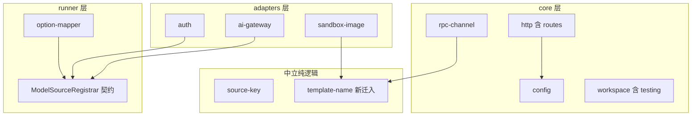
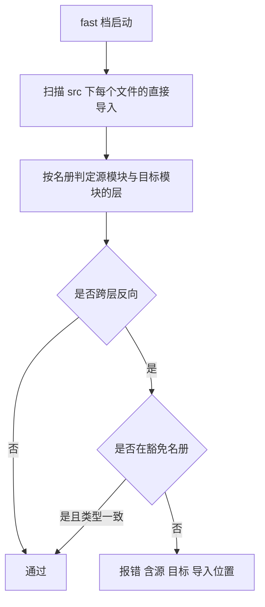
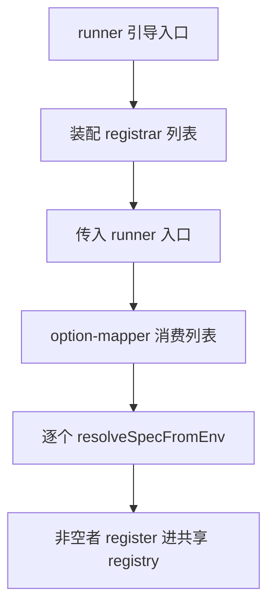
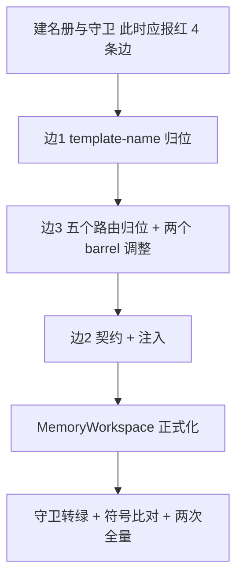

# Design Document — kernel-boundary-decoupling

## Overview

**Purpose**：把 `packages/server` 内部的依赖方向改对，**一个文件都不搬到新包**，
使后续三个提取 spec 的 diff 里「依赖方向的变化」恒为零，从而可被复核。

**Users**：三个提取 spec 的实施者与复核者。

**Impact**：解除 4 条跨层边（brief 写的 3 条 + main 新引入的 1 条），把
`config ↔ http` 的双向依赖收敛为单向，并新增一条**依赖方向守卫**作为
「可以开始搬文件了」的机械判据。运行期行为与对外导出符号集合**完全不变**。

### Goals

- 4 条跨层边全部解除，`src/` 内部依赖方向对 core / runner / adapters 三分已经成立
- `MemoryWorkspace` 成为经 `./testing` 子路径的正式导出
- 依赖方向守卫存在、随快档执行，且在解耦前**报红**（判别力自证）
- 主入口导出符号集合逐字不变；通过面不低于开工快照且连续两次一致

### Non-Goals

- 任何文件移动到**新包**（归后续三个提取 spec）
- `capability → auth` 的纯类型边（编译期擦除，切包后合法）
- 模块的功能性改写、性能优化、命名整理
- 宿主契约 v1 的任何修改

---

## Boundary Commitments

### This Spec Owns

- `src/` 内部的模块依赖方向
- `template-name` 纯逻辑模块的归属位置
- runner 装配期「模型源注册」的契约与注入点
- 5 个配置路由文件的目录归属与其导出所在的 barrel
- `MemoryWorkspace` 的导出面
- 依赖方向守卫及其模块名册

### Out of Boundary

- 跨包文件移动、包骨架、`package.json` 依赖声明
- 被移动模块的**内部实现**（只改位置与导入路径，不改逻辑）
- `capability → auth` 纯类型边
- 宿主契约 v1

### Allowed Dependencies

- 仓内既有模块；`node:` 内建；`@blksails/pi-web-protocol`
- 守卫复用上游 `test-tiering-fast-lane` 的 fast 档与其扫描惯例
- **不引入任何新的 npm 依赖**

### Revalidation Triggers

- 模块名册变更（新增 `src/` 顶层模块目录时必须归类，否则守卫报红）
- `ModelSourceRegistrar` 契约签名变更
- 主入口导出符号集合变更
- `packages/server` 拆包（后续三个 spec 会移动这些模块的物理位置）

---

## Architecture

### Existing Architecture Analysis

实测的 4 条跨层边（详证见 `research.md` §2）：

| 边 | 形态 | 规模 |
|---|---|---|
| `rpc-channel → sandbox-image` | 1 处 import，目标是 120 行纯函数模块（仅 `node:crypto`） | 极小 |
| `runner → auth` | 1 处 import 3 个值，目标 183 行、值导入 pi SDK | 小 |
| `runner → ai-gateway` | 1 处 import 3 个值，目标 201 行（main 新引入） | 小 |
| `config → http` | 5 个**路由文件**住在 `config/` 下，引 `errorResponse`/`jsonResponse` | 中 |

★ 关键观察：`config` 与 `http` 目前是**双向依赖**（`http → config` 本就存在）。

### Architecture Pattern & Boundary Map



**Architecture Integration**：

- **Selected pattern**：三类手法，按边的性质分别选取 —— **归位**（纯逻辑下沉到中立位置）、
  **归位**（路由文件回到路由目录）、**契约 + 注入**（真正的跨层能力依赖）。
  ★ brief 曾对前两条也提「注入」，被实证否定：给纯函数加间接层是纯粹的成本。
- **Dependency direction**：`Neutral ← Core ← {Runner, Adapters}`；`http → config` 单向；
  adapters 实现 runner 定义的契约（**依赖倒置**：具体依赖抽象，而非 runner 依赖具体）。
- **New components rationale**：只新增一个 `ModelSourceRegistrar` 契约。它同时收编两条同源边，
  且第三个 provider 已可预见（main 刚加了第二个）。

### Technology Stack

| Layer | Choice / Version | Role | Notes |
|---|---|---|---|
| 语言 | TypeScript strict（既有） | 契约与守卫 | 禁 `any` |
| 测试 | vitest 2.1.9（既有） | 守卫跑在 fast 档 | 分档惯例见上游 spec |
| 运行时 | Node ≥22.19（既有） | 守卫只读文件 | 仅 `node:fs`/`node:path` |

**不新增任何依赖。**

---

## File Structure Plan

### Directory Structure

```
packages/server/
├── src/
│   ├── source-key.ts                    # 既有:中立纯逻辑先例
│   ├── template-name.ts                 # 迁入(自 sandbox-image/):中立纯命名逻辑
│   ├── rpc-channel/template-resolve.ts   # 改:导入路径指向 ../template-name.js
│   ├── sandbox-image/                    # 改:template-name.ts 迁出,内部引用改路径
│   ├── runner/
│   │   ├── model-source-registrar.ts     # 新增:ModelSourceRegistrar 契约(纯类型)
│   │   ├── option-mapper.ts              # 改:改为消费注入的 registrar 列表
│   │   └── runner.ts                     # 改:接收并透传 registrar 列表
│   ├── auth/egress-model-source.ts       # 改:导出符合契约的 registrar 对象
│   ├── ai-gateway/session-model-source.ts# 改:同上
│   ├── config/                           # 改:5 个 *-routes.ts 迁出;index.ts 去掉其 re-export
│   ├── http/
│   │   ├── routes/{config,mcp-config,source-settings,extensions-config,sandbox-project}-routes.ts  # 迁入
│   │   └── index.ts                      # 改:补上迁入路由的导出
│   └── workspace/testing/memory-workspace.ts  # 迁入(自 test/workspace/fixtures/)
├── runner-bootstrap.mjs                  # 改:装配 registrar 列表并注入
└── test/
    ├── tiering/dependency-guard.test.ts  # 新增:依赖方向守卫(fast 档)
    └── tiering/module-roster.ts          # 新增:core/runner/adapters 模块名册 + 豁免
```

### Modified Files

- `src/rpc-channel/template-resolve.ts` —— 导入路径改指中立模块。
- `src/runner/option-mapper.ts` —— 不再直接 import 两个具体注册器；改为消费注入的契约列表。
- `src/runner/runner.ts` / `runner-bootstrap.mjs` —— 新增注入点，装配具体 registrar。
- `src/auth/egress-model-source.ts` / `src/ai-gateway/session-model-source.ts` ——
  额外导出一个符合契约的 registrar 对象；**既有导出保持不变**（避免破坏其它消费方）。
- `src/config/index.ts` —— 移除 5 个路由的 re-export。
- `src/http/index.ts` —— 补上这 5 个路由的导出（主 barrel 符号集合因此不变）。
- `packages/server/test/workspace/fixtures/memory-workspace.ts` —— 迁往 `src/workspace/testing/`；
  既有测试改为从正式导出面引入。

---

## Requirements Traceability

| Requirement | Summary | Components | Interfaces | Flows |
|---|---|---|---|---|
| 1.1 | 传输抽象不依赖镜像烘焙 | template-name 归位 | `deriveTemplateName` | 归位流 |
| 1.2 | runner 不值依赖凭据模块 | ModelSourceRegistrar + 注入 | 契约 | 注入流 |
| 1.3 | 配置域不依赖 HTTP | 5 路由归位 + barrel 调整 | — | 归位流 |
| 1.4 | 跨层依赖经注入或纯类型 | ModelSourceRegistrar | 契约 | 注入流 |
| 1.5 | 保留 `capability → auth` 纯类型边 | 守卫豁免名册 | 豁免项 | 守卫流 |
| 2.1 | 对外导出表面不变 | http/config 两个 barrel | 主入口符号清单 | 符号比对 |
| 2.2 | 运行期行为不变 | 全部 | — | 回归比对 |
| 2.3 | 通过面不低于快照且两次一致 | 全部 | — | 回归比对 |
| 2.4 | 交付含实测输出 | 验收流程 | — | — |
| 3.1 | 内存 Workspace 正式导出 | workspace/testing | `./testing` 子路径 | — |
| 3.2 | fast 档可用且不写真实 fs | workspace/testing | — | — |
| 3.3 | 通过一致性套件 | workspace/testing | `ConformanceTarget` | — |
| 3.4 | 导出路径可被后续 spec 平移 | workspace/testing | `./testing` 子路径 | — |
| 4.1 | 守卫按三分名册断言无反向依赖 | dependency-guard + roster | `classifyModule()` | 守卫流 |
| 4.2 | 失败报源/目标/位置 | dependency-guard | 错误消息契约 | 守卫流 |
| 4.3 | 随快档自动执行 | dependency-guard 跑在 fast 档 | — | 守卫流 |
| 4.4 | 解耦前报红（判别力） | dependency-guard | — | 守卫流 |
| 4.5 | 名册覆盖每个模块 | module-roster | 覆盖断言 | 守卫流 |
| 5.1 | 不触发契约 v2 | 全部 | — | — |
| 5.2 | 主入口不连带加载 pi SDK | 既有 barrel 约束 | — | — |
| 5.3 | 新增导出为增量 | auth / ai-gateway 的额外导出 | — | — |

---

## Components and Interfaces

| Component | Layer | Intent | Req | Key Deps | Contracts |
|---|---|---|---|---|---|
| `template-name`（迁入顶层） | 中立 | 构建期与运行期共用的命名派生 | 1.1 | `node:crypto` (P0) | Service |
| `ModelSourceRegistrar` | runner | 「把一个 provider 注册进 ModelRegistry」的契约 | 1.2, 1.4, 5.3 | pi SDK 类型 (P0) | Service |
| 5 个配置路由（迁入 `http/routes/`） | core·http | 配置相关 HTTP 端点 | 1.3, 2.1 | config 内部 (P0) | API |
| `workspace/testing/memory-workspace` | core | Workspace 的内存实现 | 3.1–3.4 | 一致性套件 (P0) | Service |
| `module-roster` + `dependency-guard` | 守卫 | 依赖方向的机械判定 | 4.1–4.5, 1.5 | `node:fs` (P0) | Service |

### runner 层

#### ModelSourceRegistrar

| Field | Detail |
|-------|--------|
| Intent | 把「解析 env 得到 spec → 注册进 ModelRegistry」抽成契约，使 runner 不认识具体 provider |
| Requirements | 1.2, 1.4, 5.3 |

**Responsibilities & Constraints**

- 契约由 **runner 层定义**，具体实现住在 adapters（auth / ai-gateway）——
  **依赖倒置**：具体依赖抽象，runner 不反向依赖具体。
- ★ 注入点必须在 **runner 引导入口**，不能只让 `option-mapper` 接参数而由 `runner.ts` 去 import
  那两个模块 —— 那样边只是从一个文件挪到另一个文件，`runner → adapters` 依然成立。
- 具体实现**新增**导出，既有导出一律保留（5.3：增量演进，不破坏既有消费方）。

**Contracts**: Service [x] / API [ ] / Event [ ] / Batch [ ] / State [ ]

##### Service Interface

```typescript
import type { ModelRegistry } from "@earendil-works/pi-coding-agent";

/** 一个模型源的注册器。具体实现住在 adapters 层，由引导入口装配后注入 runner。 */
export interface ModelSourceRegistrar<TSpec = unknown> {
  /** provider 名，用于诊断与来源提示；须与注册进 registry 的名字一致。 */
  readonly providerName: string;
  /** 从环境解析出该源的配置；未配置时返回 undefined（不抛）。 */
  resolveSpecFromEnv(env: NodeJS.ProcessEnv): TSpec | undefined;
  /** 把该源注册进共享 registry。仅在 resolveSpecFromEnv 返回非空时被调用。 */
  register(registry: ModelRegistry, spec: TSpec, log: (msg: string) => void): void;
}
```

- Preconditions：`register` 只在 `resolveSpecFromEnv` 返回非 `undefined` 后调用。
- Postconditions：注册后 `registry` 中出现名为 `providerName` 的 provider。
- Invariants：`resolveSpecFromEnv` 不产生副作用（只读 env）。

**Implementation Notes**

- Integration：`option-mapper` 现有的 `AI_GATEWAY_PROVIDER_NAME` 比较（第 252 行）改为
  查询注入列表里的 `providerName`，避免 runner 硬编码具体 provider 名。
- Validation：it 档已有覆盖 runner 装配的用例；验收须**比对 provider 注册结果**，
  而非仅确认子进程起来了 —— 这类改动的失败形态正是「装配成功但模型不可用」。
- Risks：注入点开错位置会让解耦变成「换个文件写同样的 import」，守卫必须能识破。

### 守卫层

#### module-roster + dependency-guard

| Field | Detail |
|-------|--------|
| Intent | 按 core / runner / adapters 三分名册断言不存在跨层反向依赖 |
| Requirements | 1.5, 4.1–4.5 |

**Contracts**: Service [x] / API [ ] / Event [ ] / Batch [ ] / State [ ]

##### Service Interface

```typescript
export type Layer = "neutral" | "core" | "runner" | "adapters";

/** `src/` 下每个顶层模块目录（与顶层单文件模块）的层归属。 */
export const MODULE_ROSTER: Readonly<Record<string, Layer>>;

/**
 * 显式豁免：允许存在的跨层边。
 * ★ 豁免必须逐条写出理由 —— 一条没有理由的豁免，和一个漏网的违规长得一样。
 */
export const ALLOWED_EDGES: readonly { from: string; to: string; typeOnly: boolean; why: string }[];

export function layerOf(modulePath: string): Layer;
export function isReverseEdge(from: Layer, to: Layer): boolean;
```

- Preconditions：`MODULE_ROSTER` 覆盖 `src/` 下每个模块（4.5，由守卫自身断言）。
- Postconditions：`isReverseEdge` 对 `Neutral ← Core ← {Runner, Adapters}` 序返回一致结果。

**Implementation Notes**

- Integration：守卫跑在 fast 档，只读文件，复用上游 spec 的直接导入扫描惯例
  （**不做传递分析** —— 已被实测证伪，59% 误报）。
- Validation：★ 守卫必须在解耦**之前**报红并列出 4 条边（4.4）。若此时为绿，说明它恒真，
  须当场排查 —— 一个恒真的校验比没有校验更坏。
- Risks：`import type` 与值导入必须区分，否则 `capability → auth` 会被误报（1.5）。

---

## System Flows

### 守卫流



### 注入流



---

## Error Handling

### Error Strategy

守卫类错误快速失败、不降级。解耦类改动的错误一律**保持既有行为** ——
本 spec 不新增任何错误路径，也不改变既有错误的形态。

### Error Categories and Responses

- **跨层反向依赖**：守卫在 fast 档报测试失败，消息含源模块、目标模块、导入所在文件与行号。
- **名册未覆盖**：守卫报出未归类的模块名 —— 新增 `src/` 顶层模块时必须显式归类，
  防止「新模块默认无人管」。
- **注入缺失**：若引导入口未注入任何 registrar，行为应与「两个源都未配置 env」一致
  （既有行为即如此），**不得**变成启动失败。

---

## Testing Strategy

### Unit Tests

1. `layerOf` 对名册中每个模块返回正确层；对未知模块抛错而非静默归类
2. `isReverseEdge` 对 `core → adapters`（反向）返回 true，对 `adapters → core`（正向）返回 false
3. `ModelSourceRegistrar` 的两个实现：`resolveSpecFromEnv` 在 env 未配置时返回 `undefined` 且不抛
4. `option-mapper` 在注入空列表时的行为与「两个源都未配置」一致
5. `MemoryWorkspace` 通过既有 Workspace 一致性套件

### Integration Tests

1. 依赖方向守卫在**解耦前**的代码上报红，并列出 4 条边（判别力自证）
2. 依赖方向守卫在解耦后转绿，且名册覆盖断言成立
3. runner 子进程装配后，共享 registry 中确实出现两个 provider（**比对注册结果**，不只看进程起来）
4. 主入口导出符号集合在改动前后逐字相同

### Performance

1. 守卫全量扫描耗时 < 2 秒（不得吃掉快档 10 秒预算）
2. 全量运行通过面 ≥ 开工快照（fast 190/1840、fast-mock 5/31、it 83/657、e2e 3/3），
   且**连续两次结果一致**

---

## Migration Strategy



- **顺序理由**：守卫先建（红是判别力的证明）；三条边按**改动面从小到大**处理
  （归位 → 归位+barrel → 契约+注入），使每步的回归面单调递增、便于定位。
- **回滚触发**：主入口符号集合出现差异；或通过面低于快照。
- **校验点**：每条边解除后单独跑快档；全部完成后跑两次全量。
