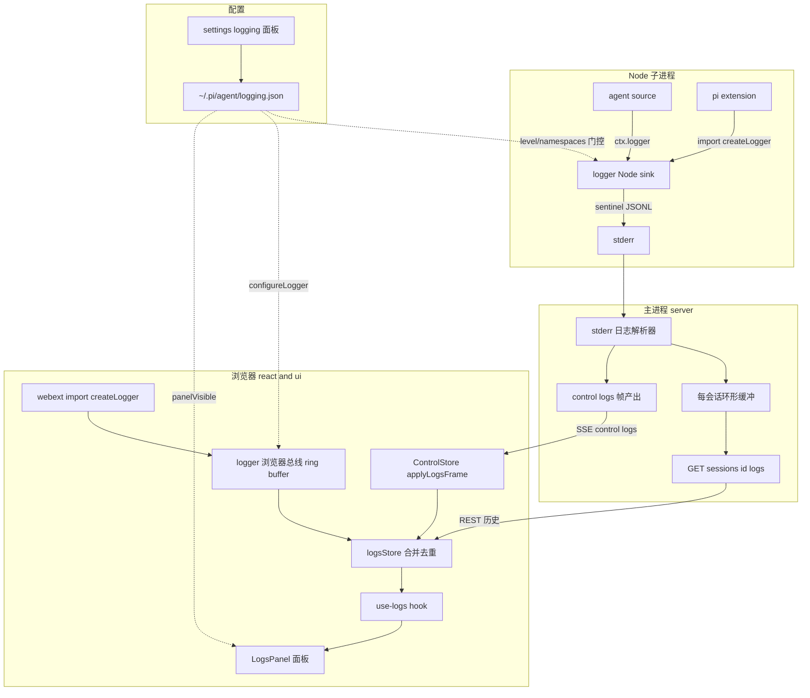
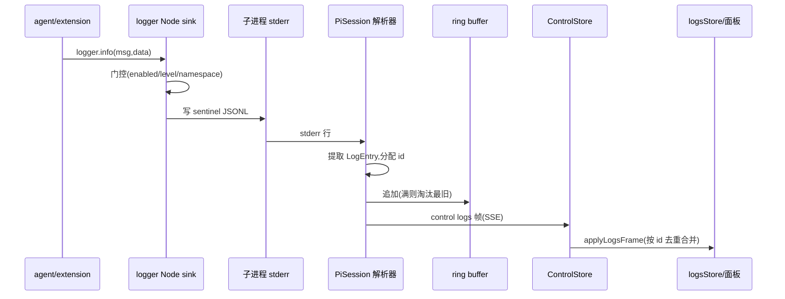
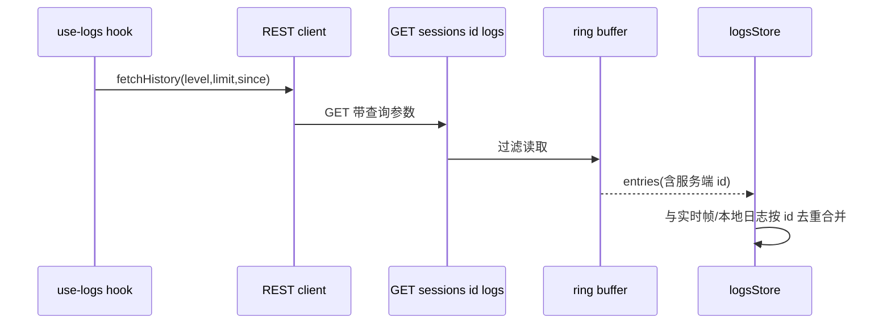

# Design Document — logging-system

## Overview

**Purpose**: 为 pi-web 提供一套统一、跨运行环境的结构化日志能力，让 agent source、pi extension、webext 三类组件通过同一个日志库产出日志，用户在 settings 中配置日志行为，并在会话界面的独立日志面板中实时查看与检索。

**Users**: agent 作者与扩展作者用它排查运行问题；最终用户用面板与配置观察、过滤、留存日志。

**Impact**: 新增一个零依赖同构日志库 `@blksails/pi-web-logger`，并在既有传输（SSE control 帧）、配置（静态 schema 框架）、面板（PiSessionStats 范式）三套既有机制上做薄接入，不引入新的传输/配置框架。Node 端日志走子进程 **stderr**（带 sentinel 标记），主进程解析后经 `control:"logs"` 帧实时推送、并入环形缓冲供 REST 拉取。

### Goals
- 单一日志库 API 被三类组件与内核共用，按运行环境自动分流。
- 日志从 Node 子进程实时汇聚到浏览器面板，且历史可按需拉取。
- 用户可在 settings 配置启用、级别、按命名空间开关、输出目标、面板可见性，并持久化。
- 不破坏既有业务消息流与既有控制帧（`extension-ui/queue/stats/error/ui-rpc`）的可观察行为。

### Non-Goals
- 不修改上游 `@earendil-works/pi-coding-agent`（pi SDK）。
- 不做远程日志上报、跨会话聚合分析、第三方日志后端集成。
- 不改动 agent 业务消息流本身（日志通道与之独立）。

## Boundary Commitments

### This Spec Owns
- 零依赖同构日志库 `@blksails/pi-web-logger`：`createLogger` / `Logger` / `child` / 级别与命名空间门控 / Node 与浏览器双 sink / 浏览器侧 ring buffer 总线。
- 日志数据契约：`LogEntry` 形状、`LogEntrySchema`（wire 校验）、`control:"logs"` SSE 帧、`GET /sessions/:id/logs` REST DTO、`logging` 配置域 schema。
- Node 端 stderr 日志通道的 sentinel 约定与主进程解析、每会话服务端环形缓冲、`control:"logs"` 帧产出。
- 浏览器端 `logsStore`（合并实时帧 + 历史拉取 + 浏览器本地日志，按 id 去重）、`applyLogsFrame`、`use-logs` hook。
- 内核日志面板 `LogsPanel`（过滤/搜索/自动滚动）与其在 PiChat 的挂载区域；新增 `logs` slot key。
- `logging` 配置域的注册与自定义命名空间开关控件；收编内核既有告警/错误钩子（P1）。

### Out of Boundary
- pi SDK 内部日志、其 RPC 协议帧、stdout RPC 通道（只读不改）。
- 业务 `uiMessageChunk` 流、其他既有控制帧的语义。
- 文件日志的远程归集/检索（仅本地文件 + 轮转）。

### Allowed Dependencies
- `@blksails/pi-web-logger`：零运行时依赖（仅 TS 类型 + 标准 JS）。不得 import protocol/react/server/任何 Node 专属模块到浏览器路径。
- `protocol` 可 **type-only** 依赖 `@blksails/pi-web-logger` 的 `LogEntry` 形状以对齐 wire schema（logger 零依赖，无环）。
- 复用既有 `makeControlFrame`、`ConfigCodec`、`zodToFormSchema`、`registerFieldRendererByKey`、SSE 帧管道、PiChat 挂载约定。

### Revalidation Triggers
- `LogEntry` 形状或 `control:"logs"` 帧契约变更 → 前后端与 webext 需重校验。
- Node 日志 sentinel 约定或 stderr 解析规则变更 → runner / 主进程解析需重校验。
- `logging` 配置域字段变更 → 配置路由 + 前端面板需重校验。
- 依赖方向变更（如 logger 引入运行时依赖）→ 浏览器 bundle 边界需重校验。

## Architecture

### Existing Architecture Analysis
- **传输无关 RPC 通道**：子进程 stdout = pi SDK JSONL RPC（`PiRpcProcess.dispatchLine` 按 `type` 分流）；stderr = 主进程收集的诊断通道（runner 自身诊断即走 stderr）。→ 日志走 **stderr**，避开 RPC stdout。
- **SSE 帧枢纽**：`SseFrameSchema` = `uiMessageChunk | control`；`ControlPayloadSchema` 是可追加的 `discriminatedUnion("control")`。→ 新增 `control:"logs"` 分支天然隔离既有帧。
- **配置 UI 框架**：zod `.describe(JSON.stringify(meta))` → `zodToFormSchema` → 静态 FormSchema；自定义控件经 `widget` + renderer 注册；`ConfigCodec` 读写 `~/.pi/agent/{domain}.json`。→ `logging` 域照 `sandbox` 域办。
- **内核面板范式**：`PiSessionStats` + `session-usage-panel`——内核面板挂 PiChat 固定区域 + 开关 prop + `data-pi-*-region` 标记。→ `LogsPanel` 照办。

### Architecture Pattern & Boundary Map



**Architecture Integration**:
- Selected pattern: 同构库 + 单向事件推送（SSE control 帧）+ 旁路 REST 拉取（环形缓冲），与既有 notify/stats 模式对齐。
- 边界分离：库（数据产出）/ protocol（契约）/ server（汇聚+传输）/ react（聚合+去重）/ ui（呈现）/ config（门控），各层单一职责。
- 既有模式保留：SSE 帧、ConfigCodec、zodToFormSchema、PiChat 面板挂载、stats 拉取。
- 新组件理由：logger（跨环境产出接缝）、ring buffer（历史拉取需服务端留存）、logsStore（实时+历史+本地三源合并去重）。

### Technology Stack

| Layer | Choice / Version | Role in Feature | Notes |
|-------|------------------|-----------------|-------|
| 日志库 | 新建 `@blksails/pi-web-logger`（TS strict，零运行时依赖） | 同构 createLogger / sink / 浏览器总线 | 不得引入 Node 专属 import 到浏览器路径 |
| 契约 | `protocol`（zod） | LogEntry/帧/配置域/REST DTO | type-only 依赖 logger 形状 |
| 后端 | `server`（Node 22+） | stderr 解析 + ring buffer + 帧产出 + REST + 配置注册 | 复用 PiRpcProcess stderr 管道 |
| 前端状态 | `react`（AI SDK v5） | logsStore + applyLogsFrame + use-logs | 复用 ControlStore |
| UI | `ui`（shadcn/Radix/Tailwind） | LogsPanel + 命名空间开关控件 | 复用 PiSessionStats 范式 |
| 注入面 | `agent-kit` / `web-kit` | AgentContext.logger / host-context logger | type 接缝 |

**依赖方向（左→右，禁反向 import）**：
`@blksails/pi-web-logger` → `protocol` → `agent-kit` / `web-kit` → `server` / `react` → `ui` → `app`（含 `lib/settings`）。

## File Structure Plan

### 新建：日志库 `packages/logger`
```
packages/logger/
├── package.json            # name @blksails/pi-web-logger，零运行时依赖，exports 双入口
├── tsconfig.json
└── src/
    ├── index.ts            # 公共导出:createLogger/Logger/LogEntry/LogLevel/配置/浏览器总线
    ├── types.ts            # LogLevel、LogEntry、Logger、LoggerRuntimeConfig
    ├── level.ts            # 级别序与比较(debug<info<warn<error)、命名空间匹配(前缀含子)
    ├── create-logger.ts    # createLogger + child + 门控(enabled/level/namespace)
    ├── sink.ts             # Sink 接口 + 按 typeof window 选择 sink
    ├── node-sink.ts        # stderr sentinel 写入(单行 JSON,前缀 LOG_SENTINEL)
    ├── browser-sink.ts     # 模块级浏览器总线:ring buffer + subscribe/emit
    ├── config.ts           # configureLogger(运行时设 enabled/level/namespaces) + 从 env 读 Node 配置
    └── __tests__/          # 单测:门控/child/级别/sink 选择/浏览器总线/产物无 node 引用
```

### 新建：protocol 日志契约
- `packages/protocol/src/logging/log-entry.ts` — `LogLevelSchema`、`LogEntrySchema`(zod)、`LOG_SENTINEL` 常量、`parseLogLine(line)→LogEntry|null`；type-only 复用 logger 的 `LogEntry`。
- `packages/protocol/src/logging/index.ts` — barrel。
- `packages/protocol/src/config/domains/logging.ts` — `loggingConfigSchema` + `loggingFormSchema` + `LOGGING_GROUPS`。

### 修改：protocol
- `packages/protocol/src/transport/sse-frame.ts` — `ControlPayloadSchema` 追加 `control:"logs"` 分支(`entries: LogEntry[]`)。
- `packages/protocol/src/transport/rest-dto.ts` — `GetLogsResponseSchema`(`{ entries: LogEntry[] }`) + 查询参数类型。
- `packages/protocol/src/config/index.ts` — 导出 logging 域；`ConfigDomainId` 加 `"logging"`；`CONFIG_FORM_SCHEMAS` 加 `logging`。
- `packages/protocol/src/index.ts` — 导出 `logging` barrel。

### 修改：注入面
- `packages/agent-kit/src/types.ts` — `AgentContext.logger?: Logger`（type-only 从 logger 引入）。
- `packages/web-kit/src/host-context.ts` — host context 增 `logger: Logger`。

### 新建 + 修改：server
- `packages/server/src/logging/log-ring-buffer.ts`(新) — 每会话定容环形缓冲 + 单调 id 分配 + 过滤(level/limit/since)。
- `packages/server/src/logging/stderr-log-parser.ts`(新) — stderr 行缓冲;sentinel 行→`LogEntry`;(P1)非 sentinel 行→`proc:stderr` 原始日志。
- `packages/server/src/session/pi-session.ts`(改) — 订阅子进程 stderr→解析器→ring buffer + `makeControlFrame({control:"logs",entries})` 经既有帧 emitter 推送。
- `packages/server/src/http/routes/query-routes.ts`(改) — `GET /sessions/:id/logs` 读 ring buffer。
- `packages/server/src/http/create-handler.ts`(改) — 注册 logs 路由。
- `packages/server/src/config/config-routes.ts`(改) — `DOMAIN_SCHEMAS` 加 `logging`。
- (P1 收编) `packages/server/src/completion/registry.ts`、`packages/server/src/attachment-bridge/temp-files.ts` — `onWarn/onError` 改走 logger(`core:completion`/`core:attachment`)。

### 新建 + 修改：react
- `packages/react/src/logging/logs-store.ts`(新) — 订阅浏览器总线 + `applyFrame` + 历史合并 + 按 id 去重 + 过滤派生。
- `packages/react/src/hooks/use-logs.ts`(新) — 暴露过滤后日志 + `fetchHistory` + 过滤器状态。
- `packages/react/src/sse/control-store.ts`(改) — `applyLogsFrame`。
- `packages/react/src/sse/connection.ts`(改) — 路由 `control:"logs"`→controlStore；(P1)`onError`→logger(`core:sse`)。
- `packages/react/src/client/*`(改) — REST 客户端增 `getLogs(sessionId, query)`。

### 新建 + 修改：ui / app
- `packages/ui/src/logs/logs-panel.tsx`(新) — LogsPanel:级别下拉/命名空间过滤/搜索框/自动滚动;`data-pi-logs-region` + 行 `data-pi-log-*`。
- `packages/ui/src/chat/pi-chat.tsx`(改) — 挂载 LogsPanel 区域(`showLogs` prop,受 `logging.outputs.panelVisible` 调控) + 渲染 `logs` slot 贡献。
- `packages/ui/src/config/fields/namespace-toggles-field.tsx`(新) — `logNamespaceToggles` widget 自定义渲染器。
- `lib/settings/register-panels.ts`(改) — 注册 logging 面板 + `registerFieldRendererByKey("logNamespaceToggles", ...)`。
- `packages/protocol/src/web-ext/descriptor.ts`(改) — `SlotKeySchema` 追加 `"logs"`；`packages/web-kit/src/slots.ts`(改) — `SLOTS.logs`。
- app 侧 provider(改) — 加载 `/config/logging` 后调 `configureLogger(...)` 应用到浏览器总线。

### 新建：示例 + e2e
- `examples/logging-demo-agent/index.ts` — agent 用 `ctx.logger` 打各级别日志。
- `examples/logging-demo-agent/.pi/extensions/log-probe.ts` — 扩展直接 `import { createLogger }` 打日志(验证方案 b)。
- `examples/logging-demo-agent/.pi/web/web.config.tsx`(可选) — webext 打浏览器日志。
- `e2e/browser/logging-system.e2e.ts` — 端到端;各包 `__tests__`/`test` 单测。

## System Flows

### 实时日志推送（Node→面板）

门控分两道：库内早过滤（省传输）；服务端入 ring buffer/产帧前再尊重配置（权威）。

### 历史拉取与去重合并（重连/大日志量）


## Requirements Traceability

| Requirement | Summary | Components | Interfaces | Flows |
|-------------|---------|------------|------------|-------|
| 1.1–1.3 | createLogger/child/结构化条目 | logger create-logger/types | `createLogger`/`Logger` | — |
| 1.4 | Node 写通道 | logger node-sink | stderr sentinel JSONL | 实时推送 |
| 1.5 | 浏览器写总线 | logger browser-sink | 浏览器总线 subscribe | 历史合并 |
| 1.6 | 浏览器无 node 引用 | logger sink 选择 + 构建 | `typeof window` | — |
| 1.7 | 级别门控丢弃 | logger level/create-logger | 门控 | — |
| 2.1–2.2 | agent ctx.logger | agent-kit types / runner 注入 | `AgentContext.logger` | 实时推送 |
| 2.3–2.4 | 扩展直接 import | logger 公共 API | `createLogger` | 实时推送 |
| 2.5 | 与 RPC 区分 | server stderr-log-parser | sentinel 约定 | 实时推送 |
| 3.1–3.3 | 实时帧推送/独立 | sse-frame / pi-session / control-store | `control:"logs"` | 实时推送 |
| 3.4 | 浏览器 ring buffer | logger browser-sink / logsStore | 定容淘汰 | — |
| 4.1–4.4 | 服务端留存 + REST 过滤 | log-ring-buffer / query-routes / rest-dto | `GET /sessions/:id/logs` | 历史拉取 |
| 4.5 | 合并不重复 | logsStore | 按 id 去重 | 历史拉取 |
| 5.1–5.6 | 日志面板 | LogsPanel / pi-chat / use-logs | `data-pi-logs-region` | — |
| 6.1–6.7 | 配置域 + 门控 | domains/logging / config-routes / register-panels / namespace-toggles-field | `loggingConfigSchema` | — |
| 7.1–7.4 | 文件输出轮转 | logger node-sink 文件目标 | `outputs.file` | — |
| 8.1–8.3 | 收编内核钩子 | registry / temp-files / connection | logger 命名空间 | 实时推送 |
| 9.1 | 不破坏既有帧 | sse-frame discriminatedUnion | — | — |
| 9.2 | 内存/传输受限 | ring buffer + 级别门控 | 定容 | 两流 |
| 9.3–9.4 | 端到端 + 隔离构建 | e2e/logging-system | NEXT_DIST_DIR=.next-e2e | 两流 |

## Components and Interfaces

| Component | Layer | Intent | Req | Key Deps | Contracts |
|-----------|-------|--------|-----|----------|-----------|
| `@blksails/pi-web-logger` | lib | 同构日志产出 + 浏览器总线 | 1, 2.3 | — | Service, State |
| LogEntry 契约 | protocol | wire 形状/帧/REST DTO/sentinel | 3, 4, 1.4 | logger(type) | Event, API |
| logging 配置域 | protocol/server/ui | 配置 schema + 持久化 + 门控 | 6 | ConfigCodec | API, State |
| 服务端汇聚 | server | stderr 解析 + ring buffer + 帧 | 2.5, 3, 4 | PiRpcProcess | Service, Event |
| logsStore | react | 三源合并去重 + 过滤 | 3.2, 4.5, 5 | ControlStore | State |
| LogsPanel | ui | 过滤/搜索/自动滚动呈现 | 5 | use-logs | State |

### 库层

#### `@blksails/pi-web-logger`
| Field | Detail |
|-------|--------|
| Intent | 同构日志库:createLogger + 门控 + Node/浏览器双 sink + 浏览器总线 |
| Requirements | 1.1, 1.2, 1.3, 1.4, 1.5, 1.6, 1.7, 2.3, 3.4 |

**Responsibilities & Constraints**
- 唯一对外 API 面;按 `typeof window` 选 sink;级别与命名空间门控;`child` 命名空间拼接。
- **零运行时依赖**;浏览器路径零 Node 模块引用(1.6 不变量)。
- 浏览器 sink 拥有模块级 ring buffer(定容,1.5/3.4),对外 `subscribeBrowserLogs`/`getBrowserLogs`。

**Dependencies**: 无(最底层)。

**Contracts**: Service [x] / State [x]

##### Service Interface
```typescript
export type LogLevel = "debug" | "info" | "warn" | "error";

export interface LogEntry {
  id?: string;            // 服务端入库时分配(单调 seq);浏览器本地日志为本地 id
  level: LogLevel;
  ns: string;             // 命名空间,如 "agent:hello"
  msg: string;
  data?: unknown;         // 可结构化
  ts: number;             // epoch ms
}

export interface Logger {
  debug(msg: string, data?: unknown): void;
  info(msg: string, data?: unknown): void;
  warn(msg: string, data?: unknown): void;
  error(msg: string, data?: unknown): void;
  child(ns: string): Logger;
}

export interface LoggerRuntimeConfig {
  enabled: boolean;
  level: LogLevel;
  namespaces?: Record<string, boolean>;  // 命名空间→开关(缺省视为开)
}

export function createLogger(opts: { namespace: string; level?: LogLevel }): Logger;
export function configureLogger(partial: Partial<LoggerRuntimeConfig>): void;

// 浏览器总线(浏览器构建可用)
export function subscribeBrowserLogs(cb: (e: LogEntry) => void): () => void;
export function getBrowserLogs(): readonly LogEntry[];
```
- Preconditions: `namespace` 非空。
- Postconditions: 低于当前 level 或命名空间关闭的日志被丢弃且不产出(1.7/6.5)。
- Invariants: 浏览器产物无 node 模块引用;Node sink 仅写 stderr。

**Implementation Notes**
- Integration: Node sink 写 `LOG_SENTINEL + JSON.stringify(entry) + "\n"` 到 `process.stderr`;级别从 env(`PI_WEB_LOG_*`)初始化,可被 `configureLogger` 覆盖。浏览器 sink 推入总线并 emit。
- Validation: 单测覆盖门控真值表、child 拼接、sink 选择、总线定容淘汰、构建产物扫描无 `node:`。
- Risks: stderr 噪声(R1)由服务端解析器隔离;bundle 泄漏(R2)由 sink 动态选择 + 构建断言防护。

### 契约层

#### LogEntry / control:"logs" / REST DTO（protocol）
**Contracts**: Event [x] / API [x]

##### Event Contract
- Published: `control:"logs"` 帧 `{ control:"logs", entries: LogEntry[] }`，经既有 `makeControlFrame` 包装、既有 SSE 管道传输。
- Ordering: 按产出顺序追加;服务端分配单调 `id` 保证去重稳定。
- 隔离: discriminatedUnion 追加分支,不改既有 `extension-ui/queue/stats/error/ui-rpc`(9.1)。

##### API Contract
| Method | Endpoint | Request | Response | Errors |
|--------|----------|---------|----------|--------|
| GET | /sessions/:id/logs?level=&limit=&since= | 查询参数 | `{ entries: LogEntry[] }` | 404(会话不存在) |

- `LOG_SENTINEL`：稀有不可见前缀(如 `"PILOG"`)，`parseLogLine` 仅对带前缀行 `JSON.parse` 并按 `LogEntrySchema` 校验，失败返回 null。

### 服务端汇聚

#### 服务端日志汇聚（server）
| Field | Detail |
|-------|--------|
| Intent | 解析子进程 stderr 日志、留存环形缓冲、产出实时帧、提供 REST |
| Requirements | 2.5, 3.1, 3.3, 4.1, 4.2, 4.3, 4.4, 9.2 |

**Responsibilities & Constraints**
- 在既有 `subscribeStderr` 上挂行缓冲解析器;sentinel 行→`LogEntry`,分配单调 `id`。
- 每会话定容 ring buffer(默认上限,如 2000 条),满则淘汰最旧(4.4/9.2)。
- 入库后经既有帧 emitter 产 `control:"logs"` 帧(可短窗批量合并 entries)。
- 服务端权威门控:产帧/入库前再尊重 logging 配置(enabled/level/namespace)。

**Dependencies**
- Inbound: PiRpcProcess.subscribeStderr — 原始 stderr(P0)
- Outbound: SSE 帧 emitter — 推送(P0);query-routes — 暴露历史(P0)
- External: 无

**Contracts**: Service [x] / API [x] / Event [x]

##### Service Interface
```typescript
interface SessionLogPipeline {
  ingestStderrChunk(chunk: string): void;         // 行缓冲 + sentinel 解析 + 入库 + 产帧
  getLogs(query: { level?: LogLevel; limit?: number; since?: number }): LogEntry[];
}
```
- Preconditions: 已 spawn 子进程并订阅 stderr。
- Postconditions: sentinel 行成为有 id 的 LogEntry;非 sentinel 行 P0 忽略(P1 包装 `proc:stderr`)。
- Invariants: 不消费/不改写 stdout RPC;ring buffer 不超上限。

**Implementation Notes**
- Integration: 在 `pi-session.ts` 装配,复用既有 stderr 订阅与帧 emitter;路由在 `query-routes.ts`/`create-handler.ts` 注册。
- Validation: 对真实子进程的集成测试(打日志→ring buffer→帧);REST 过滤单测。
- Risks: 批量窗口过大致面板延迟→窗口取小(如 50ms)或即时单帧。

### 前端聚合与呈现

#### logsStore + use-logs（react）
**Contracts**: State [x]
- 三源:浏览器总线(本地 webext 日志)、`applyLogsFrame`(实时 Node 日志)、`fetchHistory`(REST 历史)。按 `id` 去重合并(无 id 的本地日志用本地 id)。
- 派生过滤:level≥所选、命名空间前缀匹配(含子)、消息文本包含(5.3/5.4/5.5)。
- `use-logs` 暴露 `{ entries, filters, setFilters, fetchHistory, autoscroll }`。

#### LogsPanel（ui，summary-only + 实现注记）
- 呈现 `use-logs` 结果;级别下拉、命名空间过滤、搜索框、自动滚动(到底则跟随,上滚则暂停,5.6)。
- `data-pi-logs-region` 容器 + 每行 `data-pi-log-level`/`data-pi-log-ns`(供 e2e 断言)。
- 挂载于 PiChat,受 `showLogs` 且 `logging.outputs.panelVisible` 调控;同区域渲染 `logs` slot 的 webext 贡献。

### 配置

#### logging 配置域（protocol/server/ui）
**Contracts**: API [x] / State [x]
- `loggingConfigSchema`(zod,`passthrough()`):`enabled`、`level`、`namespaces: record(boolean)`(widget `logNamespaceToggles`)、`outputs:{ console:bool, file:{ enabled, path, maxSizeMb, maxFiles }, panelVisible:bool }`、`panelDefaultLevel`。
- 经通用 `/config/logging` + `ConfigCodec` 持久化 `~/.pi/agent/logging.json`,深合并保留未知字段(6.3)。
- 自定义控件 `namespace-toggles-field.tsx` 渲染 per-namespace 开关(6.7)。
- 生效:Node 端经 env/重启或下次 spawn 读取;浏览器经 `configureLogger`;面板可见性即时读配置。

## Data Models

### LogEntry（核心数据契约）
- `{ id?, level, ns, msg, data?, ts }`;`id` 由服务端入库单调分配(去重键);浏览器本地日志用本地自增 id。
- `LogEntrySchema`(zod) 校验 wire(帧 entries 与 REST response);`data` 为 `z.unknown()`。

### logging 配置（持久化）
- 文件 `~/.pi/agent/logging.json`;形状即 `loggingConfigSchema`;`namespaces` 为开关字典(缺省开)。

## Error Handling

### Error Strategy
- **日志产出失败**:任何 sink 写入异常(含文件写失败 7.4)必须吞错、不抛、不影响 agent 会话(graceful degradation)。
- **解析失败**:非 sentinel / 非法 JSON 的 stderr 行 → `parseLogLine` 返回 null,P0 丢弃(不崩解析器)。
- **REST 会话不存在**:返回 404,不抛。
- **配置非法**:`/config` PUT 经 zod 校验拒绝并返回字段级错误(复用既有配置路由)。

### Monitoring
- 日志系统自身的内部错误用 `console.error` 兜底(避免自递归),不进日志面板。

## Testing Strategy

### Unit Tests
1. logger 门控真值表:enabled/level/namespace 组合下产出与丢弃(1.7, 6.4, 6.5)。
2. logger `child` 命名空间拼接与配置继承(1.3)。
3. sink 选择:`typeof window` 下 Node/浏览器分流;浏览器总线定容淘汰(1.5, 3.4)。
4. `parseLogLine`:sentinel 行解析成功、非 sentinel/非法行返回 null(2.5)。
5. ring buffer:容量淘汰、`level/limit/since` 过滤(4.3, 4.4)。
6. logsStore:三源按 id 去重合并、过滤派生(4.5, 5.3–5.5)。
7. `loggingConfigSchema` ↔ `zodToFormSchema`:字段/分组/widget 元数据正确(6.2, 6.7)。

### Integration Tests
1. 对真实子进程:agent 打日志→stderr→解析→ring buffer→`control:"logs"` 帧(2.2, 3.1)。
2. 扩展直接 import logger 打日志→同通道汇聚(2.3, 2.4)。
3. `GET /sessions/:id/logs` 过滤返回(4.2, 4.3)。
4. 既有控制帧回归:notify/stats/queue/ui-rpc 行为不变(9.1)。
5. logging 配置 PUT/GET 往返 + 未知字段保留(6.3)。

### E2E Tests（隔离构建 NEXT_DIST_DIR=.next-e2e + external server）
1. 选 `logging-demo-agent` → prompt → agent/扩展日志出现在 `data-pi-logs-region`,带级别与命名空间(2, 3, 5)。
2. 面板过滤:切级别只显示≥级别;命名空间过滤;搜索文本过滤(5.3–5.5)。
3. settings 调整日志级别/命名空间开关并保存 → 后续日志按新配置产出/隐藏(6.4, 6.5, 6.6)。
4. 自动滚动:新日志到底跟随;上滚暂停(5.6)。

### Performance
1. 高频日志(如千条/会话)下面板保持响应、内存受 ring buffer 限(9.2)。
2. 大日志量时实时帧不阻塞业务 `uiMessageChunk` 流。

## Performance & Scalability
- 服务端与浏览器双 ring buffer 定容(默认 2000 条上限,可后续配置化),级别门控在库内早过滤减少传输。
- 实时帧可短窗(≤50ms)批量合并 entries 降低帧频;历史走 REST 拉取避免 SSE 爆量(对齐 stats 模式)。
