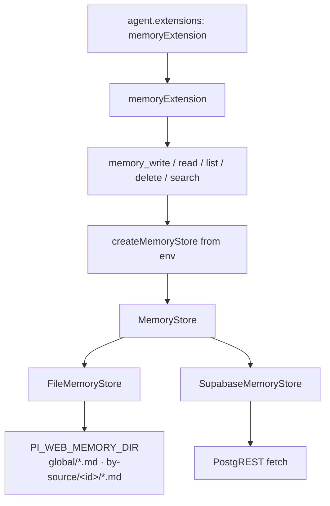

# Technical Design Document — memory-extension

## Overview

**Purpose**: 为 agent 提供可插拔的长期记忆：`MemoryStore` 端口 + **file**（skills-like `.md`）与 **supabase** 两后端 + 进程内 `memoryExtension` 工具表面 + `examples/memory-agent`。

**Users**: agent 作者经 `extensions: [memoryExtension]` 获得记忆工具；运维经 env 选择本地文件或 Supabase。

**Impact**: 新增 `packages/tool-kit/src/memory/**`（经 `./runtime` 导出）；不改 session-engine / attachment / protocol 契约。

### Goals
- Skills-like 文档模型：frontmatter 元数据 + Markdown 正文。
- 端口-适配器：file / supabase 行为一致。
- 默认 **global** 跨 agent source；可选 **agent-source** 隔离。
- 精确 name + 关键词/tags 检索（无向量）。
- Extension 工具 + 示例 agent + 契约测试。

### Non-Goals
- 语义/向量检索、自动记忆抽取、记忆 UI 面板、REST API、配额/TTL、多后端 union。

## Boundary Commitments

### This Spec Owns
- `MemoryEntry` / `MemoryStore` 契约与错误码。
- frontmatter 编解码；file / supabase adapter。
- env 配置工厂；`memoryExtension` 与五个工具。
- `examples/memory-agent`；契约测试套件。

### Out of Boundary
- Session 持久化、attachment、skills 发现与加载。
- 强制注入每个会话（opt-in via agent.extensions）。
- 租户级 RLS 策略细节（Supabase 侧由运维配置；本设计仅用 service/API key 访问表）。

### Allowed Dependencies
- Node 内置：`node:fs/promises`、`node:path`、`node:os`、`node:crypto`。
- 既有：`zod`（可选配置）、`@earendil-works/pi-ai` Type、`@earendil-works/pi-coding-agent` ExtensionAPI。
- Supabase：经 **PostgREST `fetch`**，**不**新增 `@supabase/supabase-js` 运行时依赖。
- 依赖方向：tool-kit runtime only；不反向依赖 server。

### Revalidation Triggers
- `MemoryStore` 方法签名变更 → 两 adapter + 工具 + 契约测试。
- frontmatter 字段变更 → file 往返 + supabase 列映射。
- env 名变更 → 文档与 spawn 说明。

## Architecture

### Pattern

**Ports & Adapters** + **ExtensionFactory**（对齐 aigc / vision / session-store）。



### Technology Stack

| Layer | Choice | Role |
|-------|--------|------|
| Tools | ExtensionFactory + Type.Object | agent 可调用表面 |
| Port | `MemoryStore` | 后端无关 |
| Local | fs + frontmatter | skills-like 文档 |
| Cloud | Supabase PostgREST | 表行存储 |
| Config | env | `PI_WEB_MEMORY_*` |

## File Structure Plan

```
packages/tool-kit/src/memory/
├── types.ts              # MemoryEntry, scope, store 端口, 错误码
├── frontmatter.ts        # YAML frontmatter 编解码（最小实现，无新依赖）
├── name.ts               # name slug 校验 / 规范化
├── file-store.ts         # FileMemoryStore
├── supabase-store.ts     # SupabaseMemoryStore（fetch PostgREST）
├── config.ts             # memoryConfigFromEnv + createMemoryStore
├── ops.ts                # 纯业务：可见性过滤、search 匹配
├── tools/
│   └── register.ts       # 五个工具注册
├── extension.ts          # memoryExtension
└── index.ts

packages/tool-kit/test/memory/
├── frontmatter.test.ts
├── name.test.ts
├── contract.ts           # runMemoryStoreContract(makeStore)
├── file-store.test.ts
├── supabase-store.test.ts  # mock fetch
└── extension.test.ts

examples/memory-agent/
├── index.ts
├── package.json
└── README.md
```

### Modified
- `packages/tool-kit/src/runtime.ts` — 导出 memory API。

## Data Model

### MemoryEntry

```ts
export type MemoryScope = "global" | "agent-source";

export interface MemoryEntry {
  readonly name: string;           // slug: [a-z0-9][a-z0-9_-]*
  readonly description?: string;
  readonly tags: readonly string[];
  readonly scope: MemoryScope;
  readonly agentSourceId?: string; // required when scope=agent-source
  readonly content: string;        // markdown body
  readonly createdAt: string;      // ISO
  readonly updatedAt: string;      // ISO
}

export interface MemoryEntryMeta {
  readonly name: string;
  readonly description?: string;
  readonly tags: readonly string[];
  readonly scope: MemoryScope;
  readonly agentSourceId?: string;
  readonly updatedAt: string;
}
```

### File layout（skills-like）

```
$PI_WEB_MEMORY_DIR/          # default: ~/.pi/agent/memory
  global/
    user-prefs.md
  by-source/
    hello-agent/
      project-notes.md
```

**文件内容示例**:

```markdown
---
name: user-prefs
description: 用户偏好简洁中文
tags:
  - prefs
  - style
scope: global
createdAt: 2026-07-16T08:00:00.000Z
updatedAt: 2026-07-16T08:00:00.000Z
---

请用简洁中文回复；代码注释用英文。
```

`name` 与文件名（去 `.md`）一致；写入时以 frontmatter `name` 为准并校验。

### Supabase schema（运维建表 SQL，本模块不自动 migrate）

```sql
create table if not exists pi_web_memories (
  name text not null,
  description text,
  content text not null default '',
  tags text[] not null default '{}',
  scope text not null check (scope in ('global', 'agent-source')),
  -- global 作用域固定为 ''，保证 (name, scope, agent_source_id) 可作为主键
  agent_source_id text not null default '',
  created_at timestamptz not null default now(),
  updated_at timestamptz not null default now(),
  primary key (name, scope, agent_source_id)
);
create index if not exists pi_web_memories_tags_gin on pi_web_memories using gin (tags);
```

行映射与 `MemoryEntry` 一一对应。默认表名 `pi_web_memories`，可用 env 覆盖。

## Components and Interfaces

### MemoryStore

```ts
export interface MemoryWriteInput {
  name: string;
  content: string;
  description?: string;
  tags?: readonly string[];
  scope?: MemoryScope;           // default global
  agentSourceId?: string;        // required if scope=agent-source
}

export interface MemoryVisibility {
  /** 当前调用方的 agent source；缺省则仅见 global */
  agentSourceId?: string;
}

export interface MemoryListFilter extends MemoryVisibility {
  tags?: readonly string[];      // 条目须包含全部给定 tags
  scope?: MemoryScope;           // 仅该 scope
}

export interface MemoryStore {
  get(name: string, vis?: MemoryVisibility): Promise<MemoryEntry | undefined>;
  put(input: MemoryWriteInput): Promise<MemoryEntry>;
  delete(name: string, vis?: MemoryVisibility & { scope?: MemoryScope }): Promise<boolean>;
  list(filter?: MemoryListFilter): Promise<MemoryEntryMeta[]>;
  search(query: string, filter?: MemoryListFilter): Promise<MemoryEntryMeta[]>;
}
```

**可见性规则**:
- `global`：始终对任意调用方可见。
- `agent-source`：仅当 `vis.agentSourceId === entry.agentSourceId` 时可见。
- `get`：优先查 global 同名，再查当前 agent-source 同名（若提供 id）。
- `delete`：默认删可见范围内的匹配项（先 agent-source 再 global 若均匹配则按 scope 参数；无 scope 时优先删 agent-source 再 global）。

### frontmatter

- 最小 YAML 子集：`key: value`、`key: [a, b]`、多行 `tags:` 列表、字符串不强制引号。
- 不引入 `yaml` 依赖；单测覆盖往返。

### name 规则

- 规范化：trim、小写、空格→`-`。
- 合法：`/^[a-z0-9][a-z0-9_-]{0,127}$/`。
- 非法 → 工具返回 `INVALID_NAME`。

### config

| Env | Default | Meaning |
|-----|---------|---------|
| `PI_WEB_MEMORY_BACKEND` | `file` | `file` \| `supabase` |
| `PI_WEB_MEMORY_DIR` | `~/.pi/agent/memory` | 文件根目录 |
| `PI_WEB_MEMORY_SUPABASE_URL` | — | Supabase project URL |
| `PI_WEB_MEMORY_SUPABASE_KEY` | — | service role 或具备表权限的 key |
| `PI_WEB_MEMORY_SUPABASE_TABLE` | `pi_web_memories` | 表名 |
| `PI_WEB_MEMORY_AGENT_SOURCE_ID` | — | 默认 agent-source 标识（工具未传时） |

### Tools（register.ts）

| Tool | Params | Behavior |
|------|--------|----------|
| `memory_write` | name, content, description?, tags?, scope? | upsert |
| `memory_read` | name | get full entry |
| `memory_list` | tags?, scope? | list meta |
| `memory_delete` | name, scope? | delete |
| `memory_search` | query, tags?, scope? | keyword search |

全部经 `createMemoryStore()`；`agentSourceId` 来自参数或 `PI_WEB_MEMORY_AGENT_SOURCE_ID`。

返回：`{ ok: true, ... } | { ok: false, code, message }`，`content` 文本为 JSON。

### Error codes

| code | meaning |
|------|---------|
| `INVALID_NAME` | name 非法 |
| `NOT_FOUND` | 不可见或不存在 |
| `INVALID_SCOPE` | agent-source 缺 id |
| `BACKEND_CONFIG` | 装配配置错误 |
| `IO_ERROR` | 读写失败 |
| `REMOTE_ERROR` | Supabase HTTP 失败 |

## Testing

- 单元：frontmatter 往返、name 规范化。
- 契约：`runMemoryStoreContract` 对 FileMemoryStore + mock Supabase。
- 扩展：mock ExtensionAPI 断言五工具注册；write→read 集成。
- e2e（`e2e/node/memory-extension.e2e.test.ts`）：真实 runner spawn + `examples/memory-agent` + mock LLM tool_calls（`memory_write`→`memory_read`）+ 临时 `PI_WEB_MEMORY_DIR`；断言工具 details 正文往返 + 磁盘 `global/<name>.md` skills-like 落盘。

## Requirements Traceability

| Req | Design |
|-----|--------|
| 1.x skills-like | frontmatter + file layout |
| 2.x backends | config + file/supabase adapters |
| 3.x scope | MemoryScope + visibility rules |
| 4.x search | get/list/search ops |
| 5.x tools | extension + register |
| 6.x tests | contract + unit |
