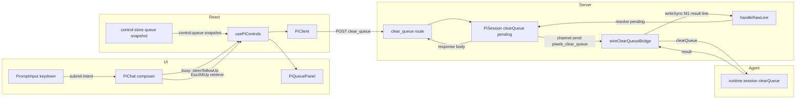
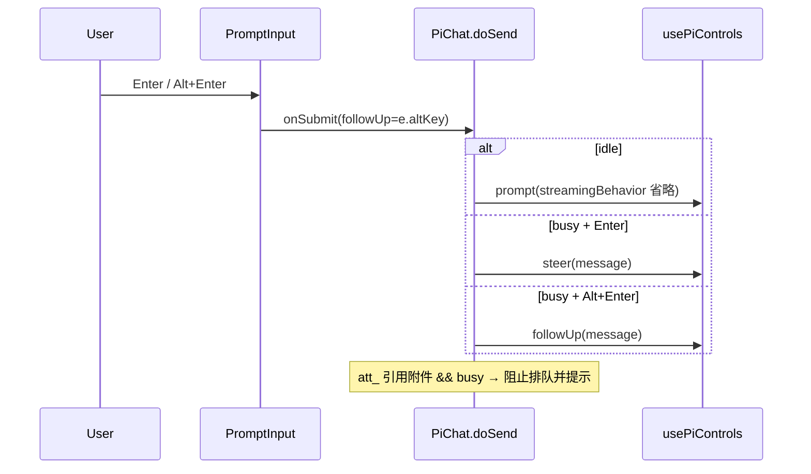
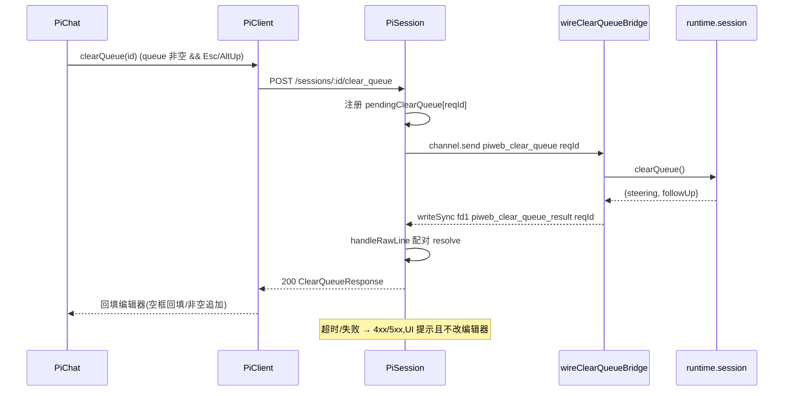

# Design Document

## Overview

**Purpose**：把 pi coding agent 的 message queue 能力（忙时排队 + 取回）完整接线到 pi-web，交付给终端用户「忙时 Enter 插话（steering）/ Alt+Enter 跟进（follow-up）、可视化待投递队列与 pending 计数、Esc/Alt+Up 取回未投递消息到编辑器」的交互，对齐 pi 原生 TUI。

**Users**：pi-web 会话用户在 agent 处理长任务期间继续输入而不必等待或触发底层报错；pi-web 维护者获得一条与既有桥接一致、pi 上游零改动的 `clearQueue` 端点。

**Impact**：`packages/ui` 从「忙时提交静默走 prompt → pi SDK 报错、队列快照无渲染」变为「按投递意图排队 + 队列面板 + 取回回环」。新增一条跨层 `clearQueue` 请求/响应通道（protocol schema + runner 桥 + PiSession 关联 + REST 端点 + react client + UI 交互），复用 state-injection-bridge 的自定义帧接缝，**不改 pi 上游、不改 `SessionChannel` 接口**。

### Goals
- 忙时提交按 `(isBusy, altKey)` 派生投递意图（idle→prompt；busy+Enter→steer；busy+Alt+Enter→followUp），消除 pi SDK「streaming 缺 streamingBehavior」报错。
- 以**单一权威源** `control:queue` 快照渲染待投递队列与 pending 计数；空队列不占布局；暴露稳定 `data-*` 供 e2e。
- 新增 `clearQueue` 端点闭环，实现 Esc/Alt+Up 取回未投递消息到编辑器（空框回填、非空追加、失败不丢文本）。
- 单元/集成 + 浏览器 e2e 覆盖「忙时排队 → 可视化 → 取回」回环。

### Non-Goals
- 不改 pi SDK 排队/投递算法，不实现 `steeringMode`/`followUpMode`（`one-at-a-time`｜`all`）投递策略切换。
- 不支持忙时排队承载 attachment-store 引用附件（`att_…`）；`SteerRequest` 仅 `message`+内联图片。
- 不实现队列内单条消息独立删除/重排（快照仅字符串数组，无稳定条目 id）。
- 不构建通用「自定义命令 over stdin」框架；仅落地 `clearQueue` 单方法。

## Boundary Commitments

### This Spec Owns
- **UI 提交意图派生与键盘语义**：`PiChat` composer + `PromptInput` 的 Enter/Alt+Enter/Esc/Alt+Up 行为；`canSubmit` 的 busy 解禁。
- **队列展示**：新组件 `PiQueuePanel`（消费 `control:queue` 快照，渲染条目 + pending 计数 + `data-*`）。
- **clearQueue 通道**：`piweb_clear_queue`/`piweb_clear_queue_result` 自定义行契约、`runner/clear-queue-wiring.ts`、`PiSession.clearQueue` 请求/响应关联、`POST /sessions/:id/clear_queue` 端点及其 `ClearQueueResponse` 契约、`PiClient.clearQueue`、`usePiControls` 透出的 `queue`/`clearQueue`。

### Out of Boundary
- pi 子进程内的排队/投递决策与队列快照的**产生**（pi SDK 权威，经 `queue_update`→`control:queue` 到达，本 spec 只消费/触发）。
- `steer`/`follow_up` 既有端点与 `PromptRequest.streamingBehavior` 契约的**定义**（已存在，本 spec 复用不改其形状）。
- attachment / completion 子系统内部逻辑（本 spec 仅复用既有提交前解析链路）。

### Allowed Dependencies
- 上游可依赖：`@blksails/pi-web-protocol`（新增/复用 schema）、react control-store 的 `control:queue` 快照与 `usePiControls`、server 既有 `handleRawLine`/`channel.send`/`RouteSpec` 注入、runner 的 `runtime.session` + 第二 stdin reader 接缝、pi SDK `AgentSession.clearQueue()`。
- 依赖方向（严格从左到右，禁止逆向）：`protocol → server(runner/session/http) → react → ui`。

### Revalidation Triggers
- `piweb_clear_queue`/`piweb_clear_queue_result` 行 schema 或 `ClearQueueResponse` 形状变化。
- 子进程 spawn 模式变化（若引入 `pi --mode rpc` fallback，clearQueue 桥不生效需重新评估降级）。
- `control:queue` 帧 / control-store `queue` 快照结构变化。
- pi SDK `AgentSession.clearQueue()` 签名或 `prompt` streamingBehavior 语义变化。

## Architecture

### Existing Architecture Analysis
- **双 stdin reader 接缝**（state-injection-bridge）：runner 在 `runRpcMode(runtime)` 前给 `process.stdin` 挂第二个 `JsonlLineReader`，截获 pi RPC 命令集之外的自定义行；下行经 `fs.writeSync(1)` 直写 fd1（绕过 `takeOverStdout` 劫持）。clearQueue 复用同一范式，但为**请求/响应**（带 `id`）。
- **请求/响应关联范式**：`PiSession` 已有 `pendingExtensionUI` map + `handleRawLine` 按 `correlationId`/`id` 配对（`ui-rpc`、extension-ui）。clearQueue 新增独立 `pendingClearQueue` map，与 `PiRpcProcess` 的 RPC pending map 隔离——pi 自身 reader 对自定义行回无害 `Unknown command`（id 不匹配→丢弃）。
- **权威快照投影**：前端 busy/queue 均来自 control-store 快照（`useSyncExternalStore`），UI 纯投影。
- **路由注入**：`create-handler.ts` 的 `builtins: RouteSpec[]` 追加一条即注册新端点（内置优先、不可外部遮蔽）。

### Architecture Pattern & Boundary Map



**Architecture Integration**：
- 选定模式：**自定义帧请求/响应 over 双 stdin reader**（A3a），复用 state-bridge 接缝 + ui-rpc 关联范式。
- 边界分离：队列**产生**在 agent（out of boundary）；队列**消费/展示**在 react/ui；取回**触发/关联**在 server+runner。
- 保留模式：control-store 权威快照投影、`RouteSpec` 注入、`channel.send` 自定义行、graceful degradation（桥装配失败不阻断会话）。
- Steering 合规：TypeScript strict 无 `any`；依赖方向单向；契约先行（protocol schema）。

### Technology Stack

| Layer | Choice / Version | Role in Feature | Notes |
|-------|------------------|-----------------|-------|
| Frontend | React 19 + `@blksails/pi-web-ui` | composer 意图派生、`PiQueuePanel`、Esc/Alt+Up | 复用 PromptInput/popover 样式 |
| Frontend | `@blksails/pi-web-react` | `usePiControls` 透出 queue/clearQueue、`PiClient.clearQueue` | control-store 快照已就绪 |
| Backend | `@blksails/pi-web-server` | runner 桥、`PiSession.clearQueue`、REST 端点 | 复用 handleRawLine/channel.send |
| Contract | `@blksails/pi-web-protocol` | 自定义行 schema + `ClearQueueResponse` | 遵循既有 zod DTO 约定 |
| Runtime | `@earendil-works/pi-coding-agent` 0.80.3 | `AgentSession.clearQueue()` | 仅 custom runner 模式可达 |

## File Structure Plan

### 新增文件
```
packages/protocol/src/web-ext/
└── queue-line.ts          # piweb_clear_queue(请求) / piweb_clear_queue_result(结果) 行 schema + 类型

packages/server/src/runner/
└── clear-queue-wiring.ts  # wireClearQueueBridge:第二 stdin reader 截获请求→runtime.session.clearQueue()→writeSync(1) 结果行

packages/ui/src/chat/
└── pi-queue-panel.tsx     # PiQueuePanel:消费 control:queue 快照,渲染队列条目 + pending 计数 + data-*
```

### 修改文件
- `packages/protocol/src/transport/rest-dto.ts` — 新增 `ClearQueueResponseSchema`（`{ steering: string[], followUp: string[] }`）+ 类型；`ClearQueueRequest` 为空体。
- `packages/protocol/src/index.ts`（及 `web-ext` 桶文件）— 导出新 schema。
- `packages/server/src/runner/runner.ts` — 在 `runRpcMode` 前调 `wireClearQueueBridge(runtime, …)`，并接入 SIGTERM/SIGINT/beforeExit cleanup（照 `stateWiring`）。
- `packages/server/src/session/pi-session.ts` — 新增 `pendingClearQueue: Map<string, {resolve,reject,timer}>` + `clearQueue(): Promise<ClearQueueResult>`（`channel.send({type:"piweb_clear_queue", id})` + 超时）；`handleRawLine` 截获 `piweb_clear_queue_result` 配对 resolve。
- `packages/server/src/http/routes/command-routes.ts` — 新增 `makeClearQueueHandler(store)`：requireSession→`session.clearQueue()`→**同步响应体** `ClearQueueResponse`。
- `packages/server/src/http/create-handler.ts` — `builtins` 追加 `POST /sessions/:id/clear_queue`。
- `packages/react/src/client/pi-client.ts` — `clearQueue(id): Promise<ClearQueueResponse>`（POST，解析响应体，非仅 ack）。
- `packages/react/src/hooks/use-pi-controls.ts` — 返回值透出 `queue`（取自 `controlSnapshot.queue`）与 `clearQueue`。
- `packages/ui/src/elements/prompt-input.tsx` — `handleKeyDown` 增 Alt+Enter（透出 followUp 意图）与队列态 Esc（`onRequestRetrieve`），让位补全浮层。
- `packages/ui/src/chat/pi-chat.tsx` — `doSend` 按投递意图分支（busy→steer/followUp）、`canSubmit` 解除 busy 阻断、接 Esc/Alt+Up 取回 + `att_` 附件忙时守卫、挂载 `PiQueuePanel`。

## System Flows

### 忙时提交（意图派生）

关键决策：投递意图由 `(isBusy, altKey)` 单点派生；idle 分支与既有 prompt 链路完全一致（含附件/补全）。

### 取回回环（clearQueue 请求/响应）

关键决策：`reqId` 隔离于 `PiRpcProcess` RPC pending map；结果经**同步 HTTP 响应体**返回（非 SSE 空闲控制流，避免重蹈 prompt 流冲突，对齐 unified-command-result-layer 决策）。

## Requirements Traceability

| Requirement | Summary | Components | Interfaces | Flows |
|-------------|---------|------------|------------|-------|
| 1.1 | busy+Enter→steer | PiChat.doSend, PromptInput, usePiControls | `steer()` | 忙时提交 |
| 1.2 | busy+Alt+Enter→followUp | PiChat.doSend, PromptInput | `followUp()` | 忙时提交 |
| 1.3 | idle→常规 prompt | PiChat.doSend | `prompt()` | 忙时提交 |
| 1.4 | busy 允许提交 | PiChat.canSubmit | — | — |
| 1.5 | 排队与 abort 并存 | submit-button（不改）, PiChat | `abort()` | — |
| 1.6 | 未就绪门控不放宽 | PiChat.canSubmit | — | — |
| 2.1 | 队列条目+归类 | PiQueuePanel | `usePiControls.queue` | 取回回环(读快照) |
| 2.2 | pending 计数 | PiQueuePanel | `queue` | — |
| 2.3 | 空队列隐藏 | PiQueuePanel | `queue` | — |
| 2.4 | 空闲空队列不占布局 | PiQueuePanel | — | — |
| 2.5 | 稳定 data-* | PiQueuePanel | `data-pi-queue-count` 等 | — |
| 3.1 | clearQueue 端点+契约 | rest-dto, command-routes, create-handler | `POST /clear_queue`, `ClearQueueResponse` | 取回回环 |
| 3.2 | 空框回填清空 | PiChat, PiClient.clearQueue | `clearQueue()` | 取回回环 |
| 3.3 | 非空追加不覆盖 | PiChat | — | 取回回环 |
| 3.4 | 多条稳定顺序 | PiChat | — | 取回回环 |
| 3.5 | 空队列 Esc 不调端点 | PiChat, PromptInput | `onRequestRetrieve` 门控 | — |
| 3.6 | 端点失败不改编辑器 | PiChat, PiSession(超时) | 错误信封 | 取回回环 |
| 4.1 | 忙时必带排队行为 | PiChat.doSend | `steer/followUp` | 忙时提交 |
| 4.2 | 排队失败可见反馈不丢输入 | PiChat | 错误信封 | — |
| 5.1 | 忙时补全解析一致 | PiChat.doSend（复用既有解析） | — | — |
| 5.2 | att_ 忙时守卫不丢弃 | PiChat.doSend | — | 忙时提交 |
| 5.3 | idle 链路零回归 | PiChat.doSend | `prompt()` | 忙时提交 |
| 6.1 | 端点走 protocol schema | queue-line, rest-dto | zod schema | — |
| 6.2 | 单元/集成测试 | 见 Testing | — | — |
| 6.3 | 浏览器 e2e | 见 Testing | — | — |

## Components and Interfaces

| Component | Domain/Layer | Intent | Req Coverage | Key Dependencies (P0/P1) | Contracts |
|-----------|--------------|--------|--------------|--------------------------|-----------|
| queue-line schema | protocol | 自定义行契约 | 3.1, 6.1 | zod (P0) | State(line) |
| ClearQueueResponse | protocol | REST 响应契约 | 3.1, 6.1 | zod (P0) | API |
| wireClearQueueBridge | server/runner | 桥接 runtime.session.clearQueue | 3.1 | runtime.session (P0), JsonlLineReader (P0) | Service |
| PiSession.clearQueue | server/session | 请求/响应关联 | 3.1, 3.6 | channel.send (P0), handleRawLine (P0) | Service, State |
| makeClearQueueHandler | server/http | REST 端点 | 3.1 | SessionStore (P0) | API |
| PiClient.clearQueue | react | 端点客户端 | 3.1, 3.2 | fetch (P0) | API |
| usePiControls (queue/clearQueue) | react | 透出快照+动作 | 1.1, 2.1, 3.2 | control-store (P0) | State |
| PiQueuePanel | ui | 队列渲染 | 2.1-2.5 | usePiControls.queue (P0) | State |
| PiChat.doSend 分支 | ui | 意图派生+守卫 | 1.1-1.4, 4.1, 5.x | usePiControls (P0) | — |
| PromptInput keydown | ui | Alt+Enter/Esc 语义 | 1.1, 1.2, 3.5 | — | — |

### protocol

#### queue-line schema · ClearQueueResponse

**Responsibilities & Constraints**
- 定义 server↔runner 内部行与 REST 响应契约；零运行时逻辑；同构。
- `piweb_clear_queue` 携带 `id`（关联）；`piweb_clear_queue_result` 携带 `id`+`steering`+`followUp`。

**Contracts**: Service [ ] / API [x] / Event [ ] / Batch [ ] / State [x]

##### 契约定义
```typescript
// web-ext/queue-line.ts
export const ClearQueueLineSchema = z.object({
  type: z.literal("piweb_clear_queue"),
  id: z.string(),
});
export const ClearQueueResultLineSchema = z.object({
  type: z.literal("piweb_clear_queue_result"),
  id: z.string(),
  steering: z.array(z.string()),
  followUp: z.array(z.string()),
});
// rest-dto.ts
export const ClearQueueResponseSchema = z.object({
  steering: z.array(z.string()),
  followUp: z.array(z.string()),
});
export type ClearQueueResponse = z.infer<typeof ClearQueueResponseSchema>;
```

##### API Contract
| Method | Endpoint | Request | Response | Errors |
|--------|----------|---------|----------|--------|
| POST | /sessions/:id/clear_queue | （空体） | ClearQueueResponse | 404 无会话, 409 会话已停, 504 桥超时, 500 |

### server

#### wireClearQueueBridge

| Field | Detail |
|-------|--------|
| Intent | runner 子进程内截获 clearQueue 请求行，调 `runtime.session.clearQueue()`，写回结果行 |
| Requirements | 3.1 |

**Responsibilities & Constraints**
- 在 `runRpcMode(runtime)` **之前**给 `process.stdin` 挂第二个 `JsonlLineReader`；仅处理 `piweb_clear_queue`，其余行忽略交 pi。
- 结果经 `fs.writeSync(1, line+"\n")` 直写 fd1（绕 `takeOverStdout`）。
- Graceful degradation：装配失败记 stderr、能力降级、不抛（会话仍启动）。cleanup 幂等（卸载 reader）。

**Dependencies**
- Inbound: `runner.ts startRunner` — 装配点 (P0)
- Outbound: `runtime.session.clearQueue()` — pi SDK (P0)；`JsonlLineReader` (P0)

**Contracts**: Service [x]

##### Service Interface
```typescript
export function wireClearQueueBridge(
  runtime: AgentSessionRuntime,
  input: { sessionId: string; stdin?: ReadableLike; stdout?: WritableLike; stderr?: WritableLike },
): { installed: boolean; cleanup(): void };
```
- Precondition：在 runRpcMode 之前调用。
- Postcondition：收到 `piweb_clear_queue{id}` → 写 `piweb_clear_queue_result{id,steering,followUp}`。
- Invariant：只消费自身行；对非本桥行不产生副作用。

**Implementation Notes**
- Integration：照 `state-wiring.ts` 结构（reader/`writeSync(1)`/cleanup/入参可注入以便测试）。
- Risks：`clearQueue()` 抛错时应回空数组结果行（不吞队列语义），并记 stderr。

#### PiSession.clearQueue

| Field | Detail |
|-------|--------|
| Intent | 发起 clearQueue 请求并按 id 等待子进程结果，桥超时兜底 |
| Requirements | 3.1, 3.6 |

**Contracts**: Service [x] / State [x]

##### Service Interface
```typescript
interface ClearQueueResult { steering: string[]; followUp: string[]; }
class PiSession {
  clearQueue(): Promise<ClearQueueResult>; // assertActive → 注册 pendingClearQueue[reqId] → channel.send → 超时 reject
}
```
- Precondition：会话 active（否则 409 经 `mapEngineError`）。
- Postcondition：resolve 被清空文本；或超时 reject（默认 ~5s）。
- Invariant：`reqId` 全局唯一且隔离于 `PiRpcProcess` RPC pending map；`handleRawLine` 收到未知 `id` 直接忽略。

**Implementation Notes**
- Integration：`reqId` 生成复用现有 id 工具；`handleRawLine` 在既有 `piweb_state` 分支旁增 `piweb_clear_queue_result` 分支。
- Validation：结果行经 `ClearQueueResultLineSchema.safeParse` 后再 resolve。
- Risks：超时后迟到结果行 → pending 已删除，安全丢弃。

#### makeClearQueueHandler

**Contracts**: API [x] — requireSession → `session.clearQueue()` → `Response.json(ClearQueueResponse)`；错误经既有 `mapEngineError`。注册于 `create-handler.ts builtins`。

### react

#### PiClient.clearQueue · usePiControls 扩展

**Contracts**: API [x] / State [x]
```typescript
interface PiClient { clearQueue(id: string): Promise<ClearQueueResponse>; }
interface UsePiControlsResult {
  queue: { steering: readonly string[]; followUp: readonly string[] };
  clearQueue(): Promise<ClearQueueResponse>;
}
```
- `queue` 取自 `controlSnapshot.queue`（无连接回退空）；`clearQueue` 复用 `run()` 包装（requireReady→`client.clearQueue`）。

**Implementation Notes**：`queue` 只读投影，不改 control-store 写路径。

### ui

#### PiQueuePanel（summary-only 呈现组件）

**Contracts**: State [x]（只读投影，无新边界）
```typescript
interface PiQueuePanelProps {
  queue: { steering: readonly string[]; followUp: readonly string[] };
}
```
- 渲染 steering / follow-up 分组条目 + pending 计数（合计）；`total===0` 返回 `null`（2.3/2.4）。
- 稳定标记：容器 `data-pi-queue`、计数 `data-pi-queue-count`（2.5）；样式复用 popover（`z-30 rounded border shadow`）。

**Implementation Note**：贴近 composer 上方展示；不引入新数据源（仅 props）。

#### PiChat.doSend 分支 · PromptInput keydown（full block：新逻辑边界）

**Responsibilities & Constraints**
- `PromptInput.handleKeyDown`：Enter 提交时透出 `onSubmit({ followUp: e.altKey })`；`Shift+Enter` 仍换行；队列非空且无浮层时 Esc/Alt+Up → `onRequestRetrieve()`（让位补全浮层的 Esc）。
- `PiChat.doSend(text, { followUp })`：
  - `!isBusy` → 既有 `sendMessage`/prompt 链路（含附件/补全，5.3）。
  - `isBusy` + `att_` 引用附件存在 → 阻止排队 + 提示（5.2）。
  - `isBusy` → `followUp ? controls.followUp({message}) : controls.steer({message})`，清空输入框（1.1/1.2/4.1）；失败可见反馈不清输入（4.2）。
- `canSubmit`：移除隐式 busy 依赖，保持 `transport && sessionReady && 有内容`（1.4/1.6）。
- 取回：`onRequestRetrieve` → `controls.clearQueue()` → 空框回填 / 非空追加（换行，先 steering 后 followUp）（3.2/3.3/3.4）；端点失败提示且不改编辑器（3.6）。

**Dependencies**：Inbound `PromptInput`；Outbound `usePiControls`（P0）、`PiQueuePanel`（P1）。

**Implementation Notes**
- Integration：投递意图单点派生（`(isBusy, followUp)`）；idle 分支保持字节级不变以防回归。
- Validation：`att_` 守卫读 `attachments.referenceIds()`。
- Risks：Esc 键与补全浮层竞争——取回仅在 `queue.total>0 && !popoverOpen` 触发。

## Error Handling

### Error Strategy
- **User Errors**：会话未就绪→沿用既有门控拒绝（1.6）；忙时带 `att_` 附件→阻止 + 提示改空闲发送（5.2）。
- **System Errors**：clearQueue 桥超时→504；会话已停→409；一般失败→500。UI 侧一律「提示 + 不修改编辑器现有内容」（3.6/4.2）。
- **Degradation**：`wireClearQueueBridge` 装配失败→会话正常启动但取回端点返回超时/空；前端取回失败保留队列与编辑器原状。

### Monitoring
- 桥装配/写回/clearQueue 抛错→runner stderr（经既有 sentinel 日志管道）；端点错误经 `mapEngineError` 归一。

## Testing Strategy

### Unit Tests
- `PiChat.doSend` 意图派生：idle→prompt、busy+Enter→steer、busy+Alt+Enter→followUp、busy+att_→阻止（1.1-1.4/4.1/5.2）。
- `PiQueuePanel`：非空渲染条目+计数、`total=0` 返回 null、`data-pi-queue-count` 值（2.1-2.5）。
- `PiSession.clearQueue`：reqId 关联 resolve、超时 reject、迟到结果丢弃（3.1/3.6）。
- protocol：`ClearQueueResultLineSchema`/`ClearQueueResponseSchema` 解析（6.1）。
- 取回回填：空框回填、非空追加、多条顺序（3.2-3.4）。

### Integration Tests
- `command-routes.test.ts`：`POST /clear_queue` → MockSession.clearQueue 调用 + 响应体形状；409/404（3.1）。
- `wireClearQueueBridge`：注入 stdin 请求行 → 断言 stdout 结果行（调 stub runtime.session.clearQueue）（3.1）。
- `usePiControls`：`queue` 随 control:queue 帧更新、`clearQueue` 透传（2.1/3.2）。

### E2E/UI Tests
- Node stub e2e（`PI_WEB_STUB_AGENT=1`，扩展 stub 发 `control:queue`/模拟 busy/应答 clear_queue 行）：忙时 steer/followUp 提交 → 队列快照到达 → clear_queue 回环（1.1/2.1/3.1）。
- 浏览器 e2e（`NEXT_DIST_DIR=.next-e2e` external server）：**关键回环** 选源 → 触发 busy → 输入并 Enter（排队）→ `data-pi-queue-count` 增 → Esc 取回 → 文本回编辑器 + 队列清空（1.1/2.2/3.2）。

## Open Questions / Risks
- **模式覆盖**：clearQueue 桥仅 custom runner 模式生效；若未来引入 `pi --mode rpc` fallback，取回需降级（隐藏入口）。当前搜查仅见 custom runner 引导路径 → 视为唯一路径，若复核发现 fallback 则加 gating。
- **忙时提交可发现性**：忙时主按钮为 Stop，排队靠键盘；MVP 以键盘为准，可选后续加提示（非本 spec 强制）。
