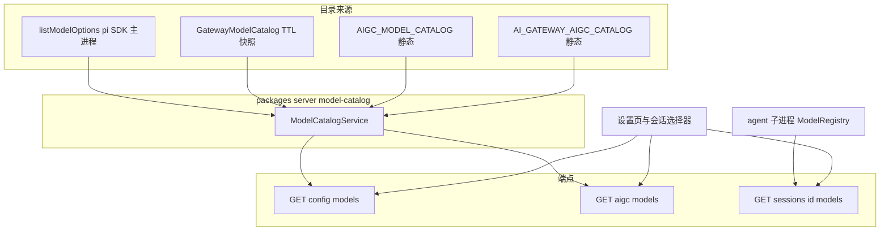

# Technical Design — model-catalog

## Overview

**Purpose**:修复 ai-gateway 启用后模型清单的四类缺陷(自配 provider 被吞并、渠道名冒充 provider、可选不可用、图像开关清单漏网关路由),并把散落在装配闭包里的目录组装逻辑收敛为可单测的 ModelCatalogService。

**Users**:部署运维(配置默认模型、隐藏 provider、禁用图像模型)与终端用户(设置页下拉、会话内选择器)。

**Impact**:改写 `mergeModelCatalog` 的合并语义(key 从裸 id → provider/id;网关条目 provider 收敛为 `"ai-gateway"`);`providers` 字段语义修正为「可设为默认的 provider 集合」;`GET /api/aigc/models` 条件并入网关图像目录;新增 `packages/server/src/model-catalog/` 组装服务。未启用 ai-gateway 时全部端点输出与现状逐字节一致。

### Goals
- 自配目录条目在任何聚合形态下零丢失(D1)。
- providers 列表永不出现网关内部渠道名;网关模型统一归属 `ai-gateway` 分组(D2)。
- 设置页「可选即可用」:默认 Provider 只列 self;网关模型可见但 disabled(D3 UI 面)。
- 图像开关清单与运行时路由集同源一致(D4)。
- 三清单取数口径统一进 ModelCatalogService(P1),响应只增不改。

### Non-Goals
- 网关对话模型的会话可用性打通(agent models.json 注入)——P2 独立 spec。
- `/api/sessions/:id/models` 的数据面改动(子进程 ModelRegistry 权威,维持现状)。
- 视觉模型清单(`/api/vision/models`)并入;网关 `/v1/models` 能力标记;计费/配额。

## Boundary Commitments

### This Spec Owns
- 对话模型聚合目录的合并语义与响应契约(`GET /api/config/models` 的 providers/models 语义)。
- 图像模型展示目录的组装与响应契约(`GET /api/aigc/models`)。
- `ModelOption` 类型的可选扩展字段(`channel`、`availability`)。
- 设置页 modelSelect 的 disabled 渲染与 AIGC 开关的来源标记(UI 面)。
- 网关图像目录静态条目(`AI_GATEWAY_AIGC_CATALOG`,tool-kit 声明层)。

### Out of Boundary
- `GatewayModelCatalog` 拉取机制(TTL/fail-soft/keyResolver)——沿用 ai-gateway-providers spec,不改。
- aigc 禁用机制(`aigc.json` 读写、runner 侧 filterRoutes)——沿用 aigc-tool-settings spec,不改。
- 会话端点 `/api/sessions/:id/models` 的取数(仅确认其 HIDE_PROVIDERS 口径不回归)。
- runner 侧 `extension.ts` 的 extraRoutes 并入逻辑(已正确,不动)。

### Allowed Dependencies
- `@blksails/pi-web-tool-kit` 主入口的静态目录(零 pi SDK,双入口纪律)。
- `packages/server/src/ai-gateway/`(GatewayModelCatalog、resolveAiGatewayConfig)。
- `packages/server/src/config/`(model-options 取数、parseHiddenProviders)。
- 依赖方向:`tool-kit 静态声明 → server/model-catalog → lib/app 装配 → UI`;UI 只消费 HTTP JSON,不 import server。

### Revalidation Triggers
- `ModelOption`/`AigcCatalogEntry` 形状变更 → 前端字段消费方与 P2 spec 需复验。
- `providers` 字段语义再变更 → providerSelect 与本 spec R3.1 需复验。
- 网关图像路由键集合变更(tool-kit ROUTES)→ 静态目录 sync 断言与 e2e 需复验。
- P2 落地(availability 翻转 session)→ R3.2 disabled 判据行为自动变化,需回看 e2e 断言。

## Architecture

### Existing Architecture Analysis
- 目录取数现散落两处闭包:pi-handler 的 `listModelOptions`(merge + hidden 过滤)与 `createAigcModelsRoute()`(零参静态返回)。
- 前端 providerSelect/modelSelect 解耦消费 `providers`/`models`(research.md「前端下拉的数据依赖拓扑」),是零 UI 改动修 R3.1 的关键既有事实。
- handler 单例 pin 在 globalThis:注入路由/闭包变更需重启 dev(运维注意事项,非代码约束)。

### Architecture Pattern & Boundary Map



**Key Decisions**(全文见 research.md Design Decisions):
1. merge key = `provider/id`;网关条目 provider 恒 `"ai-gateway"`,`ownedBy` 降级 `channel` 元数据 → self/gateway 永不同 key,零吞并。`modelPrecedence` 收窄为 merged models 数组的块排序(gateway=网关块在前)。
2. `providers` = self 来源 provider 集合(可设为默认的集合);gateway 模型只进 `models`。providerSelect 零改动合规。
3. 图像命名空间不吃 `PI_WEB_HIDE_PROVIDERS`(R5.2;避免与运行时注册集偏差)。
4. disabled 判据用 `availability === "catalog"`(非 source),为 P2 翻转留接缝。
5. `/api/sessions/:id/models` 不经服务(子进程权威),仅回归断言其过滤口径。

### Technology Stack

| Layer | Choice / Version | Role in Feature | Notes |
|-------|------------------|-----------------|-------|
| Backend | TypeScript strict / Node >=22 | ModelCatalogService 纯组装模块 | 无新依赖 |
| Frontend | 既有 shadcn cmdk Combobox | disabled 项渲染 + i18n 提示 | 无新依赖 |
| 测试 | vitest + Playwright | 单测/集成/浏览器 e2e | 既有基建 |

## File Structure Plan

### New Files
```
packages/server/src/model-catalog/
├── index.ts        # barrel:导出 service 与类型
└── service.ts      # ModelCatalogService:chat 聚合(merge+hidden 过滤)与 image 目录组装
packages/server/test/model-catalog/
└── service.test.ts # 服务单测(聚合/过滤/零侵入字节一致)
```

### Modified Files
- `packages/server/src/config/model-options.types.ts` — `ModelOption` 追加可选 `channel?: string`、`availability?: "session" | "catalog"`(注释注明仅聚合形态出现)。
- `packages/server/src/ai-gateway/model-catalog.ts` — 重写 `mergeModelCatalog`:key `provider/id`、provider 收敛 `"ai-gateway"`、channel/availability 附加、precedence 改块排序、providers 输出 self-only。
- `packages/server/src/aigc-settings/aigc-models-routes.ts` — `createAigcModelsRoute(opts?: { extraEntries?: readonly AigcCatalogEntry[] })`:并入注入条目(响应条目附可选 `source` 字段)。
- `packages/tool-kit/src/aigc/model-catalog.ts` — `AigcCatalogEntry.provider` 联合扩 `"ai-gateway"`;新增 `AI_GATEWAY_AIGC_CATALOG`(3 条:`gpt-image-1`/`gpt-image-2-ai-gateway`/`qwen-image`,零 env 读取)。
- `lib/app/pi-handler.ts` — 装配:构造 ModelCatalogService;`listModelOptions` 闭包与 `createAigcModelsRoute` 改从服务取数;`extraEntries` 按 `aiGwConfig !== undefined` 条件传入(与 runner env 判据同源)。
- `packages/ui/src/config/fields/model-select-field.tsx` — `Opt` 增 `availability`;`availability === "catalog"` 的 CommandItem 渲染 disabled + 「未接入会话」提示。
- `packages/ui/src/i18n/`(zh/en 字典)— 新增 disabled 提示文案 key。
- `packages/ui/src/config/fields/aigc-model-toggles-field.tsx`(`AigcModelTogglesField`)— 条目来源标记展示(R4.5)。
- `packages/server/src/index.ts` — barrel 导出 model-catalog 模块。

### Modified Tests(预期变更,非回归)
- `packages/server/test/ai-gateway/model-catalog.test.ts` — 三冲突场景断言改「不吞并」;新增 provider 收敛/channel/块排序断言。
- `packages/tool-kit/test/aigc/model-catalog.test.ts` — sync 断言扩至网关路由组(目录条目 = gen∪edit 路由键)。
- `packages/ui/test/config/model-select-field.test.tsx` — providerSelect 不含 ai-gateway;catalog 条目 disabled。
- `test/ai-gateway-route-mount*.integration.test.ts` — 端到端形状断言更新。

## Requirements Traceability

| Requirement | Summary | Components | Interfaces | Flows |
|-------------|---------|------------|------------|-------|
| 1.1–1.4 | 自配目录零丢失/零侵入/fail-soft | mergeModelCatalog、ModelCatalogService | GET /api/config/models | 聚合流 |
| 2.1–2.4 | provider 收敛 ai-gateway、channel 元数据、徽章 | mergeModelCatalog、ModelSelectField | ModelOption.channel | — |
| 3.1–3.4 | providers=self-only、catalog 条目 disabled、存量值容错、会话选择器不并入 | ModelCatalogService、ModelSelectField | ModelOption.availability | — |
| 4.1–4.5 | 图像清单与运行时同源、禁用生效、来源标记 | AI_GATEWAY_AIGC_CATALOG、aigc-models-routes、AigcModelTogglesField | GET /api/aigc/models | — |
| 5.1–5.4 | 过滤口径与命名空间边界、只增不改 | ModelCatalogService、query-routes(仅回归) | PI_WEB_HIDE_PROVIDERS | — |
| 6.1–6.4 | 回归断言与 e2e | 全部测试文件 | — | — |

## Components and Interfaces

| Component | Domain/Layer | Intent | Req Coverage | Key Dependencies | Contracts |
|-----------|--------------|--------|--------------|------------------|-----------|
| mergeModelCatalog(重写) | server/ai-gateway | 聚合合并纯函数 | 1.1–1.3, 2.1–2.3 | 无(纯函数) | Service |
| ModelCatalogService | server/model-catalog | 目录组装单一权威 | 1.1–1.4, 3.1, 4.1, 4.3, 5.1–5.4 | mergeModelCatalog(P0)、GatewayModelCatalog(P0)、parseHiddenProviders(P0) | Service |
| aigc-models-routes(扩参) | server/aigc-settings | 图像清单端点 | 4.1, 4.3–4.5 | ModelCatalogService(P0) | API |
| AI_GATEWAY_AIGC_CATALOG | tool-kit 声明层 | 网关图像静态目录 | 4.1, 4.4 | 零依赖(双入口纪律) | State |
| ModelSelectField(扩展) | ui/config | disabled 渲染 + 徽章 | 2.4, 3.1–3.3 | GET /api/config/models(P0) | — |
| AigcModelTogglesField(扩展) | lib/settings | 开关清单来源标记 | 4.5 | GET /api/aigc/models(P0) | — |

### server/model-catalog

#### ModelCatalogService

| Field | Detail |
|-------|--------|
| Intent | chat/image 双命名空间目录的组装与过滤单一权威 |
| Requirements | 1.1–1.4, 3.1, 4.1, 4.3, 5.1–5.4 |

**Responsibilities & Constraints**
- 组装,不取数:各来源经构造注入(纯依赖注入,便于单测);自身零 env 读取、零 IO。
- 未启用网关(gateway 来源未注入)时,chat 输出 === self 输入(引用级透传,字节一致);image 输出 === 静态目录(同)。
- hidden 过滤仅作用于 chat 命名空间。

##### Service Interface
```typescript
interface ModelCatalogServiceDeps {
  /** self 对话目录取数(既有 listModelOptions 闭包,已含 hidden 过滤前的原始集)。 */
  readonly listSelfChat: () => ModelOptions;
  /** 网关对话目录快照;未启用时不注入。 */
  readonly gatewayChat?: { get(): readonly GatewayModelEntry[] };
  /** 同名排序偏好(块排序,不做覆盖删除)。 */
  readonly modelPrecedence?: "gateway" | "self";
  /** 图像静态目录(self)。 */
  readonly imageCatalog: readonly AigcCatalogEntry[];
  /** 网关图像静态目录;未启用时不注入。 */
  readonly gatewayImageCatalog?: readonly AigcCatalogEntry[];
  /** chat 命名空间隐藏 provider 集合。 */
  readonly hiddenProviders: ReadonlySet<string>;
}

interface ModelCatalogService {
  /** GET /config/models 数据:providers=self-only(过滤后),models=self∪gateway(过滤后)。 */
  chatOptions(): ModelOptions;
  /** GET /aigc/models 数据:静态∪网关条目(带 source),不吃 hidden 过滤。 */
  imageEntries(): readonly (AigcCatalogEntry & { readonly source?: "self" | "ai-gateway" })[];
}
```
- Preconditions:deps 在装配期一次性构造(gatewayChat 注入与否即启用判别)。
- Postconditions:`chatOptions().providers` ⊆ self providers 且不含 `"ai-gateway"` 与任何渠道名;gateway 未注入时输出与输入逐字节一致。
- Invariants:同一 `provider/id` 在输出中至多一条;image 输出集合恒等于「运行时可注册路由键集合」的展示投影。

##### API Contract(经既有端点透出,形状只增不改)
| Method | Endpoint | Response 变更 | Errors |
|--------|----------|---------------|--------|
| GET | /api/config/models | models 条目可选新增 `channel`/`availability`;providers 值修正为 self-only | 既有(异常回空集) |
| GET | /api/aigc/models | 条目可选新增 `source`;启用网关时多 3 条 | 既有 |

### server/ai-gateway

#### mergeModelCatalog(重写)
Summary-only:纯函数签名不变(`(self, gateway, precedence) => ModelOptions`)。行为变更:gateway 条目映射 `{ provider: "ai-gateway", id: model, name: model, source: "ai-gateway", channel: ownedBy, availability: "catalog" }`;self 条目附 `source: "self", availability: "session"`;合并按 `${provider}/${id}` 去重(理论上已无碰撞,保留防御);precedence 决定 models 数组中两块的先后;providers 输出仅取 self 条目的 provider 去重排序。

**Implementation Notes**
- Integration:pi-handler 现有调用点改为经 ModelCatalogService;函数本体仍从 ai-gateway barrel 导出(兼容既有测试 import 路径)。
- Validation:单测覆盖同 id 跨 provider 不吞并、providers 无渠道名、未启用字节一致、precedence 块排序。
- Risks:旧测试断言需成批改写(预期变更,见 File Structure Plan)。

### ui/config

#### ModelSelectField(扩展)
Summary-only:`Opt` 透传 `availability`;modelSelect 分组内 `availability === "catalog"` 的项渲染 `CommandItem disabled` + 行尾提示文案(i18n key,zh「未接入会话」/en "not session-ready");徽章逻辑沿用 `source`。providerSelect 零改动(服务端已收敛)。存量无效值容错为既有行为(triggerLabelFor 原样显示),仅补测试锚定。

#### AigcModelTogglesField(扩展)
Summary-only:条目渲染处按 `source === "ai-gateway"` 附来源标记(与 modelSelect 徽章同视觉语言);勾选/保存/禁用链路零改动。

## Error Handling
- 服务自身无 IO,无新错误面;各来源的既有 fail-soft 语义(网关快照空集、listModelOptions 抛错回空)原样透传(1.4)。
- 端点层维持既有兜底(取数抛错 → 200 空集,不 5xx)。

## Testing Strategy

### Unit Tests
1. `mergeModelCatalog`:同 id 跨 provider 不吞并(self 条目集合守恒,1.1/6.1);providers 不含渠道名且不含 ai-gateway(2.2/3.1/6.2);channel/availability 附加正确(2.3);precedence=gateway/self 的块排序(Decision 1);空 gateway 入参输出与 self 字节一致(1.3)。
2. `ModelCatalogService`:gateway 未注入时 chat/image 输出与输入逐字节一致(1.3/4.3);hidden 过滤仅作用 chat(5.1/5.2);`hidden 含 ai-gateway` 时 gateway 条目整体剔除(5.3);imageEntries 并入网关条目带 source(4.1/4.5)。
3. tool-kit 静态目录 sync 断言:`AI_GATEWAY_AIGC_CATALOG` 条目 = gen∪edit 网关路由键去重集(4.4,防漂移)。

### Integration Tests
1. `test/ai-gateway-route-mount.integration.test.ts`(启用形态):/api/config/models 的 providers 恢复含全部 self provider 且无渠道名(6.1/6.2);/api/aigc/models 含 3 条网关条目(6.3)。
2. disabled 形态集成测试:两端点输出与主干快照逐字节一致(1.3/4.3)。
3. UI 组件测试(vitest):providerSelect 选项集 = providers 数组;catalog 条目 disabled 且不可提交(3.1/3.2);存量无效值原样显示(3.3)。

### E2E(浏览器,6.4)
1. 启用网关的 dev 实例:/settings 通用 → 默认 Provider 下拉出现 `apiservices`/`dashscope`、不出现渠道名;默认模型下拉出现 `ai-gateway` 分组且组内项不可选中。
2. /settings AIGC 图像 → 开关清单出现 3 条网关条目(带来源标记),勾掉一条保存后重载会话,会话内 AIGC 快捷设置/工具枚举不再含该模型(4.2)。
3. 会话内主对话模型选择器不含网关目录条目(3.4,行为锚定)。
