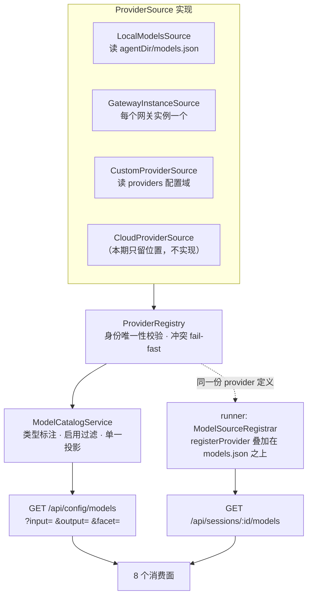
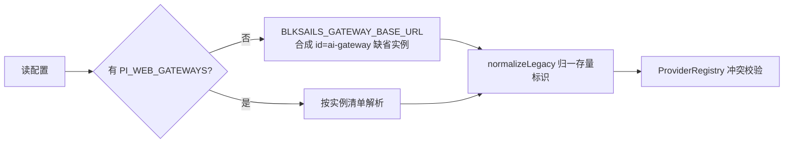

# Design Document

## Overview

本特性把 pi-web 的模型 provider 体系从「单网关实例 + 编译期固定的 provider 名 + 本地文件驱动」改造为**多实例、可注册、可配置**的统一体系。核心是引入一个跨用途的 provider 身份空间：每个网关实例、每个本地 provider、每个用户自定义 provider 都是该空间中一个有唯一标识的成员，其模型条目按**输入 / 输出类型**（`text` / `image` / `video` / `audio`）分类，供全部消费面按需筛选。

**Users**：部署方（配置多个网关、控制哪些 provider 可见）、使用者（在设置界面自助新增 provider、在对话与 AIGC 两处看到一致的 provider 名）。

**Impact**：三个只读模型端点合并为一个部署级目录接口；`ai-gateway` 这个在对话侧与 AIGC 侧含义相反的标识被消除；登录态下本地 provider 从会话清单中整体消失的既有缺陷被修复。

### Goals

- 多个 LLM 网关可同时启用，各自成为可辨识的独立 provider；新增网关是加配置而非改代码。
- provider 标识跨对话与 AIGC 两侧统一，同一标识在任何清单中指向同一上游。
- 模型按输入 / 输出类型分类，三个只读端点合并为一个，消费面按类型筛选取数。
- 使用者可在设置界面新增、编辑、启停 provider，凭据只写不回显。
- 部署级目录中可用的 provider 在会话中不无故缺失（修 `inMemory` 替换缺陷）。

### Non-Goals

- 不交付视频 / 音频生成工具本身，只留出类型维度并让筛选生效。
- 不实现云端 provider 配置的实际拉取与下发，只预留来源位置与合并语义。
- 不采集或展示模型定价元数据。
- 不保证各网关上游能否真正调通（取决于上游侧密钥与配额）。
- 不把会话模型的读写合并为单数资源形态。

## Boundary Commitments

### This Spec Owns

- **provider 身份空间**：标识的分配规则、唯一性校验、跨用途一致性。
- **部署级模型目录**：来源注册、合并、类型标注、隐藏过滤，及其唯一 HTTP 契约。
- **模型条目的类型维度**：`input` / `output` 字段的取值域、继承规则、缺省补齐。
- **自定义 provider 配置**：其 schema、存储形状、凭据的写入与掩码读回。
- **会话可用模型对部署级目录的单向包含关系**，含 runner 侧 registry 的叠加式装配。
- **存量配置迁移**：旧 provider 标识 → 新标识的映射与落盘。

### Out of Boundary

- **pi SDK 的模型定义与 registry 实现** —— 本设计只消费其 API，不修改，也不要求上游扩展类型取值域。
- **各网关上游的目录形态与鉴权** —— 由其运营方决定，本设计只适配。
- **云端 provider 声明的产生与下发** —— 跨仓工作，本设计只定义其作为一类来源的位置与合并语义。
- **视频 / 音频工具的实现** —— 类型维度的消费方，不由本设计交付。
- **`POST /sessions/:id/models` 之外的会话命令**（thinking、steer、abort 等）不受本设计影响。
- **沙箱镜像内 agentDir 的烘焙内容** —— 由 `sandbox-baked-agent-image` 拥有。

### Allowed Dependencies

- pi SDK（`@earendil-works/pi-coding-agent` / `@earendil-works/pi-ai`）的 `ModelRegistry` / `AuthStorage` / 模型类型定义 —— 仅在 adapters 层以值方式依赖，内核层只以类型方式引用。
- 既有 config 域机制（schema 声明 → 表单渲染 → 落盘）—— 自定义 provider 配置复用之，不另建存储体系。
- 既有 `ModelSourceRegistrar` 自注册表 —— 多实例改造在其之上演进，不推倒重来。
- 既有隐藏名单解析（`parseHiddenProviders` / `excludeProviders`）。

### Revalidation Triggers

以下变化应促使下游消费方重新校验集成：

- **目录条目字段名或形状变化** —— 影响全部消费面与 `aigc.json` 存量键。
- **provider 标识分配规则变化** —— 影响 `settings.json` 的 `defaultProvider`、会话已存的 `model`。
- **类型取值域扩展**（新增 `video` / `audio` 之外的值）—— 影响筛选语义与 UI 分组。
- **runner 侧 registry 装配方式变化** —— 影响「选中即可用」的保证。
- **HTTP 路由变更** —— `/api/config/models` 的查询参数、`/api/sessions/:id/models` 的方法语义。

## Architecture

### 既有架构分析

现状的三个结构性问题（证据见 `research.md` §1-§3）：

1. **网关身份被编译期固化**：`AI_GATEWAY_PROVIDER_NAME = "ai-gateway"` 是全局常量，目录 merge（`model-catalog.ts:241`）与 runner 注册（`session-model-source.ts:180`）两处共用它。单实例假设有 **22 处**固化点。
2. **同一份数据被三个端点用三套字段名投影**：`{provider,id,name}` / `{model,label,provider}` / `{value,label,provider}`，且 vision 端点根本不经目录服务。
3. **注入路径丢失磁盘配置**：`createSharedModelServices` 用 `ModelRegistry.inMemory`，不读 `models.json`。

值得保留的既有资产：`GatewayModelCatalog` 的 stale-while-revalidate + fail-soft 已经完备且**类本身可多实例**；`ModelSourceRegistrar` 自注册表已是插件形态；config 域的 `objectList`/`variants`/`secret` 三件套已被 MCP 验证。

### 核心抽象：ProviderSource

综合结论（`research.md` §5.1）：多网关实例、自定义 provider、云端下发 provider 是**同一问题的三个变体**。统一为一个抽象：



**为什么 provider 名是裸实例 id 而非带前缀**：用户诉求是在界面上分辨 `cloudflare` 与 `blksails-ai`。加命名空间前缀会让 UI 显示成 `ai-gateway:cloudflare`，与诉求相悖。身份冲突改由 `ProviderRegistry` 在**启动期** fail-fast 拦截（Req 1.4），而不是靠前缀回避。

### 类型维度：input / output

pi SDK 已有同形状字段但取值域不足（`research.md` §2.5：`Model.input` 有、无 `output`；取值仅 `"text"|"image"`）。本产品维护自己的取值域：

| 来源 | input | output |
|---|---|---|
| pi SDK `Model`（对话） | 直接映射 | **缺省补 `["text"]`**（Req 4.3） |
| pi SDK `ImagesModel` | 直接映射 | 直接映射 |
| 网关目录条目 | 由实例配置声明或缺省 `["text"]` | 由实例配置声明或缺省 `["text"]` |
| AIGC 静态目录 | `["text","image"]` | `["image"]` |
| 自定义 provider | 用户在配置界面声明（Req 7.7） | 同左 |

筛选语义（Req 4.4/4.5）：生图 = `output ∋ image`；视觉理解 = `input ∋ image`；对话 = `output ∋ text`。

### 技术栈

| 层 | 选择 | 在本特性中的角色 |
|---|---|---|
| 前端 | 既有 `packages/ui` config 表单机制（`objectList`/`variants`/`secret`） | provider 管理界面零 IR 扩展 |
| 服务端 | 既有 `ConfigCodec` + `LocalWorkspace` | providers 域落盘，白拿 0600/0700 + 原子写 + 租户隔离 |
| 目录 | 既有 `GatewayModelCatalog`（多实例化）+ 新增聚合器 | 每实例独立 TTL 缓存与 fail-soft |
| runner | 既有 `ModelSourceRegistrar`（契约扩展） | provider 注册叠加在 `models.json` 之上 |
| SDK | `ModelRegistry.create(auth, modelsJsonPath)` + `registerProvider` | 磁盘 + 动态注册叠加（SDK 既定支持） |

## File Structure Plan

### 新增文件

```
packages/core/src/model-catalog/
├── provider-identity.ts        # provider 身份：id 校验规则、冲突检测、保留名清单
├── provider-source.ts          # ProviderSource 契约 + ProviderRegistry（组装，零 IO）
└── modality.ts                 # input/output 取值域、缺省补齐、筛选谓词

packages/protocol/src/config/domains/
└── providers.ts                # providers 域：zod schema + 手写 FormSchema（objectList+variants+secret）

packages/core/src/config/
└── provider-secrets.ts         # objectList 感知的 mask/merge 遍历器（通用实现到不了数组内层）

packages/adapters/src/ai-gateway/
└── instances.ts                # 多实例 env 解析 + 每实例 GatewayModelCatalog 的聚合器
```

### 修改文件

| 文件 | 改动 |
|---|---|
| `packages/core/src/model-provider-names.ts` | `AI_GATEWAY_PROVIDER_NAME` 保留为**缺省实例 id**（存量兼容），新增保留名清单 |
| `packages/core/src/model-catalog/service.ts` | `gatewayChat`/`mergeCatalog`/`gatewayImageCatalog` 单值 → 经 `ProviderRegistry` 取；`chatOptions()`+`imageEntries()` 合为 `query(filter)` |
| `packages/core/src/model-catalog/types.ts` | `GatewayModelEntry` 增 `instanceId`；`source` 字面量放宽为 string |
| `packages/core/src/config/model-options.types.ts` | 条目增 `input`/`output`；`source` 放宽 |
| `packages/core/src/config/model-options-filter.ts` | hidden 匹配按实例 id |
| `packages/core/src/http/routes/config-routes.ts` | `/config/models` 接筛选参数；`DOMAIN_SCHEMAS` 加 providers 域 |
| `packages/core/src/aigc-settings/aigc-models-routes.ts` | **删除** |
| `packages/core/src/vision-settings/vision-models-routes.ts` | **删除** |
| `packages/adapters/src/ai-gateway/config.ts` | `resolveAiGatewayConfig` → 返回实例数组；env 命名引入实例维度 |
| `packages/adapters/src/ai-gateway/model-catalog.ts` | `mergeModelCatalog` 按实例 id 收敛而非硬拍常量；logger 带实例名 |
| `packages/adapters/src/ai-gateway/key-resolver.ts` | 按实例读 env |
| `packages/adapters/src/ai-gateway/session-model-source.ts` | env 契约多实例化；`registerAiGatewayProvider` 接实例名 |
| `packages/adapters/src/ai-gateway/routes.ts` | 转发路由按实例分流 |
| `packages/adapters/src/auth/egress-model-source.ts` | **缺陷修复**：`inMemory` → `create(auth, models.json)`；订正文件头注释 |
| `packages/runner/src/runner/model-source-registrar.ts` | 契约：`providerName: string` → `sourceId` + `providerNamesOf(spec)` |
| `packages/runner/src/runner/option-mapper.ts` | 适配新契约 |
| `packages/runner/src/runner/session-options.ts` | 失败文案判据改按来源而非常量比对 |
| `packages/server/src/host-assembly/model-sources.ts` | 每实例注册；新增 CustomProviderSource 登记 |
| `packages/tool-kit/src/aigc/model-catalog.ts` | `AigcCatalogEntry.provider` 封闭联合 → string；条目补 `input`/`output` |
| `packages/tool-kit/src/aigc/extension.ts` | KV 发布沿用，provider 变更提示「下次新建会话生效」 |
| `packages/protocol/src/config/index.ts` | 导出 providers 域 + `ConfigDomainId` 加值 + `CONFIG_FORM_SCHEMAS` |
| `packages/ui/src/config/fields/model-select-field.tsx` | 端点加筛选参数；缓存按参数分桶；徽章按实例名 |
| `packages/ui/src/config/fields/aigc-model-toggles-field.tsx` | 改指统一端点 + `output=image` |
| `packages/ui/src/config/fields/vision-model-select-field.tsx` | 改指统一端点 + `input=image`；`value` 由前端拼 `${provider}/${id}` |
| `packages/canvas-ui/src/vision-op.ts` | 同上；与上一条共用取数函数消除重复请求 |
| `packages/react/src/hooks/use-models.ts` | `current` 从会话快照派生（Req 11.8/11.9） |
| `packages/core/src/http/routes/command-routes.ts` | `POST /sessions/:id/model` → `/models`（Req 3.7），旧路径返回可辨识错误（Req 3.8） |
| `packages/react/src/client/pi-client.ts` | `setModel` 路径同步 |
| `lib/app/pi-handler.ts` | 装配多实例；三处目录装配点合一 |
| `lib/app/ai-gateway-session-assembly.ts` | spawn env 多实例序列化 |
| `lib/settings/register-panels.ts` | 注册 providers 面板 |

## Requirements Traceability

> ID 逐个枚举（不用区间写法）—— 区间会让中间值在机械检查中假绿。

| Req | 摘要 | 组件 | 契约 |
|---|---|---|---|
| 1.1 | 支持 0/1/N 个实例 | `instances.ts`, `ProviderRegistry` | 实例 env 契约 |
| 1.2 | provider 名 = 实例标识 | `instances.ts`, `mergeModelCatalog` 重构 | 目录条目 `provider` |
| 1.3 | 两实例分别列出 | `ProviderRegistry.providers()` | `GET /api/config/models` |
| 1.4 | 重复标识 fail-fast | `provider-identity.ts` | 启动期校验 |
| 1.5 | 单实例失败不牵连 | `GatewayModelCatalog`（既有 fail-soft）+ 聚合器 | — |
| 1.6 | 加实例=加配置 | `resolveGatewayInstances` 的 env 派生规则 | 实例 env 契约 |
| 2.1 | 单一标识空间 | `ProviderRegistry` | — |
| 2.2 | CF 与 blksails-ai 各自独立 | `provider-identity.ts` 保留名 + 冲突校验 | — |
| 2.3 | 同一标识处处同义 | `ProviderRegistry` 为唯一事实源 | 目录条目 `provider` |
| 2.4 | 新增 AIGC provider 免改类型 | `tool-kit/aigc/model-catalog.ts` 联合放宽 | `AigcCatalogEntry` |
| 3.1 | 唯一部署级目录接口 | `ModelCatalogService.query()`, `config-routes.ts` | `GET /api/config/models` |
| 3.2 | 删 aigc 与 vision 端点 | 删 `aigc-models-routes.ts` / `vision-models-routes.ts` | — |
| 3.3 | 统一字段命名 | `CatalogModel` | 目录条目 schema |
| 3.4 | 按类型筛选 | `modality.ts`, `CatalogQuery` | 查询参数 |
| 3.5 | 标明来源 | `CatalogModel.source` | 目录条目 schema |
| 3.6 | 会话端点保留 | `query-routes.ts`（不变） | `GET /api/sessions/:id/models` |
| 3.7 | 读写共用路径 | `command-routes.ts` | `POST /api/sessions/:id/models` |
| 3.8 | 旧路径可辨识告知 | `command-routes.ts` | — |
| 4.1 | 双向类型声明 | `modality.ts`, `CatalogModel` | 目录条目 schema |
| 4.2 | 四种取值且可扩展 | `Modality` 类型（本产品自有） | — |
| 4.3 | 缺 output 补 text | `normalizeModalities` | — |
| 4.4 | output=image 全命中 | `matchesFilter` | 查询参数 |
| 4.5 | input=image 等价旧视觉清单 | `matchesFilter` | 查询参数 |
| 4.6 | provider 级声明可继承 | `inheritModalities` | `ProviderDefinition` |
| 4.7 | 模型级声明优先 | `inheritModalities` | `CatalogModel` |
| 5.1 | 隐藏对全部查询生效 | `model-options-filter.ts`, `CatalogQuery.applyHidden` | — |
| 5.2 | 隐藏后工具不可用 | `tool-kit/aigc/extension.ts` 的 `deriveActiveModels` 接入 hidden | — |
| 5.3 | 已启用模型随之失效且不呈现 | `tool-kit/aigc/extension.ts` + `aigc-model-toggles-field.tsx` | — |
| 5.4 | 三处一致 | `ProviderRegistry` 单一事实源 | — |
| 6.1 | 部署级 provider 会话中不缺失 | `egress-model-source.ts` **缺陷修复** | — |
| 6.2 | 会话可多出运行时来源并标明 | `model-source-registrar.ts` 的 `providerNamesOf` | `GET /api/sessions/:id/models` |
| 6.3 | 登录态保留本地 provider | 同 6.1（同一修复） | — |
| 6.4 | 追加而非替换 | `ModelRegistry.create(...)` + `registerProvider` 叠加 | — |
| 6.5 | 默认 provider 不可用时提示 | `session-options.ts` 文案分化 | — |
| 7.1 | 列出全部并标明来源 | `domains/providers.ts`, `ProviderRegistry` | providers 配置域 |
| 7.2 | 新增后模型出现在目录 | `CustomProviderSource` | providers 配置域 |
| 7.3 | 凭据只写不回显 | `provider-secrets.ts` | `SecretMask`/`SecretWrite` |
| 7.4 | 重填覆盖旧值 | `provider-secrets.ts` 的 `set` 分支 | `SecretWrite` |
| 7.5 | 停用后消失但保留配置 | `ProviderDefinition.enabled` | providers 配置域 |
| 7.6 | 标识冲突报错指明对象 | `domains/providers.ts` 的 `superRefine` | 422 + `path` |
| 7.7 | 可声明输入/输出类型 | `domains/providers.ts` 的 `multiEnum` 字段 | providers 配置域 |
| 8.1 | 云端作为一类来源 | `provider-source.ts`（抽象含该实现位） | `ProviderSource` |
| 8.2 | 未接入时行为不变 | 未注册即无输出（抽象的自然性质） | — |
| 8.3 | 同名取舍规则确定 | `ProviderRegistry` 的注册顺序与冲突策略 | — |
| 9.1 | 默认 provider/模型继续生效 | 缺省实例 id 沿用 `ai-gateway` | — |
| 9.2 | AIGC 开关继续生效 | `disabledModels` 存裸 id，零迁移（§4.7 实测） | — |
| 9.3 | 标识变化自动迁移 | `provider-identity.ts` 的 `normalizeLegacy` | — |
| 9.4 | 指向不存在的 provider 时保留+提示 | `model-select-field.tsx` 的 stale 标记 | — |
| 10.1 | 零配置时行为不变 | `ModelCatalogService.query()` 零来源路径 | — |
| 10.2 | 配置不合法启动期报错 | `resolveGatewayInstances` fail-fast | — |
| 10.3 | 可诊断的过滤计数 | 各来源组装时的四计数日志 | — |
| 11.1 | 三处清单同源 | `ModelCatalogService.query()` | `GET /api/config/models` |
| 11.2 | 按类型呈现而非按端点 | `model-select-field.tsx` 等三个前端文件 | 查询参数 |
| 11.3 | 新 provider 出现在会话选择器 | `model-source-registrar.ts` + `use-models.ts` | — |
| 11.4 | 快捷设置与开关一致 | `tool-kit/aigc/extension.ts` 的 KV 发布 | state-bridge KV |
| 11.5 | 变更无需重启即反映 | 前端缓存按参数分桶 + 失效策略 | — |
| 11.6 | 消费面自声明类型 | `CatalogQuery`（服务端不为单个消费面定制） | 查询参数 |
| 11.7 | 设置界面提供管理入口 | `register-panels.ts` 注册 providers 面板 | providers 配置域 |
| 11.8 | 刷新后仍显示当前模型 | `use-models.ts` 从会话快照派生 | 会话快照 |
| 11.9 | 当前模型不在清单时可辨识 | `use-models.ts` + `model-selector.tsx` | — |

## Components and Interfaces

| 组件 | 层 | 意图 | Req | 关键依赖 |
|---|---|---|---|---|
| `ProviderIdentity` | core | provider id 的校验、保留名、冲突检测、存量归一 | 1.4, 2.2, 9.3 | — |
| `ProviderSource` / `ProviderRegistry` | core | 来源契约与身份唯一的注册表 | 1.1-1.3, 7.1, 8.1-8.3 | ProviderIdentity |
| `Modality` | core | input/output 取值域、缺省补齐、筛选谓词 | 4.1-4.7 | — |
| `ModelCatalogService`（重构） | core | 单一投影：组装 + 类型标注 + 启用过滤 | 3.1-3.5, 5.1 | 以上三者 |
| `GatewayInstances` | adapters | 多实例 env 解析 + 每实例目录聚合 | 1.1-1.6 | GatewayModelCatalog（既有） |
| `providers` 配置域 | protocol | 自定义 provider 的 schema 与表单 IR | 7.1-7.7 | 既有 objectList/variants/secret |
| `ProviderSecrets` | core | objectList 感知的 mask/merge | 7.3 | 既有 SecretMask/SecretWrite 契约 |
| `ModelSourceRegistrar`（契约扩展） | runner | 一个来源注册 N 个 provider | 1.1, 6.1-6.4 | — |

### core / ProviderIdentity

**职责**：provider 标识是全系统的连接键（目录条目、registry 注册名、`settings.json` 的 `defaultProvider`、hidden 名单四处必须逐字一致）。本组件是其唯一事实源。

```typescript
/** provider 标识的合法形态：小写字母、数字、连字符；不以连字符起止。 */
export type ProviderId = string & { readonly __brand: "ProviderId" };

export interface ProviderIdentityRules {
  /** 校验字面量是否为合法 id；不合法时给出可读原因。 */
  validate(raw: string): { ok: true; id: ProviderId } | { ok: false; reason: string };
  /** 检测一批 id 中的重复，返回全部冲突项（不是遇到第一个就停）。 */
  findConflicts(ids: readonly string[]): readonly { id: string; sources: readonly string[] }[];
  /** 存量归一：把历史标识映射到当前标识；无映射时原样返回。 */
  normalizeLegacy(raw: string): string;
}
```

- 前置条件：`findConflicts` 在**启动期**调用，早于任何目录组装。
- 后置条件：冲突非空 → 装配层抛错并列出全部冲突的 id 与来源（Req 1.4），不静默取其一。
- 不变式：`normalizeLegacy` 幂等。

### core / ProviderSource 与 ProviderRegistry

```typescript
export interface ProviderDefinition {
  readonly id: ProviderId;
  readonly displayName?: string;
  readonly enabled: boolean;
  /** provider 级类型声明；模型条目可细化（Req 4.6/4.7）。 */
  readonly input?: readonly Modality[];
  readonly output?: readonly Modality[];
  readonly models: readonly CatalogModel[];
}

export interface ProviderSource {
  /** 来源身份，用于冲突报告与日志；与 provider id 不同（一个来源可产出多个 provider）。 */
  readonly sourceId: string;
  /** 同步列出本来源当前的 provider 定义。不得抛错——失败即返回空集并自行记录。 */
  list(): readonly ProviderDefinition[];
}

export interface ProviderRegistry {
  /** 全部 provider（已做冲突校验，已按 enabled 过滤）。 */
  providers(): readonly ProviderDefinition[];
  /** 按 id 精确查找。 */
  find(id: string): ProviderDefinition | undefined;
}
```

**为什么 `list()` 不得抛错**：单个网关拉取失败不应牵连其他来源（Req 1.5）。fail-soft 语义沿用 `GatewayModelCatalog` 既有实现（`research.md` §1.3）。

**Req 8 的落地方式**：云端来源就是一个未被注册的 `ProviderSource` 实现位。未注册时 `providers()` 的输出与它不存在时逐字节一致（Req 8.2），这是抽象的自然性质而非额外代码。

### core / Modality

```typescript
export type Modality = "text" | "image" | "video" | "audio";

export interface ModalityFilter {
  readonly input?: Modality;
  readonly output?: Modality;
}

/** SDK 值 → 本产品取值域；SDK 的 Model 无 output，按对话缺省补 ["text"]（Req 4.3）。 */
export function normalizeModalities(m: {
  input?: readonly string[];
  output?: readonly string[];
}): { input: readonly Modality[]; output: readonly Modality[] };

/** provider 级声明 → 模型级继承；模型自身声明优先（Req 4.7）。 */
export function inheritModalities(
  provider: Pick<ProviderDefinition, "input" | "output">,
  model: { input?: readonly Modality[]; output?: readonly Modality[] },
): { input: readonly Modality[]; output: readonly Modality[] };

export function matchesFilter(m: { input: readonly Modality[]; output: readonly Modality[] }, f: ModalityFilter): boolean;
```

### core / ModelCatalogService（重构）

`chatOptions()` + `imageEntries()` 两个方法合为一个带筛选的查询：

```typescript
export interface CatalogQuery {
  readonly input?: Modality;
  readonly output?: Modality;
  /** 是否应用隐藏名单。缺省 true（Req 5.1 隐藏=彻底禁用）。 */
  readonly applyHidden?: boolean;
}

export interface CatalogModel {
  readonly provider: string;
  readonly id: string;
  readonly name: string;
  readonly input: readonly Modality[];
  readonly output: readonly Modality[];
  readonly source: string;          // 来源 sourceId（Req 3.5）
  readonly channel?: string;        // 网关上游渠道，仅展示
  readonly availability?: "session" | "catalog";
}

export interface ModelCatalogService {
  query(q?: CatalogQuery): { providers: readonly string[]; models: readonly CatalogModel[] };
}
```

**字段命名决策**：统一采用 `{provider, id, name}`（对话侧既有形态，也与会话侧 `Model` 一致）。image 的 `model`→`id`、`label`→`name`；vision 的复合 `value` **不再由服务端产出**，改由消费面自行拼 `${provider}/${id}`。

★ **存量零迁移**（`research.md` §4.7 实测）：`aigc.json` 的 `disabledModels` 存的是裸 model id，字段改名不影响其值；`visionModel` 存复合键，由消费面拼装后格式不变。

### adapters / GatewayInstances

```typescript
export interface GatewayInstanceConfig {
  readonly id: ProviderId;          // 即 provider 名
  readonly baseUrl: string;
  readonly apiKey: string;
  readonly allowedOwners: ReadonlySet<string>;
  readonly ttlMs: number;
  readonly timeoutMs: number;
  readonly input?: readonly Modality[];
  readonly output?: readonly Modality[];
}

/** 解析全部实例；任一实例配置不合法即抛错并指明实例 id 与字段（Req 10.2）。 */
export function resolveGatewayInstances(env: NodeJS.ProcessEnv): readonly GatewayInstanceConfig[];
```

**env 命名**：`PI_WEB_GATEWAYS=<id1>,<id2>` 列出实例，逐实例读 `PI_WEB_GATEWAY_<ID>_BASE_URL` / `_API_KEY` / `_ALLOWLIST` / `_INPUT` / `_OUTPUT`（`<ID>` = id 大写、`-`→`_`，与既有 `PI_LLM_TOKEN_<ID>` 的派生规则同构，见 `lib/app/llm-gateway-config.ts:17`）。

**存量兼容**（Req 9.1）：未设 `PI_WEB_GATEWAYS` 但设了 `BLKSAILS_GATEWAY_BASE_URL` → 合成一个 id 为 `ai-gateway` 的缺省实例，行为与今日逐字节一致。

### runner / ModelSourceRegistrar（契约扩展）

```typescript
export interface ModelSourceRegistrar<TSpec = unknown> {
  /** 来源身份（去重键）。取代原 providerName —— 一个来源可注册多个 provider。 */
  readonly sourceId: string;
  resolveSpecFromEnv(env: NodeJS.ProcessEnv): TSpec | undefined;
  /** 该 spec 将注册的全部 provider 名。供日志、失败文案分化与目录一致性校验共用同一事实源。 */
  providerNamesOf(spec: TSpec): readonly string[];
  register(registry: ModelRegistry, spec: TSpec, log: ModelSourceLogger): void;
}
```

**为什么不是 `providerNames: readonly string[]` 静态字段**：实例数依 env 而定，静态字段表达不了（`research.md` §2.4）。

## Data Models

### providers 配置域（`~/.pi/agent/providers.json`）

```jsonc
{
  "providers": [
    {
      "id": "my-provider",
      "displayName": "我的服务",
      "enabled": true,
      "baseUrl": "https://api.example.com/v1",
      "apiKey": { "__secret": true, "set": true, "hint": "…abcd" },  // 读回掩码
      "input": ["text", "image"],
      "output": ["text"],
      "models": [{ "id": "model-a", "name": "Model A" }]
    }
  ]
}
```

- 表单 IR：`objectList`（可增删）+ 子字段含 `secret`（apiKey）+ `multiEnum`（input/output）+ 嵌套 `objectList`（models）
- **zod 与 FormSchema 两侧手写**并同步演进（`zodToFormSchema` 不产 `objectList`，`research.md` §3.1）
- id 唯一性经 `superRefine` 校验，issue 的 `path: ["providers", index, "id"]` 使 422 能精确指字段（仿 `mcp.ts:83-104`）

### 与 auth 域的关系（`research.md` §3.2 提出的必答项）

**决策：providers 域不接管 auth.json。** `auth.json` 是 pi SDK 共读文件，继续承载「已知 provider 的凭证」；providers 域承载「pi-web 自己定义的 provider 及其凭证」。两者不重叠，判据是：provider 定义在哪，其凭证就在哪。

- auth 域的 `KNOWN_PROVIDERS`（硬编码建议列表）保持不变，不与 providers 域联动。
- 避免双写入口：providers 域的 `id` 校验将**拒绝**与 pi SDK 内置 provider 同名（保留名清单，Req 7.6），使「同一个 provider 有两处凭证入口」不可能发生。

## Error Handling

| 场景 | 策略 | Req |
|---|---|---|
| 两个来源声明同一 provider id | **启动期抛错**，列出全部冲突 id 与来源 | 1.4 |
| 单个网关目录拉取失败 | fail-soft：该实例空集，其余不受影响，warn 记 url+error | 1.5 |
| 网关实例配置不合法（URL/取值域/TTL） | **启动期抛错**，指明实例 id 与字段名 | 10.2 |
| 注入了实例却缺合并能力 | 沿用既有 fail-fast（不静默降级为「未启用」） | 10.2 |
| 用户自定义 id 与保留名冲突 | PUT 返回 422，`path` 指向具体条目 | 7.6 |
| 存量 `defaultProvider` 指向已不存在的 provider | 保留设置值 + 可辨识提示，不静默清除 | 9.4 |
| 会话当前模型不在可用清单 | 选择器保留该项并标记，不静默消失 | 11.9 |
| 调用已下线的 `POST /sessions/:id/model` | 可辨识的错误响应（含新路径），不静默 404 | 3.8 |

**可观测性**（Req 10.3）：每个来源在组装时记 `{sourceId, provided, afterModality, afterHidden}` 四个计数，使「模型为何没出现」可从日志判定，沿用 `filterByOwner` 已有的 `kept/dropped/allowed` 记法。

## Testing Strategy

### 单元测试

1. `ProviderIdentity.findConflicts` —— 两个来源同 id 时返回**全部**冲突而非首个；`normalizeLegacy` 幂等（Req 1.4/9.3）
2. `Modality.normalizeModalities` —— SDK `Model`（无 output）补 `["text"]`；`ImagesModel` 双向直传（Req 4.3）
3. `Modality.inheritModalities` —— 模型自身声明覆盖 provider 继承值（Req 4.7）
4. `ModelCatalogService.query` —— 零来源时输出与本特性引入前逐字节一致（Req 10.1）；`applyHidden` 对全部类型一致生效（Req 5.1）
5. `provider-secrets` —— `objectList` 内的 secret 被掩码（**通用实现的已知盲点**，`research.md` §3.1）；三态 `keep|clear|set` 正确合并
6. `resolveGatewayInstances` —— 存量 `BLKSAILS_GATEWAY_BASE_URL` 合成缺省实例；实例配置不合法时错误信息含实例 id
7. `ModelSourceRegistrar` 契约 —— **本仓此前无该文件单测**（`research.md` §2.6 的测试空洞），须先补

### 集成测试

1. **两实例同时挂载** —— `/api/config/models` 的 providers 含两个实例 id，各自模型归属正确（Req 1.3）
2. **注入路径叠加 models.json** —— 启用任一模型源时，`agentDir/models.json` 的自定义 provider 仍在会话可用清单中（**核心缺陷的回归闸门**，Req 6.1）
3. 端点合一 —— `output=image` 的结果集与旧 `/api/aigc/models` 等价；`input=image` 与旧 `/api/vision/models` 等价（±网关条目，见迁移说明）
4. 隐藏名单 —— 隐藏某 provider 后，三处清单与工具路由均不含其模型（Req 5.1-5.4）
5. providers 域读写 —— PUT 明文 → GET 掩码；`keep` 不改动已存密钥

### E2E

1. 设置界面新增一个自定义 provider → 其模型出现在默认模型下拉与会话选择器（Req 7.2, 11.3）
2. AIGC 图像模型开关清单从统一端点取数且启停仍生效（Req 11.1, 9.2）
3. 刷新页面后会话模型选择器仍显示当前模型为选中态（Req 11.8）

## Migration Strategy

延续本仓唯一先例（mcp-codec）的**读时归一**模式：无 `schemaVersion`、不重写文件、保留未识别内容（`research.md` §4.4）。



| 存量 | 处置 | 依据 |
|---|---|---|
| `settings.json` 的 `defaultProvider: "ai-gateway"` | 缺省实例 id 即 `ai-gateway`，**原样有效** | Req 9.1 |
| `aigc.json` 的 `disabledModels` | 存裸 model id，字段改名不影响其值，**零迁移** | `research.md` §4.7 实测 |
| `aigc.json` 的 `visionModel`（复合键） | 消费面自行拼 `${provider}/${id}`，格式不变，**零迁移** | 同上 |
| 旧 env `BLKSAILS_GATEWAY_BASE_URL` | 保留支持，合成缺省实例 | Req 9.1 |
| 旧路径 `POST /sessions/:id/model` | 返回可辨识错误指向新路径 | Req 3.8 |

**行为变化须在发布说明中标注**：视觉模型清单今天**不含**网关模型（vision 端点只读 `models.json`，`research.md` §1.1）；合一后按 `input=image` 筛选会**多出**网关的读图模型。这是预期内的能力增强，但对习惯旧清单的用户是可见变化。
