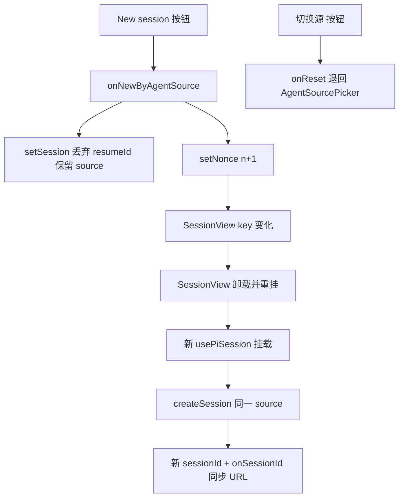

# Design Document

## Overview

**Purpose**：改进 pi-web 产品顶栏的会话新建体验——把 "New session" 从「退回选择器重选源」改为「用当前 agent source 一键新建会话」（同源新建），并新增「切换源」按钮保留退回 `AgentSourcePicker` 的能力。

**Users**：使用 pi-web 产品界面（`components/chat-app.tsx`）的开发者/用户。

**Impact**：仅改 app 层 `ChatApp` / `SessionView`。复用既有 `usePiSession` 的「挂载即建会话」语义与 `onSessionId` 的 URL/源映射副作用；不改 `@pi-web/ui`、不改 hook、不改协议。

### Goals
- "New session" → 同源新建（新 sessionId、源不变、非恢复模式、URL 切到 `/session/:newId`）。
- 新增「切换源」→ 退回 `AgentSourcePicker`（URL→`/`），即原 `onReset`。
- 组件测试 + 隔离 build e2e。

### Non-Goals
- 不改 `PiChat`、`usePiSession`、REST/SSE 协议、`AgentSourcePicker`。
- 不触碰 session-usage-panel 等其它特性。

## Boundary Commitments

### This Spec Owns
- `ChatApp` 触发「同源会话重建」的状态与逻辑（remount 机制）。
- `SessionView` 顶栏的「同源新建」与「切换源」两个按钮及其回调接线。

### Out of Boundary
- 会话创建/连接/恢复机制本身（属 `usePiSession`）。
- agent source 解析、URL/源映射副作用（既有，复用不改）。
- `PiChat` 内部、协议层。

### Allowed Dependencies
- `usePiSession`（`@pi-web/react`）现有契约：组件挂载时按 `create` 建会话（`startedRef` 守卫 + `[]` 自动启动）。
- 既有 `buildCreate(props, source)`、`AgentSourcePicker`、`onSessionId` 副作用。

### Revalidation Triggers
- `usePiSession` 的启动/重建语义变化（如改为响应 `create` 变化重建）→ 本设计的 key-remount 方案需复核。
- `SessionView` / `ChatApp` 的 props 契约变化。

## Architecture

### Existing Architecture Analysis
- `ChatApp`（`chat-app.tsx:125`）持有 `session = { create, resumeId? }`。`session===undefined` → 渲染 `AgentSourcePicker`；否则渲染 `SessionView`。
- `onSubmit(source)`（`:139`）：`setSession({ create: buildCreate(props, source) })` → 新建会话。
- `onReset()`（`:145`）：`setSession(undefined)` + `history.replaceState(null,"","/")` → 退回选择器。
- `SessionView`（`:173`）：`usePiSession({ create, resumeId })`，`onSessionId` 把 URL 同步到 `/session/:id` 并登记 source 映射。
- 顶栏（`:279-302`）："New session"（`onClick=onReset`）+ "设置" + 主题切换。
- **关键约束**：`usePiSession.start()` 被 `startedRef` 守卫，自动启动 `useEffect` 为 `[]` 依赖（`use-pi-session.ts:101-103, 166-173`）→ **仅改 `create` prop 不重建会话**。

### Architecture Decision：key-remount 实现同源新建



**要点**：
- 因 `usePiSession` 不响应 `create` 变化重建，必须**强制 `SessionView` 重新挂载**：`ChatApp` 维护 `nonce`，`SessionView` 的 `key = \`${session.create.source}#${nonce}\``。同源新建时保持 `create.source`、bump `nonce` → key 变 → 卸载+重挂 → 新 hook → 新会话。
- 同时**丢弃 `resumeId`**：否则在恢复模式（经 `/session/:id` 冷加载）下点新建会重挂成"再次恢复旧会话"。`onNewByAgentSource` 把 session 置为仅含 `create`（无 resumeId）。
- 「切换源」直接复用既有 `onReset`。

### Technology Stack

| Layer | Choice | Role | Notes |
|-------|--------|------|-------|
| Frontend | React 19（既有） | `ChatApp` 状态 + `SessionView` 顶栏按钮 | 仅 `components/chat-app.tsx` |
| Test | Vitest + Testing Library（组件）、Playwright/隔离 build（e2e） | 验收 | e2e 用 `NEXT_DIST_DIR=.next-e2e` + external server |

## File Structure Plan

### Modified Files
- `components/chat-app.tsx` —
  - `ChatApp`：新增 `nonce` state；新增 `onNewByAgentSource`（丢弃 resumeId、保留 create、bump nonce）；给 `SessionView` 传 `key={\`${session.create.source}#${nonce}\`}` 与新回调 `onNewByAgentSource`。
  - `SessionView`：props 增加 `onNewByAgentSource: () => void`；顶栏 "New session" 按钮 `onClick` 改为 `onNewByAgentSource`；新增「切换源」按钮 `onClick={onReset}`（带稳定 data 锚点）。

## Components and Interfaces

| Component | Domain/Layer | Intent | Req Coverage | Key Dependencies (P0) | Contracts |
|-----------|--------------|--------|--------------|------------------------|-----------|
| `ChatApp` 同源重建 | App | nonce + key-remount 触发同源新会话 | 1.1,1.2,1.3,1.4,3.1,3.3 | `usePiSession`(P0), `buildCreate`(P0) | State |
| `SessionView` 顶栏按钮 | App | "New session"=同源新建 / 「切换源」=退回选择器 | 1.1,2.1,2.2,2.3,3.2 | `onNewByAgentSource`/`onReset`(P0) | State |

### App

#### ChatApp 同源重建（修改 `chat-app.tsx`）

| Field | Detail |
|-------|--------|
| Intent | 用 nonce 驱动 SessionView 重挂,实现同源新会话 |
| Requirements | 1.1, 1.2, 1.3, 1.4, 3.1, 3.3 |

**Responsibilities & Constraints**
- `onNewByAgentSource`：保持 `session.create`（含 source）、**丢弃 resumeId**、`nonce+1`；不退回选择器（session 仍有值）。
- `SessionView` 的 `key` 含 `nonce` → 同源新建时强制重挂 → 新 `usePiSession` → 新会话（1.1/1.2/1.3）。
- 恢复模式下点新建：丢弃 resumeId 后重挂为全新会话，不再恢复旧会话（3.3）。

**Contracts**: State [x]

##### 状态与回调（类型）
```typescript
// ChatApp 内部
const [nonce, setNonce] = React.useState<number>(0);

const onNewByAgentSource = (): void => {
  setSession((s) => (s === undefined ? s : { create: s.create })); // 丢 resumeId,留 source
  setNonce((n) => n + 1);                                          // 强制 SessionView 重挂
};

// 渲染:
// <SessionView key={`${session.create.source}#${nonce}`} create={session.create}
//   onReset={onReset} onNewByAgentSource={onNewByAgentSource} />
```

**Implementation Notes**
- Integration：`key` 变化触发 React 卸载+重挂；`usePiSession` 新实例的 `startedRef` 复位 → `start()` → `createSession(create)`。
- Validation：`onSessionId` 既有副作用负责 URL→`/session/:newId` 与 source 映射(1.2)。
- Risks：必须丢弃 resumeId,否则恢复模式下重挂会再次 resume 旧会话(已在回调处理)。

#### SessionView 顶栏按钮（修改 `chat-app.tsx`，summary-only）
- props 增 `readonly onNewByAgentSource: () => void`。
- "New session" 按钮 `onClick` 由 `onReset` 改为 `onNewByAgentSource`，加 `data-new-session` 锚点。
- 新增「切换源」按钮 `onClick={onReset}`，加 `data-switch-source` 锚点。
- 错误态的"重新选择源"入口（`:253-260`，`onClick=onReset`）保持不变(3.2)。

## Requirements Traceability

| Requirement | Summary | Components | Interfaces |
|-------------|---------|------------|------------|
| 1.1 | New session=同源新建,不回选择器 | ChatApp / SessionView | onNewByAgentSource + key |
| 1.2 | 新会话 URL→/session/:newId | ChatApp | onSessionId(既有) |
| 1.3 | 源不变、非恢复模式 | ChatApp | 丢弃 resumeId、保留 create.source |
| 1.4 | 连接中指示→可对话 | SessionView | 既有连接态分支 |
| 2.1 | 提供「切换源」按钮 | SessionView | data-switch-source |
| 2.2 | 切换源退回选择器、URL→/ | ChatApp | onReset(既有) |
| 2.3 | 选择器提交后建会话 | ChatApp | onSubmit(既有) |
| 3.1 | 不改 PiChat/hook/协议 | （边界约束） | — |
| 3.2 | 错误态恢复入口不变 | SessionView | onReset(既有) |
| 3.3 | 恢复模式冷加载不受影响 | ChatApp | 仅新建时丢 resumeId |
| 4.1-4.4 | 组件+e2e+隔离 build+证据 | 测试 | 见 Testing Strategy |

## Error Handling

- 纯前端状态切换,无新增网络/错误路径。
- 同源新建若 `createSession` 失败 → 复用 `SessionView` 既有错误态（`session.error && status==="closed"` 分支,`:241`）显示错误 + "重新选择源"。

## Testing Strategy

### Component / Integration Tests（`test/chat-app.test.tsx` 扩展）
1. 活动会话点击「切换源」(`data-switch-source`) → 渲染 `AgentSourcePicker`（`data-agent-source-picker` 出现、`data-session-active` 消失）(2.1, 2.2)。
2. 活动会话点击 "New session"(`data-new-session`) → **仍停留在会话**（`data-agent-source-picker` 不出现、`data-session-active` 仍在），且 `SessionView` 以新 key 重挂（不回选择器）(1.1)。
3. （可选）断言重挂:用挂载计数或 `usePiSession` mock 调用次数增加,佐证同源新建触发了新 hook 实例。

### E2E Tests（隔离 build：`NEXT_DIST_DIR=.next-e2e` + external server）
1. 活动会话记录当前 `[data-session-id]`；点 "New session" → `[data-session-id]` 变为**新 id**（≠原）、URL 为 `/session/:newId`、可继续发一轮 prompt 得到回复（1.1/1.2/1.3/1.4）。
2. 点「切换源」→ `[data-agent-source-picker]` 出现（2.1/2.2）。

### 验收证据
- vitest + playwright 实际通过输出（新鲜证据），参照 `kiro-verify-completion`(4.4)。
