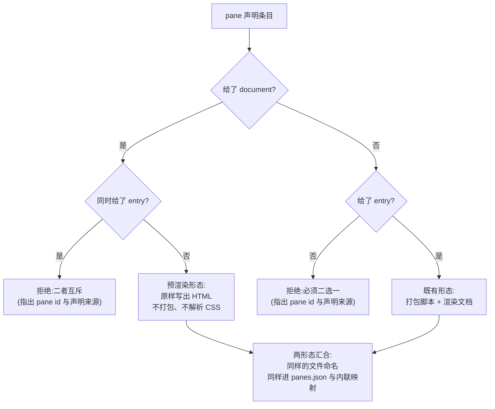

# Design Document

## Overview

**Purpose**：给 `pi-web build` 的 pane 声明补上第二种形态——**预渲染 HTML 文档**（无模块入口、
无需打包），使其能完整取代自建构建脚本，不再静默丢弃这类 pane。

**Users**：把构建迁到 `pi-web build` 的 agent 作者；直接受害者是 `aigc-agent`（其 logs pane
是一段预写 HTML，迁移后在 `panes.json` 里消失）。

**Impact**：`PaneModule` 由单一形态变为判别联合；构建循环按形态分派。既有「模块入口」形态
逐字节不变。

### Goals

- 预渲染 HTML pane 可声明、可构建、可寻址、进 `panes.json` 与内联映射（Req 1）。
- 两形态可在同一份声明中混用，顺序稳定（Req 2.1、2.2）。
- 形态非法（都给 / 都不给）时**显式失败**并指出是哪个 pane（Req 2.3–2.5、Req 4）。
- 只有模块入口时产物与本特性引入前逐字节相同（Req 3）。

### Non-Goals

- 不改既有模块入口形态的打包、CSS 解析、文件命名。
- 不改运行期 pane 契约（`PaneDefinitionInput` / `PaneDocument`）——本特性只增加**构建期**输入形态。
- 不解释预渲染 HTML 的内容：变量替换等由 agent 自己在声明前完成，构建器原样写出。
- 不改写 `aigc-agent` 的声明（消费方职责，另行处理）。

## Boundary Commitments

### This Spec Owns

- 构建期 pane 声明的**形态定义**与其归一/校验。
- 构建循环按形态的分派，以及两形态在产物中的一致化（同样的文件命名与声明纳入）。

### Out of Boundary

- 运行期 pane 消费链路（宿主如何加载文档）。
- `panes.json` 与内联文档映射的**结构**（只增加条目来源，不改形状）。
- 预渲染 HTML 的生成与其中的变量替换。
- `aigc-agent` 仓的声明改写与重新构建。

### Allowed Dependencies

- 既有 `pane-discovery.ts` 的校验与错误类型（`BuildError{stage:"discover"}`）。
- 既有 `pane-build.ts` 的文件命名、`panes.json` 写出、内联映射装配。
- 不得新增外部依赖。

### Revalidation Triggers

- `PaneModule` 形状变化（消费方需重新检查穷尽分支）。
- pane 文档文件命名规则变化。
- `panes.json` 结构变化。

## Architecture

### 现状与缺口

`normalizePaneModule`（`pane-discovery.ts:166`）无条件调用 `normalizeEntry(record.entry, …)`，
`entry` 是必填；`buildPaneArtifacts`（`pane-build.ts`）的循环无条件 `bundlePane(module, …)`。
两处都假定「pane 必然由模块打包而来」。

预渲染 HTML pane 没有 entry，于是**在声明阶段就被拒**——而 `aigc-agent` 的实际表现是
构建成功、产物少一个 pane：因为它的声明里压根没写 logs，自建脚本里那段逻辑迁移时无处安放。
换言之当前不是「报错」，是**静默丢失**（Req 4 要把它变成显式失败）。

### 形态分派



**Architecture Integration**

- 选定模式：**判别联合 + 单点分派**。类型层用判别联合让下游能穷尽分支（漏处理会编译失败，
  而不是运行期少一个 pane）；分派只发生在构建循环一处。
- 保留的既有模式：错误类型与诊断格式、文件命名、产物汇总结构。
- 新增组件理由：无新增模块——扩展既有两个函数即可，刻意不引入新抽象。

## File Structure Plan

### Modified Files

- `server/cli/build/pane-discovery.ts` — `PaneModule` 改为判别联合（`PaneEntryModule` |
  `PaneDocumentModule`）；`normalizePaneModule` 增加形态判定与互斥校验。
- `server/cli/build/pane-build.ts` — 构建循环按形态分派：预渲染形态跳过打包与 CSS 解析，
  直接写出文档并纳入内联映射。

### New Files

- `test/cli/build/pane-prerendered-document.test.ts` — 形态判定、互斥校验、混合声明的穷举单测。

## Requirements Traceability

| Requirement | 摘要 | 实现处 |
|---|---|---|
| 1.1 | 预渲染声明被接受 | `normalizePaneModule` 形态判定 |
| 1.2 | 不执行脚本打包 | 构建循环的预渲染分支 |
| 1.3 | 同等可寻址 | 复用既有 `paneDocumentFilename` |
| 1.4 | 进 pane 集合声明 | 复用既有 `artifacts` 汇总 |
| 1.5 | 进内联文档映射 | 预渲染分支写 `documents[id]` |
| 2.1 | 两形态可混用 | 循环逐条分派 |
| 2.2 | 顺序与声明一致 | 沿用既有顺序语义（不并发重排） |
| 2.3 | 都给 → 拒绝 | 互斥校验 |
| 2.4 | 都不给 → 拒绝 | 互斥校验 |
| 2.5 | 诊断可定位 | 复用 `BuildError{stage:"discover"}` + pane id + 声明路径 |
| 3.1 | 仅入口时逐字节相同 | 入口分支代码路径不变 |
| 3.2 | 不改打包/CSS/命名 | 同上 |
| 3.3 | 不改产物结构 | 只增条目来源 |
| 3.4 | 既有 agent 无新告警 | 同 3.1 |
| 4.1 | 无法处理即失败 | 互斥校验抛错 |
| 4.2 | 失败含 id 与来源 | 同 2.5 |
| 4.3 | 成功时条目数 == 声明数 | 由「非法即抛」保证；测试直接断言相等 |
| 5.1 | 证明进了声明 | Testing Strategy |
| 5.2 | 证明混合时数目相等 | 同上 |
| 5.3 | 真实 agent 不再缺失 | 同上 |
| 5.4 | 夹具不得充当真实证明 | 同上 |

## Components and Interfaces

### PaneModule（改为判别联合）

| Field | Detail |
|---|---|
| Intent | 用类型表达「二选一」，使下游漏处理成为编译错误而非运行期缺 pane |
| Requirements | 1.1, 2.3, 2.4, 4.1 |

```typescript
interface PaneModuleBase {
  readonly id: string;
  readonly title: string;
  readonly icon?: string;
  readonly capabilities: PaneCapabilitiesInput;
}

/** 既有形态：给模块入口，由构建器打包。 */
export interface PaneEntryModule extends PaneModuleBase {
  readonly entry: string | URL;
  readonly canvasStyles?: boolean;
  readonly document?: undefined;
}

/** 新增形态：给已渲染好的完整 HTML，构建器原样写出。 */
export interface PaneDocumentModule extends PaneModuleBase {
  readonly document: string;
  readonly entry?: undefined;
}

export type PaneModule = PaneEntryModule | PaneDocumentModule;
```

- **Invariants**：`entry` 与 `document` **恰有其一**为已定义；违反者在归一阶段即抛出，
  不会出现在 `PaneDiscovery.modules` 中。
- `document?: undefined` / `entry?: undefined` 这两个「反字段」不是冗余：没有它们，
  TypeScript 无法据 `module.document !== undefined` 收窄联合。

### 构建循环（分派）

**Implementation Notes**

- 预渲染分支**不调用** `resolvePaneCss` —— 该 HTML 已自带样式，注入宿主 CSS 会改变它的呈现。
- 预渲染分支只写文档文件、不写脚本文件；`artifacts` 中该条目的 `scriptPath` 不存在，
  需据此调整汇总结构（若既有结构要求 `scriptPath` 必填，则改为可选并在消费处判空）。
- 内联映射直接取声明给的字符串，不再经 `renderPaneDocument` 包装——它已经是完整文档。

## Error Handling

- **两者都给** / **都不给**：`BuildError{stage:"discover", code:"BUILD_DISCOVER_INVALID_MODULE"}`，
  detail 含 pane id 与「二选一」的说明，path 为声明文件（复用既有诊断格式）。
- **`document` 非字符串或空串**：同上，按「未给出」处理并明确指出类型不符。
- **既有 entry 相关错误**：路径与协议校验不变。

## Testing Strategy

### Unit Tests（`test/cli/build/pane-prerendered-document.test.ts`，新建）

1. 预渲染声明被接受，产出的模块带 `document`、不带 `entry`（Req 1.1）。
2. 两者都给 → 抛错，且错误信息含该 pane 的 id（Req 2.3、4.2）。
3. 两者都不给 → 抛错，且错误信息含该 pane 的 id（Req 2.4、4.2）。
4. 混合声明：入口 pane 与预渲染 pane 并存 → 全部产出，**顺序与声明一致**（Req 2.1、2.2）。
5. 构建产出的文档映射含预渲染 pane，且其内容**逐字符等于**声明给的 HTML（Req 1.5）——
   断言内容相等而非仅断言键存在，否则测不出「被 `renderPaneDocument` 二次包装」这种错法。
6. 仅入口声明时，产出与改动前一致（Req 3.1）。

### 真实 agent 验证（Req 5.3、5.4）

1. 在 `aigc-agent` 的声明中把 logs pane 以预渲染形态补回，重新 `pi-web build`。
2. 断言 `panes.json` 的 pane 条目数 == 声明数，且含 `logs`（Req 4.3、5.1）。
3. 桌面版重新加载该 agent，四个 pane 全部可见（Req 5.3）。

> ★ 原始症状是**构建成功但产物少一个 pane**，所以「构建没报错」不构成证据；
> 每条验收都必须直接数 `panes.json` 里的条目（Req 5.4）。
