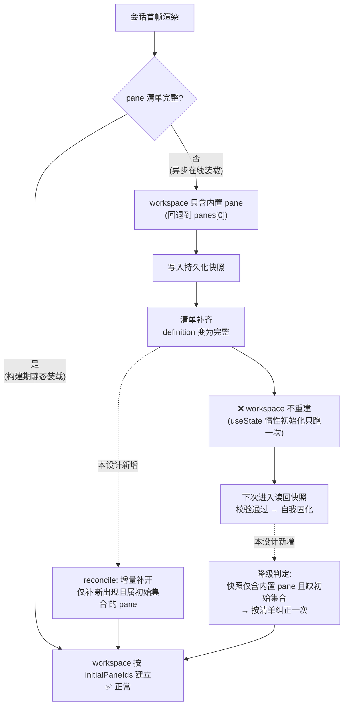
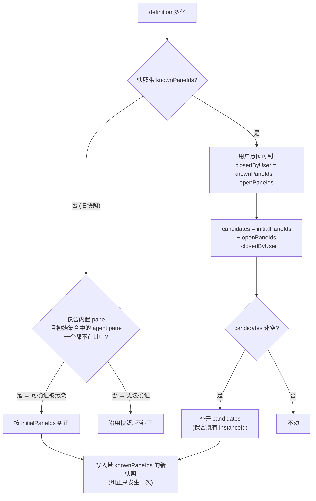
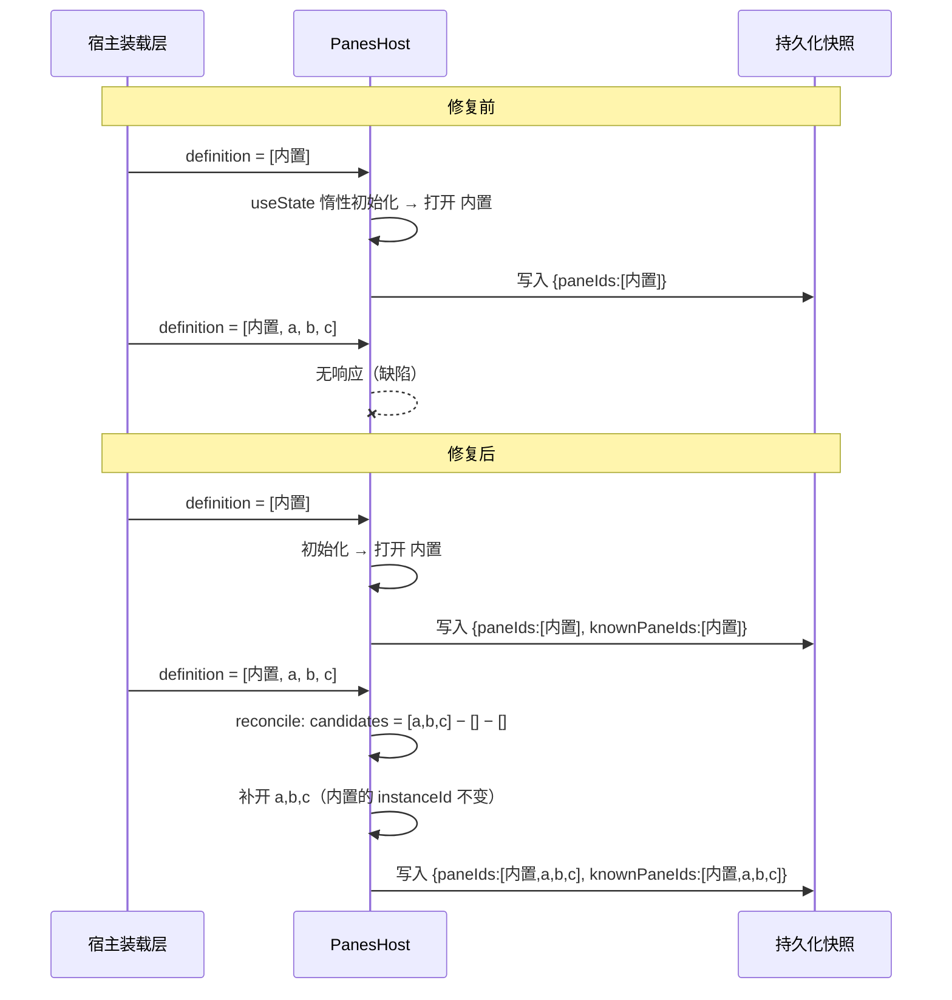

# Design Document

## Overview

**Purpose**：让会话面板的**已打开集合**与 pane 清单保持同步，使 agent 声明为初始打开的 pane 在清单异步补齐后确实出现，同时不破坏「用户手动关闭的 pane 保持关闭」这一既有体验。

**Users**：使用需异步取得 UI 声明的 agent 的最终用户（当前唯一确证受害者是经在线解析装载的 `aigc-agent`），以及所有依赖 `panes-kit` 的宿主形态（浏览器 / 桌面外壳）。

**Impact**：`PanesHost` 的 workspace 从「首帧一次性确定、此后不再跟进」改为「随 pane 清单增量补齐」。持久化快照结构增加一个可选字段以承载用户意图，旧快照走可确证的降级纠正路径。

### Goals

- pane 清单从不完整变为完整时，声明为初始打开且**此前不为用户所知**的 pane 被补开（Req 1）。
- 用户手动关闭的 pane 不因补齐而复现（Req 2）。
- 已被写坏的存量快照可被纠正，且纠正只发生一次（Req 3）。
- 清单在首帧即完整的既有路径、跨会话布局记忆能力、桌面原生呈现，行为均不回退（Req 4）。

### Non-Goals

- 不修改 `mergePaneSources` 的合成规则——其输出经实测正确（返回全部 pane、零拒绝、`initialPaneIds` 正确）。
- 不改动 agent UI 声明的解析、下载、完整性校验与装载门控链路。
- 不加快或保证 pane 清单到达的时机；清单永不到达时只需保持可用（Req 4.5）。
- 不引入新的 pane 标识或命名空间规则；复用既有 `HOST_PANE_ID_PREFIX`。
- 不移除或默认关闭跨会话布局记忆能力。

## Boundary Commitments

### This Spec Owns

- `PanesHost` 内**已打开集合**（`PaneWorkspaceState`）与 `definition` 之间的同步语义。
- 持久化快照的**结构与解释规则**，含新增字段的写入、旧快照的降级判定。
- 「用户主动关闭」与「未曾打开」这一区分的判定依据。

### Out of Boundary

- `mergePaneSources` 的合成规则与 `definePanes` 的校验（既有，不动）。
- webext 解析 / 装载链路（`/api/webext/resolve`、动态 import、SRI 与门控）。
- pane 运行时行为：连接握手、hidden/parked 生命周期、路由授权、主题下发。
- 宿主侧决定「何时把哪份 definition 交给 `PanesHost`」的装载逻辑（`components/chat-app.tsx` / `packages/ui`）——本 spec 只要求在 definition 变化时正确响应，不改变谁在何时提供它。
- **不得顺手修**：`aigc-agent` 仓自身的产物与分支状态、`persistenceKey` 不含 sessionId 导致的跨会话共享语义（那是 agent 的声明选择，另议）。

### Allowed Dependencies

- `packages/panes-kit` 内部既有导出：`HOST_PANE_ID_PREFIX`、`PanesDefinition`、`PaneInstance`、`PaneWorkspaceState`、`reducePaneWorkspace`。
- 浏览器 `localStorage`（既有依赖，不新增存储后端）。
- 不得新增对 `packages/ui`、宿主应用层或任何 agent 侧代码的依赖——`panes-kit` 必须保持可独立消费。

### Revalidation Triggers

以下变化应促使消费方重新校验集成：

- `PersistedPaneWorkspace` 结构再次演进（新增/重命名字段）。
- `PaneWorkspaceState` 或 `PaneInstance` 的形状变化。
- 补齐时机从 `[definition]` effect 迁移到别处。
- 内置命名空间前缀 `HOST_PANE_ID_PREFIX` 取值变化。

## Architecture

### Existing Architecture Analysis

当前 `PanesHost` 的 workspace 建立与维护：

| 环节 | 位置 | 现状 |
|---|---|---|
| 初始建立 | `panes-host.tsx:375` | `useState` 惰性初始化，**仅首次 mount 执行** |
| 持久化恢复 | `panes-host.tsx:253-292` `restoredPaneWorkspace` | 读快照，按 `declared` 集合过滤后逐个构造 instance |
| 无快照回退 | `instances.ts:21-33` `createPaneWorkspace` | `definition.initialPaneIds ?? [definition.panes[0]!.id]` |
| 持久化写入 | `panes-host.tsx:499-517` | effect，依赖 workspace 与 parked，写 `paneIds` / `instanceIds` / `activeIndex` |
| definition 变化响应 | `panes-host.tsx:483-488` | 已有 effect，重置 parked / nativeErrors / hostError，**不触及 workspace** |

必须保持的既有约束：

- **instanceId 稳定性**：`PersistedPaneWorkspace.instanceIds` 的用途是「Native child WebView label seed；跨 route remount 保持一个 pane 一个 WebView」。任何更换既有 instanceId 的方案都会在桌面形态下重建 WebView，**否决整体重建路线**。
- **MRU 顺序语义**：`restoredPaneWorkspace` 刻意按持久化顺序直接构造实例而非逐个 `reduce open`（`open` 会前置，复用会让顺序逐次翻转）。补齐逻辑须遵循同一考量。
- **parked 不入快照**：写入时过滤掉 parked instance，补齐判定须与之一致。

### 缺陷机制与修复位点



**Architecture Integration**：

- 选定模式：**增量协调（reconcile）**，而非重建。新增一个纯函数承载判定，副作用留在既有 effect 内。
- 责任分离：判定逻辑（纯函数，无 React 无 DOM 无存储）与触发时机（既有 `[definition]` effect）分离，使核心规则可被纯函数单测穷举。
- 保留的既有模式：`PaneWorkspaceState` 的 reducer 形态、快照按顺序构造实例、parked 过滤。
- 新增组件理由：`reconcilePaneWorkspace` 是唯一新增单元，因为「补开哪些 pane」的规则有四类输入（当前清单、已打开集合、已知全集、初始集合）与多条分支，内联进 effect 将无法被穷举测试。

## File Structure Plan

### Modified Files

- `packages/panes-kit/src/instances.ts` — 新增纯函数 `reconcilePaneWorkspace`（补齐判定）与其入参类型；`createPaneWorkspace` 不变。
- `packages/panes-kit/src/react/panes-host.tsx` — 三处改动：
  1. `PersistedPaneWorkspace` 增加可选字段 `knownPaneIds`；
  2. `restoredPaneWorkspace` 消费 `knownPaneIds` 并实现旧快照降级判定；
  3. 既有 `useEffect(..., [definition])`（`:483`）内调用 `reconcilePaneWorkspace` 并在有变更时 `setWorkspace`；持久化写入 effect 补写 `knownPaneIds`。
- `packages/panes-kit/src/index.ts` — 导出 `reconcilePaneWorkspace`（与既有 `createPaneWorkspace` / `reducePaneWorkspace` 并列，便于单测与将来复用）。

### New Files

- `packages/panes-kit/test/instances.test.ts` — `reconcilePaneWorkspace` 的纯函数穷举单测（当前 `instances.ts` 无专项测试）。

### Touched Test Files

- `packages/panes-kit/test/panes-host.test.tsx` — 增补时序与持久化集成用例（该文件已覆盖 persistenceKey 相关行为）。

## System Flows

### 补齐判定（核心规则）



关键判定说明：

- `closedByUser = knownPaneIds − openPaneIds`：写快照当时**已知存在**却**未打开**的 pane，只能是用户主动关闭的结果。这是 Req 2.3 要求的区分得以成立的依据。
- `candidates` 三重差集同时满足 Req 1.1（补开新出现的）、Req 1.4（已开的不重开）、Req 2.1/2.2（用户关闭的不复现）。
- 超出 `maxOpenPanes` 时按既有上限规则截断，且**从 candidates 一侧截断**，不动已打开的 instance（Req 1.5）。

### 时序对比



## Requirements Traceability

| Requirement | 摘要 | Components | 关键契约 | Flows |
|---|---|---|---|---|
| 1.1 | 新出现且属初始集合的 pane 被补开 | `reconcilePaneWorkspace` | `candidates` 差集 | 补齐判定 |
| 1.2 | 异步到达与首帧就绪结果无差异 | `reconcilePaneWorkspace` + `[definition]` effect | — | 时序对比 |
| 1.3 | 补齐不改变排列顺序约定 | `reconcilePaneWorkspace` | 追加而非前置（沿用快照顺序语义） | 补齐判定 |
| 1.4 | 已打开的不重复打开 | `reconcilePaneWorkspace` | `− openPaneIds` | 补齐判定 |
| 1.5 | 超上限时不丢弃已可见 pane | `reconcilePaneWorkspace` | 从 candidates 侧截断 | 补齐判定 |
| 2.1 | 同会话内关闭后不自动重开 | `reconcilePaneWorkspace` | `closedByUser` 差集 | 补齐判定 |
| 2.2 | 跨会话关闭状态保持 | `restoredPaneWorkspace` + `knownPaneIds` | 持久化结构 | 补齐判定 |
| 2.3 | 两类「未打开」必须可区分 | `PersistedPaneWorkspace.knownPaneIds` | 新增字段 | 补齐判定 |
| 2.4 | 清单实质变化时行为可预期 | `reconcilePaneWorkspace` | 纯函数，同输入同输出 | 补齐判定 |
| 3.1 | 可确证被污染的旧快照被纠正 | `restoredPaneWorkspace` | 降级判定（仅含 `host:` 前缀 + 初始集合缺失） | 补齐判定 |
| 3.2 | 纠正只发生一次 | 持久化写入 effect | 纠正后写入带 `knownPaneIds` 的快照 | 补齐判定 |
| 3.3 | 相称的快照不得被丢弃 | `restoredPaneWorkspace` | 降级判定的否定分支 | 补齐判定 |
| 3.4 | 无快照时直接按初始集合 | `createPaneWorkspace` | 既有行为，不变 | — |
| 4.1 | 首帧就绪路径行为不变 | `reconcilePaneWorkspace` | `candidates` 为空即 no-op | 时序对比 |
| 4.2 | 保留跨会话布局记忆能力 | `PersistedPaneWorkspace` | 字段新增而非替换 | — |
| 4.3 | 桌面原生形态行为一致 | `reconcilePaneWorkspace` | **既有 instanceId 不变**（WebView 不重建） | — |
| 4.4 | 无 agent pane 时行为不变 | `reconcilePaneWorkspace` | `candidates` 为空即 no-op | — |
| 4.5 | 清单永不到达时保持可用 | `[definition]` effect | 无 definition 变化即不触发 | — |
| 5.1 | 覆盖「清单后到」时序 | Testing Strategy | 显式 rerender 构造 | — |
| 5.2 | 覆盖存量污染快照 | Testing Strategy | 预置旧格式快照 | — |
| 5.3 | 覆盖关闭后重进 | Testing Strategy | 预置带 `knownPaneIds` 的快照 | — |
| 5.4 | 时序条件须显式呈现 | Testing Strategy | 测试以 rerender 而非真实网络构造时序 | — |

## Components and Interfaces

| Component | Layer | Intent | Req Coverage | Contracts |
|---|---|---|---|---|
| `reconcilePaneWorkspace` | panes-kit / 纯逻辑 | 依据四类输入算出应补开的 pane 与新 workspace | 1.1–1.5, 2.1, 2.4, 4.1, 4.3, 4.4 | Service |
| `PersistedPaneWorkspace` | panes-kit / 持久化契约 | 承载已打开集合与**当时已知全集** | 2.2, 2.3, 3.2, 4.2 | State |
| `restoredPaneWorkspace` | panes-kit / React | 读快照建初始 workspace，含旧快照降级判定 | 2.2, 3.1, 3.3, 3.4 | Service |

### panes-kit / 纯逻辑

#### reconcilePaneWorkspace

| Field | Detail |
|---|---|
| Intent | 在 pane 清单变化后，算出应补开哪些 pane 并返回新的 workspace 状态 |
| Requirements | 1.1, 1.2, 1.3, 1.4, 1.5, 2.1, 2.4, 4.1, 4.3, 4.4 |

**Responsibilities & Constraints**

- 纯函数：不触碰 React、DOM、存储、时间、随机源；instanceId 由调用方注入的工厂产生。
- **只增不减**：绝不关闭、移除或重排既有 instance；既有 instance 的 `instanceId` 与相对顺序原样保留（Req 4.3 的机械保证）。
- 无补开对象时**返回原状态引用本身**（而非等值新对象），使调用方可用引用相等跳过 `setWorkspace`，避免无谓重渲染（Req 4.1 / 4.4 的 no-op 语义）。

**Service Interface**

```typescript
export interface ReconcilePaneWorkspaceInput {
  /** 当前（可能已补齐的）pane 清单。 */
  readonly definition: PanesDefinition;
  /** 当前已打开集合。 */
  readonly state: PaneWorkspaceState;
  /**
   * 上次写快照时 definition 已知的全部 pane id。
   * `undefined` 表示无从判断（旧快照或本会话尚未写过快照）——
   * 此时不推导用户意图，仅补开「初始集合中尚未打开」的 pane。
   */
  readonly knownPaneIds: readonly string[] | undefined;
  /** 生成新 instance 的 id 工厂（与既有 createPaneWorkspace 同形）。 */
  readonly idFactory: (paneId: string) => string;
}

export function reconcilePaneWorkspace(
  input: ReconcilePaneWorkspaceInput,
): PaneWorkspaceState;
```

- **Preconditions**：`state.instances` 中的每个 `paneId` 都仍存在于 `definition.panes`（由调用方的既有过滤保证）。
- **Postconditions**：
  - 返回值的 instance 列表以入参 `state.instances` 为前缀，其后追加零个或多个新 instance；
  - `activeInstanceId` 不变（补开不夺焦点）；
  - 补开数量使总数不超过 `definition.maxOpenPanes`。
- **Invariants**：入参 `state` 中出现过的 `instanceId` 必定原样出现在返回值中，且相对顺序不变。

**Implementation Notes**

- Integration：唯一调用方是 `panes-host.tsx` 的 `[definition]` effect。
- Validation：`candidates` 计算完毕后若为空，直接 `return state`（引用相等）。
- Risks：`knownPaneIds` 为 `undefined` 时无法识别「用户关闭」，会把用户关掉但属初始集合的 pane 重新打开一次；该窗口仅存在于**尚未写过新格式快照**的首个会话，写入后即消失。此权衡已在 research.md 记录。

### panes-kit / 持久化契约

#### PersistedPaneWorkspace

**State Management**

```typescript
interface PersistedPaneWorkspace {
  readonly paneIds: readonly string[];
  /** Native child WebView label seed; keeps one WebView per pane across route remounts. */
  readonly instanceIds?: readonly string[];
  readonly activeIndex?: number;
  /**
   * 写入本快照时 definition 中的**全部** pane id。
   * `knownPaneIds − paneIds` 即「用户见过但选择不开」的集合。
   * 可选：旧快照没有该字段，读取方须走降级判定。
   */
  readonly knownPaneIds?: readonly string[];
}
```

- **Persistence & consistency**：`knownPaneIds` 与 `paneIds` 必须在**同一次写入**中产生，避免撕裂快照。
- **Backward compatibility**：字段可选。旧代码读新快照时忽略该字段，行为与今日一致；新代码读旧快照时该字段为 `undefined`，走降级判定。

### panes-kit / React

#### restoredPaneWorkspace（改造）

| Field | Detail |
|---|---|
| Intent | 从快照建立初始 workspace；识别并纠正可确证被污染的旧快照 |
| Requirements | 2.2, 3.1, 3.3, 3.4 |

**降级判定（仅在 `knownPaneIds === undefined` 时执行）**

同时满足下列全部条件才判定为「可确证被污染」：

1. 快照 `paneIds` 非空，且其中**每一个** id 都以 `HOST_PANE_ID_PREFIX` 开头；
2. `definition.initialPaneIds` 非空，且其中**至少一个** id 不以 `HOST_PANE_ID_PREFIX` 开头（即存在 agent 声明的初始 pane）；
3. 上述 agent 初始 pane **无一** 出现在快照 `paneIds` 中。

判定成立 → 忽略该快照，按 `createPaneWorkspace(definition, …)` 建立；否则沿用快照（Req 3.3）。

**Implementation Notes**

- Validation：判定条件刻意收窄到缺陷的唯一产物特征。正常使用中用户不可能把全部 agent pane 关掉却恰好只留内置 pane——即便发生，纠正也只影响一次，且随后写入的新格式快照会记录其真实意图。
- Risks：若将来出现「仅提供内置 pane 且 agent 初始集合为空」的形态，条件 2 不成立，判定自动不触发，无需额外分支。

## Error Handling

- **快照 JSON 解析失败 / 结构不符**：沿用既有 `try/catch` → 回退 `createPaneWorkspace`。新增字段不改变该路径。
- **`knownPaneIds` 含已不存在的 pane id**：不报错。差集运算对陌生 id 天然免疫（它既不在 `definition` 也不会被补开）。
- **补齐后超出 `maxOpenPanes`**：不抛错，按上限截断 candidates 并保留全部既有 instance（Req 1.5）。
- **`localStorage` 不可用**（隐私模式/禁用）：既有代码已按 `persistenceKey === undefined || typeof window === "undefined"` 短路；补齐逻辑不依赖存储，`knownPaneIds` 为 `undefined` 时仍能按初始集合补开。

## Testing Strategy

测试项从验收标准派生，非通用模板。测试命令按 steering 分档：实现者用 `node scripts/scoped-test.mjs <paths>`，复查者跑 `pnpm test` **+** `pnpm test:app`。

### Unit Tests（`packages/panes-kit/test/instances.test.ts`，新建）

1. **补开新出现的初始 pane**：`state` 只含内置 pane、`definition` 补齐后含 agent pane 且在 `initialPaneIds` 中 → 返回值包含全部 agent 初始 pane（Req 1.1）。
2. **既有 instance 身份不变**：断言补齐前后既有 `instanceId` 集合与相对顺序**逐一相等**——这是桌面 WebView 不被重建的机械保证（Req 4.3）。
3. **用户关闭的不复现**：`knownPaneIds` 含某 pane 而 `state` 未打开它 → 该 pane 不在返回值中（Req 2.1）。
4. **无可补开时返回同一引用**：`expect(result).toBe(state)`（Req 4.1 / 4.4 的 no-op 语义，引用相等是可机械断言的强判据）。
5. **超上限从 candidates 侧截断**：既有 instance 全部保留，candidates 被截断（Req 1.5）。
6. **`knownPaneIds` 为 `undefined` 时的降级行为**：只补「初始集合中未打开」的，不推导用户意图（Req 2.3 的边界情形）。

### Integration Tests（`packages/panes-kit/test/panes-host.test.tsx`，增补）

1. **清单后到**：以初始 `definition`（仅内置）渲染，断言只开内置；**rerender 传入补齐后的 definition**，断言 agent 初始 pane 全部出现（Req 1.2、5.1）。时序由 rerender 显式构造，不依赖任何真实网络时机（Req 5.4）。
2. **存量污染快照被纠正**：预置**旧格式**快照 `{"paneIds":["host:session-info"]}`（无 `knownPaneIds`），以完整 definition 渲染 → 按 `initialPaneIds` 呈现，且写回的快照带 `knownPaneIds`（Req 3.1、3.2、5.2）。
3. **相称的快照不被丢弃**：预置带 `knownPaneIds` 且与 definition 相称的快照 → 原样沿用（Req 3.3）。
4. **关闭后重进保持关闭**：预置 `knownPaneIds` 含某 pane 而 `paneIds` 不含 → 该 pane 保持关闭（Req 2.2、5.3）。
5. **首帧即完整的路径不变**：以完整 definition 首次渲染 → 结果与修复前一致（Req 4.1）。

### E2E / 真机验证

1. **aigc-agent 实机**：清空该 agent 的布局记录后进入会话，四个声明 pane 全部打开；reload 后仍然全部打开（Req 1.2）。**必须复测 reload**——排查期间曾出现「新建会话偶然全开、reload 打回原形」，只测一次进入会漏掉竞态（Req 5.4）。
2. **panes-agent 实机对照**：静态装载车道行为与修复前一致（Req 4.1）。

### 回归判据

- `pnpm test` **+** `pnpm test:app` 两条都跑（steering 明示：只跑其一会漏子包的红，且与全绿长得一样）。
- 汇总行须做算术核对：`failed + passed + skipped === 总数`，文件数与用例数各算一遍。
