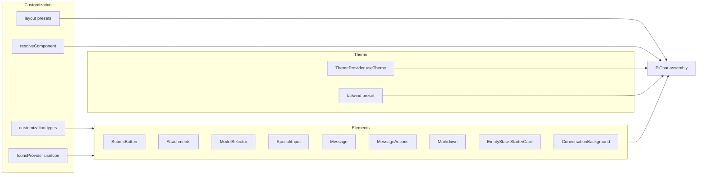
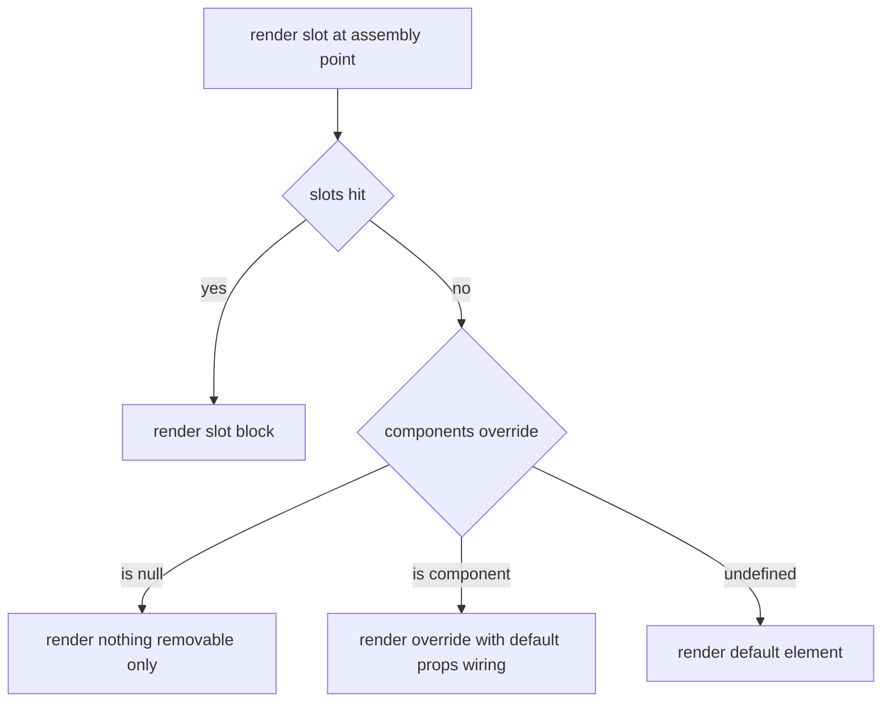
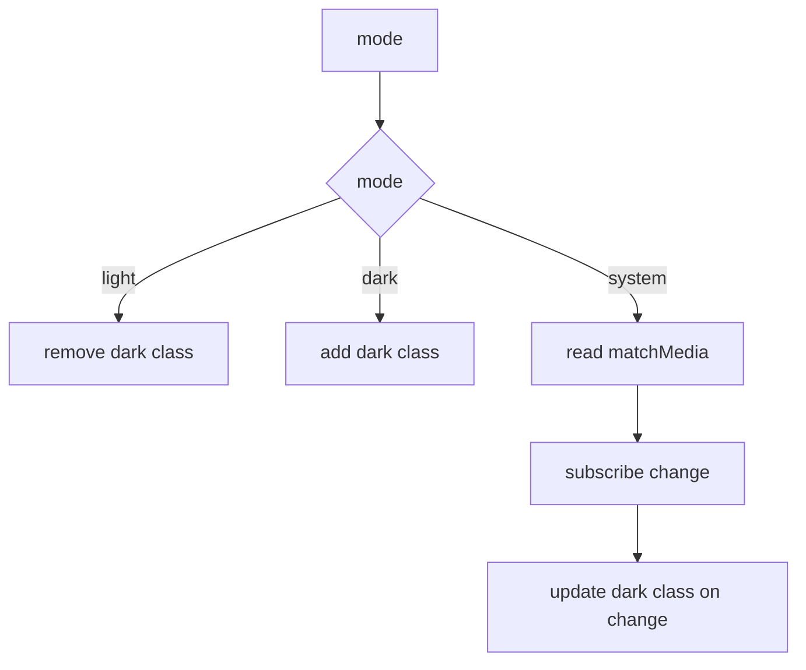

# Design Document — pi-chat-customization

## Overview

**Purpose**: 为 `@blksails/pi-web-ui` 的 `PiChat` 提供一套面向集成方开发者的「四维可定制契约」(主题、slots、components、layout/icons),使其在**不修改 `@blksails/pi-web-ui` 源码**的前提下完成外观与装配定制。

**Users**: 集成方开发者将通过 `PiChat` 的公开 props 与一个 `ThemeProvider`、一份 Tailwind preset 接入定制能力;agent 作者不受影响(外观不再由 agent 驱动)。

**Impact**: 在既有装配组件 `PiChat`(`packages/ui/src/chat/pi-chat.tsx`)上**非破坏式新增**注入点。现有 `slots`(header/footer/sidebar/messageActions)、三个渲染注册表、CSS 变量用法保持原状仍可运行;所有新增 props 可选,缺省即等于现行为。

### Goals
- 细粒度组件覆盖(`components`):单独替换原子组件并复用其余装配与数据接线;支持按 role 替换消息;支持 `null` 移除可选控件。
- 主题运行时:`ThemeProvider` 支持 light/dark/system(跟随系统且运行时更新);导出 Tailwind preset 供下游一行接入。
- slots 扩展:新增 `background`、`empty` 两个整块插槽。
- layout 预设(centered/wide/full/split)与 icons 图标主题。
- 确定的解析优先级 `slots > components > 默认`,并以测试固化关键路径与向后兼容。

### Non-Goals
- agent 驱动外观(`emitAppearance`/`ambient.appearance`/agent 自带组件)—— 不实现。
- 协议层 / server 层 / `@blksails/pi-web-react` / `@blksails/pi-web-agent-kit` 改动 —— 不涉及。
- 多 PiChat 实例打包形态(工厂/预设变体/preset 对象)—— 本期搁置。
- Artifact 分栏专属功能 —— `split` 仅提供让位区骨架,内容由现有 slots/children 承接。
- 任意自定义 grid template / 任意 CSS 注入 —— 超范围。

## Boundary Commitments

### This Spec Owns
- `PiChat` 新增公开 props 的契约:`components`、`icons`、`layout`、`theme` 透传,以及 `slots.background` / `slots.empty`。
- 定制解析逻辑:`resolveComponent` 的 `slots > components > 默认` 优先级。
- `ThemeProvider` / `useTheme` 的运行时主题行为(明暗 + 跟随系统)。
- `@blksails/pi-web-ui/tailwind-preset` 导出物。
- `IconTheme` 契约与 `useIcon` 注入机制;各 element 的图标取值方式。
- 上述能力的公共 TypeScript 契约类型导出。

### Out of Boundary
- 任何后端/协议/react/agent-kit 行为;agent 渲染管线(`data-pi-ui`、`extension-ui`)语义不变。
- 多实例打包、Artifact 功能、自定义布局骨架、任意样式注入。
- `settings.theme` 取值的来源与持久化(本 spec 仅消费三值之一)。

### Allowed Dependencies
- 既有 element 组件及其 props 类型(`packages/ui/src/elements/*`)。
- 既有 CSS 变量与 `tailwind.config.ts` 令牌映射。
- `react`、`lucide-react`(作为默认图标回退)。
- 依赖方向(严格,左→右,不可反向):`customization 类型/theme/icons` → `elements` → `chat(PiChat)`。

### Revalidation Triggers
- 任一可覆盖 element 的 props 契约形状变化(覆盖者需重校验)。
- `IconSlot` 枚举或 `LayoutPreset` 取值增减。
- `resolveComponent` 优先级规则变化。
- CSS 令牌名变化或 preset 导出结构变化(下游 tailwind 配置需重校验)。

## Architecture

### Existing Architecture Analysis
- `PiChat` 是无状态装配层:用 `useChat` + `@blksails/pi-web-react` hooks 取数据,组合 element 层并以固定 props 接线。定制只需在**装配点**替换实现,不动 hooks。
- 主题为 shadcn 约定:`darkMode:"class"` + `hsl(var(--token))`;缺运行时切换与 preset 导出。
- 既有扩展点:`slots`(整块)、`RendererRegistry`(按 part 类型)。本设计新增第三种粒度——`components`(按组件位),三者同构共存。

### Architecture Pattern & Boundary Map



**Architecture Integration**:
- Selected pattern: 装配层注入(injection at assembly)+ React context(图标/主题)。
- Boundaries: customization/theme 只定义契约与解析;elements 提供默认实现与图标接入点;PiChat 负责在装配点解析与下发。无跨层共享所有权。
- Existing patterns preserved: 无状态 element + 装配层接线;`slots` 与注册表语义不变;`cn()` 合并 className;CSS 变量驱动配色。
- New components rationale: `resolveComponent`(统一优先级)、`ThemeProvider`(运行时明暗)、`IconsProvider`(集中替换图标)、`tailwind-preset`(一行接入)、`ConversationBackground`/`EmptyState`/`StarterCard`(新增可覆盖位)。
- Dependency direction enforced: `customization → elements → chat`,禁止反向 import。

### Technology Stack

| Layer | Choice / Version | Role in Feature | Notes |
|-------|------------------|-----------------|-------|
| Frontend | React 18+ (existing) | 组件覆盖、context 注入 | 复用现有 |
| Frontend | Tailwind CSS (existing) + preset export | 令牌映射一行接入 | 抽出 `theme.extend` |
| Frontend | lucide-react (existing) | 默认图标回退 | 仅作 fallback |
| Test | vitest + @testing-library/react + jsdom | 组件/集成测 | 既有 `packages/ui/test` |
| Test (E2E) | Playwright (root) | 主题切换浏览器路径 | 隔离 build 模式 |

## File Structure Plan

### Directory Structure
```
packages/ui/
├── tailwind-preset.ts                      # 新增:导出 theme.extend(colors/borderRadius/darkMode)供下游 presets:[]
├── src/
│   ├── customization/                      # 新增域:定制契约与解析
│   │   ├── component-overrides.ts          # ComponentOverrides 类型 + resolveComponent(override, Default)
│   │   ├── icons.tsx                       # IconSlot/IconTheme/IconProps、IconsProvider、useIcon(slot, fallback);不内置默认图标
│   │   ├── layout.ts                       # LayoutPreset 类型 + layoutClassNames 映射
│   │   └── index.ts                        # 域内汇出
│   ├── theme/                              # 新增域:运行时主题
│   │   ├── theme-provider.tsx              # ThemeProvider + useTheme(light/dark/system + matchMedia)
│   │   └── index.ts
│   ├── chat/
│   │   ├── slots.ts                        # 修改:新增 background、empty
│   │   ├── part-renderer.tsx               # 修改:新增 markdown / reasoning prop(文本/思考 part 可覆盖位)
│   │   └── (parts/pi-reasoning.tsx 增强:streamingAutoOpen + getThinkingMessage,对齐 ai-sdk Reasoning)
│   │   └── pi-chat.tsx                     # 修改:接 components/icons/layout/theme + ToolbarControl/toolbarOrder,装配点 resolve
│   ├── elements/
│   │   ├── submit-button.tsx               # 修改:useIcon(send/stop/retry)
│   │   ├── attachments.tsx                 # 修改:useIcon(attach/removeAttachment)
│   │   ├── model-selector.tsx              # 修改:useIcon(model/modelCheck)
│   │   ├── speech-input.tsx                # 修改:useIcon(speech)
│   │   ├── web-search-toggle.tsx           # 修改:useIcon(webSearch)
│   │   ├── message.tsx                     # 修改:新增 messageActions prop 注入操作区
│   │   ├── message-actions.tsx             # 新增:抽出复制/赞/踩;useIcon(copy/copied/thumbUp/thumbDown)
│   │   ├── conversation-background.tsx     # 新增:背景层位(默认返回 null)
│   │   ├── empty-state.tsx                 # 新增:抽出空态/欢迎页为 EmptyState
│   │   ├── starter-card.tsx                # 新增:空态单卡可覆盖位
│   │   ├── markdown.tsx                    # 新增:re-export Response 为可覆盖 Markdown 位
│   │   └── index.ts                        # 修改:导出新增可覆盖位
│   └── index.ts                            # 修改:导出定制契约(ThemeProvider/IconsProvider/类型/ToolbarControl)
│
tailwind.config.ts(仓库根)                 # 修改:presets:[piWebPreset]
app/theme-controls.tsx                       # 新增:ThemeProvider + data-pi-theme-toggle(浏览器 e2e 入口)
app/layout.tsx                               # 修改:用 ThemeControls 包裹
e2e/browser/theme-toggle.e2e.ts              # 新增:主题切换浏览器 e2e
```

### Modified Files
- `packages/ui/src/chat/pi-chat.tsx` — 在装配点用 `resolveComponent` 取实现;新增 `components/icons/layout/theme` props;空态/会话态/工具条改为引用可覆盖位;`split` 布局划让位区。
- `packages/ui/src/chat/slots.ts` — `PiChatSlots` 增 `background?: ReactNode`、`empty?: ReactNode`。
- `packages/ui/src/elements/*.tsx` — 图标改用 `useIcon(slot, FallbackLucide)`;`message.tsx` 抽出 `MessageActions`;新增 `EmptyState`/`StarterCard`/`ConversationBackground`/`Markdown` 位。
- `packages/ui/tailwind.config.ts` — `presets: [piWebPreset]`,移除重复内联映射。
- `packages/ui/src/index.ts` — 汇出 `ThemeProvider/useTheme/IconsProvider/IconTheme/IconSlot/LayoutPreset/ComponentOverrides/各覆盖位 props 类型`。

## Requirements Traceability

| Requirement | Summary | Components | Interfaces | Flows |
|-------------|---------|------------|------------|-------|
| 1.1–1.3 | 向后兼容/全可选 | PiChat、resolveComponent | `resolveComponent` 缺省回退默认 | 解析优先级 |
| 2.1–2.5 | 明暗/跟随系统 | ThemeProvider | `ThemeProviderProps.mode` | 主题切换流 |
| 3.1–3.3 | 令牌/preset | tailwind-preset、CSS 变量 | `piWebPreset` 导出 | — |
| 4.1–4.4 | slots background/empty | PiChat、slots | `PiChatSlots.background/empty` | 解析优先级 |
| 5.1–5.5 | 细粒度覆盖/按 role/null | ComponentOverrides、resolveComponent、Message | `ComponentOverrides` | 解析优先级 |
| 6.1–6.4 | 工具条装配/排序 | PiChat、toolbar 装配 | `components.*` + `toolbarOrder` | 工具条装配流 |
| 7.1–7.4 | layout 预设 | layout.ts、PiChat | `LayoutPreset` + className 映射 | — |
| 8.1–8.3 | icons 主题 | IconsProvider、useIcon、elements | `IconTheme`、`useIcon` | 图标解析流 |
| 9.1–9.4 | 解析优先级 | resolveComponent | `resolveComponent` | 解析优先级 |
| 10.1–10.5 | e2e 可验证 | 测试套件 | — | 测试策略 |

## Components and Interfaces

| Component | Domain/Layer | Intent | Req Coverage | Key Dependencies (P0/P1) | Contracts |
|-----------|--------------|--------|--------------|--------------------------|-----------|
| component-overrides | Customization | 定义覆盖映射与优先级解析 | 1, 5, 9 | slots(P0) | State/Service |
| icons | Customization | 图标契约与 context 注入 | 8 | lucide-react(P1) | State |
| layout | Customization | 布局预设→className | 7 | — | Service |
| ThemeProvider | Theme | 运行时明暗/跟随系统 | 2 | matchMedia(P0) | State |
| tailwind-preset | Theme | 令牌映射一行接入 | 3 | tailwind(P0) | Service |
| PiChat(改) | Chat | 装配点解析与下发 | 1,4,5,6,7,9 | 上述全部(P0) | State |
| ConversationBackground/EmptyState/StarterCard/Markdown/MessageActions | Elements | 新增/抽出可覆盖位 | 4,5 | useIcon(P1) | (presentational) |

### Customization

#### component-overrides

| Field | Detail |
|-------|--------|
| Intent | 定义 `ComponentOverrides` 与 `resolveComponent` 优先级解析 |
| Requirements | 1.1, 1.3, 5.1, 5.2, 5.3, 5.5, 9.1, 9.2, 9.3, 9.4 |

**Responsibilities & Constraints**
- 定义可覆盖组件位的映射类型;每个位的覆盖组件复用对应默认 element 的 props 类型(契约不变)。
- `resolveComponent` 实现 `slots(整块) > components(细粒度) > 默认`;Message 按 role 子映射;`null` 表示移除(仅对可移除控件位)。
- 不引入新数据流;不持有状态。

**Contracts**: Service [x] / State [x]

##### Service Interface
```typescript
import type { ComponentType } from "react";
import type {
  SubmitButtonProps, AttachmentsProps, ModelSelectorProps,
  SpeechInputProps, WebSearchToggleProps, MessageProps,
  MessageActionsProps, MarkdownProps, EmptyStateProps,
  StarterCardProps, ConversationBackgroundProps,
} from "../elements/index.js";

export type MessageRole = "user" | "assistant" | "system";

/** 可被 null 移除的可选输入区控件位。 */
export type RemovableSlotKey = "Attachments" | "ModelSelector" | "SpeechInput" | "WebSearchToggle";

export interface ComponentOverrides {
  readonly SubmitButton?: ComponentType<SubmitButtonProps>;
  readonly Attachments?: ComponentType<AttachmentsProps> | null;
  readonly ModelSelector?: ComponentType<ModelSelectorProps> | null;
  readonly SpeechInput?: ComponentType<SpeechInputProps> | null;
  readonly WebSearchToggle?: ComponentType<WebSearchToggleProps> | null;
  /** 按 role 替换;未提供的 role 回退默认 Message 渲染。 */
  readonly Message?: Partial<Record<MessageRole, ComponentType<MessageProps>>>;
  readonly MessageActions?: ComponentType<MessageActionsProps>;
  readonly Markdown?: ComponentType<MarkdownProps>;
  /** 思考块外观(reasoning part);默认 PiReasoning,参考 ai-sdk Reasoning。 */
  readonly Reasoning?: ComponentType<PiReasoningProps>;
  readonly EmptyState?: ComponentType<EmptyStateProps>;
  readonly StarterCard?: ComponentType<StarterCardProps>;
  readonly ConversationBackground?: ComponentType<ConversationBackgroundProps>;
}

/**
 * 解析某组件位的最终实现。
 * @returns 组件实现;`null` 表示该位被显式移除;`undefined` 不会出现(总回退 Default)。
 */
export function resolveComponent<P>(
  override: ComponentType<P> | null | undefined,
  Default: ComponentType<P>,
): ComponentType<P> | null;
```
- Preconditions: 覆盖组件遵守对应 props 契约。
- Postconditions: `override===null` → 返回 `null`(移除);`override` 为组件 → 返回它;否则返回 `Default`。
- Invariants: 整块 `slots` 命中优先于 `components`(在 PiChat 装配点先判 slot)。

**Implementation Notes**
- Integration: PiChat 在每个装配点先看 `slots`(整块替换),再 `resolveComponent` 看 `components`,否则默认。
- Validation: 单测覆盖三态(slot/override/默认)+ `null` 移除 + Message 按 role 回退。
- Risks: 覆盖位 props 漂移 → 由导出 props 类型在编译期约束。

#### icons

| Field | Detail |
|-------|--------|
| Intent | 图标位契约 + context 注入 + 默认 lucide 回退 |
| Requirements | 8.1, 8.2, 8.3 |

**Contracts**: State [x]

##### State Management
```typescript
import type { ComponentType, SVGProps } from "react";

export type IconProps = SVGProps<SVGSVGElement> & { readonly className?: string };

export type IconSlot =
  | "send" | "stop" | "retry"
  | "attach" | "removeAttachment"
  | "model" | "modelCheck"
  | "speech" | "webSearch"
  | "copy" | "copied" | "thumbUp" | "thumbDown";

export type IconTheme = Partial<Record<IconSlot, ComponentType<IconProps>>>;

export const IconsProvider: ComponentType<{ icons?: IconTheme; children: React.ReactNode }>;

/** 取某图标位实现:命中主题用主题,否则用 fallback(既有 lucide)。 */
export function useIcon(slot: IconSlot, fallback: ComponentType<IconProps>): ComponentType<IconProps>;
```
- State model: context 持有 `IconTheme`(默认空 → 全部回退)。
- Concurrency: 纯读;无写。

**Implementation Notes**
- Integration: 各 element 把硬编码 `<ArrowUp/>` 改为 `const Send = useIcon("send", ArrowUp); <Send .../>`;尺寸/`aria-label` 由 element 保留(R8.3)。
- Validation: 单测验证主题命中与缺省回退;a11y 标签不变。

#### layout

| Field | Detail |
|-------|--------|
| Intent | 布局预设枚举 → 容器/消息区 className |
| Requirements | 7.1, 7.2, 7.3, 7.4 |

**Contracts**: Service [x]

##### Service Interface
```typescript
export type LayoutPreset = "centered" | "wide" | "full" | "split";

export interface LayoutClassNames {
  readonly root: string;        // 外层容器
  readonly content: string;     // 消息区最大宽度/对齐
  readonly hasAside: boolean;   // split 为 true:划出让位区
}

/** 默认 "centered" 等价于现行版面(max-w-3xl 居中)。 */
export function layoutClassNames(preset: LayoutPreset | undefined): LayoutClassNames;
```
- Postconditions: `undefined`/`"centered"` → 现行 `max-w-3xl`;`wide` → 更宽;`full` → 满宽;`split` → `hasAside:true`,让位区由 `slots`/children 承接。

### Theme

#### ThemeProvider

| Field | Detail |
|-------|--------|
| Intent | 运行时明暗 + 跟随系统 |
| Requirements | 2.1, 2.2, 2.3, 2.4, 2.5 |

**Contracts**: State [x]

##### State Management
```typescript
export type ThemeMode = "light" | "dark" | "system";

export interface ThemeProviderProps {
  readonly mode?: ThemeMode;                 // 默认 "system"(R2.4)
  readonly element?: HTMLElement;            // 默认 document.documentElement
  readonly children: React.ReactNode;
}

export const ThemeProvider: React.ComponentType<ThemeProviderProps>;

export interface UseThemeResult {
  readonly mode: ThemeMode;                  // 集成方设定值
  readonly resolved: "light" | "dark";       // system 解析后的实际明暗
}
export function useTheme(): UseThemeResult;
```
- State model: 依 `mode` 切换 `element` 的 `dark` class;`mode==="system"` 时读取并监听 `matchMedia("(prefers-color-scheme: dark)")`,变化时更新 `resolved`(R2.3)。
- Persistence: 不持久化;`mode` 由集成方(可来自 `settings.theme`)提供。
- Concurrency: 挂载即应用;卸载清理监听。

**Implementation Notes**
- Integration: 集成方在应用根包裹 `<ThemeProvider mode={...}>`;`PiChat` 不强制依赖它(缺省 = 现行 CSS 行为);可选透传 `theme` prop 由 PiChat 内部包裹(便于单测)。
- Validation: 单测 mock `matchMedia` 验证三模式与运行时变化;e2e 在真实浏览器验证 dark/light 切换。
- Risks: FOUC —— 文档化"宿主可在 `<head>` 内联预置 class";本期不强制。

#### tailwind-preset

| Field | Detail |
|-------|--------|
| Intent | 导出 `theme.extend`(colors/borderRadius/darkMode)供下游 `presets:[]` |
| Requirements | 3.1, 3.2, 3.3 |

**Contracts**: Service [x]
- 导出 `piWebPreset: Partial<Config>`,含 `darkMode:"class"` 与 `hsl(var(--*))` colors、`borderRadius` 映射;`packages/ui/tailwind.config.ts` 改为 `presets:[piWebPreset]`(行为等价,R1)。

### Elements(新增/抽出位 — presentational)

- `ConversationBackground`(`ConversationBackgroundProps{ className?: string }`):渲染于消息层之下(`absolute inset-0 -z-10`),默认无背景(透明),不拦截交互(R4.1)。
- `EmptyState`(`EmptyStateProps{ title; subtitle; starters; onFill; onSend; input?: ReactNode }`):抽出现空态结构;`StarterCard`(`StarterCardProps{ item: Suggestion; onPick(value) }`)抽出单卡。
- `MessageActions`(`MessageActionsProps{ copyText?; onFeedback?(v) }`):抽出现内置复制/赞/踩。
- `Markdown`(`MarkdownProps{ children: string }`):封装现 `Response`(Streamdown)。
- 以上默认实现与现状视觉一致(R1.1);仅当被 `slots`/`components` 覆盖时替换。

## System Flows

### 组件位解析(slots > components > 默认)


### 主题解析


## Testing Strategy

> 测试项来自 requirements 验收标准,主力落 `packages/ui/test`(vitest + RTL + jsdom);浏览器关键路径落根层 Playwright(隔离 build)。

### Unit Tests
- `resolveComponent`:slot 优先、override 命中、`null` 移除、`undefined` 回退默认(9.1–9.4, 5.4, 5.5)。
- `layoutClassNames`:四预设返回值与 `split.hasAside`,缺省等价 centered(7.1–7.4)。
- `useIcon`/`IconsProvider`:主题命中与缺省回退 lucide(8.1, 8.2)。
- `ThemeProvider`:light/dark/system 三模式切换 `dark` class,`system` 下 `matchMedia` 变化触发更新(mock matchMedia)(2.1–2.4)。

### Integration Tests (RTL, `packages/ui/test/customization/`)
- 提供 `components.SubmitButton` 后渲染自定义发送键而非默认(5.1, 10.1)。
- `components.Message.user` 替换 user 消息,assistant 回退默认(5.3)。
- `components.SpeechInput=null` 后该控件不渲染,其余工具条可用(5.4, 6.4)。
- `slots.background`/`slots.empty` 分别替换背景层与空态(空消息时)(4.1–4.3, 10.3)。
- `layout` 预设改变 `data-pi-chat-messages` 容器宽度类(7.2, 10.4)。
- `icons` 主题替换发送图标且保留 `aria-label`(8.1, 8.3)。
- **向后兼容回归**:不传任何新增入口时,DOM 结构与现行快照一致(1.1–1.3, 10.5)。
- 优先级:同位同时给 `slots` 与 `components` → 取 slot(9.1)。

### E2E (Playwright, `e2e/browser/theme-toggle.e2e.ts`)
- 真实浏览器下点击 `data-pi-theme-toggle`,断言 `<html>` 的 `dark` 类切换(light→dark→light)(2.1, 2.2, 10.2)。app shell 经 `app/theme-controls.tsx` 用 `ThemeProvider` 包裹并暴露该控件。
- **运行方式(已实现并通过)**:dev 在跑时用隔离 build——`NEXT_DIST_DIR=.next-e2e next build` + 外部 server(`PI_WEB_E2E_EXTERNAL_SERVER=1`,fs 后端 3100)+ `playwright test theme-toggle --project=fs`。实测 **1 passed**(无 docker)。参见 memory `pi-web-e2e-isolated-build`。

## Error Handling
- 覆盖组件抛错:不在装配层吞错;由 React 错误边界(宿主既有策略)处理。本设计不新增错误态。
- `null` 仅对 `RemovableSlotKey` 合法;对非可移除位(如 SubmitButton)类型层不接受 `null`。
- 主题:`matchMedia` 不可用(老环境)时,`system` 回退 `light` 且不抛错(graceful degradation)。

## Open Questions / Risks
- 图标改造涉及多个 element,逐个迁移并以单测护栏防回归(已在任务边界拆分)。
- `theme` 透传 vs. 仅暴露独立 `ThemeProvider`:设计同时支持——独立 Provider 为主,PiChat 可选 `theme` 便于单测;最终以任务实现细节确认,不影响契约。
