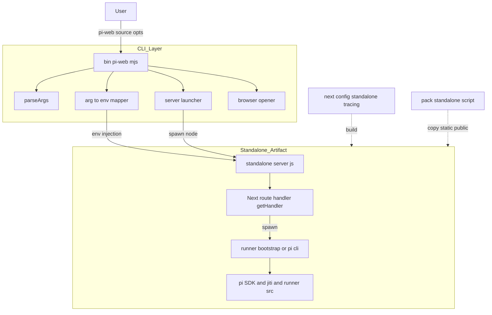
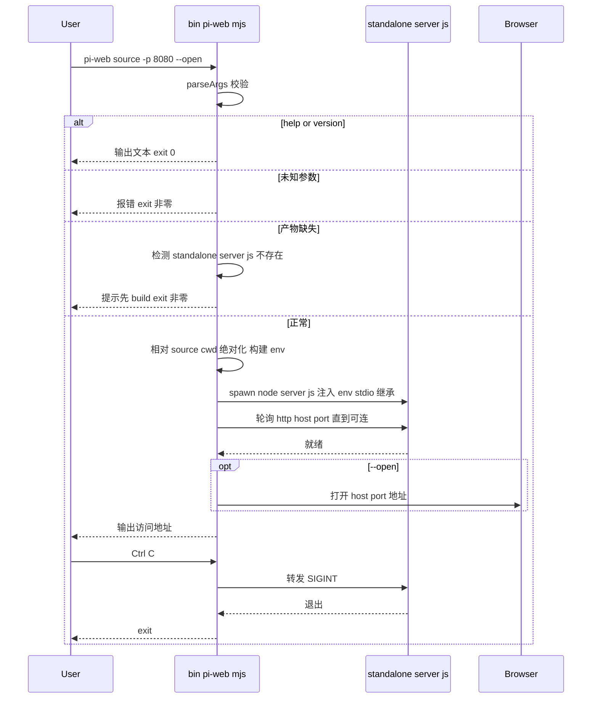

# Design Document — pi-web-cli

## Overview

**Purpose**：把 pi-web 从「只能在 monorepo 开发树内运行的 Next.js 应用」交付为一个**可全局安装、参数驱动的 CLI 程序 `pi-web`**。用户在任意目录执行 `pi-web [source] [options]` 即可拉起本地 Web 服务器并使用聊天界面。

**Users**：希望快速本地起一个 pi-web 实例、用命令行指定 agent source 与监听参数的开发者/使用者。

**Impact**：在现有 app shell 之上叠加两件事——(1) `next.config.ts` 启用自包含构建产物（`output:"standalone"` + 运行时子进程依赖追踪）；(2) 一个薄 CLI 启动器把参数翻译为应用已识别的 env 再启动 standalone server。业务逻辑（会话引擎、协议、UI、子进程模型）零改动。

### Goals
- 一条 `pi-web [source] [options]` 命令在任意目录启动应用，source 省略时默认当前目录。
- 参数（port/host/cwd/agent-dir/open/stub/help/version）翻译为运行时配置，启动 server 至就绪。
- 构建产物自包含，脱离 monorepo 源码树仍能跑通真实子进程会话。
- e2e 证明启动链路（stub 冒烟 + 真实会话）。

### Non-Goals
- 真正的 npm publish、workspace 依赖内联、版本治理、CI 发布流水线。
- 容器镜像 / 系统服务 / 反向代理部署形态。
- 任何业务功能改动。

## Boundary Commitments

### This Spec Owns
- CLI 可执行入口 `bin/pi-web.mjs`：参数解析、参数→env 映射（含相对路径绝对化）、启动并监管 standalone server、就绪后可选打开浏览器、信号转发、帮助/版本/错误输出、`--watch` 的启用信号与监视路径注入。
- 既有 runner 热重载门控 `isHotReloadEnabled()` 的「显式启用信号」扩展（让 `--watch` 在 production standalone 下也能开启，不改其余默认行为）。
- `PI_WEB_AUTOSTART` 信号契约 + app-shell 极小接线（`config.ts` 读取、`page.tsx` 透传、`chat-app.tsx` 初始直接建会话），使 CLI 确定 source 时跳过选源页直接进会话（Req 9）。
- standalone 构建产物的装配：`next.config.ts` 的 build-only 字段（`output`/`outputFileTracingRoot`/`outputFileTracingIncludes`）与构建后收尾脚本 `scripts/pack-standalone.mjs`（copy 静态/公共资源）。
- `package.json` 的 `bin` 与 `build:cli`/`start:cli` 脚本。
- 本特性的单测与 e2e。

### Out of Boundary
- `loadConfig()` 既有字段的语义与 env 契约（`autoStart` 为本 spec 新增的小字段，不改既有字段含义）。
- 会话引擎、agent 源解析、runner、协议、`@pi-web/ui` 组件库的任何行为；autostart 仅在 app-shell 装配层（`chat-app`/`page`）做极小接线，复用既有 resume 模式的「跳过 picker 直接进会话」机制。
- **runner 热重载的核心逻辑**（watch→防抖→空闲重启→续会话）由既有 `hot-reload.ts` 拥有；本 spec 不重写，只扩展其启用门控并注入监视路径。
- npm 发布与依赖内联（延后阶段）。

### Allowed Dependencies
- 既有 `lib/app/config.ts` 的 env 契约（`PI_WEB_DEFAULT_SOURCE`/`PI_WEB_DEFAULT_CWD`/`PI_WEB_AGENT_DIR`/`PI_WEB_STUB_AGENT`）。
- 既有 runner 热重载机制（`packages/server/src/rpc-channel/hot-reload.ts`：`isHotReloadEnabled()` / `registerForHotReload()` / `PI_RUNNER_HOT_RELOAD_PATHS`）。
- Next.js 原生 `output:"standalone"` 及其 `server.js`（读 `PORT`/`HOSTNAME`）。
- Node 内置：`node:util`(parseArgs)、`node:child_process`、`node:net`、`node:fs`、`node:path`、`node:http`、`node:os`。**不引入第三方 CLI 框架**。

### Revalidation Triggers
- `loadConfig()` 新增/重命名 env 入口 → CLI 映射需同步。
- runner/pi-cli 子进程入口定位方式（`runnerBootstrapPath()`/`resolvePiCliEntry()`）变更 → standalone 追踪清单需同步。
- 新增运行时外置依赖或 runner 经 jiti 加载的新包 → `outputFileTracingIncludes` 需扩充。
- Next 版本升级改变 standalone 产物布局 → pack 脚本与启动路径需复核。

## Architecture

### Existing Architecture Analysis
- app shell 经 `app/api/sessions/[[...path]]/route.ts` → `lib/app/pi-handler.ts` 的 `getHandler()`（globalThis 单例）服务会话；前端经 `@pi-web/react` 连本站 API。
- `@pi-web/*` 走 `transpilePackages` 编入 Next bundle；pi SDK（`@earendil-works/*`）+ `jiti` 走 `serverExternalPackages` + 自定义 webpack externals，运行时 Node `import`。
- 会话激活时主进程 spawn 子进程（custom: `runner-bootstrap.mjs` 经 jiti 跑 runner 源码；cli: pi `dist/cli.js`）——**运行时动态进程，不在 server bundle 内**（见 research.md §2.3）。
- 有状态长连接（SSE + 子进程），单机长驻，非 Serverless/Edge。

CLI 不触碰上述任何运行时路径，只在**进程外**充当启动器。

### Architecture Pattern & Boundary Map



**Architecture Integration**：
- Selected pattern：**薄启动器 + 自包含产物**。CLI 与应用进程解耦，仅经 env 与子进程边界交互。
- Boundaries：CLI 层（参数/启动/监管）与 standalone 产物（既有应用）严格分离；构建配置只在 build 期生效。
- Existing patterns preserved：env 驱动配置、globalThis 单例 handler、子进程会话模型、pi SDK 外置。
- New components rationale：parseArgs 映射器（参数契约）、launcher（生命周期/信号/就绪）、pack 脚本（standalone 标准收尾）、next.config 追踪字段（把运行时子进程依赖带进产物）。
- Steering compliance：最小依赖、Node-only 运行时、不破坏长连接模型。

### Technology Stack

| Layer | Choice / Version | Role in Feature | Notes |
|-------|------------------|-----------------|-------|
| CLI | Node `node:util` parseArgs（Node ≥22.19） | 参数解析与映射 | 零第三方 |
| 启动/监管 | `node:child_process` spawn + `node:http` 轮询就绪 | 启动 standalone server、信号转发、就绪检测 | stdio 继承 |
| 构建产物 | Next.js 15 `output:"standalone"` | 自包含 server + nft 追踪依赖 | build-only |
| 依赖追踪 | `outputFileTracingRoot` + `outputFileTracingIncludes` | 纳入 runner/pi-cli 子进程依赖（P0） | research §2.3/2.4 |
| 收尾 | Node `fs.cp` copy | 把 `.next/static`+`public` 装入 standalone | research §2.5 |

## File Structure Plan

### 新增文件
```
bin/
└── pi-web.mjs              # CLI 可执行入口:parseArgs → env 映射(相对路径绝对化) → spawn standalone server → 就绪轮询 → 可选 open → 信号转发 → help/version/错误
scripts/
└── pack-standalone.mjs     # 构建后收尾:copy .next/static 与 public 进 .next/standalone;校验 server.js 存在
e2e/
└── cli/
    ├── cli-args.test.ts    # 单测:参数解析与 env 映射纯函数(端口/host/相对路径绝对化/默认 cwd/未知参数)
    └── cli-smoke.e2e.ts    # e2e:CLI --stub 启动 standalone → 浏览器加载 → 默认 source 激活 → 发消息 → stub 流式回包
```

> `bin/pi-web.mjs` 内部把纯函数（`parseCliArgs`、`buildEnv`）导出以便单测；副作用（spawn/open）集中在 `main()` 守卫于 `import.meta.main` 等价判断。

### 修改文件
- `next.config.ts` — 新增 build-only 字段：`output:"standalone"`、`outputFileTracingRoot`（锚 monorepo 根）、`outputFileTracingIncludes`（纳入 `packages/server/runner-bootstrap.mjs`、`packages/server/src/**`、`packages/server/node_modules/@earendil-works/**`、`jiti`、agent-kit/tool-kit、`examples/**`）。不改既有 `transpilePackages`/`serverExternalPackages`/webpack/headers 逻辑，不影响 dev。
- `package.json` — 新增 `"bin": { "pi-web": "bin/pi-web.mjs" }`；scripts 增 `build:cli`（`next build` + `node scripts/pack-standalone.mjs`）、`start:cli`（`node bin/pi-web.mjs`）、`e2e:cli`；`files` 字段（为后续发布预留，本期可选）。
- `packages/server/src/rpc-channel/hot-reload.ts` — `isHotReloadEnabled()` 增显式启用信号：`PI_WEB_WATCH==="1"` 时即使 `NODE_ENV==="production"` 也启用（dev 既有路径不变）。仅放开门控，watch/防抖/重启核心逻辑不动。
- `packages/server/src/rpc-channel/pi-rpc-process.ts` — 回合安全（Req 8.2）：新增 `turnActive`（`agent_start..agent_end`）跟踪，`requestRestart` 忙判断纳入回合进行中，`maybeRestartWhenIdle` 在命令结算与回合结束后统一结算延迟重启。dev 热重载同样受益。
- `lib/app/config.ts` / `app/page.tsx` / `components/chat-app.tsx` — autostart 接线（Req 9）：`AppConfig.autoStart`(读 `PI_WEB_AUTOSTART`) → page 透传 → `ChatApp` 初始 session 在 `autoStart` 时用 `defaultSource` 直接建会话（复用 resume 分支），跳过 `AgentSourcePicker`；「切换源」(onReset) 仍可回选源页。

## System Flows

### CLI 启动序列



就绪检测在轮询成功后才触发 `--open`，避免打开空白页；打开失败仅告警不终止（6.3）。

## Requirements Traceability

| Requirement | Summary | Components | Flows |
|-------------|---------|------------|-------|
| 1.1 | 可执行入口入 PATH | package.json bin + bin/pi-web.mjs | — |
| 1.2 | 位置参数指定 source | parseCliArgs + buildEnv | 启动序列 |
| 1.3 | 省略则默认 cwd | buildEnv（source 缺省→resolve(cwd)） | 启动序列 |
| 1.4 | 输出访问地址 | Launcher | 启动序列 |
| 2.1–2.5 | 选项→运行时配置 | parseCliArgs + buildEnv | 启动序列 |
| 2.6 | --stub 模式 | buildEnv（PI_WEB_STUB_AGENT） | — |
| 2.7 | 不回显凭据 | buildEnv（仅透传，不打印 env） | — |
| 2.8 | 端口被占自动递增 | Launcher（findFreePort） | 启动序列 |
| 3.1–3.2 | server 就绪且行为一致 | Launcher + standalone 产物 | 启动序列 |
| 3.3 | 信号停止 | Launcher（信号转发） | 启动序列 |
| 3.4 | 端口占用报错 | Launcher（错误处理） | 启动序列 |
| 4.1–4.3 | 自包含产物 | next.config tracing + pack 脚本 | — |
| 4.4 | 产物缺失提示 | Launcher（前置校验） | 启动序列 |
| 5.1–5.3 | help/version/参数错误 | parseCliArgs + help 文本 | 启动序列 |
| 6.1–6.3 | --open 行为 | Opener | 启动序列 |
| 7.1 | 不改 dev/start | next.config build-only + 新增文件 | — |
| 7.2–7.3 | e2e 闭环 | e2e/cli/* | — |
| 8.1 | --watch 监视 source | parseCliArgs + buildEnv | 启动序列 |
| 8.2 | 变化重载续会话 | hotReloadGate（复用 hot-reload.ts） | — |
| 8.3 | 默认不监视 | buildEnv（无 --watch 不注入） | — |
| 8.4 | git source 跳过+提示 | buildEnv | — |
| 9.1 | CLI 确定 source 直接进会话 | buildEnv(PI_WEB_AUTOSTART) + config + page + chat-app | — |
| 9.2 | 非 CLI 仍显示选源页 | chat-app（autoStart 缺省 false） | — |
| 9.3 | 自动会话仍可切换源 | chat-app（onReset 回 picker） | — |

## Components and Interfaces

| Component | Layer | Intent | Req | Key Deps | Contracts |
|-----------|-------|--------|-----|----------|-----------|
| parseCliArgs | CLI | 解析 argv 为结构化选项 | 1.2,1.3,2.1-2.6,5.1-5.3 | node:util | Service |
| buildEnv | CLI | 选项→env 映射 + 相对路径绝对化 | 1.3,2.1-2.7 | node:path | Service |
| Launcher | CLI | spawn/监管 server、就绪、信号、错误 | 3.1-3.4,4.4,1.4 | node:child_process, node:http | Service |
| Opener | CLI | 就绪后按平台打开浏览器 | 6.1-6.3 | node:child_process | Service |
| packStandalone | Build | copy 静态/公共资源、校验产物 | 4.1,4.3 | node:fs | Batch |
| nextConfigTracing | Build | standalone 产物追踪运行时子进程依赖 | 4.1,4.2 | next | State |
| hotReloadGate | Runtime | 放开 runner 热重载门控供 --watch 在 production 启用 | 8.2,8.3 | hot-reload.ts | State |

### CLI 层

#### parseCliArgs / buildEnv

**Responsibilities & Constraints**
- `parseCliArgs(argv)` 用 `node:util` parseArgs 解析；未知/非法选项抛可读错误（5.3）；`--help`/`--version` 短路返回意图。
- `buildEnv(opts, baseCwd, baseEnv)` 把选项映射为 env，**纯函数**（baseCwd = 用户调用目录），相对 `source`/`cwd` 经 `path.resolve(baseCwd, ...)` 绝对化（research §2.2）。
- 不变量：不读写全局状态；不打印 env 值（2.7）。

**Contracts**: Service [x]
```typescript
interface CliOptions {
  source?: string;          // 位置参数;缺省由 buildEnv 落为 baseCwd
  port?: number;            // -p/--port
  host?: string;            // --host
  cwd?: string;             // --cwd
  agentDir?: string;        // --agent-dir
  open: boolean;            // --open
  stub: boolean;            // --stub
  watch: boolean;           // --watch
  intent: "run" | "help" | "version";  // -h/-v 短路
}
function parseCliArgs(argv: readonly string[]): CliOptions;  // throws CliUsageError(未知/非法参数)
function buildEnv(
  opts: CliOptions,
  baseCwd: string,
  baseEnv: NodeJS.ProcessEnv,
): NodeJS.ProcessEnv;       // 注入 PI_WEB_DEFAULT_SOURCE/_CWD, PI_WEB_AGENT_DIR, PORT, HOSTNAME, PI_WEB_STUB_AGENT
```
- env 映射：`source ?? baseCwd → PI_WEB_DEFAULT_SOURCE`（绝对化）；`cwd ?? baseCwd → PI_WEB_DEFAULT_CWD`（绝对化）；`port ?? 3000 → PORT`；`host ?? "127.0.0.1" → HOSTNAME`；`agentDir → PI_WEB_AGENT_DIR`（存在时）；`stub → PI_WEB_STUB_AGENT="1"`（存在时）。其余 baseEnv 原样透传。
- watch 映射（8.1–8.4）：`watch` 且 source 为本地目录 → `PI_WEB_WATCH="1"` + `PI_RUNNER_HOT_RELOAD_PATHS=<绝对化 source>`；source 为 git 来源 → 跳过注入并向用户告警 watch 仅适用本地目录（8.4）；无 `--watch` → 不注入（8.3）。

#### hotReloadGate（hot-reload.ts 门控扩展）

**Responsibilities & Constraints**
- `isHotReloadEnabled()` 增显式启用信号：`process.env.PI_WEB_WATCH === "1"` 时返回 true，不受 `NODE_ENV` 限制；既有 dev 路径（`NODE_ENV !== production && PI_RUNNER_HOT_RELOAD === "1"`）保持不变。
- 不动 `registerForHotReload`/watch/防抖/`requestRestart` 等核心逻辑——CLI 经 `PI_RUNNER_HOT_RELOAD_PATHS` 指定监视 agent source 目录，复用既有「空闲重启 + 续会话」。

**Contracts**: State [x]（门控布尔）
**Implementation Notes**
- Risks：放开 production 门控仅由显式 `PI_WEB_WATCH` 触发（用户主动 `--watch`），不影响默认 standalone 行为。
- **回合安全（Req 8.2 关键）**：`requestRestart` 的「忙」判断扩展为「有待决命令 **OR 回合进行中**」。`PiRpcProcess` 跟踪 `agent_start..agent_end` 区间为 `turnActive`，回合进行中（流式 token / 工具调用 / 等待 extension_ui 应答）将重启延迟到 `agent_end` 后；仅靠 `pendingCommands` 不够——prompt 立即 ack、增量全走 event 流，回合中 `pendingCommands` 为空会被误判空闲而中断回合、丢失信息。

#### Launcher

**Responsibilities & Constraints**
- 前置校验 standalone `server.js` 存在；缺失→可读提示 + 非零退出（4.4）。
- `spawn("node", [serverJs], { env, stdio: "inherit" })`；`HOSTNAME`/`PORT` 由 env 决定。
- 就绪检测：周期性 `http.get(host:port)` 直至连接成功或超时；成功后打印访问地址（1.4）并触发可选 open。
- 信号：监听 `SIGINT`/`SIGTERM` 转发子进程（3.3）；子进程退出码透传为 CLI 退出码。
- 端口选择：从指定/默认端口起递增找首个空闲端口（`findFreePort`），被占自动切换并告知用户实际端口（2.8）；连续一段范围全被占 → 可读报错 + 非零退出（3.4）。

**Contracts**: Service [x]
```typescript
interface LaunchOptions { serverJs: string; host: string; port: number; env: NodeJS.ProcessEnv; open: boolean; }
function launch(opts: LaunchOptions): Promise<number>;  // resolve 子进程退出码
```

#### Opener

**Responsibilities & Constraints**
- 按平台选择命令：darwin→`open`、win32→`start`、其余→`xdg-open`（6.1）。
- 失败仅 `console.warn` 提示手动访问，不抛、不终止 server（6.3）。

**Contracts**: Service [x] `function openBrowser(url: string): void;`

### Build 层

#### nextConfigTracing（next.config.ts 改动）

**Responsibilities & Constraints**
- 仅新增 build-only 字段，**不改** dev 行为（7.1）。
- `output:"standalone"`；`outputFileTracingRoot = __dirname`（锚 monorepo 根，确保 `packages/**` 与 pnpm 嵌套依赖被追踪）。
- `outputFileTracingIncludes`：把 runner/pi-cli 子进程运行时依赖显式纳入（research §2.3）：
  `packages/server/runner-bootstrap.mjs`、`packages/server/src/**`、`packages/server/node_modules/@earendil-works/**`、`node_modules/jiti/**`、`packages/agent-kit/**`、`packages/tool-kit/**`、`examples/**`。

**Contracts**: State [x]（构建配置）
**Implementation Notes**
- Risks（P0）：`runnerBootstrapPath()` 的 `import.meta.url` 在 standalone 重定位后是否仍解析到真实 `.mjs` —— 以 e2e 真实会话验证；若失败，保持 `packages/server` 物理布局或加 env 兜底（research §2.4）。
- Validation：`next build` 后断言 `.next/standalone/packages/server/runner-bootstrap.mjs` 与 pi SDK `dist/cli.js` 存在。

#### packStandalone

**Responsibilities & Constraints**
- copy `.next/static` → `.next/standalone/.next/static`，`public` → `.next/standalone/public`（4.3）。
- 校验 `.next/standalone/server.js` 存在，否则报错退出。
- 幂等：重复运行覆盖目标。

**Contracts**: Batch [x]
- Trigger：`build:cli` 脚本在 `next build` 后调用。
- Idempotency：覆盖式 copy。

## Error Handling

### Error Strategy
CLI 层 fail-fast + 可读信息 + 明确退出码；server 运行期错误透传子进程。

### Error Categories and Responses
- **用户错误**：未知/非法参数 → 指明选项 + 用法摘要，非零退出，不启动 server（5.3）。
- **环境错误**：产物缺失 → 提示先 `pnpm build:cli`，非零退出（4.4）；端口占用 → `EADDRINUSE` 可读报错，非零退出（3.4）。
- **降级**：`--open` 失败 → 告警 + 继续运行（6.3）。
- **安全**：任何错误/日志不回显 provider 凭据（2.7）。

### Monitoring
CLI 把 server stdout/stderr 透传（stdio 继承），用户直接看到既有应用日志；CLI 自身仅在关键节点（就绪地址、错误、open 失败）输出。

## Testing Strategy

### Unit Tests（`test/cli/cli-args.test.ts`，vitest）
- `parseCliArgs`：`-p 8080`/`--port`、`--host`、`--stub`/`--open`/`--watch` 布尔、`-h`/`-v` 短路、未知参数抛 `CliUsageError`。
- `buildEnv`：省略 source → `PI_WEB_DEFAULT_SOURCE` = 绝对化 baseCwd（1.3）；相对 source/cwd 绝对化（research §2.2）；端口/host 默认值（2.2/2.3）；`--stub` → `PI_WEB_STUB_AGENT=1`；凭据 env 原样透传且不被 CLI 打印（2.7）。
- `buildEnv` watch（8.1/8.3/8.4）：`--watch` 本地 source → `PI_WEB_WATCH=1` + `PI_RUNNER_HOT_RELOAD_PATHS`=绝对化 source；`--watch` git source → 不注入 watch env（跳过）；无 `--watch` → 不注入。
- `isHotReloadEnabled`（8.2）：`PI_WEB_WATCH=1` 且 `NODE_ENV=production` 时返回 true；二者皆缺省时 false（既有 dev 路径不回归）。
- `PiRpcProcess` 回合安全（`pi-rpc-process.restart.test.ts`，8.2）：回合进行中（`agent_start..agent_end`）`requestRestart` 延迟、回合结束后执行；空闲时立即重启；既有 rpc-channel 测试不回归。
- `findFreePort`（2.8）：起始端口被占 → 返回更高的空闲端口；一段范围全被占 → `undefined`。
- `buildEnv` autostart（9.1）：CLI 总注入 `PI_WEB_AUTOSTART=1`。
- E2E autostart（9.1，stub）：CLI 启动后页面**不**出现「Start a pi-web session」选源页、直接进入会话（URL 落 `/session/:id`）。

### Integration Tests
- `build:cli` 后断言 standalone 产物完整性：`.next/standalone/server.js`、`.next/static`、`public`、`packages/server/runner-bootstrap.mjs`、pi SDK `dist/cli.js` 均存在（4.1/4.3，针对 research §2.4 的 P0）。

### E2E Tests（`e2e/cli/cli-smoke.e2e.ts`，playwright + 真实 CLI 进程）
- **stub 冒烟（7.2）**：`node bin/pi-web.mjs <examples/hello-agent 或默认目录> --stub -p <随机端口>` 启动 → 等就绪 → 浏览器打开地址 → 默认/选定 agent source 激活会话（`[data-session-active]`）→ 发消息（`[data-pi-input-textarea]`）→ 断言收到 stub 流式回包 → 进程信号退出。
- **真实会话（7.3，本机凭据可用时）**：去掉 `--stub`，对 `examples/hello-agent` 验证「激活 → prompt → 真实子进程流式回复」，作为 research §2.3/2.4 P0 的最终验证；CI/无凭据环境可标记为条件跳过。
- **参数/错误路径**：`--help`/`--version` exit 0 且有内容；未知参数 exit 非零且不起 server；产物缺失提示。
- **watch 重载（8.1/8.2，凭据可用时）**：`--watch` 非 stub 启动 → 激活真实会话 → 修改 agent source 的 `index.ts` → 断言出现 runner 热重载日志（`[runner-hot-reload]`）→ 会话续上对话；测试后还原被改文件。无凭据/CI 可条件跳过。
