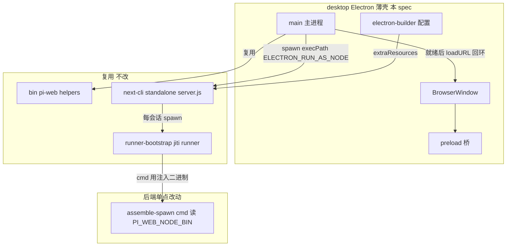
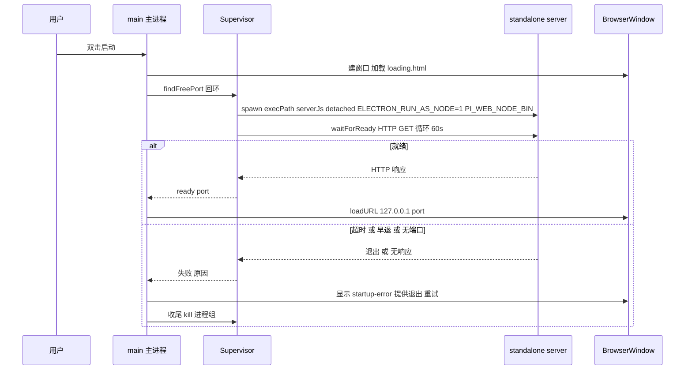

# 技术设计:pi-web 桌面版(M1)

## Overview

**Purpose**:把现有 pi-web Web 应用封装为可双击启动的桌面应用,让本机用户无需安装 Node、也无需在终端敲命令即可使用 pi 编码 agent。

**Users**:在本机使用 pi 的开发者。桌面版与 CLI 是同一份数据(`~/.pi/agent`)的两个入口——桌面版只提供原生窗口 + 自包含运行时,不引入新的会话/配置语义。

**Impact**:新增一层 Electron 薄壳(顶层 `desktop/` 目录),复用 `pnpm build:cli` 产出的 standalone 自包含产物;主进程以「Electron 充当 Node」方式拉起 standalone server,等就绪后在 `BrowserWindow` 内加载本地 UI。对既有后端唯一改动是 `assemble-spawn.ts` 让 runner 子进程可用注入的 Node 二进制(向后兼容)。

### Goals
- 干净(未装 Node)的 macOS 机器上双击可用,跑通真实(非桩)会话并得到流式回复。
- 复用 standalone 产物与 CLI 启动原语,后端近零重写。
- 产出可分发的 macOS dmg,并以新鲜运行证据佐证。
- 对既有 CLI/dev 行为零回归(桌面专用注入缺省时行为不变)。

### Non-Goals
- 原生目录选择器选 agent source、系统托盘、多窗口、原生菜单/快捷键、休眠唤醒会话恢复(M2)。
- Windows/Linux 分发与三平台 CI 矩阵、代码签名与公证、自动更新(M3)。
- 会话引擎/配置域/附件/协议的任何行为变更。

## Boundary Commitments

### This Spec Owns
- **Electron 主进程壳**:空闲端口选择 → 以 Electron-as-Node 拉起 standalone server → 就绪探针 → 单窗口 `loadURL` 本地回环 UI;启动失败的可见处理;退出时的进程树收尾。
- **preload 桥**:最小的、隔离的渲染上下文桥(不授予 Node/系统集成)。
- **打包配置**:electron-builder 配置,把 standalone 产物经 `extraResources` 放进 `process.resourcesPath`,产出 macOS dmg。
- **后端单点改动**:`assemble-spawn.ts` 的 runner spawn `cmd` 改为读注入的 `PI_WEB_NODE_BIN`(缺省回退 `"node"`)。
- **桌面 e2e**:Playwright `_electron` 驱动的启动 + 真实会话验证;干净无 Node 验证。

### Out of Boundary
- standalone 产物的构建与可重定位逻辑(归 `pack-standalone.mjs` / `next.config.ts`,本 spec 只消费,不改)。
- 会话创建/RPC/翻译/附件/配置等后端业务(本 spec 不新增业务 RPC、不碰协议)。
- CLI `bin/pi-web.mjs` 的命令行行为(仅**补导出**两个已有内部 helper 供复用,不改其行为)。
- M2/M3 的一切桌面体验与分发增强。

### Allowed Dependencies
- `bin/pi-web.mjs` 已导出/补导出的纯函数:`buildEnv`、`findFreePort`、`waitForReady`、`standaloneServerJs`。
- `.next-cli/standalone` 产物(经 `pnpm build:cli` 预先构建)。
- `electron@>=39`(内置 Node ≥22.19)、`electron-builder`(构建期)。
- Electron 平台 API:`app`、`BrowserWindow`、`shell`、`process.resourcesPath`、`process.execPath`。

### Revalidation Triggers
- `pack-standalone.mjs` 产物根路径/布局变化(桌面壳的 `resolveServerEntry` 依赖 `standalone/server.js` 位置)。
- `assemble-spawn.ts` env 组装或 `baseEnv` 透传语义变化(`PI_WEB_NODE_BIN` 透传链)。
- `bin/pi-web.mjs` 导出的纯函数签名变化。
- Electron 大版本升级导致内置 Node 版本或 `runAsNode` fuse 默认值变化。

## Architecture

### Existing Architecture Analysis
- 后端是**有状态长连接**:Next standalone server(Node runtime,会话进程驻留)+ 每会话一个 pi runner 子进程(`server.js` → `runner-bootstrap.mjs` → jiti → `runner.ts` → 用户 `index.ts`)。桌面壳不改这条链,只提供拉起它的宿主进程与承载 UI 的窗口。
- runner spawn 的 `cmd:"node"` 依赖 PATH 上的系统 Node;GUI 启动的 app 无用户 shell PATH,且干净机器无 Node → 这是唯一必须改的后端点。
- CLI(`bin/pi-web.mjs`)已把端口选择 / env 组装 / 就绪探针 / 产物定位做成可复用函数;桌面壳是第二个消费者。

### Architecture Pattern & Boundary Map



**Architecture Integration**:
- **Selected pattern**:Electron 薄壳 + 复用 standalone(见 `research.md` 方案评估,否决 Tauri/托盘启动器)。
- **Domain 边界**:主进程只做「进程编排 + 窗口生命周期」;后端业务全在被拉起的 server 内,壳不感知。
- **Existing patterns preserved**:standalone 自包含/可重定位契约、CLI 启动原语、会话链路。
- **New components rationale**:主进程(编排)、preload(安全桥)、打包配置(分发)各单一职责;后端仅一处读注入 env。
- **Steering compliance**:运行时坚持 Node(Electron-as-Node 仍是 Node);不碰协议契约;安全是可替换策略(仅回环 + 隔离渲染)。

### Technology Stack

| Layer | Choice / Version | Role in Feature | Notes |
|-------|------------------|-----------------|-------|
| Desktop shell | Electron `>=39`(装最新稳定 40+) | 主进程编排 + 窗口 + Electron-as-Node 运行时 | 39=首个内置 Node ≥22.19(22.20);40+ 为 Node 24.x |
| Packaging | electron-builder(最新) | 出 macOS dmg,`extraResources` 嵌产物 | 未签名本地可运行(`identity:null`) |
| Backend(改) | 既有 `@blksails/pi-web-server` | `assemble-spawn` 读 `PI_WEB_NODE_BIN` | 单点、向后兼容 |
| Reused runtime | `.next-cli/standalone` 产物 | 被 spawn 的 server + runner 链 | 经 `pnpm build:cli` 预构建 |
| E2E | `@playwright/test` `_electron` | 驱动主进程做启动 + 会话验证 | 已是 devDep |

## File Structure Plan

### Directory Structure(新增 `desktop/`,顶层,与 `bin/`、`app/` 同级)
```
desktop/
├── package.json           # @blksails/pi-web-desktop:electron + electron-builder;scripts(dev/build/dist)
├── tsconfig.json          # 主/preload 进程 TS 配置(编译到 desktop/dist)
├── electron-builder.yml   # 打包配置:extraResources=.next-cli/standalone、mac.target=dmg、identity:null
├── src/
│   ├── main.ts            # 主进程入口:编排启动链 + 窗口 + 退出收尾(见 Components)
│   ├── server-supervisor.ts # 受监管 spawn:持 child 句柄、detached 组、就绪等待、组 kill
│   ├── resolve-artifact.ts  # 定位 standalone server.js:打包态 process.resourcesPath / dev 态跳过
│   ├── runtime-mode.ts    # 明确的 dev/packaged 模式判定(app.isPackaged + 显式 env 开关)
│   ├── window.ts          # createMainWindow:安全 webPreferences + setWindowOpenHandler 外链
│   ├── startup-error.ts   # 启动失败的可见呈现(错误页/对话框)+ 退出/重试
│   └── preload.ts         # 最小 contextBridge 桥(M1 近空,占位安全基线)
└── static/
    └── loading.html       # 就绪前的本地加载页(避免空白窗口)
```

### Modified Files
- `packages/server/src/agent-source/assemble-spawn.ts` — `assemble()` 两分支 `cmd:"node"` → `cmd: env["PI_WEB_NODE_BIN"] ?? "node"`(读已构造的 env,保持不读 process.env 不变式)。
- `bin/pi-web.mjs` — 补导出既有内部 helper `waitForReady` 与 `standaloneServerJs`(供桌面壳复用,零行为变更)。
- `pnpm-workspace.yaml` — 增加 `- 'desktop'`(现仅 `packages/*`,顶层 desktop 不被 glob 覆盖)。
- `packages/server/test/agent-source/assemble-spawn.*.test.ts`(既有测试文件)— 新增用例覆盖 `PI_WEB_NODE_BIN` 注入/缺省。

> 每个文件单一职责;`server-supervisor.ts`(进程生命周期)与 `resolve-artifact.ts`(路径定位)与 `window.ts`(UI 承载)分离,便于并行实现与单测。

## System Flows

### 启动链(打包态)


退出:`app.on('before-quit')` → Supervisor 对 server 进程**组** kill(POSIX 负 pid SIGTERM,超时 SIGKILL;Windows `taskkill /T /F`),触达 runner 孙进程,释放端口。

## Requirements Traceability

| Requirement | Summary | Components | Interfaces | Flows |
|-------------|---------|------------|------------|-------|
| 1.1–1.5 | 端口→拉起→加载状态→就绪 loadURL→无需系统 Node | main, server-supervisor, resolve-artifact, window | `ServerSupervisor.start` | 启动链 |
| 2.1–2.4 | 超时/早退/无端口的可见失败 + 退出重试 + 不留子进程 | server-supervisor, startup-error, main | `ServerSupervisor.start`(Result), `showStartupError` | 启动链失败分支 |
| 3.1–3.4 | 产物随包(extraResources)+ 真实路径 + 打包态定位 + jiti 可解析 | electron-builder.yml, resolve-artifact | `resolveServerEntry` | 启动链 |
| 4.1–4.4 | runner 用注入 Node 二进制 + 缺省回退 + env 透传 | assemble-spawn(改), server-supervisor | `assemble()`, spawn env | runner spawn |
| 5.1–5.4 | 回环+随机端口 + 隔离渲染 + 外链交系统浏览器 | server-supervisor, window, preload | `createMainWindow`, `setWindowOpenHandler` | 启动链 |
| 6.1–6.4 | 关窗关停 server + 杀 runner 孙进程 + 超时强杀 + 释放端口 | server-supervisor, main | `ServerSupervisor.stop` | 退出收尾 |
| 7.1–7.3 | 共享 `~/.pi/agent` + 会话互见 + 存储语义不变 | main(env), (复用后端) | spawn env(不设 agentDir 覆盖) | — |
| 8.1–8.3 | dev 模式指向 dev server + 免打包 + 明确模式开关 | runtime-mode, resolve-artifact, main | `resolveRuntimeMode` | 启动链(dev 分支) |
| 9.1–9.4 | macOS dmg 产出 + 干净机验证 + 真实会话 + 证据 | electron-builder.yml, e2e | `dist` script, Playwright `_electron` | e2e |

## Components and Interfaces

| Component | Domain/Layer | Intent | Req Coverage | Key Dependencies (P0/P1) | Contracts |
|-----------|--------------|--------|--------------|--------------------------|-----------|
| ServerSupervisor | 主进程/编排 | 受监管拉起/等待/收尾 standalone server | 1,2,4,6 | CLI helpers(P0), child_process(P0) | Service, State |
| resolveServerEntry | 主进程/路径 | 定位打包态产物入口 | 3 | process.resourcesPath(P0) | Service |
| resolveRuntimeMode | 主进程/配置 | 判定 dev vs packaged | 8 | app.isPackaged(P0) | Service |
| createMainWindow | 主进程/UI 承载 | 安全窗口 + 外链拦截 | 5 | BrowserWindow(P0), shell(P1) | Service |
| showStartupError | 主进程/错误 | 可见失败 + 退出/重试 | 2 | BrowserWindow/dialog(P1) | Service |
| main(入口) | 主进程/编排 | 串联上列 + app 生命周期 | 1,6,7,8 | app(P0) | — |
| assemble()(改) | 后端/agent-source | runner cmd 读注入二进制 | 4 | env(P0) | Service |
| electron-builder 配置 | 构建/分发 | extraResources + dmg | 3,9 | electron-builder(P0) | Batch |
| preload | 渲染桥 | 最小隔离桥(M1 占位) | 5 | contextBridge(P1) | — |

### 主进程 / 编排

#### ServerSupervisor
| Field | Detail |
|-------|--------|
| Intent | 以受监管方式 spawn standalone server、等待就绪、退出时组 kill |
| Requirements | 1.1, 1.2, 1.4, 1.5, 2.1, 2.2, 2.3, 2.4, 4.4, 6.1, 6.2, 6.3, 6.4 |

**Responsibilities & Constraints**
- 选空闲回环端口(复用 `findFreePort`);组装 server env(复用 `buildEnv`,叠加 `PI_WEB_NODE_BIN=process.execPath` + `ELECTRON_RUN_AS_NODE=1`)。
- `spawn(process.execPath, [serverJs], { cwd, detached:true, env, stdio:['ignore','pipe','pipe'] })`——`detached:true` 使 server 成进程组组长(供组 kill 触达 runner 孙进程);捕获 stderr 供失败诊断。
- 就绪判定复用 `waitForReady`(HTTP GET `/`,60s/300ms);持 child 句柄与所选端口。
- `stop()`:POSIX `process.kill(-pid,'SIGTERM')`,宽限期后 `SIGKILL`;Windows `taskkill /PID <pid> /T /F`。幂等。
- **不**注入 `PI_CODING_AGENT_DIR`(留空 → 后端默认 `~/.pi/agent`,满足 7.1)。

**Dependencies**
- Inbound: main — 启动/停止编排 (P0)
- Outbound: `bin/pi-web.mjs` helpers(findFreePort/buildEnv/waitForReady/standaloneServerJs)(P0);`node:child_process`(P0)
- External: 无

**Contracts**: Service [x] / State [x]

##### Service Interface
```typescript
interface ServerStartResult {
  readonly url: string;            // http://127.0.0.1:<port>
  readonly port: number;
}
type ServerStartError =
  | { readonly kind: "no-free-port"; readonly triedFrom: number }
  | { readonly kind: "early-exit"; readonly code: number | null; readonly stderrTail: string }
  | { readonly kind: "ready-timeout"; readonly timeoutMs: number };

interface ServerSupervisor {
  /** 选端口→spawn→等就绪。失败返回判别式错误,且已收尾其 spawn 的进程。 */
  start(opts: {
    readonly serverJs: string;
    readonly host: string;          // 127.0.0.1
    readonly startPort: number;
    readonly baseEnv: NodeJS.ProcessEnv;
  }): Promise<{ ok: true; value: ServerStartResult } | { ok: false; error: ServerStartError }>;
  /** 组 kill server 进程树(含 runner 孙进程),释放端口。幂等。 */
  stop(): Promise<void>;
}
```
- Preconditions:`serverJs` 存在(否则 `resolveServerEntry` 阶段已报错)。
- Postconditions:`ok:true` 时 server 已就绪且句柄持有;`ok:false` 时无遗留子进程。
- Invariants:任一时刻至多一个受监管 server 进程。

**Implementation Notes**
- Integration:env 里 `ELECTRON_RUN_AS_NODE=1` 只进 server 子进程,主进程保持 GUI;经 `baseEnv` 透传到 runner(runner 是 node,继承正确)。
- Validation:集成测试断言 stop() 后进程组不存活。
- Risks:runner 后代继承 `ELECTRON_RUN_AS_NODE`(M1 无 GUI 后代,记录于 research.md 风险)。

#### resolveServerEntry / resolveRuntimeMode
| Field | Detail |
|-------|--------|
| Intent | 定位产物入口 + 判定运行模式 |
| Requirements | 3.3, 8.1, 8.2, 8.3 |

**Responsibilities & Constraints**
- `resolveRuntimeMode()`:`app.isPackaged` 为主判据,叠加显式 env(如 `PI_WEB_DESKTOP_DEV_URL`)——**明确开关,不猜测**(8.3)。
- `resolveServerEntry(mode)`:packaged → `path.join(process.resourcesPath, "standalone", "server.js")`(extraResources 落点);dev → 返回 `null`(壳改用 dev URL,不 spawn,满足 8.1/8.2)。

##### Service Interface
```typescript
// 实现细化(task 2.1 已复核接受):新增 unpackaged 第三态覆盖 e2e/本地非打包直跑;
// resolveServerEntry 改注入 deps 以成为可单测纯函数(不读 process.resourcesPath 全局)。
type RuntimeMode =
  | { readonly kind: "packaged" }
  | { readonly kind: "unpackaged" }
  | { readonly kind: "dev"; readonly devUrl: string };
function resolveRuntimeMode(env: NodeJS.ProcessEnv, isPackaged: boolean): RuntimeMode;
interface ResolveServerEntryDeps {
  readonly resourcesPath: string | undefined; // 生产为 process.resourcesPath
  readonly cliStandaloneJs: string;           // 生产为 bin/pi-web.mjs 的 standaloneServerJs()
}
/** packaged/unpackaged 返回 server.js 绝对路径;dev 返回 null(壳直接 loadURL devUrl)。 */
function resolveServerEntry(mode: RuntimeMode, deps: ResolveServerEntryDeps): string | null;
```

#### createMainWindow
| Field | Detail |
|-------|--------|
| Intent | 建安全窗口并把外链交系统浏览器 |
| Requirements | 5.3, 5.4, 1.3 |

**Responsibilities & Constraints**
- `webPreferences`:`contextIsolation:true`、`nodeIntegration:false`、`sandbox:true`(均保持默认,显式声明防回归)、`preload` 指向编译后的 preload。
- `setWindowOpenHandler`:校验 scheme(仅 `https:`/`http:` 且非本地回环 UI 自身)→ `shell.openExternal`,一律 `{action:'deny'}` 阻止应用内新窗口。
- 启动即加载 `loading.html`(1.3 可见加载态);就绪后由 main `loadURL` 切到本地 UI。

**Contracts**: Service [x]

### 后端(改)

#### assemble()(agent-source spawn 装配)
| Field | Detail |
|-------|--------|
| Intent | runner spawn 可执行文件读注入的 Node 二进制 |
| Requirements | 4.1, 4.2, 4.3 |

**Responsibilities & Constraints**
- 两分支(custom/cli)`cmd:"node"` → `cmd: env["PI_WEB_NODE_BIN"] ?? "node"`,`env` 为函数内已构造的 spawn env(真实模式含 `baseEnv=process.env` → 桌面注入的变量在内)。
- 缺省(无注入)→ `"node"`,CLI/dev 行为完全不变(4.3 向后兼容)。
- 保持「agent-source 模块不直接读 `process.env`」不变式:读的是入参 env,非全局。

##### Service Interface(增量语义,签名不变)
```typescript
// assemble(params, fragment, opts): SpawnSpec  —— 返回的 SpawnSpec.cmd 由
//   env["PI_WEB_NODE_BIN"] ?? "node" 决定;env = buildEnv(opts, fragment)。
```
- Preconditions:无(env 可能不含该键)。
- Postconditions:注入存在 → `cmd===注入值`;否则 `cmd==="node"`。
- Invariants:不读 `process.env`;不改 args/cwd/env 其余部分。

### 构建 / 分发

#### electron-builder 配置
| Field | Detail |
|-------|--------|
| Intent | 把 standalone 产物经 extraResources 嵌入,产出 macOS dmg |
| Requirements | 3.1, 3.2, 9.1 |

**Batch / Job Contract**
- Trigger:`desktop` 的 `dist` 脚本(前置 `pnpm build:cli` 产出 `.next-cli/standalone`)。
- Input/validation:`extraResources: [{ from: "../.next-cli/standalone", to: "standalone" }]`;`asar:true`(壳自身进 asar),产物在 asar 外经 `process.resourcesPath/standalone` 可达。
- Output:`mac.target: dmg`,`mac.identity: null` + `hardenedRuntime:false` + `gatekeeperAssess:false`(本地未签名可运行)。
- Idempotency:纯构建,可重复执行。

**Implementation Notes**
- Integration:产物必须先由 `pnpm build:cli` 构建(桌面 `dist` 脚本前置依赖);产物根 `standalone/server.js` 与 `resolveServerEntry` 打包态路径对齐(3.2/3.3)。
- Risks:产物布局若变(Revalidation Trigger)→ `resolveServerEntry` 与 `extraResources.to` 需同步。

## Error Handling

### Error Strategy
主进程编排以判别式 `ServerStartError` 表达三类启动失败,由 `showStartupError` 统一呈现,并保证失败路径先收尾子进程(不留孤儿)。

### Error Categories and Responses
- **无空闲端口**(`no-free-port`,2.3):提示端口范围被占,给退出/重试。
- **server 早退**(`early-exit`,2.2):附 stderr 末尾若干行作原因线索;退出/重试。
- **就绪超时**(`ready-timeout`,2.1):提示超时(60s);退出/重试。
- 任一失败(2.4):`showStartupError` 前 `ServerSupervisor.stop()` 收尾;窗口提供退出与重试(重试重跑启动链)。

### Monitoring
- server stderr 经 pipe 捕获,失败时截取末尾用于诊断(不常态刷屏);主进程关键节点(端口、spawn、就绪、退出)可经现有 logger 约定打点(非本 spec 重点)。

## Testing Strategy

### Unit Tests(纯函数,vitest)
1. `assemble()`:注入 `PI_WEB_NODE_BIN` → `spawnSpec.cmd===注入值`(custom 与 cli 两分支各一)。
2. `assemble()`:未注入 → `cmd==="node"`(两分支),证明向后兼容(4.3)。
3. `resolveRuntimeMode`:`isPackaged=true`→packaged;设 `PI_WEB_DESKTOP_DEV_URL`+`isPackaged=false`→dev 带 devUrl(8.3)。
4. `resolveServerEntry`:packaged→含 `process.resourcesPath/standalone/server.js`;dev→null(8.1)。
5. `setWindowOpenHandler` 决策纯函数:`https://`→openExternal+deny;本地回环/非法 scheme→仅 deny(5.4)。

### Integration Tests(真实子进程,vitest)
1. `ServerSupervisor.start`(指向 stub/mock server 脚本):就绪返回 `ok:true` + url/port;`stop()` 后进程组不存活(6.x)。
2. `ServerSupervisor.start` 早退分支:server 脚本立即退出 → `ok:false` `early-exit` 且无遗留子进程(2.2/2.4)。
3. env 透传:断言 spawn 给 server 的 env 含 `ELECTRON_RUN_AS_NODE=1` 与 `PI_WEB_NODE_BIN=execPath`,且主进程自身 env 不含 `ELECTRON_RUN_AS_NODE`(继承坑防回归)。

### E2E Tests(Playwright `_electron`)
1. **启动闭环**(1.x/5.x):`_electron.launch` 桌面壳(指向预构建产物)→ 等窗口 → 断言加载了 `127.0.0.1:<port>` 本地 UI(非空白、非 loading)。
2. **真实会话**(9.3,mock provider):选 agent source → 发消息 → 断言收到流式回复(证明 server→runner 链在 Electron-as-Node 下可用)。
3. **干净无 Node 验证**(9.2,沿用 `cli-reloc.mjs` 藏 node 思路):PATH 剥离系统 node 后启动打包 app,仍能拉起并跑通会话——证明 runner 用注入二进制(4.2)。
4. **退出收尾**(6.x):关闭 app 后断言 server 端口释放、无残留 runner 进程。

### Packaging(手动 + CI 可选)
- `desktop` `dist` 产出 macOS dmg(9.1);验证记录附启动成功 + 真实会话截图/日志(9.4)。

## Security Considerations
- **本地服务不外露**:仅回环 `127.0.0.1` + 随机端口(5.1/5.2),与 CLI 默认一致。
- **渲染层最小权限**:`contextIsolation`/`nodeIntegration:false`/`sandbox` 保持安全默认(5.3);preload 仅经 `contextBridge` 暴露必要能力(M1 近空)。
- **外链治理**:`setWindowOpenHandler` 校验 scheme 后 `shell.openExternal`,阻止应用内导航离开本地 UI(5.4)。
- **runAsNode fuse**:依赖其默认开启;M1 不翻 fuse。
- bang(!) shell 等高危特性沿用后端默认关(不因桌面壳改变门控)。
