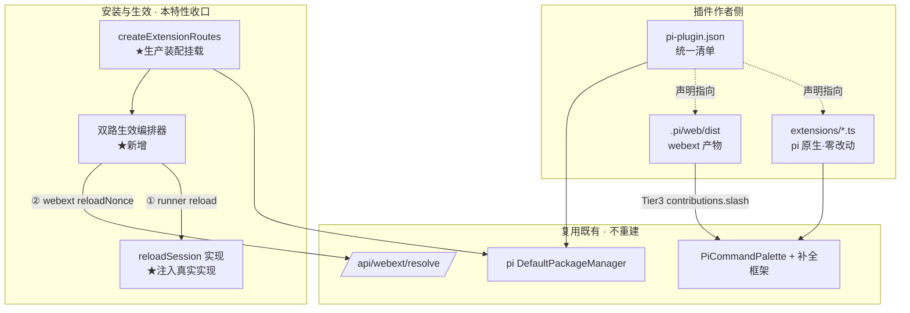
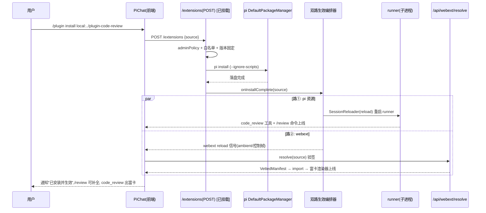

# Design Document

## Overview

**Purpose**: 本特性把 pi-web 散落在 ~10 个既有 spec 里的插件能力**收口为一个扁平于两层
（pi 原生 extension + webext）的统一插件包标准**，并闭合"安装入口未挂载""装完不即时生效"
两个最后一公里缺口，交付可发布的参考示例。

**Users**: 插件作者（写一个包同时给 agent 加能力 + 定制 UI）、自托管运营者（开通安装入口）、
终端用户（装完即时双路生效）。

**Impact**: 不重建已稳的底层（webext 加载器、`extension-management` 治理、补全框架），
而是在其之上加一层**统一清单 `pi-plugin.json` + 双路生效编排 + 生产装配接线**，
并用一个真实示例把整条链路打通验证。

### Goals
- 定义并文档化统一插件包标准（`pi-plugin.json` + 布局约定 + schema/类型），向后兼容现有包。
- pi 原生 extension 零改动复用：发现、执行、slash 补全均不需改扩展源码（含 busy 卡死修复）。
- 接通生产安装入口（挂载 `createExtensionRoutes` + 注入真实 `reloadSession`），沿用管理员门控。
- 实现"装完即时双路生效"：runner reload + webext reloadNonce 并行联动。
- 交付 `examples/plugin-code-review/`（独立可发布插件包）+ consumer agent + 双角色样板，及离线 e2e。

### Non-Goals
- 重建 webext 加载器/安全门/协议（`agent-web-extension`，复用）。
- 重建安装治理：白名单/版本固定/审计/管理员门控（`extension-management`，复用）。
- 重建 webext 发现/验签/中心可信发布者列表（`webext-package-install`，复用）。
- 重建命令补全框架（`completion-provider-framework`，复用）。
- marketplace / 扩展目录 / 评分 / 发现推荐（Phase 2）。
- 把安装暴露为模型可调用工具（安装恒 `userOnly`）。

## Boundary Commitments

### This Spec Owns
- **统一清单契约** `pi-plugin.json`（schema + 类型 + 解析器），及其与既有目录约定的合流规则。
- **生产装配接线**：在 `apps/web` 装配处挂载 `createExtensionRoutes()`、注入真实 `reloadSession`。
- **双路生效编排器**：把 `/plugin install` 完成事件桥接到 runner reload + webext reloadNonce。
- **统一补全暴露面**：把 webext Tier3 `contributions.slash` 与 pi/builtin 命令合流进同一候选流的接线。
- **pi extension 命令 busy 卡死修复**的合入（从 `feat/extension-install-agent-tools` 摘取）。
- **参考示例**：`examples/plugin-code-review/`、consumer agent、双角色样板，及其文档与 e2e。

### Out of Boundary
- webext 字节加载、SRI/签名校验、import map 单例桥接（属 `agent-web-extension`/`webext-package-install`）。
- `pi install` 落盘、来源白名单、版本固定、审计、`adminPolicy` 本体（属 `extension-management`）。
- `/plugin` 命令本体与其子命令补全（属 `builtin-plugin-command`/`plugin-subcommand-completion`）。
- 发布侧工具链标准化（签名密钥治理、可信发布者注册中心运营）。

### Allowed Dependencies
- `extension-management`：`createExtensionRoutes`、`SessionReloader`、`adminPolicy`、来源白名单。
- `webext-package-install`：`GET /api/webext/resolve`、`locateDist`、信任服务、`useRuntimeWebext`(`reloadNonce`)。
- `builtin-plugin-command`：`/plugin` 命令、"装后生效反馈"挂点（`onBuiltinSelect` → ui-surface）。
- `extension-install-agent-tools`：扩展命令 fire-and-forget 修复。
- pi `DefaultPackageManager`：`origin: "package" | "top-level"` 发现约定。
- pi SDK `ExtensionAPI`：`registerTool` / `registerCommand`（保持纯 CLI 可运行）。

### Revalidation Triggers
- `pi-plugin.json` schema 字段或语义变更 → 作者文档 + 示例 + 解析器同步。
- `RpcSlashCommand.source` 枚举或合流优先级变更 → 命令面板消费方重检。
- `SessionReloader` / `reloadNonce` 触发契约变更 → 双路生效编排器重检。
- pi `DefaultPackageManager` 发现约定（包根目录名 / `.pi/` 名）变更 → 统一清单解析重检。

## Architecture

### Existing Architecture Analysis

经核查（pi SDK 0.79.6 `core/package-manager.js` / `core/resource-loader.js`）：

| 维度 | pi 原生 extension | webext |
|---|---|---|
| 发现（被安装包） | `origin:"package"` → 扫**包根** `extensions/`/`skills/`/`prompts/`/`themes/` | `<pkg>/.pi/web/dist/manifest.json` |
| 发现（自运行 agent） | `origin:"top-level"` → 扫 `<cwd>/.pi/extensions` 等（`CONFIG_DIR_NAME=.pi`） | 构建期注册表 / `.pi/web/dist` |
| 执行环境 | runner 子进程（Node） | 浏览器同源（共享 React 单例） |
| 暴露 | `get_commands` RPC → `GET /sessions/:id/commands` | `/api/webext/resolve` → 浏览器 import |
| 装后生效 | `POST /sessions/:id/reload`（runner reload） | `useRuntimeWebext` 的 `reloadNonce` |

**不对称的根因**：pi 资源在包根顶层目录，webext 在 `.pi/web`；两者无任何字段把彼此绑成"一个插件"。
本特性以**统一清单**在两者之上加一个逻辑层，不改各自的物理发现机制（向后兼容）。

### Architecture Pattern & Boundary Map



★ = 本特性新增/接线；其余为复用。

### Technology Stack

| Layer | Choice | Role | Notes |
|-------|--------|------|------|
| 包标准 | `pi-plugin.json` (zod schema) | 统一清单契约 | 新增于 `@blksails/pi-web-protocol` |
| Backend | `createExtensionRoutes` 装配 + `reloadSession` 注入 | 安装入口接通 | 复用 `extension-management` |
| Backend | 双路生效编排器 | install → reload + reloadNonce | 新增（server/app 层接线） |
| Frontend | `PiCommandPalette` 合流 webext slash | 统一补全面 | 复用补全框架 |
| Fixture | `examples/plugin-code-review/` | 端到端示例 | 新增 |
| Build | `pi-web build --sign` | webext 产物 | 复用 web-kit |

## 统一清单：`pi-plugin.json`

放在包根，**单一事实来源**，描述同一逻辑插件的两层入口。`pi install` 与 webext resolve 均消费它；
缺失时回退既有目录约定（R1.3 向后兼容）。

```jsonc
{
  "$schema": "https://pi-web.dev/schema/pi-plugin.json",
  "id": "code-review",                 // 逻辑插件标识(两层共享)
  "version": "1.0.0",
  "displayName": "Code Review",
  "description": "代码检视:pi 工具/命令 + web 富卡渲染",

  // —— 第一层:pi 原生资源(沿用 DefaultPackageManager 目录约定,此处仅做声明/校验) ——
  "pi": {
    "extensions": ["extensions/code-review.ts"],   // 相对包根;省略则按目录约定全扫
    "skills": ["skills/code-review"],
    "prompts": [],
    "themes": []
  },

  // —— 第二层:webext(沿用 .pi/web/dist 约定) ——
  "web": {
    "dist": ".pi/web/dist"             // 含 manifest.json(SRI+签名) + web-extension.mjs
  },

  // —— 两层契约锚点:声明哪些工具名由本插件 webext 接管渲染(供校验/文档,非运行时强约束) ——
  "bindings": {
    "tools": ["code_review"]           // pi registerTool(name) ↔ webext renderers.tools[name]
  }
}
```

**解析规则**（解析器 `resolvePiPlugin`，新增）：
1. 若包根有 `pi-plugin.json` → 据其合成 `PluginDescriptor{ id, version, pi, web, bindings }`。
2. 若无 → 回退：pi 侧按 `DefaultPackageManager` 目录扫描；web 侧探测 `.pi/web/dist`；
   `id` 取 `package.json.name`，`version` 取 `package.json.version`（R1.3）。
3. 字段非法/产物缺失 → 丢弃该字段并记录诊断，合法部分仍生效（R1.4）。

## File Structure Plan

### 新增：协议与解析（统一标准本体）
```
packages/protocol/src/plugin/
├── plugin-manifest.ts     # pi-plugin.json 的 zod schema + 推断类型(PluginDescriptor)
└── index.ts               # barrel 导出
packages/server/src/plugin/
├── resolve-plugin.ts      # resolvePiPlugin(): 清单优先, 回退目录约定(R1.2/1.3/1.4)
└── plugin.types.ts
```

### 新增：双路生效编排（缺口 B）
```
packages/server/src/plugin/
└── effect-orchestrator.ts # onInstallComplete(source) → { reloadResult, webextSignal }
                           # 调 SessionReloader(runner reload) + 产出 webext reload 信号(R7)
```
> 客户端 webext 重触发已有 `useRuntimeWebext` 的 `reloadNonce`；编排器仅负责在安装完成后
> 经既有 ambient/控制通道把"该重载 webext"信号送达前端（复用 `builtin-plugin-command` 反馈挂点）。

### 修改：生产装配接线（缺口 C）
- `lib/app/pi-handler.ts` — 在 `createPiWebHandler({...})` 注入 `routes: createExtensionRoutes({ piCli, store, manager, adminPolicy, reloadSession, ... })`；注入真实 `reloadSession`（替代 501 默认）。**改注入路由后需重启 dev**（handler 单例 pin 在 `globalThis`）。
- `packages/ui/src/controls/pi-command-palette.tsx` — 合流 webext Tier3 `contributions.slash` 候选进同一流（R6）。
- `app/` `/plugin install` 完成回调 → 调 `effect-orchestrator.onInstallComplete`（R7）。
- pi extension 命令 fire-and-forget 修复合入（`PiChat onSubmit` 识别 `source=extension` → `client.prompt`，不经 useChat，避免永久 busy）（R2.3）。

### 新增：参考示例（详见下节"示例定义"）
```
examples/plugin-code-review/        # 独立可发布插件包(插件提供源)
examples/plugin-consumer-agent/     # 最小 consumer agent
examples/README.md                  # 注册两条目
```

## 示例定义（本特性核心交付物）

### 示例 A：独立可发布插件包 `examples/plugin-code-review/`

**它不是 agent**（无 `index.ts`/`defineAgent`），是被任意 agent 安装、给对方加能力的纯插件。

```
examples/plugin-code-review/
├── pi-plugin.json                  # 统一清单(见上)
├── package.json                    # files 带上 extensions/skills/.pi/web/dist
├── README.md
├── extensions/
│   └── code-review.ts              # ← origin:"package" 时 pi 扫此顶层目录
├── skills/
│   └── code-review/SKILL.md
├── src/
│   └── web.config.tsx              # webext 源(渲染器 + Tier3 slash)
└── .pi/web/dist/                   # pi-web build 产物(发布前构建; e2e 前由脚本构建)
    ├── web-extension.mjs
    ├── ext.css
    └── manifest.json               # 含 SRI(+可选签名)
```

`package.json`：
```jsonc
{
  "name": "@acme/code-review",
  "version": "1.0.0",
  "description": "代码检视插件:pi 工具/命令 + web 富卡渲染",
  "files": ["pi-plugin.json", "extensions", "skills", ".pi/web/dist"],
  "keywords": ["pi-extension", "pi-web-extension", "pi-plugin"],
  "peerDependencies": { "@earendil-works/pi-coding-agent": "^0.79.0" }
}
```

`extensions/code-review.ts`（pi 原生·零改动，对齐 SDK 0.79.6 `ExtensionAPI`）：
```ts
import type { ExtensionAPI } from "@earendil-works/pi-coding-agent";
import { Type } from "typebox";

export default function (pi: ExtensionAPI) {
  pi.registerTool({
    name: "code_review",                         // ← 两层契约锚点
    label: "Code Review",
    description: "Review a code snippet and return structured findings.",
    parameters: Type.Object({
      code: Type.String({ description: "The code to review." }),
      language: Type.Optional(Type.String()),
    }),
    async execute(_toolCallId, params) {
      const findings = reviewCode(params.code, params.language); // 示例逻辑
      return {
        content: [{ type: "text", text: `${findings.length} issues found.` }],
        details: { findings, language: params.language },        // 喂给 web 渲染器
      };
    },
  });

  pi.registerCommand("review", {
    description: "Review the current selection or file",
    handler: async (_args, ctx) => {
      ctx.ui.notify("启动代码检视…", "info");
    },
  });
}

function reviewCode(code: string, _lang?: string) {
  // 极简启发式占位:真实插件在此接入 linter/LLM
  const findings: string[] = [];
  if (/\bvar\b/.test(code)) findings.push("使用了 var,建议 let/const");
  if (/==[^=]/.test(code)) findings.push("使用了 ==,建议 ===");
  return findings;
}
```

`src/web.config.tsx`（webext：Tier2 渲染器 + Tier3 slash）：
```tsx
import * as React from "react";
import { defineWebExtension, type UiRpcClient } from "@blksails/pi-web-kit";

function CodeReviewCard({ part }: { part: { output?: unknown; state?: string } }): React.JSX.Element {
  const details = (part.output as { details?: { findings?: string[] } } | undefined)?.details;
  const findings = details?.findings ?? [];
  return (
    <div data-testid="code-review-card"
         style={{ border: "1px solid hsl(var(--border))", borderLeft: "3px solid hsl(var(--primary))",
                  borderRadius: 10, padding: 12, background: "hsl(var(--muted))" }}>
      <strong>代码检视 · {findings.length} 项</strong>
      <ul data-testid="code-review-findings">
        {findings.map((f, i) => <li key={i}>{f}</li>)}
      </ul>
    </div>
  );
}

export default defineWebExtension({
  manifestId: "code-review",
  capabilities: ["renderers", "contributions"],
  renderers: {
    tools: { code_review: CodeReviewCard as never },   // ← 命中 tool-code_review 接管渲染
  },
  contributions: {
    slash: {
      async list(query: string, rpc: UiRpcClient) {
        const res = await rpc.request({ point: "slash", action: "list", payload: { query } });
        return (res.ok ? res.result : []) as Array<{ id: string; title: string }>;
      },
      async execute(id: string, rpc: UiRpcClient) {
        await rpc.request({ point: "slash", action: "execute", payload: { id } });
      },
    },
  },
});
```

> `.pi/web/dist` 由 `scripts/build-webext-examples.ts` 程序化 `buildWebExtension({...})` 产出
> （与现有 webext 示例同管线），不手动跑 CLI。

### 示例 B：consumer agent `examples/plugin-consumer-agent/`

最小 agent，演示安装后 `/review` 补全 + `code_review` 富卡即时生效。

```
examples/plugin-consumer-agent/
├── index.ts            # defineAgent;.pi/settings.json 预声明插件(或运行时 /plugin install)
├── README.md
└── .pi/
    └── settings.json   # { "extensions": ["local:../plugin-code-review"] } (dev 放开 allowLocal)
```
`index.ts`：
```ts
import { defineAgent } from "@blksails/pi-web-agent-kit";
export default defineAgent({
  systemPrompt:
    "You are a host agent. When asked to review code, call the `code_review` tool " +
    "provided by the installed plugin — its output renders as a rich card.",
  // 不内置 code_review;它来自被安装的 @acme/code-review 插件,证明零改动复用
});
```

### 双角色样板：agent source 兼作插件源（文档 + 可选示例）

同一仓库同时满足两种发现场景，统一清单指向**单一真身**消除重复：
```
code-review-agent/
├── index.ts                 # 自运行:defineAgent
├── package.json             # 被安装:files 带 extensions/skills/.pi/web/dist
├── pi-plugin.json           # 统一清单 → 两场景共用一份声明
├── extensions/code-review.ts# 真身(被安装时 origin:package 扫此)
├── skills/code-review/SKILL.md
└── .pi/
    ├── web/                 # 两场景共用
    └── settings.json        # 自运行时声明加载本包根 extensions(经 pi-plugin.json)
```
> 统一清单的价值即在此：免去当前需 `.pi/extensions/x.ts` 符号链接/薄转发到包根 `extensions/x.ts` 的样板（R4.2）。

## System Flows

### 装完即时双路生效（R7）



两路并行、互不阻塞；仅含一层的包另一路安全空转（R7.2/7.3/7.4）。

## Requirements Traceability

| Req | Summary | Components | Flows |
|-----|---------|-----------|-------|
| 1 | 统一清单标准 | `plugin-manifest.ts`, `resolve-plugin.ts`, docs 章节 | — |
| 2 | pi extension 零改动 | `resolve-plugin.ts`(回退), busy 修复合入, `示例A/extensions` | 命令补全 |
| 3 | 单包扁平双层咬合 | `bindings`, 示例 A(`code_review` 锚点) | — |
| 4 | agent 兼作插件源 | 统一清单(单一真身), 双角色样板 | — |
| 5 | 安装入口接通 | `pi-handler.ts`(挂载+reloadSession) | 安装流程 |
| 6 | 统一补全面 | `pi-command-palette.tsx`(合流) | — |
| 7 | 即时双路生效 | `effect-orchestrator.ts` | 双路生效图 |
| 8 | 参考示例 | `examples/plugin-code-review`, `plugin-consumer-agent`, `examples/README.md` | e2e |

## Components and Interfaces

| Component | Layer | Intent | Req | Key Deps | Contracts |
|-----------|-------|--------|-----|----------|-----------|
| PluginManifest schema | protocol | `pi-plugin.json` 契约 | 1 | zod | State |
| resolvePiPlugin | server | 清单优先+目录回退解析 | 1,2,4 | DefaultPackageManager | Service |
| effect-orchestrator | server/app | install→双路生效 | 7 | SessionReloader, webext resolve | Service/Event |
| pi-handler 装配 | app | 挂载安装路由+reloadSession | 5 | createExtensionRoutes | API |
| palette 合流 | ui | webext slash 并入候选 | 6 | 补全框架 | State |
| 示例插件包 | examples | 端到端 fixture | 8 | web-kit, ExtensionAPI | — |

#### resolvePiPlugin（新增 · 详细块）

| Field | Detail |
|-------|--------|
| Intent | 把包目录解析为统一 `PluginDescriptor`,清单优先,无清单回退既有目录约定 |
| Requirements | 1.2, 1.3, 1.4, 2.1, 4.1 |

**Service Interface**
```typescript
interface ResolvePiPlugin {
  resolve(packageDir: string): Promise<PluginDescriptor>;
}
interface PluginDescriptor {
  id: string;
  version: string;
  pi: { extensions: string[]; skills: string[]; prompts: string[]; themes: string[] };
  web?: { dist: string };
  bindings?: { tools: string[] };
  diagnostics: string[];   // 被丢弃字段/产物缺失原因
}
```
- Preconditions: `packageDir` 存在且可读。
- Postconditions: 返回的描述符仅含**实际存在**的产物;非法/缺失项移入 `diagnostics`。
- Invariants: 不抛错使整包失败(R1.4);无清单时行为与现状一致(R1.3)。

#### effect-orchestrator（新增 · 详细块）

| Field | Detail |
|-------|--------|
| Intent | 安装完成后并行触发 runner reload 与 webext 重加载信号 |
| Requirements | 7.1, 7.2, 7.3, 7.4, 7.5 |

**Service Interface**
```typescript
interface EffectOrchestrator {
  onInstallComplete(input: {
    sessionId: string;
    source: string;
    descriptor: PluginDescriptor;
  }): Promise<{ reload: "ok" | "skipped" | { error: string };
                webext: "signaled" | "skipped" | { error: string } }>;
}
```
- 路①：`descriptor.pi` 非空 → 调 `SessionReloader`;否则 `skipped`。
- 路②：`descriptor.web` 存在 → 经反馈挂点向前端发 webext reload 信号(驱动 `reloadNonce`);否则 `skipped`。
- 两路独立 try/catch,任一失败不阻断另一路(R7.2);失败写入返回结构并经 ambient UI 反馈(R7.5)。

## Error Handling

- **安装拒绝**（4xx）：非管理员 403/401；来源非白名单/未固定版本 422——均沿用 `extension-management`，产审计。
- **清单非法**（解析期）：丢弃非法字段 + `diagnostics`，整包不失败（R1.4）。
- **reload 失败**（5xx）：编排器路①捕获，返回 `{error}`，不影响路②；ambient 通知用户"pi 资源生效失败"。
- **webext 加载失败**：浏览器 SRI/版本门控失败 → 回退默认 UI + 审计（既有），编排器路②标记失败但不崩会话。
- **busy 卡死回归**：扩展命令必须 fire-and-forget，不经 useChat 等待 `agent_end`（R2.3）。

## Testing Strategy

### Unit Tests
- `plugin-manifest` schema：合法/非法/部分非法清单的 zod 解析与 `diagnostics`。
- `resolvePiPlugin`：① 有清单；② 无清单回退目录约定；③ 声明 webext 但 dist 缺失 → 丢弃+诊断。
- `effect-orchestrator`：仅 pi / 仅 webext / 双层 三种 descriptor 的路由分支与"任一失败不阻断"。

### Integration Tests
- `createExtensionRoutes` 在装配后：管理员安装 local 源成功 → `onInstallComplete` 被调用并返回双路结果。
- 注入真实 `reloadSession`：reload 端点成功重建运行时（非 501）。
- 命令合流：`getCommands` 输出 + webext Tier3 slash 在候选流中去重合并、来源标识正确。

### E2E（离线 stub，`PI_WEB_STUB_AGENT=1` + 隔离 build `.next-e2e`）
- consumer agent 装 `@acme/code-review` → `/review` 出现在命令补全（`data-pi-command-source`）。
- stub 每轮发 `code_review` 工具 → 命中 `CodeReviewCard`（`data-testid="code-review-card"` + findings 列表）。
- 双路生效：安装后**无需刷新**，同会话内富卡 + 命令同时可见。

### 不在 dev 运行时跑 build
- e2e 用 `NEXT_DIST_DIR=.next-e2e` 隔离 + external server，绝不污染共享 `.next`。

## R13 设计：纯扩展命令的历史持久化（落地 R11-AC4）

**目标**：纯扩展命令（`/review` 一类，handler 跑完不留 message）冷恢复后仍在转录区可见，且 **LLM-clean**。

**SDK 勘探结论（决定机制，见 evidence.md）**：
- `get_messages` 返回 `session.messages`（= `agent.state.messages`，AgentMessage[] 带 `timestamp` ms）。
- `appendCustomEntry(customType, data)` 写 session **文件条目** `type:"custom"`——**不在** `session.messages`、
  **不进** `convertToLlm` → LLM-clean，但 `get_messages` 也看不到（须服务端额外 surfacing）。
- `sendMessage(triggerTurn:false)` 造 `role:"custom"` message → 在 `get_messages`，但 `convertToLlm` 映射成
  `role:"user"` **进 LLM 上下文**，且纯命令后接真实 prompt → 连续 user 角色（provider 风险）→ **弃用**。
- 故选 **appendCustomEntry 持久化 + 服务端按 timestamp 合并 surfacing**。

**三段机制**：

1. **持久化 seam（runner，注册表无关检测）** — `packages/server/src/runner/command-marker.ts`：
   `wireCommandMarkerPersistence(session, sessionManager)` 在 `runRpcMode` 前包裹 `session.prompt`：
   - 仅当 `text.startsWith("/")`；记录 `before = session.messages.length`，`await` 原 `prompt`；
   - 命令完成后若 `session.messages.length === before` 且 `!session.isStreaming` → 判为**纯命令**
     （恰好覆盖"跑了但没留历史"集；skill/普通消息增 message、触发 turn 的命令进 streaming，自动排除）；
   - `sessionManager.appendCustomEntry(PIWEB_COMMAND_CUSTOM_TYPE, { text })`（ISO timestamp 由 SDK 内置）。
   - builtin（`/clear`）前端经 ui-rpc 派发、不抵达 runner，故不误标记（防御性：仅依赖前端路由不变量）。

2. **Surfacing（服务端注入合并）** — `packages/server` + `lib/app`：
   - 协议无关读取器经依赖注入（与既有 `loadResumeMeta` 同模式）：`opts.loadCommandMarkers?: (id) =>
     Promise<ReadonlyArray<{ text: string; ts: number }>>`，由 `lib/app` 用 `SessionEntryStore.read(id)`
     过滤 `customType === "piweb.command"`、`Date.parse(timestamp)` 实现（`makeCommandMarkerLoader`）。
   - `makeMessagesQueryHandler(store, loadCommandMarkers?)`：取 `get_messages` 后，若 loader 在场则读标记、
     转 `{ role:"user", content:[{type:"text",text}], timestamp:ts }`，与消息按 `timestamp` **稳定合并**
     （同 ts：消息在前、标记在后；任一消息缺数值 ts → 退化为标记追加末尾，绝不丢失）。

3. **前端零改** — `agent-message-to-ui` 已把 `role:"user"` string/text 渲染为用户气泡；合并出的标记即普通
   `/review` 气泡，与 R11 实时乐观气泡一致。无需新 part 类型。

**约束守恒**：合并仅作用于 web 历史响应，**不改写** agent message log（R13.4）；skill 经展开路径（R13 背景）不受影响；
标记 LLM-clean（R13.2）。

**Traceability 增补**：

| Req | Summary | Components | Flows |
|-----|---------|-----------|-------|
| 13 | 纯命令历史持久化 | `runner/command-marker.ts`, `query-routes.ts`(合并), `lib/app` loader 注入, stub | e2e 冷恢复 |

## R14 设计：skill 命令历史显示折叠（用户实测发现）

**问题**：`/skill:<name>` 经 SDK `_expandSkillCommand` 展开成 `<skill name="…">…</skill>` 块当 prompt 持久化。
实时乐观气泡（useChat 原始输入）显示 `/skill:<name>`，历史（`get_messages` → 展开块）显示整段正文 → 不一致。

**修法（与 R13 正交，仅前端显示）**：在 `packages/react/src/transport/agent-message-to-ui.ts` 加
`collapseSkillExpansion(text)`（与既有 `stripAttachmentRefs` 同性质的"为显示反转服务端注入"）：
- 正则 `^<skill name="([^"]*)" location="[^"]*">[\s\S]*?</skill>(?:\n\n([\s\S]*))?$` 匹配展开块（非贪婪到
  首个 `</skill>`），折叠为 `/skill:<name>`（捕获尾部 args 则 `/skill:<name> <args>`）；不匹配/畸形原样返回。
- 在 `userParts` 的 string 与数组 text 两路，于 `stripAttachmentRefs` 之前调用。
- 仅改前端历史显示，**不动** server message log（LLM 上下文仍是展开内容，保留 skill 进上下文本意）。

**Traceability 增补**：

| Req | Summary | Components | Flows |
|-----|---------|-----------|-------|
| 14 | skill 历史显示折叠 | `agent-message-to-ui.ts`(`collapseSkillExpansion`), stub `/skill:` sentinel | e2e 冷恢复 |

## Security Considerations

- 安装 = RCE：沿用 `extension-management` 四层防线（白名单 + 版本固定 + `--ignore-scripts` + 管理员门控 + 审计），本特性不放松。
- webext 在浏览器同源执行：沿用 Ed25519 服务端验签 + 浏览器 SRI（`webext-package-install`）。
- 本地开发：`allowLocal`/免签仅 dev 显式开启，生产默认严格（R5.6）。
- 安装恒 `userOnly`，绝不 model-invocable。
