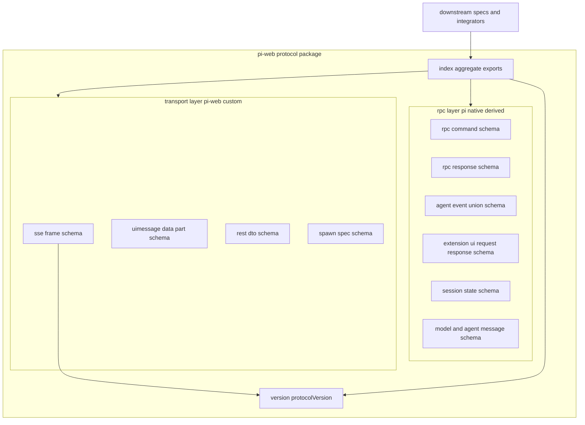
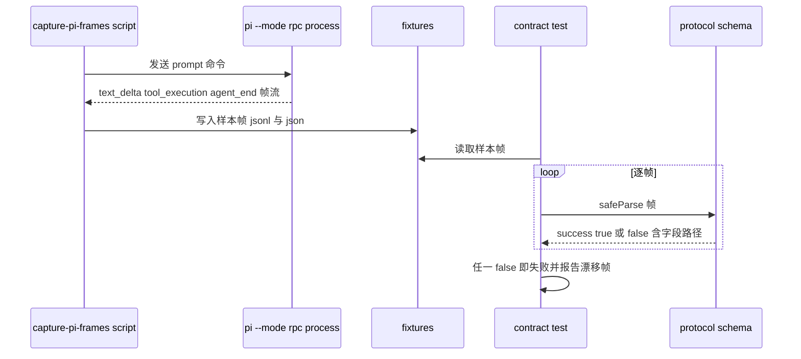

# Design Document — protocol-contract

## Overview

**Purpose**:本特性交付 `@blksails/pi-web-protocol`——pi-web 全项目的唯一契约根。它是一个零运行时依赖(除校验库)、同构(Node + 浏览器)、纯 TypeScript 的协议包,集中定义并以 zod schema 在运行时校验所有跨层契约。

**Users**:后端引擎(`rpc-channel`/`agent-source-resolver`/`agent-runner`/`session-engine`)、HTTP 层(`http-api`)、前端(`react-client`/`ui-components`)以及任意语言/框架的第三方集成方,都通过本包获取类型、schema 与版本常量。

**Impact**:把分散在 `@earendil-works/pi-coding-agent`(pi `0.79.x`)`dist/**/*.d.ts` 中未导出的 RPC 类型,以及尚无统一表达的 SSE 帧、UIMessage data-part、REST DTO,收敛为一个可校验、可版本化、可追溯来源的契约面。依赖方向 `protocol ← 所有`,本包不依赖任何其他 pi-web 包。

### Goals

- 把 pi 原生 RPC 契约本地化为带 zod schema 的本地类型,并标注来源 d.ts 路径与对齐版本(`0.79.x`)。
- 定义 pi-web 自定义传输层契约:SSE 帧(`uiMessageChunk` / `control`)、UIMessage data-part、REST DTO。
- 以 zod 为单一事实来源,静态类型由 `z.infer` 推导,杜绝类型与校验分叉。
- 导出 `protocolVersion`(SemVer)用于握手与漂移防护。
- 提供完整测试矩阵:每个 schema 正反例单测 + 对真实 `pi --mode rpc` 样本帧的契约校验(防漂移)。

### Non-Goals

- 不实现子进程 spawn、JSONL framing、`PiRpcChannel`(归 `rpc-channel`)。
- 不实现事件→UIMessage 翻译逻辑(归 `session-engine`)。
- 不实现 HTTP Route Handler、SSE 编解码与传输(归 `http-api`)。
- 不实现 agent 源解析 / runner / 前端 transport / hooks / 组件。
- 不生成 OpenAPI 文档产物(可后续从 schema 派生,本 spec 不交付)。

## Boundary Commitments

### This Spec Owns

- 全部跨层契约的 **zod schema** 与由其推导的 **静态类型**。
- pi 原生 RPC 契约的本地化:`RpcCommand` / `RpcResponse` / `AgentEvent`(可辨识联合)/ `RpcExtensionUIRequest` / `RpcExtensionUIResponse` / `RpcSessionState` / `Model` / `AgentMessage`。
- pi-web 自定义传输层契约:SSE 帧 schema(`uiMessageChunk` / `control` 两类)、UIMessage data-part schema、REST DTO schema、`SpawnSpec`(子进程启动规格,跨层契约——由 `agent-source-resolver` 产出、`rpc-channel` 消费;本包仅拥有并导出其形状,不实现源解析与 spawn 行为)。
- `protocolVersion` 常量(SemVer)及其在 SSE 帧中的承载约定。
- 包的单一聚合导出面(`index.ts`)与 pi 原生 vs 自定义的文件分层。
- 契约测试夹具(真实样本帧 fixtures)与采集脚本。

### Out of Boundary

- 任何传输/进程/网络运行时逻辑(spawn、framing、SSE 编解码、HTTP handler)。
- 事件→UIMessage 的翻译实现(本包只定义两端形状)。
- pi 资源发现、agent 源解析、信任/鉴权策略。
- 从 schema 派生 OpenAPI/JSON Schema 的生成工具。

### Allowed Dependencies

- **运行时依赖**:仅 `zod`(校验库)。禁止任何其他运行时依赖,禁止 `node:` 内置模块与浏览器专有 API。
- **开发/测试依赖**:测试框架(`vitest`)、TypeScript;契约样本采集脚本可在 devDependencies/测试目录中引用 `@earendil-works/pi-coding-agent` 与 Node 子进程能力——这些**不进入包运行时依赖**。
- **类型派生来源**:`@earendil-works/pi-coding-agent` `0.79.x` 的 `dist/**/*.d.ts`(仅作为本地化重建的参考,运行时不导入)。

### Revalidation Triggers

- 任一导出 schema 的形状变化(字段增删、类型变更、判别字段变更)。
- `protocolVersion` 升级或 SSE 帧版本承载约定变更。
- pi 版本对齐从 `0.79.x` 迁移到新版本(可能改变 RPC 形状)。
- pi 原生与自定义契约的文件分层/聚合导出面变更。
- 校验库从 zod 更换或大版本升级。

## Architecture

### Architecture Pattern & Boundary Map

模式:**Schema-as-source-of-truth 的分层契约库**。单包,按"契约来源"分层为 pi 原生(`rpc/`)与 pi-web 自定义传输层(`transport/`),`version.ts` 提供版本常量,`index.ts` 聚合导出。所有静态类型由 zod schema 推导。



**Architecture Integration**:

- **Selected pattern**:单包分层契约库,zod 为单一事实来源(`z.infer` 推导类型)。理由:满足同构 + 零运行时依赖,且类型与运行时校验天然一致。
- **Domain/feature boundaries**:`rpc/`(pi 原生派生,带来源注释)与 `transport/`(pi-web 自定义)严格分文件,二者不互相导入业务字段;`transport` 仅可引用 `version`。
- **Dependency direction**:`version` ← `transport`;`rpc` 与 `transport` 独立;`index` 聚合全部。下游只从 `index` 导入。禁止反向(`rpc`/`transport` 不导入 `index`)。
- **New components rationale**:每个 schema 文件对应一类契约,单一职责;无任何运行时抽象层(遵循简化原则)。
- **Steering compliance**:TypeScript strict、禁 `any`;零运行时依赖(除 zod);协议为稳定契约,改动走 SemVer(structure.md / tech.md)。

### Technology Stack

| Layer | Choice / Version | Role in Feature | Notes |
|-------|------------------|-----------------|-------|
| Frontend / CLI | 同构 TS(无 DOM/Node API) | 提供浏览器侧可直接 import 的类型/schema | 不含任何环境专有 API |
| Backend / Services | 同构 TS | 提供 Node 侧引擎可直接 import 的类型/schema | 同上 |
| Data / Storage | zod(校验库,运行时唯一依赖) | schema 定义 + `parse`/`safeParse` 校验 + `z.infer` 类型推导 | 唯一允许的运行时依赖 |
| Messaging / Events | — | SSE 帧 / AgentEvent 联合 schema(纯数据形状) | 传输实现归下游 |
| Infrastructure / Runtime | TypeScript strict;vitest(测试);`@earendil-works/pi-coding-agent` `0.79.x`(仅 dev/派生参考) | 构建、测试与样本采集 | pi 包不进入运行时依赖 |

## File Structure Plan

### Directory Structure

```
packages/protocol/
├── package.json                  # name @blksails/pi-web-protocol, exports, deps 仅 zod;sideEffects false
├── tsconfig.json                 # strict, 同构 target(ES2022, lib 不含 DOM 专有副作用)
├── vitest.config.ts              # 测试配置
└── src/
    ├── index.ts                  # 聚合导出:全部 schema、推导类型、protocolVersion
    ├── version.ts                # protocolVersion 常量(SemVer)+ 版本类型
    ├── rpc/                       # pi 原生派生(每文件头注释来源 d.ts 路径 + pi 0.79.x)
    │   ├── command.ts            # RpcCommand schema
    │   ├── response.ts           # RpcResponse schema
    │   ├── event.ts              # AgentEvent 可辨识联合(message_update/tool_execution_*/agent/turn/compaction/auto_retry/queue_update/extension_ui_request)
    │   ├── extension-ui.ts       # RpcExtensionUIRequest / RpcExtensionUIResponse schema
    │   ├── session-state.ts      # RpcSessionState schema
    │   └── model.ts              # Model / AgentMessage schema
    └── transport/                 # pi-web 自定义传输层
        ├── sse-frame.ts          # SSE 顶层帧 schema:kind=uiMessageChunk|control;含 protocolVersion 字段
        ├── ui-message-chunk.ts   # uiMessageChunk 负载:text/reasoning/tool/data-part
        ├── data-part.ts          # UIMessage data-part:queue/compaction/auto-retry/tool partialResult(data-pi-*)
        ├── rest-dto.ts           # REST DTO:建会话 {source,cwd?,model?,env?} + 各命令请求/响应
        └── spawn.ts              # SpawnSpec {cmd,args,cwd,env}:子进程启动规格(agent-source-resolver 产出 → rpc-channel 消费)
└── test/
    ├── rpc/*.test.ts             # 每个 rpc schema 正反例单测
    ├── transport/*.test.ts       # 每个 transport schema 正反例单测(含 spawn.test.ts)
    ├── version.test.ts           # protocolVersion 存在性 + SemVer 合法性
    ├── contract/
    │   ├── rpc-frames.contract.test.ts   # 对真实 pi --mode rpc 样本逐帧校验
    │   └── sse-frames.contract.test.ts   # 对真实 SSE 样本逐帧校验
    └── fixtures/
        ├── rpc-sample-frames.jsonl       # 采集自真实 pi --mode rpc(prompt→text_delta→tool_*→agent_end)
        └── sse-sample-frames.json        # 采集自真实 SSE 流
└── scripts/
    └── capture-pi-frames.ts      # 采集脚本(dev):跑 pi --mode rpc 录制样本到 fixtures(可再生)
```

### Modified Files

- 无(greenfield 新包)。若存在 monorepo workspace 根 `package.json`/`pnpm-workspace.yaml`,需将 `packages/protocol` 纳入 workspace —— 该接线属下游/仓库初始化,本 spec 仅创建包自身文件。

> 每个文件单一职责:一个 schema 文件 = 一类契约。`rpc/` 文件头必须注释来源 d.ts 路径与 `pi 0.79.x`。

## System Flows

### 契约校验数据流(防漂移 e2e)



采集脚本与契约测试解耦:脚本负责再生 fixtures(需真实 pi 环境),契约测试只读已落仓 fixtures,使 CI 在无 pi 时仍能校验,而 fixtures 刷新时即对齐最新 pi 协议。

## Requirements Traceability

| Requirement | Summary | Components | Interfaces | Flows |
|-------------|---------|------------|------------|-------|
| 1.1 | 导出 RPC 命令/响应/扩展UI/状态/模型/消息 schema 与类型 | command.ts, response.ts, extension-ui.ts, session-state.ts, model.ts | 各 schema + `z.infer` 类型 | — |
| 1.2 | AgentEvent 可辨识联合覆盖全部事件子类型 | event.ts | `AgentEventSchema`(union by `type`) | — |
| 1.3 | 合法对象 parse 通过 | rpc/* | `parse` | 契约校验流 |
| 1.4 | 非法对象 safeParse 返回 success false + 字段路径 | rpc/* | `safeParse` | — |
| 1.5 | schema 标注来源 d.ts 路径与 pi 版本 | rpc/*(文件头注释) | 注释约定 | — |
| 1.6 | 类型由 schema 推导(单一事实来源) | rpc/*, transport/* | `z.infer` | — |
| 2.1 | SSE 顶层帧区分两类 | sse-frame.ts | `SseFrameSchema`(kind 判别) | — |
| 2.2 | uiMessageChunk 覆盖 text/reasoning/tool/data-part | ui-message-chunk.ts | `UiMessageChunkSchema` | — |
| 2.3 | control 覆盖 extension-ui/queue/stats/error | sse-frame.ts | `ControlFrameSchema` | — |
| 2.4 | 合法帧 parse 通过且类别可判别 | sse-frame.ts | `parse` + 判别字段 | 契约校验流 |
| 2.5 | 类别不符帧 safeParse 拒绝 | sse-frame.ts | `safeParse` | — |
| 2.6 | SSE 帧含 protocolVersion | sse-frame.ts, version.ts | 帧字段引用 `protocolVersion` | — |
| 3.1 | data-part 覆盖 queue/compaction/auto-retry/tool partialResult | data-part.ts | `DataPartSchema` | — |
| 3.2 | 每类 data-part 带可辨识 type(data-pi-*) | data-part.ts | 判别 `type` 字段 | — |
| 3.3 | 合法 data-part parse 通过 | data-part.ts | `parse` | — |
| 3.4 | 未知 type/字段不符 safeParse 拒绝 | data-part.ts | `safeParse` | — |
| 4.1 | 建会话请求 DTO {source,cwd?,model?,env?} | rest-dto.ts | `CreateSessionRequestSchema` | — |
| 4.2 | 各命令请求/响应 DTO | rest-dto.ts | 各命令 DTO schema | — |
| 4.3 | 合法 DTO parse 通过 | rest-dto.ts | `parse` | — |
| 4.4 | 缺 source 时 safeParse 拒绝 | rest-dto.ts | `safeParse` | — |
| 4.5 | SpawnSpec {cmd,args,cwd,env} 跨层契约(resolver→channel) | spawn.ts | `SpawnSpecSchema` + `z.infer` 类型 | — |
| 5.1 | 导出 protocolVersion SemVer 常量 | version.ts | `protocolVersion` | — |
| 5.2 | pi 原生与自定义 DTO 分文件 | rpc/* vs transport/* | 目录分层 | — |
| 5.3 | protocolVersion 可被帧引用承载 | sse-frame.ts, version.ts | 帧字段 | — |
| 5.4 | 集中入口聚合导出 | index.ts | 单一导入面 | — |
| 6.1 | 纯 TS 同构无环境专有 API | 全部 src | — | — |
| 6.2 | 除校验库外零运行时依赖 | package.json | deps 仅 zod | — |
| 6.3 | 导入无 I/O/子进程/FS 副作用 | 全部 src;package.json sideEffects false | — | — |
| 7.1 | 每 schema 正反例单测 | test/rpc/*, test/transport/* | vitest | — |
| 7.2 | protocolVersion 存在 + SemVer 单测 | test/version.test.ts | vitest | — |
| 7.3 | 真实 rpc 样本链路逐帧校验通过 | contract/rpc-frames.contract.test.ts, fixtures | vitest | 契约校验流 |
| 7.4 | 真实 SSE 样本逐帧校验通过 | contract/sse-frames.contract.test.ts, fixtures | vitest | 契约校验流 |
| 7.5 | 任一帧不过即失败并报告漂移 | contract/* | 断言报告 | 契约校验流 |
| 7.6 | 单一测试命令运行全部并产出结果 | vitest.config.ts, package.json scripts | `pnpm test` | — |

## Components and Interfaces

| Component | Layer | Intent | Req Coverage | Key Dependencies (P0/P1) | Contracts |
|-----------|-------|--------|--------------|--------------------------|-----------|
| version.ts | version | `protocolVersion` SemVer 常量 | 5.1, 5.3 | zod (P1) | State |
| rpc/event.ts | rpc | AgentEvent 可辨识联合 | 1.2, 1.3, 1.4, 1.6 | zod (P0) | Event |
| rpc/command.ts · response.ts · extension-ui.ts · session-state.ts · model.ts | rpc | pi 原生命令/响应/扩展UI/状态/模型/消息 schema | 1.1, 1.3–1.6 | zod (P0) | Service |
| transport/sse-frame.ts | transport | SSE 顶层两类帧判别 + 版本承载 | 2.1, 2.3–2.6, 5.3 | version (P0), zod (P0) | Event |
| transport/ui-message-chunk.ts | transport | uiMessageChunk 负载 schema | 2.2 | zod (P0) | Event |
| transport/data-part.ts | transport | pi 特有 data-part schema | 3.1–3.4 | zod (P0) | Event |
| transport/rest-dto.ts | transport | REST 请求/响应 DTO | 4.1–4.4 | zod (P0) | API |
| transport/spawn.ts | transport | SpawnSpec 子进程启动规格(跨层契约) | 4.5 | zod (P0) | Service |
| index.ts | aggregate | 聚合导出全部 schema/类型/版本 | 5.4 | 全部 src (P0) | Service |

### rpc layer(pi 原生派生)

#### AgentEventSchema(rpc/event.ts)

| Field | Detail |
|-------|--------|
| Intent | 以 `type` 为判别键的 AgentEvent 可辨识联合 |
| Requirements | 1.2, 1.3, 1.4, 1.6 |

**Responsibilities & Constraints**
- 覆盖事件子类型:`agent_start`、`agent_end`、`turn_end`、`message_update`(子事件 `text_start`/`text_delta`/`text_end`/`thinking_start`/`thinking_delta`/`thinking_end`)、`tool_execution_start`、`tool_execution_update`(`partialResult` 为累积值)、`tool_execution_end`、`compaction_*`、`auto_retry_*`、`queue_update`、`extension_ui_request`。
- 文件头注释来源 d.ts 路径与对齐 `pi 0.79.x`(Req 1.5)。
- 数据形状契约,不含任何运行时行为。

**Dependencies**
- External: `zod` — schema 构建与校验 (P0)
- External: `@earendil-works/pi-coding-agent` `0.79.x` `dist/**/*.d.ts` — 仅作派生参考,运行时不导入 (P1)

**Contracts**: Event [x]

##### Event Contract
- 形状:可辨识联合,判别字段 `type`。
- 派生类型:`export type AgentEvent = z.infer<typeof AgentEventSchema>`。
- 校验:`AgentEventSchema.parse` / `.safeParse`;非法子类型返回带 `path` 的错误。

**Implementation Notes**
- Integration:下游 `session-engine` 用本 schema 校验来自 RPC 通道的事件,再翻译为 UIMessage。
- Validation:每个子类型 + 联合整体的正反例单测(7.1)。
- Risks:pi 升级改子类型形状 → 契约测试(7.3)暴露漂移。

#### 其余 rpc schema(command/response/extension-ui/session-state/model)

**Summary-only**:各自为单一 pi 原生类型的 zod 重建,文件头注释来源 d.ts + `pi 0.79.x`,导出 schema 与 `z.infer` 类型。契约类型按用途为 Service(命令/响应/状态/模型)。覆盖 1.1、1.3–1.6。

### transport layer(pi-web 自定义)

#### SseFrameSchema(transport/sse-frame.ts)

| Field | Detail |
|-------|--------|
| Intent | SSE 顶层帧:以 `kind` 判别 `uiMessageChunk` 与 `control` 两类,并承载 `protocolVersion` |
| Requirements | 2.1, 2.3, 2.4, 2.5, 2.6, 5.3 |

**Responsibilities & Constraints**
- `kind: "uiMessageChunk"` 帧内嵌 `UiMessageChunkSchema`(text/reasoning/tool/data-part)。
- `kind: "control"` 帧负载覆盖 `extension-ui`、`queue`、`stats`、`error`(以内层判别字段区分)。
- 含 `protocolVersion` 字段,值引用 `version.ts` 的 `protocolVersion`(Req 2.6/5.3)。
- 仅可依赖 `version` 与 `zod`(依赖方向约束)。

**Contracts**: Event [x]

##### Event Contract
- 形状:`kind` 判别的两类联合;`control` 内再以子类型判别。
- 校验:类别字段缺失或与负载不匹配 → `safeParse` 返回 `success:false`(Req 2.5)。
- 派生类型:`SseFrame = z.infer<typeof SseFrameSchema>`。

**Implementation Notes**
- Integration:`http-api` 用本 schema 编码 SSE 输出;`react-client` 用其解码;`extension-ui` 控制帧走旁路(非 UIMessage)。
- Validation:两类帧正反例 + 版本字段存在性单测;真实 SSE 样本契约校验(7.4)。
- Risks:与真实 SSE 输出形状漂移 → 7.4/7.5 暴露。

#### DataPartSchema(transport/data-part.ts)

**Full block 简述**:pi 特有 data-part 联合,judged by `type`(如 `data-pi-queue`、`data-pi-compaction`、`data-pi-auto-retry`、`data-pi-ui`)。覆盖 3.1–3.4。Contracts: Event。下游 `react-client` 按 `type` 分发渲染器。

> 注(2026-06-20):原成员 `data-pi-tool-partial` 已移除。`tool_execution_update` 的累积 `partialResult` 不再产独立 data-part,改翻译为 `tool-output-available` + `preliminary: true`(标准 tool chunk,新增可选 `preliminary` 字段)喂进同一工具卡;详见 `web-ui-custom-rendering` 与 `tool-call-ui-redesign` spec。

#### RestDtoSchema 系列(transport/rest-dto.ts)

| Field | Detail |
|-------|--------|
| Intent | REST 请求/响应 DTO:建会话 + 各命令 |
| Requirements | 4.1, 4.2, 4.3, 4.4 |

**Contracts**: API [x]

##### API Contract
| Method | Endpoint | Request | Response |
|--------|----------|---------|----------|
| POST | /sessions | `CreateSessionRequest {source, cwd?, model?, env?}` | `{ sessionId }` |
| POST | /sessions/:id/messages | `PromptRequest` | ack/状态 |
| POST | /sessions/:id/{steer,follow_up,abort} | 对应请求 | ack |
| POST | /sessions/:id/{model,thinking} | 对应请求 | ack |
| GET | /sessions/:id/{state,stats,messages,commands} | — | 对应响应 DTO |
| POST | /sessions/:id/ui-response | `ExtensionUIResponse` | ack |
| DELETE | /sessions/:id | — | ack |

- `source` 必填,缺失 → `safeParse` 拒绝(Req 4.4)。
- 本 spec 只定义 DTO 形状,不实现端点(端点归 `http-api`)。

**Implementation Notes**
- Integration:`http-api` 在边界 `safeParse` 入参;集成方据此对接。
- Validation:建会话缺 `source` 反例、各 DTO 正反例(7.1)。

#### SpawnSpecSchema(transport/spawn.ts)

| Field | Detail |
|-------|--------|
| Intent | 子进程启动规格 `SpawnSpec`:agent-source-resolver 产出、rpc-channel 消费的跨层契约 |
| Requirements | 4.5 |

**Responsibilities & Constraints**
- 形状:`SpawnSpec { cmd: string; args: string[]; cwd: string; env: Record<string, string> }`,全部字段必填。
- 与 `CreateSessionRequest { source, cwd?, model?, env? }` 是**不同契约**:后者是 REST 入参(`source` 是 agent 源标识、`cwd`/`env` 可选),前者是源解析后得到的、可直接交给子进程启动的具体命令规格(已无歧义、字段必填)。二者不可混用。
- 数据形状契约,不含进程/IO 行为(spawn 实现归 `rpc-channel`,源解析归 `agent-source-resolver`,均 Out of Boundary)。
- 仅依赖 `zod`。

**Contracts**: Service [x]

##### Service Contract
- 形状:`{ cmd, args, cwd, env }` 四字段全必填。
- 派生类型:`export type SpawnSpec = z.infer<typeof SpawnSpecSchema>`。
- 校验:缺任一字段或类型不符 → `safeParse` 返回 `success:false` 且 `error.path` 可定位(Req 4.5)。

**Implementation Notes**
- Integration:`agent-source-resolver` 解析 agent 源后构造 `SpawnSpec` 并 `parse`;`rpc-channel` 在 spawn 边界以同一 schema `safeParse` 后据其启动 `pi --mode rpc`。本包作为二者之间的唯一契约面,防止字段约定漂移。
- Validation:四字段齐全正例、缺字段/类型错反例单测(7.1)。

### aggregate

#### index.ts

**Summary-only**:从 `version`、`rpc/*`、`transport/*` re-export 全部 schema、`z.infer` 类型与 `protocolVersion`,作为下游唯一导入面(Req 5.4)。不得反向被 `rpc`/`transport` 导入。

## Data Models

### Data Contracts & Integration

- **序列化格式**:JSON(RPC 走 JSONL,SSE 走 event-stream;本包只定义对象形状,framing/编码归下游)。
- **单一事实来源**:每个契约一个 zod schema,类型 `export type X = z.infer<typeof XSchema>`;禁止手写并行类型(Req 1.6)。
- **版本策略**:`protocolVersion` SemVer;SSE 帧携带版本供前后端协商(Req 2.6/5.3)。schema 形状变更走 SemVer(Revalidation Trigger)。
- **来源可追溯**:`rpc/*` 文件头注释 d.ts 来源路径与 `pi 0.79.x`(Req 1.5)。

## Error Handling

### Error Strategy

本包为纯校验契约,无运行时副作用。错误表面仅来自 zod 校验:

- **校验失败**:`safeParse` 返回 `{ success: false, error }`,`error.issues[].path` 定位出错字段(Req 1.4/2.5/3.4/4.4)。调用方(下游)决定如何处理(拒绝请求 / 报错 / 丢弃帧)。
- **fail fast**:在边界(RPC 入站、SSE 出站、REST 入参)由下游调用 schema 校验。
- **契约漂移**:由契约测试在 CI 暴露(非运行时错误),失败报告未通过帧及字段路径(Req 7.5)。

### Monitoring

- 不在包内做监控;运行时可观测由下游 spec 负责。
- 契约健康度通过 CI 测试结果与 fixtures 刷新可见。

## Testing Strategy

测试项直接源自验收标准,不用泛化模板。

### Unit Tests
- 每个 `rpc/*` 与 `transport/*` schema 的 `parse` 正例(合法对象通过)与 `safeParse` 反例(缺字段/类型错被拒,且 `error.path` 可定位)。(7.1, 1.4, 2.5, 3.4, 4.4)
- `AgentEventSchema` 各子类型(含 `message_update` 子事件、`tool_execution_*`、`extension_ui_request`)正反例。(1.2, 1.3)
- `SseFrameSchema` 两类帧判别正反例 + `protocolVersion` 字段存在性。(2.1, 2.4, 2.5, 2.6)
- `protocolVersion` 存在且为合法 SemVer。(7.2, 5.1)
- 类型由 schema 推导(`z.infer`)的编译期一致性(类型测试 / `tsc` 通过)。(1.6)

### Integration / Contract Tests(防漂移 e2e,硬性)
- `rpc-frames.contract.test.ts`:读取 `fixtures/rpc-sample-frames.jsonl`(采自真实 `pi --mode rpc`,覆盖 `prompt → text_delta → tool_execution start/update/end → agent_end`),逐帧 `safeParse`,全部必须 `success:true`;任一失败即报告漂移帧与字段路径。(7.3, 7.5)
- `sse-frames.contract.test.ts`:读取 `fixtures/sse-sample-frames.json`(采自真实 SSE),逐帧校验全部通过。(7.4, 7.5)
- 采集脚本 `scripts/capture-pi-frames.ts` 可再生 fixtures(需真实 pi 环境);测试只读 fixtures,使 CI 无 pi 时仍可校验。

### 运行约定
- 单一命令(`pnpm test`)运行全部单测 + 契约测试并产出可验证结果。(7.6)

## Security Considerations

- 包零运行时副作用、无 I/O,攻击面仅为"被下游用于校验输入"。下游必须在信任边界对入站数据 `safeParse` 后再使用(本包提供能力,使用归下游)。
- `env`、`source` 等敏感入参的 DTO 仅定义形状;脱敏/白名单/信任策略归 `http-api`/`extension-management`(Out of Boundary)。
