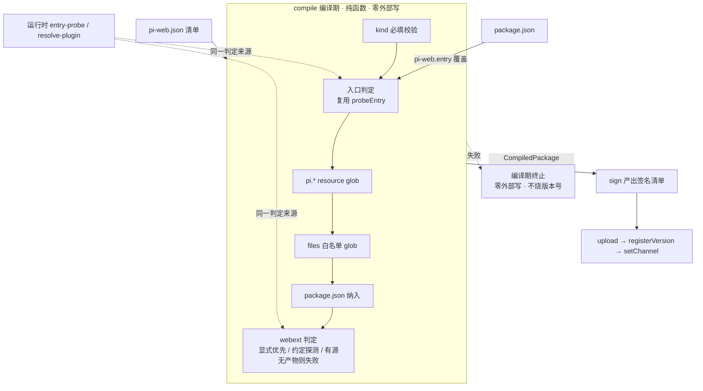
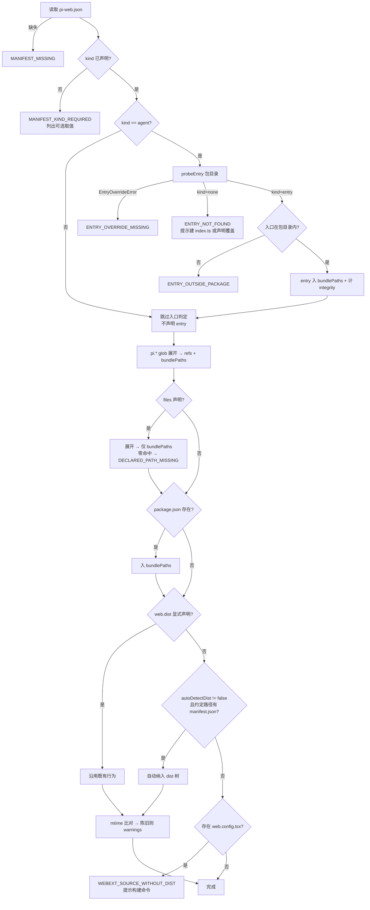

# Technical Design Document

## Overview

**Purpose**:本特性使 `pi-web publish` 能够真正发布 `kind:"agent"` 的包 —— 当前该通道 100% 失败且每次失败永久烧掉一个版本号(#28);同时为入口、附属文件与 webext 产物提供正规的打包声明通道,消除「走私进 `pi.extensions`」与「静默跳过 webext」两种畸形用法(#29)。

**Users**:agent 作者(执行发布)与 pi-cloud 终端用户(消费发布结果;canvas 面板失效即本缺陷的下游表现)。

**Impact**:改造集中在**编译期纯函数**(`manifest-compiler.ts` 的 `compile()`/`sign()`)与**清单 schema**。不新增组件、不改变发布流程的阶段划分(compile → sign → upload → register → setChannel),不触及服务端。核心手法是**让发布期复用运行时已有的两处探测约定**,把「必须显式声明、不声明则静默失败」改为「自动推导 + 显式覆盖」。

### Goals

- `kind:"agent"` 的包可经 CLI 完成完整发布链路,登记状态为 `ready`(#28 闭合)。
- 入口、`package.json`、任意附属文件、webext 产物均有正规入 bundle 的通道(#29 闭合)。
- 发布期与运行期对「入口是哪个文件」「webext 产物在哪」达成**同一判定**,消除错位。
- 所有可预见错误前移至**任何外部写之前**,失败不消耗版本号。

### Non-Goals

- **不改 registry 侧校验**(pi-clouds 零改动)。
- **不实现隐式自动构建**。
- **不新增第二个入口声明位**(不在 `pi-web.json` 加 `entry`)。
- **不补全 37 个仓内私有示例的清单**(仅补生产在用的 `aigc-canvas-agent`)。
- **不解决** `sign()` 从不产出 `manifest.routes` 导致 registry 能力快照 `hasRoutes` 恒假 —— 同类缺陷,另立课题。

## Boundary Commitments

### This Spec Owns

- 发布期**入口判定**的来源与失败语义(Req 1)。
- 发布产物**文件集合**的确定规则:入口、`package.json`、`files` 白名单、webext 产物树(Req 2、3)。
- `pi-web.json` 清单的**字段契约**:新增 `files`、新增 `web.autoDetectDist`(Req 2.3、3.6);`kind` 的**发布期**必填校验(Req 4;共享 schema 保持缺省,见契约层修正)。
- 编译期**错误码与提示文案**,以及失败发生的时机(Req 5)。

### Out of Boundary

- **registry 的清单校验与回源核验规则**(`validate.ts` / `collectIntegrityRefs`)—— 本设计适配它,不改它。
- **运行时的入口探测与 webext 解析实现**(`entry-probe.ts` / `resolve-plugin.ts`)—— 本设计**引用**其判定,不修改其行为。
- **发布编排的阶段与错误分级**(`publish-orchestrator.ts` 的 upload/register/channel 三段)—— 仅消费 compile 产物,不重构。
- **webext 产物的构建过程**(各示例包自身的构建脚本)。

### Allowed Dependencies

- `server/cli/publish/` **可**从 `@blksails/pi-web-server` barrel 导入 `probeEntry` 与 `EntryOverrideError`;该 barrel 明确保证「仅 node builtins + agent-source 只读探测,无 pi SDK 值导入」(`packages/server/src/index.ts:43`),且已有先例 `server/cli/install/local-source-registry.ts:40`。
- `server/cli/publish/` 依赖 `@blksails/pi-web-protocol` 的清单 schema(既有依赖)。
- **禁止**发布期反向依赖 `server/cli/install/` 或任何 registry 客户端实现细节。

### Revalidation Triggers

以下变更须让本设计与其消费方重新校验集成:

- 运行时入口探测优先级或覆盖字段变更(`ENTRY_PRIORITY` / `package.json#pi-web.entry`)。
- 运行时 webext 默认产物路径变更(`DEFAULT_WEBEXT_DIST`)。
- registry 侧对 `manifest.entry` 的必需性、或 `collectIntegrityRefs` 收集范围变更。
- `pi-web.json` 清单 schema 的必填字段集变更。

## Architecture

### Existing Architecture Analysis

发布链路现状(`server/cli/publish/`):

| 阶段 | 位置 | 现状 |
|---|---|---|
| compile | `manifest-compiler.ts:95-161` | 解析 `pi-web.json` → `pi.*` 四个 resource 字段 glob 展开(产出 `refs` + `bundlePaths`)→ `web.dist` 显式声明时纳入 dist 树 → 零命中即 `DECLARED_PATH_MISSING` |
| sign | `manifest-compiler.ts:196-226` | 产出 `schemaVersion/name/version/kind/publisher` + resource 字段 + `webext`,Ed25519 签名 |
| upload/register/channel | `publish-orchestrator.ts:76-93` | 三段外部写;`--dry-run` 在 sign 之后即返回(`:71-73`),`--commit-only` 停在 setChannel 前(`:86-87`) |

**必须保持的既有契约**:

- `bundlePaths` 是 tarball 的文件集合(`publish-orchestrator.ts:76`),`refs` 是需完整性核验的引用集合 —— **二者不等价**,后者是前者的子集语义。
- registry 侧 `collectIntegrityRefs`(pi-clouds `registry-service.ts:850-852`)**无条件收 `manifest.entry`** 并逐项回源核验 ⇒ 声明了 entry 却未打包 ⇒ `persistFailed(INTEGRITY)`,**版本号照样烧掉**。故 Req 2.1 与 Req 1.1 必须成对实现。
- 安装侧把整个解包目录 rename 为 targetDir(`server/cli/install/registry-install.ts:180-186`),**不按 refs 挑文件** ⇒ 只要文件在 tarball 内即可落盘并被运行时探测到。这解释了「走私为何有效」,也确立了「进 bundlePaths 即可用」这一实现前提。

**被复用的两处运行时约定**:

| 约定 | 位置 | 语义 |
|---|---|---|
| 入口探测 | `packages/server/src/agent-source/entry-probe.ts:51-68` | `package.json#pi-web.entry` 覆盖优先(文件不存在则抛 `EntryOverrideError`,**不静默回退**)→ 否则 `index.ts` > `index.js` > `index.mjs` → 均无则 `{kind:"none"}` |
| webext 产物探测 | `packages/server/src/plugin/resolve-plugin.ts:23,197-210` | 显式 `web.dist` 优先(缺 `manifest.json` 则进 diagnostics 忽略)→ 否则探测 `DEFAULT_WEBEXT_DIST = .pi/web/dist` 下的 `manifest.json`,存在即启用 |

⇒ **本设计不发明约定,只是让发布期追平上表。**

### Architecture Pattern & Boundary Map



**Architecture Integration**:

- **Selected pattern**:在既有编译期纯函数内**扩展判定规则**,不引入新组件、不改变阶段划分。理由:所有新增行为都是「在 compile 内多算几个来源」,引入组件只会增加接缝而无收益。
- **Domain boundaries**:compile 只产出**数据**(`CompiledPackage`),不做 IO 之外的副作用;sign 只做**序列化 + 签名**;外部写全部留在 orchestrator。三者职责不变。
- **Existing patterns preserved**:`Result<T, CompileError>` 判别式错误返回(`manifest-compiler.ts:73-92`)、`fail()/ok()` 构造、`DECLARED_PATH_MISSING` 对显式声明零命中的既有语义。
- **New components rationale**:无新组件。仅新增**错误码**与 `CompiledPackage` 的两个字段。

### Technology Stack

| Layer | Choice / Version | Role in Feature | Notes |
|-------|------------------|-----------------|-------|
| CLI | `@blksails/pi-web` bin `pi-web` | 承载 publish 子命令 | **须发 0.3.1 才对作者生效** |
| 契约 | `@blksails/pi-web-protocol`(zod) | `PiWebManifestSchema` 字段契约 + 路径约定常量 | **全部为新增可选字段**,无收紧 ⇒ 运行时与存量包零影响 |
| 探测复用 | `@blksails/pi-web-server` barrel | `probeEntry` / `EntryOverrideError` | 只读探测,无 pi SDK 值导入 |
| 服务端 | pi-clouds registry | 消费方,**零改动** | 存量版本本就带 entry,校验放行 |

## File Structure Plan

### Modified Files

- `packages/protocol/src/plugin/plugin-manifest.ts` — 新增 `files?: string[]`;`PluginWebSchema` 新增 `autoDetectDist?: boolean`(缺省 `true`);新增 `DEFAULT_WEBEXT_DIST` / `WEBEXT_SOURCE_CONFIG` 两个路径约定常量(单一真源)。**`kind` 保持 `.default("plugin")` 不变** —— 见下方修正说明。
- `server/cli/publish/manifest-compiler.ts` — 主改造点:`CompileError` 扩五个错误码;`CompiledPackage` 增 `entry` 与 `warnings`;`compile()` 增入口判定、`files` 展开、`package.json` 纳入、webext 探测与陈旧检查;`sign()` 产出 `entry`。
- `server/cli/index.ts` — 新错误码的用户可读文案渲染;dry-run 与正式发布均输出 `warnings`。
- `test/publish/publish-orchestrator.test.ts` — 新增编译期用例(R3–R11)。
- `test/publish/publish-install-e2e.test.ts` — 新增 #28 回归与发布/运行一致性用例(R1、R2)。

### New Files

- `examples/aigc-canvas-agent/pi-web.json` — 生产在用包的发布清单(`kind:"agent"` + `files:["routes/**"]`),同时充当 R1 回归夹具的真实来源。

## System Flows

### compile 判定流程(核心)



## Requirements Traceability

| Requirement | Summary | Components | Interfaces | Flows |
|---|---|---|---|---|
| 1.1 | agent 按运行时约定确定入口并声明 | `compile()`、`sign()` | `probeEntry` | compile 判定流程 |
| 1.2 | 覆盖优先于文件名约定 | `compile()` | `probeEntry`(内含覆盖逻辑) | 同上 |
| 1.3 | 覆盖文件缺失即终止,不回退 | `compile()` | `ENTRY_OVERRIDE_MISSING` | 同上 |
| 1.4 | 无任何入口即终止并提示 | `compile()` | `ENTRY_NOT_FOUND` | 同上 |
| 1.5 | 入口越界即终止 | `compile()` | `ENTRY_OUTSIDE_PACKAGE` | 同上 |
| 1.6 | 非 agent 不声明 entry | `compile()`/`sign()` | `CompiledPackage.entry?` | 同上 |
| 1.7 | 发布期入口 === 运行期探测入口 | `compile()` | `probeEntry`(同一函数) | 测试 R2 |
| 2.1 | 入口进发布产物 | `compile()` | `bundlePaths` | compile 判定流程 |
| 2.2 | `package.json` 进发布产物 | `compile()` | `bundlePaths` | 同上 |
| 2.3 | `files` 进产物但不进核验引用 | `compile()` | `PiWebManifestSchema.files` | 同上 |
| 2.4 | `files` 零命中即终止 | `compile()` | `DECLARED_PATH_MISSING` | 同上 |
| 2.5 | 无需伪装为扩展资源 | `compile()` | `files` + `entry` | — |
| 2.6 | 安装后具备全部已声明文件 | (消费既有安装语义) | `registry-install` rename 整目录 | 测试 R1 |
| 3.1 | 显式 dist 声明行为不变 | `compile()` | `PluginWebSchema.dist` | compile 判定流程 |
| 3.2 | 未声明则约定探测并自动纳入 | `compile()` | `DEFAULT_WEBEXT_DIST` 同值约定 | 同上 |
| 3.3 | 有源无产物硬失败并给构建命令 | `compile()` | `WEBEXT_SOURCE_WITHOUT_DIST` | 同上 |
| 3.4 | 不自动构建 | (设计约束,无执行路径) | — | — |
| 3.5 | 产物陈旧则警告不阻断 | `compile()` | `CompiledPackage.warnings` | 同上 |
| 3.6 | 可关闭自动探测 | `compile()` | `PluginWebSchema.autoDetectDist` | 同上 |
| 4.1 | 类型必填 | `compile()` | 原始 JSON 键存在性检查 | compile 判定流程 |
| 4.2 | 缺失即终止并告知取值 | `compile()` | `MANIFEST_KIND_REQUIRED` | compile 判定流程 |
| 4.3 | 不推断默认值 | `compile()` | 判据为「作者是否书写」而非解析后取值 | — |
| 5.1 | 编译期失败先于任何外部写 | `publish-orchestrator` | 既有 compile→sign→写 顺序 | — |
| 5.2 | 失败不产生版本记录,版本号可复用 | `publish-orchestrator` | 既有短路返回 | 测试 R4/R5 |
| 5.3 | dry-run 施加同等校验 | `publish-orchestrator:71-73` | 既有(compile/sign 在 dry-run 之前) | — |
| 5.4 | 警告在两种模式均输出 | `server/cli/index.ts` | `CompiledPackage.warnings` | — |
| 6.1 | agent 全链发布成功且 ready | 全部 | — | 测试 R1 |
| 6.2 | 不使存量版本失效 | (仅新增可选字段) | — | — |
| 6.3 | 不依赖 registry 改动 | (设计约束) | — | — |
| 6.4 | 显式 dist 声明产物一致 | `compile()` | — | 测试 R6 反向 |
| 6.5 | 既有声明缺失语义不变 | `compile()` | `DECLARED_PATH_MISSING` 仅对显式声明触发 | — |

## Components and Interfaces

### 契约层 · `@blksails/pi-web-protocol`

#### PiWebManifestSchema 变更

| Field | Detail |
|---|---|
| Intent | 清单字段契约:收紧 `kind`,新增两个可选声明位 |
| Requirements | 2.3, 3.6, 4.1, 4.3 |

```ts
// 变更点(其余字段不动)
kind: PluginKindSchema.default("plugin"),     // ★ 保持不变,见下方「修正」
files: z.array(z.string()).optional(),        // 通用文件白名单(glob);进 bundle 不进 refs
// PluginWebSchema 内:
autoDetectDist: z.boolean().default(true),    // 置 false 则跳过约定探测
// 新增路径约定常量(运行时与发布期单一真源):
export const DEFAULT_WEBEXT_DIST = ".pi/web/dist";
export const WEBEXT_SOURCE_CONFIG = ".pi/web/web.config.tsx";
```

> ### ★ 修正(2026-07-20 实现期,主控核验发现)
>
> 本设计初稿写的是「`kind` 去除默认值改必填」,**该做法已被推翻并改正**。
>
> **问题**:该 schema 不只服务发布期 —— `packages/server/src/plugin/resolve-plugin.ts:14,71-79` 用**同一个** `PiWebManifestSchema` 解析**已安装**的包,且 `safeParse` 失败时 `return undefined`,导致整份清单被丢弃、退化为按目录名推导的描述符。实测证据:`resolve-plugin.test.ts` 报 `expected "pi-plugin-resolve-RWr5Ni" to be "code-review"` —— 连 id 都不对了。影响面 `packages/server` 10 red + `packages/protocol` 2 red。
>
> 这**违反本 spec 自己的 R6.2**(不使任何已发布的存量版本失效),且是**运行时静默故障**而非发布期报错 —— 恰是本 spec 立项要根除的那类模式(声明缺失导致静默降级)。
>
> **改正**:强制点从契约层下沉到**发布期**。schema 完全保持原状(含 `.default("plugin")`),由 `compile()` 检查**原始 JSON 里作者有没有书写 `kind` 键**(而非解析后有没有值 —— 有 default 时解析后恒有值,检测不出"没写")。
>
> **结果**:发布侧拿到强约束(缺 kind 即 `MANIFEST_KIND_REQUIRED`,不可能发出类型错的包),运行时对存量包零影响,且所有消费方无需处理 `kind: undefined`。R4.1 的原始措辞「**发布清单** shall 要求显式声明包类型」本就指向发布期,是初稿实现越过了该边界。

- **不变式**:所有 schema 变更均为**纯新增可选字段**,对存量清单与运行时解析**零影响**。
- **边界**:schema 只描述**形状**且须对运行时消费保持宽容;发布期的额外约束归 `compile()`。

### 编译层 · `server/cli/publish/manifest-compiler.ts`

#### compile() 扩展

| Field | Detail |
|---|---|
| Intent | 在既有 resource glob 之外,补齐入口、附属文件、webext 三条纳入通道 |
| Requirements | 1.1–1.6, 2.1–2.4, 3.1–3.3, 3.5–3.6, 4.2 |

**接口契约**:

```ts
export interface CompiledPackage {
  // …既有字段不变(kind/id/version/displayName/description/refs/webextDist/webextManifestIntegrity/bundlePaths)
  /** kind=agent 时的入口引用;非 agent 恒 undefined(Req 1.6)。 */
  readonly entry?: { readonly path: string; readonly integrity: string };
  /** 非阻断告警(当前仅 webext 产物陈旧)。 */
  readonly warnings: readonly string[];
}

export type CompileError =
  // …既有码
  | { readonly code: "MANIFEST_KIND_REQUIRED"; readonly allowed: readonly string[] }
  | { readonly code: "ENTRY_NOT_FOUND"; readonly candidates: readonly string[] }
  | { readonly code: "ENTRY_OVERRIDE_MISSING"; readonly declared: string }
  | { readonly code: "ENTRY_OUTSIDE_PACKAGE"; readonly resolved: string }
  | { readonly code: "WEBEXT_SOURCE_WITHOUT_DIST"; readonly source: string; readonly expectedDist: string };
```

- **Preconditions**:`packageDir` 为已存在目录。
- **Postconditions**:成功时 `bundlePaths` ⊇ {entry(若 agent)} ∪ {package.json(若存在)} ∪ {resource glob 命中} ∪ {files 命中} ∪ {webext dist 全树(若纳入)};`refs` **不含** `files` 与 `package.json`(Req 2.3)。
- **Invariants**:compile **无任何外部写**;任一错误返回时调用方不得进入 upload。
- **入口越界判定**:`probeEntry` 返回绝对路径,以 `packageDir` 为根做包含性判断;越界即 `ENTRY_OUTSIDE_PACKAGE`(理由:registry 侧 `assertSafeRelativePath` 会拒绝包外路径,不前置拦截就会烧号)。
- **entry 与 resource 重复**:若入口同时被 `pi.extensions` 命中,`bundlePaths` 为 Set 天然去重;`refs` 保留该 resource 条目,`entry` 独立声明 —— registry 对同一文件的两次核验幂等,无冲突。

#### sign() 扩展

| Field | Detail |
|---|---|
| Intent | 把 `entry` 写入签名清单 |
| Requirements | 1.1, 1.6 |

```ts
// base 构造中新增(仅当 pkg.entry 存在):
if (pkg.entry) base["entry"] = { path: pkg.entry.path, integrity: pkg.entry.integrity };
```

- **不变式**:签名覆盖范围随之扩大 —— `entry` 参与规范化字节,验签方(registry `verifyManifest`)按同一规则计算,无需改动。
- **顺序无关**:`signManifest` 内部做规范化(canonical),字段插入位置不影响签名。

### 呈现层 · `server/cli/index.ts`

| Field | Detail |
|---|---|
| Intent | 新错误码的可读文案与警告输出 |
| Requirements | 1.3, 1.4, 3.3, 4.2, 5.4 |

- `WEBEXT_SOURCE_WITHOUT_DIST` 文案**必须包含应执行的构建命令**(Req 3.3),而非仅陈述缺失。
- `MANIFEST_KIND_REQUIRED` 文案**必须列出可选取值**(Req 4.2)。
- `warnings` 在 dry-run 与正式发布**两条路径**均输出(Req 5.4)。

## Error Handling

| 场景 | 错误码 | 时机 | 是否烧版本号 |
|---|---|---|---|
| 清单缺失 | `MANIFEST_MISSING`(既有) | compile | 否 |
| 未声明 kind | `MANIFEST_KIND_REQUIRED` | compile | 否 |
| agent 无入口 | `ENTRY_NOT_FOUND` | compile | 否 |
| 入口覆盖文件缺失 | `ENTRY_OVERRIDE_MISSING` | compile | 否 |
| 入口越出包目录 | `ENTRY_OUTSIDE_PACKAGE` | compile | 否 |
| 显式声明零命中 | `DECLARED_PATH_MISSING`(既有,语义不变) | compile | 否 |
| 有 webext 源无产物 | `WEBEXT_SOURCE_WITHOUT_DIST` | compile | 否 |
| 产物陈旧 | (warning,不阻断) | compile | 否 |

**设计要点**:全部新增失败面都在 compile 内,即 `publish-orchestrator.ts:61-62` 的第一步 —— **早于 upload/register/channel 三段外部写**,故 Req 5.2 天然成立。这是把 #28「失败即烧号」根治的结构性保证,而非依赖调用方自律。

## Testing Strategy

### 回归与一致性(`test/publish/publish-install-e2e.test.ts`)

该文件是**唯一**拉起真实 in-proc `RegistryService` 的测试面(会跑 `validateManifest` + `collectIntegrityRefs` + 回源核验),因此也是唯一能复现 #28 的地方。

- **R1(#28 回归 · 必须先红)**:`kind:"agent"` + `index.ts` + `routes/` 全链 publish → install。**先写时必须失败,且失败原因必须是 `VALIDATION: manifest.entry must be an object`** —— 复现不出原始症状则该用例无效。修复后转绿,断言登记状态为 `ready`。(Req 6.1, 2.6)
- **R2(发布/运行一致性)**:安装完成后对 targetDir 调用 `probeEntry`,断言其结果与清单 `entry.path` 指向同一文件。(Req 1.7)

### 编译期用例(`test/publish/publish-orchestrator.test.ts`)

现有用例全部为 `kind:"plugin"` 且使用不验签的 fake port,故 #28 在此面天然测不出 —— 新增用例聚焦编译期判定本身。

| # | 场景 | 断言 | Req |
|---|---|---|---|
| R3 | `package.json#pi-web.entry` 覆盖 | 清单 entry 跟随覆盖;`package.json` 在产物内 | 1.2, 2.2 |
| R4 | agent 无任何入口 | `ENTRY_NOT_FOUND`,且 upload/register/channel 调用计数**均为 0** | 1.4, 5.1, 5.2 |
| R5 | 覆盖指向包外 | `ENTRY_OUTSIDE_PACKAGE`,零外部写 | 1.5 |
| R6 | 有约定 dist 无显式声明 | 清单含 webext,dist 全树进产物 | 3.2 |
| R7 | 有 `web.config.tsx` 无 dist | `WEBEXT_SOURCE_WITHOUT_DIST`,**文案含构建命令**,零外部写 | 3.3 |
| R8 | dist mtime 早于源 | 发布成功且 `warnings` 非空 | 3.5 |
| R9 | `autoDetectDist:false` + 有 dist | 清单**无** webext | 3.6 |
| R10 | `kind:"plugin"` 且存在 `index.ts` | 清单**无** entry | 1.6 |
| R11 | `files` 展开 | 命中文件进产物**但不进 refs**;零命中 → `DECLARED_PATH_MISSING` | 2.3, 2.4 |
| R12 | 清单未写 `kind` | `MANIFEST_KIND_REQUIRED`,文案列出可选取值 | 4.2 |

### 不新增的测试面

pi-clouds `packages/registry-client/test/manifest-kind.test.ts` 已覆盖 kind/entry 的服务端规则,且本设计不改服务端 —— **不新增、不修改**。

## Rollout & Compatibility

| 项 | 结论 |
|---|---|
| 生效条件 | publish CLI 随 `@blksails/pi-web` 分发,**须发 0.3.1**;作者升级后生效 |
| pi-clouds | **零改动、无需跟随升版**(protocol 新增字段仅发布侧消费) |
| 生产运行时 | pi-cloud 不经过 publish 路径 ⇒ **零部署影响** |
| 存量制品 | 已发布版本本就带 `entry`,校验放行,**不失效**(Req 6.2) |
| 行为变更(breaking) | 仅一条:「有 webext 源但无产物」从「发出去但界面缺失」变为「发不出去」。**故意变更**;全部在编译期、外部写之前 ⇒ 不烧号,可安全迭代。`kind` 的强制**不构成运行时 breaking**(见 §契约层修正) |
| 已烧号处置 | `e2e/agent-routes-demo@1.0.0`、canvas `1.0.0–1.0.2` 已占用,修复后重发须递增版本号 |
