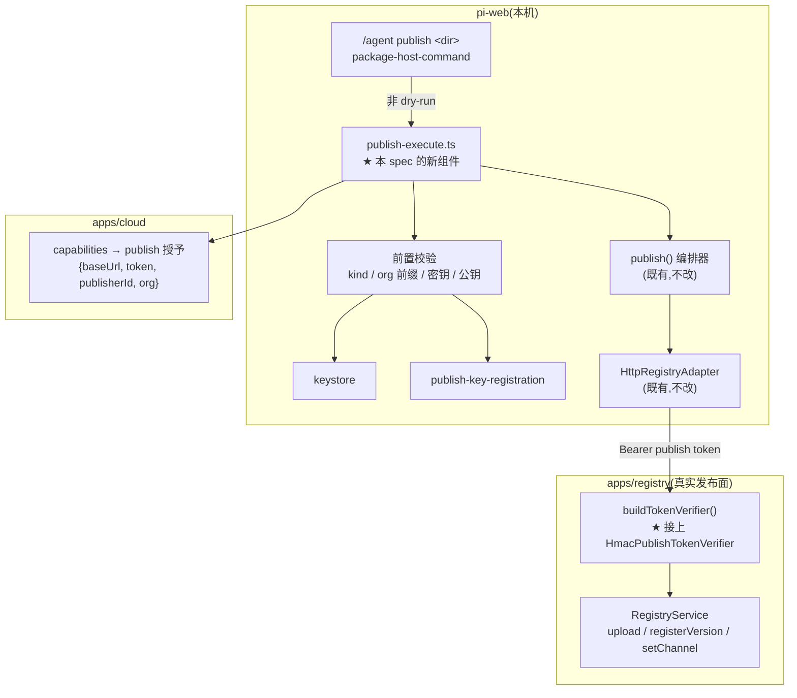
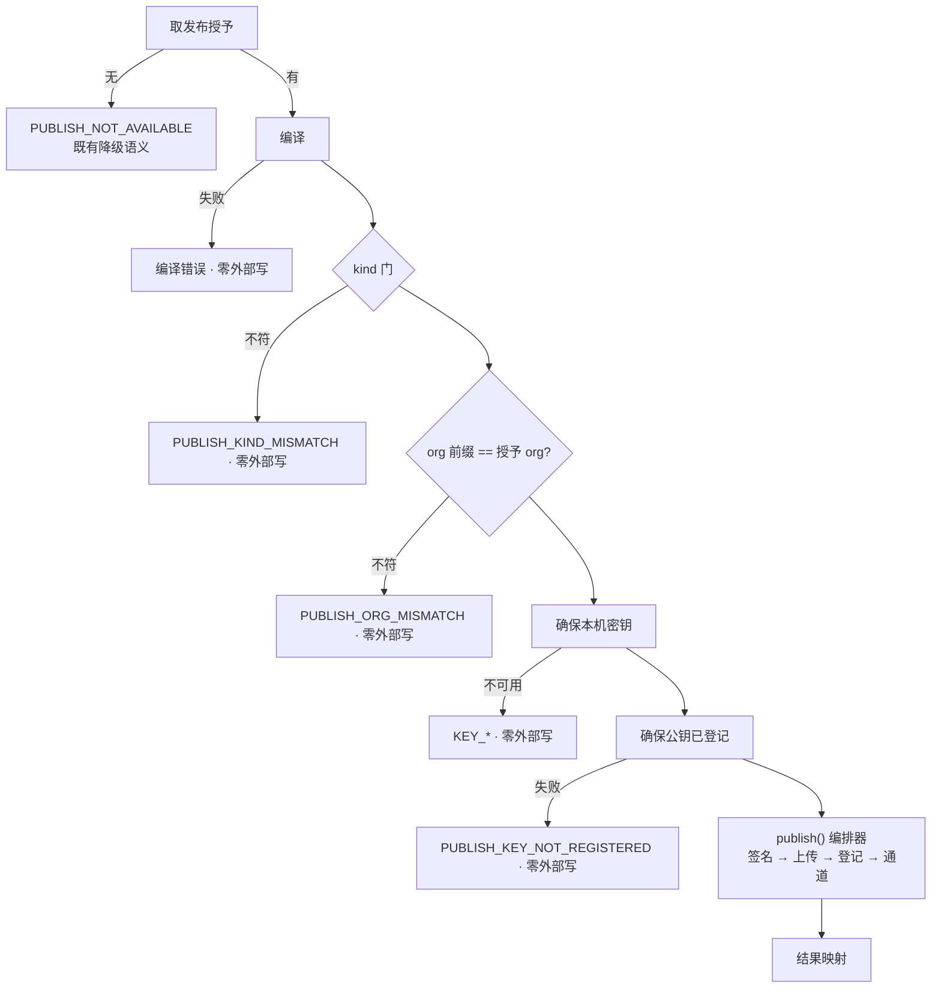

# Design Document · publish-execution

## Overview

把 `/agent publish <dir>` / `/plugin publish <dir>`(不带 `--dry-run`)从
`PUBLISH_NOT_AVAILABLE` 换成**真正的发布**:编译 → 签名 → 上传 bundle → 登记版本 → 移通道。
凭据取自登录态的发布授予,签名用本机私钥,归属由公钥指纹反查确立。

**用户**:已登录且企业已配置 org 的发布者。

**影响**:pi-clouds 侧 `buildTokenVerifier()` 接上 publish 面 HMAC 校验(**本轮发现的真阻塞**——
P1 造好了校验器却从未接进装配,不修则 cloud 签发的 token 会被真实 registry 拒绝);
pi-web 侧新增一层发布编排,`--dry-run` 路径逐字节不动。

### Goals

- registry 装配认得 cloud 签发的 publish token(Req 1)
- 登录即可发布,零 registry 环境变量(Req 2)
- 一切可本地判定的校验**先于**任何外部写(Req 3)
- 不可逆性与"版本号已烧掉"如实告知(Req 4)
- 失败可区分到阶段,含"已登记但通道未移"这一部分成功态(Req 5)

### Non-Goals

- 可见性选择(`private`/`org`/`public`)—— P3
- yank / 回滚 / 版本管理入口
- `--commit-only` 等运维语义(CLI 已有,host 面不引入)
- 真实环境发布验证(须另行请示)

---

## Boundary Commitments

### This Spec Owns

- `apps/registry` 的 publish 面 token 校验器组合
- host 命令 publish 非 dry-run 分支的**全部**行为
- 发布前置校验(kind / org 前缀 / 密钥 / 公钥登记)的判定与文案
- `PublishPreviewData` 中表达"已发布"的部分
- 发布结果的渲染与审计

### Out of Boundary

- `publish()` 编排器本身(既有,不改)
- `HttpRegistryAdapter` / `RegistryPort`(既有,不改)
- registry 服务端的登记语义(`autoCreateSourceBySignature`、`persistFailed`、版本不可删)
- 可见性(P3)、密钥撤销入口

### Allowed Dependencies

- 既有:`publish()` 编排器、`HttpRegistryAdapter`、`ensurePublishKey`、
  `ensurePublishKeyRegistered`、`getPublishGrant`
- **不得**:让 `packages/server/src` 依赖 `@pi-clouds/*`;不得把授予 token 交给
  除 `HttpRegistryAdapter` 之外的任何组件

### Revalidation Triggers

| 变更 | 谁要复检 |
|---|---|
| `PublishOutcome` 形状变化 | host 编排、结果契约、渲染器 |
| registry 的 `autoCreateSourceBySignature` 归属规则变化 | 本地 org 前缀前置校验(会与服务端判定漂移) |
| publish token 的 payload 结构变化 | `buildTokenVerifier()` 组合、cloud 签发面 |
| `persistFailed` 不再占用版本号 | Req 4.2 的文案(会变成误导) |

---

## Architecture

### 现状分析:三条既有约束

1. **发布不经 cloud**。授予的 `baseUrl` 来自 `PI_CLOUDS_REGISTRY_HTTP_BASE_URL`,指向真实
   registry 服务。`CloudTokenVerifier.verifyPublish` 恒抛那颗"cloud 是只读消费面"的钉子
   **不受影响**,也不该被动。
2. **编排器已存在且完整**。`publish()` 已实现"编译 → 签名 → 打包 → 上传 → 登记 → 通道",
   且 fail-fast(任一校验失败在发起任何外部写之前终止)。本 spec 不重写它。
3. **归属由指纹确立**。首次发布无需 `createSource`:`autoCreateSourceBySignature` 用
   `manifest.publisher` 反查 publisher,并要求该 publisher 自己的 enabled 公钥验签通过、
   且 `org(sourceId) === ctx.org`。这正是 `publish-key-lifecycle` 登记的那把公钥在起作用。

### 架构图



### 关键裁断

**D1 · 新建 `publish-execute.ts`,不把编排塞进 host command。**
host command 已经很长,且这层要做的事(取授予、前置校验、构造 adapter、映射结果)是可独立
单测的纯编排。塞进 handler 会让它只能经命令层测试。

**D2 · org 前缀在**本地**前置判定。**
`orgOf(sourceId)` 与授予的 `org` 不符时,服务端会抛 `ForbiddenError`。但那条消息对用户是
"禁止访问",而真实原因是"你的包 id 前缀写的不是你的命名空间"。本地判定能给出可修复的说明,
且**不花费一次外部往返**。⚠ 这是一处**有意的重复判定** —— 服务端那条仍是权威,本地这条只
为可懂性;二者漂移时以服务端为准(已在 Revalidation Triggers 记下)。

**D3 · 公钥登记从 best-effort 升为**真实发布路径上的硬前置**。**
dry-run 路径保持 best-effort(失败不影响预览)。真实发布路径不同:公钥没登记,
`registerVersion` **必然**在验签上失败,而那次失败会**烧掉版本号**。与其让用户花一个版本号
换一条 `SIGNATURE` 错误,不如在本地拒绝。

**D4 · 结果契约扩写而非重造。**
`PublishPreviewData` 顶部注释早已预留:"将来接上真实发布时,发布成功的结果不应携带
`disclaimers`(或两位皆 false)"。新增可选 `published` 字段,复用其余全部字段。

**D5 · `--channel` 进 host 命令,`--commit-only` 不进。**
通道是发布语义的一部分(发到 `beta` 还是 `stable`);`--commit-only`(登记但不移通道)是
运维/CI 语义,host 面引入它只会多一种用户搞不清的状态。

### Technology Stack

| 层 | 选择 | 角色 |
|---|---|---|
| registry 装配 | `CompositeTokenVerifier` + `HmacPublishTokenVerifier` | Req 1 |
| host 编排 | `lib/app/publish-execute.ts`(新) | Req 2/3/5 |
| 发布流程 | `publish()` 编排器(既有) | 不改 |
| 传输 | `HttpRegistryAdapter`(既有) | 授予 token 只在此处用 |
| 契约 | `packages/protocol` zod schema | Req 4 |
| 渲染 | `packages/ui` `PublishPreviewRenderer` | Req 4/5 |

---

## File Structure Plan

### pi-clouds

```
apps/registry/src/main.ts            # 改:buildTokenVerifier() 组合 publish 面 HMAC
apps/registry/test/token-verifier.test.ts   # 新:Req 1 / 7.1
```

### pi-web

```
lib/app/
├── publish-execute.ts               # 新:真实发布编排(前置校验 → adapter → publish() → 结果映射)
├── package-host-command.ts          # 改:非 dry-run 分支接 publish-execute;argv 加 --channel
└── pi-handler.ts                    # 改:注入 executePublish

packages/protocol/src/web-ext/publish-command.ts   # 改:PublishPreviewData 加 published 字段
packages/ui/src/chat/publish-preview-renderer.tsx  # 改:渲染已发布结果与阶段化失败

test/publish/publish-execute.test.ts               # 新:Req 3/5/6 单测
test/commands/publish-execute-command.test.ts      # 新:命令层接线 + dry-run 对照组
```

---

## Components and Interfaces

### pi-clouds · `buildTokenVerifier()`

**改动**:与既有 consume 分支**同构**地加一段 publish 分支。

```typescript
const publishTokenSecret = process.env["PI_CLOUDS_REGISTRY_PUBLISH_TOKEN_SECRET"];
// 组合顺序:HMAC 主、静态兜底 —— 与 consume 分支一致,既有静态 token 部署不受影响。
```

- 两个 secret 可**各自独立**配置(消费面已启用、发布面未启用是合法中间态)
- 未配 → 行为与本 spec 引入前完全一致(Req 1.3)
- 启动日志说明是否启用,**不打印密钥**(Req 1.4)

⚠ 实现注意:`CompositeTokenVerifier` 是两两组合。三种校验器共存时需要嵌套组合,
或一次性构造 —— 实现时以**既有 Composite 的语义**为准,不改它。

---

### pi-web · `publish-execute.ts`(新)

| 字段 | 详情 |
|---|---|
| Intent | 把"用户想发布"变成一次有前置保护、结果可读的真实发布 |
| Requirements | 2.1–2.6, 3.1–3.4, 4.1–4.4, 5.1–5.4, 6.1–6.4 |

```typescript
export interface PublishExecuteDeps {
  readonly getPublishGrant: () => Promise<PublishGrant | undefined>;
  readonly ensureKey: () => Result<PublishKeyInfo, KeystoreError>;
  /** 硬前置:返回 false 即拒绝发布(见 D3)。 */
  readonly ensureKeyRegistered: () => Promise<boolean>;
  /** 测试注入;缺省用 HttpRegistryAdapter + publish() 编排器。 */
  readonly createPort?: (grant: PublishGrant) => RegistryPort;
  readonly publishFn?: typeof publish;
  readonly compileFn?: typeof compile;
}

export interface PublishExecuteInput {
  readonly packageDir: string;
  readonly expectedKind: PluginKind;
  readonly channel?: string;
}

export async function executePublish(
  input: PublishExecuteInput,
  deps: PublishExecuteDeps,
): Promise<{ readonly data: PublishPreviewData; readonly message: string }>;
```

**执行顺序(顺序本身是契约,Req 3.1 / 7.2)**



★ **五道前置全部在编译之后、`publish()` 之前** —— 编译必须先做(kind 与 id 从清单来),
但编译是**纯本地**的,不构成外部写。

**结果映射**

| 情形 | `ok` | `published` | 说明要点 |
|---|---|---|---|
| 全成功 | true | `{sourceId, version, bundle, channel, channelMoved: true}` | 版本已不可更改;后续改动请提新版本号 |
| 登记成功、通道未移 | true | `{…, channelMoved: false}` | **不否定已登记的版本**(Req 5.4) |
| 登记阶段失败 | false | 缺席 | ★ **该版本号已被占用,需改版本号重试**(Req 4.2) |
| 上传阶段失败 | false | 缺席 | 未占用版本号,可原版本重试 |
| 前置校验失败 | false | 缺席 | 零外部写,可原版本重试 |

**凭据卫生**

- 授予 `token` 只传给 `HttpRegistryAdapter` 构造函数;**不进**结果、审计、日志
- `RegistryError.detail` **整体丢弃**(既有裁断:可能内嵌带凭据的 URL),只用 `code`
- 用户传入的 `packageDir` **不回显**(既有裁断:`path.resolve` 会破坏脱敏形态)

---

### 契约扩写 · `PublishPreviewData.published`

```typescript
export const PublishedResultSchema = z.object({
  sourceId: z.string(),
  version: z.string(),
  /** 内容寻址的 bundle key(可公开)。 */
  bundle: z.string(),
  channel: z.string(),
  /** 通道是否已指向该版本。false = 版本已登记但通道未移(部分成功)。 */
  channelMoved: z.boolean(),
  /** 以谁的身份、在哪个命名空间下发(Req 2.5)。 */
  publisherId: z.string(),
  org: z.string(),
});
```

- `published` 为**可选**字段:预览与失败结果不带它 → 既有断言与渲染路径不受影响
- 真实发布成功时 `disclaimers` 两位皆 `false`(Req 4.4)—— 契约顶部注释早已如此预告

---

### 渲染 · `PublishPreviewRenderer`

- `published` 存在 → 呈现"已发布"块:`sourceId@version`、通道、发布者身份、
  以及**不可更改**提示
- `channelMoved === false` → 单独的醒目提示(部分成功,不能渲染成纯成功)
- 失败 → 沿用既有 `error` 块;阶段信息通过 `error.code` 前缀区分
- 既有的 `disclaimers` 布尔位渲染逻辑不动(两位皆 false 时不出预览提示)

---

## Error Handling

| 阶段 | code | 修复动作 |
|---|---|---|
| 授予缺席 | `PUBLISH_NOT_AVAILABLE` | 登录 / 联系管理员配置 org(既有语义) |
| 编译 | 既有八分支 | 既有文案 |
| kind 门 | `PUBLISH_KIND_MISMATCH` | 改用另一条命令(既有) |
| org 前缀 | `PUBLISH_ORG_MISMATCH` | 把包 id 前缀改成你的命名空间 |
| 密钥 | `KEY_MALFORMED` / `KEY_*` | 修复或移走密钥文件(既有 keystore 文案) |
| 公钥登记 | `PUBLISH_KEY_NOT_REGISTERED` | 稍后重试;若持续失败,该公钥可能已属其它发布者 |
| 上传 | `PUBLISH_UPLOAD_FAILED` | 可**原版本**重试 |
| 登记 | `PUBLISH_REGISTER_FAILED` | ★ **该版本号已被占用,请提版本号后重试** |
| 通道 | `PUBLISH_CHANNEL_FAILED` | 版本已登记;重试只需移通道,**不要**改版本号 |

★ 登记失败与通道失败的文案给出**相反**的指导(改版本号 vs 别改),这正是把它们压成
"发布失败"会造成的最大损失。

---

## Testing Strategy

### Unit(pi-clouds)

1. 配了 publish secret → HMAC publish token 被接受,解出三元身份
2. 未配 → 行为与引入前一致(HMAC token 被拒)
3. 静态 publish token 在两种配置下**始终**可用(向后兼容)
4. consume 面在两种配置下不受影响

### Unit(pi-web · `publish-execute`)

5. 无授予 → `PUBLISH_NOT_AVAILABLE`,且**不编译、不建 adapter**
6. kind 不符 / org 前缀不符 / 密钥不可用 / 公钥未登记 → 各自的 code,且**零外部写**
   (断言 `createPort` 未被调用)
7. 全成功 → `published.channelMoved === true`,`disclaimers` 两位皆 false
8. 通道失败 → `ok: true` 且 `channelMoved === false`(部分成功不否定登记)
9. 登记失败 → `ok: false`,说明含"版本号已占用"语义
10. 上传失败 → `ok: false`,说明**不含**"改版本号"(可原版本重试)
11. 授予 token 不出现在结果数据的任何字段(整体序列化后全文搜索)
12. `RegistryError.detail` 不出现在结果中

### Integration(pi-web · 命令层)

13. `/agent publish <dir>`(非 dry-run)→ 走真实发布路径,产出 published 卡片
14. ★ `--dry-run` 输出与本 spec 引入前**逐字段相同**(对照组,Req 7.5)
15. `--channel beta` → 通道参数被透传
16. 审计事件记录 publish 动作与结果,且**不含**任何凭据
17. kind 越界(如 `/agent publish` 一个 plugin 包)→ 拒绝

### 端到端(进程内契约夹具)

18. 用既有 `createFakeRegistry` 走完整链路:签名 → 上传 → 登记 → 通道,
    并断言各阶段**按序**发生、bundle 可被安装侧原样取回

### 不做

- 真实网络 / 真实生产 registry 发布 —— 会产生不可逆写入,须另行请示
