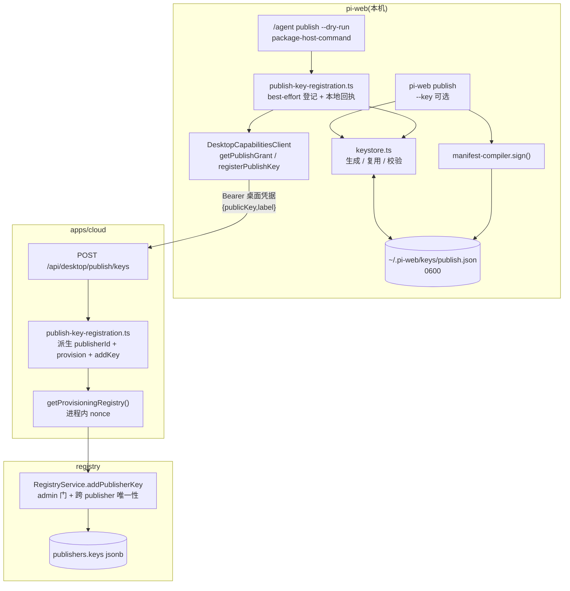
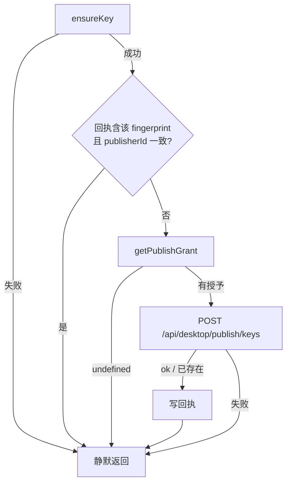

# Design Document · publish-key-lifecycle

## Overview

本特性把「签名密钥」这一环补齐：**本机自动生成并保管私钥**，**公钥经一条窄口自动登记**到本企业的 publisher，并给 `PublisherKey` 补上创建时间与可读标签。私钥永不离开用户机器，用户不接触任何管理员凭据。

**用户**：使用 `/agent publish` / `/plugin publish` 或 `pi-web publish` 的发布者；以及需要在泄露时定位并停用某把钥匙的平台运维者。

**影响**：`pi-web publish` 的 `--key` 从必填变为可选（省略即用本机密钥）；`/agent publish --dry-run` 在预览前**尽力**确保本机公钥已登记（输出面不变）；registry 的 `PublisherKey` 多两个可选字段，**零数据库迁移**（`keys` 本就整体落 jsonb）。

### Goals

- 发布者无需先学会生成密钥即可签名（Req 1）
- 公钥登记走一条**结构上无法越权**的窄口（Req 2）
- 每把公钥可辨认、可定位（Req 3），存量记录不被判死（Req 3.3）
- 多机多钥并存是正常状态（Req 4）
- 签名 ↔ 验签有一条端到端互通断言（Req 5.5）

### Non-Goals

- 打通真实发布（`uploadBundle → registerVersion → setChannel`）—— P2
- 密钥停用/撤销的**操作入口**（服务端 `disablePublisherKey` 已存在，UI/CLI 入口另议）
- 可见性选择 —— P3
- 私钥导出 / 跨机同步 —— **有意的能力缺失**（Req 4.4）
- `Publisher` 实体的审计字段（`createdBy`/`createdAt`）—— 已知缺口，另议

---

## Boundary Commitments

### This Spec Owns

- 本机密钥文件的**位置解析、生成、读取、权限**（pi-web）
- 公钥登记的**窄口**：cloud 路由 + pi-web 客户端方法 + 本地回执
- `PublisherKey` 的溯源元数据字段及其**两条写入口**（`registerPublisher` / `addPublisherKey`）的一致性
- `pi-web publish --key` 的缺省行为

### Out of Boundary

- 发布本体（签名之后的上传/登记/通道）
- `Publisher` 实体的审计字段
- 密钥撤销的用户入口
- `resolvePublishIdentity` 接入 `capabilities` 路由（P1 Req 4 的遗留接线，本 spec 不代劳；本 spec 的登记路由**自带** provision，不依赖它）

### Allowed Dependencies

- `@pi-clouds/registry-client`：`generateEd25519KeyPair` / `computeFingerprint` / `signManifest` / `verifyManifest` / `RegistryService`
- P1 既有件：`getProvisioningRegistry()`、`resolvePublishIdentity()`、`derivePublisherId()`、`DesktopCapabilitiesClient`
- **不得**：让 `packages/server/src` 出现对 `@pi-clouds/*` 的依赖（既有约束，不放宽）

### Revalidation Triggers

| 变更 | 谁要复检 |
|---|---|
| `KeyMaterial` 形态变化 | `sign()`、keystore、所有既有密钥文件 |
| `PublisherKey` 字段由可选改必填 | 存量记录读取路径、seed、admin HTTP 面 |
| 登记路由的请求体新增 `publisherId` 之类的身份入参 | **整个越权模型**（D-b 的结构性保证会消失） |
| `addPublisherKey` 的跨 publisher 唯一性约束放宽 | 按指纹反查发布者的归属推导（自动建 source） |

---

## Architecture

### Existing Architecture Analysis

三处既有约束必须尊重：

1. **一份实现**：签名/验签/指纹/生成全部在 `registry-client/src/manifest/signature.ts`，两侧不得各写一遍（consume/publish token 的文件头已把这条写成规矩）。
2. **cloud 是只读消费面**：`CloudTokenVerifier.verifyPublish` 恒抛，这颗钉子**不动**。写路径走 P1 引入的第二个 `RegistryService` 实例（`ProvisioningTokenVerifier`，只认进程内 nonce）。
3. **能力面 fail-soft**：`getSourcesGrant` 取不到返回 `undefined` 而非抛；登记路径沿用同一规矩——拿不到授予就不登记，不让发布预览崩。

### 架构图



**关键结构性事实**：请求体里**没有** `publisherId`。它由服务端从认证得到的 `companyId` 派生。越权不是被校验拦下的，是**无从表达**。

### Technology Stack

| 层 | 选择 | 在本特性中的角色 |
|---|---|---|
| CLI | `server/cli/publish/keystore.ts`（新） | 密钥生成/复用/校验，与 `manifest-compiler` 同目录同依赖边 |
| Host 应用层 | `lib/app/publish-key-registration.ts`（新） | best-effort 登记编排 + 本地回执幂等短路 |
| 能力客户端 | `packages/server/src/auth/desktop-capabilities-client.ts` | 新增 `registerPublishKey()` |
| Cloud 路由 | Next Route Handler | 认证 → 派生身份 → 委托纯函数 |
| Registry 服务 | `RegistryService.addPublisherKey` | 唯一写入口，约束不放宽 |
| 存储 | Postgres `publishers.keys` **jsonb** | 加字段**零迁移**（实测 `toPublisherRow` 整数组落 jsonb） |
| 密码学 | Ed25519（`node:crypto`，经 registry-client 封装） | 生成/签名/验签一份实现 |

---

## File Structure Plan

### pi-web（`.claude/worktrees/agent-plugin-commands`）

```
server/cli/publish/
├── keystore.ts              # 新：密钥位置解析 + ensure(生成/复用/坏文件报错) + 权限
└── manifest-compiler.ts     # 不改（sign 已按 KeyMaterial 读）

lib/app/
├── publish-key-registration.ts   # 新：ensurePublishKeyRegistered(best-effort) + 回执
└── package-host-command.ts       # 改：dry-run 预览前调一次登记(不改输出)

packages/server/src/auth/
└── desktop-capabilities-client.ts  # 改：新增 registerPublishKey()

server/cli/index.ts               # 改：--key 可选，缺省走 keystore
lib/app/pi-handler.ts             # 改：注入 getPublishGrant / registerPublishKey

test/
├── publish-keystore.test.ts            # 新：Req 1、Req 5.1/5.2
├── publish-key-registration.test.ts    # 新：Req 2 客户端侧、Req 5.3
└── publish-sign-interop.test.ts        # 新：Req 5.5 端到端互通
```

### pi-clouds（`.claude/worktrees/registry-org-identity`）

```
packages/registry-client/src/
├── types/entities.ts                 # 改：PublisherKey +createdAt? +label?
└── service/registry-service.ts       # 改：addPublisherKey 接 meta；registerPublisher 映射同步

packages/registry-server/src/http/
└── admin-registry-http.ts            # 改：POST keys 透传可选 label

apps/cloud/
├── lib/registry.ts                   # 改：ProvisioningTokenVerifier 注释改口 + 收窄条件重写
├── lib/publish-key-registration.ts   # 新：纯函数(派生 id → 确保 publisher → addKey → 幂等吸收)
└── app/api/desktop/publish/keys/route.ts  # 新：薄接线(认证 → 委托 → toErrorResponse)

apps/cloud/test/publish-key-registration.test.ts   # 新：Req 2/5.3
packages/registry-client/test/publisher-key-meta.test.ts  # 新：Req 3/5.4
```

---

## Components and Interfaces

| 组件 | 层 | 意图 | Req | 关键依赖 | 契约 |
|---|---|---|---|---|---|
| `keystore` | pi-web CLI | 本机密钥就位 | 1.1–1.6, 4.2 | registry-client(生成), node:fs | Service |
| `publish-key-registration`(web) | pi-web app | best-effort 登记编排 | 2.1–2.5 | capabilities client, keystore | Service |
| `DesktopCapabilitiesClient.registerPublishKey` | pi-web server | HTTP 客户端 | 2.1, 2.6 | fetch | API |
| `POST /api/desktop/publish/keys` | cloud | 窄口 | 2.1–2.4, 2.6 | requireCurrentUser | API |
| `publish-key-registration`(cloud) | cloud lib | 派生身份 + 登记 + 幂等 | 2.2–2.4 | provisioning registry | Service |
| `PublisherKey` 元数据 | registry | 溯源 | 3.1–3.5 | — | State |

---

### pi-web · keystore

| 字段 | 详情 |
|---|---|
| Intent | 让"本机有一把可用私钥"成为**恒真**前置，而不是用户的准备工作 |
| Requirements | 1.1, 1.2, 1.3, 1.4, 1.5, 1.6, 4.2 |

**职责与约束**

- 解析路径优先级：显式入参（CLI `--key`）> `PI_WEB_PUBLISH_KEY_PATH` > `~/.pi-web/keys/publish.json`
- 目录以 `0700`、文件以 `0600` 创建（Req 1.3）
- **已存在且可解析 → 原样复用，绝不重写**（Req 1.5）
- **已存在但解析失败 → 报错并停止，绝不覆盖**（Req 1.6）
- 返回值**只含公开物**：路径、`publicKey`、`fingerprint`、`created` 布尔。私钥不出现在返回值里（Req 1.4 的结构性保证——调用方拿不到，就漏不出去）

```typescript
export type KeystoreError =
  | { readonly code: "KEY_MALFORMED"; readonly path: string }   // 存在但解析失败 → 不覆盖
  | { readonly code: "KEY_READ_FAILED"; readonly path: string }
  | { readonly code: "KEY_WRITE_FAILED"; readonly path: string };

/** 只含可公开物：私钥留在文件里，不进返回值。 */
export interface PublishKeyInfo {
  readonly path: string;
  readonly publicKey: string;
  readonly fingerprint: string;
  /** 本次是否新生成（供调用方决定是否提示 / 触发登记）。 */
  readonly created: boolean;
}

export interface ResolveKeyPathOptions {
  readonly explicitPath?: string;
  readonly env?: NodeJS.ProcessEnv;
  readonly homeDir?: string;   // 测试注入
}

export function resolvePublishKeyPath(opts?: ResolveKeyPathOptions): string;

export function ensurePublishKey(
  opts?: ResolveKeyPathOptions,
): Result<PublishKeyInfo, KeystoreError>;
```

- 前置：无
- 后置：目标路径存在一个可被 `manifest-compiler.readKey()` 读通的 `{publicKey, privateKey}` 文件
- 不变式：**同一路径的私钥字节在本函数任何分支下都不会被改写**，除非该路径此前不存在

**实现说明**

- 生成调 `generateEd25519KeyPair()`（registry-client），不自实现（与 `sign()` 同规）
- 写入用 `writeFileSync(path, json, { mode: 0o600 })`；已存在的文件不 chmod（避免动用户有意设的更严权限）
- 与 `manifest-compiler.ts` **同目录**：该文件已静态依赖 registry-client，故不引入新的模块解析约束（见 research.md §1.1）

---

### pi-web · publish-key-registration（应用层）

| 字段 | 详情 |
|---|---|
| Intent | 发布前**尽力**让本机公钥出现在本企业 publisher 下；失败不影响任何既有行为 |
| Requirements | 2.1, 2.2, 2.5, 5.3 |

```typescript
export interface PublishKeyRegistrationDeps {
  readonly ensureKey: () => Result<PublishKeyInfo, KeystoreError>;
  readonly getPublishGrant: () => Promise<PublishGrant | undefined>;
  readonly registerPublishKey: (
    input: { readonly publicKey: string; readonly label: string },
  ) => Promise<{ readonly ok: boolean }>;
  /** 回执路径（幂等短路用）；缺省 `<keydir>/registered.json`。 */
  readonly receiptPath?: string;
  readonly hostLabel?: () => string;   // 缺省 os.hostname()
}

/** best-effort：任何一步失败都静默返回，不抛、不改调用方输出。 */
export async function ensurePublishKeyRegistered(
  deps: PublishKeyRegistrationDeps,
): Promise<void>;
```

**流程**



- **回执只是省一次网络往返**，不是正确性依赖：用户删掉它、换机器、并发调用都会导致重复请求，因此服务端把"已存在"当成功是**必需**的（D-d）
- Req 2.5「不留半状态」：本地只在服务端确认成功后才写回执；服务端侧 `addPublisherKey` 是单次 `updatePublisher`，无中间态

---

### pi-web · `DesktopCapabilitiesClient.registerPublishKey`

```typescript
registerPublishKey(input: {
  readonly publicKey: string;
  readonly label: string;
}): Promise<{ readonly ok: true } | { readonly ok: false; readonly kind: RegisterKeyFailure }>;

type RegisterKeyFailure = "no-credential" | "unauthorized" | "no-grant" | "conflict" | "network" | "bad-status";
```

- 与 `getSourcesGrant` 同规：**不抛**，失败以判别式返回（Req 2.5 / 5.3）
- `Authorization: Bearer <桌面凭据>`；publish grant 的 `token` **不参与**本请求（登记走桌面凭据认证，publish token 是发布面凭据，两者作用域不同，混用会扩大 publish token 的用途）
- 日志只记 `fingerprint` 与结果类别，**不记** `publicKey` 全文、不记凭据

---

### cloud · `POST /api/desktop/publish/keys`

##### API Contract

| Method | Endpoint | Request | Response | Errors |
|---|---|---|---|---|
| POST | `/api/desktop/publish/keys` | `{ publicKey: string, label?: string }` | `{ fingerprint, publisherId, org }` | 401 未认证 / 403 org 未配置 / 409 KEY_CONFLICT / 400 形态错 / 503 多租户关闭或配置缺失 |

**约束**

- 请求体**没有** `publisherId` / `companyId` / `org` —— 三者全由 `requireCurrentUser` + `derivePublisherId` 得出（Req 2.3，D-b）
- 未配置 org（`org_name_status !== "configured"`）→ 403，不登记（与 P1 门控同一判据）
- publisher 不存在 → 先经 `resolvePublishIdentity` provision（幂等），再登记 —— 故本路由**不依赖** capabilities 路由是否已接线
- 跨 publisher 冲突 → 409 `KEY_CONFLICT`，**不回显**冲突方 publisher id（Req 2.4 的约束保留，但不把台账结构泄给客户端）
- 响应体不含任何 token / 私钥（Req 2.6）

```typescript
// apps/cloud/lib/publish-key-registration.ts
export type RegisterKeyResult =
  | { readonly ok: true; readonly fingerprint: string; readonly publisherId: string; readonly org: string }
  | { readonly ok: false; readonly code: "ORG_NOT_CONFIGURED" | "KEY_CONFLICT" | "INVALID_KEY" | "UNAVAILABLE" };

export async function registerPublishKey(input: {
  readonly companyId: string;
  readonly publicKey: string;
  readonly label?: string;
  readonly tenants: Pick<TenantStore, "getCompany">;
  readonly registry: Pick<RegistryService, "registerPublisher" | "addPublisherKey">;
  readonly provisionToken: string;
  readonly now?: () => number;
}): Promise<RegisterKeyResult>;
```

- **幂等吸收**：service 抛 `key already present` → 返回 `ok: true`（Req 2.2）
- `label` 缺省落 `"desktop"`（Req 3.2：缺省要明确，不留空）
- 内部复用 `resolvePublishIdentity`（P1）取 `{org, publisherId}` 并确保 publisher 存在

---

### registry · `PublisherKey` 元数据

```typescript
export interface PublisherKey {
  readonly fingerprint: string;
  readonly publicKey: string;
  readonly status: KeyStatus;
  /** 登记时间(ISO 8601)。**可选**:存量记录没有,不得因此判死(Req 3.3)。 */
  readonly createdAt?: string;
  /** 可读标签,用于区分来源机器/用途。登记入口写入时补缺省,不留空(Req 3.2)。 */
  readonly label?: string;
}
```

**为什么是可选而不是必填**（D-c）：存量（seed 建的内置源公钥）没有这两个字段。设为必填会让读取端一律判死——Req 3.3 明令禁止。可选 + 写入侧补缺省，效果等价（新记录恒有值），且不判死存量。

**存储影响：零**。`toPublisherRow` 把 `p.keys` **整体**塞进 jsonb，`fromPublisherRow` 整体 `as PublisherKey[]` 读回（实测，见 research.md §1.2）。无迁移、无 store 改动。

**两条写入口必须同步改**：

| 入口 | 改动 |
|---|---|
| `addPublisherKey(token, publisherId, publicKey, meta?)` | 新增可选 `meta: {label?, createdAt?}`；`createdAt` 缺省取 `clock.now()` |
| `registerPublisher(token, input)` | `input.keys[]` 映射时同样带上 meta（否则两条入口产出的记录形态不一致） |

**元数据不参与验签判定**（Req 3.4）：`verifyManifest` 只吃 `publicKey`；台账遍历只看 `status === "enabled"`。本改动不触碰这两处。

---

## Requirements Traceability

| Req | 摘要 | 组件 | 流程 |
|---|---|---|---|
| 1.1 | 无密钥→自动生成 | keystore.ensurePublishKey | CLI/host 调用点 |
| 1.2 | 形态与 `sign()` 一致 | keystore（复用 `generateEd25519KeyPair`） | 互通测试 |
| 1.3 | 仅属主可读 | keystore（0700/0600） | — |
| 1.4 | 私钥不进任何输出面 | keystore 返回值不含私钥 | — |
| 1.5 | 已有→复用不覆盖 | keystore | — |
| 1.6 | 坏文件→报错不覆盖 | keystore `KEY_MALFORMED` | — |
| 2.1 | 自动登记 | web registration → cloud 路由 | 登记流程图 |
| 2.2 | 幂等 | 本地回执短路 + 服务端吸收「已存在」 | 同上 |
| 2.3 | 只能为自己企业 | 请求体无 publisherId + 服务端派生 | D-b |
| 2.4 | 跨 publisher 唯一性不放宽 | 复用 service 既有检查；映射为 409 | — |
| 2.5 | 失败如实转达、不留半状态 | best-effort 返回 + 成功后才写回执 | 登记流程图 |
| 2.6 | 不暴露管理员凭据 | nonce 只在 cloud 进程内；响应体无凭据 | — |
| 3.1 | createdAt + label | `PublisherKey` 扩字段 | — |
| 3.2 | 缺失落明确缺省 | cloud 侧补 `"desktop"` | — |
| 3.3 | 存量仍可读可验签 | 字段可选 | — |
| 3.4 | 不影响验签判定 | 不触碰 `verifyManifest` / status 遍历 | — |
| 3.5 | 不含凭据或私钥派生物 | 只有时间与标签 | — |
| 4.1 | 多钥并存 | 既有 `PublisherKey[]`，不改 | — |
| 4.2 | 新机器自建自登记 | keystore + registration | — |
| 4.3 | 丢钥不影响既有签名 | 不新增任何禁用/删除路径 | — |
| 4.4 | 不提供导出/同步 | 有意不实现；测试断言无私钥输出 | — |
| 5.x | 验证 | 见 Testing Strategy | — |

---

## Error Handling

### 分类与响应

| 类别 | 场景 | 响应 |
|---|---|---|
| 用户错误 | 密钥文件损坏 | CLI：`KEY_MALFORMED` + 指出路径与"请修复或移走该文件"，**绝不自动重建** |
| 用户错误 | org 未配置 | 路由 403；web 侧 best-effort 静默降级 |
| 冲突 | 同一公钥已属他人 | 409 `KEY_CONFLICT`，不回显对方身份 |
| 系统错误 | registry / DB 不可达 | 路由 503；web 侧静默降级，**不阻断预览** |
| 幂等 | 同一把钥匙重复登记 | **视为成功**（非错误） |

### 凭据卫生（贯穿）

- 私钥：只写文件、只被 `sign()` 读；不进返回值、日志、错误消息、卡片数据
- 桌面凭据：只进 Authorization 头
- provisioning nonce：只在 cloud 进程内存

---

## Security Considerations

### ★ 本 spec 首次为 `addPublisherKey` 开出入口

P1 的 `apps/cloud/lib/registry.ts` 里写着「真正危险的 `addPublisherKey`（往任意 publisher 塞公钥 = 伪造其签名）**仍然没有任何入口**」。**本 spec 改变了这一事实**，那段注释必须同步重写——注释与事实不符比没有注释更危险。

新的收窄由三条**同时成立**的约束构成：

1. `publisherId` **不在请求体里**，由认证得到的 `companyId` 派生 —— 越权无从表达（不是被校验拦下的）
2. 只加不删：本入口不接 `disablePublisherKey` / `disablePublisher`
3. 跨 publisher 唯一性约束（service 层）**不放宽** —— 一把钥匙不能同时挂两家

少任何一条，这个口子就变宽。

### 残余风险（如实记录）

- 拿到有效桌面凭据的人可以把**自己的**公钥挂到**自己企业**的 publisher 下 —— 这正是本 spec 的意图（自助发布），但它意味着：**企业内任一登录用户都能以企业身份签包**。企业内的发布权限细分不在本 spec 范围，元数据（谁、何时、哪台机器）是为将来做这件事留的依据。
- 本 spec 落地后，已配置 org 的用户**首次 `/agent publish --dry-run` 就会真的往生产 registry 写**（provision publisher + 登记公钥）。这是设计意图，但实施前应向用户明示。

---

## Testing Strategy

### Unit（pi-web）

1. `keystore`：无密钥 → 生成，且产物能被 `manifest-compiler.readKey()`/`sign()` 读通（Req 5.1）
2. `keystore`：已有合法密钥 → **字节不变**（读前后比对文件内容）（Req 1.5 / 5.1）
3. `keystore`：文件存在但非 JSON / 缺字段 → `KEY_MALFORMED` 且**文件字节不变**（Req 1.6 / 5.1）
4. `keystore`：新建文件 `mode & 0o777 === 0o600`，目录 `0700`（Req 1.3 / 5.1）
5. `keystore`：返回值与 CLI reporter 输出中**不出现**私钥字符串（Req 1.4 / 5.2）
6. 路径优先级：显式 > env > 默认（Req 1.1）

### Unit（pi-clouds）

7. `addPublisherKey` 带 meta → 记录含 `createdAt`/`label`；不带 label → 落缺省 `"desktop"`（Req 3.1/3.2 / 5.4）
8. **存量无元数据的 `PublisherKey` 仍能验签且能被读取**（构造无 meta 的 publisher，走 `verifyManifest` 通过）（Req 3.3 / 5.4）
9. `registerPublisher` 与 `addPublisherKey` 产出的记录**形态一致**（同字段集）
10. cloud `registerPublishKey`：org 未配置 → `ORG_NOT_CONFIGURED` 且**不触发任何 registry 写**（Req 2.3）
11. cloud `registerPublishKey`：重复同一把钥匙 → `ok: true`（幂等，Req 2.2 / 5.3）
12. cloud `registerPublishKey`：同一把钥匙已属他人 → `KEY_CONFLICT`，且响应**不含**对方 publisherId（Req 2.4 / 5.3）
13. cloud：publisher 不存在 → 先 provision 再登记，全程一次成功（Req 2.1）

### Integration（pi-web）

14. `ensurePublishKeyRegistered`：无授予 → 不发请求、不写回执、不抛（Req 2.5 / 5.3）
15. `ensurePublishKeyRegistered`：回执命中 → **不发请求**（幂等短路）
16. `/agent publish --dry-run` 在登记失败时**输出逐字节不变**（Req 2.5 + adjacent expectation）

### 端到端互通（★ Req 5.5）

17. keystore 生成密钥 → `compile()` + `sign()` 一个夹具包 → `verifyManifest(signed, publicKey) === true` 且 `manifest.publisher === computeFingerprint(publicKey)`。
    **两侧各测各的测不出形态不一致**，这条是唯一能抓住"生成产物签不动/验不过"的断言。

### 不做的测试

- 真实生产 registry 写入 —— 实施阶段另行请示；单测一律用 `InMemoryRegistryStore`
