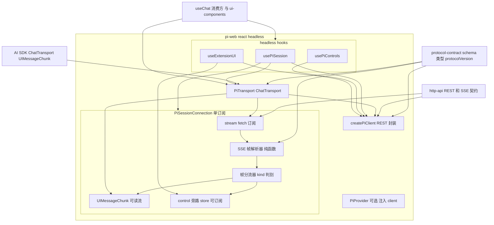
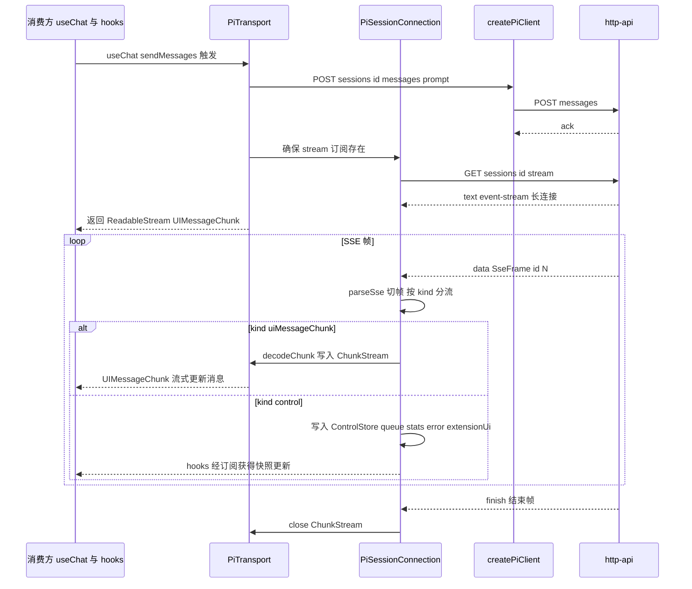
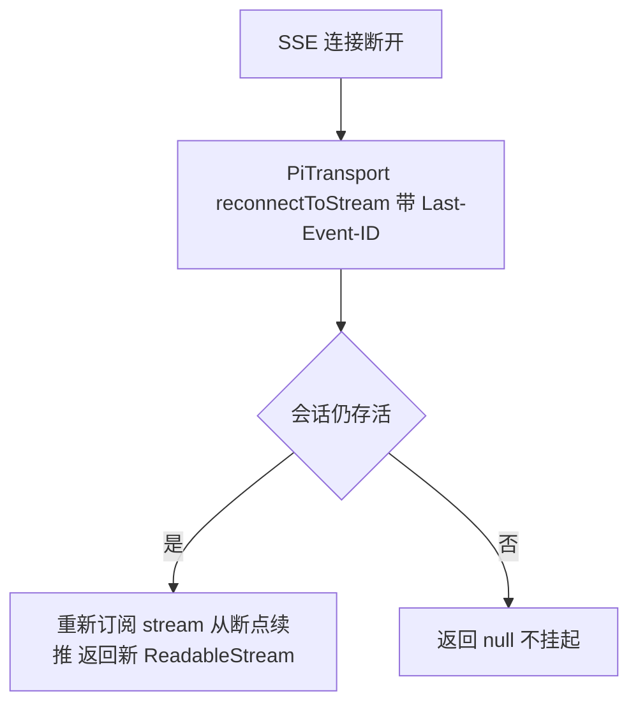
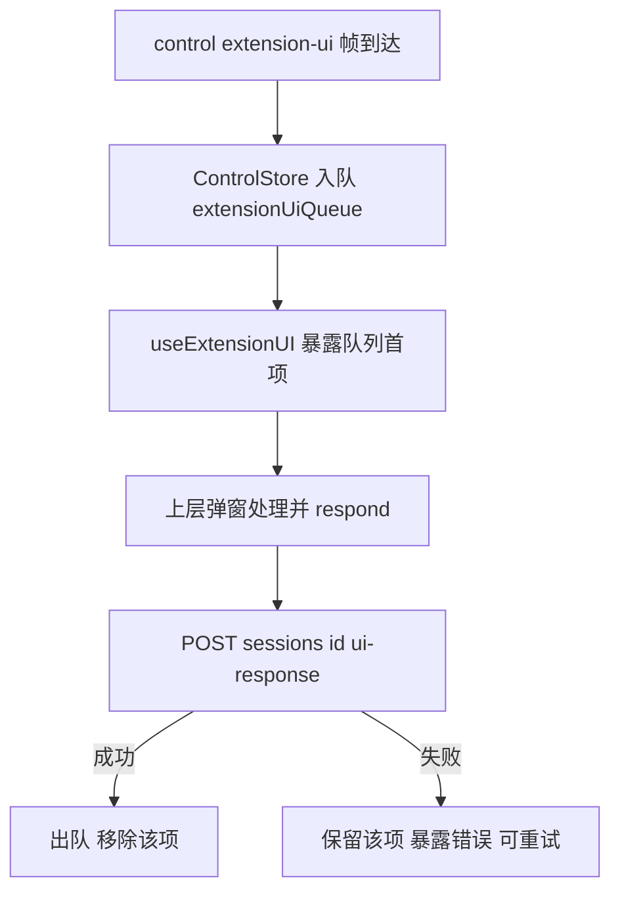

# Design Document — react-client

## Overview

**Purpose**:本特性交付 `@pi-web/react`——pi-web 的**无样式 headless React 层**。它把 `http-api` 暴露的 REST + SSE 契约,封装为一个 AI SDK v5 `ChatTransport`(`PiTransport`)、一个 REST 客户端(`createPiClient`)与三个 headless hooks(`usePiSession` / `usePiControls` / `useExtensionUI`),使 `useChat` 与 pi 控制在任意 React/Next 项目中开箱即用。

**Users**:本项目的 `ui-components`(在本层之上装配有样式组件),以及任何已有自研 UI、UI 全自控的第三方 React 项目(§13.3 集成方式 B)。

**Impact**:把 `PLAN.md` §4 的 ChatTransport 双连接模型、§13.1 的 `@pi-web/react` 导出面、§13.3 B 的 headless hooks 收敛为一个边界清晰、可单测、零样式的前端契约消费层。本 spec **消费**上游契约(`@pi-web/protocol` 的 `SseFrame`/`UiMessageChunk`/data-part/REST DTO/`protocolVersion`、`http-api` 的 REST/SSE 端点、AI SDK 的 `ChatTransport`/`UIMessageChunk`),不重定义、不触达后端内部对象。

### Goals

- `PiTransport`:实现 AI SDK v5 `ChatTransport`——`sendMessages()` POST `/messages` 并把 `/stream` SSE 解码为 `ReadableStream<UIMessageChunk>`;`reconnectToStream()` 带 `Last-Event-ID` 断线续流。
- `createPiClient(baseUrl, fetch?)`:封装全部 REST(建会话、prompt/steer/follow_up/abort/model/thinking/ui-response、查询 state/stats/messages/commands、删除),以协议 DTO 为唯一拼装来源。
- headless hooks:`usePiSession`(建/连会话 + 连接态 + 暴露绑定 transport)、`usePiControls`(model/thinking/abort/steer/follow_up/stats/commands)、`useExtensionUI`(扩展 UI 请求队列 + 回传)。
- **单订阅分流**:同会话一条 SSE 订阅,`uiMessageChunk` 帧喂 `PiTransport` 可读流,`control` 帧(extension-ui/queue/stats/error)旁路到 hooks,不污染 `useChat` 消息流。
- 满足"测试 + e2e(硬性)":单元(SSE 解码 / 重连 / 请求拼装)、组件/集成(`useChat({transport})` 对 mock server、hook 状态机)、e2e(真实 http-api + stub agent 的 prompt→流式回复 + 扩展 UI 冒泡)。

### Non-Goals

- 不带任何样式、JSX 组件、AI Elements 装配、shadcn registry(归 `ui-components`)。
- 不实现 REST/SSE 端点、SSE 编码、会话进程驻留、事件→UIMessage 翻译、子进程 spawn、鉴权策略落地(归 `http-api`/`session-engine`/后端引擎)。
- 不定义协议类型/zod schema/`protocolVersion` 常量(归 `protocol-contract`,仅消费)。
- 不实现扩展安装/卸载/命令面板后端(归 `extension-management`;仅消费 `commands` 列表与 `ui-response` 端点)。
- 不做非 React 集成(Web Component/iframe,归未来 `embed-integrations`)。

## Boundary Commitments

### This Spec Owns

- AI SDK v5 `ChatTransport` 实现 `PiTransport`:`sendMessages()`(POST `/messages` + 桥接 SSE 可读流)、`reconnectToStream()`(带 `Last-Event-ID` 续流)、`abortSignal` 收束。
- 浏览器侧 **SSE 帧解析器**(纯函数:字节/文本流 → `SseFrame[]` + 残余缓冲,处理半帧跨 chunk、多行 `data:`、剥 `\r`)。
- **单订阅连接对象** `PiSessionConnection`:持有唯一 `/stream` 订阅,产出 (a) 给 `PiTransport` 的 `UIMessageChunk` 可读流;(b) control 帧旁路 store(可订阅快照:queue/stats/error/extension-ui 队列)。
- `uiMessageChunk` 帧 → AI SDK `UIMessageChunk` 的解码映射(text/reasoning/tool/data-part)。
- `createPiClient(baseUrl, fetch?)`:全部 REST 请求拼装、错误归一(非 2xx → 可辨识错误)、协议 DTO 透传。
- headless hooks:`usePiSession` / `usePiControls` / `useExtensionUI`,各暴露状态机与操作函数,且控制/扩展 UI 不写入消息流。
- 可选 `PiProvider`(注入共享 client/baseUrl/fetch,非强制)。
- 前端派生 UI 状态:连接态、control 快照、扩展 UI 待办队列、控制操作进行中/成功/失败态。
- `protocolVersion` 兼容判定(以 `@pi-web/protocol` 为基准)。

### Out of Boundary

- REST/SSE 端点实现、SSE 编码、心跳、`Last-Event-ID` 服务端续订(`http-api`,仅消费其契约)。
- 会话对象/事件广播/事件→UIMessage 翻译/生命周期/子进程(`session-engine`/后端引擎)。
- 协议类型/zod schema/`protocolVersion` 常量定义(`protocol-contract`,仅消费)。
- 任何样式/组件/渲染器注册表/弹窗 UI(`ui-components`)。
- 扩展安装/卸载/命令面板后端、信任与鉴权策略落地(`extension-management`/`http-api`)。
- 服务器真值会话状态——本层只持前端派生状态,真值在通道背后。

### Allowed Dependencies

- **上游 spec(运行时)**:`@pi-web/protocol`(`SseFrameSchema`/`UiMessageChunkSchema`/`DataPartSchema`/REST DTO schema 与 `z.infer` 类型、`protocolVersion`,单一事实来源 + 边界 `safeParse`)。
- **外部运行时**:AI SDK v5(`ai` 的 `ChatTransport`/`UIMessageChunk` 类型;`@ai-sdk/react` 的 `useChat`——后者仅由消费方使用,本层只实现 transport 接口并被传入);React 18+(hooks、`useSyncExternalStore`);标准 Web Fetch(`fetch`/`ReadableStream`/`TextDecoder`/`AbortController`/`URL`)。
- **依赖方向**:`protocol-contract ← react-client`;`http-api`(HTTP/SSE 契约)← `react-client`;`react-client ← ui-components`(下游)。禁止反向。本层**不**依赖 `@pi-web/server`/`session-engine` 的任何运行时对象(只经 HTTP)。
- **开发/测试**:`vitest`、`@testing-library/react`、`jsdom`/`happy-dom`(组件测试 DOM);e2e 经真实 `http-api` + `session-engine` 的 stub agent——不进运行时依赖。

### Revalidation Triggers

- `@pi-web/protocol` 的 `SseFrame`/`UiMessageChunk`/data-part/REST DTO/`protocolVersion` 形状或承载约定变更。
- `http-api` 的端点路径/方法、SSE 帧编码格式、`Last-Event-ID` 续流约定、错误响应结构变更。
- AI SDK `ChatTransport` 接口或 `UIMessageChunk` 联合形状的大版本变更。
- 帧分流策略(单订阅模型)或 hooks 公开签名变更。
- 运行环境前提从「浏览器 + fetch 可注入」放宽/收紧。

## Architecture

### Architecture Pattern & Boundary Map

模式:**单订阅 SSE 分流 + Fetch 传输适配 + 派生状态 hooks**。一个 `PiSessionConnection` 对每个会话持有**唯一** `/stream` fetch 订阅;SSE 解析器(纯函数)把字节流切成 `SseFrame`;分流器按 `kind` 路由:`uiMessageChunk` → 经解码映射写入 `PiTransport` 暴露给 `useChat` 的 `ReadableStream<UIMessageChunk>`;`control` → 写入连接的旁路 store(可订阅快照)。三个 hook 从该连接派生 UI 状态切片;所有命令/查询经 `createPiClient` 调 REST。`PiTransport` 复用连接产出可读流,并在 `abort`/`reconnect` 时操作同一订阅。



**Architecture Integration**:

- **Selected pattern**:单订阅分流 + fetch 传输 + 派生状态 hooks。理由:Req 8.5 要求单订阅消费并各自分流(避免重复订阅/交叉污染);Req 1.5 要求透传鉴权头(fetch 而非 EventSource);Req 10.1/10.2 要求对 mock SSE 流单测(注入 fetch 比 EventSource 可控)。
- **Domain/feature boundaries**:`client`(REST 拼装)、`sse`(解析 + 分流 + 连接)、`transport`(ChatTransport 适配)、`hooks`(派生 UI 状态)、`provider`(可选注入)五块职责分离,经类型契约衔接;无业务真值状态。
- **Dependency direction**:`protocol + http-api 契约 + AI SDK ← react-client ← ui-components`。`client`/`sse`/`transport` 为无 React 依赖的纯逻辑(可在 node 单测);`hooks`/`provider` 依赖 React。`hooks → conn/client/transport`,不反向。
- **New components rationale**:`createPiClient`(REST 单点)、`parseSse`(纯函数解析,可测)、`decodeUiMessageChunk`(映射表)、`PiSessionConnection`(唯一订阅 + 分流 + 双出口)、`PiTransport`(AI SDK 适配)、三 hook(派生状态)——各单一职责。
- **Steering compliance**:TypeScript strict、禁 `any`;浏览器环境;headless 无样式(structure.md);协议为稳定契约,以 `@pi-web/protocol` 为唯一来源 + `protocolVersion` 协商(structure.md/§13.5);前后端经协议解耦,不依赖后端实现细节(roadmap/tech.md)。

### Technology Stack

| Layer | Choice / Version | Role in Feature | Notes |
|-------|------------------|-----------------|-------|
| Frontend / CLI | TypeScript strict;React 18+(hooks、`useSyncExternalStore`) | headless hooks + transport + REST 客户端 | 浏览器环境,无样式 |
| Backend / Services | — | 本层不含后端;经 HTTP 消费 `http-api` | 不依赖后端内部对象 |
| Data / Storage | 无服务端状态;仅前端派生 UI 状态(连接态/control 快照/扩展 UI 队列) | hooks 暴露状态切片 | 真值在通道背后 |
| Messaging / Events | SSE(`text/event-stream`)消费 + AI SDK `UIMessageChunk` 可读流 | 单订阅分流;`Last-Event-ID` 续流 | 帧形状取自 `@pi-web/protocol` |
| Infrastructure / Runtime | 标准 Web Fetch(`fetch`/`ReadableStream`/`TextDecoder`/`AbortController`);AI SDK v5(`ai`/`@ai-sdk/react`);`@pi-web/protocol`;`vitest` + `@testing-library/react` + DOM 环境(测试) | 运行与测试 | fetch 可注入(`createPiClient(baseUrl, fetch?)`) |

## File Structure Plan

### Directory Structure

```
packages/react/
├── package.json                  # name @pi-web/react;deps: @pi-web/protocol, ai;peerDeps: react, @ai-sdk/react;sideEffects false
├── tsconfig.json                 # strict;DOM lib;target ES2022
├── vitest.config.ts              # 测试配置:DOM 环境(jsdom/happy-dom)+ 单一 test 命令
└── src/
    ├── index.ts                  # 聚合导出:PiTransport, createPiClient, usePiSession, usePiControls, useExtensionUI, PiProvider 及类型
    ├── client/
    │   ├── pi-client.ts          # createPiClient(baseUrl, fetch?):建会话/命令/查询/ui-response/删除;返回绑定客户端
    │   ├── request.ts            # 请求拼装与发送(URL 拼接、JSON body、headers 透传、注入 fetch)
    │   └── errors.ts             # 非 2xx → PiHttpError(状态码 + 协议错误体字段);版本不兼容 → PiProtocolVersionError
    ├── sse/
    │   ├── parse-sse.ts          # 纯函数:文本/字节缓冲 → { frames: SseFrame[], rest: string };剥 \r、多行 data:、半帧留存
    │   ├── decode-chunk.ts       # uiMessageChunk 帧 → AI SDK UIMessageChunk 映射(text/reasoning/tool/data-pi-*)
    │   ├── connection.ts         # PiSessionConnection:唯一 /stream fetch 订阅 + 分流 + ChunkStream 出口 + ControlStore;close 清理
    │   └── control-store.ts      # control 旁路 store:可订阅快照(queue/stats/error/extensionUiQueue)+ enqueue/dequeue 扩展 UI
    ├── transport/
    │   └── pi-transport.ts       # PiTransport implements ChatTransport:sendMessages(POST + 返回 ChunkStream)、reconnectToStream(Last-Event-ID)、abort
    ├── hooks/
    │   ├── use-pi-session.ts     # 建/连会话 + 连接态 + 暴露绑定 PiTransport;卸载释放
    │   ├── use-pi-controls.ts    # setModel/setThinking/abort/steer/followUp/getStats/getCommands + 操作态
    │   └── use-extension-ui.ts   # 订阅 ControlStore 的扩展 UI 队列 + respond 回传
    ├── provider/
    │   └── pi-provider.tsx       # 可选 PiProvider + usePiContext:注入共享 client/baseUrl/fetch
    └── version.ts                # 以 @pi-web/protocol 的 protocolVersion 为基准的兼容判定工具
└── test/
    ├── sse/parse-sse.test.ts             # 半帧跨 chunk、多行 data、剥 \r、双类帧切分(Req 2.x,8.5,10.1)
    ├── sse/decode-chunk.test.ts          # text/reasoning/tool/data-part → UIMessageChunk;非法帧不污染(Req 2.1-2.4,2.6,10.1)
    ├── sse/connection.test.ts            # 单订阅分流:uiMessageChunk→流 / control→store;close 释放(Req 8.1-8.5,5.4,10.1)
    ├── transport/pi-transport.test.ts    # mock fetch:sendMessages POST + SSE→UIMessageChunk 流;abort 收束(Req 1.x,2.5,10.1)
    ├── transport/reconnect.test.ts       # Last-Event-ID 续流;会话已结束→null 不挂起(Req 3.x,10.2)
    ├── client/pi-client.test.ts          # 各端点方法/路径/body 拼装 + 非 2xx 错误 + 版本不兼容(Req 4.x,9.x,10.3)
    ├── hooks/use-pi-session.test.tsx      # 连接态机;卸载释放;失败态(Req 5.x,10.5)
    ├── hooks/use-pi-controls.test.tsx     # 各控制操作态 + 不入消息流(Req 6.x,8.1,10.5)
    ├── hooks/use-extension-ui.test.tsx    # 队列入/出 + 回传 + 失败保留(Req 7.x,10.5)
    ├── integration/use-chat.test.tsx      # @testing-library/react:useChat({transport}) 对 mock server,断言流式更新(Req 10.4)
    ├── e2e/prompt-stream.e2e.test.tsx     # 真实 http-api + stub agent:hook 驱动 prompt→流式回复→结束(Req 10.6)
    └── e2e/extension-ui.e2e.test.tsx      # 真实链路:扩展 UI 请求经 useExtensionUI 冒泡 + 回传(Req 10.7)
└── test/fixtures/
    └── sse-samples.ts            # mock SSE 文本帧样本(text-delta/reasoning/tool/data-part/control 各类 + 半帧)
```

### Modified Files

- 无(greenfield 新包)。若 monorepo workspace 已存在,需将 `packages/react` 纳入 workspace 并接入 `@pi-web/protocol`、`ai`、`react`、`@ai-sdk/react`——接线随仓库初始化处理,本 spec 创建包自身文件与测试。

> 每文件单一职责。`sse/` 与 `client/` 为无 React 依赖的纯逻辑(node 可单测);`hooks/`/`provider/` 为 React 绑定层。

## System Flows

### prompt → SSE 单订阅分流 → useChat 流式更新(主链路)



`POST /messages` 与 `/stream` 是两条独立连接(§13.2):POST 立即 ack,增量经已建立的单条 `/stream` 订阅推送;`PiTransport` 与 hooks 共享同一 `PiSessionConnection`,uiMessageChunk 与 control 由单一订阅分流。

### 断线重连续流



`PiSessionConnection` 在每帧记录 `lastEventId`(取自 `id:` 行);`reconnectToStream` 携 `Last-Event-ID` 重订阅;会话已结束/不存在 → 返回 `null`(Req 3.3)。

### 扩展 UI 冒泡与回传



## Requirements Traceability

| Requirement | Summary | Components | Interfaces | Flows |
|-------------|---------|------------|------------|-------|
| 1.1 | PiTransport 实现 ChatTransport | pi-transport.ts | `ChatTransport` | 主链路 |
| 1.2 | sendMessages POST /messages | pi-transport.ts, pi-client.ts | `sendMessages`/`prompt` | 主链路 |
| 1.3 | 返回订阅 /stream 的 UIMessageChunk 流 | pi-transport.ts, connection.ts | `sendMessages` 返回流 | 主链路 |
| 1.4 | abortSignal 终止订阅关闭流 | pi-transport.ts, connection.ts | `abort`/`close` | — |
| 1.5 | 透传 headers/body | pi-transport.ts, request.ts | 请求参数透传 | — |
| 1.6 | 仅依赖 Web Fetch + AI SDK 类型 | transport/*, sse/* | — | — |
| 2.1 | text 帧解码 | decode-chunk.ts, parse-sse.ts | `decodeUiMessageChunk` | 主链路 |
| 2.2 | reasoning 帧解码 | decode-chunk.ts | `decodeUiMessageChunk` | 主链路 |
| 2.3 | tool 帧解码 | decode-chunk.ts | `decodeUiMessageChunk` | 主链路 |
| 2.4 | data-part 帧解码 | decode-chunk.ts | `decodeUiMessageChunk` | 主链路 |
| 2.5 | 结束信号关闭流 | connection.ts, pi-transport.ts | `close` | 主链路 |
| 2.6 | 不可解析帧不污染并上报 | parse-sse.ts, connection.ts, errors.ts | `safeParse` + error 旁路 | — |
| 3.1 | reconnectToStream 重订阅续流 | pi-transport.ts, connection.ts | `reconnectToStream` | 重连续流 |
| 3.2 | 带 Last-Event-ID 续推 | connection.ts, pi-transport.ts | `Last-Event-ID` | 重连续流 |
| 3.3 | 会话结束/不存在返回 null 不挂起 | pi-transport.ts | `reconnectToStream` 返回 null | 重连续流 |
| 3.4 | 记录最近帧事件 ID | connection.ts | `lastEventId` | 重连续流 |
| 4.1 | createPiClient 绑定 baseUrl + 注入 fetch | pi-client.ts, request.ts | `createPiClient` | — |
| 4.2 | 建会话 DTO | pi-client.ts | `createSession` | 主链路 |
| 4.3 | 命令方法拼装 | pi-client.ts | `prompt`/`steer`/... | 主链路 |
| 4.4 | 查询方法拼装 | pi-client.ts | `getState`/`getStats`/... | — |
| 4.5 | 非 2xx 可辨识错误 | errors.ts, request.ts | `PiHttpError` | — |
| 4.6 | 仅依协议 DTO 拼装 | pi-client.ts | protocol DTO | — |
| 5.1 | 建会话暴露 sessionId | use-pi-session.ts, pi-client.ts | `usePiSession` | — |
| 5.2 | 连接态机 | use-pi-session.ts, connection.ts | 连接态 | — |
| 5.3 | 暴露绑定 PiTransport | use-pi-session.ts, pi-transport.ts | `transport` | 主链路 |
| 5.4 | 卸载/关闭释放订阅 | use-pi-session.ts, connection.ts | `close` | — |
| 5.5 | 失败态不抛未捕获 | use-pi-session.ts | error 态 | — |
| 6.1 | 控制操作 | use-pi-controls.ts, pi-client.ts | `setModel`/`abort`/... | — |
| 6.2 | getStats | use-pi-controls.ts, pi-client.ts | `getStats` | — |
| 6.3 | getCommands | use-pi-controls.ts, pi-client.ts | `getCommands` | — |
| 6.4 | 操作态(进行中/成功/失败) | use-pi-controls.ts | 操作态 | — |
| 6.5 | 经 client 调用且不入消息流 | use-pi-controls.ts | REST 旁路 | — |
| 6.6 | 控制错误暴露 | use-pi-controls.ts, errors.ts | error 态 | — |
| 7.1 | extension-ui 帧入队 | control-store.ts, use-extension-ui.ts | `enqueue` | 扩展 UI |
| 7.2 | 队列语义不丢弃 | control-store.ts | 队列 | 扩展 UI |
| 7.3 | respond 回传 + 出队 | use-extension-ui.ts, pi-client.ts | `respond`/`uiResponse` | 扩展 UI |
| 7.4 | 不入消息流 | connection.ts, control-store.ts | 旁路分流 | — |
| 7.5 | 回传失败保留 + 可重试 | use-extension-ui.ts | error 态 | 扩展 UI |
| 8.1 | control 按子类型分流不入消息流 | connection.ts, control-store.ts | 分流器 | 主链路 |
| 8.2 | queue 帧更新队列态 | control-store.ts | 快照 | — |
| 8.3 | stats 帧更新统计态 | control-store.ts | 快照 | — |
| 8.4 | error 帧暴露会话级错误 | control-store.ts | 快照 | — |
| 8.5 | 单订阅消费各自分流 | connection.ts | 单订阅 | 主链路 |
| 9.1 | 以 protocol 为唯一来源 | 全部 src | protocol 类型/schema | — |
| 9.2 | protocolVersion 兼容判定 | version.ts | `protocolVersion` | — |
| 9.3 | 不兼容显式暴露 | version.ts, errors.ts | `PiProtocolVersionError` | — |
| 10.1 | 单元:SSE 解码 | parse-sse/decode-chunk/connection test | vitest | — |
| 10.2 | 单元:重连 | reconnect test | vitest | 重连续流 |
| 10.3 | 单元:请求拼装 | pi-client test | vitest | — |
| 10.4 | 组件/集成:useChat 对 mock server | use-chat integration test | testing-library | 主链路 |
| 10.5 | hook 状态机测试 | hooks/*.test | testing-library | — |
| 10.6 | e2e:prompt→流式回复 | e2e/prompt-stream | vitest | 主链路 |
| 10.7 | e2e:扩展 UI 冒泡 | e2e/extension-ui | vitest | 扩展 UI |
| 10.8 | 单一命令运行全部 | vitest.config, package.json scripts | `vitest run` | — |

## Components and Interfaces

| Component | Layer | Intent | Req Coverage | Key Dependencies (P0/P1) | Contracts |
|-----------|-------|--------|--------------|--------------------------|-----------|
| client/pi-client.ts | client | REST 封装(建会话/命令/查询/ui-response/删除) | 4.1-4.6,5.1,6.1-6.3,7.3 | @pi-web/protocol (P0), request/errors (P0), fetch (P0) | Service, API |
| client/request.ts · errors.ts | client | 请求发送 + 错误归一 + 版本判定 | 4.5,9.3 | fetch (P0), version (P1) | Service |
| sse/parse-sse.ts | sse | SSE 字节流→帧解析(纯函数) | 2.6,8.5,10.1 | — (纯函数) | Service |
| sse/decode-chunk.ts | sse | uiMessageChunk→UIMessageChunk 映射 | 2.1-2.4,2.6 | @pi-web/protocol (P0), ai (P0) | Event |
| sse/connection.ts | sse | 单订阅分流 + 双出口 + close | 1.3,1.4,2.5,3.2,3.4,5.4,8.1,8.5 | parse-sse/decode-chunk (P0), control-store (P0), http-api SSE (P0) | Event, Service |
| sse/control-store.ts | sse | control 旁路可订阅 store + 扩展 UI 队列 | 7.1,7.2,7.4,8.2,8.3,8.4 | — | State, Event |
| transport/pi-transport.ts | transport | ChatTransport 适配:send/reconnect/abort | 1.1-1.6,2.5,3.1-3.3 | connection (P0), pi-client (P0), ai (P0) | Service |
| hooks/use-pi-session.ts | hooks | 建/连会话 + 连接态 + 暴露 transport | 5.1-5.5 | pi-client/connection/pi-transport (P0), React (P0) | Service, State |
| hooks/use-pi-controls.ts | hooks | pi 控制操作 + 操作态 | 6.1-6.6,8.1 | pi-client (P0), React (P0) | Service, State |
| hooks/use-extension-ui.ts | hooks | 扩展 UI 队列 + 回传 | 7.1-7.5 | control-store/pi-client (P0), React (P0) | State, Service |
| provider/pi-provider.tsx | provider | 可选注入共享 client | 4.1 | pi-client (P0), React (P0) | State |
| version.ts | version | protocolVersion 兼容判定 | 9.1-9.3 | @pi-web/protocol (P0) | Service |

### transport 层

#### PiTransport(transport/pi-transport.ts)

| Field | Detail |
|-------|--------|
| Intent | 实现 AI SDK v5 `ChatTransport`:`sendMessages` POST prompt + 桥接单订阅 SSE 可读流;`reconnectToStream` 带 `Last-Event-ID` 续流;`abortSignal` 收束 |
| Requirements | 1.1, 1.2, 1.3, 1.4, 1.5, 1.6, 2.5, 3.1, 3.2, 3.3 |

**Responsibilities & Constraints**
- 实现 `ChatTransport<UIMessage>`,供消费方传给 `useChat({ transport })`(Req 1.1)。
- `sendMessages`:经注入的 `createPiClient` POST `/sessions/:id/messages`(prompt);确保该会话的 `PiSessionConnection` 已订阅 `/stream`;返回连接的 `UIMessageChunk` 可读流(Req 1.2/1.3)。透传 `headers`/`body`(Req 1.5)。
- `abortSignal` 触发:取消底层 fetch reader、`close` 可读流(Req 1.4)。
- `reconnectToStream`:带连接记录的 `lastEventId` 重订阅;会话存活→返回新可读流,已结束/不存在→`null`(Req 3.1/3.2/3.3)。
- 仅依赖 Web Fetch 与 AI SDK 类型(Req 1.6);不持有服务端真值状态。

**Dependencies**
- Inbound: `useChat`(消费方)/`usePiSession`(绑定实例)— 调用 transport (P0)
- Outbound: `PiSessionConnection`(P0)、`createPiClient`(P0)
- External: `ai` 的 `ChatTransport`/`UIMessageChunk` 类型 (P0);Web Fetch (P0)

**Contracts**: Service [x]

##### Service Interface
```typescript
import type { ChatTransport, UIMessage, UIMessageChunk } from "ai";
import type { PiClient } from "../client/pi-client";
import type { PiSessionConnection } from "../sse/connection";

export interface PiTransportOptions {
  readonly sessionId: string;
  readonly client: PiClient;                 // createPiClient(baseUrl, fetch?) 产出
  readonly connection: PiSessionConnection;  // 同会话共享的单订阅连接
}

export class PiTransport<MESSAGE extends UIMessage = UIMessage>
  implements ChatTransport<MESSAGE> {
  constructor(opts: PiTransportOptions);

  sendMessages(options: {
    chatId: string;
    messages: MESSAGE[];
    abortSignal: AbortSignal | undefined;
    trigger: "submit-message" | "regenerate-message";
    messageId: string | undefined;
    headers?: Record<string, string> | Headers;
    body?: object;
  }): Promise<ReadableStream<UIMessageChunk>>;

  reconnectToStream(options: {
    chatId: string;
    headers?: Record<string, string> | Headers;
    body?: object;
  }): Promise<ReadableStream<UIMessageChunk> | null>;
}
```
- Preconditions:`sessionId` 已由 `createPiClient.createSession` 建立;`connection` 绑定同一会话。
- Postconditions:返回的可读流随 SSE `uiMessageChunk` 帧推进,结束帧时 `close`;`abortSignal` 触发即收束。
- Invariants:同会话仅一条 `/stream` 订阅;control 帧不进此可读流。

**Implementation Notes**
- Integration:消费方 `const { messages } = useChat({ transport })`;`usePiSession` 装配 `client`+`connection`+`PiTransport` 并暴露 transport。
- Validation:`pi-transport.test.ts`(mock fetch:POST + SSE→chunk 流 + abort 收束);`reconnect.test.ts`(Last-Event-ID + null)。
- Risks:AI SDK `ChatTransport` 大版本签名变化 → Revalidation Trigger;映射集中于本类与 `decode-chunk`。

### sse 层

#### PiSessionConnection(sse/connection.ts)

| Field | Detail |
|-------|--------|
| Intent | 对每会话持有唯一 `/stream` fetch 订阅,解析 + 按 `kind` 分流:`uiMessageChunk`→可读流;`control`→旁路 store;记录 `lastEventId`;`close` 清理 |
| Requirements | 1.3, 1.4, 2.5, 2.6, 3.2, 3.4, 5.4, 8.1, 8.5 |

**Responsibilities & Constraints**
- 用 fetch 订阅 `GET /sessions/:id/stream`(可带 `headers`、`Last-Event-ID`),读取 `ReadableStream` 经 `TextDecoder` + `parseSse` 切帧(Req 8.5)。
- 对每帧用 `@pi-web/protocol` `SseFrameSchema.safeParse`;`success` 后按 `kind` 分流:`uiMessageChunk`→`decodeUiMessageChunk`→enqueue 到 `ChunkStream`;`control`→写入 `ControlStore`(Req 8.1)。解析失败帧不注入可读流并上报(Req 2.6)。
- 记录 `lastEventId`(取 `id:` 行)供重连(Req 3.4);结束帧→`close` 可读流(Req 2.5);`close()`→abort reader + 清监听(Req 1.4/5.4)。
- **唯一订阅**:同会话不重复订阅;`PiTransport` 与 hooks 共享本对象(Req 8.5)。

**Contracts**: Event [x] / Service [x]

##### Service Interface
```typescript
import type { UIMessageChunk } from "ai";
import type { ControlStore } from "./control-store";

export interface PiSessionConnection {
  readonly controlStore: ControlStore;            // hooks 订阅的旁路快照
  /** 订阅 /stream 并返回 uiMessageChunk 可读流;可带 Last-Event-ID 续流 */
  openChunkStream(opts?: { lastEventId?: string; headers?: Headers }): ReadableStream<UIMessageChunk>;
  readonly lastEventId: string | undefined;        // 最近接收帧的 id
  isEnded(): boolean;                              // 会话是否已结束(供 reconnect 判定 null)
  close(): void;                                   // abort reader + 清理监听
}
```
- Invariants:一会话一订阅;`control` 帧绝不进入 `openChunkStream` 返回的流。

**Implementation Notes**
- Integration:`usePiSession` 构造连接并传给 `PiTransport`;`useExtensionUI`/`usePiControls`(stats)经 `controlStore` 订阅。
- Validation:`connection.test.ts`(注入 mock fetch SSE:断言 uiMessageChunk 入流、control 入 store、close 释放、单订阅)。
- Risks:reader 泄漏 → `close` 必须 abort;跨 chunk 半帧由 `parseSse` 残余缓冲处理。

#### parse-sse.ts / decode-chunk.ts / control-store.ts

**Summary-only**:
- `parse-sse.ts`:纯函数 `parseSse(buffer: string): { frames: SseFrame[]; rest: string }`——按 `\n` 切、剥 `\r`、合并多行 `data:`、解析 `id:`/`event:`,半帧留 `rest`。无 I/O,直接单测(Req 2.6/8.5/10.1)。
- `decode-chunk.ts`:`decodeUiMessageChunk(frame): UIMessageChunk`——把 protocol `uiMessageChunk` 负载映射为 AI SDK chunk(text-start/delta/end、reasoning-*、tool-input/output-available、`data-pi-*` data-part)。映射表集中于此(Req 2.1-2.4)。Contracts: Event。
- `control-store.ts`:`ControlStore`——`useSyncExternalStore` 兼容的可订阅 store,持快照 `{ queue, stats, error, extensionUiQueue }`;`applyControlFrame(frame)` 按子类型更新;`enqueueExtensionUi`/`dequeueExtensionUi`(Req 7.1/7.2/7.4/8.2/8.3/8.4)。Contracts: State, Event。

##### ControlStore State Management
- State model:`{ queue: QueueSnapshot; stats: StatsSnapshot; error: SessionErrorSnapshot | null; extensionUiQueue: ExtensionUIRequest[] }`(类型取自 `@pi-web/protocol`)。
- Persistence & consistency:仅内存前端派生态;`extensionUiQueue` FIFO,respond 成功才出队(Req 7.2/7.3)。
- Concurrency:单订阅串行写入;读经 `getSnapshot` 不可变快照,配合 `useSyncExternalStore` 防撕裂。

### client 层

#### createPiClient(client/pi-client.ts)

| Field | Detail |
|-------|--------|
| Intent | 绑定 `baseUrl`(+ 可选注入 `fetch`)封装全部 REST:建会话/命令/查询/ui-response/删除;以协议 DTO 为唯一拼装来源;非 2xx 归一为可辨识错误 |
| Requirements | 4.1, 4.2, 4.3, 4.4, 4.5, 4.6 |

**Responsibilities & Constraints**
- `createPiClient(baseUrl, fetch?)` 返回绑定客户端;Where 提供 `fetch` 则用之(Req 4.1)。
- 方法形状以 `@pi-web/protocol` REST DTO 与 `http-api` 端点路径为准,不重定义(Req 4.6)。
- 非 2xx → `PiHttpError`(状态码 + 协议错误体 `{ code, message, fields? }`)(Req 4.5);不静默吞错。

**Contracts**: Service [x] / API [x]

##### Service Interface
```typescript
import type {
  CreateSessionRequest, PromptRequest, SteerRequest, FollowUpRequest,
  SetModelRequest, SetThinkingRequest, ExtensionUIResponse,
  StateResponse, StatsResponse, MessagesResponse, CommandsResponse,
} from "@pi-web/protocol";

export type FetchLike = typeof fetch;

export interface PiClient {
  createSession(req: CreateSessionRequest): Promise<{ sessionId: string }>;
  prompt(id: string, req: PromptRequest): Promise<void>;
  steer(id: string, req: SteerRequest): Promise<void>;
  followUp(id: string, req: FollowUpRequest): Promise<void>;
  abort(id: string): Promise<void>;
  setModel(id: string, req: SetModelRequest): Promise<void>;
  setThinking(id: string, req: SetThinkingRequest): Promise<void>;
  uiResponse(id: string, req: ExtensionUIResponse): Promise<void>;
  getState(id: string): Promise<StateResponse>;
  getStats(id: string): Promise<StatsResponse>;
  getMessages(id: string): Promise<MessagesResponse>;
  getCommands(id: string): Promise<CommandsResponse>;
  deleteSession(id: string): Promise<void>;
  readonly baseUrl: string;
}

export function createPiClient(baseUrl: string, fetchImpl?: FetchLike): PiClient;
```
- Preconditions:`baseUrl` 指向 `http-api` 挂载根。
- Postconditions:成功返回协议响应 DTO;失败抛 `PiHttpError`。
- Invariants:请求/响应形状仅来自 `@pi-web/protocol`。

**Implementation Notes**
- Integration:`request.ts` 统一拼 URL、JSON、headers 透传、注入 fetch;`errors.ts` 归一错误与版本判定。
- Validation:`pi-client.test.ts`(mock fetch 断言各端点 method/path/body、非 2xx → `PiHttpError`、版本不兼容 → `PiProtocolVersionError`)。
- Risks:端点契约漂移 → Revalidation Trigger;DTO 取自 protocol 单点对齐。

### hooks 层

#### usePiSession / usePiControls / useExtensionUI

**Summary-only(headless,无样式)**:三 hook 均为前端派生状态层,经 `createPiClient` 调 REST、经 `PiSessionConnection.controlStore` 订阅旁路态,均不向 `useChat` 消息流写入。

- `usePiSession(opts)`:经 client `createSession` 建会话(暴露 `sessionId`,Req 5.1);装配 `PiSessionConnection` + `PiTransport` 并暴露 `transport`(Req 5.3);暴露连接态 `status: "idle"|"connecting"|"open"|"reconnecting"|"closed"|"ended"`(Req 5.2);卸载/显式 `close` 释放订阅(Req 5.4);失败暴露 `error` 不抛未捕获(Req 5.5)。Contracts: Service, State。
- `usePiControls(opts)`:暴露 `setModel/setThinking/abort/steer/followUp`(Req 6.1)、`getStats`(Req 6.2)、`getCommands`(Req 6.3),各操作暴露 `pending/success/error` 态(Req 6.4/6.6);经 client 调用、不入消息流(Req 6.5/8.1)。Contracts: Service, State。
- `useExtensionUI(opts)`:订阅 `controlStore.extensionUiQueue` 暴露待处理项(Req 7.1/7.2);`respond(requestId, response)` 经 `client.uiResponse` 回传成功后出队(Req 7.3);失败保留项 + 暴露 `error` 允许重试(Req 7.5);扩展 UI 不入消息流(Req 7.4)。Contracts: State, Service。

##### 公共签名(摘要)
```typescript
export interface UsePiSessionResult {
  sessionId: string | undefined;
  status: "idle" | "connecting" | "open" | "reconnecting" | "closed" | "ended";
  transport: PiTransport | undefined;       // 传给 useChat
  error: PiHttpError | PiProtocolVersionError | undefined;
  close(): void;
}
export interface UsePiControlsResult {
  setModel(model: string): Promise<void>;
  setThinking(level: unknown): Promise<void>; // 形状取自 protocol SetThinkingRequest
  abort(): Promise<void>;
  steer(input: SteerRequest): Promise<void>;
  followUp(input: FollowUpRequest): Promise<void>;
  getStats(): Promise<StatsResponse>;
  getCommands(): Promise<CommandsResponse>;
  stats: StatsResponse | undefined;          // 含 SSE stats 旁路快照
  commands: CommandsResponse | undefined;
  state: Record<string, { pending: boolean; error?: unknown }>;
}
export interface UseExtensionUIResult {
  queue: ExtensionUIRequest[];               // 类型取自 @pi-web/protocol
  current: ExtensionUIRequest | undefined;
  respond(requestId: string, response: ExtensionUIResponse): Promise<void>;
  error: unknown;
}
```

**Implementation Notes**(三 hook 合并)
- Integration:消费方 `const session = usePiSession(...); const { messages } = useChat({ transport: session.transport });`;`usePiControls`/`useExtensionUI` 接同一 `client`/`connection`(经参数或 `PiProvider`)。
- Validation:`hooks/*.test.tsx`(状态机:连接态迁移、控制操作态、扩展 UI 入/出/失败保留);`integration/use-chat.test.tsx`(对 mock server 断言流式更新)。
- Risks:hooks 误持服务端真值 → 约束为派生态;`useSyncExternalStore` 防快照撕裂。

### provider / version 层

**Summary-only**:
- `provider/pi-provider.tsx`:可选 `PiProvider`(注入共享 `baseUrl`/`fetch`/`client`)+ `usePiContext`;hooks 未显式传 client 时回退到 context(Req 4.1)。非强制——hooks 也接受显式注入。Contracts: State。
- `version.ts`:以 `@pi-web/protocol` 的 `protocolVersion` 为唯一基准(Req 9.1);对 SSE 帧/REST 响应携带的 `protocolVersion` 做兼容判定(Req 9.2);不兼容 → `PiProtocolVersionError` 显式暴露(Req 9.3)。Contracts: Service。

## Data Models

### Data Contracts & Integration

- **核心消费契约**:`SseFrame`(`kind` 判别)、`UiMessageChunk` 负载、`data-pi-*` data-part、REST 请求/响应 DTO、`protocolVersion`——一律取自 `@pi-web/protocol`,本层不重定义(Req 9.1)。
- **解码映射**:`uiMessageChunk` 帧 → AI SDK `UIMessageChunk` 的对应关系集中于 `decode-chunk.ts`(text/reasoning/tool/data-part);`data-pi-*` 按 `type` 透传为 AI SDK `data-*` part。
- **前端派生状态**(本层唯一持有):连接态、`ControlStore` 快照(queue/stats/error/extensionUiQueue)、控制操作态——均为 UI 派生,非服务端真值。
- **序列化**:REST 走 JSON;SSE 文本帧经 `parseSse` 解为 `SseFrame` 对象;`Last-Event-ID` 取自帧 `id:` 行。
- **版本**:`protocolVersion` 以 protocol 为基准协商(Req 9.x);不兼容显式暴露而非静默误解析。

## Error Handling

### Error Strategy

- **请求失败**(Req 4.5):`createPiClient` 把非 2xx 归一为 `PiHttpError`(状态码 + 协议错误体 `{ code, message, fields? }`),供 hooks 暴露 `error` 态。
- **SSE 帧不可解析**(Req 2.6):`SseFrameSchema.safeParse` 失败的帧不注入可读流;经 error 旁路或流错误上报,不污染消息。
- **会话级 error 帧**(Req 8.4):`control` error 帧写入 `ControlStore.error`,以会话级错误暴露而非聊天消息。
- **重连无可续流**(Req 3.3):会话已结束/不存在 → `reconnectToStream` 返回 `null`,不挂起。
- **扩展 UI 回传失败**(Req 7.5):保留队列项 + 暴露错误,允许重试,不静默移除。
- **版本不兼容**(Req 9.3):`PiProtocolVersionError` 显式暴露。
- **hook 失败**(Req 5.5/6.6):暴露可辨识 `error` 态,不抛未捕获异常。
- **资源释放**:`PiSessionConnection.close()` 必须 abort fetch reader + 清监听;`usePiSession` 卸载时调用(Req 1.4/5.4),避免悬挂连接。
- **fail fast**:对已结束会话的重连/命令不挂起,立即以可辨识结果返回。

### Monitoring

- 本层不做集中监控;错误经 hooks 的 `error` 态与 `ControlStore.error` 对上层可见,由 `ui-components`/宿主决定呈现。

## Testing Strategy

测试项直接源自验收标准(硬性:测试 + e2e)。单一命令(`vitest run`)运行全部(Req 10.8)。

### Unit Tests
- **SSE 解析**(`parse-sse.test.ts`):半帧跨 chunk 留存、多行 `data:` 合并、剥 `\r`、`id:`/`event:` 解析、`uiMessageChunk` 与 `control` 帧切分。(2.6, 8.5, 10.1)
- **chunk 解码**(`decode-chunk.test.ts`):text(start/delta/end)、reasoning(start/delta/end)、tool(input/output-available)、`data-pi-*` data-part 各类 → 对应 `UIMessageChunk`;不可解析帧不产出污染。(2.1, 2.2, 2.3, 2.4, 2.6, 10.1)
- **连接分流**(`connection.test.ts`):注入 mock fetch SSE,断言 `uiMessageChunk`→可读流、`control`→`ControlStore`、结束帧 close、`close()` 释放 reader、同会话单订阅。(1.3, 1.4, 2.5, 5.4, 8.1, 8.5, 10.1)
- **transport**(`pi-transport.test.ts`):mock fetch:`sendMessages` POST `/messages` + 返回 SSE→`UIMessageChunk` 流逐字推进;`abortSignal` 收束并 close;`headers` 透传。(1.1, 1.2, 1.3, 1.4, 1.5, 2.5, 10.1)
- **重连**(`reconnect.test.ts`):带 `Last-Event-ID` 重订阅续推后续帧;会话已结束 → `reconnectToStream` 返回 `null` 不挂起。(3.1, 3.2, 3.3, 3.4, 10.2)
- **REST 客户端**(`pi-client.test.ts`):各端点 method/path/body 拼装(建会话/各命令/各查询/ui-response/删除);注入 `fetch` 生效;非 2xx → `PiHttpError`;版本不兼容 → `PiProtocolVersionError`。(4.1-4.6, 9.2, 9.3, 10.3)

### Component / Integration Tests
- **useChat 流式**(`integration/use-chat.test.tsx`,`@testing-library/react`):`useChat({ transport: PiTransport })` 对 mock server,触发发送后断言 `messages` 随 SSE `text-delta` 流式更新直至 finish;control 帧不出现在 `messages`。(10.4, 1.1, 2.1)
- **hook 状态机**(`hooks/*.test.tsx`):`usePiSession` 连接态迁移 + 卸载释放 + 失败态;`usePiControls` 各操作 pending/success/error + 不入消息流;`useExtensionUI` 入队/出队/回传失败保留。(5.x, 6.x, 7.x, 8.1, 10.5)

### E2E Tests
- **prompt→流式回复**(`e2e/prompt-stream.e2e.test.tsx`):起真实 `http-api`(`session-engine` + rpc-channel 的 stub agent),经 `usePiSession` 建会话 + `useChat({transport})` 驱动一轮 prompt,在 hook 驱动下接收逐字流式回复直至结束。(10.6, 1.x, 2.x)
- **扩展 UI 冒泡**(`e2e/extension-ui.e2e.test.tsx`):同链路下 stub agent 触发 extension UI 请求,断言其经 `useExtensionUI` 队列冒泡且 `respond` 经 `/ui-response` 回传后出队。(10.7, 7.x)

### 运行约定
- 单一命令(`vitest run`)运行全部单元/组件/集成/e2e;e2e 在真实 pi 不可用时回退 rpc-channel 的 stub 进程。(10.8)

## Security Considerations

- 本层为浏览器前端,不持久化凭据;`headers`(含 `Authorization`)由消费方注入并经 `createPiClient`/`PiTransport` 透传给 `http-api`,本层不落地鉴权策略(归 `http-api` 接缝)。
- 不依赖后端内部对象,仅经 HTTP/SSE 契约通信,降低与后端实现耦合带来的越权面。
- SSE 资源:`PiSessionConnection.close()` 必须 abort reader 防订阅/连接泄漏(Req 1.4/5.4)。
- 不可解析/不兼容版本的帧显式拒绝(不静默按错误形状解析),避免被污染数据驱动 UI(Req 2.6/9.3)。
