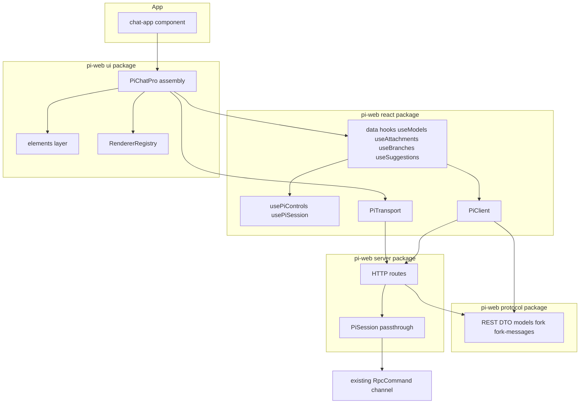
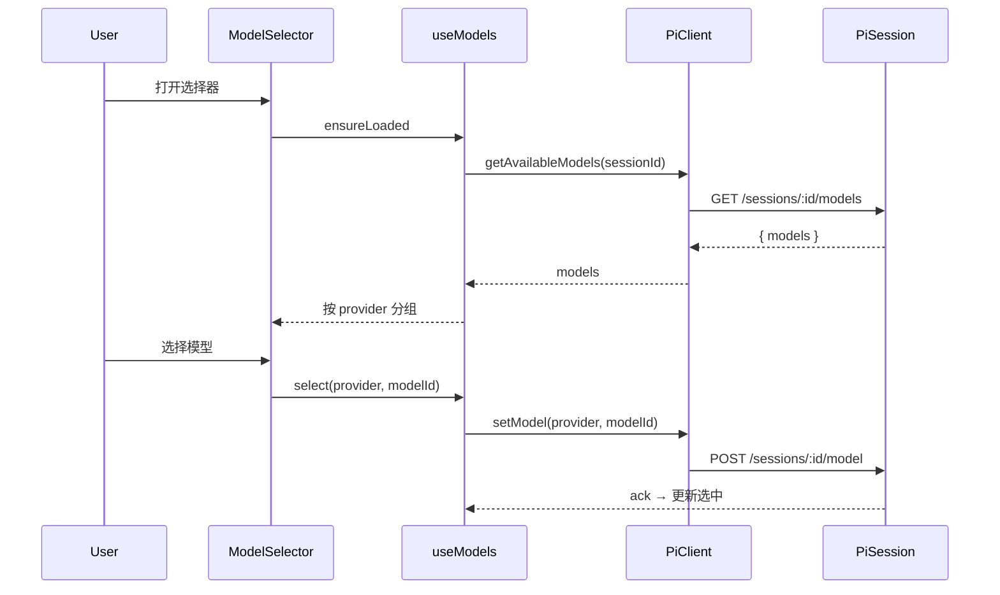
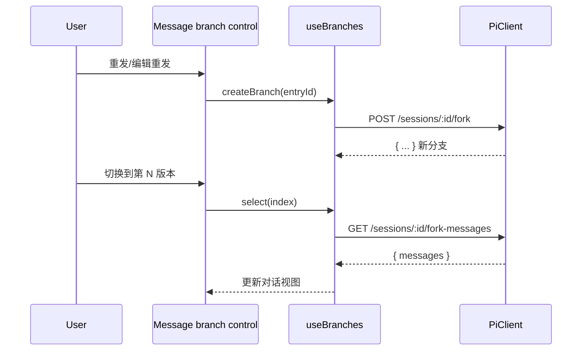

# Design Document — rich-chat-ui

## Overview

**Purpose**: 把 pi-web 的聊天界面升级为对标 AI Elements 参考示例的富界面,在不破坏现有最小 `<PiChat>` 的前提下新增 `<PiChatPro>`,提供富 PromptInput(附件/模型选择器/语音/联网开关/状态化发送)与完整 Conversation(自动滚动/分支/折叠/建议),全部接到 pi 真实能力。

**Users**: pi-web 终端用户(更现代的多模态对话交互)与集成方(可复用的 `@pi-web/ui` 富组件)。

**Impact**: 在 `@pi-web/ui` 新增元件层与装配层;在 `@pi-web/react` 新增数据 hooks 与 transport 附件映射;在 `@pi-web/protocol`/`@pi-web/server` 补齐三个**已存在 RpcCommand**(`get_available_models`/`fork`/`get_fork_messages`)的 REST 薄透传;app-shell 切到 `<PiChatPro>`。

### Goals
- 富 PromptInput 与完整 Conversation,交互对齐参考示例。
- 全部能力接到 pi 真实 RPC,无写死 mock;能力缺失时优雅降级。
- 非破坏:保留 `<PiChat>`,基线 483 测试 + typecheck 全绿。

### Non-Goals
- 不新增 pi agent 能力,不改会话/轮次语义(仅暴露已存在 RpcCommand)。
- 不做完整 fork 树可视化(仅线性同级版本切换)。
- 不做云端 STT、非图片附件真实上传、多租户/鉴权/沙箱。
- 不引入与 pi 无关的写死模型列表。

## Boundary Commitments

### This Spec Owns
- **UI 元件层**(`@pi-web/ui/src/elements/*`):无状态 AI Elements 等价组件(conversation/message+branch/prompt-input/attachments/model-selector/speech-input/web-search-toggle/sources/suggestions/submit-button)。
- **UI 装配层**(`@pi-web/ui/src/chat/pi-chat-pro.tsx`):`<PiChatPro>` 组合元件 + hooks + 渲染器注册表。
- **数据 hooks**(`@pi-web/react/src/hooks/*`):`useModels`/`useAttachments`/`useBranches`/`useSuggestions`。
- **REST 薄透传**:三个已存在 RpcCommand 的暴露面 —— protocol REST DTO、`PiSession` 透传方法、HTTP 路由、`PiClient` 方法。
- **app 装配**:app-shell 切换到 `<PiChatPro>`;新增组件/集成单测与浏览器 e2e。

### Out of Boundary
- 新 RPC 能力、会话引擎/轮次语义改动(只暴露已存在 command)。
- 完整 fork 树语义与可视化;源(sources)chunk 的协议层新增(记为可选 upstream)。
- 非图片附件的服务端处理;云端语音转写。
- 现有 `<PiChat>` 的行为修改。

### Allowed Dependencies
- 依赖方向:`@pi-web/protocol` → `@pi-web/server`;`@pi-web/protocol` → `@pi-web/react` → `@pi-web/ui` → app。各层只向左依赖,不得反向。
- 复用既有:`RendererRegistry`、`PiChatSlots`、`usePiControls`、`PiTransport`、`createPiClient`、`cn()`、`button/card/dialog/select`、`streamdown`/`lucide`/`cva`/`clsx`/`tailwind-merge`、radix dialog/select。
- 约束:**不新增 npm 运行时依赖**(模型选择器用自定义轻量 popover)。

### Revalidation Triggers
- protocol REST DTO 形状变化(`models`/`fork`/`fork-messages`)→ server + react 需重校。
- `PiSession`/HTTP 路由签名变化 → react `PiClient` + hooks 重校。
- `RendererRegistry` 或 `PiChatSlots` 契约变化 → `<PiChatPro>` 重校。
- `PromptRequest.images` 形状或 `PiTransport.sendMessages` 契约变化 → `useAttachments` + transport 映射重校。

## Architecture

### Existing Architecture Analysis
- **逐命令 HTTP 路由**:`create-handler.ts` 注册表 + `routes/{command,query}-routes.ts`,每能力一个 `PiSession` 方法。范本:`POST /sessions/:id/model`、`GET /sessions/:id/commands`。本特性严格沿用。
- **part 渲染**:`PartRenderer` 按 `part.type` 分派,text→`<Response>`,reasoning→`<PiReasoning>`,tool→registry 或 `<PiToolPart>`,data-*→registry 或默认。`<PiChatPro>` 复用同一机制。
- **控制能力**:`usePiControls` 暴露 `setModel/abort/getCommands/...` 与 `state`(每操作 pending/error)。富控件消费之。

### Architecture Pattern & Boundary Map



**Architecture Integration**:
- **Selected pattern**: 分层(元件层 → 装配层 → 数据 hooks → REST 薄透传),依赖单向向左。
- **Domain boundaries**:无状态元件只负责展示与本地交互;hooks 负责 pi 接线;透传层只暴露已存在 command。
- **Existing patterns preserved**:逐命令路由、PartRenderer、RendererRegistry、usePiControls.state、PiChatSlots。
- **New components rationale**:见 Components 表,每个对应一组需求且引入清晰边界或展示职责。
- **Steering compliance**:TypeScript strict、no any、主题走 CSS 变量、Node runtime/SSE 约束不变。

### Technology Stack

| Layer | Choice / Version | Role in Feature | Notes |
|-------|------------------|-----------------|-------|
| Frontend (UI) | React 19 + Tailwind + 既有 radix dialog/select + lucide + streamdown + cva/clsx/tailwind-merge | 富元件与装配 | **无新增依赖**;模型选择器自定义 popover |
| Frontend (data) | `@ai-sdk/react` useChat + `@pi-web/react` hooks | 流式态、附件、模型、分支、建议接线 | 复用既有 transport/controls |
| Protocol | `@pi-web/protocol`(zod,零运行时依赖) | 新增三 REST DTO | 复用既有 `Model`/`ImageContent` schema |
| Backend (server) | `@pi-web/server`(Node runtime) | 三透传方法 + 三路由 | 镜像 setModel/commands |
| Speech | 浏览器 Web Speech API | 本地语音转写 | feature-detect,降级隐藏 |

## File Structure Plan

### Directory Structure
```
packages/ui/src/
├── elements/                       # 新增:无状态 AI Elements 等价元件
│   ├── conversation.tsx            # 滚动容器 + 回到底部 (Req 7)
│   ├── use-auto-scroll.ts          # 自动滚动 hook (Req 7)
│   ├── message.tsx                 # 消息气泡 + 分支切换控件 UI (Req 8)
│   ├── prompt-input.tsx            # 富输入外壳(组合下列子控件)(Req 1,2)
│   ├── attachments.tsx             # 附件 chips + dropzone/paste (Req 3)
│   ├── model-selector.tsx          # 可搜索 + provider 分组 popover (Req 4)
│   ├── speech-input.tsx            # Web Speech 按钮 (Req 5)
│   ├── web-search-toggle.tsx       # 联网开关 (Req 6)
│   ├── submit-button.tsx           # 状态化 发送/停止 (Req 2)
│   ├── sources.tsx                 # 可折叠引用来源 (Req 9)
│   ├── suggestions.tsx             # 建议气泡 (Req 10)
│   └── index.ts                    # 元件层导出
├── chat/
│   └── pi-chat-pro.tsx             # 新增:富装配组件 (Req 1-11)
packages/react/src/
├── hooks/
│   ├── use-models.ts               # 新增:get_available_models + setModel (Req 4)
│   ├── use-attachments.ts          # 新增:图片附件状态 + base64 编码 (Req 3)
│   ├── use-branches.ts             # 新增:fork / get_fork_messages (Req 8)
│   └── use-suggestions.ts          # 新增:get_commands + 预设 (Req 10)
packages/protocol/src/transport/
│   └── rest-dto.ts                 # 修改:新增 3 个 REST DTO
packages/server/src/
├── session/PiSession.ts            # 修改:新增 3 个透传方法
└── http/
    ├── routes/query-routes.ts      # 修改:GET /models, GET /fork-messages
    ├── routes/command-routes.ts    # 修改:POST /fork
    └── create-handler.ts           # 修改:注册 3 路由
packages/react/src/
├── client/pi-client.ts             # 修改:getAvailableModels/fork/getForkMessages
├── transport/pi-transport.ts       # 修改:图片附件 → PromptRequest.images (Req 3)
└── index.ts                        # 修改:导出新 hooks
e2e/
└── rich-chat.spec.ts               # 新增:基本对话+附件+模型切换+建议点击 e2e
```

### Modified Files
- `packages/ui/src/index.ts` — 导出 `PiChatPro` 与 `elements/*`。
- `packages/react/src/index.ts` — 导出 `useModels/useAttachments/useBranches/useSuggestions`。
- `packages/protocol/src/transport/rest-dto.ts` — 新增 `GetAvailableModelsResponse`、`ForkRequest`/`ForkResponse`、`GetForkMessagesResponse`。
- `packages/server/src/session/PiSession.ts` — 新增 `getAvailableModels()`/`fork(entryId)`/`getForkMessages()`(镜像 `setModel`)。
- `packages/server/src/http/{create-handler,routes/query-routes,routes/command-routes}.ts` — 注册并实现 3 路由。
- `packages/react/src/client/pi-client.ts` — 新增 3 方法;`transport/pi-transport.ts` — 附件图片映射。
- `components/chat-app.tsx`(根 app)— 渲染 `<PiChatPro>` 取代 `<PiChat>`。

## System Flows

### 模型切换(Req 4)


### 分支切换(Req 8)

- 降级:若 `/models`、`/fork*` 返回不可用(404/未实现/空),对应 UI 隐藏或禁用,退化为线性会话与默认模型,不阻断对话(Req 4.4 / 8.4)。

## Requirements Traceability

| Requirement | Summary | Components | Interfaces | Flows |
|-------------|---------|------------|------------|-------|
| 1.1–1.5 | 富 PromptInput 组合与提交 | PromptInput, Attachments, SubmitButton, PiChatPro | `PromptInputProps`, useChat `sendMessage` | — |
| 2.1–2.4 | 发送按钮反映流式态 | SubmitButton | useChat `status`, `usePiControls.abort` | — |
| 3.1–3.5 | 图片附件 | Attachments, useAttachments, PiTransport | `useAttachments`, `PromptRequest.images` | 附件映射 |
| 4.1–4.5 | 模型选择器 | ModelSelector, useModels, PiClient, PiSession | `useModels`, `GET /models`, `setModel` | 模型切换 |
| 5.1–5.4 | 语音输入 | SpeechInput | Web Speech API | — |
| 6.1–6.4 | 联网开关 | WebSearchToggle, PiChatPro | UI 状态 + prompt 提示 | — |
| 7.1–7.3 | 自动滚动 | Conversation, useAutoScroll | `useAutoScroll` | — |
| 8.1–8.4 | 消息分支 | Message, useBranches, PiClient, PiSession | `useBranches`, `POST /fork`, `GET /fork-messages` | 分支切换 |
| 9.1–9.4 | 思考/来源折叠 | PiReasoning(既有), Sources, RendererRegistry | DataPartRenderer | — |
| 10.1–10.3 | 建议气泡 | Suggestions, useSuggestions | `useSuggestions`, `getCommands` | — |
| 11.1–11.5 | 共存/集成/a11y | PiChatPro, ui index, chat-app | `PiChatProProps` | — |

## Components and Interfaces

| Component | Domain/Layer | Intent | Req Coverage | Key Dependencies (P0/P1) | Contracts |
|-----------|--------------|--------|--------------|--------------------------|-----------|
| PiChatPro | UI 装配 | 组合富聊天界面 | 1–11 | hooks (P0), Elements (P0), Registry (P1) | State |
| Conversation | UI 元件 | 滚动容器+回到底部 | 7 | useAutoScroll (P0) | State |
| Message | UI 元件 | 气泡+分支切换 UI | 8 | useBranches (P1) | — |
| PromptInput | UI 元件 | 富输入外壳 | 1,2 | 子控件 (P0) | — |
| Attachments | UI 元件 | 图片附件 chips/dropzone | 3 | useAttachments (P0) | — |
| ModelSelector | UI 元件 | 分组可搜索模型选择 | 4 | useModels (P0) | — |
| SpeechInput | UI 元件 | 语音转写填入 | 5 | Web Speech (P1) | — |
| WebSearchToggle | UI 元件 | 联网开关 | 6 | — | — |
| SubmitButton | UI 元件 | 状态化发送/停止 | 2 | useChat status (P0) | — |
| Sources | UI 元件 | 折叠引用来源 | 9 | RendererRegistry (P1) | — |
| Suggestions | UI 元件 | 建议气泡 | 10 | useSuggestions (P0) | — |
| useModels | react hook | 模型列表+切换 | 4 | PiClient (P0) | Service, State |
| useAttachments | react hook | 图片附件状态+编码 | 3 | FileReader (P0) | State |
| useBranches | react hook | fork/分支消息 | 8 | PiClient (P0) | Service, State |
| useSuggestions | react hook | 命令+预设建议 | 10 | usePiControls.getCommands (P0) | Service, State |
| PiClient(扩展) | react client | 三 REST 方法 | 4,8 | protocol DTO (P0) | Service |
| PiSession(扩展) | server | 三透传方法 | 4,8 | RpcCommand channel (P0) | Service |

### React 数据 hooks 层

#### useModels
| Field | Detail |
|-------|--------|
| Intent | 拉取可用模型(按 provider 分组)并执行切换 |
| Requirements | 4.1, 4.2, 4.3, 4.4, 4.5 |

**Responsibilities & Constraints**
- 懒加载:首次打开选择器时调用 `getAvailableModels`;缓存结果。
- 分组:按 `Model.provider` 分组;搜索过滤在 UI 层基于返回数据进行。
- 切换经 `usePiControls.setModel`(或 PiClient.setModel);维护当前选中。
- 不可用(空/报错)时 `available=false`,UI 据此隐藏/禁用。

**Dependencies**
- Outbound: `PiClient.getAvailableModels` — 模型列表 (P0);`usePiControls.setModel` — 切换 (P0)。

**Contracts**: Service [x] / State [x]

##### Service Interface
```typescript
interface UseModelsOptions {
  sessionId: string | undefined;
  client?: PiClient;
  controls?: UsePiControlsResult;
}
interface ModelGroup {
  provider: string;
  models: ReadonlyArray<{ provider: string; modelId: string; label?: string }>;
}
interface UseModelsResult {
  groups: ReadonlyArray<ModelGroup>;
  current: { provider: string; modelId: string } | undefined;
  available: boolean;                 // get_available_models 是否可用且非空
  pending: boolean;
  error: unknown;
  ensureLoaded(): Promise<void>;      // 懒加载
  select(provider: string, modelId: string): Promise<void>;
}
```
- Preconditions: `sessionId` 已建立。
- Postconditions: `select` 成功后 `current` 更新。
- Invariants: `groups` 仅来自 `getAvailableModels`,不含写死项。

#### useAttachments
| Field | Detail |
|-------|--------|
| Intent | 管理待发送图片附件并编码为 ImageContent |
| Requirements | 3.1, 3.2, 3.3, 3.4, 3.5 |

**Contracts**: State [x]
```typescript
interface PendingAttachment { id: string; name: string; mimeType: string; dataUrl: string; }
interface UseAttachmentsResult {
  items: ReadonlyArray<PendingAttachment>;
  supported: boolean;                 // 当前会话/agent 是否支持图片输入
  add(files: FileList | File[]): Promise<{ rejected: string[] }>;  // 非图片进 rejected
  remove(id: string): void;
  clear(): void;
  toImageContents(): ImageContent[];  // base64 → PromptRequest.images
}
```
- Invariants: 仅 `image/*` 进入 `items`;非图片记入 `rejected` 并提示(Req 3.4)。

#### useBranches
| Field | Detail |
|-------|--------|
| Intent | 经 fork 创建同级版本并加载分支消息 |
| Requirements | 8.1, 8.2, 8.3, 8.4 |

**Contracts**: Service [x] / State [x]
```typescript
interface BranchInfo { entryId: string; index: number; total: number; }
interface UseBranchesResult {
  available: boolean;                 // fork/get_fork_messages 是否可用
  branchOf(entryId: string): BranchInfo | undefined;
  createBranch(entryId: string): Promise<void>;            // POST /fork
  select(entryId: string, index: number): Promise<void>;   // GET /fork-messages 后切换
  pending: boolean;
  error: unknown;
}
```
- Postconditions: `select` 后对应分支消息序列可用于视图刷新。
- 降级:`available=false` 时所有方法 no-op,UI 隐藏分支控件。

#### useSuggestions
| Field | Detail |
|-------|--------|
| Intent | 合并 pi 命令与预设为建议项 |
| Requirements | 10.1, 10.2, 10.3 |

**Contracts**: Service [x] / State [x]
```typescript
interface Suggestion { id: string; label: string; value: string; mode: "fill" | "send"; }
interface UseSuggestionsOptions {
  controls?: UsePiControlsResult;     // 复用 getCommands/commands
  presets?: ReadonlyArray<Suggestion>;
}
interface UseSuggestionsResult {
  items: ReadonlyArray<Suggestion>;   // commands ∪ presets;空则 []
  pending: boolean;
}
```

### React client / transport 扩展

#### PiClient(新增方法)
```typescript
interface PiClient {
  // ...既有方法
  getAvailableModels(sessionId: string): Promise<GetAvailableModelsResponse>;
  fork(sessionId: string, req: ForkRequest): Promise<ForkResponse>;
  getForkMessages(sessionId: string): Promise<GetForkMessagesResponse>;
}
```
- Implementation Notes:
  - Integration: 复用 `request.ts` 底层;路径 `GET /sessions/:id/models`、`POST /sessions/:id/fork`、`GET /sessions/:id/fork-messages`。
  - Validation: 用 protocol zod DTO 解析响应。
  - Risks: 端点缺失返回 404 → hook 置 `available=false`(优雅降级)。

#### PiTransport(附件映射)
- **Responsibilities**: `sendMessages` 时将 UIMessage 中携带的图片附件(经 `useAttachments.toImageContents`,以 useChat `sendMessage` 的 `metadata`/`body` 传入)映射到 `PromptRequest.images`。
- **Constraints**: 不改既有文本/SSE 路径;无附件时行为与现状一致。
- Risks: useChat 消息形状差异 → 加 transport 单测覆盖含/不含图片两路。

### Protocol 扩展(REST DTO)
- 新增于 `transport/rest-dto.ts`,复用既有 `Model`/`ImageContent`/`entryId` schema:
```typescript
const GetAvailableModelsResponse = z.object({
  models: z.array(Model),            // 复用既有 Model schema(provider, modelId, label?)
});
const ForkRequest = z.object({ entryId: z.string() });
const ForkResponse = z.object({ text: z.string().optional(), cancelled: z.boolean().optional() });
const GetForkMessagesResponse = z.object({
  messages: z.array(z.object({ entryId: z.string(), text: z.string() })),
});
```
- 与 `RpcCommand` 中 `get_available_models`/`fork`/`get_fork_messages` 的形状对齐。

### Server 扩展(PiSession + 路由)
- `PiSession`:新增 `getAvailableModels()`/`fork(entryId)`/`getForkMessages()`,各自向底层 RpcChannel 发送对应 command 并返回解析结果(镜像 `setModel`)。
- 路由(镜像范本):
  | Method | Path | → PiSession |
  |--------|------|-------------|
  | GET | /sessions/:id/models | getAvailableModels() |
  | POST | /sessions/:id/fork | fork(entryId) |
  | GET | /sessions/:id/fork-messages | getForkMessages() |
- Implementation Notes:Integration 沿用 `command-routes`/`query-routes` 既有 `dataOrError` + `jsonResponse` 模式;Validation 用 protocol DTO;Risks 不改既有路由与会话语义。

### UI 元件层(展示组件,summary-only + 实现要点)
- **Conversation**(`elements/conversation.tsx` + `use-auto-scroll.ts`):监测是否贴底;贴底时新内容自动滚动(Req 7.1),离底显示"回到底部"(7.2),点击平滑滚动并恢复(7.3)。a11y:按钮 `aria-label`。
- **Message**(`elements/message.tsx`):气泡布局;当 `useBranches.branchOf(entryId)` 存在多版本时渲染"‹ N/M ›"分支控件(Req 8.1),按钮触发 `select`。
- **PromptInput**(`elements/prompt-input.tsx`):textarea(Shift+Enter 换行 1.4、Enter 提交 1.2)+ 动作菜单 + 子控件插槽;空内容禁用提交(1.3)。
- **Attachments**(`elements/attachments.tsx`):dropzone + paste + 选择;chips + 移除;非图片提示(Req 3)。
- **ModelSelector**(`elements/model-selector.tsx`):自定义轻量 popover(button + 受控面板 + 点击外部/Esc 关闭),搜索框 + provider 分组列表 + 选中勾选(Req 4);`available=false` 隐藏。
- **SpeechInput**(`elements/speech-input.tsx`):feature-detect `SpeechRecognition`;转写追加到输入(Req 5);不支持/拒权隐藏或禁用。
- **WebSearchToggle**(`elements/web-search-toggle.tsx`):受控开关,默认关闭(Req 6)。
- **SubmitButton**(`elements/submit-button.tsx`):依 useChat `status`(submitted/streaming→停止,ready→发送,error→错误态)切换(Req 2)。
- **Sources**(`elements/sources.tsx`):可折叠,默认折叠;经 `RendererRegistry` 注册 `source` data-part 渲染器,无来源不渲染(Req 9.3/9.4)。
- **Suggestions**(`elements/suggestions.tsx`):气泡列表;点击按 `mode` 填入或发送(Req 10.2);空则不渲染(10.3)。

### PiChatPro(装配)
```typescript
interface PiChatProProps {
  session: UsePiSessionResult;
  controls?: UsePiControlsResult;
  extensionUI?: UseExtensionUIResult;
  registry?: RendererRegistry;
  slots?: PiChatSlots;
  suggestionsPresets?: ReadonlyArray<Suggestion>;
  placeholder?: string;
  className?: string;
}
```
- 内部:`useChat`(用 `session.transport`)+ `useModels`/`useAttachments`/`useBranches`/`useSuggestions`;复用 `PartRenderer`/`PiReasoning`/`PiToolPart`/注册表。
- Reasoning 折叠复用既有 `<PiReasoning>`(Req 9.1/9.2);data-part sources 经注册表。

## Data Models
- 无新增持久化模型。新增的是**传输契约**(REST DTO,见上),复用既有 `Model`/`ImageContent`。
- 前端本地状态:`PendingAttachment`、`ModelGroup`、`BranchInfo`、`Suggestion`(均为 UI/hook 内存态,无持久化)。

## Error Handling

### Error Strategy
- **能力缺失 → 优雅降级**:`/models`、`/fork*` 不可用(404/空/报错)时对应 hook `available=false`,UI 隐藏/禁用,会话退化为默认模型 + 线性会话,不阻断对话(Req 4.4/8.4)。
- **附件类型错误**(Req 3.4):非图片不入发送列表,提示"暂不支持",不阻断已有内容发送。
- **语音不可用**(Req 5.4):feature-detect 失败或拒权 → 隐藏/禁用按钮 + 可读提示。
- **会话 error 态**(Req 2.4):SubmitButton 显示错误态,允许重试/继续输入。

### Error Categories and Responses
- **User Errors**:空提交被禁用(1.3);非图片附件提示(3.4)。
- **System Errors**:REST 404/5xx → 降级隐藏对应能力,记录到 `state.error`。
- **Stream Errors**:useChat `error` → SubmitButton 错误态。

### Monitoring
- 复用既有 `usePiControls.state` 与 hook 内 `error` 暴露;不新增监控基础设施。

## Testing Strategy

### Unit Tests
- `useModels`:懒加载分组、`select` 调 setModel、不可用降级(mock PiClient)。
- `useAttachments`:仅图片入列、非图片进 rejected、`toImageContents` 编码、remove/clear。
- `useBranches`:createBranch/select 调用正确端点、`available=false` no-op。
- `useSuggestions`:commands ∪ presets、空则 []。
- `PiClient`:三新方法的路径/方法/DTO 解析;404 抛可识别错误。
- `PiTransport`:含/不含图片两路映射到 `PromptRequest.images`。
- protocol DTO:三 schema 解析有效/无效负载。

### Integration Tests
- `PiSession.getAvailableModels/fork/getForkMessages`:镜像 setModel,经 RpcChannel mock 验证 command 发送与解析。
- HTTP 路由:`GET /models`、`POST /fork`、`GET /fork-messages` 的请求校验、成功响应、错误映射(沿用既有路由测试范式)。
- `<PiChatPro>` 组件集成(@testing-library/react + jsdom):提交文本、附件 chip 增删、模型选择器打开/搜索/选择、建议点击、SubmitButton 随状态切换、分支控件出现/切换(mock hooks)。

### E2E/UI Tests (Playwright)
- `e2e/rich-chat.spec.ts`(用 `~/.pi/agent` 真实配置):
  1. 基本对话:输入→发送→收到流式回复(关键路径,对应既有 e2e 升级到 PiChatPro)。
  2. 模型选择器:打开→看到来自 `get_available_models` 的分组→搜索过滤→选择→切换成功。
  3. 附件:粘贴/选择图片→出现 chip→发送(断言请求含 images);非图片→提示且不入列。
  4. 建议气泡:出现来自 `get_commands` 的项→点击填入/发送。
  - 分支切换作为可用即验证项(若会话支持 fork);不支持则断言控件隐藏(降级)。
- **基线保护**:运行 `pnpm test` + `pnpm typecheck`,确认基线 483 测试无回归(Req 11.2)。

## Security Considerations
- 附件仅在前端编码为 base64 随 prompt 传输,走既有 `/messages` 鉴权路径;不新增上传端点。
- 语音转写在浏览器本地进行,不上传音频。
- 新增 REST 端点沿用既有 `auth.ts` 鉴权与 `error-map.ts`,不放宽访问控制。
