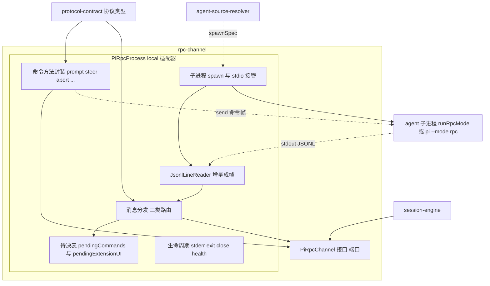
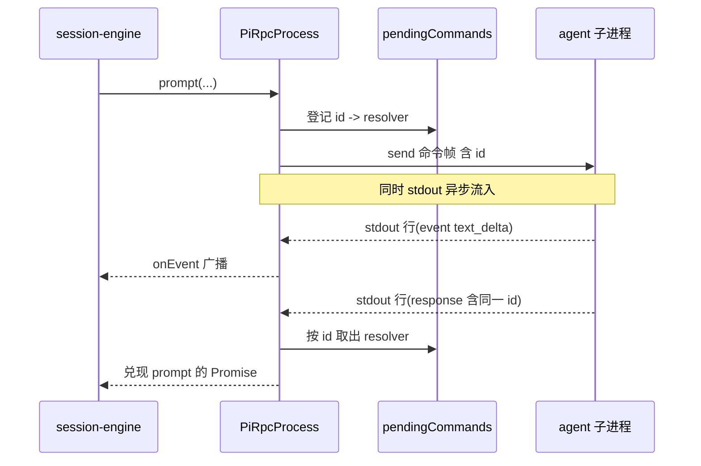
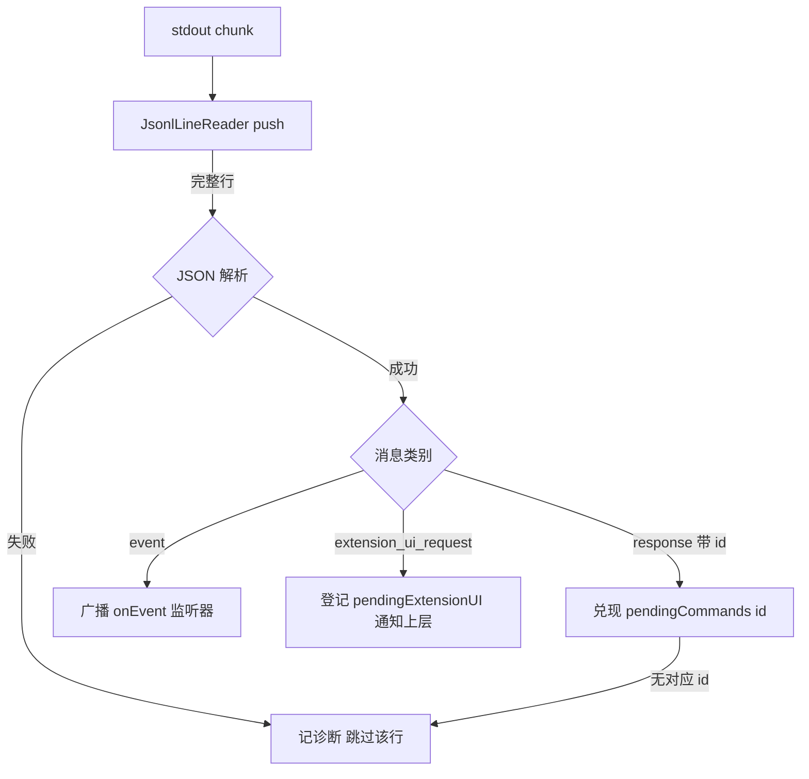
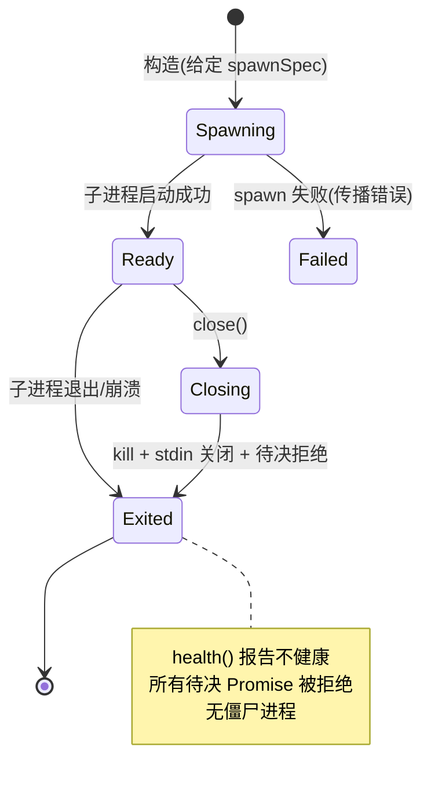

# Design Document — rpc-channel

## Overview

**Purpose**:本特性交付 pi-web 后端的 **传输无关 RPC 通道**:接口 `PiRpcChannel`(`send` / `onLine` / `close` / `health`)与其本地实现 `PiRpcProcess`。它是后端会话引擎与 agent 子进程之间唯一的双向 JSONL 通信枢纽,负责严格成帧、stdout 三类消息分发、与包 `RpcClient` 对齐的命令方法封装,以及子进程生命周期管理。

**Users**:下游 `session-engine` 通过本通道发起命令、订阅事件、回复扩展 UI 请求;上游 `agent-source-resolver` 提供 spawnSpec;上游 `protocol-contract` 提供全部协议类型。

**Impact**:替代包内 `RpcClient`(写死 spawn、无扩展 UI、`readline` 误切),并把"本地子进程 + 管道"收敛到 §14.1① 要求的接口接缝之后,使未来 e2b/ssh/device/websocket 传输成为同接口的另一实现而无需改动上层。

### Goals

- 定义传输无关接口 `PiRpcChannel`,使本地与未来远程传输共享同一契约,命令封装层可对接口 mock 单测。
- 实现协议正确的增量 JSONL reader:仅按 `\n` 切、剥尾随 `\r`、缓冲跨 chunk 行、跳空行、保留行内 `U+2028`/`U+2029`。
- 正确分发 stdout 三类消息:`response`(按 `id` 关联 Promise)、`event`(广播)、`extension_ui_request`(挂起 + 回复)。
- 暴露与包 `RpcClient` 对齐的命令方法封装,类型取自 `@blksails/protocol`。
- 管理子进程生命周期:stderr 收集、exit/崩溃传播、`close()` 干净退出无僵尸、待决命令统一拒绝。

### Non-Goals

- 不生成 spawnSpec(源解析、入口探测、双模式判定、`require.resolve` 定位 `cli.js`)——归 `agent-source-resolver`。
- 不做事件 → AI SDK UIMessage 翻译——归 `session-engine`。
- 不定义协议类型/zod schema——归 `protocol-contract`(本特性只消费)。
- 不做会话注册、生命周期计时、SSE 编排——归 `session-engine`。
- 不实现远程传输(e2b/ssh/device/websocket)——未来特性,仅由本接口预留接缝。

## Boundary Commitments

### This Spec Owns

- `PiRpcChannel` 传输无关接口的定义(`send(line)` / `onLine(cb)` / `close()` / `health()`)。
- `PiRpcProcess` 本地实现:按给定 spawnSpec(`SpawnSpec { cmd, args, cwd, env }`,类型自 `@blksails/protocol` 导入)以 `detached:false` spawn 子进程并接管 stdio。
- 增量 JSONL reader(`JsonlLineReader`):严格成帧与跨 chunk 缓冲。
- stdout 三类消息分发与两张待决表(`pendingCommands` / `pendingExtensionUI`)。
- 与 `RpcClient` 对齐的命令方法封装(基于 `send` + 等待 `response`),加 `onEvent()` 与 `respondExtensionUI(id, …)`。
- 子进程 stderr 收集、exit/error 监听与传播、`close()` 干净退出与待决拒绝。

### Out of Boundary

- spawnSpec 的生成与 `cli.js`/runner 定位(`agent-source-resolver`)。
- 事件 → UIMessage 翻译(`session-engine`)。
- 协议类型/schema 定义与运行时校验(`protocol-contract`)。
- 会话注册/生命周期计时/SSE 广播(`session-engine`)。
- 远程传输实现(未来 provider)。

### Allowed Dependencies

- **运行时**:`@blksails/protocol`(协议类型 + `SpawnSpec`,唯一跨包依赖;`SpawnSpec` 由 protocol-contract 拥有并导出,本特性经 `import type { SpawnSpec } from "@blksails/protocol"` 消费,不本地定义);Node 内置 `child_process`、`node:events`、`node:stream`(仅 `local` 实现内部使用,不出现在接口签名)。
- **依赖方向**:`protocol-contract ← rpc-channel`;`rpc-channel ← session-engine`。禁止反向。`PiRpcChannel` 接口签名不得泄漏 `child_process`/管道概念(Req 1.3)。
- **开发/测试**:`vitest`;集成/e2e 可引用 `@earendil-works/pi-coding-agent`(spawn 真实 `pi --mode rpc`)或自带 stub 进程脚本——不进入运行时依赖。

### Revalidation Triggers

- `protocol-contract` 中本特性消费的命令/响应/事件/扩展 UI 类型形状变更。
- protocol-contract 导出的 `SpawnSpec`(`{ cmd, args, cwd, env }`)形状契约变更。
- `PiRpcChannel` 接口成员签名变更(影响下游 session-engine 与未来远程实现)。
- pi 版本对齐迁移导致 RPC JSONL 语义或消息分类变化。
- 三类消息的判别方式(如何区分 response / event / extension_ui_request)变更。

## Architecture

### Architecture Pattern & Boundary Map

模式:**Ports & Adapters(端口/适配器)**。`PiRpcChannel` 是端口;`PiRpcProcess` 是 `local` 适配器。命令封装层只依赖端口接口,使其可对 mock channel 单测;`JsonlLineReader` 与消息分发解耦,使成帧可独立单测。



**Architecture Integration**:

- **Selected pattern**:Ports & Adapters。理由:§14.1① 强制接缝;命令层可 mock 单测;远程传输只是新适配器。
- **Domain/feature boundaries**:成帧(`JsonlLineReader`)、分发(三类路由 + 待决表)、命令封装、生命周期四块职责分离,经 `PiRpcChannel` 与外界交互。
- **Dependency direction**:`protocol ← rpc-channel ← session-engine`;spawnSpec 由 agent-source-resolver 旁路注入。接口签名不暴露进程概念。
- **New components rationale**:`PiRpcChannel`(接缝)、`PiRpcProcess`(本地实现)、`JsonlLineReader`(可独立测试的成帧)——各单一职责,无多余抽象。
- **Steering compliance**:TypeScript strict、禁 `any`;传输用接口隔开(structure.md);JSONL 严格成帧、禁 `readline`(tech.md);不依赖全局 `pi`、`detached:false`(PLAN.md §7)。

### Technology Stack

| Layer | Choice / Version | Role in Feature | Notes |
|-------|------------------|-----------------|-------|
| Frontend / CLI | — | 本特性为纯后端 | — |
| Backend / Services | TypeScript strict;Node `>=22.19.0` | 通道接口、本地实现、命令封装 | 接口签名不含 Node 专有类型 |
| Data / Storage | — | 无持久化(待决表为进程内内存) | — |
| Messaging / Events | `node:events`(EventEmitter,内部);JSONL over stdio | 事件广播、子进程 stdin/stdout 双向 | framing 自实现,禁 `readline` |
| Infrastructure / Runtime | `child_process.spawn`(`detached:false`);`@blksails/protocol`(类型);`vitest`(测试);`@earendil-works/pi-coding-agent`(dev/集成 spawn 真实 pi) | 子进程托管与协议类型 | pi 包不进运行时依赖 |

## File Structure Plan

### Directory Structure

```
lib/pi/
├── pi-rpc-channel.ts         # PiRpcChannel 端口接口 + ChannelHealth 类型(SpawnSpec 自 @blksails/protocol 导入,不在此定义)
├── jsonl-line-reader.ts      # 增量 JSONL reader:push(chunk)->完整行[];CRLF/分片/空行/U+2028|2029
├── pi-rpc-process.ts         # PiRpcProcess:local 实现(spawn + 接 reader + 三类分发 + 命令封装 + 生命周期)
└── pi-rpc-process.errors.ts  # 通道错误类型(spawn 失败 / 通道已关闭 / 子进程崩溃 / 解析失败诊断)
```

> 说明:命令方法封装(`prompt`/`steer`/… 共 18 个)与三类分发、待决表都驻留在 `pi-rpc-process.ts` 内——它们共享同一子进程与 stdin/stdout 状态,属同一职责边界;reader 与错误类型外置以便独立测试与复用。

### Test Structure

```
lib/pi/__tests__/
├── jsonl-line-reader.test.ts        # 成帧单元:分片/CRLF/U+2028|2029/空行/单chunk多行(Req 3, 7.1)
├── pi-rpc-process.unit.test.ts      # 用 mock channel/伪 stdio:response/id 关联、extension_ui 挂起回复(Req 4,5,7.2,7.3)
├── pi-rpc-process.lifecycle.test.ts # close/exit/崩溃 时待决拒绝、health、无僵尸(Req 6)
├── pi-rpc-process.integration.test.ts # spawn 真实 pi --mode rpc 或 stub:prompt -> agent_end(Req 7.4)
└── pi-rpc-process.e2e.test.ts       # spawn->prompt->收集 text_delta/tool 事件->abort->close 干净退出(Req 7.5)
test/fixtures/
└── rpc-stub-process.mjs             # 等价 stub 子进程:读 stdin 命令,按协议吐 JSONL(集成/e2e 退路)
```

### Modified Files

- 无(greenfield 新模块)。若 monorepo 已存在 `package.json`,需将 `@blksails/protocol` 与 `vitest` 纳入依赖——该接线随仓库初始化处理,本特性创建模块自身文件与测试。

## System Flows

### 命令往返与 id 关联



命令方法生成唯一 `id` 后立即返回待决 Promise;事件与响应在同一 stdout 流上异步到达,reader 成行后由分发层按消息形状路由。无对应 `id` 的响应被丢弃并记诊断(Req 4.5);响应未到达期间不阻塞其他命令或事件(Req 5.4)。

### stdout 三类消息分发



`respondExtensionUI(id, …)` 把回复经 `send` 写回 stdin 并从 `pendingExtensionUI` 移除(Req 4.4)。

### 关闭与生命周期



## Requirements Traceability

| Requirement | Summary | Components | Interfaces | Flows |
|-------------|---------|------------|------------|-------|
| 1.1 | 接口暴露 send/onLine/close/health | pi-rpc-channel.ts | `PiRpcChannel` | — |
| 1.2 | onLine 每完整行回调 | pi-rpc-channel.ts, jsonl-line-reader.ts | `onLine` | 分发流 |
| 1.3 | 接口不泄漏进程/管道概念 | pi-rpc-channel.ts | `PiRpcChannel` 签名 | — |
| 1.4 | PiRpcProcess 实现接口全成员 | pi-rpc-process.ts | implements `PiRpcChannel` | — |
| 1.5 | 接口可 mock,命令层免真进程测 | pi-rpc-channel.ts | 端口抽象 | — |
| 2.1 | 按 spawnSpec spawn 接 stdio | pi-rpc-process.ts | `SpawnSpec`(自 @blksails/protocol) | 生命周期流 |
| 2.2 | detached:false 连带清理 | pi-rpc-process.ts | spawn 选项 | 生命周期流 |
| 2.3 | 不内部决定 spawn 目标 | pi-rpc-process.ts | `SpawnSpec` 输入(自 @blksails/protocol) | — |
| 2.4 | spawn 失败传播错误且不就绪 | pi-rpc-process.ts, errors.ts | `SpawnError` | 生命周期流 |
| 3.1 | 仅按 \n 切、禁 readline | jsonl-line-reader.ts | `push` | 分发流 |
| 3.2 | 剥尾随 \r(CRLF) | jsonl-line-reader.ts | `push` | — |
| 3.3 | 跨 chunk 缓冲补齐 | jsonl-line-reader.ts | 内部残留缓冲 | — |
| 3.4 | 保留行内 U+2028/U+2029 | jsonl-line-reader.ts | `push` | — |
| 3.5 | 跳过空行不报错 | jsonl-line-reader.ts | `push` | 分发流 |
| 3.6 | 单 chunk 多行按序分发 | jsonl-line-reader.ts | `push` | — |
| 4.1 | response 按 id 兑现 Promise | pi-rpc-process.ts | `pendingCommands` | 命令往返流 |
| 4.2 | event 广播 | pi-rpc-process.ts | `onEvent` | 分发流 |
| 4.3 | extension_ui_request 挂起通知 | pi-rpc-process.ts | `pendingExtensionUI` | 分发流 |
| 4.4 | respondExtensionUI 写回并移除 | pi-rpc-process.ts | `respondExtensionUI` | 分发流 |
| 4.5 | 无对应 id 响应丢弃记诊断 | pi-rpc-process.ts, errors.ts | 诊断 | 分发流 |
| 4.6 | 不可解析行跳过记诊断 | pi-rpc-process.ts, jsonl-line-reader.ts | 诊断 | 分发流 |
| 5.1 | 暴露 18 个对齐命令方法 | pi-rpc-process.ts | 命令方法集 | — |
| 5.2 | 命令生成 id、send、返回 Promise | pi-rpc-process.ts | 命令方法 | 命令往返流 |
| 5.3 | 输入输出用 protocol 类型 | pi-rpc-process.ts | `@blksails/protocol` | — |
| 5.4 | 待决不阻塞其他命令/事件 | pi-rpc-process.ts | 异步分发 | 命令往返流 |
| 5.5 | 暴露 onEvent / respondExtensionUI | pi-rpc-process.ts | 接口成员 | — |
| 6.1 | 收集 stderr 供诊断 | pi-rpc-process.ts | stderr 缓冲 | 生命周期流 |
| 6.2 | 退出发信号 + 拒绝待决 | pi-rpc-process.ts | exit 处理 | 生命周期流 |
| 6.3 | close 终止、关 stdin、停分发、拒待决 | pi-rpc-process.ts | `close` | 生命周期流 |
| 6.4 | health 报告不可用 | pi-rpc-process.ts | `health` | 生命周期流 |
| 6.5 | 崩溃作为错误传播 | pi-rpc-process.ts, errors.ts | error 处理 | 生命周期流 |
| 6.6 | close 后无僵尸 | pi-rpc-process.ts | kill + 验证 | 生命周期流 |
| 7.1 | 成帧单元测试 | jsonl-line-reader.test.ts | vitest | 分发流 |
| 7.2 | response/id 关联单元测试 | pi-rpc-process.unit.test.ts | vitest | 命令往返流 |
| 7.3 | extension_ui 挂起回复单元测试 | pi-rpc-process.unit.test.ts | vitest | 分发流 |
| 7.4 | 集成测试 spawn 真实/stub | pi-rpc-process.integration.test.ts, rpc-stub-process.mjs | vitest | 命令往返流 |
| 7.5 | e2e:spawn→prompt→事件→abort→close | pi-rpc-process.e2e.test.ts | vitest | 全部流 |
| 7.6 | 单一命令运行全部测试 | vitest 配置 / package.json | `vitest run` | — |

## Components and Interfaces

| Component | Layer | Intent | Req Coverage | Key Dependencies (P0/P1) | Contracts |
|-----------|-------|--------|--------------|--------------------------|-----------|
| `PiRpcChannel`(pi-rpc-channel.ts) | port | 传输无关通道接口 + Health 类型(SpawnSpec 自 protocol 导入) | 1.1–1.5, 6.4 | @blksails/protocol (P1) | Service |
| `JsonlLineReader`(jsonl-line-reader.ts) | framing | 增量 JSONL 成帧 | 3.1–3.6, 1.2, 4.6, 7.1 | — | Service |
| `PiRpcProcess`(pi-rpc-process.ts) | local adapter | spawn + 三类分发 + 命令封装 + 生命周期 | 2.x, 4.x, 5.x, 6.x | PiRpcChannel (P0), JsonlLineReader (P0), @blksails/protocol (P0), child_process (P0) | Service, Event, State |
| 通道错误类型(pi-rpc-process.errors.ts) | local adapter | spawn 失败/通道关闭/崩溃/诊断 | 2.4, 4.5, 4.6, 6.5 | — | State |

### port layer

#### PiRpcChannel(pi-rpc-channel.ts)

| Field | Detail |
|-------|--------|
| Intent | 传输无关 RPC 通道端口:发送一行、订阅行、关闭、健康查询 |
| Requirements | 1.1, 1.2, 1.3, 1.4, 1.5, 6.4 |

**Responsibilities & Constraints**
- 定义最小通道契约,签名仅使用字符串与协议无关的原始类型,不出现 `ChildProcess`/`Stream`/管道概念(Req 1.3)。
- 同文件定义 `ChannelHealth`(健康状态形状,Req 6.4);`SpawnSpec`(`{ cmd, args, cwd, env }`)不在此定义,而是由 protocol-contract 拥有并导出,本特性经 `import type { SpawnSpec } from "@blksails/protocol"` 消费(单一事实来源,见 Req 2.1)。
- 仅为类型/接口声明,无运行时行为,使其可被 mock 替换(Req 1.5)。

**Dependencies**
- External: `@blksails/protocol` — 若 health 形状引用协议常量则消费,否则纯本地类型 (P1)

**Contracts**: Service [x]

##### Service Interface
```typescript
// SpawnSpec 由 protocol-contract 拥有并导出,本特性只消费、不重定义(单一事实来源)
import type { SpawnSpec, /* RpcExtensionUIResponse 等 */ } from "@blksails/protocol";

export interface ChannelHealth {
  readonly alive: boolean;          // 子进程/连接是否存活
  readonly exitCode: number | null; // 已退出时的退出码
  readonly signal: string | null;   // 被信号终止时的信号名
}

export type LineListener = (line: string) => void;
export type Unsubscribe = () => void;

export interface PiRpcChannel {
  send(line: string): void;          // 写入一行原始 JSONL 到下游(local 即子进程 stdin)
  onLine(cb: LineListener): Unsubscribe; // 每收到一条完整行回调(Req 1.2)
  close(): Promise<void>;            // 关闭通道,干净退出(Req 6.3/6.6)
  health(): ChannelHealth;           // 通道健康状态(Req 6.4)
}
```
- Preconditions:`send`/`onLine` 仅在通道未关闭时有意义。
- Postconditions:`onLine` 返回的 `Unsubscribe` 调用后不再回调;`close` resolve 后 `health().alive === false`。
- Invariants:接口签名不泄漏进程/管道类型(Req 1.3)。

**Implementation Notes**
- Integration:`session-engine` 持有 `PiRpcChannel` 引用;命令封装层经此接口对接,可注入 mock 实现做单测(Req 1.5)。
- Validation:命令层单测用最小 mock channel(记录 `send`、手工触发 `onLine`)。
- Risks:接口扩张会波及所有实现 → 保持最小成员集。

#### JsonlLineReader(jsonl-line-reader.ts)

| Field | Detail |
|-------|--------|
| Intent | 增量 JSONL 成帧:喂 chunk,吐完整行,严格遵循 pi JSONL 语义 |
| Requirements | 3.1, 3.2, 3.3, 3.4, 3.5, 3.6, 1.2, 4.6, 7.1 |

**Responsibilities & Constraints**
- 仅以 `\n` 为行边界切分,禁用 Node `readline`(Req 3.1)。
- 切分后剥离尾随 `\r`(CRLF → 行内容,Req 3.2)。
- 维护内部残留缓冲,跨 chunk 拼接被拆分的行(Req 3.3);单 chunk 多行按序输出(Req 3.6)。
- 不把 `U+2028`/`U+2029` 当行边界,保留在行内(Req 3.4)。
- 跳过空行(切分后内容为空)而不输出、不报错(Req 3.5)。
- 纯字符串处理,无 I/O,无副作用(便于 Req 7.1 大量正反例单测)。

**Contracts**: Service [x]

##### Service Interface
```typescript
export class JsonlLineReader {
  // 喂入一个 stdout 文本 chunk,返回本次新成形的完整行(已剥 \r、已跳空行)
  push(chunk: string): string[];
  // 流结束时取出残留缓冲中是否还有未尾随 \n 的内容(可选,供 exit 处理)
  flush(): string[];
}
```
- Preconditions:`chunk` 为已解码字符串(子进程 stdout 设 UTF-8 编码)。
- Postconditions:返回数组按原始出现顺序;空行不入数组;不完整尾段留缓冲。
- Invariants:`U+2028`/`U+2029` 永不作为分隔符。

**Implementation Notes**
- Integration:`PiRpcProcess` 订阅子进程 stdout(UTF-8)→ 逐 chunk `push` → 对每行 JSON 解析后分发。
- Validation:单测覆盖 CRLF、分片(把一条 JSON 拆成多 chunk)、行内 `U+2028`/`U+2029`、空行、单 chunk 多行、`flush` 残留。
- Risks:编码不一致导致多字节字符跨 chunk 截断 → 约定 stdout 用字符串流(`setEncoding('utf8')`),本 reader 不处理字节级拼接。

### local adapter layer

#### PiRpcProcess(pi-rpc-process.ts)

| Field | Detail |
|-------|--------|
| Intent | `PiRpcChannel` 的本地实现:spawn 子进程 + 三类消息分发 + 命令封装 + 生命周期 |
| Requirements | 2.1–2.4, 4.1–4.6, 5.1–5.5, 6.1–6.6 |

**Responsibilities & Constraints**
- 按传入 `SpawnSpec` 以 `detached:false` spawn 子进程,接管 stdin/stdout/stderr 管道(Req 2.1/2.2);不内部决定 spawn 目标(Req 2.3)。
- 子进程 stdout 设 UTF-8 → 经 `JsonlLineReader` 成行 → 每行 JSON 解析后分发(失败则记诊断跳过,Req 4.6)。
- 维护两张待决表:`pendingCommands`(id → Promise resolver/rejecter)与 `pendingExtensionUI`(id → 请求快照)。
- 三类分发:`response` 按 `id` 兑现并清表(无 id 对应则丢弃记诊断,Req 4.1/4.5);`event` 广播给 `onEvent` 监听器(Req 4.2);`extension_ui_request` 登记并通知上层(Req 4.3)。
- 命令封装:18 个方法各生成唯一 `id`、构造命令帧经 `send` 写出、返回待决 Promise(Req 5.1/5.2);输入输出类型取自 `@blksails/protocol`(Req 5.3);异步不阻塞(Req 5.4)。`onEvent()` 订阅事件,`respondExtensionUI(id, …)` 写回 stdin 并清待决(Req 5.5/4.4)。
- 生命周期:持续收集 stderr(Req 6.1);监听 `exit`/`error`,退出/崩溃时发可观察信号并拒绝全部 `pendingCommands`(Req 6.2/6.5);`close()` kill 子进程、关 stdin、停分发、以"通道已关闭"拒绝待决(Req 6.3),完成后无僵尸(Req 6.6);`health()` 在退出/关闭后报告不可用(Req 6.4)。

**Dependencies**
- Inbound: `session-engine` — 经 `PiRpcChannel` 发命令、订阅事件、回复扩展 UI (P0)
- Inbound: `agent-source-resolver` — 提供 `SpawnSpec` 的值(旁路,经构造参数;其类型自 protocol 导入,resolver 不拥有该类型)(P0)
- External: `child_process.spawn` — 启动本地子进程 (P0)
- External: `@blksails/protocol` — 命令/响应/事件/扩展 UI 类型,以及 `SpawnSpec` 类型(protocol-contract 拥有并导出) (P0)
- Internal: `JsonlLineReader` — 成帧 (P0);通道错误类型 (P1)

**Contracts**: Service [x] / Event [x] / State [x]

##### Service Interface
```typescript
import type {
  RpcCommand, RpcResponse, AgentEvent,
  RpcExtensionUIRequest, RpcExtensionUIResponse,
  SpawnSpec, // SpawnSpec 自 protocol 导入(protocol-contract 拥有并导出),不本地定义
  // 各命令/响应具体类型(prompt/steer/.../bash)均自 protocol 导入
} from "@blksails/protocol";
import type { PiRpcChannel, ChannelHealth, Unsubscribe } from "./pi-rpc-channel";

export class PiRpcProcess implements PiRpcChannel {
  constructor(spec: SpawnSpec);

  // PiRpcChannel 端口成员
  send(line: string): void;
  onLine(cb: (line: string) => void): Unsubscribe;
  close(): Promise<void>;
  health(): ChannelHealth;

  // 事件与扩展 UI
  onEvent(cb: (event: AgentEvent) => void): Unsubscribe;
  onExtensionUIRequest(cb: (req: RpcExtensionUIRequest) => void): Unsubscribe;
  respondExtensionUI(id: string, response: RpcExtensionUIResponse): void;
  onStderr(cb: (chunk: string) => void): Unsubscribe;
  onExit(cb: (info: { code: number | null; signal: string | null }) => void): Unsubscribe;

  // 命令方法封装(各返回 Promise<对应 RpcResponse 子类型>)
  prompt(/* … */): Promise<RpcResponse>;
  steer(/* … */): Promise<RpcResponse>;
  followUp(/* … */): Promise<RpcResponse>;
  abort(/* … */): Promise<RpcResponse>;
  setModel(/* … */): Promise<RpcResponse>;
  cycleModel(/* … */): Promise<RpcResponse>;
  getAvailableModels(): Promise<RpcResponse>;
  setThinkingLevel(/* … */): Promise<RpcResponse>;
  getState(): Promise<RpcResponse>;
  getMessages(): Promise<RpcResponse>;
  getSessionStats(): Promise<RpcResponse>;
  getCommands(): Promise<RpcResponse>;
  compact(/* … */): Promise<RpcResponse>;
  fork(/* … */): Promise<RpcResponse>;
  clone(/* … */): Promise<RpcResponse>;
  newSession(/* … */): Promise<RpcResponse>;
  bash(/* … */): Promise<RpcResponse>;
  abortBash(/* … */): Promise<RpcResponse>;
}
```
> 各命令方法的精确入参与返回子类型取自 `@blksails/protocol` 的 `RpcCommand`/`RpcResponse` 判别联合;此处以 `RpcResponse` 占位表示按 `id` 关联后兑现的具体响应。命令帧的 `id` 生成与关联是本特性职责,命令负载形状是 protocol 职责。

- Preconditions:命令方法在通道未关闭时调用;否则立即以"通道已关闭"拒绝。
- Postconditions:每个发出命令在收到同 `id` 响应时兑现,或在 close/exit 时被拒绝(无悬挂)。
- Invariants:`pendingCommands` 与 `pendingExtensionUI` 在 close 后清空。

##### Event Contract
- 发出(对上层):`event`(经 `onEvent`,负载为 `AgentEvent`)、`extension_ui_request`(经 `onExtensionUIRequest`)、`exit`(经 `onExit`)、`stderr`(经 `onStderr`)。
- 订阅(从子进程):stdout JSONL 行流、stderr 流、进程 `exit`/`error`。
- Ordering/delivery:事件按 stdout 到达顺序广播;响应与事件在同一流上,reader 保序(Req 3.6)。

##### State Management
- State model:`pendingCommands: Map<id, {resolve, reject}>`、`pendingExtensionUI: Map<id, RpcExtensionUIRequest>`、`stderrBuffer`、`status`(spawning/ready/closing/exited)。
- Persistence:全部进程内内存,无持久化。
- Concurrency:单子进程单 stdout 流,分发为单线程顺序处理;命令并发由 `id` 区分,互不阻塞(Req 5.4)。

**Implementation Notes**
- Integration:由 `session-engine` 在建会话时用上游 `SpawnSpec` 构造;退出/崩溃信号驱动会话清理。
- Validation:单元用伪 stdio(可控写入 stdout、断言 stdin 写出)与 mock,集成/e2e 用真实 `pi --mode rpc` 或 stub。
- Risks:待决 Promise 悬挂 → close/exit 统一拒绝;僵尸进程 → `detached:false` + 显式 kill + exit 校验。

#### 通道错误类型(pi-rpc-process.errors.ts)

**Summary-only**:定义 `SpawnError`(Req 2.4)、`ChannelClosedError`(Req 6.3)、`ChildCrashError`(Req 6.5),以及解析失败/孤儿响应的诊断记录形状(Req 4.5/4.6)。Contracts: State。供 `PiRpcProcess` 拒绝待决与上报诊断使用。

## Data Models

### Data Contracts & Integration

- **序列化格式**:JSON over JSONL(每行一个 JSON 对象);本特性负责成帧与 `id` 关联,负载形状由 `@blksails/protocol` 定义。
- **id 关联**:命令方法生成唯一 `id`(实现自由选择,如自增计数器或 UUID),写入命令帧;响应携带同 `id` 时关联兑现。
- **待决表**:`pendingCommands` 与 `pendingExtensionUI` 为进程内内存 `Map`,close/exit 时清空并拒绝。
- **类型来源**:命令/响应/事件/扩展 UI 类型,以及 `SpawnSpec`,一律 import 自 `@blksails/protocol`,本特性不重定义(单一事实来源);`SpawnSpec` 由 protocol-contract 拥有并导出。

## Error Handling

### Error Strategy

- **spawn 失败**(Req 2.4):构造/启动阶段捕获,抛出/发出 `SpawnError`,状态不进入 ready;`health().alive === false`。
- **不可解析行 / 孤儿响应**(Req 4.5/4.6):记可观察诊断(经 `onStderr` 诊断通道或注入的 logger),跳过该行,继续处理后续。
- **子进程崩溃**(Req 6.5):监听 `error`/非零 `exit`,发 `exit` 信号 + 以 `ChildCrashError` 拒绝全部待决命令,不静默吞掉。
- **通道关闭**(Req 6.3):`close()` 以 `ChannelClosedError` 拒绝全部待决命令;之后命令方法立即拒绝。
- **fail fast**:命令在已关闭/已退出通道上立即拒绝,而非永久挂起。

### Monitoring

- stderr 持续收集并经 `onStderr` 暴露给上层(Req 6.1),供 session-engine 诊断/日志。
- `exit` 信号携带退出码/信号名,供上层判定崩溃 vs 正常退出。
- 通道内不做集中监控;运行时可观测由 session-engine/http-api 承担。

## Testing Strategy

测试项直接源自验收标准。

### Unit Tests
- `JsonlLineReader`:分片到达(单条 JSON 拆成多 chunk 后拼回)、CRLF 尾随 `\r` 剥离、JSON 字符串内含 `U+2028`/`U+2029` 不被误切、空行容错、单 chunk 多行按序、`flush` 残留处理。(7.1, 3.1–3.6)
- `PiRpcProcess`(伪 stdio + mock):命令方法发帧后,注入同 `id` 响应使其 Promise 兑现;注入无对应 `id` 的响应被安全丢弃并记诊断;不可解析行被跳过且后续行仍处理。(7.2, 4.1, 4.5, 4.6, 5.2, 5.4)
- 扩展 UI 子协议:注入 `extension_ui_request` → 经 `onExtensionUIRequest` 通知且登记待决 → `respondExtensionUI(id, …)` 触发 stdin 写出且清除待决。(7.3, 4.3, 4.4, 5.5)
- 生命周期:`close()`/模拟 exit/模拟崩溃 时全部待决命令被拒绝(对应错误类型);`health()` 在退出/关闭后报告不可用。(6.2, 6.3, 6.4, 6.5)
- 端口可替换性:用最小 mock `PiRpcChannel` 驱动命令层,无需真实进程即可断言 `send` 帧与 `onLine` 兑现。(1.5)

### Integration Tests
- spawn 真实 `pi --mode rpc`(`node <pkg>/dist/cli.js --mode rpc`)或等价 stub 进程(`rpc-stub-process.mjs`),经 `prompt` 发送并断言收到 `agent_end` 事件;断言 stdout 经严格 reader 正确成帧。(7.4, 2.1, 4.1, 4.2)

### E2E Tests
- 完整一轮:用上游形状的 `SpawnSpec` 构造 `PiRpcProcess` → `prompt` → 收集 `text_delta` 与工具相关事件(`tool_execution_*`)→ 调 `abort` 并断言生效 → `close()` 后断言子进程已退出、无僵尸(进程不存在/exit 已触发)、待决全部清空。(7.5, 5.1, 6.3, 6.6)

### 运行约定
- 单一命令(`vitest run`)运行全部单元/集成/e2e 并产出可验证结果;集成/e2e 在真实 pi 不可用时回退 stub 进程。(7.6)

## Security Considerations

- `SpawnSpec.env` 含敏感凭据(如 `ANTHROPIC_API_KEY`):本特性原样传入子进程 env,不打印、不写入诊断日志;脱敏/白名单/信任策略归上游(`agent-source-resolver`/`http-api`)。
- `detached:false` 确保父进程退出连带清理子进程,降低进程逃逸风险(Req 2.2)。
- 通道不解释命令负载语义,仅成帧与转发;命令鉴权/限流归上层。
