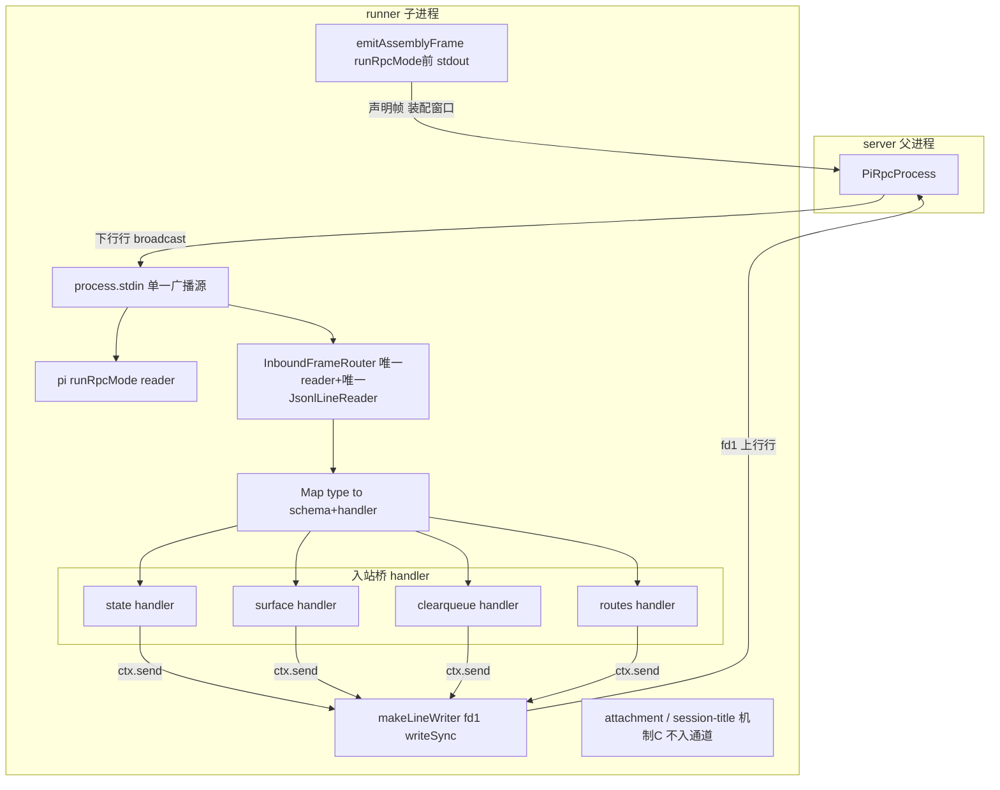
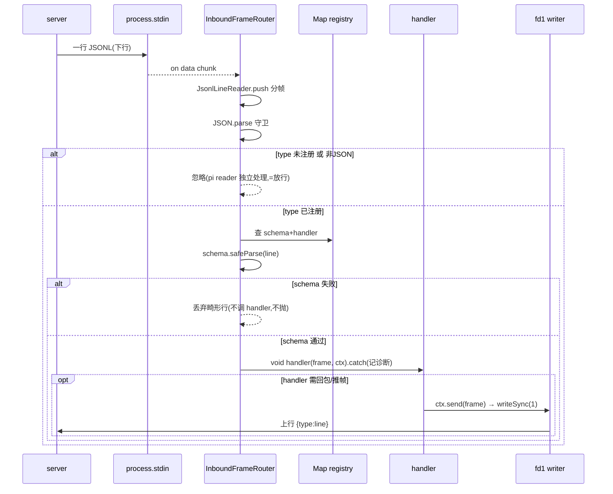
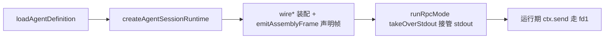

# Design Document — runner-frame-channel

## Overview

**Purpose**: 把 `packages/server/src/runner` 下四个逐字重复的入站桥收敛为**一条按 `frame.type` 分发的父子 IPC 帧通道 + 一张类型注册表**,抽取共享原语,并把两条既有隐性约束(上行只走 fd1、声明帧在接管前发)固化为 API 结构上可强制的不变式。

**Users**: pi-web runner 维护者(新增父子消息类型只需注册一个 handler);pi-web 用户与 agent 作者(state/surface/clear-queue/routes 四能力行为逐字不变);运维者(本地与 ACS sandbox 云链路行为等价)。

**Impact**: 将「四根各自持有 stdin reader 的平行线」改为「一条共享 reader 的多路复用通道」;同一行 stdin 由解析四遍降为一遍;`runner.ts` 收尾五段雷同 try/catch 归一为一次 `disposeAll`。**纯行为保持(zero behavior change)**:不改任何线协议帧格式、字段、错误码。

### Goals

- 单一入站帧通道:唯一 `stdin` reader + 唯一 `JsonlLineReader` + `Map<type, {schema, handler}>`。
- 共享原语单一权威:流接口、上行 writer、装配期发帧、批量释放、seam key 各一处。
- 结构性不变式:handler 上下文只暴露经统一 fd1 writer 的 `send`,无从触碰 `process.stdout`。
- 四桥迁移后帧行为逐字保持;既有测试 + 新增原语单测 + e2e 全绿。

### Non-Goals

- 不改 pi-clouds(cloud-bridge / agent-runner / sandbox)、不改 pi 上游。
- 不改任何线协议帧的格式/字段/错误码(帧 schema 冻结)。
- 不重写、不并入 `attachment-wiring`(tool hook 组合)与 `session-title-wiring`(prototype patch)。
- 不改各桥面向 UI 的语义。

## Boundary Commitments

### This Spec Owns

- 新增共享原语模块 `packages/server/src/runner/frame-channel/`(帧通道、上行 writer、装配期发帧、批量释放、流接口视图、seam key 常量)。
- 四个入站桥(`state` / `surface` / `clear-queue` / `agent-routes`)改写为「注册到帧通道 + 业务 handler」形态。
- `runner.ts` 装配序与收尾对这些接线的编排调整。

### Out of Boundary

- pi-clouds 仓一切代码(仅依赖其现有行无关转发契约,不修改)。
- pi SDK 的 `runRpcMode` / `takeOverStdout` 行为。
- `attachment-wiring` / `session-title-wiring` 内部逻辑。
- `@blksails/pi-web-protocol` 的既有帧 schema(只消费,不改字段)。

### Allowed Dependencies

- `packages/server/src/rpc-channel/jsonl-reader.ts`(复用 `JsonlLineReader`)。
- `@blksails/pi-web-protocol` 既有 schema(`StateSetLineSchema` / `UiRpcRequestSchema` / `SurfaceCommandPayloadSchema` / `ClearQueueLineSchema` / `AgentRouteRequestFrameSchema` 及相关帧类型)。
- `packages/server/src/state/session-state-store.ts`(state 桥依赖,不变)。
- `node:fs` 的 `writeSync`(fd1 直写)。

### Revalidation Triggers

- 帧通道的 `register` / `send` / handler `ctx` 契约变化 → 依赖它的四桥须复查。
- 若未来把机制 C 或 host 命令并入帧通道 → 需重新界定边界。
- 若 pi-clouds 的 `agent-runner` 改为按 type 过滤 stdout 转发 → 本设计的云等价前提失效,须复查。

## Architecture

### Existing Architecture Analysis

当前 `runner.ts` 顺序装配:`attachment → session-title → state → surface → clear-queue → agent-routes → slash`,各 `wire*` 独立在 `process.stdin` 上 `on("data")`(4 个入站桥各挂一个,加 pi 的 `runRpcMode` 一个 = 5 个 data 监听器,广播/不独占),各自 `writeSync(1)` 上行。收尾 5 段雷同 try/catch。保留的正确设计:能力对象 `{installed|available, cleanup}`、优雅降级(记诊断不抛)、fd1 直写、声明帧前置。

### Architecture Pattern & Boundary Map

选定模式:**单一多路复用通道 + 类型注册表(demux + registry)**。中间层 cloud-bridge / agent-runner 是行无关字节泵,故通道必须保持纯 JSONL、每帧自包含。



**Key Decisions**:
- **单 reader**:通道对 `process.stdin` 只挂一个 `on("data")`,内部唯一 `JsonlLineReader` 解析一遍,按 `parsed.type` 查注册表分发。pi 的 reader 不受影响(独立广播监听器)。
- **放行=什么都不做**:stdin 是广播,pi reader 与通道 reader 各自独立收到每一行;通道对未注册 type / schema 失败的行「不消费不回包」即等于放行(pi 已独立收到),无需转发。
- **上行单出口**:handler `ctx` 只给 `send(frame)`(内部 `makeLineWriter` → fd1),结构上无 `process.stdout` 出口 → 云上不会误路由到 log 通道。
- **两个写窗口**:运行期上行 = fd1(`send`);装配期声明帧 = `process.stdout`(`emitAssemblyFrame`,`takeOverStdout` 之前)。二者不混用。

### Dependency Direction

`seam-keys / stream-views(types)` → `line-writer` → `frame-router` → `wire*` 各桥 → `runner.ts`。各层只向左依赖,严禁反向。机制 C 两桥与帧通道无依赖关系。

### Technology Stack

| Layer | Choice / Version | Role in Feature | Notes |
|-------|------------------|-----------------|-------|
| Backend / Runtime | Node.js (TypeScript, jiti 装载) | runner 子进程接线 | 复用现有栈,无新依赖 |
| Messaging / Events | 自建 JSONL 行协议 + `JsonlLineReader` | 父子 IPC 帧解复用 | 帧 schema 来自 `@blksails/pi-web-protocol`,冻结 |
| Data / Storage | `SessionStateStore`(既有) | state 桥权威 KV | 不变 |

## File Structure Plan

### Directory Structure

```
packages/server/src/runner/
├── frame-channel/                 # 新增:共享原语单一权威
│   ├── index.ts                   # 桶导出
│   ├── stream-views.ts            # ReadableLike/WritableLike/DataListener 单一声明
│   ├── seam-keys.ts               # 三个 globalThis seam key 常量集中
│   ├── line-writer.ts             # makeLineWriter(injected?) → fd1 直写 vs 注入
│   ├── frame-router.ts            # createInboundFrameRouter(唯一reader+注册表+send)
│   ├── assembly-frame.ts          # emitAssemblyFrame(frame, write?) 装配期声明帧
│   └── dispose.ts                 # disposeAll(wirings, log?) 统一释放
```

### Modified Files

- `state-wiring.ts` — 删本地流接口/reader/writer 骨架;改为 `channel.register(["piweb_state_set","piweb_state_delete"], StateSetLineSchema, handler)` + `store.subscribe(c => channel.send(stateFrame(c)))`;seam key 从 `seam-keys.ts` 引;保留 `{store, installed, cleanup}`。
- `surface-wiring.ts` — 改为 `channel.register("ui_rpc", uiRpcOuterSchema, handler)`,handler 内保留二段匹配(`point/action` + `SurfaceCommandPayloadSchema`)、非 surface 命令不回包(=放行);seam key 集中引用;保留 `{installed, cleanup}`。
- `clear-queue-wiring.ts` — 改为 `channel.register("piweb_clear_queue", ClearQueueLineSchema, handler)`,handler 内 `runtime.session.clearQueue()` + `ctx.send(result)`;保留 `{installed, cleanup}`。
- `agent-routes-wiring.ts` — 空 routes 保持零帧零注册;非空则 `emitAssemblyFrame(agentRoutesFrame)` + `channel.register("piweb_agent_route_request", AgentRouteRequestFrameSchema, handler)`;保留 `{installed, cleanup}`。
- `slash-completions-wiring.ts` — `emitSlashCompletions` 内部改用 `emitAssemblyFrame`(行为不变)。
- `runner.ts` — 创建单一 `channel`;各 `wire*` 传入 `channel`;收尾用 `disposeAll([attachmentWiring, stateWiring, surfaceWiring, clearQueueWiring, agentRoutesWiring, channel], bootLog)`。
- `index.ts` — 补 `frame-channel` 桶导出(如需)。
- 各桥既有单元测试 — 适配新构造签名(注入 fake channel 或复用真实 channel + 注入 stdin/stdout),断言帧行为不变。

## System Flows

### 入站帧分发(运行期)



关键:`void handler(...).catch(...)` 使 handler 永不抛到通道主流程(Requirement 6.4);surface handler 判定非 surface 命令时直接 `return`(不 `ctx.send`)= 放行。

### 装配期声明帧时序



声明帧(slash / routes-decl)必须在 C 阶段(D 之前)经 `process.stdout` 发出;此后一切上行走 fd1。

## Requirements Traceability

| Requirement | Summary | Components | Interfaces | Flows |
|-------------|---------|------------|------------|-------|
| 1.1–1.5 | 单一通道+注册表+放行+畸形丢弃+可注入 | InboundFrameRouter | `register` / `FrameChannel` | 入站分发 |
| 2.1–2.5 | 上行走 fd1、单出口、原子写、可注入 | makeLineWriter, FrameChannel.send, HandlerCtx | `makeLineWriter` / `HandlerCtx.send` | 入站分发 |
| 3.1–3.4 | 装配期声明帧时序与通道 | emitAssemblyFrame | `emitAssemblyFrame` | 声明帧时序 |
| 4.1–4.6 | 四桥行为逐字保持 | state/surface/clearqueue/routes wiring | 各 handler | 入站分发 |
| 5.1–5.3 | 机制 C 不并入 | (排除项) | — | — |
| 6.1–6.4 | 能力对象+幂等 cleanup+统一释放+降级 | disposeAll, 各 wiring | `disposeAll` / `Wiring` | — |
| 7.1–7.4 | 原语单一权威+集中 seam+单测+复用 reader | frame-channel/* | 全部 | — |
| 8.1–8.4 | 本地/云等价 | FrameChannel(纯JSONL/自包含) | `send`(fd1) | 入站分发 |
| 9.1–9.4 | 零行为变更+全绿 | (验收) | — | — |

## Components and Interfaces

| Component | Layer | Intent | Req | Key Deps | Contracts |
|-----------|-------|--------|-----|----------|-----------|
| stream-views | types | 流最小视图单一声明 | 7.1 | — | State |
| seam-keys | types | seam key 常量集中 | 7.2 | — | State |
| makeLineWriter | infra | fd1 直写 vs 注入 | 2.1,2.4,2.5 | node:fs | Service |
| InboundFrameRouter | infra | 单 reader 多路复用 + send | 1,2,6,8 | JsonlLineReader | Service, State |
| emitAssemblyFrame | infra | 装配期声明帧 | 3 | — | Service |
| disposeAll | infra | 统一释放吞错 | 6.3 | — | Service |
| state/surface/clearqueue/routes wiring | wiring | 注册 handler + 业务 | 4 | InboundFrameRouter | Service |

### Infra

#### makeLineWriter

**Responsibilities & Constraints**: 产生一个「写一行」函数;默认 `fs.writeSync(1, s)` 直写原始 fd1(绕 `takeOverStdout`),单次原子写;注入 `WritableLike` 时改写注入出口(测试接缝)。不含换行拼接策略以外的逻辑。

```typescript
function makeLineWriter(injected?: WritableLike): (line: string) => void;
```
- Preconditions: `line` 已含结尾 `\n`(调用方负责)或由 writer 统一补——本设计由**调用方传完整行含 `\n`**,writer 原样单次写。
- Postconditions: 注入存在→写注入;否则 `writeSync(1, line)`。
- Invariants: 单次系统调用,不缓冲、不拆分。

#### InboundFrameRouter(FrameChannel)

**Responsibilities & Constraints**: 对 `stdin` 只挂一个 data reader、只维护一个 `JsonlLineReader`;按 `parsed.type` 查注册表;schema 通过则派发 handler;未注册/非 JSON/schema 失败均不消费不回包(=放行/丢弃);持有一个 `makeLineWriter` 供 `send` 与 handler `ctx.send` 共用。install 失败 → `installed:false` 且不抛。

**Contracts**: Service / State

```typescript
interface HandlerCtx {
  /** 经统一 fd1 writer 写出一帧(自动 JSON.stringify + "\n")。唯一上行出口。 */
  send(frame: unknown): void;
  /** 当前会话 id(诊断维度)。 */
  readonly sessionId: string;
}

type FrameHandler<T> = (frame: T, ctx: HandlerCtx) => void | Promise<void>;

interface FrameChannel {
  /** 注册一个/多个 frame type;返回幂等解绑句柄。 */
  register<T>(
    types: string | readonly string[],
    schema: { safeParse(v: unknown): { success: true; data: T } | { success: false } },
    handler: FrameHandler<T>,
  ): () => void;
  /** 主动写一帧(用于 state 出站订阅下行帧)。经同一 fd1 writer。 */
  send(frame: unknown): void;
  /** stdin reader 是否挂上。 */
  readonly installed: boolean;
  /** 卸载 stdin reader + 清空注册表(幂等)。 */
  cleanup(): void;
}

interface CreateFrameChannelInput {
  readonly sessionId: string;
  readonly stdin?: ReadableLike;   // 默认 process.stdin
  readonly stdout?: WritableLike;  // 默认 fd1 writeSync
  readonly stderr?: WritableLike;  // 默认 process.stderr(诊断)
}

function createInboundFrameRouter(input: CreateFrameChannelInput): FrameChannel;
```
- Preconditions: 在 `runRpcMode` 之前创建并完成所有 `register`。
- Postconditions: 匹配 type + schema 通过 → `void handler(frame, ctx).catch(记诊断)`。
- Invariants: 单 reader / 单 JsonlLineReader;handler 抛错不外泄;`send` 与 `ctx.send` 同一 writer。

**Implementation Notes**
- Integration: `runner.ts` 创建唯一实例,注入到四桥。
- Validation: schema 用各桥既有 zod（surface 用宽松外层 `{type:"ui_rpc", request:unknown}`,内层由 handler 二次 `safeParse`,保持现有二段匹配语义)。
- Risks: 见 research R1/R2;以「非 surface 命令 return 不回包」保放行语义。

#### emitAssemblyFrame

```typescript
function emitAssemblyFrame(frame: unknown, write?: (line: string) => void): void;
```
- 默认 `process.stdout.write(JSON.stringify(frame)+"\n")`;注入用于单测。**仅**在 `runRpcMode` 前调用。空内容由调用方判定(不发)。

#### disposeAll

```typescript
interface Disposable { cleanup(): void | Promise<void>; }
function disposeAll(
  wirings: readonly (Disposable | null | undefined)[],
  log?: { write(s: string): unknown },
): void;
```
- 遍历 `cleanup()`;单个抛错 → `log.write` 记诊断并继续;`Promise` 型 cleanup 以 `void p.catch(...)` 收敛。永不抛。

### Wiring(迁移后签名)

```typescript
function wireStateBridge(channel: FrameChannel, input: WireStateBridgeInput): StateBridgeWiring;      // 保留 {store, installed, cleanup}
function wireSurfaceBridge(channel: FrameChannel, input: WireSurfaceBridgeInput): SurfaceBridgeWiring; // {installed, cleanup}
function wireClearQueueBridge(channel: FrameChannel, runtime: AgentSessionRuntime, input: WireClearQueueBridgeInput): ClearQueueBridgeWiring;
function wireAgentRoutesBridge(channel: FrameChannel, input: WireAgentRoutesBridgeInput): AgentRoutesBridgeWiring; // 空 routes → installed:false 零注册
```
各 `cleanup` 调用 `register` 返回的解绑句柄(+ state 额外 unsubscribe/清 seam)。幂等。

## Error Handling

### Error Strategy

全链路优雅降级:通道 install 失败 → `installed:false`,`register` 仍登记但永不触发,会话照常启动;handler 抛错 → 通道 `catch` 记诊断不外泄;`send`/writer 抛错 → 记诊断不外泄;`disposeAll` 单点失败 → 记诊断继续。均不崩会话(Requirement 6.4)。

### Error Categories and Responses

- **畸形入站行**(type 匹配 schema 失败 / 非 JSON):丢弃或忽略,不回包不抛(1.4)。
- **业务错误**(surface 未注册 domain / route 未注册 / clearQueue 抛错 / handler 抛错 / 返回值不可序列化):由各 handler 归一化为既有错误码帧(`surface_not_registered` / `route_not_registered` / `handler_error` / 空 clearQueue 结果),经 `ctx.send` 回送——字段与错误码逐字保持(4.2–4.4)。
- **装配/运行期系统错误**:记诊断 + 能力降级。

### Monitoring

诊断统一走注入的 `stderr`(默认 `process.stderr`)+ runner `bootLog`;绝不写 fd1(那是 RPC 行通道)。

## Testing Strategy

### Unit Tests(新增原语,Requirement 7.3)

- `makeLineWriter`:注入出口捕获写出;默认路径以 mock `writeSync` 断言单次原子写 + 含 `\n`。
- `frame-router`:注册→匹配 type→schema 通过派发;未注册 type 放行(handler 不触发);schema 失败丢弃不抛;`ctx.send` 经注入 stdout 捕获;多次 `cleanup` 幂等;install 失败降级 `installed:false`;handler 抛错被 catch。
- `emitAssemblyFrame`:注入捕获;空内容不发。
- `disposeAll`:一个 cleanup 抛错仍释放其余 + 记诊断;支持 async cleanup。

### Integration / 迁移保持(Requirement 4,既有测试为主)

- state:`piweb_state_set`/`_delete` → store 改动 + 下行 `piweb_state`(键/值/rev/deleted 不变);seam provider 读写。
- surface:合法 surface `ui_rpc` → 按 domain 派发 + `ui_rpc_response`;未注册 domain → `surface_not_registered`;非 surface `ui_rpc`(host 命令 name)→ 不回包放行。
- clear-queue:`piweb_clear_queue` → `clearQueue()` + `piweb_clear_queue_result`;`clearQueue` 抛错 → 空结果。
- agent-routes:空 routes → 零帧零注册;非空 → 装配期 `agent_routes` 声明帧 + 请求派发 + `route_not_registered`/`handler_error`/不可序列化归一化。
- 复用既有四桥测试文件,仅适配构造签名(注入 channel + fake stdin/stdout)。

### E2E(Requirement 9.2)

- 浏览器 e2e:state 双向共享态、surface 命令、message-queue 取回、agent 声明式路由四条关键路径全绿(隔离 build:`NEXT_DIST_DIR=.next-e2e` 等既有约定)。
- node e2e:真实子进程 runner 装配 + fd1 直写路径(`attachment-child-store-from-spawn-env` 同族的真实子进程验证接缝)确认上行帧经 fd1 抵达。
- 排除与本 spec 无关的既有已知失败(见 memory:e2e:node 的 config-domains/webext-build-load)。

## Open Questions / Risks

- **R1(surface 二段匹配)**:以「宽松外层 schema + handler 内层再 safeParse + 非命令 return 放行」保语义,已在 Component 固化。
- **R3(逐字保持)**:双门控(既有桥测试 + 新原语单测 + e2e);实现中以 `git diff` 逐帧比对帧构造代码。
