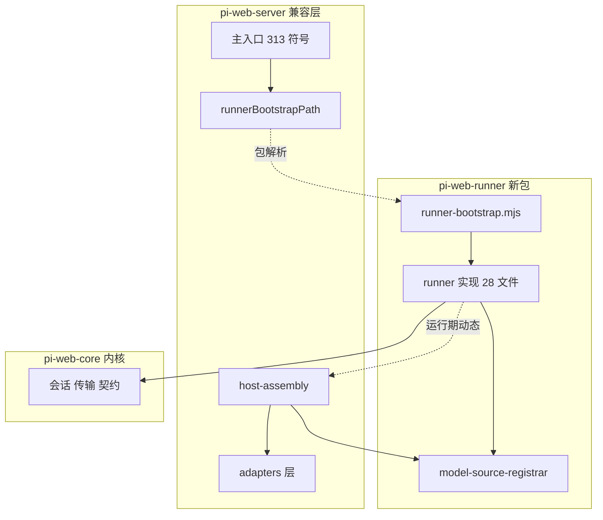
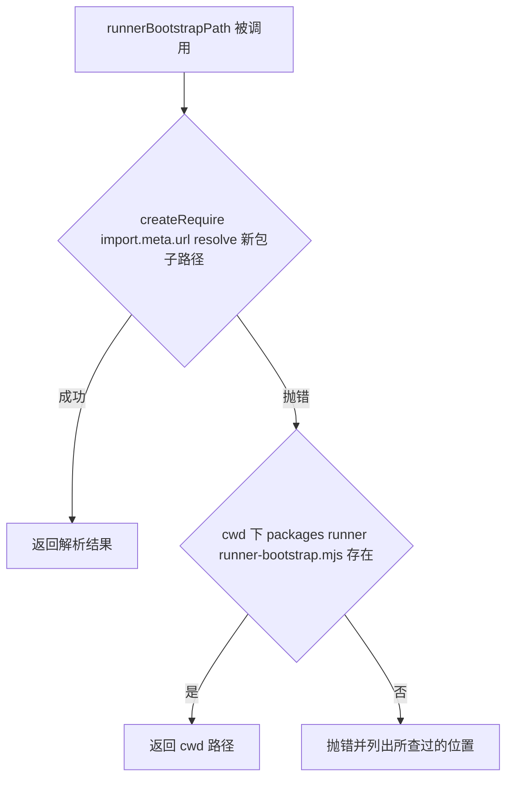
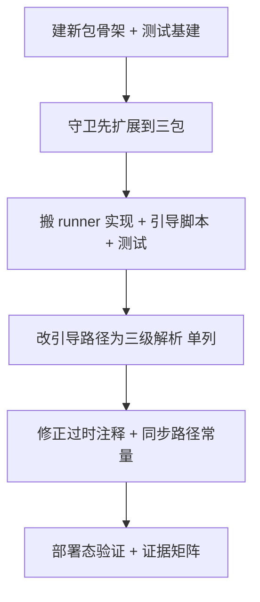

# Design Document: runner-package-extraction

## Overview

**Purpose**：给 runner 一个真实的包边界 `@blksails/pi-web-runner`，使「只想跑 agent runner 的宿主」
（e2b 沙箱、pi-cloud 云端、未来的 edge）不再连带装下云沙箱 SDK 与数据库驱动。

**Users**：沙箱镜像与云端宿主的实现者、部署与运维方；间接受益者是所有使用内置扩展的终端用户。

**Impact**：`packages/server` 的 `src/runner/`（28 文件 / 3807 行）与根部的
`runner-bootstrap.mjs` 迁入新包；`@blksails/pi-web-server` 降级为**兼容层**，
对外契约（313 个主入口符号 + 6 条子路径导出）逐字不变。

★ 本特性的最高风险**不是搬文件，而是路径解析**。开发态下引导路径的主路径与回退路径
恒等命中，任何一条断了都观察不到；而生产形态真正生效的恰恰是那条不做存在性检查的回退。
上一个 spec 刚被同一机制骗过一轮。因此本设计把「解析机制」当作头号组件来对待，
而不是搬迁的附属品。

### Goals

- 新包依赖面窄到可机械断言：**不含** `e2b` / `pg` / `ws` / MCP SDK（1.1–1.5）
- 兼容层对外契约逐字不变，既有消费方零改动（2.1–2.5）
- 引导路径在 dev / dist / standalone 三形态下均有**部署态**证据，desktop 与 e2b 显式列为已知未验（3.1–3.6）
- 内置扩展在新解析根下实际装载成功（4.1–4.3）
- 三个包的边界守卫全覆盖，空扫即失败（5.1–5.5）
- 通过面不回退，且以实测输出而非"全绿"结论交付（6.1–6.5）

### Non-Goals

- runner 的功能性改写、性能优化、命名整理（**只搬不改**；唯一例外见「D1 三级解析」，已单列）
- adapters 搬迁（并行 spec `adapters-package-extraction`）
- 帧通道协议与内置扩展自解析**机制**本身的改动
- agent 运行时 SDK 的版本变更
- 81 个写死旧路径的文档同步（另开一轮）
- 跨仓 `pi-clouds` 的 Dockerfile 改动（只登记，不改）

---

## Boundary Commitments

### This Spec Owns

- `@blksails/pi-web-runner` 包的成立：清单、依赖声明、导出面、tsconfig、测试基建
- runner 实现（28 文件）与引导脚本 `runner-bootstrap.mjs` 的物理归属
- **引导路径的解析机制**（`runnerBootstrapPath()` 的三级解析与失败语义）
- `model-source-registrar` 的归属与跨包注册方向
- 兼容层 `@blksails/pi-web-server` 的对外契约保持
- 三包边界守卫的覆盖面
- 本仓内因搬迁而失效的**全部路径常量**

### Out of Boundary

- runner 内部任何行为改动（含内置扩展"解析不到则降级"的语义 —— 见 C4）
- adapters 层（`auth` / `ai-gateway` / `sandbox` / …）的归属
- `packages/server` 依赖里 `e2b` / `pg` / `ws` / MCP SDK 的清理 —— 那些属 adapters，本轮不动
- 跨仓 `../pi-clouds/demo/cloud-e2e/Dockerfile.pi` 的 `npm i -g` 包名
- 文档同步

### Allowed Dependencies

依赖方向（层序，`module-roster.ts:32-38`）：

```
neutral(0) ← core(1) ← { runner(2), adapters(2) } ← assembly(3)
```

- 新包**可以**依赖：`@blksails/pi-web-core`、`-protocol`、`-logger`、`-tool-kit`、`jiti`、
  agent 运行时 SDK（peer）
- 新包**不得**依赖：`packages/server`（反向）、adapters 层任何模块（同序互斥）、
  `FORBIDDEN_PACKAGE_DEPS` 七项
- 兼容层**可以**依赖新包（`assembly → runner`，正向）
- 唯一豁免边：`runner → host-assembly`，**仅限动态 import**，已登记于
  `module-roster.ts:126-131`，本 spec 沿用不扩大

### Revalidation Triggers

| 触发条件 | 谁需要重新验证 |
|---|---|
| 引导脚本包名 / 子路径导出名变化 | `bake-plan.ts` 常量、跨仓 `Dockerfile.pi`、`cli-smoke.mjs` 产物清单 |
| `packages/server` 主入口符号集合变化 | `main-entry-symbols.txt` 基准、所有既有消费方 |
| 新包 `exports` 键增删 | dist 树包解析、`exportsMapOf` 驱动的守卫 |
| runner 新增运行时依赖 | 沙箱镜像的安装树（内置扩展可解析性） |
| 层序或 `PACKAGE_ROOTS` 变化 | 三组守卫全体 |

---

## Architecture

### Existing Architecture Analysis

- **源码直连分发**：所有工作区包的 `exports` 直接指向 `./src/*.ts`，**无构建步骤**。
  消费方的 `tsc` 会编译被引用包的每个 `.ts` —— 这条约束决定了 peer 依赖的类型必须可解析。
- **通配子路径导出**：`packages/core/package.json` 的 `"./*.js": "./src/*.ts"`。
  实测在 dist 树里也能被 Node 原生展开。新包沿用同一形态。
- **运行边界与物理边界本就重合**：runner 跑在子进程，由 cwd-无关的引导脚本经 jiti 加载；
  `packages/server/src/index.ts:3-8` 明确不从主入口 re-export runner。实测该断言仍成立：
  **非测试入向依赖仅 1 处**（`host-assembly/model-sources.ts` → `runner/model-source-registrar.js`）。
- **静态上行边为 0**：`core-package-extraction` 的副产品 —— runner 的出向依赖已全部是包级 specifier。

### Architecture Pattern & Boundary Map



**关键决策**：

- `runnerBootstrapPath()` **留在兼容层**（层归属 `assembly`，`module-roster.ts:89`，
  且在 313 基准内）。它与引导脚本的联系从「同包相对布局」改为「**包解析**」——
  这正是解除三难的那一刀：约束②「必须同包」原本是**推算机制**强加的，
  换成解析机制后它自动消失。
- `PathResolver → Bootstrap` 画成虚线：那是**解析**关系，不是 import。兼容层
  **绝不** import 新包的实现，否则会把 runner 与整套 agent SDK 拉进服务端 bundle
  （`index.ts:3-8` 正是为此排除 runner）。

### Technology Stack

| Layer | Choice / Version | Role in Feature | Notes |
|---|---|---|---|
| Runtime | Node ≥ 22.19.0 | 包解析（`createRequire`）、子进程 | 与既有 `engines` 一致 |
| Module loader | jiti ^2.7.0 | 引导脚本经其加载 TS runner | 新包运行时依赖 |
| Agent SDK | `@earendil-works/pi-coding-agent` ^0.80.3 | runner 的 8 处值导入 | **peer，非可选** |
| Bundler | esbuild（`scripts/build-server.mjs`） | 兼容层单文件产物 | ★ 实测**不内联** `import.meta.url` |
| Packaging | `scripts/pack-dist.mjs` | 自动遍历 `packages/` + 建符号链接 | **无需为新包改动** |
| Test | vitest ^2.1.8 | 四档分级 | 新包需自带 `vitest.config.ts`（否则静默继承根配置） |

---

## File Structure Plan

### 新建

```
packages/runner/
├── package.json                  # 依赖面 + 通配导出 + ./runner-bootstrap.mjs 子路径导出
├── tsconfig.json                 # rootDir ".."（跨包引 core 的 .ts，否则 TS6059）
├── vitest.config.ts              # ★ 必须存在,否则静默继承仓库根配置 → No test files found
├── vitest.workspace.ts           # 四档划分 + fast 档 child_process 抛错守卫别名
├── scripts/run-tests.mjs         # 分档编排(core 副本;fast 档故意不给 --passWithNoTests)
├── runner-bootstrap.mjs          # 由 packages/server/ 根部迁入
├── src/runner/                   # 28 文件整体迁入,目录名保持 runner/
│   ├── runner.ts … frame-channel/…
│   └── model-source-registrar.ts # 随 runner 模块整体走
└── test/
    ├── runner/                   # 由 packages/server/test/runner/ 迁入(39 文件)
    └── integration/              # 真实 spawn 的 *-subprocess.it.test.ts
```

### 修改

| 文件 | 改什么 | 需求 |
|---|---|---|
| `packages/server/src/runner-bootstrap-path.ts` | 改为三级解析；**修正过时注释**（`import.meta.url` 实测未被内联） | 3.1–3.5 |
| `packages/server/package.json` | 加 `@blksails/pi-web-runner` 依赖；`files` 去掉 `runner-bootstrap.mjs` | 2.5 |
| `packages/server/src/host-assembly/model-sources.ts` | 导入路径 `../runner/model-source-registrar.js` → 包级 specifier | 2.1 |
| `packages/server/src/sandbox-image/bake-plan.ts:179` | 常量包名 `pi-web-server` → `pi-web-runner` | 3.6 |
| `scripts/build-server.mjs` | **修正过时注释**；确认 `ALIAS` 表**不加**新包（走通配导出，同 core） | 6.4 |
| `vitest.config.ts`（根） | 加新包 5 条 alias，`.js→.ts` 正则条目**必须排在具名子路径之前** | 6.4 |
| `e2e/cli/cli-smoke.mjs:57` | 产物完整性清单路径 → `packages/runner/runner-bootstrap.mjs` | 3.4 |
| `package.json`（根） | `test:fast` / `test:e2e` 加 `--filter @blksails/pi-web-runner` | 5.2, 6.1 |
| `packages/core/test/tiering/package-roots.ts` | `PACKAGE_ROOTS` 加第三项 | 5.1–5.3 |
| `packages/core/test/tiering/module-roster.test.ts` | 层⟹物理断言改为映射表驱动，覆盖三包 | 5.5 |
| `packages/core/test/tiering/dependency-guard.test.ts` | `WILDCARD_ROOTS` 纳入新包 | 5.1, 5.4 |
| `packages/core/test/tiering/package-deps.test.ts` | 对新包执行同一套禁用/peer-only 审计 | 1.4 |

**不需改动**（已实测）：`scripts/pack-dist.mjs`（自动遍历）、`vite.config.ts`、
`vitest.node-e2e.config.ts`、`tsconfig.base.json`、`pnpm-workspace.yaml`。

---

## System Flows

### 引导路径三级解析（本 spec 的核心机制）



**决策要点**：

- 第①级与 `process.cwd()` **无关**，覆盖 dev / dist / standalone / desktop 四形态。
  实测依据：真实 dist 树里 `createRequire(<dist/server.mjs>).resolve("@blksails/pi-web-core/trust")`
  成功解析到 `dist/packages/core/src/trust/index.ts`，通配深路径同样成立。
- 第②级保住"产物以产物根为 cwd 启动"的既有形态，**并补上现状缺失的 `existsSync`**。
- 第③级把失败从 spawn 时的 ENOENT 提前到解析时（3.3）。**这是唯一的逻辑变更，单列成任务。**
- e2b 烘焙态**不走本函数**（路径由 `bake-plan.ts` 常量烘进 `AGENT_CMD`），故该常量必须同步改。

---

## Requirements Traceability

| Requirement | Summary | Components | Interfaces | Flows |
|---|---|---|---|---|
| 1.1 | 新包含 runner 全部模块与引导脚本 | C1 新包骨架 | `exports` 声明 | — |
| 1.2 | 依赖声明不含四类被禁依赖 | C1 | `package.json.dependencies` | — |
| 1.3 | agent SDK 列为 peer | C1 | `peerDependencies` | — |
| 1.4 | 被禁依赖出现即测试失败并指出名与字段 | C5 守卫扩展 | `auditPackageDeps()` | — |
| 1.5 | 无需预构建即可被本仓消费 | C1 | 源码直连 `exports` | — |
| 2.1 | 主入口导出符号集合逐字相同 | C2 兼容层 | `main-entry-symbols.txt` | — |
| 2.2 | 保留全部 6 条子路径导出 | C2 | `package.json.exports` | — |
| 2.3 | 名含 runner 但实现不属 runner 者不搬 | C2 | 搬迁清单判据 | — |
| 2.4 | 原不从主入口导出者保持缺口 | C2 | 主入口不并入 `runner/index.ts` | — |
| 2.5 | 消费方导入路径与启动命令无需改动 | C2, C3 | `runnerBootstrapPath()` 签名不变 | 三级解析 |
| 3.1 | 三形态均返回真实存在的脚本 | C3 路径解析 | 三级解析 | 三级解析 |
| 3.2 | 脚本随 runner 迁移后兼容层仍返回可用路径 | C3 | 包解析 | 三级解析 |
| 3.3 | 解析不到即失败并指出所查位置 | C3 | 第③级抛错 | 三级解析 |
| 3.4 | 产物被移动后仍成立，由换机 e2e 覆盖 | C3, C6 验证 | `pnpm e2e:cli:reloc` | 三级解析 |
| 3.5 | 不把 dev 与单测的通过当作证据 | C6 | 验收判据 | — |
| 3.6 | desktop 与 e2b 显式列为已知未验并写明风险 | C6 | 交付报告 | — |
| 4.1 | 内置扩展在新解析根下全部可解析装载 | C4 内置扩展 | `resolveBuiltinExtensionEntries()` | — |
| 4.2 | 解析不到产生可观测失败信号 | C4 | `log.warn`（既有，不改） | — |
| 4.3 | 以实际装载成功为判据 | C4, C6 | 装载断言 | — |
| 5.1 | 依赖方向守卫覆盖三包每个模块 | C5 | `PACKAGE_ROOTS` | — |
| 5.2 | 分档守卫覆盖三包每个测试文件 | C5 | `assertEveryRootContributed` | — |
| 5.3 | 守卫扫不到文件即失败 | C5 | 同上 | — |
| 5.4 | 新增跨包反向依赖即失败并指出源与目标 | C5 | `isReverseEdge` + `resolveWildcard` | — |
| 5.5 | 层⟹物理一致性断言覆盖新包 | C5 | 层→包映射表 | — |
| 6.1 | 通过面不低于快照且两次一致 | C6 | 实测输出 | — |
| 6.2 | 类型检查通过无新增错误 | C6 | 三包 + 根 `tsc --noEmit` | — |
| 6.3 | 真实 spawn 的测试保持在允许档位 | C6 | 文件名后缀逐字保留 | — |
| 6.4 | 全仓解析配置使新包可被源码方式解析 | C1, C5 | 根 `vitest.config.ts` alias | — |
| 6.5 | 交付提供实测运行输出而非"全绿"结论 | C6 | 证据矩阵 | — |

---

## Components and Interfaces

| Component | Domain/Layer | Intent | Req Coverage | Key Dependencies | Contracts |
|---|---|---|---|---|---|
| C1 新包骨架 | runner | 清单、依赖面、导出、测试基建 | 1.1–1.5, 6.4 | core/protocol/logger/tool-kit (P0), jiti (P0), agent SDK peer (P0) | State |
| C2 兼容层契约保持 | assembly | 313 符号 + 6 子路径不变 | 2.1–2.5 | 新包 (P0) | Service |
| C3 引导路径解析 | assembly | 三级解析与失败语义 | 2.5, 3.1–3.4 | Node 模块解析 (P0) | Service |
| C4 内置扩展可用性 | runner | 新解析根下实际装载 | 4.1–4.3 | tool-kit (P0) | Service |
| C5 守卫扩展 | 测试基建 | 三包全覆盖，空扫即失败 | 1.4, 5.1–5.5, 6.4 | `PACKAGE_ROOTS` (P0) | State |
| C6 验证与证据 | 验收 | 部署态证据，非"全绿"结论 | 3.4–3.6, 4.3, 6.1–6.5 | `e2e:cli:reloc` (P0) | Batch |

### runner 层

#### C1 · 新包骨架

| Field | Detail |
|---|---|
| Intent | 让 `@blksails/pi-web-runner` 成为一个依赖面可机械断言的包 |
| Requirements | 1.1, 1.2, 1.3, 1.4, 1.5, 6.4 |

**Responsibilities & Constraints**

- 依赖声明的**权威**：`dependencies` 仅 `@blksails/pi-web-{core,protocol,logger,tool-kit}` + `jiti`
- `@blksails/pi-web-tool-kit` 是 **P0 运行时依赖**，不是可选 —— 三个内置扩展经它解析（见 C4）
- agent SDK 走 `peerDependencies`，**不加** `peerDependenciesMeta.optional`：
  runner 缺它必然运行时失败，标"可选"是一句谎
- ⚠ SDK 放进 `devDependencies` 会**直接触发** `PEER_ONLY_DEPS` 守卫 —— 这是设计意图，不是障碍

**Contracts**: State ✔

```jsonc
{
  "name": "@blksails/pi-web-runner",
  "type": "module",
  "exports": {
    ".": "./src/runner/index.ts",
    "./runner-bootstrap.mjs": "./runner-bootstrap.mjs",  // ★ C3 的解析目标
    "./*.js": "./src/*.ts"                                // 通配，同 core
  },
  "files": ["src", "runner-bootstrap.mjs"]
}
```

- Preconditions：`packages/runner/package.json` 存在且 `name` 以 `@blksails/` 开头
  （`pack-dist.mjs:355` 据此建符号链接）
- Postconditions：`dist/node_modules/@blksails/pi-web-runner` 链接存在且可解析
- Invariants：`FORBIDDEN_PACKAGE_DEPS` 七项在 `dependencies` / `devDependencies` 中恒不出现

**Implementation Notes**

- Integration：`vitest.config.ts` / `vitest.workspace.ts` / `scripts/run-tests.mjs` / `tsconfig.json`
  以 `packages/core` 的同名文件为样板。`tsconfig.json` 的 `rootDir` 取 `".."`
  （同 `packages/server`：跨包引 core 的 `.ts` 会触发 TS6059）
- Validation：`pnpm --filter @blksails/pi-web-runner typecheck` 与 `test:fast` 各自成功
- Risks：**R-1** —— peer 且不在自身 `node_modules` 时类型能否解析，须实测；
  退路是加 `devDependencies` **并**在守卫里开一条带理由的显式豁免（不得靠改判据绕过）

#### C4 · 内置扩展可用性

| Field | Detail |
|---|---|
| Intent | 保证换解析根后三个内置扩展仍能实际装载 |
| Requirements | 4.1, 4.2, 4.3 |

**Responsibilities & Constraints**

- ★ **勘察修正**：`builtin-extensions.ts` 自身**不调用** `createJiti`。jiti 根建在
  `runner-bootstrap.mjs:33` 的 `createJiti(here)`；三个 entry-path 函数各用**自身**
  `import.meta.url` 推算。`here` 随引导脚本迁到新包，故解析根变为新包目录。
- 由此推出的唯一硬要求：`@blksails/pi-web-tool-kit` 必须是**新包**的运行时依赖。
- 降级语义**不改**：解析不到时 `log.warn(...)` 后 `continue`（`:82-87`）。
  4.2 要求"可观测的失败信号"—— 该 warn 已满足。把它升级为抛错会让某形态缺代码时
  从"能力不可用"变成"会话失败"，属**行为变更**，明确 Out of Boundary。

**Contracts**: Service ✔ — `resolveBuiltinExtensionEntries(specs?) => readonly string[]`（签名不变）

**Implementation Notes**

- Validation：4.3 要求以**实际装载成功**为判据。判据取「返回数组长度 === 3」
  而非「没有 warn」—— 后者与"三个都解析不到但日志没被读"无法区分

### assembly 层

#### C2 · 兼容层契约保持

| Field | Detail |
|---|---|
| Intent | 让这次拆包对既有消费方完全不可见 |
| Requirements | 2.1, 2.2, 2.3, 2.4, 2.5 |

**Responsibilities & Constraints**

- 主入口 313 符号逐字不变；6 条子路径导出一条不减
- **2.3 的具体命名陷阱**：`RUNNER_AI_GATEWAY_BASE_ENV` / `_KEY_ENV` / `_MODELS_ENV`
  名字带 `RUNNER_`，实现在 `ai-gateway/session-model-source.ts`（**adapters** 层）。
  按名字随包搬走 → 主入口少 3 符号，破 2.1。**命名不是归属判据，层归属才是。**
- **2.4 的缺口**：`runner/index.ts` 的符号原本就不在 313 里（主入口刻意不 re-export）。
  搬走不影响基准，但**不得"顺手补进"**主 barrel
- `model-source-registrar` 随 runner 走：`host-assembly(3) → runner(2)` 跨包后仍是正向

**Contracts**: Service ✔ — 主入口符号集合，以 `main-entry-symbols.txt` 为机械基准

#### C3 · 引导路径解析

| Field | Detail |
|---|---|
| Intent | 用包解析替代相对布局推算，解除三难 |
| Requirements | 2.5, 3.1, 3.2, 3.3, 3.4 |

**Responsibilities & Constraints**

- 保持在 `packages/server`（层归属 `assembly`，且在 313 内），**不随 runner 走**
- 导出签名不变：`runnerBootstrapPath(): string`（2.5）
- ★ **绝不 import 新包的实现** —— 只做**解析**。兼容层 import 新包会把 runner 与整套
  agent SDK 拉进服务端 bundle，正是 `index.ts:3-8` 要避免的

**Contracts**: Service ✔

```typescript
/** 解析引导脚本绝对路径；三级皆不成立时抛错并列出所查过的位置。 */
export function runnerBootstrapPath(): string;
```

- Preconditions：无（不依赖 `process.cwd()` 落在特定位置）
- Postconditions：返回值指向**真实存在**的文件，否则抛错（3.3）
- Invariants：dev 与生产形态走**同一条**第①级路径 —— 这消除了"dev 恒等命中掩盖断裂"的成因

**Implementation Notes**

- Integration：`lib/app/pi-handler.ts` 用 `dirname(runnerBootstrapPath())` 当 stub 子进程 cwd，
  **绝大多数 e2e 跑在 stub 模式下** —— 该 cwd 会从 `packages/server` 变为 `packages/runner`，
  须确认 stub 在新 cwd 下仍工作
- Validation：**dev 与单测的绿不构成证据**（3.5）。证据只认：
  ① `pnpm e2e:cli:reloc`（藏起构建目录复现换机）；② dist 树里的包解析实测
- Risks：第③级抛错是**逻辑变更**（现状无条件返回回退串），违"只搬不改"，**单列成任务**

### 测试基建

#### C5 · 守卫扩展

| Field | Detail |
|---|---|
| Intent | 三包全覆盖；扫不到文件必须响亮失败 |
| Requirements | 1.4, 5.1, 5.2, 5.3, 5.4, 5.5 |

**Responsibilities & Constraints**

- `PACKAGE_ROOTS` 加第三项 `{ name: "runner", dir: …, packageName: "@blksails/pi-web-runner" }`
- ★ **层⟹物理断言必须从「只查 core」推广**。现状硬编码 `roots.get("core")`
  （`module-roster.test.ts:147`），新包成立后该断言对 runner 层**恒真** ——
  那正是「没装上的守卫报出的绿」这一失效模式
- 改为**层 → 包根名映射表**驱动，双向断言对表内每项执行：
  `neutral|core → core`、`runner → runner`、`adapters|assembly → server`
- 防重言性质必须保住：判据两端仍是两个独立事实源（名册 = 人写的层声明；磁盘 = 实际归位）
- `WILDCARD_ROOTS` 纳入新包（它同样用通配导出）

**Contracts**: State ✔ — `PACKAGE_ROOTS`、层→包映射表

**Implementation Notes**

- Validation：★ **每条新守卫都必须以「故意弄坏它」来自证**。
  一个没装上的守卫报出的绿，和真的没有违规长得一模一样 —— 这在上游 spec 已被骗过两次

#### C6 · 验证与证据

| Field | Detail |
|---|---|
| Intent | 交付部署态证据，而非"全绿"结论 |
| Requirements | 3.4, 3.5, 3.6, 4.3, 6.1, 6.2, 6.3, 6.5 |

**Contracts**: Batch ✔

| 验证项 | 命令 | 判据 |
|---|---|---|
| 三包测试面 | `pnpm test:fast` + 各包 `pnpm test` | 文件数/用例数 ≥ 快照，**连跑两次一致**（6.1） |
| ★ 汇总行算术 | 同上 | `passed + skipped == total`，否则有 worker 静默崩溃 |
| 类型检查 | 三包 + 根 `tsc --noEmit` | exit 0（6.2） |
| 主入口基准 | `main-entry-symbols.it.test.ts` | 313 符号逐字相同（2.1） |
| 分档归位 | 各档文件数核对 | 14 个真实 spawn 的测试仍在允许档（6.3） |
| ★ 换机路径 | `pnpm build:dist && pnpm e2e:cli:reloc` | 通过（3.4） |
| ★ dist 包解析 | `createRequire(<dist/server.mjs>).resolve("@blksails/pi-web-runner/runner-bootstrap.mjs")` | 解析到真实文件（3.1） |
| 内置扩展 | 装载断言 | 返回 3 条入口（4.3） |
| 已知未验 | 交付报告 | desktop 与 e2b 显式列出 + 风险 + 触发条件（3.6） |

**Implementation Notes**

- Risks：**R-2** e2b 烘焙态在本仓测不到 —— `bake-plan.ts:179` 常量必须改，
  但真机要等跨仓 Dockerfile 改 + 基础镜像重烘焙。既有教训：**代码合 main + npm 已发 ≠ 真机可用**

---

## Error Handling

### Error Strategy

本特性只有一处新增失败面：引导路径解析。策略是 **Fail Fast** —— 把失败从
子进程 spawn 时的 ENOENT（错误现场离根因很远）提前到解析时。

| 场景 | 现状 | 改后 |
|---|---|---|
| 包解析失败 | —（无此级） | 降级到第②级 |
| cwd 回退不存在 | **无条件返回**，延后到 spawn 才 ENOENT | 抛错，消息含**所查过的全部位置** |
| 内置扩展解析不到 | `log.warn` + 跳过 | **不变**（Out of Boundary） |

### Monitoring

沿用既有 `@blksails/pi-web-logger`。不新增可观测面。

---

## Testing Strategy

### Unit Tests

1. `runnerBootstrapPath()` 第①级命中时返回包解析结果（不读 cwd）
2. 第①级失败、第②级文件存在 → 返回 cwd 路径
3. 三级皆不成立 → 抛错，且消息**包含所查过的两个位置**（3.3 的机械判据）
4. `resolveBuiltinExtensionEntries()` 返回 3 条入口（4.3）
5. 层⟹物理断言：故意把一个 runner 层模块的名册归属改成 `core` → 守卫必须报红（C5 自证）

### Integration Tests

1. `main-entry-symbols.it.test.ts` —— 313 符号逐字基准（2.1）
2. 跨包依赖方向：新包对 `packages/server` 的任何 import 都被判反向（5.4）
3. 新包 `package.json` 的禁用依赖审计，报出**具体依赖名与所在字段**（1.4）
4. 真实 spawn 子进程的 runner 启动（搬迁后仍在 `.it` 档）
5. `host-assembly/model-sources.ts` 经包级 specifier 注册模型源后 runner 可读到

### E2E Tests

1. ★ `pnpm e2e:cli:reloc` —— **唯一**能抓到换机路径断裂的验证（3.4）
2. `pnpm e2e:cli` —— 产物完整性清单含 `packages/runner/runner-bootstrap.mjs`
3. dist 树包解析实测（3.1 的部署态证据）

> ★ **本节的验收判据显式排除**：dev 态运行通过、单元测试全绿。
> 两条路径在 dev 下恒等命中，它们的绿对引导路径正确性**零信息量**（3.5）。

---

## Migration Strategy



**次序理由**：守卫（P2）必须**先于**搬迁（P3）扩展到三包 —— 否则搬错包的错误
在类型层完全可能通过（源码直连 + 跨包导入使它照样能编译、能跑测试），
要到消费方装包时才暴露。

**回滚触发**：`e2e:cli:reloc` 失败、313 符号基准漂移、任一包的守卫扫到 0 个文件。
