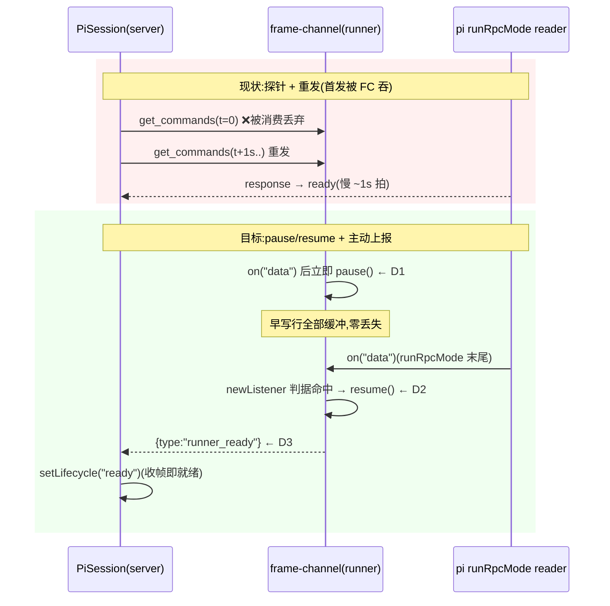

# Design Document — runner-ready-frame

## Overview

**Purpose**: 会话就绪判定由「服务端周期性探针」反转为「runner 主动上报」，同时修掉迫使探针必须重发的根因（runner 侧 stdin 早期行丢失）。交付后新会话在 runner 可服务后亚秒级到达 ready（现状含 ~1s 重发拍等待），服务端每会话三定时器机制体（`ReadinessProbe`，190 行）与探针超时配置链路整体删除。

**Users**: pi-web 所有用户（新会话就绪更快）；框架维护者（机制面收窄）；运维者（配置面收窄 + 版本错配可观测）。

**Impact**: 改造 `packages/core`（PiSession 就绪判定）、`packages/runner`（stdin 时序治理 + ready 帧发射）、`packages/protocol`（新帧 schema）、`lib/app`（配置链路 + stub agent）。生命周期状态机、`session-status` 帧契约、前端门控**零变化**。

### Goals
- runner 子进程 RPC 服务循环就绪前，父进程写入的行零丢失（根因修复）
- runner 可服务后主动发 `runner_ready` 帧，服务端收帧即 ready
- 删除 `ReadinessProbe` 与探针超时配置全链路
- 单一看门狗兜底就绪通告缺失（版本错配可观测）
- cli / stub / 沙箱传输形态的就绪判定不回归

### Non-Goals
- 不改 pi SDK；不改生命周期状态集合与迁移规则；不改 `session-status`/`session-state` 帧 schema；不改前端组件
- 不做 e2b 真沙箱实机验证（列已知未验）
- 不引入就绪之外的新帧语义（如进度上报）

## Boundary Commitments

### This Spec Owns
- runner 子进程 stdin 的流动时序治理（pause/resume 判据与兜底）
- `runner_ready` 帧的定义（protocol schema）、发射（runner）与消费（PiSession）
- PiSession 就绪判定机制的替换（探针 → 收帧 + 看门狗 + cli 单发）
- 探针机制及其配置链路的删除与所有调用点适配（含测试面）
- stub agent 的装配帧发射时机改造（去搭车化）

### Out of Boundary
- pi SDK 的读取器实现（`attachJsonlLineReader`）—— 只依赖其可观测行为（挂 `data` 监听器）
- 传输层（E2bTransport/SandboxWsTransport）的行转发逻辑 —— 复用既有上行通道，不改传输代码
- 生命周期帧的前端消费（`gateUntilReady`）—— 契约保持者，不是改造对象
- `exit-before-ready` / crash 路径 —— 保持既有行为，仅确保看门狗与其正确共存

### Allowed Dependencies
- `@blksails/pi-web-protocol`（新增帧 schema 的宿主）
- frame-channel 既有原语（`makeLineWriter` fd1 上行、`createInboundFrameRouter`）
- Node EventEmitter 标准语义（`newListener` 事件、显式 pause 粘性）—— 已实证（research I1/I2）
- `PiSession.handleRawLine` 帧注册表（既有扩展点）

### Revalidation Triggers
- pi SDK 升级改变 rpc 模式的 stdin 读取方式（不再挂 `data` 监听器）→ resume 判据须重验
- 新增传输后端 → ready 帧可达性须逐传输验证
- 沙箱基座镜像重烘焙 → 旧 runner 兜底路径（`ready-frame-missing`）实机验证窗口

## Architecture

### 现状（探针模式）与目标（上报模式）



### 就绪判定决策表（PiSession 构造期，readinessHandshake=true 时）

| 会话形态 | 判定来源 | 兜底 |
|---|---|---|
| custom（pi-web runner，含 e2b/沙箱跑 runner） | `runner_ready` 帧 | 看门狗 → `error{ready-frame-missing}`；exit → `error{exit-before-ready}` |
| cli（pi CLI 直跑，无 runner 装配层） | 单发 `getCommands()` 成功响应（无重发，见 research I6） | 同上 |
| stub（PI_WEB_STUB_AGENT，mode 可为两者任一） | stub 启动即主动发 `runner_ready` 帧（两态兼容） | 同上 |
| readinessHandshake=false | 恒 initializing，收帧 no-op（`setLifecycle` 既有守卫） | 无（legacy 不变） |

## Components and Interfaces

### C1 · protocol: `RunnerReadyFrameSchema`（新增）

```ts
// packages/protocol/src/transport/runner-ready.ts
export const RunnerReadyFrameSchema = z.object({
  type: z.literal("runner_ready"),
});
export type RunnerReadyFrame = z.infer<typeof RunnerReadyFrameSchema>;
```

最小单字段。与 `slash_completions`（transport/ 同目录）同族；barrel 从 `packages/protocol/src/index.ts` 导出。类型名不与既有帧冲突（已核 protocol 全量 literal）。

### C2 · runner: `stdin-resume-gate.ts`（新增，机制体）

```ts
// packages/runner/src/runner/stdin-resume-gate.ts
export interface StdinResumeGateDeps {
  readonly stdin: GateReadableLike;      // ReadableLike + pause/resume/listenerCount/on(newListener)
  readonly sendReady: () => void;         // frame-channel 统一 fd1 writer 发 runner_ready
  readonly stderr: WritableLike;          // 兜底路径诊断出口
  readonly fallbackMs?: number;           // 默认 10_000
}
export function installStdinResumeGate(deps: StdinResumeGateDeps): { dispose(): void };
```

行为契约：
1. 安装时记录 `baseline = stdin.listenerCount("data")`（此刻 frame-channel 与可能存在的 attachment-catalog 读取器已挂完）。
2. 监听 `newListener` 事件（过滤 `"data"`）；触发后 `setImmediate` 一拍核对 `listenerCount > baseline`（`newListener` 在监听器加入**之前**触发，Node 语义，research I2 已验），命中 → `resume()` + `sendReady()` + 自我清理。
3. 兜底：`fallbackMs` 超时仍未命中 → 强制 `resume()` + `sendReady()` + stderr 写一行诊断（Req 1.4：可诊断失败而非静默死锁）。兜底与主判据竞态收敛：先到者执行，后到者 no-op。
4. 两个句柄均 `unref`（不钉住进程）；`dispose()` 幂等。

### C3 · runner: frame-channel 与装配点（修改）

- `frame-router.ts`：`stdin.on("data", onData)` 成功后立即 `stdin.pause?.()`（D1，语义内聚：本通道不驱动流动）。cleanup 不负责 resume（gate 独占 resume 义务）。
- `stream-views.ts`：`ReadableLike` 增可选 `pause?()`/`resume?()`/`listenerCount?(event)`，另导出 `GateReadableLike`（gate 需要的完整视图）。可选链保证既有测试的假 stdin 零改动。
- `runner.ts`：`wireSessionBridges` 完成后、`return runRpcMode(runtime)` 之前 `installStdinResumeGate({...})`；`sendReady = () => frameChannel.send({ type: "runner_ready" })`。gate 的 dispose 并入 `runSessionCleanup` 的 `disposeAll` 列表。

### C4 · core: PiSession 就绪判定（修改）

- **删除**：`ReadinessProbe` import 与 `probe` 字段、`RESTART_PROBE_SETTLE_MS`、`DEFAULT_READINESS_PROBE_TIMEOUT_MS`。
- **新增**：`readyWatchdog: ReturnType<typeof setTimeout> | undefined`（单 timer，unref）：
  - 启动：构造期 `readinessHandshake` 为真时 `armReadyWatchdog()`；超时回调 → `setLifecycle("error", "ready-frame-missing", "runner did not announce readiness within <n>ms")`。
  - 取消：`setLifecycle` 到达 `ready` 或任何终态时；`cleanup()` 收尾统一清（Req 4.4）。
  - 重启：`restartRunner()` 与 `handleRunnerRestarted()` 复位 initializing 后**重新武装**看门狗，不再有 settle 定时器（Req 5.3/5.4）。
- **收帧**：`handleRawLine` 注册表 `add("runner_ready", { schema: RunnerReadyFrameSchema, handle: () => this.setLifecycle("ready") })`。重复/迟到帧由 `setLifecycle` 既有单向守卫消化（同态 no-op、终态拒绝，Req 2.4）；handshake off 时 `setLifecycle` 整体 no-op（Req 3.4）。
- **cli 单发**（D5）：构造期 `readinessHandshake && this.mode === "cli"` 时 `void this.channel.getCommands().then(() => this.setLifecycle("ready"), () => {/* 静默:交给 exit/看门狗 */})`。无重试、无专用定时器。
- 选项 rename：`readinessProbeTimeoutMs` → `readyTimeoutMs`（session.types.ts / session-manager.ts 同步）。

### C5 · app: 配置链路与 stub（修改）

- `lib/app/readiness-config.ts`：`readinessProbeTimeoutFromEnv` → `readyTimeoutFromEnv`，env `PI_WEB_READINESS_PROBE_TIMEOUT_MS` → `PI_WEB_READY_TIMEOUT_MS`（语义已变，旧名保留是误导，D6）；解析规则不变（正整数，非法回退默认）。`pi-handler.ts:699` 调用点同步。
- `lib/app/stub-agent-process.mjs`：启动完成（能应答命令的时刻）主动发 `slash_completions`/`agent_routes` 装配帧 + `runner_ready` 帧；删除 get_commands 搭车逻辑（research I5）。get_commands 应答本身保留（cli 单发路径复用）。

## Error Handling

| 故障 | 路径 | 结果 |
|---|---|---|
| runner 不发 ready 帧（旧版本 runner / gate 失效且兜底也失效） | 看门狗超时 | `error{ready-frame-missing}`，前端按既有 error 态展示（Req 4.1） |
| 子进程就绪前退出 | `handleExit` 既有路径 | `error{exit-before-ready}` 不变（Req 4.5） |
| resume 判据永不命中（pi 改读取器实现） | gate 兜底超时 | 强制 resume + ready 帧 + stderr 诊断，会话可用性退化为「兜底延迟」而非死锁（Req 1.4） |
| ready 帧 schema 校验失败 | handleRawLine 注册表 | 整帧丢弃（既有 onInvalid 语义），看门狗兜底 |
| cli 单发 reject（通道即关） | 静默 | 由 exit-before-ready / 看门狗收口，不新增错误码 |
| handshake off 收到 ready 帧 | `setLifecycle` no-op | 零状态变更零帧（Req 3.4） |

**错误码变更面**：删除 `probe-timeout`/`probe-failed`，新增 `ready-frame-missing`。前端按 `state` 门控、`code` 仅展示（pi-chat.tsx 实核），无行为回归（Req 7.4）。

## Testing Strategy

- **T1 gate 单测**（`packages/runner/test/runner/stdin-resume-gate.test.ts`，假 stdin=EventEmitter）：newListener 命中 → resume+ready 帧恰一次；兜底超时路径 → 强制 resume+诊断行；竞态收敛（判据与兜底只执行先到者）；dispose 幂等。**死锁守卫**（Req 8.2）：断言「判据被禁用且兜底被禁用时测试必须超时报红」的反向用例（证明判据能报红）。
- **T2 frame-router 单测**：install 后对假 stdin 调用过 `pause`；无 pause 能力的假 stdin 不抛（可选链）。
- **T3 PiSession 单测改造**（`pi-session.readiness.test.ts` 等）：stub channel 注入 `onLine('{"type":"runner_ready"}')` → ready；看门狗超时 → `error{ready-frame-missing}`；重复帧 no-op；handshake off 收帧零帧零变更；cli mode 单发 getCommands 成功 → ready；restart 复位后新帧 → 再 ready（无 settle）。
- **T4 真实子进程 it**（`readiness.it.test.ts` 改造，Req 8.1）：真 runner spawn 后**立即**发 getCommands（证早写不丢，根因级验证）；ready 帧在真实启动后到达且 lifecycle 变 ready。
- **T5 存量面**：5 个 runner it 档 `readinessProbeTimeoutMs` → `readyTimeoutMs`；`test/readiness-config.test.ts` 随 rename 改造；`readiness-probe.test.ts` 随机制删除（非 skip，Req 8.3）；根 vitest + 各子包全绿。
- **T6 证据**（Req 8.4）：dev 日志对比 spawn→ready 时间线（改造前基线：4111ms 含 ~910ms 重发拍等待，research I3）。

## File Structure Plan

| 动作 | 文件 | 职责 |
|---|---|---|
| 新增 | `packages/protocol/src/transport/runner-ready.ts` | ready 帧 schema（C1） |
| 新增 | `packages/runner/src/runner/stdin-resume-gate.ts` | pause 后的 resume 判据与兜底（C2） |
| 新增 | `packages/runner/test/runner/stdin-resume-gate.test.ts` | T1 |
| 修改 | `packages/protocol/src/index.ts` | barrel 导出 |
| 修改 | `packages/runner/src/runner/frame-channel/frame-router.ts` | install 后 pause（C3） |
| 修改 | `packages/runner/src/runner/frame-channel/stream-views.ts` | ReadableLike 扩展（C3） |
| 修改 | `packages/runner/src/runner/runner.ts` | gate 装配 + dispose 接线（C3） |
| 修改 | `packages/core/src/session/pi-session.ts` | 探针→收帧+看门狗+cli 单发（C4） |
| 修改 | `packages/core/src/session/session.types.ts` | `readyTimeoutMs` rename |
| 修改 | `packages/core/src/session/session-manager.ts` | rename 透传 |
| 修改 | `lib/app/readiness-config.ts` + `test/readiness-config.test.ts` | env rename（C5） |
| 修改 | `lib/app/pi-handler.ts` | 配置调用点 rename |
| 修改 | `lib/app/stub-agent-process.mjs` | stub 主动发帧（C5） |
| 修改 | `packages/core/test/session/{pi-session.readiness,readiness.it,pi-session.server-gate}.test.ts` | T3/T4 |
| 修改 | `packages/runner/test/integration/*.it.test.ts`（5 档） | 选项 rename（T5） |
| 删除 | `packages/core/src/session/readiness-probe.ts` | 机制体移除 |
| 删除 | `packages/core/test/session/readiness-probe.test.ts` | 随机制移除 |

## Migration / Rollout

- **单向替换，无并存开关**：探针与收帧不共存（并存 = 两套判定竞态，违背简化目标）。回退手段 = git revert 本特性提交。
- **运维 breaking**：env `PI_WEB_READINESS_PROBE_TIMEOUT_MS` 不再读取，换 `PI_WEB_READY_TIMEOUT_MS`（默认 30s 不变）。
- **版本错配窗口**：新 server × 旧 runner（沙箱 baked 镜像旧）→ `ready-frame-missing`（可观测，非悬挂）；旧 server × 新 runner → ready 帧无人识别被放行丢弃，探针照常工作（前向兼容）。
- **已知未验**：e2b/ACS 真沙箱下 ready 帧经传输逐行转发的可达性（Req 6.4，交付时显式记录）。

## Requirements Traceability

| Req | 设计承载 |
|---|---|
| 1.1–1.5 | C2/C3（pause 即缓冲、newListener 判据、兜底超时可诊断、各桥帧分发不变） |
| 2.1–2.5 | C1/C2/C4（帧 schema 唯一、收帧即 ready、重复帧守卫消化、亚秒级时延） |
| 3.1–3.4 | C4/C5 删除清单 + rename；handshake off 的 setLifecycle no-op |
| 4.1–4.5 | C4 看门狗（单 timer/unref/统一取消）+ Error Handling 表 |
| 5.1–5.4 | C4 restart 路径（复位+重武装看门狗，settle 删除） |
| 6.1–6.4 | 决策表 cli 单发（D5）/stub 主动发帧（C5）/传输经既有通道 + Migration 已知未验 |
| 7.1–7.4 | Non-Goals + Error Handling 错误码变更面（帧契约零变化） |
| 8.1–8.4 | Testing Strategy T1–T6（死锁守卫先证报红） |
