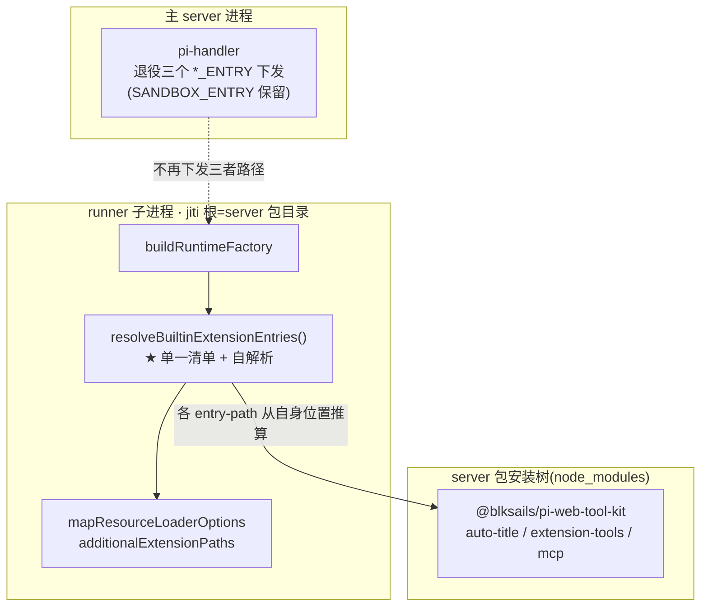
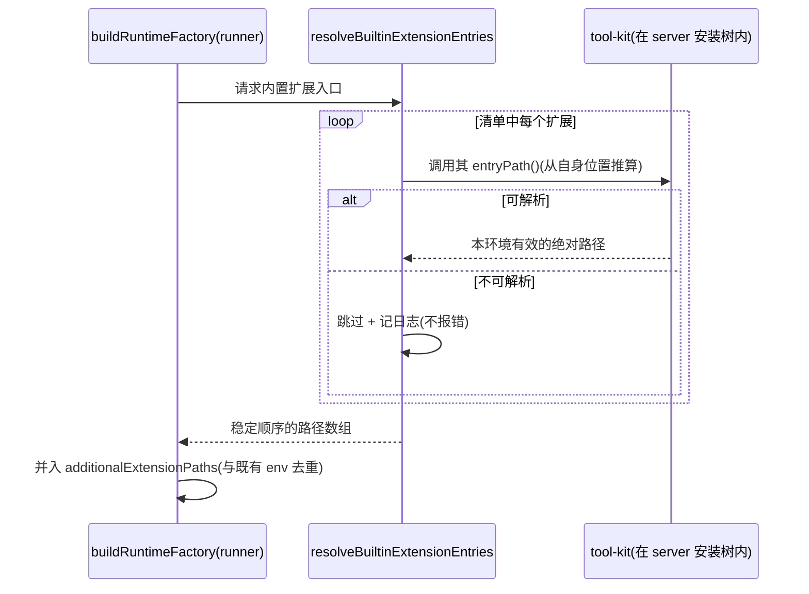

# Design Document — runner-self-resolved-builtins

> **状态:经实现校准的最终设计**(spec 已实现并提交 `ff9ba03`)。
> 初稿写于实现前;实现中出现两处偏离,已据实回写:① 范围由"四个内置扩展"收窄为
> **三个 tool-kit 扩展**(见下方勘误);② 补齐实现时引入、初稿未固化的两个契约
> (`collectExtensionPaths` 去重合并、`isAutoTitleEnabled` 门控接缝)。
> 本文件现与 `packages/server/src/runner/builtin-extensions.ts`、`option-mapper.ts`、
> `packages/tool-kit/src/auto-title/auto-title-extension.ts` 的实际导出一致。

## Overview

**Purpose**:把 pi-web 自带内置扩展的注入方式,从「主进程算绝对路径 → spawn env 下发 → runner 读 env」改为「**runner 从自身安装树自解析**」,消除「主进程与 runner 处于同一文件系统」这一在 e2b 沙箱下不成立的隐含前提。

**Users**:pi-web 维护者(新增内置扩展不再需多处 env 接线)与 e2b 沙箱用户(内置扩展在沙箱会话中恢复可用)。

**Impact**:runner 内新增单一「内置扩展入口清单」,经既有 jiti 解析根(server 包目录)解析入口;server 新增对 tool-kit 的运行时依赖,使扩展代码随 server 安装进入沙箱镜像。本地行为不变(自解析在同机得到与主进程下发相同的文件),沙箱形态首次经**同一套逻辑**获得内置扩展。

### Goals
- runner 从自身安装树解析内置扩展,不依赖主进程下发路径(Req 1)。
- 内置扩展入口在标准安装 server 后均可解析(Req 2)。
- 本地行为与既有测试全部不变(Req 3)。
- e2b 沙箱与本地共用同一自解析路径(Req 4)。
- 新增内置扩展收敛为改一处清单(Req 5)。

### Non-Goals
- 不改内置扩展自身功能;不改 `AgentDefinition.extensions`(用户 agent 自声明)的加载;不新增内置扩展。
- 不维护 e2b **base 镜像**构建(外部仓);只保证「标准装 server 即带上内置扩展代码」这一可打包前提。

## ⚠ 范围勘误(实现时发现):清单是三个 tool-kit 扩展,不含 sandbox

需求与设计初稿把内置扩展称为"四个"。实现时核准 `packages/server/src/sandbox/entry.ts` 发现其文件头明写:

> ⚠ 与 tool-kit 的 auto-title/ext-tools entry-path 同范式,但**入口在 agent 包内**(由 source 决定),故须传 agentDir/包目录,**不能像 tool-kit 那样从自身模块位置推算**。返回 undefined 时表示该 agent 未声明沙箱扩展,不注入。

即 sandbox enforcement 是 **agent 作用域**扩展(入口随用户 agent 走、是否存在取决于 source),与"pi-web 自带、位置固定于自身包内"的三个**解析范式不同**。故:

- **本 spec 自解析清单 = `auto-title` / `extension-tools` / `mcp` 三个**(均在 tool-kit,均是 e2b 下失效的那批)。
- **sandbox enforcement 保持现状不动**(其 agentDir 在 e2b 下由 AGENT_CMD 用沙箱内路径处理,属另一条链路;强行并入会把 agent 作用域语义错误地固化成 pi-web 自带)。
- requirements 中"四个"一律按「pi-web 自带内置扩展(三个)」理解;`PI_WEB_SANDBOX_ENTRY` 不在本 spec 的退役范围内。

## Boundary Commitments

### This Spec Owns
- runner 侧内置扩展入口的**自解析逻辑**与其单一来源清单。
- server → tool-kit 运行时依赖的建立。
- 主进程对**三个 tool-kit 扩展**路径的 spawn env 下发退役(过渡期兼容识别)。

### Out of Boundary
- 内置扩展功能逻辑;各自门控语义(仅迁移自动标题一处判定位置,见下)。
- **sandbox enforcement 的解析与注入**(范式不同,见勘误)。
- e2b base 镜像构建流程;`AgentDefinition.extensions` 加载路径。

### Allowed Dependencies
- `runner-bootstrap.mjs` 既有的 jiti 解析根(server 包目录)。
- tool-kit 的 `./auto-title-entry` / `./extension-entry` / `./mcp-entry` 子入口(node-only,已有)。
- 既有 `mapResourceLoaderOptions` / `additionalExtensionPaths` 加载面。

### Revalidation Triggers
- 内置扩展入口清单增删。
- server↔tool-kit 依赖方向变化。
- runner-bootstrap 解析根变化。
- 沙箱镜像安装 server 的方式变化。

## Architecture

### Existing Architecture Analysis

三个既有事实决定设计形态:

1. **runner-bootstrap 的 jiti 根 = server 包目录**(`runner-bootstrap.mjs:27-33`,`createJiti(here)`):runner 内一切 import 从 server 的 `node_modules` 解析,与 `process.cwd()` 无关。这就是"runner 自身安装树"的准确定义,也是自解析的锚点。
2. **三个 tool-kit entry-path 已是自解析范式**:各自用 `import.meta.url` 从**自身模块位置**推算入口。当 server 依赖 tool-kit 后,这些模块位于 server 的 `node_modules` 内,其推算结果在**任何形态**(本地 monorepo / 沙箱镜像 / standalone)都是该环境的有效路径 —— 无需任何新解析机制。
3. **collect 已在 runner 子进程执行**:`buildRuntimeFactory`(option-mapper:275)调 `collectForcedExtensionPaths(process.env)` —— 接线点已在 runner 侧,改的是它的**数据来源**(env → 自解析)。

### 自解析机制



**核心组件 `resolveBuiltinExtensionEntries()`**(runner 侧,新增):以**单一数组**枚举三个内置扩展,逐个调用其 entry-path 函数取得实际路径;解析不到的条目跳过并记日志(Req 1.4/5.3),不中断;返回顺序稳定(Req 1.5)。

### ⚠ 唯一门控迁移:自动标题总开关

自动标题现有门控是「`PI_WEB_AUTO_TITLE=0` → 主进程不下发路径 → 扩展不注入」。自解析后入口**恒被解析**,故总开关判定必须**下沉到扩展内部**(装配时读该 env,关闭即不注册 handler),才能保持「关闭=无效果」的用户可观察结果不变(Req 3.2)。这是本改造唯一动到功能门控的地方。

### Technology Stack

| Layer | Choice | Role | Notes |
|---|---|---|---|
| Runner 解析 | 既有 entry-path 函数(`import.meta.url`) | 从自身位置推算入口 | 零新机制,复用已验证范式 |
| 包依赖 | server → tool-kit(新增 runtime dep) | 使扩展代码进入 server 安装树 | tool-kit 不依赖 server,无循环 |
| 加载面 | `additionalExtensionPaths`(既有) | 强制注入,豁免系统资源开关 | 不变 |

## File Structure Plan

### 新增
```
packages/server/src/runner/builtin-extensions.ts   # ★ 单一清单 + resolveBuiltinExtensionEntries()
```

### 修改
- `packages/server/src/runner/option-mapper.ts` — **新增 `collectExtensionPaths()`**(自解析 ∪ env,去重保序),`buildRuntimeFactory` 改调它;`collectForcedExtensionPaths` 保留但降级为过渡期兼容(识别既有 env + sandbox 入口,不再是主来源)。
- `packages/server/package.json` — 新增 `@blksails/pi-web-tool-kit` 运行时依赖(**已完成**)。
- `packages/tool-kit/src/auto-title/auto-title-extension.ts` — **新增导出 `isAutoTitleEnabled()`**,`autoTitleExtension` 开头据其短路返回(关闭即不注册 handler)。
- `lib/app/pi-handler.ts` — 退役 `PI_WEB_AUTO_TITLE_ENTRY` / `PI_WEB_EXT_TOOLS_ENTRY` / `PI_WEB_MCP_ENTRY` 三处下发(`PI_WEB_SANDBOX_ENTRY` 保留)。

## System Flows



## Requirements Traceability

| Requirement | Components | Flows |
|---|---|---|
| 1.1–1.5 runner 自解析 | resolveBuiltinExtensionEntries | 会话装配 |
| 2.1–2.4 代码进安装树 | server→tool-kit 依赖 | — |
| 3.1–3.4 本地不变 | option-mapper 过渡兼容 + 门控下沉 | — |
| 4.1–4.4 沙箱可用 | 同一自解析逻辑 | 会话装配 |
| 5.1–5.3 消除接线 | 单一清单 + 解析日志 | — |

## Components and Interfaces

### resolveBuiltinExtensionEntries(runner 侧,新增)

| Field | Detail |
|---|---|
| Intent | 从 runner 安装树自解析内置扩展入口,单一来源 |
| Requirements | 1.1, 1.3, 1.4, 1.5, 5.2, 5.3 |

**Contracts**: Service

```typescript
export interface BuiltinExtensionSpec {
  readonly id: "extension-tools" | "auto-title" | "mcp";
  /** 从自身模块位置推算入口;解析不到返回 undefined。 */
  readonly resolve: () => string | undefined;
}
/** 单一清单;新增内置扩展只在此数组加一项(Req 5.2)。 */
export const BUILTIN_EXTENSIONS: readonly BuiltinExtensionSpec[];
/** 解析全部可用入口,稳定顺序,跳过不可解析并记日志。 */
export function resolveBuiltinExtensionEntries(
  specs?: readonly BuiltinExtensionSpec[],
): readonly string[];
```
- Postconditions:返回路径在**当前运行环境**有效(本地=monorepo 源,沙箱=镜像内包路径)。
- Invariants:不抛出;不可解析降级为跳过。

### collectExtensionPaths(option-mapper,新增)

本改造的**实际接线点**:把自解析结果与既有 env 合并成本次会话要强制注入的路径集合。
`buildRuntimeFactory` 由原先的 `collectForcedExtensionPaths(process.env)` 改调本函数。

| Field | Detail |
|---|---|
| Intent | 自解析 ∪ env 兼容项,去重保序 |
| Requirements | 1.1, 1.2, 3.1, 3.3 |

**Contracts**: Service

```typescript
/** 既有函数保留(过渡兼容 + sandbox 入口),不再是主来源。 */
export function collectForcedExtensionPaths(env: NodeJS.ProcessEnv): string[];

/**
 * 本次会话强制注入的扩展入口 = env 兼容项 ∪ 自解析内置扩展,**去重保序**。
 * `selfResolved` 可注入,便于单测。
 */
export function collectExtensionPaths(
  env: NodeJS.ProcessEnv,
  selfResolved?: readonly string[],
): string[];
```
- **顺序语义**:env 项(含 `PI_WEB_SANDBOX_ENTRY`)在前、自解析项在后 —— 与改造前
  `sandbox → ext-tools → auto-title → mcp` 的相对次序一致(改造后 env 通常只剩 sandbox)。
- **去重语义**:同一路径经 env 与自解析同时出现时只注入一次(Req 3.3 的关键 —— 外部编排
  仍设置旧 env 时不得重复注入)。
- Invariants:纯函数(env 与清单均可注入);不读全局;不抛出。

### isAutoTitleEnabled(auto-title 扩展,新增)

门控下沉后的**可测接缝**:把「总开关判定」从主进程搬进扩展自身。

| Field | Detail |
|---|---|
| Intent | 在扩展内部判定 `PI_WEB_AUTO_TITLE`,关闭即不注册 handler |
| Requirements | 3.2 |

**Contracts**: Service

```typescript
/** 判据沿用主进程原语义:`!== "0"` 即启用(未设置=默认启用)。 */
export function isAutoTitleEnabled(env?: NodeJS.ProcessEnv): boolean;
```
- **等价性要求**:`PI_WEB_AUTO_TITLE=0` 时 `autoTitleExtension` 必须**不注册** `agent_end`
  handler —— 使「关闭=无效果」的用户可观察结果与改造前逐字等价(改造前是"扩展根本不注入")。
- Invariants:纯函数;不抛出。

> **为什么这两个接口必须出现在设计里**:它们是本改造**行为正确性的承载点** ——
> `collectExtensionPaths` 的去重决定「旧 env 残留时不重复注入」,`isAutoTitleEnabled` 的
> 判定决定「关闭开关仍然无效果」。初稿只描述了机制方向而未固化这两处契约,故在实现后据实补齐。

## Error Handling

- **入口不可解析**:跳过 + 日志(维护者可观测,Req 5.3),会话照常(Req 1.4/4.3)。
- **过渡期 env 残留**:既有 `*_ENTRY` env 若仍被设置,识别但去重,不报错(Req 3.3)。

## Testing Strategy

### Unit
- `resolveBuiltinExtensionEntries`:三项按稳定顺序解析;注入可控 spec 时某项返回 undefined→被跳过且不抛;日志被触发。
- 门控下沉:`PI_WEB_AUTO_TITLE=0` 时自动标题扩展装配后不注册 handler;默认时照常注册(3.2)。
- option-mapper:自解析结果并入 additionalExtensionPaths;既有 env 同时存在时**不重复**、不报错(3.3)。

### Integration
- 本地形态:三个内置扩展经自解析全部注入,注入集合与改造前等价(3.1)。
- server 安装树含 tool-kit:`@blksails/pi-web-tool-kit` 在 server 的 node_modules 内可解析(2.1/2.3)。

### E2E
- 真实解析:在 runner 的解析语境下三个 entry 均指向真实存在的文件(1.1/2.1)。
- 既有全量套件保持通过(3.4)。
- 真实沙箱内解析记 SKIP(无凭据环境边界,4.1 由镜像装配保证)。

## Migration Strategy

- **无破坏迁移**:自解析上线后主进程停止下发三者路径;过渡期保留对既有 env 的识别与去重。
- **回滚**:自解析返回空时行为退回"无内置扩展",与镜像缺代码同路径,会话仍可用。
