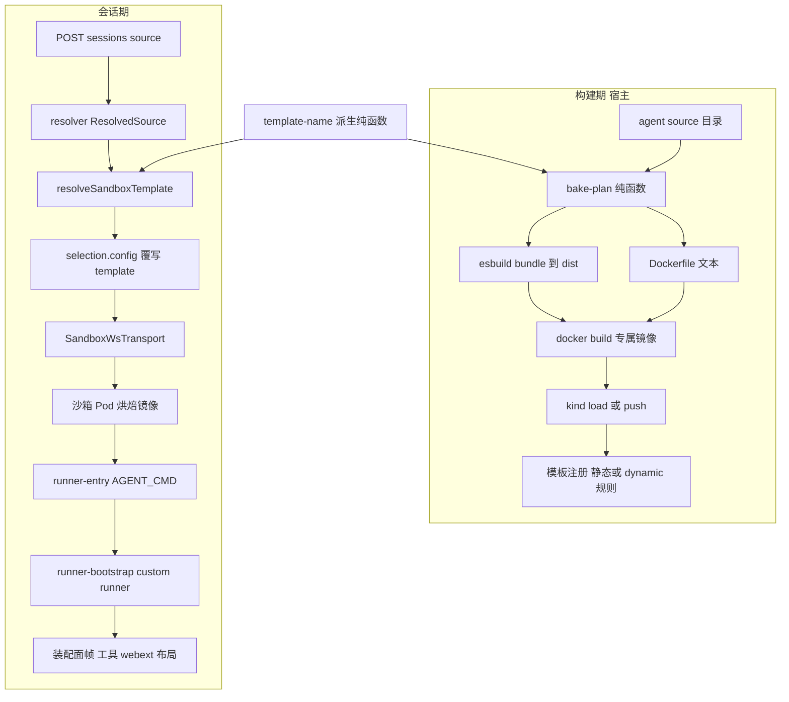
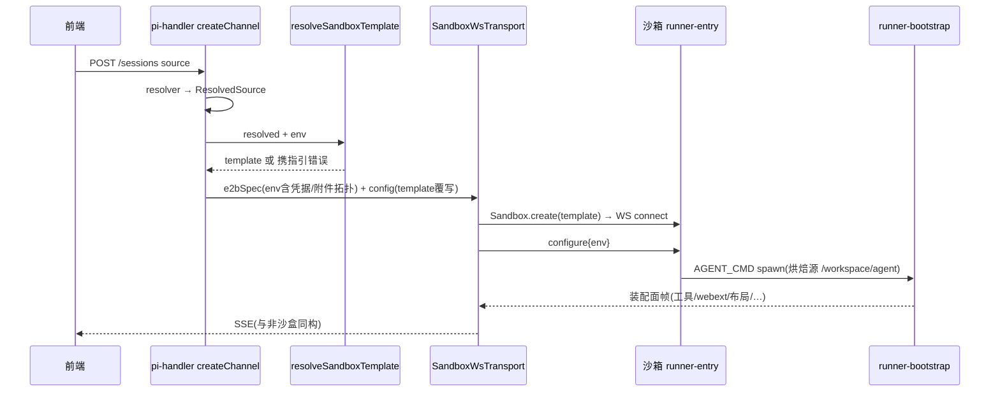

# Technical Design — sandbox-baked-agent-image

## Overview

**Purpose**: 让沙盒会话与非沙盒会话具有一致的产品能力(工具/webext/布局等全套装配面),同时把 agent 源的编译与打包移到构建期,使沙箱启动即加载、运行时零编译零下载。

**Users**: agent 使用者获得能力一致的沙盒会话;agent 开发者获得一条命令的镜像烘焙与本地闭环;部署运维者获得按 source 寻址镜像模板的机制。

**Impact**: 在既有 e2b/ws-runner 传输(spec `e2b-sandbox-transport`)之上,新增「烘焙镜像」交付形态:构建工具(scripts + server 包纯函数)、会话时模板解析(pi-handler e2b 分支覆写 template)、附件拓扑条件透传。**不改动 pi-clouds 仓任何代码**;沙箱内零新组件(复用基础镜像 runner-entry 的 `AGENT_CMD` 兜底路径)。

### Goals
- 沙盒会话以 pi-web custom runner 运行烘焙源,装配面与非沙盒逐项一致(R1)。
- 构建期编译(esbuild → dist),沙箱运行时零编译;层缓存使重复构建/加载最快(R2)。
- 会话创建按 source 解析模板:显式映射 → 门控派生 → 全局回退 → 清晰错误(R3)。
- 运行环境(argv/agentDir/凭据/日志/握手/失败传播)与非沙盒对齐(R4);附件拓扑条件透传或明确降级(R5)。
- 本地闭环脚本化 + 文档(R6);单测/集成/e2e + 零回归(R7)。

### Non-Goals
- pi-clouds 仓代码改动(基础镜像、runner-entry、线协议全部只读复用)。
- 线上发布产线编排(构建触发/推送/版本策略);仅保证构建形态可复用。
- envd 数据面(真实 e2b 云)的装配对齐;cli 模式源(纯 `.pi/`)的烘焙;沙箱复用/保活扩展。

## Boundary Commitments

### This Spec Owns
- `packages/server/src/sandbox-image/`:烘焙计划(文件收集/排除/Dockerfile 文本)与镜像名/模板名派生的纯函数契约。
- 会话创建路径的沙箱模板解析(`resolveSandboxTemplate`)及其配置面(`PI_WEB_E2B_TEMPLATE_MAP` / `PI_WEB_E2B_TEMPLATE_DERIVE`)。
- e2b 分支的 env 组装增量:附件拓扑条件透传 + provider 凭据键自动并入 envPassthrough。
- `scripts/build-agent-image.mjs` 构建编排与 `dev:e2b:local` 烘焙扩展、本地闭环文档。

### Out of Boundary
- 基础镜像契约(runner-entry 的 AGENT_CMD/parseCmd、`PI_WEB_RUNNER_ENTRY` 路径、`/workspace/node_modules` symlink)——只读消费,pi-clouds 所有。
- agent-sandbox 模板注册机制(ConfigMap 格式、dynamic 规则语义)——部署运维操作,本 spec 仅生成注册内容与指引。
- `SandboxWsTransport`/`PiRpcSession` 线协议与会话核心——不改;configure 帧现状(只发 env)已满足。
- 附件后端拓扑本身(backends-config/UnionBlobStore/cloud-http)——复用既有,不改其契约。

### Allowed Dependencies
- `@blksails/pi-web-protocol`(SpawnSpec)← 既有方向;`sandbox-image/` 仅依赖 node 内建 + protocol 类型。
- `rpc-channel/template-resolve.ts` 可依赖 `sandbox-image/template-name.ts`(同包内,方向:sandbox-image ← rpc-channel ← lib/app 组合根)。
- 构建脚本可依赖 esbuild(devDep 既有)、docker/kind/kubectl CLI(运行期探测,缺失清晰报错)。

### Revalidation Triggers
- 基础镜像挪动 runner-bootstrap 全局安装路径或撤销 `/workspace/node_modules` symlink → 烘焙 Dockerfile 生成逻辑须改、全部烘焙镜像须重建。
- `e2bTransportConfigFromEnv` 的 template 必填语义放宽 → 依赖 `E2B_CONFIG_MISSING_MESSAGE` 文案/时序的消费者(e2b-config.test / transport-select.test)须迁移。
- agent-sandbox dynamic 模板语法变化 → 派生约定与注册指引须同步。
- 附件拓扑新增 backend kind → 「全远程才透传」判定表须扩展。

## Architecture

### Existing Architecture Analysis
- 传输选择在会话创建路径 per-session 发生(`pi-handler.ts:438` `selectTransport`),`resolved: ResolvedSource` 与 `attachmentPassthroughEnv` 均在闭包作用域——模板覆写与附件透传的天然挂钩点,无需改 selectTransport 签名。
- e2b 分支现状刻意不注入附件 env(一期 Req 6.3)、不消费 `spawnSpec.cmd/args/cwd`;本设计维持「transport 不消费 cmd/args」不变式(启动命令由镜像 AGENT_CMD 承载),只增 env 组装。
- 装配面全部由 custom runner 装配期建立(`runner/runner.ts` wirings);webext 静态资产由宿主从本地 resolved 源服务,声明帧来自沙箱内烘焙副本——两侧须同源(构建工具职责)。

### Architecture Pattern & Boundary Map



**Architecture Integration**:
- 模式:纯函数内核 + 组合根注入(与 `*ConfigFromEnv`/assemble-spawn 同风格);构建期与会话期共用 `template-name.ts` 保证命名一致。
- 保留既有模式:transport 不消费 cmd/args;缺配置在会话创建路径清晰失败不静默回退;子进程附件 wiring fail-closed 降级。
- 新组件理由:`sandbox-image/`(烘焙决策可单测)、`template-resolve.ts`(三级解析序集中一处)、`build-agent-image.mjs`(编排不可单测部分最小化)。

### Technology Stack

| Layer | Choice / Version | Role in Feature | Notes |
|-------|------------------|-----------------|-------|
| 构建 | esbuild(仓内既有 devDep) | agent index.ts → 单文件 index.js(ESM,node22) | externals=pi SDK 两包 + `@blksails/*`(镜像全局 node_modules 解析) |
| 构建编排 | node scripts(.mjs)+ docker / kind / kubectl CLI | staging → build → load → register | CLI 缺失时逐步清晰报错(R6.3) |
| 会话期 | `@blksails/pi-web-server`(TS strict) | 模板解析 + env 组装增量 | 零新 runtime 依赖 |
| 镜像 | `FROM pi-clouds/agent-runner:pi`(或 ACS 变体) | 基座:node+pi+pi-web-server+runner-entry | 只读消费;本地与 kind 均已就位 |

## File Structure Plan

### Directory Structure(新增)
```
packages/server/src/sandbox-image/
├── template-name.ts      # source 标识 → slug/模板名/镜像名派生(纯函数;构建期+会话期共用)
├── bake-plan.ts          # 烘焙计划:文件收集+排除规则+esbuild 入参形状+Dockerfile 文本生成(纯函数,不落盘)
└── index.ts              # 聚合导出面
packages/server/src/rpc-channel/
└── template-resolve.ts   # resolveSandboxTemplate:显式映射→门控派生→全局→错误(纯函数)
scripts/
└── build-agent-image.mjs # 编排:stage(esbuild+拷贝)→docker build→--kind-load→--register→输出指引
docs/
└── sandbox-baked-agent-image.md  # 本地闭环操作文档(R6.1)
packages/server/test/sandbox-image/
├── template-name.test.ts
└── bake-plan.test.ts
packages/server/test/rpc-channel/
└── template-resolve.test.ts
e2e/
└── sandbox-baked-image.local.mjs # 本地 kind 门控 e2e(仿 sandbox-ws-transport.local.test 的跳过语义)
```

### Modified Files
- `lib/app/pi-handler.ts` — e2b 分支:调 `resolveSandboxTemplate` 覆写 `selection.config.template`;附件拓扑「全远程」判定通过时并入 `attachmentPassthroughEnv` 且扩展 envPassthrough;`config.providerKeys` 键自动并入 envPassthrough。
- `packages/server/src/rpc-channel/e2b-config.ts` — `PI_WEB_E2B_TEMPLATE` 由必填放宽为可缺(解析出 `template?` + `templateMap?` + `deriveEnabled`);缺失校验移交 `resolveSandboxTemplate` 终判(错误文案含三种修复路径)。
- `packages/server/src/rpc-channel/index.ts` — 导出 `resolveSandboxTemplate` 与相关类型。
- `packages/server/src/index.ts`(barrel)— 导出 `sandbox-image/`(⚠不得重导出含 pi SDK 取数的模块,既有教训)。
- `scripts/dev-e2b-local.mjs` — 可选 `PI_WEB_E2B_BAKE_SOURCE=<dir>`:起 dev 前先跑构建脚本(bake→load→register),并注入对应 `PI_WEB_E2B_TEMPLATE_MAP`。
- `packages/server/test/rpc-channel/e2b-config.test.ts` / `transport-select.test.ts` — 迁移「template 必填」断言到三级解析语义。

## System Flows

### 会话创建(沙盒 + 烘焙镜像)



关键门控:模板解析失败 → 会话创建即失败(R3.4);附件拓扑判定不过 → 不注入附件 env,子进程 wiring 走既有 fail-closed 降级(R5.2),会话其余能力不受影响(R5.3)。

### 构建流程(scripts/build-agent-image.mjs)

staging(bake-plan 决定收集/排除)→ esbuild bundle(`--no-bundle` 时拷源,运行时 jiti)→ 生成 Dockerfile(FROM 基座 + COPY /workspace/agent + ENV AGENT_CMD/AGENT_CWD)→ `docker build -t <image:tag>`(tag=内容哈希或 `--tag`)→ 可选 `--kind-load` / `--register`(kubectl patch config-templates + rollout restart)→ 输出 image:tag、派生模板名、下一步指引(R2.7)。

## Requirements Traceability

| Requirement | Summary | Components | Interfaces | Flows |
|-------------|---------|------------|------------|-------|
| 1.1-1.5 | 沙盒会话完整装配面 | 烘焙镜像契约 + 既有 custom runner | AGENT_CMD 启动契约 | 会话创建流 |
| 2.1-2.7 | 镜像构建工具 | bake-plan / build-agent-image.mjs | BakePlan 接口 | 构建流 |
| 3.1-3.5 | 按 source 解析模板 | template-name / template-resolve / e2b-config 放宽 | resolveSandboxTemplate | 会话创建流(门控) |
| 4.1-4.5 | 运行环境对齐 | 烘焙镜像契约 + pi-handler env 增量 | AGENT_CMD argv;envPassthrough 并集 | 会话创建流 |
| 5.1-5.3 | 附件沙盒语义 | pi-handler 附件判定 + 既有 backends-config/降级 | 全远程判定规则 | 会话创建流(门控) |
| 6.1-6.3 | 本地闭环 | dev-e2b-local 扩展 + docs | PI_WEB_E2B_BAKE_SOURCE | 构建流 → 会话创建流 |
| 7.1-7.3 | 测试与验证 | test/sandbox-image, test/rpc-channel, e2e | — | — |

## Components and Interfaces

| Component | Domain/Layer | Intent | Req Coverage | Key Dependencies | Contracts |
|-----------|--------------|--------|--------------|------------------|-----------|
| template-name | server/sandbox-image | source 标识→slug/模板名/镜像名派生 | 2.6, 3.2 | node:crypto(P2) | Service |
| bake-plan | server/sandbox-image | 烘焙计划纯函数(收集/排除/Dockerfile 文本) | 2.1-2.6 | template-name(P0) | Service |
| template-resolve | server/rpc-channel | 三级模板解析 + 终判错误 | 3.1-3.5 | template-name(P0), e2b-config(P0) | Service |
| pi-handler e2b 增量 | lib/app 组合根 | 模板覆写 + 附件/凭据 env 组装 | 4.2, 5.1-5.2 | template-resolve(P0), backends-config(P0) | State |
| build-agent-image.mjs | scripts | 构建编排(不可单测部分最小化) | 2.1-2.7, 6.1, 6.3 | bake-plan(P0), docker/kind/kubectl(P1) | Batch |
| dev-e2b-local 扩展 | scripts | 本地闭环一条龙 | 6.1-6.3 | build-agent-image(P0) | Batch |
| 烘焙镜像契约 | 镜像(产物) | AGENT_CMD→runner-bootstrap 启动 | 1.1-1.5, 4.1 | 基础镜像(External P0) | State |

### server/sandbox-image

#### template-name

| Field | Detail |
|-------|--------|
| Intent | 从 source 稳定标识派生 slug、镜像名、模板名(构建期与会话期共用,同输入恒同输出) |
| Requirements | 2.6, 3.2 |

**Responsibilities & Constraints**
- 输入 = resolver 的稳定来源标识(policySource 语义:dir 绝对路径 / git url / builtin 名);输出 DNS/镜像命名安全的 slug。
- 派生形态:`slug = sanitize(basename) + "-" + sha256(标识).slice(0,8)`;镜像 `piweb-agent/<slug>:<tag>`;模板 `piweb-agent-<slug>.<tag>`(与 agent-sandbox dynamic 规则 `piweb-agent-(?P<name>.+)\.(?P<version>.+)$` → `piweb-agent/<name>:<version>` 互逆)。
- 纯函数,不读 env/fs。

##### Service Interface
```typescript
export interface SourceIdentityInput {
  /** resolver 稳定来源标识(dir 绝对路径 / git url / builtin:<name>)。 */
  readonly policySource: string;
}
export function deriveSlug(input: SourceIdentityInput): string;
export function deriveImageName(input: SourceIdentityInput, tag: string): string;   // piweb-agent/<slug>:<tag>
export function deriveTemplateName(input: SourceIdentityInput, tag: string): string; // piweb-agent-<slug>.<tag>
```
- Preconditions: `policySource` 非空。Postconditions: 同输入恒同输出;输出满足镜像/模板命名字符集。

#### bake-plan

| Field | Detail |
|-------|--------|
| Intent | 计算烘焙计划:staging 文件清单(含排除)、bundle 入参形状、Dockerfile 文本——纯决策不落盘 |
| Requirements | 2.1-2.6 |

**Responsibilities & Constraints**
- 收集:入口(index.ts|js,缺失 → `MISSING_ENTRY` 错误,R2.4)、`package.json`、`.pi/` 全量(skills/config/web 源与 dist)、routes/ 等由 bundle 内联(拷源模式则列入清单)。
- 排除(R2.5,可查知常量导出):`node_modules/`、`.git/`、`dist/`(入口 bundle 产物除外)、`.installed`、本地缓存/临时目录。
- Dockerfile 文本:`FROM <base>` + `COPY staged/ /workspace/agent/` + `ENV AGENT_CWD=/workspace/agent` + `ENV AGENT_CMD="node /usr/local/lib/node_modules/@blksails/pi-web-server/runner-bootstrap.mjs --agent /workspace/agent/<entry> --cwd /workspace/agent --agent-dir /root/.pi/agent"`。entry=index.js(bundle)或 index.ts(`--no-bundle`,运行时 jiti)。
- tag 缺省 = staging 内容哈希前 12 位(确定性,重复构建同 tag → 层缓存命中即 R2.3)。

##### Service Interface
```typescript
export interface BakePlanOptions {
  readonly sourceDir: string;
  readonly baseImage: string;          // 缺省 pi-clouds/agent-runner:pi(可 env 覆盖)
  readonly bundle: boolean;            // 缺省 true;false=拷源+运行时 jiti
  readonly tag?: string;               // 缺省内容哈希
}
export type BakePlanError =
  | { readonly code: "MISSING_ENTRY"; readonly detail: string }
  | { readonly code: "SOURCE_NOT_DIR"; readonly detail: string };
export interface BakePlan {
  readonly files: readonly { readonly src: string; readonly dest: string }[]; // staging 清单(不含 bundle 产物)
  readonly entry: "index.js" | "index.ts";
  readonly bundleEntryPoint?: string;  // bundle=true 时的 esbuild 入口(绝对路径)
  readonly externals: readonly string[];
  readonly dockerfile: string;
  readonly imageName: string;
  readonly templateName: string;
  readonly tag: string;
}
export function computeBakePlan(opts: BakePlanOptions, fs: BakeFsPort): Result<BakePlan, BakePlanError>;
```
- `BakeFsPort` = `{exists(p):boolean; listFiles(dir):string[]; readFile(p):Buffer}` 注入端口,单测用内存实现。

### server/rpc-channel

#### template-resolve

| Field | Detail |
|-------|--------|
| Intent | 会话创建路径的三级模板解析与终判错误(R3 全部) |
| Requirements | 3.1-3.5 |

**Responsibilities & Constraints**
- 解析序:①`PI_WEB_E2B_TEMPLATE_MAP`(JSON:`{ "<source 标识>": "<模板名>" }`,键匹配 policySource 或原始 source 串)→ ②派生(仅 `PI_WEB_E2B_TEMPLATE_DERIVE=1` 且能取到 tag——由 map 值 `"derive:<tag>"` 形式或 `PI_WEB_E2B_TEMPLATE_DERIVE_TAG` 提供;取不到 tag 则跳过此级)→ ③`PI_WEB_E2B_TEMPLATE` → ④`TemplateResolutionError`(文案含三种修复路径)。
- 纯函数消费 env 快照 + SourceIdentityInput;不读全局 process.env(与 `*ConfigFromEnv` 同风格)。
- local 模式不经过本函数(R3.5 零变化)。

##### Service Interface
```typescript
export interface TemplateResolveInput {
  readonly source: SourceIdentityInput;
  readonly env: Record<string, string | undefined>;
}
export type TemplateResolution =
  | { readonly ok: true; readonly template: string; readonly via: "map" | "derived" | "global" }
  | { readonly ok: false; readonly error: string }; // 携修复指引
export function resolveSandboxTemplate(input: TemplateResolveInput): TemplateResolution;
```

**Implementation Notes**
- Integration: `e2bTransportConfigFromEnv` 放宽 template 必填(改为 `template?`),`E2B_CONFIG_MISSING_MESSAGE` 只保 API key 校验;pi-handler 在 `selection.mode === "e2b"` 后调本函数,`ok:false` 即抛(会话创建失败,与既有缺配置语义一致);`ok:true` 时 `{...selection.config, template}`。
- Validation: 既有 `e2b-config.test.ts`/`transport-select.test.ts` 迁移断言;新增 `template-resolve.test.ts` 覆盖四级路径与 via 标记。
- Risks: map 键匹配歧义(绝对路径 vs 相对 source 串)——按「先 exact source 串,再 policySource」两次查找,文档写明。

### lib/app 组合根

#### pi-handler e2b 增量(修改)

| Field | Detail |
|-------|--------|
| Intent | e2b 分支的模板覆写与 env 组装增量;不动 transport/会话核心 |
| Requirements | 4.2, 5.1, 5.2 |

**Responsibilities & Constraints**
- 附件判定:`parseBackendsEnv(env[PI_WEB_ATTACHMENT_BACKENDS])` 存在且每个 backend.kind ∈ {"cloud-http","s3"} → 把 `attachmentPassthroughEnv` 并入 `e2bSpec.env` 并把其键并入 `selection.config.envPassthrough`;否则完全不注入(既有降级 = R5.2)。
- 凭据:`Object.keys(config.providerKeys)` 并入 envPassthrough(R4.2;值已在 e2bSpec.env)。
- 日志/握手/失败传播(R4.3-4.5)由既有 SandboxWsTransport(log 帧→onStderr、onSpawn 握手、health→onExit)与 runner-entry 承载,本设计零改动、e2e 验收。

**Contracts**: State — env 组装规则见上,无新接口。

### scripts

#### build-agent-image.mjs

| Field | Detail |
|-------|--------|
| Intent | 编排:staging→esbuild→docker build→可选 kind load/模板注册→输出指引 |
| Requirements | 2.1-2.7, 6.1, 6.3 |

##### Batch / Job Contract
- Trigger: `node scripts/build-agent-image.mjs <sourceDir> [--tag t] [--base-image i] [--no-bundle] [--kind-load] [--register] [--kind-cluster pi-clouds]`。
- Input / validation: sourceDir 存在且 computeBakePlan 通过;docker(及 --kind-load 时 kind、--register 时 kubectl)可执行探测,缺失即步骤级清晰报错(R6.3)。
- Output: stdout 打印 image:tag、templateName、内容哈希、下一步指引;`--register` 走 kubectl patch config-templates 静态条目 `{name,image,port:8080}` + `rollout restart deploy/agent-sandbox` + 等待就绪。
- Idempotency: 同内容重复执行同 tag(哈希),docker 层缓存命中;register 幂等(已存在同名条目则原样更新)。
- 加载 TS 内核:经 `node --import jiti/register` 或 `new Function` 动态 import(既有两先例任一)。

#### dev-e2b-local.mjs 扩展(修改)

- `PI_WEB_E2B_BAKE_SOURCE=<dir>` 时:在 `ensurePortForward` 后插入 bake 阶段(spawn build-agent-image `--kind-load --register`),完成后注入 `PI_WEB_E2B_TEMPLATE_MAP={"<dir绝对路径>":"<templateName>"}` 再起 dev;未设置时零行为变化(R6 向后兼容)。

### 镜像(产物)

#### 烘焙镜像契约

| Field | Detail |
|-------|--------|
| Intent | 沙箱启动 → runner-entry(基础镜像)→ AGENT_CMD → runner-bootstrap 加载 /workspace/agent |
| Requirements | 1.1-1.5, 4.1 |

**State Management**
- 状态模型:镜像不可变;源内容哈希 = tag;`/workspace/agent` 只读使用(会话运行产物写沙箱临时区)。
- 启动链:configure 帧(无 sourceRef)→ runner-entry `buildFallbackChild` → `AGENT_CMD` → runner-bootstrap(--agent/--cwd/--agent-dir 与 assemble-spawn custom 模式同语义,R4.1)。
- 依赖解析:`/workspace/agent` 向上命中基础镜像 `/workspace/node_modules → 全局` symlink(@blksails/* 与 pi SDK 在全局)。

## Error Handling

### Error Strategy
沿用「会话创建路径清晰失败,绝不静默回退」:模板解析失败(R3.4)与附件拓扑判定不过(降级而非失败)是两类不同响应——前者阻断会话并给修复指引,后者降级继续。

### Error Categories and Responses
- **构建期(操作者)**:MISSING_ENTRY/SOURCE_NOT_DIR → 指出缺失文件;docker/kind/kubectl 缺失或非零退出 → 步骤名 + 原始 stderr + 修复建议(R2.4/6.3)。
- **会话创建(用户/操作者)**:TemplateResolutionError → 400 级错误,文案列三种修复路径(配 map / 开 derive+注册 dynamic 规则 / 设全局模板)。
- **沙箱运行(用户)**:agent 进程启动失败/退出 → 既有 health→onExit→会话错误传播链(R4.5),烘焙镜像启动即崩(如 bootstrap 路径失配)也经此链可见。
- **附件(用户)**:降级态附件操作 → 既有 fail-closed 提示(available:false),不崩溃(R5.2)。

### Monitoring
构建脚本打印内容哈希与产物明细;沙箱 stderr 经 log 帧汇入主进程日志(既有);模板解析结果(via=map/derived/global)入 debug 日志便于排查选错镜像。

## Testing Strategy

### Unit Tests(packages/server/test)
1. `template-name.test.ts`:同输入恒同输出;slug 字符集安全;dir/git/builtin 三型标识;模板名↔镜像名与 dynamic 规则互逆。
2. `bake-plan.test.ts`:收集含 `.pi/` 全量与 package.json;排除规则逐项(node_modules/.git/dist/.installed);MISSING_ENTRY;bundle vs --no-bundle 的 entry/Dockerfile 差异;tag=内容哈希确定性。
3. `template-resolve.test.ts`:map 命中(exact 串/policySource 两级查找);derive 门控开/关与缺 tag 跳过;global 回退;全空错误文案含三路径;via 标记正确。
4. `e2b-config.test.ts` 迁移:template 可缺不再抛;API key 缺失仍抛。

### Integration Tests
1. pi-handler e2b 分支(stub transport 注入):模板覆写生效;附件全远程拓扑 → passthroughEnv 并入 env 与白名单;混合/无拓扑 → 完全不注入;providerKeys 键并入白名单。
2. 构建脚本对 fixture agent 目录跑 staging+Dockerfile 生成(不 docker build),断言产物形状。

### E2E(本地 kind 门控,e2e/sandbox-baked-image.local.mjs)
1. 对一个含工具+webext+布局的 example agent 烘焙(--kind-load --register)→ dev(e2b/ws-runner)建会话 → 断言:就绪握手完成、getCommands/装配面声明与非沙盒同源 dev 逐项一致(工具清单、webext 声明、布局)、prompt 流式回复。
2. 负路径:未注册模板名 → 会话创建失败且错误含修复指引。
3. 集群不可达时整套跳过(仿 `sandbox-ws-transport.local.test` 门控),CI 无 kind 不红。

### 回归
`pnpm test` 全绿(local 模式零回归,R7.3);`e2e:node` stub 套件不受影响。

## Security Considerations
- 凭据只经 env 白名单进沙箱(providerKeys 键自动并入是收敛而非放宽:值本就在 e2bSpec.env,此前只是被白名单静默过滤)。
- 附件 token(cloud-http tokenEnv)仅在「全远程拓扑」判定通过时透传;拓扑原文不含明文凭据(既有设计)。
- 烘焙排除规则防止 .git/本地缓存等敏感内容进镜像;构建输出打印文件清单供审计(R2.5)。
- 镜像内不烘任何凭据(models.json 由基础镜像 entrypoint 按容器 env 生成,既有机制)。

## Performance & Scalability
- 会话创建零安装零编译:沙箱冷启 = Pod 调度 + 容器启动 + runner-bootstrap 加载 bundle(目标:装配面就绪 < 非沙盒 + Pod 调度开销)。
- 重复构建:staging 内容哈希稳定 → docker 层缓存命中,仅源变更层重建(R2.3)。
- 镜像体积:staged 源通常 < 1MB,增量层可忽略;基座 1.38GB 为既有事实,不在本 spec 优化。
