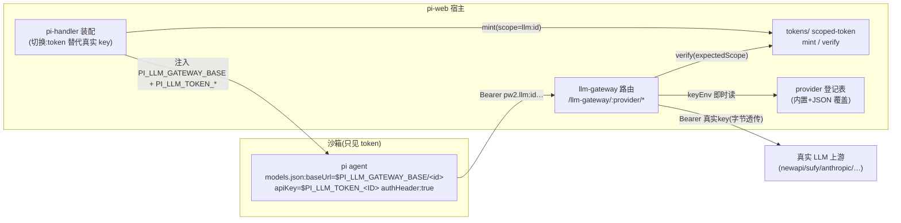
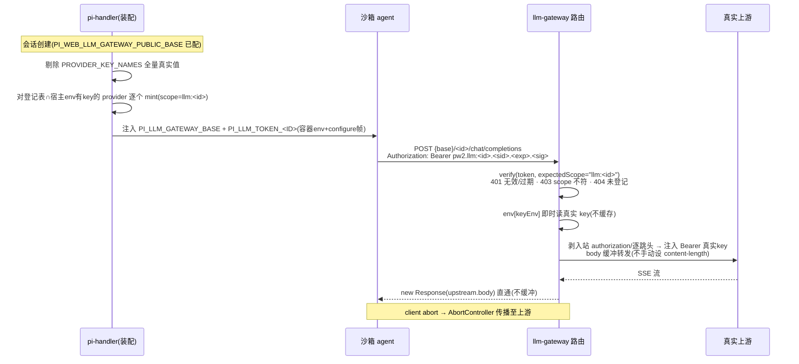

# Design Document — sandbox-credentials-v2

## Overview

**Purpose**:让云沙箱内的 agent 不再持有任何真实上游凭据。平台基础配额面(LLM 主对话、附件 store)改为**分面 scoped token 代理认证**:沙箱只持按服务面细分、会话绑定、可过期的 token,由服务端点原生校验后以真实凭据代访上游;扩展接口面(AIGC 等)凭据归平台层以 env 覆盖注入。同时摘除已废弃的 aigc-proxy。

**Users**:平台运维者(凭据不泄露、可按面吊销审计)、pi-web 自部署者(dev 网关本地闭环)、维护者(单一凭据代理路径)。

**Impact**:替换 pi-handler e2b 装配的 LLM 凭据下发方式(真实 key → scoped token);新增 tokens 原语与 `/llm-gateway/:provider/*` 路由;删除 aigc-proxy 全套。**不做任何 fetch 层拦截、不做转发器协议重写**(与被搁置的 fetch-bridge 方案的根本区别)。

### Goals
- 配置 LLM 网关后,沙箱环境(容器 env + agent 子进程 env)零真实 LLM provider 凭据
- scoped token:每会话 × 每服务面一枚,签名/过期/作用域三验,按面分 secret 族
- dev 网关与 pi-clouds 生产网关同契约(路径、token 格式、错误语义、env 名)
- aigc-proxy 完全摘除,AIGC 面回归纯 env 覆盖,无功能回退
- 全链路可在本仓闭环验证(e2e 三进程编排 + 真沙箱手动验证)

### Non-Goals
- pi-clouds 生产网关端点、settings UI、平台注入通道、配额/审计(兄弟仓)
- pi SDK 改动(已实证零改动可行)
- 镜像 entrypoint 的 models.json 生成分支(镜像仓;本仓只固化 env 名契约)
- 现有 attachment/consume token 迁 v2 形态(后续独立 spec)
- 附件面代码改动(cloud-http+token 已在 main,仅文档对齐)

## Boundary Commitments

### This Spec Owns
- `packages/server/src/tokens/` scoped token 原语(格式、mint/verify、secret 族解析)
- pi-handler e2b 装配的 LLM 凭据切换逻辑与注入 env 契约(`PI_LLM_GATEWAY_BASE`、`PI_LLM_TOKEN_<ID>`)
- `/llm-gateway/:provider/*` dev 网关路由(登记表、换钥、透传、错误语义)
- aigc-proxy 的摘除(代码、装配、测试、e2e、废弃 env 告警)
- 部署文档的附件面形态指引

### Out of Boundary
- pi-clouds 侧任何代码;沙箱基座镜像 entrypoint;pi SDK
- 附件系统架构(cloud-http/s3/union 均不动)
- tool-kit AIGC 占位符机制(零改动,仅作为依赖事实)
- providerKeys 在**本地(非沙箱)spawn** 的继承行为(维持现状)

### Allowed Dependencies
- `packages/logger`(装配/网关日志)、既有 InjectedRoute 注入接缝(`createPiWebHandler({routes})`)
- Node 内置 `crypto`(HMAC/timingSafeEqual);全局 `fetch`(上游转发)
- `lib/app/config.ts` 配置装载(新增字段沿现有模式)

### Revalidation Triggers
- `PI_LLM_*` env 名或 token 线格式变更 → 镜像 entrypoint 与 pi-clouds 装配须同步重验
- `/llm-gateway/:provider/*` 路径形态或错误语义变更 → pi-clouds 生产网关契约重验
- PROVIDER_KEY_NAMES 集合变更 → 登记表与剔除逻辑重验

## Architecture

### Existing Architecture Analysis
- 现状泄露链:`config.ts PROVIDER_KEY_NAMES` → pi-handler e2b 分支并入 `envPassthrough` 白名单 → 传输层(e2b-transport/sandbox-ws-transport)双通道(容器 env + configure 帧)→ 镜像 entrypoint 落 models.json / runner 子进程 env。
- 既有注入路由接缝(attachment-routes、agent-declared-routes 同款 `InjectedRoute[]`)是网关路由的挂载点;aigc-proxy 的「PUBLIC_BASE 配置门控 + 装配期 mint + 请求期即时读 key」三个模式全部沿用,但 token 增加 scope 维度。
- 遵守既有约束:上行日志走 stderr/文件 sink;路由仅在配置表达启用意图时注册(未配置=404 语义)。

### Architecture Pattern & Boundary Map



- Selected pattern:装配期签发 + 端点原生校验的反代(沿 aigc-proxy 模式,scope 化推广);生产部署同一契约由 pi-clouds 实现,pi-web 网关仅 dev/自部署形态。
- 新组件仅两个(tokens 原语、llm-gateway 路由);其余为装配改造与删除。

## File Structure Plan

### 新增
```
packages/server/src/tokens/
├── scoped-token.ts        # pw2 token:mint/verify(scope 逐字匹配)+ 类型
├── secret.ts              # secret 族解析(PI_WEB_LLM_GATEWAY_SECRET→PI_WEB_ATTACHMENT_SECRET)
└── index.ts               # barrel
packages/server/src/llm-gateway/
├── provider-registry.ts   # 内置 provider 表 + PI_WEB_LLM_GATEWAY_PROVIDERS JSON 合并
├── gateway-routes.ts      # createLlmGatewayRoutes(InjectedRoute[]):认token→换钥→透传
└── index.ts               # barrel
lib/app/llm-gateway-config.ts  # 装配期配置解析 + buildSandboxLlmEnv(token/base 注入键组装)
e2e/llm-gateway/
├── gateway-chain.local.mjs    # 三进程编排(改造自 e2e/aigc-proxy)
├── server-entry.ts            # 宿主:dev 网关 + 真实(stub)key
└── sandbox-child.ts           # 沙箱模拟:仅持 token,SSE 断言,env 无真实 key 断言
packages/server/test/tokens/scoped-token.test.ts
packages/server/test/llm-gateway/{provider-registry,gateway-routes,gateway-routes.integration}.test.ts
```

### 修改
- `lib/app/config.ts` — 删 `aigcProxyPublicBase`;增 `llmGatewayPublicBase`/`llmGatewayServe` 装载;`PROVIDER_KEY_NAMES` 保留(装配与登记表共用)
- `lib/app/pi-handler.ts` — e2b 分支:删 aigc-proxy 接线(:63-100 import、:348-351 logger、:482-524 判定/注入/剔除);增 LLM 网关判定(配置时剔全量 PROVIDER_KEY_NAMES + 注入 `buildSandboxLlmEnv` 产物;未配置 warn);路由注册段:删 aigc-proxy 挂载、增 llm-gateway 挂载(serve 门控)
- `packages/server/src/index.ts` — 删 aigc-proxy 导出,增 tokens/llm-gateway 导出
- 部署/附件文档 — 附件面形态指引(R5)

### 删除
- `packages/server/src/aigc-proxy/`(4 文件)、`lib/app/aigc-proxy-config.ts`
- `packages/server/test/aigc-proxy/`(4 文件)、`e2e/aigc-proxy/`(3 文件)
- `test/http/router.test.ts` 中 aigc-proxy 引用改写

## System Flows



流级决策:网关**路径透传**(`:provider` 后余部+query 原样拼上游 base),不设端点白名单,方法仅 POST/GET;上游 4xx/5xx 状态与体原样透传;上游不可达 → 502(对外文案固定脱敏,真实原因仅进服务端日志——含 causeStack,沿 fetch-bridge 排障教训)。

## Requirements Traceability

| Requirement | Summary | Components | Interfaces | Flows |
|-------------|---------|------------|------------|-------|
| 1.1-1.6 | 分面 scoped token | ScopedToken、SecretResolver | mint/verify | 装配段 |
| 2.1-2.5 | LLM 装配切换 | LlmGatewayAssembly(pi-handler) | buildSandboxLlmEnv、env 契约 | 装配段 |
| 3.1-3.8 | dev 网关 | LlmGatewayRoutes、ProviderRegistry | API Contract | 请求段 |
| 4.1-4.5 | aigc-proxy 摘除 | Removal(横切) | 废弃 env 告警 | — |
| 5.1-5.2 | 附件面文档 | Docs | — | — |
| 6.1-6.5 | e2e 与回归 | e2e/llm-gateway 编排 | — | 全链路 |

## Components and Interfaces

| Component | Domain/Layer | Intent | Req | Key Dependencies | Contracts |
|-----------|--------------|--------|-----|------------------|-----------|
| ScopedToken | server/tokens | pw2 token mint/verify | 1.1-1.6 | node:crypto (P0) | Service |
| SecretResolver | server/tokens | 按面 secret 族解析 | 1.5 | env (P0) | Service |
| ProviderRegistry | server/llm-gateway | providerId→上游/keyEnv 登记 | 3.1 | env (P1) | Service |
| LlmGatewayRoutes | server/llm-gateway | 认token→换钥→透传 | 3.1-3.8 | ScopedToken(P0)、Registry(P0)、fetch(P0) | API |
| LlmGatewayAssembly | lib/app | 装配切换+token注入 | 2.1-2.5 | ScopedToken(P0)、config(P0) | State |
| AigcProxyRemoval | 横切 | 摘除+废弃告警 | 4.1-4.5 | — | — |

### server/tokens

#### ScopedToken

| Field | Detail |
|-------|--------|
| Intent | 分面 scoped token 的签发与校验原语 |
| Requirements | 1.1, 1.2, 1.3, 1.4, 1.6 |

**Responsibilities & Constraints**
- 线格式:`pw2.<scope>.<sessionId>.<exp>.<sigHex>`;`scope`/`sessionId` 不得含 `.`(mint 期拒签抛错,校验期按 malformed 拒);scope 形如 `llm:<providerId>`(`:` 与分隔符无冲突,`store:<backend>` 等后续 scope 同形)
- 签名:`sig = HMAC-SHA256(secret, "pi-token.v2." + scope + "." + sessionId + "." + exp)` hex;签名域前缀 `pi-token.v2.` 与 url-signer(附件签名 URL)、既有 attachment/consume token 域全部隔离——即便共用 secret 也不可互换
- 校验顺序:格式 → 过期(`nowMs` 可注入)→ **scope 逐字等于 expectedScope** → `timingSafeEqual` 常量时间比对;任一失败返回判别原因(`malformed|expired|scope-mismatch|bad-signature`)不抛;原因仅进服务端日志,对外响应不区分细节(防探测,Req 1.6)

##### Service Interface
```typescript
export interface ScopedTokenService {
  mintScopedToken(input: {
    scope: string;            // "llm:<providerId>" 等;不得含 "."
    sessionId: string;        // 不得含 "."
    ttlMs: number;
    secret: string | Buffer;
  }): string;
  verifyScopedToken(input: {
    token: string;
    expectedScope: string;    // 逐字匹配;不符 → scope-mismatch
    secret: string | Buffer;
    nowMs?: number;
  }):
    | { ok: true; sessionId: string; scope: string; exp: number }
    | { ok: false; reason: "malformed" | "expired" | "scope-mismatch" | "bad-signature" };
}
```
- Preconditions:mint 输入的 scope/sessionId 无 `.`;Postconditions:verify ok 时 sessionId/scope 可信;Invariants:同 secret 下 token 与其他签名域产物不可互换。

#### SecretResolver

| Field | Detail |
|-------|--------|
| Intent | LLM 面 secret 族解析 | 
| Requirements | 1.5 |

- `resolveLlmGatewaySecret(env)`:优先 `PI_WEB_LLM_GATEWAY_SECRET`,回退 `PI_WEB_ATTACHMENT_SECRET`(复用附件系统主/子进程 secret 分发通道;签名域前缀保证不可互换),皆缺抛清晰错误(代理模式 secret 必须稳定,不可随机回退)。附件面/其他面 secret 族各自独立(本 spec 只实现 LLM 族;函数按族参数化预留)。

### server/llm-gateway

#### ProviderRegistry

| Field | Detail |
|-------|--------|
| Intent | providerId → { upstreamBase, keyEnvCandidates } 登记表 |
| Requirements | 3.1 |

- 内置表(providerId → keyEnvCandidates → upstreamBase;上游基址以镜像/models.json 实际事实为准,实现时逐一核对):

| providerId | keyEnvCandidates | upstreamBase(默认) |
|---|---|---|
| newapi | NEWAPI_API_KEY, APISERVICES_API_KEY | https://www.apiservices.top/v1 |
| sufy | SUFY_API_KEY | https://openai.sufy.com/v1 |
| dashscope | DASHSCOPE_API_KEY | https://dashscope.aliyuncs.com/compatible-mode/v1 |
| openrouter | OPENROUTER_API_KEY | https://openrouter.ai/api/v1 |
| anthropic | ANTHROPIC_API_KEY | https://api.anthropic.com |
| openai | OPENAI_API_KEY | https://api.openai.com/v1 |
| google | GOOGLE_GENERATIVE_AI_API_KEY, GEMINI_API_KEY | https://generativelanguage.googleapis.com |
| mistral | MISTRAL_API_KEY | https://api.mistral.ai/v1 |

- `PI_WEB_LLM_GATEWAY_PROVIDERS`(JSON:`Record<providerId,{upstreamBase,keyEnvCandidates}>`)同名覆盖/新名追加;装配期 zod 解析 fail-fast。
- providerId 约定小写 kebab;token env 名派生:`PI_LLM_TOKEN_` + providerId 大写、`-`→`_`。

#### LlmGatewayRoutes

| Field | Detail |
|-------|--------|
| Intent | dev/自部署 LLM 网关:认 token → 换钥 → 字节透传 |
| Requirements | 3.1-3.8 |

**Responsibilities & Constraints**
- `createLlmGatewayRoutes({ secret, registry, env?, fetchImpl?, timeoutMs? }): InjectedRoute[]`,挂 `/llm-gateway/:provider/*`(basePath-relative,/api 下可达);仅 serve 门控开启时由 pi-handler 注册(Req 3.8)
- 门控顺序:方法(POST/GET 之外 → 405)→ provider 登记(404)→ Bearer token 提取+verify(expectedScope=`llm:<provider>`;无效/过期 401、scope 不符 403)→ keyEnvCandidates 按序即时读(皆缺 → 502,文案不含 key)→ 转发。**失败路径零上游请求**
- 转发:URL = upstreamBase + `:provider` 后余部路径 + query;剥入站 `authorization`、桥接以外的逐跳头、`host`、`content-length`;注入 `Authorization: Bearer <真实key>`;**请求 body 缓冲转发(`ctx.req.arrayBuffer()`),绝不手动 set content-length**(undici 混搭重复头前车之鉴,fetch 对定长 body 自动携带);响应剥逐跳头+content-length 后 `new Response(upstream.body)` 流式直通;`ctx.req.signal` 联动 AbortController 传播中断(Req 3.5)
- 上游 4xx/5xx 原样透传;上游 fetch 抛错 → 502 固定脱敏文案 + 服务端日志记 errName/causeCode/causeStack(排障教训)
- 日志:每请求记 `{sessionId, provider, status, durationMs}`;绝不落 key/token 明文

##### API Contract
| Method | Endpoint | Request | Response | Errors |
|--------|----------|---------|----------|--------|
| POST/GET | /api/llm-gateway/:provider/* | Bearer pw2 token + 任意 body | 上游响应流式透传 | 401, 403, 404, 405, 502 |

### lib/app

#### LlmGatewayAssembly(pi-handler 装配切换)

| Field | Detail |
|-------|--------|
| Intent | 会话创建路径的 LLM 凭据切换与 token 注入 |
| Requirements | 2.1-2.5 |

**Responsibilities & Constraints**
- `lib/app/llm-gateway-config.ts`:
  - `resolveLlmGatewayConfig(env)`:读 `PI_WEB_LLM_GATEWAY_PUBLIC_BASE`(公开基址,沙箱视角)、`PI_WEB_LLM_GATEWAY_TOKEN_TTL_MS`(缺省对齐沙箱最大存活,沿 aigc-proxy TTL 解析先例)、`PI_WEB_LLM_GATEWAY_SERVE`(缺省=PUBLIC_BASE 非空即启;`0|false` 显式关)
  - `buildSandboxLlmEnv({publicBase, tokens})` → `{ PI_LLM_GATEWAY_BASE: <publicBase>/api/llm-gateway, PI_LLM_TOKEN_<ID>: <token>... }`
- pi-handler e2b 分支(Req 2.1/2.2):配置存在 → `providerKeysForE2b = {}`(PROVIDER_KEY_NAMES 全量不进 env 与白名单);对登记表 ∩ 宿主 env 有 key 的每个 provider `mintScopedToken(scope="llm:<id>")`;`buildSandboxLlmEnv` 产物并入 e2bSpec.env 与白名单。未配置 → 现状透传 + `app:llm-gateway` 命名空间可识别 warn(Req 2.4)。本地 spawn 分支零触碰(Req 2.5)
- **env 名契约(跨仓,Revalidation Trigger)**:`PI_LLM_GATEWAY_BASE`、`PI_LLM_TOKEN_<ID>`——镜像 entrypoint 据此生成 models.json(`baseUrl=$PI_LLM_GATEWAY_BASE/<id>`、`apiKey=$PI_LLM_TOKEN_<ID>`、`authHeader:true`);pi-clouds 生产装配同名注入

### 横切

#### AigcProxyRemoval

| Field | Detail |
|-------|--------|
| Intent | aigc-proxy 完全摘除与废弃告警 |
| Requirements | 4.1-4.5 |

- 删除清单见 File Structure Plan;`test/http/router.test.ts` 中引用改写为非 aigc-proxy 夹具
- 装配期废弃检测:`PI_WEB_AIGC_PROXY_PUBLIC_BASE`/`PI_WEB_AIGC_PROXY_SECRET`/`PI_WEB_AIGC_PROXY_TOKEN_TTL_MS` 任一被设置 → `logger.warn`(命名空间 `app:llm-gateway`,文案指明已废弃与替代)(Req 4.2)
- AIGC 面回归:tool-kit `${*_BASE_URL:-默认}` + `apiKeyVar` 占位符零改动(Req 4.4);未配 LLM 网关时 AIGC 三键随 PROVIDER_KEY_NAMES 照常透传(Req 4.3)

## Error Handling

### Error Strategy
网关对外错误体沿仓内统一 `{error:{code,message}}` JSON 形态;**对外文案固定脱敏**(不含 key/token/上游异常细节),真实原因(verify reason、causeStack)仅进服务端日志。

### Error Categories and Responses
- 401 UNAUTHORIZED:token 缺失/malformed/expired/bad-signature(不区分对外文案,防探测)
- 403 FORBIDDEN:scope-mismatch(token 面别不符)
- 404 NOT_FOUND:provider 未登记 / 路由未注册(serve 关闭)
- 405 METHOD_NOT_ALLOWED:非 POST/GET
- 502 BAD_GATEWAY:宿主凭据缺失 / 上游不可达(两者对外同文案,日志区分)
- 上游 4xx/5xx:原样透传状态与体(上游语义即用户语义)

### Monitoring
`server:llm-gateway`(请求日志+错误因)与 `app:llm-gateway`(装配 warn/废弃告警)两个命名空间;默认日志关闭策略沿仓内现状。

## Testing Strategy

- **Unit**:scoped-token(mint/verify 四种失败判别、scope 逐字匹配、`.` 拒签、域隔离:url-signer/attachment token 不可互换);provider-registry(内置表、JSON 覆盖/追加、fail-fast);secret 回退链
- **Integration(路由级,mock fetchImpl)**:门控顺序(401/403/404/405/502 各零上游);换钥正确(出站 Bearer=真实 key、入站 authorization 不外泄);body 缓冲转发且出站头无手动 content-length(回归锁);SSE 流式直通;abort 传播;上游 4xx 透传
- **装配单测**:配置时 PROVIDER_KEY_NAMES 全量不入 env/白名单 + token env 注入齐;未配置 warn + 现状;废弃 aigc-proxy env → warn
- **E2E(`pnpm e2e:llm-gateway`,三进程改造自 aigc-proxy 编排)**:子进程(仅持 token,env 断言无任何真实 key 值)→ 宿主 dev 网关(真实 stub key)→ stub SSE 上游;断言:流式回复逐字节到达、上游收到 Bearer=stub 真 key、错误 token/错 scope 401/403、`/api/aigc-proxy/*` 404
- **真沙箱手动验证(可选任务)**:Chrome + e2b/ACS dev,Pod env 无真实 provider key、主对话成功
- **回归**:全量套件零回归(aigc-proxy 测试删除后计数基线更新)

## Security Considerations
- token 仅授权「经网关访问单一 provider」:无枚举面(401 不区分因)、无跨面复用(scope 逐字)、随会话过期;网关凭据请求期即时读不缓存(换 key 即时生效)
- 迁移交互(高风险项,文档必须显式):**配置 LLM 网关后 PROVIDER_KEY_NAMES 全量被剔,其中 NEWAPI/SUFY/DASHSCOPE 同时是 AIGC 工具依赖的 key**——平台部署由 pi-clouds settings UI 注入;自部署需 operator 经 `PI_WEB_E2B_ENV_PASSTHROUGH` 显式透传或暂不启用网关;装配期对此情形(网关启用且无 AIGC 覆盖注入)输出可识别提示日志
- 废弃的 aigc-proxy token(`aigc-proxy.v1.` 域)在摘除后天然全部失效(无校验方)
