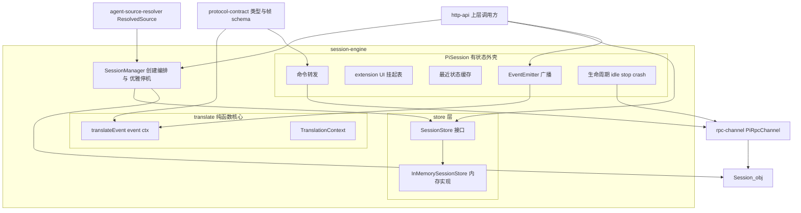
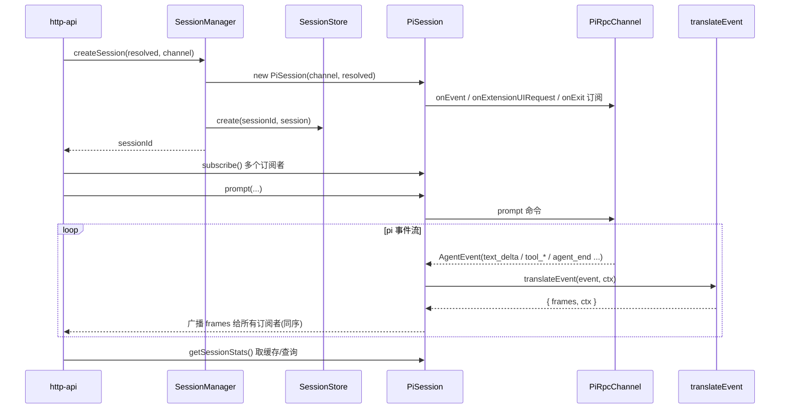
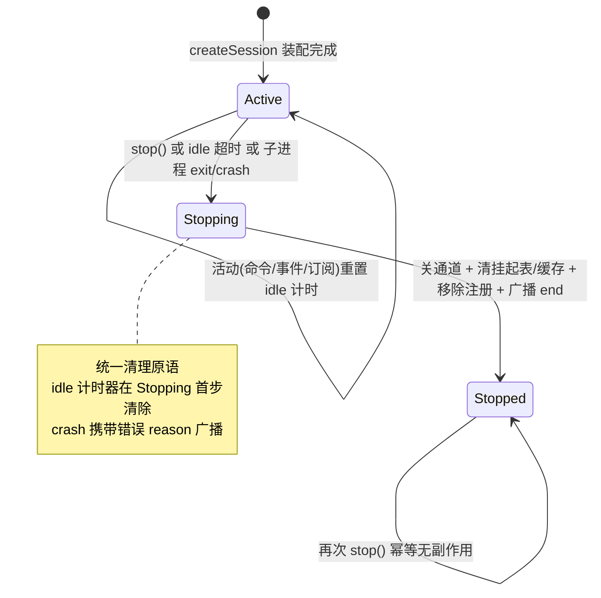
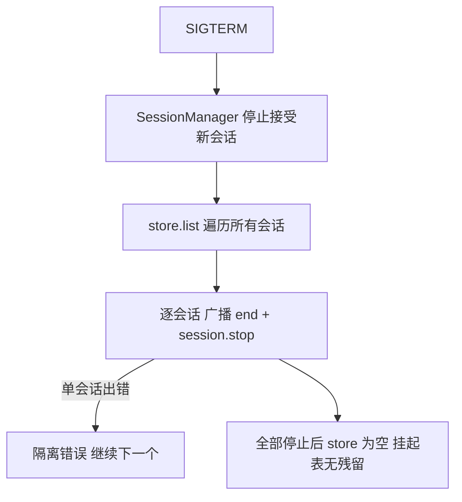

# Design Document — session-engine

## Overview

**Purpose**:本特性交付 pi-web 后端的 **会话中枢**:`PiSession`(会话对象)+ 生命周期管理 + `SessionStore`/Registry(注册检索,接口外置)+ **事件→UIMessage 纯函数翻译层**。它把上游 `agent-source-resolver` 的 `ResolvedSource` 与 `rpc-channel` 的 `PiRpcChannel` 组装为"一个会话",向上为 `http-api` 提供唯一的会话抽象:转发命令、广播并翻译事件为可直接渲染的 AI SDK v5 UIMessage 流、管理会话生命周期与资源回收。

**Users**:`http-api` 经 `SessionStore` 创建/检索会话,经 `PiSession.subscribe()` 取 UIMessage 帧流编码为 SSE,经命令转发触发 pi 操作,并把前端扩展 UI 回复路由回会话;`extension-management` 复用会话的命令转发(如 `get_commands`)。

**Impact**:把 PLAN §3.2 的 `SessionRegistry`、§4 的事件翻译、§11.3 的生命周期收敛为边界清晰、可单测的引擎层,并按 §14.1② 把会话存储外置为接口,为未来 Redis/Durable Object 留接缝;翻译层做成纯函数,使前端可直接消费 protocol 定义的 UIMessage 帧而无需理解 pi 原生事件。

### Goals

- 定义 `PiSession`:持有 `PiRpcChannel` + `EventEmitter`(向多订阅者广播)+ extension UI 挂起表 + 最近状态缓存 + 命令转发 + `subscribe()`。
- 实现会话生命周期:创建、idle 空闲回收、`stop()`(幂等)、子进程崩溃清理与错误广播、`SIGTERM` 优雅停机。
- 定义 `SessionStore` 接口(`get`/`create`/`delete`/`list`)与内存实现,会话逻辑只依赖接口(§14.1②)。
- 交付 **纯函数** 事件→UIMessage 翻译层:输入单个 `AgentEvent`,输出零或多个 protocol 定义的 SSE 帧,无副作用、可表驱动单测。
- 满足"测试 + e2e(硬性)":单元(逐事件翻译 + 生命周期)、集成(真实通道 + stub agent 多订阅者一致 + 扩展 UI 往返)、e2e(create→prompt→完整 UIMessage 流→stats)。

### Non-Goals

- 不开 HTTP 端点、不实现 SSE 编解码与网络传输(归 `http-api`)。
- 不 spawn 子进程、不实现 JSONL framing、不定义 `PiRpcChannel` 接口与命令负载形状(归 `rpc-channel`)。
- 不解析 agent 源、不生成 `spawnSpec`(归 `agent-source-resolver`)。
- 不定义 protocol 类型与 zod schema(归 `protocol-contract`,仅消费)。
- 不实现并发上限/资源限额/沙箱隔离(生产硬化非功能项;本 spec 仅做 idle 回收 + 崩溃清理 + 优雅停机,并为限额留注入接缝)。

## Boundary Commitments

### This Spec Owns

- 会话对象 `PiSession`:通道持有、事件广播(`EventEmitter`)、extension UI 挂起表、最近状态缓存、命令转发方法、`subscribe()`/取消订阅。
- 会话生命周期:创建装配、idle 计时回收、`stop()` 幂等、崩溃/退出清理与错误广播、`SIGTERM` 优雅停机(经 `SessionManager`)。
- `SessionStore` 接口(`create`/`get`/`delete`/`list`)与 `InMemorySessionStore` 内存实现。
- 事件→UIMessage **纯函数翻译层**:`translateEvent(event, ctx) → { frames, ctx' }`,逐事件映射为 protocol 定义的 SSE 帧。
- 翻译上下文 `TranslationContext` 的形状与推进语义(partId 分配、step/text/reasoning 开闭状态)。

### Out of Boundary

- 进程 spawn / 生命周期 kill / JSONL framing / `PiRpcChannel` 与命令负载定义(`rpc-channel`)。
- HTTP Route Handler / SSE 编解码与传输 / `createPiWebHandler`(`http-api`)。
- agent 源解析 / `spawnSpec` 生成 / 信任决策(`agent-source-resolver`)。
- protocol 类型/schema 定义与运行时校验(`protocol-contract`)。
- 并发上限/限额/沙箱/计费(生产硬化;仅留接缝)。

### Allowed Dependencies

- **上游 spec(运行时)**:`@pi-web/protocol`(`AgentEvent`/`SseFrame`/`DataPart`/`protocolVersion` 类型,单一事实来源);`rpc-channel` 的 `PiRpcChannel` 接口与 `PiRpcProcess` 暴露的事件/命令能力;`agent-source-resolver` 的 `ResolvedSource` 类型。
- **运行时**:Node `>=22.19.0` 内置 `node:events`(`EventEmitter`)、`node:timers`(idle 计时)、`node:process`(`SIGTERM` 监听,仅 `SessionManager` 内)。
- **依赖方向**:`protocol-contract ← rpc-channel ← session-engine`;`agent-source-resolver ← session-engine`;`session-engine ← http-api`。禁止反向。翻译层只依赖 `@pi-web/protocol` 与纯数据。
- **开发/测试**:`vitest`;集成/e2e 经 rpc-channel 的 stub agent 进程(`rpc-stub-process.mjs`)或真实 `pi --mode rpc`——不进运行时依赖。

### Revalidation Triggers

- `@pi-web/protocol` 中 `AgentEvent` 子类型形状、SSE 帧/`data-part` 形状或 `protocolVersion` 承载约定变更。
- `PiRpcChannel`/`PiRpcProcess` 的事件/命令/扩展 UI 成员签名变更。
- `ResolvedSource` 形状变更。
- `SessionStore` 接口成员或 `PiSession` 对外契约变更(影响 `http-api` 与未来远程存储实现)。
- 生命周期语义变更(idle 阈值约定、stop 幂等语义、崩溃清理顺序、优雅停机流程)。

## Architecture

### Architecture Pattern & Boundary Map

模式:**有状态外壳 + 纯函数核心(Functional Core, Imperative Shell)**。纯函数翻译层(`translateEvent`)是核心,可脱离运行时单测;`PiSession` 是有状态外壳(通道 + emitter + 挂起表 + 缓存 + 生命周期);`SessionManager` + `SessionStore` 接口承担注册/检索/全局停机。会话存储经接口外置(§14.1②)。



**Architecture Integration**:

- **Selected pattern**:Functional Core / Imperative Shell。理由:Req 4.1/10.1 硬性要求翻译为纯函数可单测;有状态运行时逻辑隔离在外壳便于 mock 测试。
- **Domain/feature boundaries**:`translate/`(纯函数,只依赖 protocol 类型)、`session/`(有状态外壳)、`store/`(注册接口 + 内存实现)、`manager`(创建编排 + 优雅停机)四块职责分离,经类型契约衔接。
- **Dependency direction**:`protocol ← translate`;`protocol + rpc-channel + agent-source-resolver ← session/manager/store`;`session-engine ← http-api`。翻译层不依赖 session/store/manager。
- **New components rationale**:`translateEvent`(可单测核心)、`PiSession`(会话状态唯一落点)、`SessionStore`(§14.1② 接缝)、`SessionManager`(创建/全局停机单点)——各单一职责。
- **Steering compliance**:TypeScript strict、禁 `any`;存储用接口隔开(structure.md);翻译纯函数无副作用;不 spawn、不开 HTTP(PLAN §边界);`detached:false` 等进程细节归 rpc-channel。

### Technology Stack

| Layer | Choice / Version | Role in Feature | Notes |
|-------|------------------|-----------------|-------|
| Frontend / CLI | — | 纯后端引擎组件 | 产出帧供前端消费 |
| Backend / Services | TypeScript strict;Node `>=22.19.0` | 会话外壳、翻译层、注册、生命周期 | 翻译层不引用 Node 专有 API |
| Data / Storage | 进程内内存 `Map`(挂 `globalThis` 抗热重载) | `InMemorySessionStore` | 经接口外置,未来可换 Redis/DO |
| Messaging / Events | `node:events`(`EventEmitter`);消费 rpc-channel 的 `onEvent`/`onExtensionUIRequest`/`onExit` | 多订阅者广播、扩展 UI 通知、退出/崩溃信号 | 帧形状由 protocol 定义 |
| Infrastructure / Runtime | `node:timers`(idle 计时)、`node:process`(`SIGTERM`,仅 manager);`vitest`(测试);rpc-channel stub agent(dev/集成) | 空闲回收、优雅停机、测试 | stub 不进运行时依赖 |

## File Structure Plan

### Directory Structure

```
lib/pi/session/
├── pi-session.ts              # PiSession:通道持有 + EventEmitter 广播 + 挂起表 + 状态缓存 + 命令转发 + subscribe + 生命周期
├── session-manager.ts         # SessionManager:经 SessionStore 创建会话(装配通道+resolved)、SIGTERM 优雅停机、idle 回收编排
├── session-store.ts           # SessionStore 接口(create/get/delete/list)+ InMemorySessionStore 内存实现(挂 globalThis)
├── session.types.ts           # 会话层类型:SessionId、SessionDescriptor、SessionStatus、SubscribeHandle、CreateSessionInput、SessionEndReason
├── session.errors.ts          # 会话错误类型:SessionStoppedError、SessionNotFoundError、UnknownExtensionUIError、MissingInputError
└── translate/
    ├── translate-event.ts     # ★ 纯函数:translateEvent(event, ctx) -> { frames, ctx }(逐事件→protocol SSE 帧)
    ├── translation-context.ts # TranslationContext 形状 + 初始化 + partId 分配 / step/text/reasoning 开闭状态推进(纯)
    └── translate.types.ts      # 翻译层类型:TranslateResult、PartId、StepState(仅引用 @pi-web/protocol 帧类型)
```

### Test Structure

```
lib/pi/session/__tests__/
├── translate-event.table.test.ts     # 表驱动:每种 AgentEvent 子类型 -> 期望 protocol 帧(Req 4.x, 10.1, 10.3)
├── translation-context.test.ts        # partId 分配 / 乱序/重复 start 容错 / 未知事件确定处理(Req 4.12, 10.1)
├── pi-session.broadcast.test.ts        # mock channel:多订阅者一致 + 取消独立 + 回调异常隔离(Req 3.x, 10.2)
├── pi-session.commands.test.ts         # mock channel:命令转发 + 状态缓存刷新 + 已停止拒绝(Req 2.x, 6.x, 10.2)
├── pi-session.extension-ui.test.ts     # mock channel:挂起登记 + 回复往返 + 未知 ID 拒绝 + 停止清空(Req 5.x, 10.2)
├── pi-session.lifecycle.test.ts        # 假计时器/mock channel:idle 回收 + 崩溃清理 + stop 幂等(Req 7.x, 10.3)
├── session-store.test.ts               # 内存实现 create/get/delete/list + 未找到语义(Req 9.x)
├── session-manager.test.ts             # SIGTERM 优雅停机:停所有会话、注册表清空、单失败隔离(Req 8.x)
├── session.integration.test.ts         # 真实 rpc-channel + stub agent:多订阅者一致 + 扩展 UI 往返(Req 10.4)
└── session.e2e.test.ts                 # create→prompt→订阅者收完整 UIMessage 流(start→text-delta…→finish)→stats(Req 10.5)
```

### Modified Files

- 无(greenfield 新模块)。若 monorepo 已存在 `package.json`,需将 `@pi-web/protocol` + rpc-channel + agent-source-resolver 模块与 `vitest` 纳入依赖——接线随仓库初始化处理,本 spec 创建模块自身文件与测试。

> 每文件单一职责。`translate/` 全为纯函数(无 I/O/进程/计时器),直接驱动表驱动单测;有状态逻辑集中在 `pi-session.ts` 与 `session-manager.ts`。

## System Flows

### create → prompt → 多订阅者 UIMessage 流



事件与命令响应在同一通道流上异步到达;`PiSession` 对每个事件先翻译再广播,保证多订阅者同序一致(Req 3.3)。订阅者回调异常被 try/catch 隔离(Req 3.5)。

### 生命周期状态机(idle / stop / crash)



`stop()`、idle 超时、崩溃三条路径汇入同一清理原语;状态机用 `Active/Stopping/Stopped` 去重保证幂等(Req 7.4)。崩溃路径额外携带错误并以 `SessionEndReason="crashed"` 广播(Req 7.5)。

### 优雅停机(SIGTERM)



## Requirements Traceability

| Requirement | Summary | Components | Interfaces | Flows |
|-------------|---------|------------|------------|-------|
| 1.1 | 用 resolved+channel 创建会话返回 sessionId+PiSession | session-manager.ts, pi-session.ts | `SessionManager.createSession` | create 流 |
| 1.2 | 创建时订阅 onEvent/onExtensionUIRequest/onExit | pi-session.ts | 构造订阅 | create 流 |
| 1.3 | 记录 mode/trust 供检索审计 | pi-session.ts, session.types.ts | `SessionDescriptor` | — |
| 1.4 | 不 spawn/不解析,接收注入 | session-manager.ts | 边界约束 | — |
| 1.5 | 缺通道/resolved 拒绝创建 | session-manager.ts, session.errors.ts | `MissingInputError` | — |
| 2.1, 2.5 | 命令经通道转发并关联结果,不改写语义 | pi-session.ts | 命令转发方法 | create 流 |
| 2.2 | 暴露对齐的命令转发能力 | pi-session.ts | 转发方法集 | — |
| 2.3 | 状态类命令刷新缓存 | pi-session.ts | 缓存更新 | — |
| 2.4 | 已停止会话命令立即拒绝 | pi-session.ts, session.errors.ts | `SessionStoppedError` | 生命周期 |
| 3.1, 3.3 | 事件广播给所有订阅者同序 | pi-session.ts | `EventEmitter`/`subscribe` | create 流 |
| 3.2, 3.4 | subscribe 返回可独立取消句柄 | pi-session.ts, session.types.ts | `SubscribeHandle` | — |
| 3.5 | 订阅者回调异常隔离 | pi-session.ts | try/catch 分发 | create 流 |
| 4.1 | 翻译为纯函数无副作用 | translate-event.ts, translation-context.ts | `translateEvent` | — |
| 4.2 | agent_start→start/start-step | translate-event.ts | `translateEvent` | — |
| 4.3 | text_*→text-start/delta/end | translate-event.ts, translation-context.ts | partId 分配 | — |
| 4.4 | thinking_*→reasoning-* | translate-event.ts | `translateEvent` | — |
| 4.5 | tool_execution_start→tool-input-available | translate-event.ts | `translateEvent` | — |
| 4.6 | tool_execution_update→data-part(累积) | translate-event.ts | `translateEvent` | — |
| 4.7 | tool_execution_end→tool-output-available | translate-event.ts | `translateEvent` | — |
| 4.8 | turn_end→finish-step;agent_end→finish | translate-event.ts | `translateEvent` | — |
| 4.9 | compaction/auto_retry/queue→data-pi-* | translate-event.ts | `translateEvent` | — |
| 4.10 | extension_ui_request→旁路 control 帧 | translate-event.ts | `translateEvent` | — |
| 4.11 | 帧符合 protocol schema 且带 protocolVersion | translate-event.ts | protocol 帧类型 | — |
| 4.12 | 未知事件确定处理不抛 | translate-event.ts, translation-context.ts | `translateEvent` | — |
| 5.1 | extension_ui_request 登记挂起表 + 广播 | pi-session.ts | 挂起表 | create 流 |
| 5.2 | 回复经通道写回并移除 | pi-session.ts | `respondExtensionUI` 转发 | — |
| 5.3 | 未知/已回复 ID 拒绝 | pi-session.ts, session.errors.ts | `UnknownExtensionUIError` | — |
| 5.4 | 停止/崩溃清空挂起表 | pi-session.ts | 清理原语 | 生命周期 |
| 6.1, 6.2 | 状态缓存更新与读取不打扰子进程 | pi-session.ts | 缓存读写 | — |
| 6.3 | 无缓存时返回明确空 | pi-session.ts, session.types.ts | 缓存读取 | — |
| 7.1, 7.2 | idle 超时停止(pi-session)+ 去注册(manager 经 onClosed)+ 活动重置计时 | pi-session.ts, session-manager.ts | idle 计时 + `onClosed` 回调 | 生命周期 |
| 7.3 | 显式 stop:关通道+移除+广播 end | pi-session.ts | `stop()` | 生命周期 |
| 7.4 | stop 幂等 | pi-session.ts | 状态机 | 生命周期 |
| 7.5 | 退出/崩溃清理+广播+去注册 | pi-session.ts(清理), session-manager.ts(去注册) | `onExit` 处理 + `onClosed` 回调 | 生命周期 |
| 7.6 | 停止后拒绝命令/订阅 | pi-session.ts | 状态校验 | 生命周期 |
| 8.1, 8.2 | SIGTERM 停接新+停所有会话 | session-manager.ts | `shutdown()` | 优雅停机 |
| 8.3 | 停机后注册表空、挂起表无残留 | session-manager.ts, session-store.ts | `list`/清理 | 优雅停机 |
| 8.4 | 单会话停止失败隔离 | session-manager.ts | 错误隔离 | 优雅停机 |
| 9.1 | 存储接口 create/get/delete/list | session-store.ts | `SessionStore` | — |
| 9.2 | 内存实现 | session-store.ts | `InMemorySessionStore` | — |
| 9.3, 9.4 | 创建登记 / 停止删除 | session-store.ts, session-manager.ts | `create`/`delete` | create 流 |
| 9.5 | 未找到返回明确结果 | session-store.ts | `get` 返回 | — |
| 9.6 | 仅依赖接口可替换实现 | session-manager.ts, pi-session.ts | 接口注入 | — |
| 10.1 | 翻译纯函数可表驱动测 | translate-event.ts | `translateEvent` | — |
| 10.2 | 可注入 mock channel 测会话逻辑 | pi-session.ts | 接口注入 | — |
| 10.3 | 单元:逐事件 + 生命周期 | __tests__/translate-event.table, lifecycle | vitest | — |
| 10.4 | 集成:真实通道+stub 多订阅者+扩展 UI | __tests__/session.integration | vitest | create 流 |
| 10.5 | e2e:create→prompt→流→stats | __tests__/session.e2e | vitest | create 流 |
| 10.6 | 单一命令运行全部测试 | vitest 配置 | `vitest run` | — |

## Components and Interfaces

| Component | Layer | Intent | Req Coverage | Key Dependencies (P0/P1) | Contracts |
|-----------|-------|--------|--------------|--------------------------|-----------|
| translate-event.ts | translate (纯核心) | 单事件→protocol SSE 帧纯函数 | 4.1–4.12, 10.1 | @pi-web/protocol (P0) | Service |
| translation-context.ts | translate (纯核心) | partId/step/text/reasoning 状态推进(纯) | 4.3, 4.12, 10.1 | @pi-web/protocol (P1) | State |
| pi-session.ts | session (外壳) | 通道+广播+挂起表+缓存+转发+生命周期 | 1.2,1.3,2.x,3.x,5.x,6.x,7.x,10.2 | PiRpcChannel (P0), translateEvent (P0), @pi-web/protocol (P0), node:events/timers (P1) | Service, Event, State |
| session-store.ts | store | 存储接口 + 内存实现 | 9.1–9.6 | session.types (P0) | Service, State |
| session-manager.ts | manager | 创建编排 + SIGTERM 优雅停机 + idle 编排 | 1.1,1.4,1.5,8.x,9.3,9.4,9.6 | SessionStore (P0), PiSession (P0), ResolvedSource (P0), node:process (P1) | Service |
| session.types.ts · session.errors.ts | session | 会话层类型与错误 | 1.3,1.5,2.4,3.2,5.3,6.3,9.5 | @pi-web/protocol (P1) | State |

### translate 层(纯函数核心)

#### translateEvent(translate-event.ts)

| Field | Detail |
|-------|--------|
| Intent | 把单个 pi `AgentEvent` 翻译为零或多个 protocol 定义的 SSE 帧;无副作用 |
| Requirements | 4.1, 4.2, 4.3, 4.4, 4.5, 4.6, 4.7, 4.8, 4.9, 4.10, 4.11, 4.12, 10.1 |

**Responsibilities & Constraints**
- 输入 `(event: AgentEvent, ctx: TranslationContext)`,输出 `{ frames: SseFrame[]; ctx: TranslationContext }`;不做任何 I/O、不启计时器、不读写可变全局、不依赖进程/网络(Req 4.1)。
- 按 PLAN §4 映射表逐子类型翻译(见下表);产出帧严格符合 protocol `SseFrameSchema` 且携带 `protocolVersion`(Req 4.11)。
- `extension_ui_request` 翻译为旁路 `control` 帧(非 `uiMessageChunk`)(Req 4.10)。
- 未知/不可翻译事件:返回确定结果(诊断 control 帧或空 `frames`)而非抛异常(Req 4.12)。
- 状态推进(partId 分配、step/text/reasoning 开闭)经返回的 `ctx` 体现,函数本身不持有可变状态。

**事件→帧映射(权威 PLAN §4)**

| pi 事件 | 输出 SSE 帧 | 备注 |
|---------|-------------|------|
| `agent_start` | `uiMessageChunk: start` + `start-step` | 开启 assistant message |
| `message_update.text_start` | `uiMessageChunk: text-start`(分配 partId) | ctx 记录该 text part 开启 |
| `message_update.text_delta` | `uiMessageChunk: text-delta`(增量) | 驱动 `<Response>` |
| `message_update.text_end` | `uiMessageChunk: text-end` | ctx 关闭该 text part |
| `message_update.thinking_start|delta|end` | `uiMessageChunk: reasoning-start|delta|end` | 驱动 `<Reasoning>` |
| `tool_execution_start` | `uiMessageChunk: tool-input-available`(toolCallId/toolName/args) | 驱动 `<Tool>` |
| `tool_execution_update` | `uiMessageChunk: tool-output-available`(preliminary=true,output=累积 partialResult)¹ | partialResult 为累积值;AI SDK 按 toolCallId 复用 part 替换 |
| `tool_execution_end` | `uiMessageChunk: tool-output-available`(result/isError) | |
| `turn_end` | `uiMessageChunk: finish-step` | |
| `agent_end` | `uiMessageChunk: finish` | 一轮结束 |
| `compaction_*` / `auto_retry_*` | `control: data-pi-compaction / data-pi-auto-retry` | 顶部状态条旁路 |
| `queue_update` | `control: data-pi-queue` | steering/followUp 队列 |
| `extension_ui_request` | `control: extension-ui` 旁路帧 | 非 UIMessage;前端弹 dialog |

> ¹ 更新(2026-06-20):`tool_execution_update` 原产 `data-part(data-pi-tool-partial)`;该 data-part 已移除,改产 `tool-output-available`(增可选 `preliminary` 字段)喂同一工具卡,避免在消息流里堆叠裸 JSON 卡。例外:当 `partialResult.details` 携约定 key `__piWebUi`(UiSpec)时仍产 `data-pi-ui`(server-driven UI 通道)。详见 `tool-call-ui-redesign` spec。

**Dependencies**
- External: `@pi-web/protocol` — `AgentEvent`/`SseFrame`/`DataPart`/`protocolVersion` 类型与帧形状 (P0)

**Contracts**: Service [x]

##### Service Interface
```typescript
import type { AgentEvent, SseFrame } from "@pi-web/protocol";
import type { TranslationContext } from "./translation-context";

export interface TranslateResult {
  readonly frames: readonly SseFrame[];   // 零或多个 protocol 定义的帧
  readonly ctx: TranslationContext;        // 推进后的不可变上下文
}

export function translateEvent(
  event: AgentEvent,
  ctx: TranslationContext,
): TranslateResult;
```
- Preconditions:`event` 已是 protocol `AgentEvent`(由 rpc-channel 产出,protocol-contract 校验);`ctx` 由 `createTranslationContext()` 初始化。
- Postconditions:`frames` 每个元素符合 `SseFrameSchema` 并携带 `protocolVersion`;函数无副作用;相同 `(event, ctx)` 输入恒产相同输出(纯/确定)。
- Invariants:不抛出未捕获异常(未知事件走确定分支);不变更入参 `ctx`(返回新 `ctx`)。

**Implementation Notes**
- Integration:`PiSession` 在每个通道事件上调用,得到 `frames` 后广播,并以返回的 `ctx` 替换会话内翻译上下文。
- Validation:表驱动单测覆盖每个事件子类型(含 `message_update` 各子事件、`tool_execution_*`、`extension_ui_request`、未知事件);断言帧种类、字段、`protocolVersion`(Req 10.1/10.3)。
- Risks:pi 事件子类型形状漂移 → 仅引用 protocol 类型,漂移由 protocol-contract 契约测试上游暴露。

#### TranslationContext(translation-context.ts)

| Field | Detail |
|-------|--------|
| Intent | 翻译所需的不可变状态:messageId、当前 partId 计数、text/reasoning/step 开闭状态 |
| Requirements | 4.3, 4.12, 10.1 |

**Contracts**: State [x]

##### State Management
- State model:`{ messageId?, stepOpen, openTextPartId?, openReasoningPartId?, nextPartId }`(不可变快照)。
- Persistence:无持久化;由 `PiSession` 在内存持有当前快照,翻译后替换。
- Concurrency:单事件流顺序推进;无并发写。

**Summary**:导出 `createTranslationContext()` 与纯辅助(分配 partId、开闭 step/text/reasoning),供 `translateEvent` 内部推进;乱序/重复 `*_start`/`*_end` 走确定容错分支(Req 4.12)。

### session 层(有状态外壳)

#### PiSession(pi-session.ts)

| Field | Detail |
|-------|--------|
| Intent | 会话有状态外壳:通道持有 + 广播 + 挂起表 + 缓存 + 命令转发 + 生命周期 |
| Requirements | 1.2, 1.3, 2.1–2.5, 3.1–3.5, 5.1–5.4, 6.1–6.3, 7.1–7.6, 10.2 |

**Responsibilities & Constraints**
- 构造时持有注入的 `PiRpcChannel` 与 `ResolvedSource`,订阅通道 `onEvent`/`onExtensionUIRequest`/`onExit`(Req 1.2),记录 `mode`/`trust`(Req 1.3)。
- 事件到达:经 `translateEvent` 翻译,把 `frames` 经内部 `EventEmitter` 广播给所有订阅者,顺序一致(Req 3.1/3.3);订阅者回调异常 try/catch 隔离(Req 3.5);`subscribe()` 返回可独立取消句柄(Req 3.2/3.4)。
- 命令转发:对齐通道命令方法(prompt/steer/follow_up/abort/set_model/cycle_model/get_available_models/set_thinking_level/get_state/get_messages/get_session_stats/get_commands 等),仅转发不改写语义(Req 2.1/2.2/2.5);状态类响应刷新缓存(Req 2.3/6.1);已停止会话立即拒绝(Req 2.4/7.6)。
- extension UI:`extension_ui_request` 登记挂起表并广播旁路 control 帧(Req 5.1);`respondExtensionUI(id, resp)` 经通道写回并移除(Req 5.2);未知/已回复 ID 拒绝(Req 5.3);停止/崩溃清空(Req 5.4)。
- 状态缓存:读取返回最近已知值不发命令(Req 6.2),无缓存时返回明确空(Req 6.3)。
- 生命周期:idle 计时(活动重置,Req 7.1/7.2),`stop()` 关通道+清挂起表/缓存+广播 end(Req 7.3),状态机保证幂等(Req 7.4),`onExit`/崩溃走同一清理并以错误 reason 广播(Req 7.5),停止后拒绝命令/订阅(Req 7.6)。统一清理原语供 stop/idle/crash/优雅停机复用。
- **去注册接缝**:`PiSession` 不持有 `SessionStore`。会话进入 `stopped`(无论经 stop/idle/crash)时,在清理原语末尾调用构造时由 `SessionManager` 注入的 `onClosed(sessionId)` 回调;由 manager 在该回调内执行 `store.delete(sessionId)`(Req 7.5/9.4 的去注册由 manager 拥有,跨边界经回调显式衔接,不让 PiSession 反向依赖 store)。

**Dependencies**
- Inbound: `http-api` — 订阅、命令转发、扩展 UI 回复 (P0)
- Inbound: `SessionManager` — 构造、stop 编排 (P0)
- External: `PiRpcChannel`(rpc-channel)— 命令/事件/扩展 UI/退出 (P0)
- External: `@pi-web/protocol` — 帧/事件类型 (P0)
- Internal: `translateEvent` — 事件翻译 (P0);`node:events`/`node:timers` (P1)

**Contracts**: Service [x] / Event [x] / State [x]

##### Service Interface
```typescript
import type { PiRpcChannel } from "<rpc-channel>/pi-rpc-channel";
import type { ResolvedSource } from "<agent-source-resolver>/source/types";
import type {
  SseFrame, RpcResponse, RpcExtensionUIResponse,
} from "@pi-web/protocol";

export type SessionId = string;
export type SessionStatus = "active" | "stopping" | "stopped";
export type SessionEndReason = "stopped" | "idle" | "crashed" | "shutdown";

export type FrameListener = (frame: SseFrame) => void;
export interface SubscribeHandle { unsubscribe(): void; }

export interface PiSession {
  readonly id: SessionId;
  readonly mode: ResolvedSource["mode"];
  readonly trust: ResolvedSource["trust"];
  readonly status: SessionStatus;

  // 广播订阅
  subscribe(onFrame: FrameListener, onEnd?: (reason: SessionEndReason) => void): SubscribeHandle;

  // 命令转发(对齐 rpc-channel,均在 stopped 时拒绝)
  prompt(input: unknown): Promise<RpcResponse>;
  steer(input: unknown): Promise<RpcResponse>;
  followUp(input: unknown): Promise<RpcResponse>;
  abort(): Promise<RpcResponse>;
  setModel(input: unknown): Promise<RpcResponse>;
  cycleModel(): Promise<RpcResponse>;
  getAvailableModels(): Promise<RpcResponse>;
  setThinkingLevel(input: unknown): Promise<RpcResponse>;
  getState(): Promise<RpcResponse>;
  getMessages(): Promise<RpcResponse>;
  getSessionStats(): Promise<RpcResponse>;
  getCommands(): Promise<RpcResponse>;

  // extension UI 往返
  respondExtensionUI(id: string, response: RpcExtensionUIResponse): void;
  listPendingExtensionUI(): readonly string[];

  // 最近状态缓存(不发命令)
  getCachedState(): CachedState | undefined;

  // 生命周期(幂等)
  stop(reason?: SessionEndReason): Promise<void>;
}

// 构造选项:onClosed 由 SessionManager 注入,会话进入 stopped 时回调一次(供 manager 去注册)
export interface PiSessionOptions {
  readonly idleMs?: number;
  readonly onClosed?: (id: SessionId, reason: SessionEndReason) => void;
}

export interface CachedState {
  readonly model?: unknown;
  readonly thinkingLevel?: unknown;
  readonly stats?: unknown;
  readonly updatedAt: number;
}
```
> 命令方法入参以 `unknown` 占位;精确入参/返回子类型取自 `@pi-web/protocol` 的 `RpcCommand`/`RpcResponse` 判别联合(由 rpc-channel 命令方法定义),`PiSession` 不重定义负载形状。

- Preconditions:命令/订阅在 `status==="active"` 时有效;否则以 `SessionStoppedError` 拒绝。
- Postconditions:`stop()` resolve 后 `status==="stopped"`、挂起表/缓存清空、通道已关闭、订阅者已收 end;再次 `stop()` 无副作用(Req 7.4)。
- Invariants:多订阅者按事件到达同序收到相同帧(Req 3.3);停止后不再向通道发出操作(Req 7.6)。

##### Event Contract
- 发出(对订阅者):每事件翻译产出的 `SseFrame`(`uiMessageChunk` 与 `control`);会话结束信号 `onEnd(reason)`。
- 订阅(从通道):`onEvent(AgentEvent)`、`onExtensionUIRequest`、`onExit`(退出/崩溃)。
- Ordering/delivery:按通道事件到达顺序同步翻译并广播;所有订阅者收到相同序列(Req 3.3)。

##### State Management
- State model:`status`、`emitter`、`subscribers`、`pendingExtensionUI: Map<id, request>`、`cache: CachedState?`、`translationCtx: TranslationContext`、`idleTimer`。
- Persistence:进程内内存;无持久化(注册经 `SessionStore`)。
- Concurrency:单通道事件流顺序处理;`stop`/idle/crash 经状态机去重(Req 7.4)。

**Implementation Notes**
- Integration:由 `SessionManager` 构造并登记进 `SessionStore`;`http-api` 经其订阅与转发。清理原语供 stop/idle/crash/优雅停机统一调用。
- Validation:mock `PiRpcChannel`(可手工触发 `onEvent`/`onExtensionUIRequest`/`onExit`、断言 `send`/命令调用)驱动广播/命令/扩展 UI/生命周期单测;假计时器测 idle 回收(Req 10.2/10.3)。
- Risks:idle 与 stop 竞态、crash 与 stop 并发 → 统一清理 + 状态机去重;翻译上下文错乱 → 由 translate 层单测保障。

### store 层

#### SessionStore / InMemorySessionStore(session-store.ts)

| Field | Detail |
|-------|--------|
| Intent | 会话注册检索接口 + 内存实现(§14.1② 接缝) |
| Requirements | 9.1, 9.2, 9.3, 9.4, 9.5, 9.6 |

**Responsibilities & Constraints**
- 接口提供 `create`/`get`/`delete`/`list`,会话逻辑只依赖接口而非实现(Req 9.1/9.6)。
- 内存实现以 `sessionId` 为键的 `Map`,挂 `globalThis` 抗 Next dev 热重载(PLAN §3.2);`get` 未命中返回明确"未找到"(`undefined`)而非抛错(Req 9.5)。
- 不负责会话停止本身;仅登记/移除(停止由 `PiSession.stop()`/`SessionManager` 触发后调用 `delete`)。

**Contracts**: Service [x] / State [x]

##### Service Interface
```typescript
export interface SessionStore {
  create(session: PiSession): void;              // 以 session.id 登记
  get(id: SessionId): PiSession | undefined;     // 未找到返回 undefined(Req 9.5)
  delete(id: SessionId): boolean;                // 移除,返回是否存在
  list(): readonly PiSession[];                  // 当前所有会话(供优雅停机遍历)
}

export class InMemorySessionStore implements SessionStore { /* globalThis Map 实现 */ }
```
- Postconditions:`create` 后 `get(id)` 返回该会话;`delete` 后 `get(id)` 返回 `undefined`。
- Invariants:仅 `SessionStore` 接口被会话逻辑/manager 引用,具体实现可替换(Req 9.6)。

**Implementation Notes**
- Integration:`SessionManager` 经接口创建/检索/列出/删除;未来 Redis/DO 实现同接口替换。
- Validation:内存实现 create/get/delete/list + 未找到语义单测(Req 9.x)。
- Risks:热重载丢 Map → 挂 `globalThis`。

### manager 层

#### SessionManager(session-manager.ts)

| Field | Detail |
|-------|--------|
| Intent | 会话创建编排(装配通道+resolved+登记)+ idle 回收编排 + SIGTERM 优雅停机 |
| Requirements | 1.1, 1.4, 1.5, 8.1, 8.2, 8.3, 8.4, 9.3, 9.4, 9.6 |

**Responsibilities & Constraints**
- `createSession(resolved, channel, opts?)`:生成 `sessionId`,构造 `PiSession`(注入通道+resolved,并注入 `onClosed` 回调),登记进 `SessionStore`,返回 `sessionId`+会话(Req 1.1/9.3);缺通道/resolved 拒绝(Req 1.5);不 spawn/不解析(接收注入,Req 1.4)。
- **去注册由 manager 拥有**:在注入给 `PiSession` 的 `onClosed(id)` 回调内执行 `store.delete(id)`,使会话经 stop/idle/crash 任一路径进入 stopped 时被从 store 移除(Req 9.4/7.5);仅依赖 `SessionStore` 接口(Req 9.6)。
- `shutdown()`(`SIGTERM`):停止接受新会话(Req 8.1),遍历 `store.list()` 逐一广播 end + `session.stop("shutdown")`(Req 8.2),完成后 store 为空、无残留挂起(Req 8.3);单会话停止失败隔离继续(Req 8.4)。
- 持有全局 idle 阈值与可选并发上限接缝(限额实现留作非功能项,不在本 spec 落地)。

**Dependencies**
- Inbound: `http-api` — 创建会话、注册 SIGTERM (P0)
- Outbound: `SessionStore`(P0)、`PiSession`(P0)
- External: `ResolvedSource`(agent-source-resolver)、`PiRpcChannel`(rpc-channel)— 注入入参 (P0);`node:process`(SIGTERM,P1)

**Contracts**: Service [x]

##### Service Interface
```typescript
export interface CreateSessionInput {
  readonly resolved: ResolvedSource;     // 来自 agent-source-resolver
  readonly channel: PiRpcChannel;        // 来自 rpc-channel(已建立)
  readonly idleMs?: number;              // 覆盖默认 idle 阈值
}

export interface SessionManager {
  createSession(input: CreateSessionInput): { sessionId: SessionId; session: PiSession };
  shutdown(): Promise<void>;             // SIGTERM 优雅停机:停所有会话
}
```
- Preconditions:`resolved` 与 `channel` 必须提供(否则 `MissingInputError`,Req 1.5)。
- Postconditions:`createSession` 后会话可由 `store.get(sessionId)` 检索;`shutdown()` resolve 后 `store.list()` 为空(Req 8.3)。
- Invariants:不 spawn、不解析、不开 HTTP;只编排注入的依赖(Req 1.4)。

**Implementation Notes**
- Integration:`http-api` 在建会话端点调 `createSession`,在进程启动时注册 `process.on("SIGTERM", ()=>manager.shutdown())`(注册点归 http-api,manager 提供 `shutdown()`)。
- Validation:`shutdown()` 在多会话(部分故意抛错)下断言全部停止、store 空、错误隔离(Req 8.x);缺入参拒绝(Req 1.5)。
- Risks:停机期间新建会话 → `shutdown` 首步置"停接新会话"标志。

#### session.types.ts / session.errors.ts

**Summary-only**:`session.types.ts` 导出 `SessionId`/`SessionStatus`/`SessionEndReason`/`SubscribeHandle`/`CachedState`/`SessionDescriptor`(`{ id, mode, trust, status }`,Req 1.3)/`CreateSessionInput`。`session.errors.ts` 导出 `SessionStoppedError`(Req 2.4/7.6)、`SessionNotFoundError`(Req 9.5 上层语义)、`UnknownExtensionUIError`(Req 5.3)、`MissingInputError`(Req 1.5)。Contracts: State。

## Data Models

### Data Contracts & Integration

- **核心对外契约**:`PiSession`(订阅/转发/生命周期)与 `SessionStore`(注册检索),是本 spec 对 `http-api` 的唯一接口面。
- **帧形状**:翻译产出的 `SseFrame` 一律取自 `@pi-web/protocol`,本 spec 不重定义(单一事实来源);序列化/SSE 编码归 `http-api`。
- **会话标识**:`sessionId`(字符串,manager 生成,实现自由如 UUID)。
- **挂起表/缓存/翻译上下文**:进程内内存,随会话生命周期存在,停止即清空(Req 5.4/7.x)。
- **存储数据**:`InMemorySessionStore` 的 `Map<sessionId, PiSession>`;未来远程实现同接口替换(Req 9.6)。

## Error Handling

### Error Strategy

- **缺创建入参**(Req 1.5):`SessionManager.createSession` 校验 `resolved`/`channel`,缺失抛 `MissingInputError`,不产半初始化会话。
- **已停止会话操作**(Req 2.4/7.6):命令转发/订阅在 `status!=="active"` 时立即以 `SessionStoppedError` 拒绝,不触达已关闭通道。
- **未知扩展 UI 回复**(Req 5.3):`respondExtensionUI` 对不在挂起表的 ID 抛 `UnknownExtensionUIError`,不向通道写出。
- **子进程崩溃/退出**(Req 7.5):`onExit` 触发 `PiSession` 统一清理,以 `SessionEndReason="crashed"`(非零退出)广播 end、清挂起表/缓存,并经 `onClosed(id)` 回调让 `SessionManager` 执行 `store.delete(id)` 去注册(去注册归 manager,见去注册接缝)。
- **订阅者回调异常**(Req 3.5):广播循环 try/catch 隔离单个订阅者异常,不阻断其余分发。
- **优雅停机单会话失败**(Req 8.4):`shutdown` 对每个 `session.stop()` 包裹 try/catch,隔离后继续。
- **未知事件翻译**(Req 4.12):`translateEvent` 走确定分支(诊断 control 帧或空 frames),不抛未捕获异常。
- **fail fast**:对已关闭通道/停止会话的操作立即拒绝而非挂起。

### Monitoring

- 崩溃/退出经 `onEnd(reason)` 与 `control:error` 帧对前端可见;`onStderr`(通道)诊断由上层消费。
- 本层不做集中监控/计费;运行时可观测归 `http-api`/生产硬化。

## Testing Strategy

测试项直接源自验收标准(硬性:测试 + e2e)。单一命令(`vitest run`)运行全部(Req 10.6)。

### Unit Tests
- **翻译表驱动**(`translate-event.table.test.ts`):对每种 `AgentEvent` 子类型(`agent_start`/`agent_end`/`turn_end`、`message_update` 的 `text_*`/`thinking_*`、`tool_execution_start|update|end`、`compaction_*`/`auto_retry_*`/`queue_update`、`extension_ui_request`)断言产出帧的种类、关键字段与 `protocolVersion`;`tool_execution_update` 断言累积替换语义;`extension_ui_request` 断言走 `control` 旁路;未知事件断言确定处理不抛。(4.1–4.12, 10.1, 10.3)
- **翻译上下文**(`translation-context.test.ts`):partId 单调分配;乱序/重复 `*_start`/`*_end` 容错;`ctx` 不可变(返回新值)。(4.3, 4.12, 10.1)
- **广播**(`pi-session.broadcast.test.ts`,mock channel):多订阅者收到同序相同帧;取消订阅独立不影响他者;一个订阅者回调抛错被隔离。(3.1–3.5, 10.2)
- **命令转发**(`pi-session.commands.test.ts`,mock channel):转发命令并返回通道结果;状态类命令刷新缓存且 `getCachedState` 读取不发命令;已停止会话命令以 `SessionStoppedError` 拒绝。(2.1–2.5, 6.1–6.3, 10.2)
- **扩展 UI**(`pi-session.extension-ui.test.ts`,mock channel):`extension_ui_request` 登记挂起表 + 广播 control 帧;`respondExtensionUI` 触发通道写回并移除;未知 ID 拒绝;停止清空挂起表。(5.1–5.4, 10.2)
- **生命周期**(`pi-session.lifecycle.test.ts`,假计时器 + mock channel + spy `onClosed`):idle 超时触发停止并回调一次 `onClosed`;活动重置计时不被过早回收;`onExit`/崩溃触发清理 + 错误广播 + `onClosed("crashed")`;`stop()` 多次调用幂等且 `onClosed` 只触发一次。store 去注册由 `session-manager.test.ts` 经 `onClosed` 接线断言。(7.1–7.6, 10.3)
- **存储**(`session-store.test.ts`):内存实现 create/get/delete/list;`get` 未命中返回 `undefined`。(9.1–9.6)
- **创建与去注册接线**(`session-manager.test.ts`):`createSession` 登记后 `store.get(sessionId)` 可检索;触发会话 idle/crash/stop 后经 `onClosed` 使 `store.get(sessionId)` 返回 `undefined`;缺创建入参 `MissingInputError`。(1.1, 1.5, 7.5, 9.3, 9.4)
- **优雅停机**(`session-manager.test.ts`):`shutdown()` 停所有会话、store 清空、停接新会话;某会话 `stop` 抛错被隔离不中止整体。(8.1–8.4)

### Integration Tests
- **真实通道 + stub agent**(`session.integration.test.ts`):用 rpc-channel 的真实 `PiRpcProcess` spawn stub agent(`rpc-stub-process.mjs`),构造 `PiSession`;多个 `subscribe()` 订阅者在一轮 prompt 后收到一致帧序列;注入 `extension_ui_request` → 订阅者收到 control 帧 → `respondExtensionUI` 往返成功并清挂起。(10.4, 3.3, 5.1, 5.2)

### E2E Tests
- **全链路**(`session.e2e.test.ts`):`createSession`(真实通道+stub/真实 pi)→ `prompt` → 单订阅者收到完整 UIMessage 流(`start` → `start-step` → `text-delta…` → `finish-step` → `finish`)→ `getSessionStats()` 可取得统计 → `stop()` 后通道关闭、store 移除、再次 `stop()` 幂等。(10.5, 4.2–4.8, 6.x, 7.3, 7.4)

### 运行约定
- 单一命令(`vitest run`)运行全部单元/集成/e2e;集成/e2e 在真实 pi 不可用时回退 rpc-channel 的 stub 进程。(10.6)

## Security Considerations

- `PiSession` 持有 `ResolvedSource.trust` 仅作记录/审计(Req 1.3),不在本层做信任决策(归 agent-source-resolver);命令鉴权/会话归属/跨用户隔离归 `http-api`(PLAN §11.4)。
- 通道 env 含敏感凭据,由 rpc-channel 透传;本层不打印、不写入广播帧或诊断。
- 翻译层纯函数无 I/O,攻击面仅为"翻译不可信事件";未知事件确定处理(Req 4.12)避免崩溃式拒绝服务。
- 子进程崩溃以错误帧对前端可见但不外泄敏感 env(错误 reason 仅含退出码/信号摘要)。
