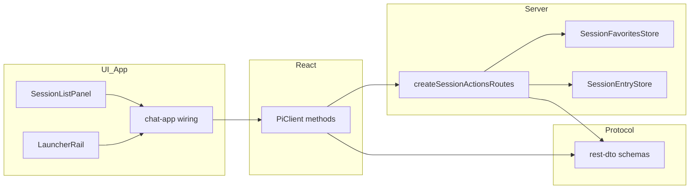
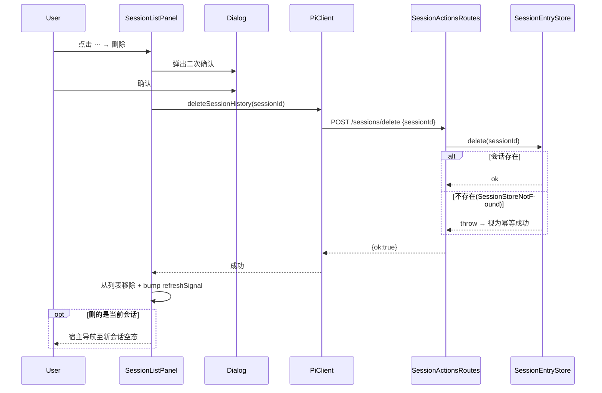
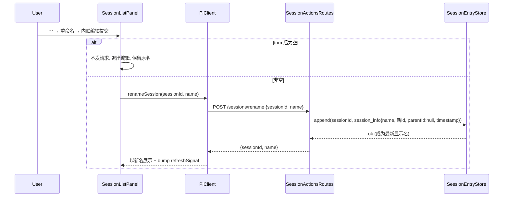

# 技术设计文档 — session-list-item-actions

## Overview

**Purpose**：为会话列表（`SessionListPanel`）的每个会话项提供右侧操作菜单，交付**删除 / 重命名 / 收藏置顶**三项历史会话管理能力，让用户在聊天界面内整理自己的会话历史。

**Users**：Web UI 使用者在侧栏会话列表中，对历史（非运行中）会话执行项级管理。

**Impact**：在既有只读会话列表之上叠加三条**写接缝**——服务端新增一个「会话操作」路由组与一个「会话收藏」偏好存储，前端在两条列表渲染路径（`SessionListPanel` / `LauncherRail`）上接入操作菜单、内联重命名、二次确认与收藏置顶分区。不改会话运行 / 流式内核，不改冷恢复链路，不改底层会话事件持久化格式。

### Goals
- 每个会话项提供 hover / 键盘可达的 `⋯` 操作菜单，且不与整行「恢复」误触。
- 删除历史会话 = 物理删除（三存储后端一致），带二次确认，幂等。
- 重命名 = 持久化为最新显示名，跨刷新 / 跨视图一致。
- 收藏按 `sessionId` 持久化，列表顶部独立「收藏」分区置顶。
- 三项写操作可由部署门控整体关闭（前端隐藏入口 + 服务端拒绝）。

### Non-Goals
- 会话分叉（fork）、导出、归档（archived 状态字段）。
- 批量选择 / 批量删除；收藏拖拽排序 / 分组 / 打标签。
- 跨机器 / 远端会话管理；改动冷恢复、流式、持久化格式。

## Boundary Commitments

### This Spec Owns
- 「会话操作」HTTP 契约：`POST /sessions/delete`、`POST /sessions/rename`、`GET|POST /sessions/favorites`（经 `createSessionActionsRoutes()` 注入）。
- 「会话收藏」用户偏好存储：`<agentDir>/session-favorites.json`（`SessionFavoritesStore`）——本特性对该文件权威。
- `SessionListPanel` 的项级交互：操作菜单、内联重命名、二次确认、收藏置顶分区、写操作门控下的入口隐藏。
- 对应 protocol DTO（删除 / 重命名 / 会话收藏请求响应）与 `PiClient` 的对应方法。

### Out of Boundary
- 会话恢复（复用既有 `/session/:id` 冷恢复链路，本特性只在删当前会话后触发导航）。
- 会话显示名的**读取 / 派生**规则（沿用 sessions-list + auto-session-title 既有口径；本特性只新增「写入新名」入口）。
- 会话事件持久化格式、`SessionEntryStore` 接口形状（复用既有 `delete()` / `append()` / `displayName()`，不新增 store 方法）。
- agent-source 收藏（`agent-source-favorites.json` / `listFavorites` / `setFavorites`）——语义不同，不复用、不改动。
- 内置 `DELETE /sessions/:id`（停内存会话）语义——不改、不复用。

### Allowed Dependencies
- `SessionEntryStore`（`delete` / `append` / `readHeader` / `list` / `listAll` / `displayName`）与 `sessionStoreConfigFromEnv()`。
- `createFavoritesStore` 的原子写 JSON 范式（作为 `SessionFavoritesStore` 的实现参照，不直接复用其 `AgentSourceFavorite` 类型）。
- HTTP `routes:` 注入接缝、`InjectedRoute` / `RequestContext` / `jsonResponse` / `errorResponse`。
- UI 原语 `popover` / `dialog` / `input` / `button`。
- 依赖方向：`protocol ← server ← react ← ui ← app`（每层只依赖其左侧）。

### Revalidation Triggers
- 三个写端点的路径 / 方法 / 请求响应 schema 变化。
- `session-favorites.json` 形态或所有权变化。
- Router `:id` 门控逻辑（`router.ts:168`）变化——可能影响端点是否需保持无 `:id`。
- 显示名派生口径（`displayName` / `session_info` 语义）变化。
- 门控 env（`NEXT_PUBLIC_PI_WEB_SESSIONS_MANAGE`）默认值 / 语义变化。

## Architecture

### Existing Architecture Analysis
- **只读列表已就位**：`createSessionListRoutes()`（`GET /sessions`）+ `SessionListPanel`（三态 / 分页 / 竞态守卫 / `refreshSignal` 重拉）+ 两条渲染路径（`SessionListPanel` / `LauncherRail`）。本特性叠加写接缝，不改只读链路。
- **路由 `:id` 门控**（`router.ts:168`）：含 `:id` 的路由被内存 `SessionStore.get(id)` 校验，历史会话必然 404。→ **本特性写端点一律无 `:id` 路径参数**，`sessionId` 走 body/query。
- **转发器方法集**：`app/api/sessions/[[...path]]/route.ts` 仅导出 GET/POST/DELETE。→ 写操作统一 **POST**，落 `/sessions/**`，**不改转发器、不新建顶层段**。
- **显示名机制**：最新 `session_info.name` = 显示名（fs 扫文件派生 / sqlite·pg 维护 name 列）。→ 重命名 = append 一条新 `session_info`。

### Architecture Pattern & Boundary Map


**Architecture Integration**：
- **选定模式**：注入式路由组 + 独立偏好存储 + 无 `:id` 端点，全面对齐既有 `createSessionListRoutes` / `createFavoritesRoutes` 范式。
- **边界隔离**：会话操作（写事件存储）与会话收藏（写偏好文件）各自单一职责；显示名读取仍归 sessions-list。
- **保留模式**：三态渲染、竞态守卫、`refreshSignal` 重拉、双重门控（构建期内联 + 服务端权威）。

### Technology Stack
| Layer | Choice / Version | Role in Feature | Notes |
|-------|------------------|-----------------|-------|
| Frontend | React 19 + 既有 `popover`/`dialog`/`input` | 操作菜单 / 内联重命名 / 二次确认 / 收藏分区 | 无新第三方原语 |
| Backend | `createSessionActionsRoutes()` + `SessionFavoritesStore` | 三写端点 + 收藏偏好读写 | 复用 `SessionEntryStore`，无新 store 方法 |
| Data | fs/sqlite/postgres 会话存储 + `session-favorites.json` | 物理删除 / append session_info / 收藏集合 | 原子写 JSON（tmp+rename） |
| Contract | zod schema（protocol rest-dto） | 端点 DTO + `PiClient` 类型 | 携带 `protocolVersion` 语义不变 |

## File Structure Plan

### 新增文件
```
packages/server/src/session-actions/
├── index.ts                       # 桶导出
├── session-actions-routes.ts      # createSessionActionsRoutes(): delete/rename/favorites 四端点
└── session-favorites-store.ts     # SessionFavoritesStore: <agentDir>/session-favorites.json 原子读写

packages/ui/src/elements/
└── session-item-menu.tsx          # ⋯ 操作菜单(基于 popover)+ 内联重命名 + 删除二次确认(dialog)
```

### 修改文件
- `packages/protocol/src/transport/rest-dto.ts` — 新增 `DeleteSessionRequest`、`RenameSessionRequest`/`RenameSessionResponse`、`ListSessionFavoritesResponse`、`SetSessionFavoritesRequest` 的 schema 与类型。
- `packages/server/src/index.ts` — 导出 `createSessionActionsRoutes` 与 store/类型。
- `packages/react/src/client/pi-client.ts` — `PiClient` 新增 `deleteSessionHistory` / `renameSession` / `listSessionFavorites` / `setSessionFavorites`。
- `packages/ui/src/elements/session-list-panel.tsx` — 项级操作菜单挂载、收藏置顶分区、写门控入口隐藏、操作后一致性；新增可选回调 props。
- `packages/ui/src/elements/index.ts` — 导出 `SessionItemMenu`（如需）。
- `lib/app/pi-handler.ts` — 注入 `createSessionActionsRoutes({ storeConfig, agentDir, manageEnabled, defaultCwd })`，读 `NEXT_PUBLIC_PI_WEB_SESSIONS_MANAGE`。
- `components/chat-app.tsx` — 两条渲染路径接入新回调 + 门控开关；写成功后 bump `sessionListRefreshKey`；删当前会话后 `window.location.assign('/session/new'|'/')`。

> 依赖方向严格向左：protocol → server → react → ui → app。`session-actions-routes.ts` 仅依赖 protocol + session-store + http；`session-item-menu.tsx` 仅依赖 protocol 类型 + ui 原语。

## System Flows

### 删除（历史会话，含删当前会话）

关键：门控关闭 → 端点 403 不改存储；存储错误 → 保留列表项 + 可见错误。

### 重命名


## Requirements Traceability

| Requirement | Summary | Components | Interfaces | Flows |
|-------------|---------|------------|------------|-------|
| 1.1–1.6 | 操作菜单入口、不误触恢复、data-* | SessionItemMenu, SessionListPanel | popover 菜单 | — |
| 2.1–2.2 | 删除二次确认 / 取消 | SessionItemMenu, Dialog | — | 删除流 |
| 2.3, 2.6 | 物理删除 / 幂等 | SessionActionsRoutes, SessionEntryStore | `POST /sessions/delete` | 删除流 |
| 2.4 | 删除后即时移除 | SessionListPanel | refreshSignal + 乐观移除 | 删除流 |
| 2.5 | 删当前会话导航 | chat-app 宿主 | window.location.assign | 删除流 |
| 2.7 | 删除错误保留项 | SessionListPanel | 错误态 | 删除流 |
| 2.8, 3.7, 4.9, 6.1–6.2 | 写门控 | pi-handler, SessionActionsRoutes, chat-app | `manageEnabled` / 403 | — |
| 3.1, 3.4, 3.5 | 内联编辑 / 空名 / 取消 | SessionItemMenu, Input | — | 重命名流 |
| 3.2, 3.3 | 持久化最新显示名 / 跨刷新一致 | SessionActionsRoutes, SessionEntryStore | `POST /sessions/rename` | 重命名流 |
| 3.6 | 重命名错误保留原名 | SessionListPanel | 错误态 | 重命名流 |
| 4.1–4.2 | 收藏 / 取消收藏持久化 | SessionActionsRoutes, SessionFavoritesStore | `POST /sessions/favorites` | — |
| 4.3–4.5 | 收藏置顶分区 / 无则不渲染 / 一致操作 | SessionListPanel | GET /sessions/favorites | — |
| 4.6 | 按 sessionId 跨视图一致 | SessionFavoritesStore | sessionIds 集合 | — |
| 4.7 | 失效收藏项容错 | SessionListPanel | 求交跳过 | — |
| 4.8 | 收藏读写错误 | SessionListPanel | 错误态 | — |
| 5.1–5.4 | 一致性 / 在途反馈 / 竞态守卫 / 瞬态不打断 | SessionListPanel | reqIdRef + refreshSignal | — |
| 6.3–6.4 | 写范围受限 / 参数校验 | SessionActionsRoutes | zod 校验 | — |

## Components and Interfaces

| Component | Domain/Layer | Intent | Req Coverage | Key Dependencies (P0/P1) | Contracts |
|-----------|--------------|--------|--------------|--------------------------|-----------|
| rest-dto 追加 | Protocol | 端点 DTO | 2,3,4,6 | zod (P0) | API |
| SessionActionsRoutes | Server | 删除/重命名/收藏端点 | 2,3,4,6 | SessionEntryStore (P0), SessionFavoritesStore (P0) | API/Service |
| SessionFavoritesStore | Server | 收藏偏好原子读写 | 4 | node:fs (P0) | State |
| PiClient 追加 | React | 端点客户端方法 | 2,3,4 | rest-dto (P0) | Service |
| SessionItemMenu | UI | ⋯ 菜单/重命名/确认 | 1,2,3,4 | popover/dialog/input (P0) | — |
| SessionListPanel 扩展 | UI | 分区/门控/一致性 | 1,2,3,4,5 | SessionItemMenu (P0) | State |
| chat-app 接线 | App | 两路接线/导航/门控 | 2.5,6 | PiClient (P0) | — |

### Protocol

#### rest-dto 追加
**Contracts**: API [x]

```typescript
// 请求/响应 zod schema（此处示意推断类型）
interface DeleteSessionRequest { sessionId: string }              // POST /sessions/delete
interface RenameSessionRequest { sessionId: string; name: string } // POST /sessions/rename
interface RenameSessionResponse { sessionId: string; name: string }
interface ListSessionFavoritesResponse { sessionIds: string[] }    // GET /sessions/favorites
interface SetSessionFavoritesRequest { sessionIds: string[] }      // POST /sessions/favorites → ListSessionFavoritesResponse
```
- **校验**：`sessionId` 非空字符串；`name` trim 后非空且 `≤ 200`；`sessionIds` 为字符串数组（去重、丢空）。删除 / 收藏成功回显 `CommandAck` 风格或最新集合。

### Server

#### SessionActionsRoutes
| Field | Detail |
|-------|--------|
| Intent | 承载删除 / 重命名 / 会话收藏四端点，全部无 `:id` 路径参数 |
| Requirements | 2.3, 2.6, 2.8, 3.2, 3.7, 4.1, 4.2, 4.9, 6.2, 6.3, 6.4 |

**Responsibilities & Constraints**
- 端点：`POST /sessions/delete`、`POST /sessions/rename`、`GET /sessions/favorites`、`POST /sessions/favorites`。
- 惰性单例 store（同 `createSessionListRoutes`，`storeConfig` 同源）；收藏走 `SessionFavoritesStore`。
- `manageEnabled=false` → 三个**写**端点返回 `403 SESSIONS_MANAGE_DISABLED` 且不改存储；`GET /sessions/favorites` 不受门控。
- 删除：`store.delete(sessionId)`；命中 `SessionStoreNotFoundError` → 幂等成功。
- 重命名：`store.append(sessionId, { type:"session_info", name, id: randomUUID(), parentId: null, timestamp: nowIso })`；会话不存在 → `404`（无法命名不存在会话）。
- 收藏 set：全量替换写 `session-favorites.json`，回读落盘结果。

**Dependencies**
- Outbound: `SessionEntryStore` — delete/append/readHeader（P0）
- Outbound: `SessionFavoritesStore` — 收藏读写（P0）
- Inbound: `PiClient` via HTTP（P0）

**Contracts**: API [x] / Service [x]

##### API Contract
| Method | Endpoint | Request | Response | Errors |
|--------|----------|---------|----------|--------|
| POST | /sessions/delete | DeleteSessionRequest | CommandAck | 400, 403, 500 |
| POST | /sessions/rename | RenameSessionRequest | RenameSessionResponse | 400, 403, 404, 500 |
| GET | /sessions/favorites | — | ListSessionFavoritesResponse | 500 |
| POST | /sessions/favorites | SetSessionFavoritesRequest | ListSessionFavoritesResponse | 400, 403, 500 |

**Implementation Notes**
- Integration: 经 `pi-handler.ts` 的 `routes:` 注入，与 `createSessionListRoutes` 并列；`agentDir` + `NEXT_PUBLIC_PI_WEB_SESSIONS_MANAGE` 由 handler 传入。
- Validation: body 经 zod safeParse；非法 → `400 INVALID_REQUEST`（含出错字段）。
- Risks: append 的 `id` 用 `randomUUID` 规避幂等键碰撞；`parentId:null` 使 session_info 不挂 message 树（与 header 同类「不参与树结构」）。

#### SessionFavoritesStore
| Field | Detail |
|-------|--------|
| Intent | `<agentDir>/session-favorites.json` 的容错原子读写 |
| Requirements | 4.1, 4.2, 4.6, 4.8 |

**Contracts**: State [x]

##### State Management
- **State model**：`{ sessionIds: string[] }`（去重、丢空串）。
- **Persistence & consistency**：`list()` 缺失 / 坏 JSON → `[]`（不使请求失败）；`set()` 原子写（`tmp`（pid+单调计数）→ rename）。
- **Concurrency**：全量替换幂等；无跨字段事务。

**Implementation Notes**
- Integration: 直接参照 `createFavoritesStore` 实现范式，替换 payload 键为 `sessionIds`（不复用 `AgentSourceFavorite` 类型）。

### React

#### PiClient 追加（Service）
```typescript
interface PiClient {
  // …existing…
  deleteSessionHistory(sessionId: string): Promise<CommandAck>;                 // POST /sessions/delete
  renameSession(sessionId: string, name: string): Promise<RenameSessionResponse>; // POST /sessions/rename
  listSessionFavorites(): Promise<ListSessionFavoritesResponse>;                // GET /sessions/favorites
  setSessionFavorites(req: SetSessionFavoritesRequest): Promise<ListSessionFavoritesResponse>; // POST /sessions/favorites
}
```
- 命名与既有 `deleteSession`（停内存会话）/ `listFavorites`（agent source）显式区分，避免混淆。

### UI

#### SessionItemMenu（新增）
| Field | Detail |
|-------|--------|
| Intent | 单个会话项的 ⋯ 菜单 + 内联重命名态 + 删除二次确认 |
| Requirements | 1.2, 1.3, 1.4, 1.5, 2.1, 2.2, 3.1, 3.4, 3.5, 4.5 |

**Responsibilities & Constraints**
- 基于 `popover` 渲染「重命名 / 删除 / 收藏·取消收藏」菜单项；`dialog` 承载删除确认；`input` 承载内联重命名。
- 菜单触发与整行恢复隔离：触发按钮 `stopPropagation`，不冒泡到整行 `onResume`（Req 1.4）。
- 全部交互经注入回调上抛，不持 pi 接线（延续面板「不持接线」约束）。
- data-* 定位：`data-pi-session-item-menu` / `-menu-rename` / `-menu-delete` / `-menu-favorite` / `-rename-input` / `-delete-confirm`。

**Implementation Notes**：presentational + 少量本地态（菜单开合 / 编辑态 / 确认态）；无新边界，故 summary 级。

#### SessionListPanel 扩展（State）
| Field | Detail |
|-------|--------|
| Intent | 收藏置顶分区、写门控入口隐藏、操作后一致性、在途反馈 |
| Requirements | 1.1, 1.6, 2.4, 2.7, 3.3, 3.6, 4.3, 4.4, 4.6, 4.7, 4.8, 5.1–5.4 |

**Responsibilities & Constraints**
- 新增可选 props（不破坏既有调用）：`manageEnabled?: boolean`、`onDeleteSession?`、`onRenameSession?`、`favoriteSessionIds?: readonly string[]`、`onToggleFavorite?`、以及收藏加载 / 错误态文案。
- **收藏分区**：以 `favoriteSessionIds ∩ 当前视图会话` 求交，命中项在顶部独立分区置顶；分区内不与普通列表重复渲染同一会话（普通列表排除已收藏项）；交集为空 → 不渲染分区（Req 4.4）；失效收藏 id（不在当前会话集合）自然被求交跳过（Req 4.7）。
- **门控**：`manageEnabled=false` → 不渲染 ⋯ 写入口（Req 6.1）；收藏分区仍按已读收藏展示（Req 4.9）。
- **一致性**：写成功 → 乐观更新（删除移除 / 重命名改名 / 收藏移动分区）+ 由宿主 bump `refreshSignal` 拉权威态；沿用 `reqIdRef` 竞态守卫（Req 5.3）；在途禁用重复触发（Req 5.2）；菜单 / 编辑 / 确认瞬态不改变当前高亮与所在 Tab（Req 5.4）。
- **错误**：写失败展示可见错误并回滚乐观更新（保留原项 / 原名 / 原收藏态，Req 2.7/3.6/4.8）。

**Implementation Notes**：`LauncherRail` 走同一批 props / 回调，chat-app 两路一致接线。

### App 接线（chat-app + pi-handler）
- `pi-handler.ts`：注入 `createSessionActionsRoutes({ storeConfig: sessionStoreConfigFromEnv(), agentDir, defaultCwd, manageEnabled })`；`manageEnabled = NEXT_PUBLIC_PI_WEB_SESSIONS_MANAGE !== "false" && !== "0"`（默认启用）。
- `chat-app.tsx`：读同名 NEXT_PUBLIC（构建期内联）传 `manageEnabled`；实现 `onDeleteSession`（调 `deleteSessionHistory` → 成功后：非当前会话 bump 刷新；当前会话 `window.location.assign` 到新会话空态）、`onRenameSession`（调 `renameSession` → bump 刷新）、`onToggleFavorite`（读→算→写 `setSessionFavorites` → 更新 `favoriteSessionIds` + 可选同步导航区）；`favoriteSessionIds` 经 `listSessionFavorites` 拉取。两条渲染路径均接线。

## Data Models

### session-favorites.json（新增，本特性权威）
- 位置：`<agentDir>/session-favorites.json`。
- 形态：`{ "sessionIds": string[] }`。
- 规则：去重、丢空串；缺失 / 坏 JSON → 视为空集；原子写。

### session_info 追加（复用既有事件模型，不改格式）
- 重命名向目标会话 append 一条 `SessionInfoEntry = { type:"session_info", name, id, parentId:null, timestamp }`。
- 语义：成为最新 `session_info` → 三后端一致地更新显示名（fs 扫文件 / sqlite·pg 更新 name 列）。
- 不变式：append-only、`(sessionId, id)` 幂等、不重写既有条目、不破坏 `read()` 回放。

## Error Handling

### Error Strategy
| 场景 | 服务端 | 前端 |
|------|--------|------|
| 请求体非法（缺 sessionId / 空名 / 超长） | `400 INVALID_REQUEST`（含字段） | 阻止提交 / 提示 |
| 写操作被门控关闭 | `403 SESSIONS_MANAGE_DISABLED` 不改存储 | 不渲染写入口（一般不触发） |
| 删除目标不存在 | 幂等成功（`{ok:true}`） | 从列表移除 |
| 重命名目标不存在 | `404 SESSION_NOT_FOUND` | 提示 + 保留原名 |
| 存储读写异常 | `500 INTERNAL` | 可见错误 + 回滚乐观更新 |

### Monitoring
- 复用既有 HTTP 错误响应结构（`errorResponse` code）；存储层错误吞并转 500，不泄露内部细节。

## Testing Strategy

> 遵循本项目硬规则：单测/集成 + e2e，均以新鲜运行输出为证（`kiro-verify-completion`）。

### Unit Tests
- **protocol**：4 组 DTO schema 的 parse / reject（空 sessionId、空/超长 name、非数组 sessionIds）。
- **session-favorites-store**：缺失文件 → `[]`；坏 JSON → `[]`；`set` 后 `list` 往返一致 + 去重丢空；原子写不产生半写。
- **session-actions-routes**：删除已存在 → 200 + `store.delete` 调用；删除不存在 → 幂等 200；重命名 → append `session_info` 且 `displayName` 更新；重命名空/超长 → 400；重命名不存在会话 → 404；`manageEnabled=false` → 三写端点 403 且未触达存储、GET favorites 仍 200；favorites GET/POST 往返。
- **ui**：菜单 hover/focus 显现且点击不触发 `onResume`（Req 1.4）；删除二次确认 → 确认才回调、取消不回调；重命名空名不提交 / Esc 取消保留原名；收藏分区求交置顶、交集空不渲染、失效 id 跳过；`manageEnabled=false` 隐藏写入口；写失败回滚乐观更新；data-* 属性存在。

### Integration Tests
- **真实 store（fs + sqlite 各一）**：append `session_info` 后 `read()` 完整回放且 `displayName`/`list().name` 反映新名；`delete()` 后 `list`/`readHeader` 不再返回该会话（跨后端一致）。

### E2E（浏览器，stub agent，隔离 build）
- 环境：`NEXT_DIST_DIR=.next-e2e` + external server + `PI_WEB_STUB_AGENT=1` + `NEXT_PUBLIC_PI_WEB_SESSIONS_MANAGE` 开启 + 隔离 `agentDir` 种子多条会话。
- 路径 1（重命名）：⋯ → 重命名 → 输入新名提交 → 列表即时显示新名 → 刷新后仍为新名。
- 路径 2（收藏置顶）：⋯ → 收藏 → 目标会话出现在顶部收藏分区；取消收藏 → 归位。
- 路径 3（删除）：⋯ → 删除 → 二次确认 → 会话从列表消失；刷新后不再出现。

## Security Considerations
- **门控**：`NEXT_PUBLIC_PI_WEB_SESSIONS_MANAGE` 双重保险（前端隐藏入口 + 服务端 403），面向只读 / 受限部署避免误删改。
- **写范围最小化**：端点仅操作目标 `sessionId` 的既有存储条目与本特性收藏文件，不触及无关会话 / 无关存储（Req 6.3）。
- **输入校验**：`name` 限长防滥用；`sessionId` 必填；收藏集合数组化与去重。
- 复用既有鉴权 / 会话授权中间件；无 `:id` 端点不经会话级 `authorizeSession`，但写操作受门控与 body 校验约束（历史会话管理本就跨会话，符合列表端点既有安全模型）。

## Open Questions / Risks
- 删除当前会话后的落点路由（新会话空态）取宿主既有「新建 / 首页」入口；若无独立空态路由，回退到根路由。实现期确认 `chat-app` 现有新建入口。
- 删除会话是否顺带清理 app 级 `sessionId → source` 映射（`forgetSessionSource`）：best-effort、非阻塞，实现期视成本决定是否接入（不接入也不影响正确性）。
