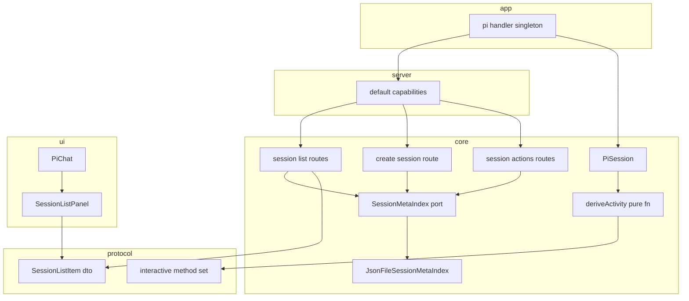
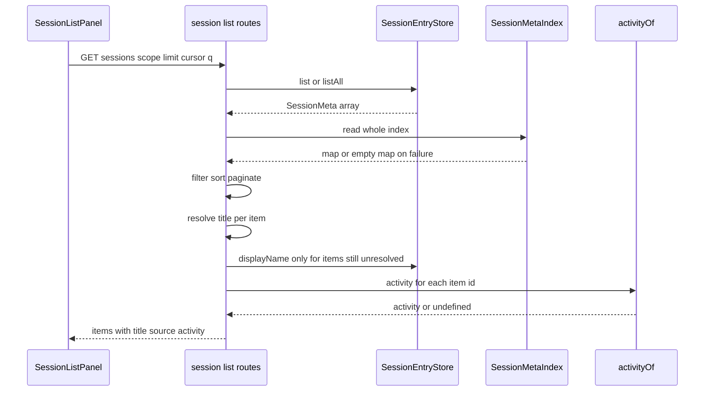
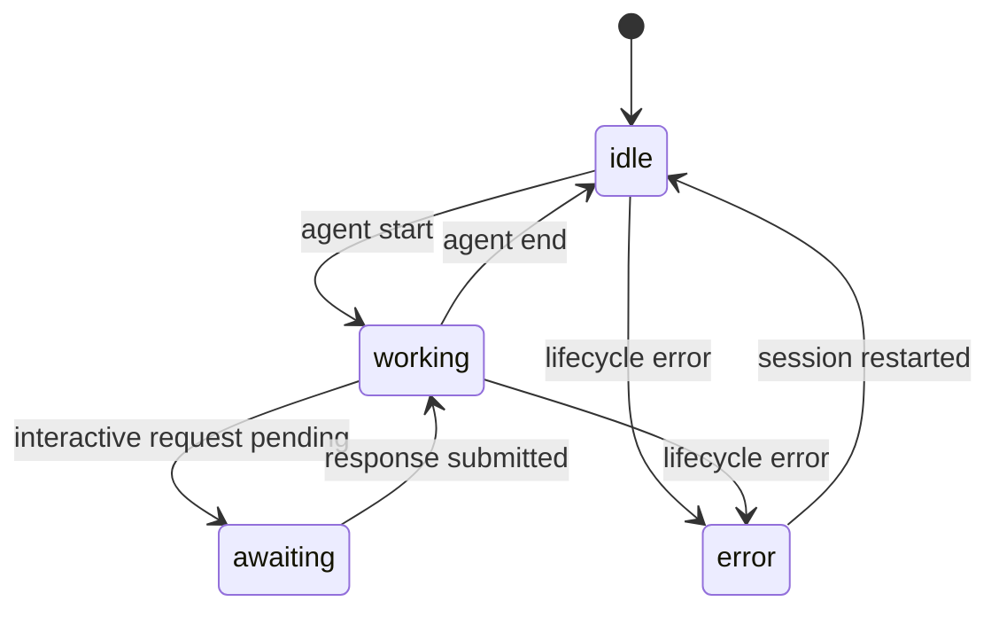
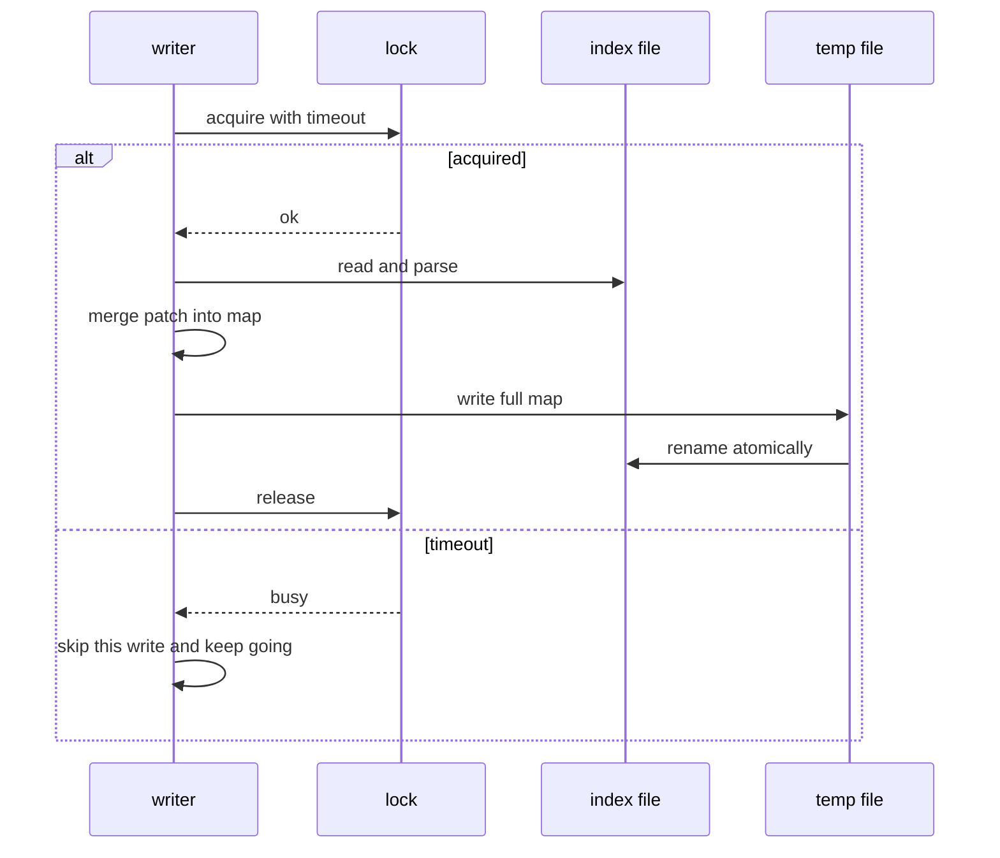

# Design Document — session-meta-index

## Overview

本特性为会话列表补两样东西：一顶**可快速读取的展示元数据「帽子」**（标题、所属 agent-source），与一个**运行时工作状态投影**（工作中 / 等待用户交互 / 异常）。

**Purpose**：让会话列表不必逐项顺读整份 jsonl 就能显示标题，让 `SessionListItem.source` 这个既有空壳字段第一次有值，并让用户在多会话并行时从列表上直接看出哪条在跑、哪条在等自己回应。

**Users**：pi-web 的日常使用者（web / 桌面版），以及部署方（元数据不产生迁移负担、不改变 CLI 行为）。

**Impact**：新增一个**独立于会话 jsonl** 的集中元数据索引（缓存语义），扩展 `GET /sessions` 的投影，扩展会话列表面板的渲染，并把前端的列表刷新触发从「轮次结束」扩展到「活跃态变化」。会话 jsonl 的位置、命名、字节格式**零改动**。

### Goals

- 列表取标题与来源**不读会话正文**，且索引命中时不再为该会话读历史文件（1.x / 2.x）。
- 元数据的任何缺失、损坏、并发写竞争都**不影响**会话能否被列出与恢复（3.x / 4.x）。
- 列表项显示标题、来源标识、来源稳定色条，与三种非空闲状态（6.x / 7.x）。
- 状态变化在轮次**开始**与**结束**、以及开始等待用户回应时都能及时可见（8.x）。
- 零迁移、零 CLI 行为变化（9.x）。

### Non-Goals

- 不改 jsonl 格式，不新增 entry 类型。
- 不做图标与图标选择器（以来源色条替代）。
- 不做「工具调用中」「排队中」等更细状态（信号未归约进权威快照）。
- 不做工作状态的实时推送通道（本期读取时聚合 + 既有刷新信号）。
- 不修服务端挂起表混入推送类请求这一存量问题（见 research，仅按 method 过滤规避）。
- 不改列表既有的分页、排序、系统视图门控、名称搜索语义。

## Boundary Commitments

### This Spec Owns

- **会话展示元数据的存储契约与实现**：`SessionMetaIndex` 端口 + 集中 JSON 文件实现（含原子写、跨进程互斥、损坏降级、prune）。
- **元数据的写入挂点接线**：会话创建时写 agentSource、标题变化时写 title、改名时写 title、删除会话时清条目。
- **会话活跃态的派生规则**：由既有权威事实（快照 busy / lifecycle / 交互类挂起）派生出 `SessionActivity`，含优先级。
- **列表 DTO 的投影语义**：标题三级优先级、来源、活跃态字段的填充与省略规则。
- **列表项的来源色条派生**（确定性纯函数）与状态指示渲染。
- **前端列表刷新的触发时机**（活跃态变化即 bump）。

### Out of Boundary

- **jsonl 的格式与语义**：外部契约（pi CLI 共写），只做兼容性验证。
- **`SessionSnapshot` 的字段与语义**：归 `session-snapshot-authority`；本设计只消费 `busy` / `lifecycle`，**不新增快照字段**。
- **`SessionEntryStore` 端口契约**：归 `session-store-adapters`；本设计不改其方法签名、不给它加元数据方法。
- **`pendingExtensionUI` 的挂起表语义**：归 `PiSession`；本设计只**读**它并按 method 过滤，不改其登记规则。
- **会话删除 / 改名的交互与路由语义**：归 `session-list-item-actions`；本设计只在其处理链路末端挂元数据写入与清理。
- **列表的分页 / 排序 / 门控 / 搜索**：归 `sessions-list`，行为不变。
- **`auto-session-title` 的标题产生方式**：不接管，只在其产生标题时同步一份。

### Allowed Dependencies

- 依赖方向（严格自左向右，不得反向 import）：

  ```
  protocol → core/session-meta → core/{session, session-list, session-actions, http/routes}
           → server/host-assembly → app(pi-handler) → react → ui
  ```

- `core/session-meta` 只允许依赖 Node 内置能力与 `protocol`；**不得**引入任何新的第三方依赖（内核包依赖纪律，`core-package-extraction` R1.2）。
- `core/session-list` 允许依赖 `SessionMetaIndex` 端口与注入的 `activityOf` 回调，**不得**直接 import `SessionManager` 或活跃会话注册表。
- `core/session-meta` **不得**依赖 `SessionEntryStore`（重建标题时由调用方把 store 传进来，端口本身不认识持久化后端）。
- UI 层只消费 DTO 字段，**不得**自行推断状态。

### Revalidation Triggers

以下变更须让下游重新核对集成：

- `SessionListItem` 增删字段或改变字段省略语义（消费者：面板、桌面版、CLI）。
- `SessionActivity` 取值集合或优先级变化。
- `RpcExtensionUIRequest` 新增 method（必须同时归入交互类或推送类，否则活跃态判定失准 —— 差集守卫测试会红）。
- `SessionSnapshot` 的 `busy` / `lifecycle` 语义变化。
- 索引文件路径或落盘形态变化（部署方可能已备份/挂载该路径）。
- `SessionEntryStore.list/listAll` 返回的 `name` 语义变化（标题优先级第一级依赖它）。

## Architecture

### Existing Architecture Analysis

- 会话持久化：`~/.pi/agent/sessions/<cwd 桶>/<时间戳>_<id>.jsonl`（`fs-store.ts:38/57/59`），pi CLI 共写。
- 列表端点 `GET /sessions` 经能力面装配注入（`default-capabilities.ts:168`，冻结 id `session.list`），只认 `SessionEntryStore`。
- 标题现状：fs 后端靠 `displayName` 顺读整份 jsonl（`session-list-routes.ts:137`，有界并发池限流）；sqlite/postgres 在 append `session_info` 时维护 `name` 列。
- 活跃态现状：`SessionSnapshot`（`busy`/`lifecycle`）是服务端唯一权威，经 `control: session-state` 粘性帧下发，作用域为单会话。
- 术语双生（务必区分）：`SessionStore` = **活跃会话注册表**（内存，`session-store.ts`）；`SessionEntryStore` = **持久化事件存储**（`session-store/types.ts`）。

### Architecture Pattern & Boundary Map



**Architecture Integration**：

- **选定模式**：端口 + 单实现适配器（`SessionMetaIndex` / `JsonFileSessionMetaIndex`）+ 纯函数派生（`deriveActivity`）+ 装配层注入。与既有 `SessionEntryStore` 端口、`reduceSnapshot` 纯归约、能力面装配三种既有模式同构。
- **边界隔离**：列表路由不认识活跃会话注册表（只收一个 `activityOf` 回调）；索引端口不认识持久化后端；派生规则是无 IO 纯函数（可穷举测试）。
- **保留的既有模式**：能力面冻结 id 装配、`InjectedRoute` 注入接缝、DTO 可选字段纯增量（旧消费者忽略未知字段）。
- **为何只有一个索引实现**（简化 lens）：sqlite/postgres 的 `name` 列已使 title 加速无必要，而 agentSource 走同一个索引即可覆盖全部后端 —— 不为每个后端各造一套元数据落法。

### Technology Stack

| Layer | Choice / Version | Role in Feature | Notes |
|-------|------------------|-----------------|-------|
| Frontend | React（既有 `packages/ui`） | 色条、状态指示、活跃态变化 bump | 无新依赖 |
| Backend | `@blksails/pi-web-core`（既有） | 索引端口与实现、派生、投影 | 仅 Node 内置：`fs/promises`、`path`、`os` |
| Data / Storage | 单个 JSON 文件 | 集中元数据索引 | 默认 `~/.pi/agent/piweb-session-index.json`，在 sessions 目录**之外** |
| Messaging / Events | 无新增 | 活跃态经 REST 读取时聚合 | 不新增控制帧 |
| Infrastructure | 无新增 | — | 无迁移、无新 env 必填项 |

新增可选 env：`PI_WEB_SESSION_META_INDEX_PATH`（覆盖索引路径；缺省用默认路径）。

## File Structure Plan

### Directory Structure

```
packages/core/src/
├── session-meta/                    # 本 spec 的新边界
│   ├── types.ts                     # SessionMetaEntry / SessionMetaIndex 端口 / SessionActivity
│   ├── json-file-index.ts           # 集中 JSON 文件实现:锁下 RMW + tmp+rename + 校验降级 + prune
│   └── index.ts                     # barrel(仅导出端口、实现、默认路径解析)
└── session/
    └── derive-activity.ts           # 纯函数:(snapshot, pendingMethods) → SessionActivity | undefined

packages/ui/src/elements/
└── session-source-color.ts          # 纯函数:来源标识 → 稳定 accent 色(调色板取模)
```

### Modified Files

- `packages/protocol/src/rpc/extension-ui.ts` — 导出 `INTERACTIVE_EXTENSION_UI_METHODS`（交互四类，单一权威）与其类型。
- `packages/protocol/src/transport/rest-dto.ts` — `SessionListItemSchema` 增可选 `activity`（`"working" | "awaiting-input" | "error"`）；`source` 字段沿用不改。
- `packages/core/src/session/pi-session.ts` — 新增 `get activity()`（经 `deriveActivity` 派生）；新增可选 `onTitleChanged?(sessionId, title)` 回调并在处理 `setTitle` 请求时触发。
- `packages/core/src/session-list/session-list-routes.ts` — 新增可选 `metaIndex` / `activityOf` 依赖；页内投影标题三级优先级、来源、活跃态；搜索路径改用索引标题。
- `packages/core/src/http/routes/create-session.ts` — 会话创建成功后写 `agentSource = resolved.policySource`（经可选注入，失败静默）。
- `packages/core/src/session-actions/session-actions-routes.ts` — rename 成功后写 title；delete 成功后清索引条目。
- `packages/server/src/host-assembly/default-capabilities.ts` — `HostDeps` 增 `sessionMetaIndex?` 与 `sessionActivityOf?`，透传给三个路由工厂。
- `lib/app/pi-handler.ts` — 构造索引单例；由 `SessionManager` 构造 `sessionActivityOf`；接 `onTitleChanged`。
- `packages/ui/src/elements/session-list-panel.tsx` — 渲染来源色条与状态指示（转圈 / 等待 / 异常）。
- `packages/ui/src/chat/pi-chat.tsx` — 新增 `onActivityChange?()`，在 `isBusy` **双边沿**与交互挂起数 0↔非0 边沿触发；`onTurnEnd` 语义保持不变。
- `components/chat-app.tsx` — 接 `onActivityChange` bump `sessionListRefreshKey`。

## System Flows

### 列表请求的投影流程



关键决策：索引读取**每请求一次**（整份），不做进程内缓存 —— 一次文件读远低于每项扫 jsonl，且避免缓存失效带来的第二类错误。`displayName` 只对**索引未命中且 store.name 为空**的项调用，仍走既有有界并发池。

### 活跃态派生（状态优先级）



优先级（自高向低）：`awaiting-input` → `error` → `working` → 空闲（字段省略）。`awaiting-input` 高于 `working` 由 7.4 直接要求；`error` 高于 `working` 因 lifecycle 进入 error 时轮次已无意义。

### 元数据写入与并发



关键决策：合并发生在**锁内**（读-合并-写），因此并发写不同会话不会互相覆盖（4.1）；`rename` 保证读者只看到旧或新整份（4.2）；抢锁超时即放弃本次写入（4.3），元数据是展示增强，绝不阻塞会话与列表。

## Requirements Traceability

| Requirement | Summary | Components | Interfaces | Flows |
|-------------|---------|------------|------------|-------|
| 1.1 | 创建时存 agentSource | create-session 路由, JsonFileSessionMetaIndex | `merge(id, {agentSource})` | 元数据写入 |
| 1.2 | 标题变化时存 title | PiSession `onTitleChanged`, pi-handler 接线 | `merge(id, {title})` | 元数据写入 |
| 1.3 | 改名时存 title | session-actions rename | `merge(id, {title})` | 元数据写入 |
| 1.4 | 只存轻量字段 | `SessionMetaEntry` 类型 | 类型即约束（无正文字段） | — |
| 1.5 | 不改 jsonl | 索引独立文件 | — | — |
| 1.6 | 进程结束后仍可展示 | 索引持久化于文件 | `read()` | 列表投影 |
| 2.1 | 取元数据不读正文 | session-list 投影 | `read()` | 列表投影 |
| 2.2 | 命中即不扫历史 | 标题优先级第二级 | `resolveTitle` | 列表投影 |
| 2.3 | 未命中退回既有派生 | 标题优先级第三级 | `store.displayName` | 列表投影 |
| 2.4 | 搜索语义不变 | session-list 搜索分支 | 同一子串匹配 | 列表投影 |
| 2.5 | 读取次数下降且有证据 | 性能验证项 | — | 测试策略 |
| 3.1 | 索引不存在仍正常 | JsonFileSessionMetaIndex 读降级 | `read()` → 空 map | 列表投影 |
| 3.2 | 无法解析按不存在处理 | 同上 | `read()` 吞解析错 | 列表投影 |
| 3.3 | 坏条目跳过、保留可用字段 | 条目级校验 | `read()` 逐条校验 | 列表投影 |
| 3.4 | 判定不可用后可重建 | `merge()` 覆盖写 | `merge()` | 元数据写入 |
| 3.5 | 读写失败不影响列出/恢复 | 全部调用点静默吞错 | — | 列表投影 |
| 3.6 | 可从历史重建标题 | 回退 + 回填 | `store.displayName` + `merge()` | 列表投影 |
| 4.1 | 并发不丢别人的条目 | 锁内 RMW | `merge()` | 并发写入 |
| 4.2 | 不读到中间态 | tmp + rename | `read()` / `merge()` | 并发写入 |
| 4.3 | 抢不到就放弃 | 锁超时 | `merge()` | 并发写入 |
| 4.4 | 同字段后写者赢 | 锁内 merge 覆盖 | `merge()` | 并发写入 |
| 5.1 | 删会话清条目 | session-actions delete | `remove(id)` | 元数据写入 |
| 5.2 | 孤儿条目不呈现 | 列表以 store 为准 | 投影只富集 | 列表投影 |
| 5.3 | 提供清理手段 | `prune(existingIds)` | `prune()` | 元数据写入 |
| 6.1 | 显示标题 | SessionListPanel | DTO `name` | — |
| 6.2 | 显示来源标识 | SessionListPanel | DTO `source` | — |
| 6.3 | 来源色条同源同色 | `sourceAccentColor` | 纯函数 | — |
| 6.4 | 颜色对来源稳定 | 同上（确定性哈希） | 纯函数 | — |
| 6.5 | 无来源不显示且不错位 | SessionListPanel | 条件渲染 | — |
| 6.6 | 既有信息与交互不变 | SessionListPanel | 既有 props 不动 | — |
| 7.1 | 工作中指示 | `deriveActivity`, Panel | DTO `activity` | 活跃态派生 |
| 7.2 | 等待用户交互指示 | `deriveActivity` + method 过滤 | `INTERACTIVE_EXTENSION_UI_METHODS` | 活跃态派生 |
| 7.3 | 异常指示且仍可恢复 | `deriveActivity`, Panel | DTO `activity` | 活跃态派生 |
| 7.4 | 等待优先于工作中 | 派生优先级 | 纯函数 | 活跃态派生 |
| 7.5 | 未加载恒空闲且不加载 | `activityOf` 只查注册表 | 回调 | 活跃态派生 |
| 7.6 | 空闲不显示指示 | 字段省略 + Panel | DTO 可选字段 | — |
| 7.7 | 只用既有权威 | 派生输入仅快照与挂起表 | 纯函数入参 | 活跃态派生 |
| 7.8 | 状态不持久化 | 索引类型无状态字段 | `SessionMetaEntry` | — |
| 8.1 | 轮次开始刷新 | PiChat `onActivityChange` | 上升边沿 | — |
| 8.2 | 轮次结束刷新 | 同上（既有下降边沿保留） | — | — |
| 8.3 | 开始等待用户回应刷新 | 挂起数 0→非0 边沿 | — | — |
| 8.4 | 刷新不闪空不丢滚动 | Panel 既有占位行策略 | — | — |
| 8.5 | 跨会话在下次刷新或轮询周期内可见 | PiChat 边沿 + 面板轮询 | — | — |
| 8.6 | 有非空闲项且可见时周期查询 | SessionListPanel 轮询 | `activityPollMs` | 状态轮询 |
| 8.7 | 全空闲或不可见时停止查询 | 同上（启停条件） | — | 状态轮询 |
| 8.8 | 轮询只更新状态,不动列表长度/顺序/分页 | 同上（按 id 合并 activity） | — | 状态轮询 |
| 8.9 | 可配置关闭 | 同上（`activityPollMs<=0`） | — | — |
| 9.1 | 会话文件不变 | 索引独立 | — | — |
| 9.2 | CLI 不受影响 | 索引在 sessions 目录外 | — | 兼容验证 |
| 9.3 | 无需迁移 | 索引缺失即空 | `read()` | 列表投影 |
| 9.4 | 列表既有语义不变 | 投影为纯增量 | — | 列表投影 |
| 9.5 | 不产生第二权威 | 标题优先级第一级为 store.name | `resolveTitle` | 列表投影 |
| 9.6 | 存量会话来源不保证 | 无来源即不显示 | 条件渲染 | — |
| 9.7 | 存量标题可回填 | 回退后 `merge()` 回填 | `merge()` | 列表投影 |

## Components and Interfaces

| Component | Domain/Layer | Intent | Req Coverage | Key Dependencies (P0/P1) | Contracts |
|-----------|--------------|--------|--------------|--------------------------|-----------|
| `SessionMetaIndex` | core / 端口 | 会话展示元数据的读写契约 | 1, 3, 4, 5 | 无（纯接口） | Service, State |
| `JsonFileSessionMetaIndex` | core / 适配器 | 集中 JSON 文件实现（锁 + 原子写 + 降级） | 3, 4, 5 | Node fs (P0) | Service, State |
| `deriveActivity` | core / 纯函数 | 由既有权威事实派生活跃态 | 7 | protocol method 集合 (P0) | Service |
| `PiSession.activity` | core / 会话 | 暴露单会话活跃态投影 | 7 | `deriveActivity` (P0), 快照与挂起表 (P0) | State |
| session-list 投影 | core / 路由 | 标题优先级、来源、活跃态合入 DTO | 2, 3, 6, 7, 9 | `SessionMetaIndex` (P1), `activityOf` (P1), `SessionEntryStore` (P0) | API |
| 元数据写入挂点 | core / 路由与会话 | 创建写来源、标题变化写标题、删除清条目 | 1, 5 | `SessionMetaIndex` (P1) | Service |
| 装配接线 | server + app | 构造索引与 `activityOf` 并注入 | 1, 5, 7 | `SessionManager` (P0) | Service |
| `sourceAccentColor` | ui / 纯函数 | 来源 → 稳定色 | 6 | 无 | Service |
| `SessionListPanel` 渲染 | ui | 色条与状态指示 | 6, 7 | DTO (P0) | — |
| `PiChat.onActivityChange` | ui | 活跃态变化通知宿主 | 8 | 既有 `isBusy` 与挂起队列 (P0) | Event |

### core / 元数据存储

#### SessionMetaIndex（端口）

| Field | Detail |
|-------|--------|
| Intent | 定义会话展示元数据的读写契约，与存储形态解耦 |
| Requirements | 1.1, 1.2, 1.3, 1.4, 3.4, 4.1, 4.4, 5.1, 5.3 |

**Responsibilities & Constraints**

- 只承载**展示用轻量字段**；类型上不含任何正文派生字段（1.4）与任何运行时状态字段（7.8）。
- 语义为**缓存**：调用方必须能在其失败时继续工作（3.5）。
- 不认识持久化后端（不依赖 `SessionEntryStore`），标题重建由调用方完成后经 `merge` 回填。

**Dependencies**

- Inbound: session-list 投影、create-session 路由、session-actions 路由、pi-handler 接线（P1）
- Outbound: 无
- External: 无

**Contracts**: Service [x] / API [ ] / Event [ ] / Batch [ ] / State [x]

##### Service Interface

```typescript
/** 会话展示元数据(轻量、可缓存、可重建)。字段缺省即「未知」,不编造默认值。 */
export interface SessionMetaEntry {
  /** 最近已知标题(权威仍在会话历史;此处为快读副本)。 */
  readonly title?: string;
  /** 所属 agent-source 稳定标识(来自 ResolvedSource.policySource)。 */
  readonly agentSource?: string;
  /** 最近一次写入时间(ISO),仅用于诊断与 prune 决策,不参与展示。 */
  readonly updatedAt?: string;
}

/** 会话展示元数据索引端口。全部方法**绝不抛出**:失败即视为「无元数据」。 */
export interface SessionMetaIndex {
  /** 读取全量元数据。索引缺失/损坏/无权限 → 返回空 Map(3.1/3.2)。 */
  read(): Promise<ReadonlyMap<string, SessionMetaEntry>>;
  /** 字段级合并写入(锁内 read-merge-write + 原子替换)。抢不到写入机会即放弃(4.3)。 */
  merge(sessionId: string, patch: SessionMetaEntry): Promise<void>;
  /** 移除单个会话的元数据条目(5.1)。 */
  remove(sessionId: string): Promise<void>;
  /** 只保留给定会话集合的条目,清除其余残留(5.3);返回被清除的条目数。 */
  prune(existingSessionIds: Iterable<string>): Promise<number>;
}
```

- Preconditions：`sessionId` 非空字符串。
- Postconditions：`merge` 返回后，若本次未被放弃，则 `read()` 可见该字段值（4.4 后写者赢）。
- Invariants：任何方法都不抛出；`read()` 永不返回部分写入的中间态（4.2）。

#### JsonFileSessionMetaIndex

| Field | Detail |
|-------|--------|
| Intent | 端口的集中 JSON 文件实现 |
| Requirements | 3.1, 3.2, 3.3, 3.4, 4.1, 4.2, 4.3, 4.4, 5.1, 5.3, 9.1, 9.2, 9.3 |

**Responsibilities & Constraints**

- 文件路径：`PI_WEB_SESSION_META_INDEX_PATH` ?? `~/.pi/agent/piweb-session-index.json` —— **必须在 `~/.pi/agent/sessions/` 之外**（9.2）。
- 写路径：获取互斥锁 → 读并解析现有内容 → 合并 → 写临时文件 → `rename` 覆盖 → 释放锁。
- 互斥：以「独占创建」语义的锁标记实现（Node 内置能力，无第三方依赖）；带获取超时；识别并清理**陈旧锁**（超过阈值的残留锁，覆盖持锁进程崩溃的情形）。
- 读路径：文件不存在 / 解析失败 → 空 Map；逐条目校验，字段类型不符则丢弃该字段、保留其余（3.3）。
- 版本位：文件顶层带 `v` 版本号；遇到不认识的版本按「不可用」处理（等价 3.2），下次写入时重建（3.4）。

**Dependencies**

- Inbound: 端口消费者（P1）
- Outbound: 无
- External: Node `fs/promises` / `path` / `os`（P0）

**Contracts**: Service [x] / API [ ] / Event [ ] / Batch [ ] / State [x]

##### State Management

- **状态模型**：`{ v: 1, sessions: Record<sessionId, SessionMetaEntry> }`。
- **持久化与一致性**：单文件全量替换，`rename` 原子；无部分写可见态。
- **并发策略**：跨进程互斥 + 锁内 RMW；同进程内串行由锁自然保证。锁获取失败 → 放弃写入（读不受锁影响）。

**Implementation Notes**

- Integration: 由 `pi-handler` 构造为单例并注入装配层；测试可注入临时目录路径。
- Validation: 条目级校验必须**逐字段**进行，不得因一个坏字段丢弃整条（3.3）。
- Risks: 高并发下写入放弃率上升 → 表现为元数据延迟补齐，可由后续 `merge` 自愈；索引与实际会话漂移由 `prune` + 列表以 store 为准兜住。

#### WorkspaceSessionMetaIndex（云端可实现的第二条实现）

| Field | Detail |
|-------|--------|
| Intent | 让元数据持久化经**宿主状态端口**，使 pi-clouds 注入 TenantWorkspace 后云端可用 |
| Requirements | 1.x, 3.x, 4.1, 4.2, 5.1, 5.3 |

**Responsibilities & Constraints**

- 建在 `WorkspaceNamespace` 之上（本地传 `createLocalWorkspaceNamespace(agentDir)`，
  云端传注入的 `workspace.user`）。M2/M4 已把 config / favorites / per-source / sources
  迁到该端口，本实现补齐会话展示元数据这一块 —— 绕过该端口的持久化在云端根本不可用。
- ★ **每会话一键** `session-meta/<sessionId>.json`，而非整份索引存一个键。这是契约语义
  逼出来的：契约保证「单键原子可见性」但**不提供**跨进程锁，本地 `writeJson(merge:true)`
  就是 `read → deepMerge → writeFileAtomic`；整份索引存一个键时，两个进程并发写不同会话
  会互相覆盖 —— 正是文件实现用自制锁解决的问题，而这里没有锁可用。分键之后不同会话写
  不同键，单键原子性就够，也不需要契约不提供的跨键事务。
- 代价是读放大：全量读要 `list` + N 次 `readJson`。故端口的 `read(sessionIds?)` 允许只读
  当前页 —— 列表常态路径只读 ≤limit 条，全量读只在搜索分支付出。
- **键空间是安全边界**：`sessionId` 来自请求参数，不能假定是 uuid。含 `/`、`..`、控制字符
  等一律拒绝写入（元数据是展示增强，拒写远好过越界）。

**选型（装配层）**

| 形态 | 实现 | 理由 |
|---|---|---|
| 本地（桌面 / dev / npm CLI） | `JsonFileSessionMetaIndex` | 多进程共写同一文件，需要跨进程锁；Workspace 契约不提供 |
| 云端（pi-clouds 自行装配） | `WorkspaceSessionMetaIndex` | 租户隔离由 TenantWorkspace 负责；经 `HostDeps.sessionMetaIndex` 注入，无需改动 pi-web |

两条实现由**一致性套件**（同一批断言跑两遍）共同验收；pi-clouds 可复用该套件形状验收自己那条。

### core / 活跃态派生

#### deriveActivity

| Field | Detail |
|-------|--------|
| Intent | 由既有权威事实派生列表可用的活跃态 |
| Requirements | 7.1, 7.2, 7.3, 7.4, 7.7 |

**Responsibilities & Constraints**

- 纯函数、无 IO、不读时钟；输入只有权威快照与挂起请求的 method 列表（7.7）。
- **必须**按 method 过滤到交互四类；推送类不得计入（见 research：服务端挂起表混入推送类）。
- 空闲返回 `undefined`（而非 `"idle"`），使 DTO 省略字段（7.6）。

**Contracts**: Service [x]

##### Service Interface

```typescript
/** 列表可见的会话活跃态;空闲以 undefined 表达(DTO 省略字段)。 */
export type SessionActivity = "working" | "awaiting-input" | "error";

export interface ActivityInput {
  /** 权威快照的 busy(轮次进行中)。 */
  readonly busy: boolean;
  /** 权威快照的 lifecycle。 */
  readonly lifecycle: SessionLifecycleState;
  /** 当前挂起的 extension-ui 请求 method 列表(未过滤)。 */
  readonly pendingMethods: readonly string[];
}

/** 优先级:awaiting-input > error > working > 空闲(undefined)。 */
export function deriveActivity(input: ActivityInput): SessionActivity | undefined;
```

- Preconditions：无。
- Postconditions：输入相同则输出恒等（可穷举测试）。
- Invariants：`pendingMethods` 中仅交互四类可产生 `awaiting-input`。

#### PiSession.activity（既有组件的扩展）

| Field | Detail |
|-------|--------|
| Intent | 暴露单会话的活跃态投影，供装配层聚合 |
| Requirements | 7.1, 7.2, 7.3, 7.5 |

**Responsibilities & Constraints**

- 只读 getter，内部调用 `deriveActivity`，输入取自既有 `snapshot` 与 `pendingExtensionUI`。
- **不改**挂起表的登记规则、不改快照归约（越界）。
- 同时新增可选回调 `onTitleChanged?(sessionId, title)`：在处理 `setTitle` 请求时触发（标题变化的唯一入站通道），供装配层写索引（1.2）。回调**不得**抛出影响会话流程 —— 调用点须吞错。

**Contracts**: State [x]

### core / 列表投影

#### session-list 投影（既有路由的扩展）

| Field | Detail |
|-------|--------|
| Intent | 把元数据与活跃态合入列表 DTO |
| Requirements | 2.1, 2.2, 2.3, 2.4, 3.1, 3.5, 3.6, 6.x, 7.x, 9.4, 9.5, 9.7 |

**Responsibilities & Constraints**

- 新增两个**可选**依赖：`metaIndex?: SessionMetaIndex`、`activityOf?: (sessionId: string) => SessionActivity | undefined`。二者缺省时行为与今天完全一致（向后兼容，既有测试不改）。
- **标题优先级**（9.5 / 2.2 / 2.3）—— 按后端是否自维护名称**分流**：
  - **store 不实现 `displayName`**（sqlite / postgres：append `session_info` 时已 `UPDATE name`）→ 直接用 `store` 返回的 `name`，索引不参与标题（不产生第二权威，9.5）。
  - **store 实现 `displayName`**（fs：`SessionMeta.name` 仅来自 header，**不随 `session_info` 更新**）→
    1. 索引中的 `title` 非空 → 用它，且**不调用** `displayName`（命中即不扫文件，2.2）；
    2. 否则 `displayName` 派生（既有有界并发池路径），派生到即用并经 `merge` **回填**索引（9.7 / 3.6，回填失败静默）；派生不到则保留 header 的 `name`。

  > ★ 修正记录（实现阶段发现）：本条初稿写作「store.name 非空 → 用它」，那会**回归** fs 后端的既有语义 —— fs 的 `name` 是创建时的 header 名，既有代码刻意用 `displayName` 派生的 `session_info` 名**覆盖**它（`session-list-routes.ts:127-135` 注释明载「不再因 header 已命名而跳过、显示陈旧 header 名」）。按初稿实现会让所有创建时即命名的 fs 会话在列表上显示陈旧标题。故改为按「后端是否自维护名称」分流。
- 搜索分支同样按上述优先级取标题后再做既有子串匹配（2.4），匹配语义不变。
- 索引读取每请求一次、整份读入；失败即空 Map，全部退化到第 1/3 级（3.1 / 3.5）。
- `activity` 仅对 `activityOf` 返回值非 `undefined` 的项写入 DTO；不为取状态加载任何会话（7.5）。
- 分页 / 排序 / 门控 / 游标语义**不动**（9.4）：投影发生在分页**之后**（仅对当前页付出成本），唯一例外是搜索分支必须先解析全量标题（既有行为已如此）。

**Contracts**: API [x]

##### API Contract

| Method | Endpoint | Request | Response | Errors |
|--------|----------|---------|----------|--------|
| GET | `/sessions` | 既有 query（`scope`/`cwd`/`sessionId`/`limit`/`cursor`/`q`） | `ListSessionsResponse`（`sessions[]` 增 `activity?`，`source` 首次有值） | 既有 400 / 403 / 500，无新增 |

DTO 增量（纯可选字段，旧消费者按未知字段忽略）：

```typescript
export const SessionListItemSchema = z.object({
  // ...既有字段不变
  source: z.string().optional(),          // 既有字段,本 spec 首次填充
  /** 运行时活跃态;缺省表示空闲(未加载会话恒缺省)。不持久化。 */
  activity: z.enum(["working", "awaiting-input", "error"]).optional(),
});
```

### core / 元数据写入挂点

| Field | Detail |
|-------|--------|
| Intent | 在既有链路上写入与清理元数据，不新增端点 |
| Requirements | 1.1, 1.2, 1.3, 5.1 |

**Responsibilities & Constraints**

- **创建**（`create-session.ts`）：`manager.createSession` 成功后 `merge(sessionId, { agentSource: resolved.policySource })`；`policySource` 缺省时**不写该字段**（不用 cwd 冒充来源）。
- **标题变化**（`PiSession.onTitleChanged` → 装配层）：`merge(sessionId, { title })`。
- **改名**（`session-actions-routes.ts` rename）：append `session_info` 成功后 `merge(sessionId, { title })`。
- **删除**（`session-actions-routes.ts` delete）：会话删除成功后 `remove(sessionId)`。
- 全部写入为 **fire-and-forget + 吞错**：绝不改变原链路的响应码与时序（3.5）。

**Contracts**: Service [x]

### server + app / 装配接线

| Field | Detail |
|-------|--------|
| Intent | 构造索引单例与活跃态聚合器并注入能力面 |
| Requirements | 1.1, 1.2, 5.1, 7.5 |

**Responsibilities & Constraints**

- `HostDeps` 增 `sessionMetaIndex?: SessionMetaIndex` 与 `sessionActivityOf?: (sessionId: string) => SessionActivity | undefined`，透传给 `session.list` / `session.create` / `session.actions` 三个能力的工厂。
- `sessionActivityOf` 由 `pi-handler` 用 `SessionManager.getStore()`（**活跃会话注册表**，非持久化 store）构造：按 id 检索活跃会话 → 读其 `activity`；不存在 → `undefined`（7.5）。
- 能力面顺序敏感性：本特性不新增能力 id，只给既有三个能力加依赖，不影响 Router 顺序。

**Implementation Notes**

- Integration: 索引单例在 `buildSingleton()` 内构造一次；改注入依赖后 dev 需重启（handler 单例 pin 在 `globalThis`）。
- Validation: 装配后须实证 `GET /sessions` 返回 `source` 与 `activity`（stub 喂返回值测不出接线缺口 —— 从真实响应体验证）。
- Risks: 三处路由同时新增可选依赖，漏接其中之一会表现为「字段永远为空」而非报错 —— 验收须逐项确认。

### ui / 展示

#### sourceAccentColor

| Field | Detail |
|-------|--------|
| Intent | 来源标识 → 稳定 accent 色 |
| Requirements | 6.3, 6.4 |

**Contracts**: Service [x]

```typescript
/** 确定性派生:同一 source 恒同色;调色板取模,故不同 source 可能撞色。 */
export function sourceAccentColor(source: string): string;
```

- Invariants：纯函数，不读时钟/随机源；输出取自固定调色板（须在明暗两种主题下均可辨）。

#### SessionListPanel 渲染（Summary-only）

既有组件增两处渲染：来源色条（`source` 存在时）与状态指示（`activity` 存在时：工作中转圈 / 等待用户交互 / 异常）。既有列表项信息与交互（整行点击恢复、操作菜单）不动（6.6）；无来源 / 无状态时不占位、不错位（6.5 / 7.6）。测试须按真实 DOM 属性断言（先 dump 再断言，勿猜 testid）。

#### PiChat.onActivityChange（Event 契约）

| Field | Detail |
|-------|--------|
| Intent | 活跃态变化时通知宿主刷新列表 |
| Requirements | 8.1, 8.2, 8.3 |

**Contracts**: Event [x]

- 触发：`isBusy` **双边沿**（false→true 与 true→false）、交互挂起数 0↔非0 边沿。
- 既有 `onTurnEnd` 触发条件**不变**（另有消费者依赖其「轮末」语义）；新回调与其并存。
- 宿主（`chat-app.tsx`）用它 bump `sessionListRefreshKey`，与既有 bump 合并为同一信号。

## Data Models

### Logical Data Model

**结构定义**

```
index file
├── v: 1                              # 格式版本;不认识的版本按不可用处理
└── sessions: Record<sessionId, entry>
                  ├── title?: string
                  ├── agentSource?: string
                  └── updatedAt?: string(ISO)
```

- 自然键：`sessionId`（与会话历史文件名中的 id 同一标识）。
- 参照完整性：**弱引用**。索引不保证键都对应存在的会话；列表以实际会话为准（5.2），残留由 `prune` 清（5.3）。
- 无状态字段：活跃态**不入模型**（7.8）。

**一致性与完整性**

- 事务边界 = 单次 `merge`（锁内 RMW + 原子替换）。
- 级联：会话删除 → `remove`；批量对齐 → `prune`。
- 时间性：`updatedAt` 仅诊断用，不参与展示与排序。

## Error Handling

### Error Strategy

元数据与活跃态都是**展示增强**，一律 fail-soft：出错即退化为「无此信息」，绝不上抛为请求失败。这一原则的反面（四层 fail-soft 叠加 = 零报错、缺口看不见）由**观测**对冲：所有降级路径写 debug 级日志，验收时以日志与实测证据核对降级是否真的只在预期条件下发生。

### Error Categories and Responses

- **索引读失败 / 解析失败 / 版本不识**（系统）：视为空索引，列表照常返回；记日志（3.1 / 3.2）。
- **条目字段不合法**（数据）：丢弃该字段、保留其余、继续处理其他会话（3.3）。
- **索引写失败 / 抢锁超时**（系统）：放弃本次写入，不影响原链路响应（4.3 / 3.5）。
- **活跃态聚合抛错**（系统）：该项 `activity` 缺省，其余项不受影响（7.5）。
- **既有 4xx/5xx**：列表端点错误码与语义不变（9.4）。

### Monitoring

- 降级路径（索引不可用、抢锁放弃、条目丢弃、`displayName` 回填失败）各打一条 debug 日志，含 sessionId 与原因。
- 性能证据：在验证阶段统计「列一页所需的会话历史文件读取次数」改造前后对比（2.5）。

## Testing Strategy

### Unit Tests

1. `deriveActivity` 优先级穷举：`awaiting-input` > `error` > `working` > 空闲；**推送类 method 在挂起表中不产生 `awaiting-input`**（这是 research 抓到的关键风险，必须有专用用例）。
2. `JsonFileSessionMetaIndex` 读降级三态：文件不存在 / 内容不可解析 / 版本不识 → 均返回空 Map 且不抛。
3. `JsonFileSessionMetaIndex` 条目级校验：一条目内某字段类型不符 → 该字段被丢弃、同条目其余字段与其他条目保留（3.3）。
4. `merge` / `remove` / `prune` 语义：字段级合并（不整条覆盖）、后写者赢、`prune` 返回清除数且只留给定 id。
5. `sourceAccentColor` 确定性：同输入恒同输出；不同来源分布覆盖调色板；空串/异常输入不抛。
6. protocol 守卫：交互四类 ∪ 推送五类 = `RpcExtensionUIRequest` 的 method 全集，且两集互斥（**差集断言，不得写成常量比常量的重言式**）。

### Integration Tests

1. 列表投影标题三级优先级：store.name 非空 → 用 store；仅索引有 → 用索引且**不调用** `displayName`（以调用计数断言，这是 2.2 的唯一硬判据）；两者皆无 → 派生并回填索引（9.7）。
2. 索引删除后列表行为与改造前等价（3.1）；索引写成乱码后同样等价（3.2）。
3. **真正并发**写不同 sessionId（并行发起，非串行）后 `read()` 含全部键（4.1）；写入过程中并发读永不得到部分内容（4.2）。
4. 写入挂点接线：创建会话后 `source` 出现在 `GET /sessions`（从**真实响应体**验证，不用 stub 喂返回值）；rename 后 title 更新；delete 后索引键消失（1.1 / 1.3 / 5.1）。
5. 活跃态聚合：活跃会话 busy → `activity: "working"`；提交交互请求后 → `"awaiting-input"`；未加载会话 → 字段缺省且不触发任何会话加载（7.1 / 7.2 / 7.5）。
6. 性能证据：同一批会话在启用/停用索引两种条件下统计历史文件读取次数，断言启用后显著下降（2.5）。

### E2E/UI Tests（浏览器，隔离 build）

1. 列表项显示标题 + 来源标识 + 来源色条；同来源两会话色条一致，无来源会话不显示色条且不错位（6.2 / 6.3 / 6.5）。
2. 发起一轮对话：列表项在轮次**开始**后出现工作中指示、结束后消失（8.1 / 8.2 —— 时序类必须以浏览器为判据）。
3. 触发一个需用户回应的交互（询问/选择/确认）：列表项显示等待用户交互指示，回应后消失（7.2 / 8.3）。
4. 刷新期间列表项保持可见可点击、不闪空（8.4）。

### Performance

1. 列一页（默认 50 项）在索引全命中时的历史文件读取次数为 0（2.1 / 2.2）。
2. 大量会话下 `scope=all` 的列表响应时间不因新增索引读取而变差（索引一次读 vs 每项扫文件）。
3. 并发写入放弃率在正常使用（≤3 个写者）下为 0。

## Migration Strategy

无 schema 迁移、无数据搬迁：索引缺失即空，首次运行自然生成；存量会话的标题在首次被列出时按需回填，来源无从补齐（9.3 / 9.6 / 9.7）。回滚 = 删除索引文件并撤回代码，行为回到今天。
