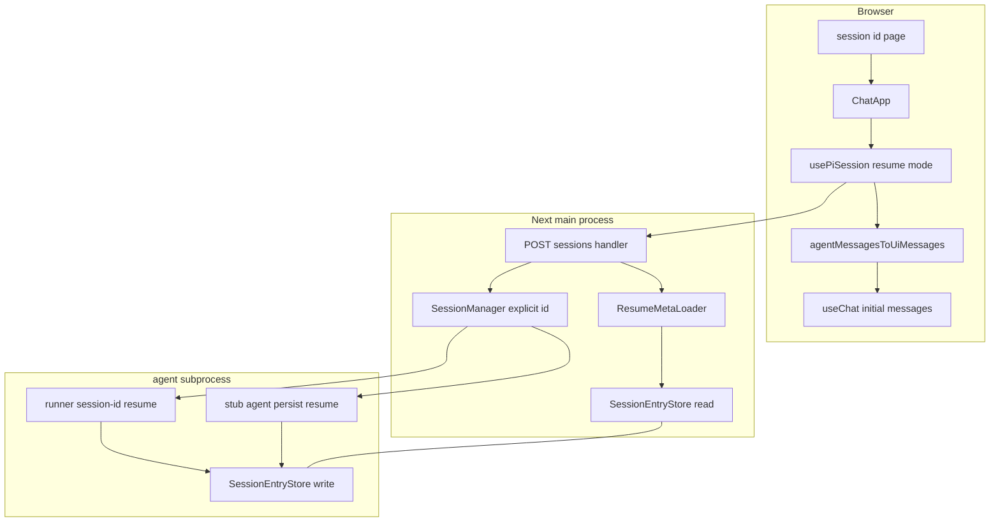
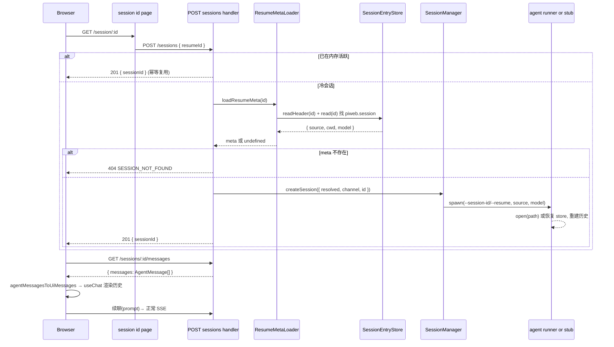

# Design Document

## Overview

**Purpose**:本特性让 pi-web 的会话从"纯内存、刷新即失"升级为"持久化 + 可经 URL 载入并继续对话"。会话的对话历史与恢复所需的创建元数据(agent `source`、`cwd`、`model`)被写入由 `SESSION_STORE` 选择的后端(文件 / sqlite);用户创建会话后浏览器地址反映 `/session/:id`,访问该地址可冷恢复历史并无缝续聊。

**Users**:在浏览器中与 agent 对话的用户(刷新 / 分享 / 重启后接续会话),以及切换存储后端的运维者。

**Impact**:在不改第三方 pi SDK 的前提下,打通三处既有缺口——(1)主进程会话 id 与 agent 持久化文件 id 对齐;(2)补齐创建元数据持久化;(3)新增冷会话恢复编排 + 前端动态路由与历史渲染。

### Goals
- 会话对话与创建元数据持久化到 fs / sqlite(沿用 `SESSION_STORE`)。
- 经 `POST /sessions { resumeId }` 冷恢复会话,前端经 `/session/:id` 载入历史并续聊。
- Playwright e2e 在 fs 与 sqlite 两后端各完成一轮端到端验证(含冷恢复路径)。

### Non-Goals
- **真实 agent 模式(custom 与 cli)下 sqlite 后端的续聊**:pi 运行时只从**文件**读取历史上下文,sqlite 仅为 pi-web 镜像;本期不保证,列为后续。sqlite 续聊由确定性 stub 覆盖。
- postgres 后端的端到端续聊验证。
- 多用户鉴权 / 会话分享访问控制;会话列表 / 检索 / 管理 UI。

### 双模式恢复统一(custom 与 cli)
pi-web 双模式:有入口→**custom**(spawn runner bootstrap);无入口/缺省→**cli**(spawn `pi --mode rpc`)。两模式统一靠 **`--session-id <主进程sessionId>`** 对齐与恢复:
- **pi CLI**(`main.js:255-261`)原生支持:该 id 存在→`open(path)` 加载历史;不存在→`create(cwd, dir, {id})` 以该 id 新建。
- **runner**(custom)模仿同款 open-or-create-by-id 逻辑(`SessionManager.list(cwd)` 按 id 查 path → `open`,否则 `create({id})`)。
- **元数据**:仅 custom 由 runner 写 `piweb.session{source,model}`;cli 模式 source 可由 `header.cwd` 重建(resolver 据 cwd 判定 cli),不写元数据。
- **参数按 `resolved.mode` 区分**:custom→`--session-id/--source-meta/--model`;cli→`--session-id/--model`(pi 原生),不传 `--source-meta`。

## Boundary Commitments

### This Spec Owns
- 主进程 `sessionId` 与 agent 持久化会话 id 的对齐机制。
- 创建元数据 `piweb.session = {source, cwd, model}` 的写入约定与读取。
- 冷会话恢复编排:`POST /sessions { resumeId }` 的恢复分支与主进程侧 `ResumeMetaLoader`。
- stub agent 的持久化 + 恢复 + `get_messages` 历史返回。
- 前端 `/session/:id` 动态路由、URL 同步、`AgentMessage[]→UIMessage[]` 转换与历史初始化。
- e2e 双后端验证。

### Out of Boundary
- `SessionEntryStore` 三后端实现本身(已存在,不重写,仅复用)。
- pi SDK `SessionManager` / `createAgentSessionRuntime` 行为(只调用,不改)。
- 真实模式 sqlite 续聊上下文恢复(后续 spec)。
- SSE 流、translateEvent、权限对话等既有链路语义(不改)。

### Allowed Dependencies
- `@pi-web/protocol`(DTO)、`@pi-web/server`(SessionEntryStore / factory / SessionManager / http handler)、`@earendil-works/pi-coding-agent`(SessionManager.create/open、appendCustomEntry)、`@ai-sdk/react`(UIMessage)。
- 依赖方向保持:`protocol ← server`;`protocol ← react ← ui`;`app/lib/app → server/react/ui`。不得反向。

### Revalidation Triggers
- `CreateSessionRequest` / `createChannel` 契约形状变化。
- `piweb.session` custom entry 的 `customType` 或字段结构变化。
- runner CLI 恢复参数(`--session-id` / `--resume`)变化。
- `SessionEntryStore` 接口或 fs JSONL 格式变化。

## Architecture

### Existing Architecture Analysis
- 主进程 `lib/app/pi-handler.ts:buildSingleton()` 装配 `InMemorySessionStore` + `SessionManager`,经 `createChannel(resolved)` spawn agent(stub: `stub-agent-process.mjs`;真实: runner.ts)。`SessionManager.createSession` 用 `randomUUID()` 生成 id(`session-manager.ts:68`)。
- 持久化在 agent 子进程:`runner.ts` 用 pi `SessionManager.create(cwd)`(**自生成另一 id**)+ `mirrorSessionManagerToStore`(仅 `SESSION_STORE≠fs`)。fs 由 pi 原生写。`SessionHeader` 无 `source`/`model`。
- HTTP `router.ts:168`:含 `:id` 端点先 `store.get(id)`,内存未命中→404(故恢复**不能**用 `/sessions/:id/resume`)。
- 前端 `usePiSession` 仅支持新建;`useChat` 不传 initial messages;无动态路由 / URL 同步。

### Architecture Pattern & Boundary Map



**Architecture Integration**:
- 选定模式:**复用既有可插拔存储端口 + 旁路恢复编排**。不新建存储格式,沿用 `SessionEntryStore`。
- 边界分离:持久化"写"在 agent 端(runner / stub),"读"在主进程(ResumeMetaLoader)。两侧通过同一后端配置(`sessionStoreConfigFromEnv()`)指向同一份数据。
- 保留模式:JSONL 复刻 pi 格式、传输无关 RPC、SSE 翻译层、stub 离线确定性。
- 新组件理由:`ResumeMetaLoader`(主进程读元数据)、`agentMessagesToUiMessages`(前端格式桥)、`session/[id]/page.tsx`(URL 入口)均为既有链路所无。

### Technology Stack

| Layer | Choice / Version | Role in Feature | Notes |
|-------|------------------|-----------------|-------|
| Frontend | Next.js 15 App Router、`@ai-sdk/react` useChat | `/session/[id]` 路由、历史初始化、URL 同步 | `UIMessage` parts-based |
| Backend | `@pi-web/server`(http handler / SessionManager / SessionEntryStore) | 恢复编排、id 对齐、元数据读 | 复用 factory + mirror |
| Agent runtime | `@earendil-works/pi-coding-agent` SessionManager | `create({id})` / `open(path)` / `appendCustomEntry` | 真实模式;stub 不用 |
| Data / Storage | fs JSONL / node:sqlite(既有 adapters) | 会话事件 + 元数据持久化 | 由 `SESSION_STORE` 选择 |
| Runtime | Node ≥22.19、`jiti` | stub 注入 `--import jiti/register` 以 import TS 包 | 失败回退内联存储 |

## File Structure Plan

### Created Files
```
packages/react/src/transport/
└── agent-message-to-ui.ts      # AgentMessage[] → UIMessage[] 纯函数转换
lib/app/
└── resume-meta.ts              # makeResumeMetaLoader: 主进程按 id 读 header+piweb.session 元数据
app/session/[id]/
└── page.tsx                    # 动态路由 server component → ChatApp resumeId
e2e/browser/
└── session-persistence.e2e.ts  # 双后端端到端(参数化 fs/sqlite)
```

### Modified Files
- `packages/protocol/src/transport/rest-dto.ts` — `CreateSessionRequestSchema` 增 `resumeId?`。
- `packages/server/src/session/session.types.ts` — `CreateSessionInput` 增 `id?`。
- `packages/server/src/session/session-manager.ts` — `createSession` 用 `input.id ?? idFactory()`。
- `packages/server/src/http/routes/create-session.ts` — resume 分支;`createChannel(resolved, opts)`。
- `packages/server/src/http/create-handler.ts` + `handler.types.ts` — `createChannel` 新签名透传;`PiWebHandlerOptions` 增 `loadResumeMeta?`。
- `packages/server/src/runner/runner.ts` — `RunnerArgs`/`parseRunnerArgs` 增 `--session-id`/`--resume`/`--model`/`--source-meta`;`startRunner` 按参数 `open`/`create({id})` + 非 resume 时写 `piweb.session`。
- `lib/app/pi-handler.ts` — `createChannel` 拼恢复参数(真实)+ `stubSpawnSpec(config, opts)` 注入 env/jiti;注入 `loadResumeMeta`。恢复用 `header.cwd`。
- `lib/app/stub-agent-process.mjs` — 启动建/恢复 store;`handlePrompt` 顺序 append user+assistant;新增 `get_messages` 返回历史。
- `packages/react/src/hooks/use-pi-session.ts` — `resumeId?`/`onSessionId?`;拉历史→转换→`initialMessages`。
- `packages/ui/src/chat/pi-chat-basic.tsx` + `pi-chat.tsx` — `useChat({transport, messages: initialMessages})`。
- `components/chat-app.tsx` — 接 `resumeId?`;新建成功后 `history.replaceState` 同步 URL。
- `playwright.config.ts` — 两个 webServer(fs/sqlite,不同端口 + env)+ 两个 projects。

## System Flows

### 冷会话恢复(URL 载入)



恢复关键决策:恢复编排走 `POST /sessions { resumeId }`(绕过 `:id` 404);幂等分支保证重复访问不重建;`cwd` 取 header 权威值;真实模式 fs 经 `open(path)` 恢复 pi 上下文,sqlite 续聊由 stub 覆盖(Non-Goal)。

## Requirements Traceability

| Requirement | Summary | Components | Interfaces | Flows |
|-------------|---------|------------|------------|-------|
| 1.1 | 对话条目持久化 | runner / stub + SessionEntryStore | `append` | 写路径 |
| 1.2 | sqlite 后端 | factory `createSessionEntryStore` | `SESSION_STORE=sqlite` | — |
| 1.3 | 文件后端 | FsSessionEntryStore | `SESSION_STORE=fs/未设` | — |
| 1.4 | 创建元数据持久化 | runner / stub `appendCustomEntry` | `piweb.session` | 写路径 |
| 1.5 | 写失败不打断 | mirror best-effort / stub onError | `onError` | — |
| 2.1 | URL 反映 id | chat-app `history.replaceState` | `onSessionId` | — |
| 2.2 | id 一致 | session-manager `input.id`、runner `create({id})` | `CreateSessionInput.id` | 写路径 |
| 2.3 | 刷新不变 | session/[id]/page + chat-app | — | 恢复流 |
| 3.1 | 冷恢复可续聊 | create-session resume 分支 + ResumeMetaLoader | `POST /sessions {resumeId}` | 恢复流 |
| 3.2 | 不存在提示 | create-session 404 + chat-app 错误态 | `404 SESSION_NOT_FOUND` | 恢复流 |
| 3.3 | 历史上下文续聊 | runner open / stub 重建 messages | `get_messages` | 恢复流 |
| 3.4 | 活跃幂等复用 | create-session 幂等分支 | `store.get(id)` | 恢复流 |
| 4.1 | 按序渲染 | agentMessagesToUiMessages + useChat | `UIMessage[]` | 渲染 |
| 4.2 | 思考/工具渲染 | 转换器 part 映射 + part-renderer | `UIMessage parts` | 渲染 |
| 4.3 | 渲染后续输入 | usePiSession transport + initialMessages | — | 渲染 |
| 5.1 | fs 端到端 | e2e fs project | Playwright | 全流程 |
| 5.2 | sqlite 端到端 | e2e sqlite project | Playwright | 全流程 |
| 5.3 | 冷恢复路径 | e2e DELETE 内存后 resume | `DELETE /sessions/:id` | 恢复流 |

## Components and Interfaces

| Component | Layer | Intent | Req | Key Deps | Contracts |
|-----------|-------|--------|-----|----------|-----------|
| CreateSessionRequest.resumeId | protocol | 标识恢复请求 | 3.1 | — | API |
| SessionManager.createSession(id) | server/session | 显式 id 创建 | 2.2 | — | Service |
| createSession resume 分支 | server/http | 冷恢复编排 | 3.1,3.2,3.4 | ResumeMetaLoader(P0) | API/Service |
| ResumeMetaLoader | lib/app | 读 header+元数据 | 1.4,3.1 | SessionEntryStore(P0) | Service |
| runner 恢复参数 | server/runner | open/create({id})+写元数据 | 1.4,2.2,3.3 | pi SessionManager(P0) | Batch |
| stub 持久化/恢复 | lib/app | stub 落盘+恢复+get_messages | 1.1,1.4,3.3 | SessionEntryStore(P0) | Service/State |
| agentMessagesToUiMessages | react | 历史格式桥 | 4.1,4.2 | UIMessage(P0) | Service |
| usePiSession resume 模式 | react | resumeId+initialMessages | 3.1,4.3 | PiClient(P0) | State |
| session/[id]/page + chat-app URL | app | 路由+URL 同步 | 2.1,2.3,3.2 | usePiSession(P0) | State |

### Server

#### SessionManager 显式 id
**Responsibilities**:`createSession` 接受可选 `id`,使主进程 id 成为权威会话 id;无 id 时仍随机(向后兼容)。
```typescript
interface CreateSessionInput {
  readonly resolved: ResolvedSource;
  readonly channel: SessionChannel;
  readonly idleMs?: number;
  readonly id?: SessionId;          // 新增:显式 id 优先于 idFactory
}
// createSession: const sessionId = input.id ?? this.idFactory();
```

#### createSession resume 分支 + createChannel 契约
```typescript
interface CreateChannelOpts {
  readonly sessionId: string;        // 两模式均下传 --session-id(agent 端 open-or-create)
  readonly source: string | undefined;
  readonly model?: string;
}
type CreateChannel = (resolved: ResolvedSource, opts: CreateChannelOpts) => SessionChannel;

interface CreateSessionDeps {
  readonly manager: SessionManager;
  readonly resolver?: { resolve(source, opts?): Promise<ResolvedSource> };
  readonly createChannel?: CreateChannel;
  readonly loadResumeMeta?: (id: string) => Promise<ResumeMeta | undefined>;  // 新增
}
```
- **Preconditions**:`resumeId` 存在 → 走恢复;否则新建并 `sessionId = randomUUID()`。
- **恢复流程**:内存命中→幂等 `201`;否则 `loadResumeMeta(id)`,缺失→`404 SESSION_NOT_FOUND`,否则 `resolve(source,{cwd})`→`createChannel(resolved,{sessionId:id, source, model})`→`createSession({resolved,channel,id})`→`201`。agent 端据 `--session-id` 自行 open(已存在)或 create({id})。
- **API Contract**:

| Method | Endpoint | Request | Response | Errors |
|--------|----------|---------|----------|--------|
| POST | /sessions | `{ source?, cwd?, model?, resumeId? }` | `{ sessionId }` | 400, 404, 503 |

#### ResumeMetaLoader
```typescript
interface ResumeMeta { source: string | undefined; cwd: string; model?: string; sessionFilePath?: string }
function makeResumeMetaLoader(storeConfig: SessionStoreConfig): (id: string) => Promise<ResumeMeta | undefined>;
```
- 惰性建一个主进程 `SessionEntryStore`;`readHeader(id)` 取权威 `cwd`(不存在→`undefined`);`read(id)` 找 `type==="custom" && customType==="piweb.session"` 取 `data.model`。
- **恢复用的 `source` 取 `header.cwd`(agent 运行目录的绝对路径),不用 `piweb.session.source`**:后者是相对原始 cwd 的相对路径,持久化后基准 cwd 丢失;若以 `header.cwd` 为 resolve 的 cwd、再传相对 source,会被二次拼接成 `…/dir/dir`(真实 runner spawn 于不存在目录而立即崩溃)。`header.cwd` 是 resolve 后的绝对目录,直接以它同时作 source 与 cwd 即可复现会话(custom→该目录含 index;cli→普通目录)。
- **Invariants**:不缓存可变状态以外的内容;读失败不抛到 handler 外(返回 `undefined`)。

#### runner 恢复参数(custom 模式)
- `parseRunnerArgs` 增 `--session-id`/`--model`/`--source-meta`。
- `startRunner` 模仿 pi CLI 的 open-or-create-by-id:`SessionManager.list(cwd)` 按 `sessionId` 查得 `path`→`SessionManager.open(path, undefined, cwd)`;未找到→`SessionManager.create(cwd, undefined, { id: sessionId })`。仅新建(create)分支在 mirror 装配后、runtime 前 `appendCustomEntry("piweb.session", { source, cwd, model })`。
- cli 模式不经 runner:主进程对 `pi --mode rpc` 直接追加 `--session-id`/`--model`,pi 原生 `main.js:255-261` 完成 open-or-create。

### Agent (stub)

#### stub 持久化 + 恢复(State)
- 启动读 env `PI_WEB_STUB_SESSION_ID/RESUME/CWD/SOURCE/MODEL` + `SESSION_STORE*`;经 `createSessionEntryStore(sessionStoreConfigFromEnv())` 建 store(spawn 注入 `--import jiti/register`;失败回退内联)。
- 维护 `messages: AgentMessage[]`;新建→`store.create(header)` + append `piweb.session`;恢复→`for await store.read(id)` 重建 `messages`。
- `handlePrompt`:顺序 `await store.append(id, messageEntry(user))` 与 `...(assistant)`(非 fire-and-forget,保证写后可读)。
- 新增 `get_messages` → `{ messages }`。entry id 8 位 hex,parentId 链式。

### React / UI

#### agentMessagesToUiMessages(Service)
```typescript
function agentMessagesToUiMessages(msgs: readonly AgentMessage[]): UIMessage[];
```
映射:`user`(text/image parts)、`assistant`(text→text、thinking→reasoning、toolCall→tool part `input-available`)、`toolResult`(按 `toolCallId` 并入对应 tool part 的 `output`/`output-available`)。id 稳定(`msg-${i}`)。**实现前对齐 `packages/ui` `part-renderer` 支持的 part 类型与 key 约定**。

#### usePiSession resume 模式(State)
```typescript
interface UsePiSessionOptions {
  create: CreateSessionRequest;
  resumeId?: string;            // 新增
  onSessionId?: (id: string) => void;  // 新增:URL 同步回调
  /* ...既有 */
}
interface UsePiSessionResult { /* ...既有 */ initialMessages?: UIMessage[]; }
```
- `start()`:`createSession({ ...create, ...(resumeId?{resumeId}:{}) })`→拿 id→`onSessionId(id)`→`client.getMessages(id)`→`agentMessagesToUiMessages`→暴露 `initialMessages`。

#### app 路由 + URL 同步
- `app/session/[id]/page.tsx`:server component(`force-dynamic`),渲染 `<ChatApp resumeId={params.id} ...>`。
- `components/chat-app.tsx`:`resumeId?` 有则跳过 picker 直接 `SessionView`;新建成功经 `onSessionId` 调 `window.history.replaceState(null, "", "/session/"+id)`。

## Data Models

### piweb.session custom entry
```typescript
// CustomEntry: { type:"custom", customType:"piweb.session", data: PiwebSessionMeta, id, parentId, timestamp }
interface PiwebSessionMeta { source: string | undefined; cwd: string; model?: string }
```
- 写入:agent 端创建会话后一次。读取:主进程 `ResumeMetaLoader`。pi 原生忽略未知 custom entry。
- **🔴 SPIKE(实现前验证)**:真实 runner 写后,主进程 `FsSessionEntryStore.read(id)` 取回的 `customType`/`data` 字段须与上述一致;不一致则调整映射。

### resumeId DTO
`CreateSessionRequestSchema` 增 `resumeId: z.string().optional()`。语义:存在即恢复,缺失即新建。

## Error Handling

### Error Strategy
- **恢复缺元数据 / 会话不存在**(4xx):`404 SESSION_NOT_FOUND` → 前端 `data-session-error` 提示 + 重选源(复用既有错误态)。
- **存储写失败**(5xx 内部):mirror best-effort / stub `onError` 记录,**不打断对话**(R1.5);真实 fs 由 pi 自身处理。
- **stub jiti 导入失败**:回退内联极简 JSONL+sqlite 存储(降级,不影响协议)。
- **冷恢复后 agent 崩溃**:既有 `onClosed`→`store.delete`;幂等分支保证再次访问可重建。

### Monitoring
沿用既有 stderr 错误输出(`runner: session-store mirror error`)与会话错误帧。

## Testing Strategy

### Unit Tests
- `agentMessagesToUiMessages`:user/assistant(text+thinking+toolCall)/toolResult 映射;空数组;未知 role 容错。
- `makeResumeMetaLoader`:有 `piweb.session`→返回元数据;无 header→`undefined`;无 custom entry→source 缺省。
- `parseRunnerArgs`:`--session-id`/`--resume`/`--model` 解析;缺省兼容。
- `createSession`:`input.id` 优先于 idFactory。

### Integration / Node-e2e(`e2e/node/`)
- 阶段1:新建会话→落盘 header.id == 返回 sessionId(fs 查 JSONL、sqlite 查表)。
- 阶段2:新建→`piweb.session` 经主进程 store 可读回(SPIKE 固化为回归)。
- 阶段3:新建→对话→`DELETE` 内存会话→`POST /sessions {resumeId}`→`GET /sessions/:id/messages` 返回历史。

### E2E(Playwright,`e2e/browser/session-persistence.e2e.ts`,fs+sqlite 双 project)
- 5.1/5.2:首页→选 source→发 "hello"→等 stub 回复→断言 URL `/session/<uuid>`→断言磁盘产物(fs `.jsonl` / sqlite 行)。
- 5.3:`request.delete('/api/sessions/'+id)`→`goto('/session/'+id)`→断言历史("hello"+回复)恢复渲染→再发一条→断言追加成功、历史仍在。
