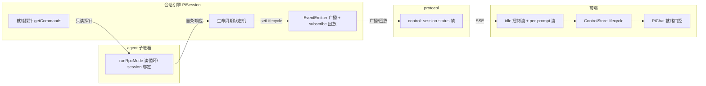
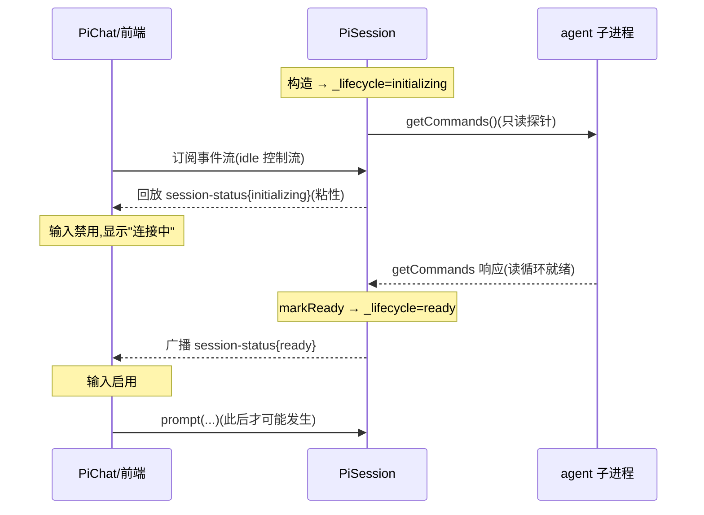
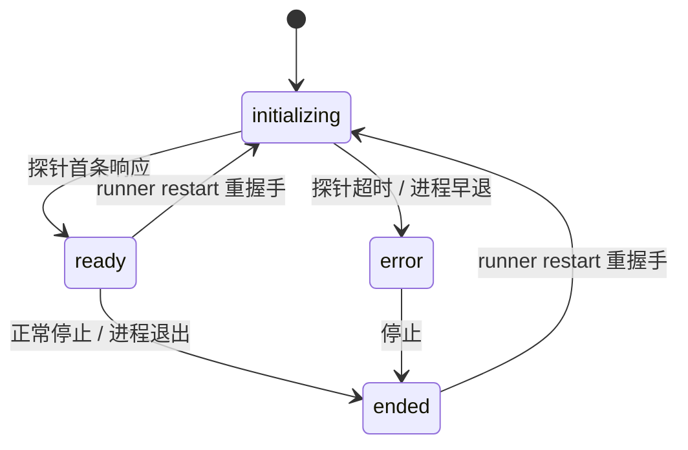

# Design Document

## Overview

**Purpose**：为 pi-web 会话引入一次**真实就绪握手**,彻底消除"agent 子进程尚未能处理命令"窗口内的两类竞态失败——早期帧丢失与过早 prompt 失败。

**Users**：所有通过 Web UI 与 pi agent 对话的最终用户(就绪前不再丢内容、不再发出注定失败的 prompt);以及未来复用会话引擎的集成方(可观测的会话生命周期状态)。

**Impact**：当前 `PiSession` 构造即 `active`、`PiRpcProcess` 在 OS `spawn` 即 `ready`,二者都早于 agent 真实就绪;pi 事件流无 `session_start`/`ready` 锚点。本设计在会话引擎内新增一条**生命周期状态机**,以**只读 RPC 探针(`getCommands`)的首条响应**为真实就绪锚点,并通过一条**粘性 `control: session-status` 帧 + 订阅即回放**把状态投递给前端,由前端把发送能力门控在 `ready`。机制使正确性与"发送/订阅时机"完全解耦。

### Goals
- 以 agent 可响应只读命令为锚点,准确判定会话真实就绪(R1)。
- 任何订阅者无论连接早晚都能立即获知当前生命周期状态(R2,粘性 + 回放)。
- 前端在就绪前禁用发送并显示"连接中",就绪后启用(R3)。
- 就绪失败(超时 / 进程早退)可观测降级,不静默卡死(R4)。
- 状态机在 restart / stop 场景自洽(R5);以增量帧落地、对就绪后路径零回归(R6)。

### Non-Goals
- **上行 prompt 队列**:过早发送由前端门控阻止,服务端不缓冲 prompt(R6.1;留待后续 UX 优化)。
- **断线重连逐帧游标回放**(replay-from-cursor / Last-Event-ID):不在本期。
- 任何 `ctx.ui.custom` 桥接相关改动。
- 创建/查询会话 HTTP 响应体携带初始状态(粘性流回放已足够;belt-and-suspenders 留作未来可选增强)。

## Boundary Commitments

### This Spec Owns
- `PiSession` 的**生命周期状态字段与迁移**(`initializing → ready | error | ended`),及其唯一权威来源。
- **就绪探针**的发起、超时、单向幂等就绪判定。
- 新协议帧 `control: session-status` 的形状与语义(枚举值 + 可选 detail/code)。
- 该帧的**广播 + 新订阅者订阅即回放(粘性)**行为。
- 前端 control-store 的 `lifecycle` 切片、idle 控制流对该帧的放行、`PiChat` 的就绪门控与就绪前指示。

### Out of Boundary
- 上行 prompt 排队 / 重发(由前端门控替代)。
- pi 子进程内部初始化时序、`runRpcMode` 实现。
- 消息历史持久化与冷恢复内容(沿用既有 `getMessages` 路径)。
- 既有 `control: queue/stats/error/extension-ui/ui-rpc/logs` 帧语义。

### Allowed Dependencies
- `SessionChannel.getCommands(): Promise<RpcResponse>`(既有,作为只读探针)。
- 既有 `EventEmitter` 广播 + `subscribe()` 回填范式(`pi-session.ts` 日志 ring buffer 回填 184-190 行为参照)。
- `@blksails/pi-web-protocol` 的 `ControlPayload` 判别联合(单一契约根,增量扩展)。
- 前端既有 idle 控制流 `openControlOnlyStream` 与 `ControlStore`。

### Revalidation Triggers
- `session-status` 帧形状/枚举值变化 → 前端消费方需复检。
- 就绪锚点由 `getCommands` 改为其它命令 → 集成测试需复检。
- 生命周期状态新增/重命名 → control-store 与门控逻辑需复检。
- 探针超时默认值或可配置入口变化 → 部署/运行时需复检。

## Architecture

### Existing Architecture Analysis
- `PiSession`(`packages/server/src/session/pi-session.ts`)以 `EventEmitter` 向订阅者纯广播帧;**无通用回放缓冲**——唯一例外是日志走 `LogRingBuffer` 并在 `subscribe()` 回填(184-190 行)。本设计**复用同一回填范式**承载粘性状态。
- `_status`(`active|stopping|stopped`)是**通道层**活动态,与本设计的**业务就绪态**正交;二者并存,不复用同一字段。
- 控制帧到前端有两条路径:per-prompt 消息流 `handleEvent` 已把**所有** control 帧灌入 `controlStore`(`connection.ts` `frame.kind==="control"` 分支);idle 控制流 `openControlOnlyStream` 目前**只放行 `ui-rpc`**,需扩展放行 `session-status`。
- 前端已在会话 mount 后于 idle 期调用 `getAvailableModels`(`pi-chat.tsx:464`),证明**idle 期只读 RPC 查询可行**,为探针去风险。

### Architecture Pattern & Boundary Map



**Selected pattern**:就绪探测器(探针)+ 可观测状态机 + 粘性事件回放。**时序无关**是核心不变量:迟到订阅 → 回放补齐;过早发送 → 门控阻止。
**Domain boundaries**:就绪态权威在 `PiSession`;前端仅消费与门控,不自行推断就绪。
**Preserved patterns**:`subscribe()` 回填(同日志)、`ControlPayload` 判别联合增量扩展、idle 控制流 `!isBusy` 门控不变。

### Technology Stack

| Layer | Choice / Version | Role in Feature | Notes |
|-------|------------------|-----------------|-------|
| Frontend | React + useSyncExternalStore | `lifecycle` 切片 + 门控 | 复用 `ControlStore` |
| Backend | Node `PiSession` / `SessionChannel` | 状态机 + 探针 | 复用 `getCommands` |
| Events | protocol `ControlPayload` | `session-status` 增量帧 | zod 判别联合 |
| Runtime | `setTimeout` 探针超时 | 失败降级 | 单测用 fake timers |

## File Structure Plan

### Modified / New Files
```
packages/protocol/src/transport/
├── session-status.ts        # 新增:SessionLifecycleState 枚举 + SessionStatusControl schema
├── sse-frame.ts             # 改:ControlPayloadSchema 并入 session-status
└── index.ts (or 既有 barrel)# 改:导出新类型

packages/server/src/session/
├── pi-session.ts            # 改:_lifecycle 状态机 + startReadinessProbe + setLifecycle + subscribe 回放 + restart 重握手 + exit 处理
└── session.types.ts         # 改:PiSessionOptions.readinessProbeTimeoutMs;(可选)re-export SessionLifecycleState

packages/react/src/sse/
├── control-store.ts         # 改:ControlSnapshot.lifecycle 切片 + case "session-status"
└── connection.ts            # 改:openControlOnlyStream 放行 session-status

packages/react/src/hooks/
└── use-pi-controls.ts       # 改:UsePiControlsResult 暴露 lifecycle

packages/ui/src/chat/
└── pi-chat.tsx              # 改:needsIdleControl 含 !sessionReady;canSubmit 含 ready;就绪前/错误指示
```

> 每文件单一职责:协议只定义帧;`PiSession` 拥有就绪态权威;前端只消费 + 门控。

## System Flows

### 就绪握手(成功路径)


### 生命周期状态机

- **门控条件**:`initializing` 期间绝不宣告 ready;就绪判定**单向幂等**(已 ready/error 不被后续探针回拨)。
- **重试**:本期探针**不重试**,超时即 `error`(失败可观测);重试留待后续。

## Requirements Traceability

| Requirement | Summary | Components | Interfaces | Flows |
|-------------|---------|------------|------------|-------|
| 1.1–1.2 | 构造即 initializing,不宣告就绪 | PiSession | `_lifecycle` | 状态机 |
| 1.3–1.4 | 只读探针,首条响应→ready | PiSession.startReadinessProbe | `getCommands()` | 握手 |
| 1.5 | 就绪单向幂等 | PiSession.markReady | — | 状态机 |
| 2.1–2.2 | 变化广播 + 订阅即回放 | PiSession.setLifecycle / subscribe | `session-status` 帧 | 握手 |
| 2.3 | 帧区分各状态 | protocol session-status | `SessionLifecycleState` | — |
| 2.4 | ready 先于订阅仍不丢 | PiSession.subscribe 回放 | — | 握手 |
| 3.1–3.3 | 前端门控 + 刷新依回放重判 | PiChat / ControlStore.lifecycle | `usePiControls.lifecycle` | 握手 |
| 4.1–4.2 | 探针超时 / 进程早退→error | PiSession.markReadinessError/handleExit | `session-status{error}` | 状态机 |
| 4.3 | 错误可观测,禁用发送 | PiChat | — | — |
| 5.1 | restart 重握手 | PiSession.restart | — | 状态机 |
| 5.2–5.3 | 终态自洽不回退 | PiSession.setLifecycle 守卫 | — | 状态机 |
| 6.1 | 不引入上行队列 | (设计排除) | — | — |
| 6.2 | 就绪后零回归 | PiSession | 既有路径不变 | — |
| 6.3 | 增量帧向后兼容 | protocol | 判别联合扩展 | — |

## Components and Interfaces

| Component | Layer | Intent | Req | Key Deps | Contracts |
|-----------|-------|--------|-----|----------|-----------|
| session-status 帧 | protocol | 定义生命周期帧 | 2.3,6.3 | zod | Event/State |
| PiSession 状态机+探针 | server | 就绪权威 | 1,2,4,5,6 | SessionChannel.getCommands | Service/State/Event |
| ControlStore.lifecycle | react | 前端状态切片 | 2,3 | ControlPayload | State |
| connection 放行 | react | idle 流投递 session-status | 2 | openControlOnlyStream | Event |
| PiChat 门控 | ui | 就绪前禁用发送 | 3,4 | usePiControls | State |

### protocol

#### session-status 帧
**Responsibilities**:定义生命周期状态枚举与控制帧形状;零运行时,isomorphic。
**Contracts**: Event [x] / State [x]

```typescript
// packages/protocol/src/transport/session-status.ts
export const SessionLifecycleStateSchema = z.enum([
  "initializing", // 子进程已起,探针未成功
  "ready",        // 探针首条响应,可接受 prompt
  "error",        // 探针超时 / 进程早退,不可用
  "ended",        // 正常停止 / 进程退出
]);
export type SessionLifecycleState = z.infer<typeof SessionLifecycleStateSchema>;

export const SessionStatusControlSchema = z.object({
  control: z.literal("session-status"),
  state: SessionLifecycleStateSchema,
  detail: z.string().optional(), // 人类可读原因(error/ended)
  code: z.string().optional(),   // 机器码:"probe-timeout" | "exit-before-ready" | ...
});
```
- **Invariant**:并入 `ControlPayloadSchema` 判别联合(`sse-frame.ts`),`control` 为判别键;未消费该帧的旧客户端因判别联合解析失败被既有 `onError` 安全忽略,不污染消息流(R6.3 向后兼容)。

### server

#### PiSession 生命周期状态机 + 就绪探针
| Field | Detail |
|-------|--------|
| Intent | 会话就绪态唯一权威:发起探针、判定就绪、广播/回放状态 |
| Requirements | 1.1–1.5, 2.1–2.4, 4.1–4.2, 5.1–5.3, 6.1–6.2 |

**Responsibilities & Constraints**
- 新字段 `_lifecycle: SessionLifecycleState`(默认 `initializing`)、`_lifecycleDetail?`、`_lifecycleCode?`,与 `_status` 正交。
- 构造末尾启动 `startReadinessProbe()`;**不**阻塞构造(异步)。
- 就绪判定单向幂等:仅 `initializing` 可迁出;`ready`/`error`/`ended` 不被探针回拨(R1.5/5.3)。
- `setLifecycle()` 是状态变更**唯一入口**:更新字段 + 广播 `session-status` 帧。

**Dependencies**
- Outbound:`this.channel.getCommands()` — 只读探针(Critical)。
- Outbound:`this.emitter.emit(FRAME_EVENT, frame)` — 广播(Critical)。

**Contracts**: Service [x] / Event [x] / State [x]

```typescript
// 新增/修改于 packages/server/src/session/pi-session.ts(签名级,非完整实现)
private _lifecycle: SessionLifecycleState = "initializing";
private _lifecycleDetail?: string;
private _lifecycleCode?: string;
private probeTimer?: ReturnType<typeof setTimeout>;

/** 唯一状态变更入口:守卫单向迁移 + 广播帧。 */
private setLifecycle(state: SessionLifecycleState, code?: string, detail?: string): void;

/** 当前状态帧(供广播与订阅回放复用)。 */
private lifecycleFrame(): SseFrame; // makeControlFrame({ control:"session-status", state, detail, code })

/** 发起只读探针:getCommands 首条响应→markReady;超时→error。 */
private startReadinessProbe(timeoutMs: number): void;

get lifecycle(): SessionLifecycleState; // 只读暴露(诊断/描述)
```
- **Preconditions**:`startReadinessProbe` 仅在 `_status==="active" && _lifecycle==="initializing"` 生效。
- **Postconditions**:`getCommands` resolve(任意 RpcResponse,**含 error 响应**,因"有响应"即证明读循环就绪)→ `setLifecycle("ready")`,清除 `probeTimer`;reject 或超时 → `setLifecycle("error", "probe-timeout"|...)`。
- **Invariants**:`setLifecycle` 幂等守卫——目标与现态相同或现态为终态(非 restart)时 no-op,不重复广播(R1.5)。

**`subscribe()` 回放(粘性)**:在既有日志回填之后,追加 `frameWrap(this.lifecycleFrame())`——仅向新订阅者回放当前生命周期态,不广播(R2.2/2.4),与 184-190 行范式一致。

**`handleExit()`**:若退出时 `_lifecycle==="initializing"` → `setLifecycle("error","exit-before-ready")`;否则 → `setLifecycle("ended")`。在既有 END_EVENT 之外补一帧状态(R4.2)。

**`restart()` 重握手**(R5.1):重 spawn 后将 `_lifecycle` 复位 `initializing`、广播之,并重启探针(终态 `ended→initializing` 是唯一允许的"回退",经 restart 显式触发)。

**配置**:`PiSessionOptions.readinessProbeTimeoutMs?`(默认常量 `DEFAULT_READINESS_PROBE_TIMEOUT_MS = 30_000`)。

### react

#### ControlStore.lifecycle 切片
```typescript
export interface SessionLifecycleSnapshot {
  readonly state: SessionLifecycleState;
  readonly detail?: string;
  readonly code?: string;
}
// ControlSnapshot 增 readonly lifecycle: SessionLifecycleSnapshot;
// INITIAL: { state: "initializing" } —— 失败安全默认(未确认即不可发送)
// applyControlFrame: case "session-status" → emit({ ...snapshot, lifecycle: {...} })
```
- **Invariant**:初始 `initializing` 确保前端在收到任何帧前默认"未就绪",绝不抢跑发送。

#### connection.openControlOnlyStream 放行 session-status
- 既有仅放行 `ui-rpc`;扩展为:`control === "ui-rpc" || control === "session-status"` → `applyControlFrame`,其余仍丢弃(避免重复 apply ambient,R2)。

#### usePiControls 暴露 lifecycle
- `UsePiControlsResult` 增 `readonly lifecycle: SessionLifecycleSnapshot`(取自 `controlSnapshot.lifecycle`),供 `PiChat` 派生 `sessionReady`。

### ui

#### PiChat 就绪门控
| Field | Detail |
|-------|--------|
| Intent | 就绪前禁用发送 + 指示;就绪后启用;错误态可观测 | 
| Requirements | 3.1–3.3, 4.3 |

**Responsibilities & Constraints**
- `sessionReady = controls.lifecycle.state === "ready"`。
- `needsIdleControl = hasContributions || hasArtifactRpc || !sessionReady`——就绪前**始终**开 idle 控制流(仍受 `!isBusy` 门控,因就绪前 `isBusy` 不可能为真,无 prompt 流冲突),以接收粘性 `session-status`;就绪且无其它需求后自然关闭。
- `canSubmit = (既有条件) && sessionReady`。
- 渲染:`!sessionReady && state!=="error"` → "连接中"指示且发送禁用;`state==="error"` → 可理解失败提示且保持禁用(R4.3)。
- 刷新/重订阅:依回放的当前 `lifecycle` 重新派生 `sessionReady`,不停留过期态(R3.3)。

## Error Handling

### Error Strategy
- **探针超时**(System/timeout):`setLifecycle("error","probe-timeout")` + 帧通告 + 前端失败提示(R4.1/4.3)。
- **进程早退**(System):`handleExit` 见 initializing → `error,"exit-before-ready"`(R4.2),不停留 initializing。
- **探针 reject**(通道关闭):同超时归 `error`。
- **就绪后退出**:`ended`(正常)。
- 不抛错中断会话创建;探针失败仅影响就绪态,既有 `_status` 路径不受影响。

### Monitoring
- 失败经 `session-status{error,code}` 帧上行,前端可呈现;服务端可经既有 stderr/logging 记录探针超时(best-effort)。

## Testing Strategy

### Unit Tests
- **protocol**:`SessionStatusControlSchema` 解析 4 个枚举 + 含 detail/code;并入 `ControlPayloadSchema` 后与既有 control 判别不冲突。
- **control-store**:`applyControlFrame({control:"session-status",...})` 正确更新 `lifecycle` 切片;初始为 `initializing`;不影响其它切片引用稳定性。
- **pi-session(mock channel + fake timers)**:(a) 构造→`initializing`;(b) `getCommands` resolve→`ready` 且广播一帧;(c) 超时→`error{probe-timeout}`;(d) 进程早退→`error{exit-before-ready}`;(e) 就绪后再探针/事件不回拨(幂等);(f) `subscribe()` 晚于 ready 仍回放 `ready`(粘性,核心防丢);(g) restart→复位 initializing 并重探针。

### Integration Tests(真实子进程)
- 真 runner 子进程:创建会话→**延迟订阅**→仍收到 `session-status{ready}`(端到端验证粘性回放跨进程,R2.4)。
- `getCommands` 探针对真 agent 在 idle 期可 resolve→驱动 `ready`(R1.3/1.4)。

### E2E(浏览器,Playwright,隔离 build `.next-e2e`)
- 选源→打开会话→**输入框初始禁用 + "连接中"指示**→就绪后**输入启用**→发送 prompt→收到流式回复(R3.1/3.2 + 正确性闭环)。
- (可选)模拟探针不就绪→呈现错误提示且保持禁用(R4.3)。
