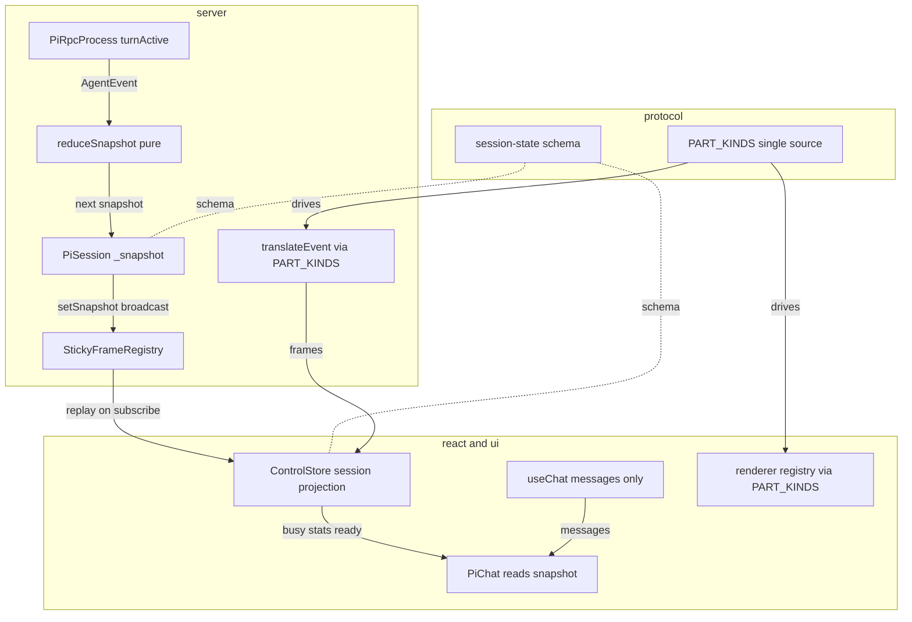
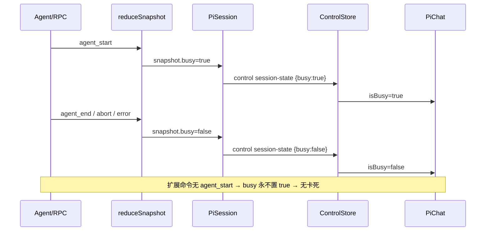
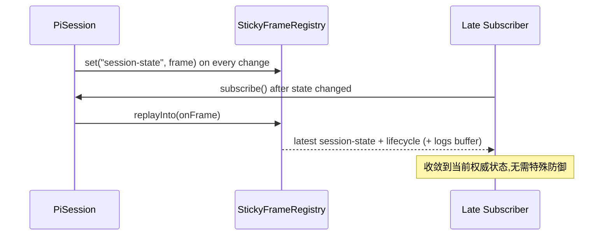
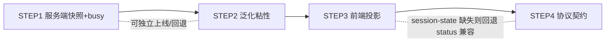

# Design Document — session-snapshot-authority

## Overview

**Purpose**：把 pi-web 会话状态从「事件流被各 feature 各自归约、状态被 useChat 黑盒与 ControlStore 劈成两半」收口为「**服务端唯一权威 `SessionSnapshot`（粘性可重放）+ 前端纯投影 + 闭合协议契约**」，使正确性塌缩成两个可单测纯函数 `reduceSnapshot(prev, event)` 与 `project(snapshot)`。

**Users**：pi-web 框架开发者。改造后，会话 `busy/ready/stats`、协议产出物渲染的正确性可由单测与离线 e2e 判定，不再依赖 Chrome 人眼复检整条管线。

**Impact**：`PiSession` 新增主动权威快照与广播；新增 `control:"session-state"` 帧与 `StickyFrameRegistry`；前端 `ControlStore` 成为唯一权威投影、`PiChat` 派生改读快照；协议新增 `PART_KINDS` 单一真相源。改造分 4 步、每步独立可上线可回退。

### Goals
- 服务端持有单一权威 `SessionSnapshot` 并在变更时广播；晚订阅者自动收敛。
- `busy` 权威化，扩展命令不再永久卡死；`stats` 单一来源。
- 前端 `busy/ready/stats/canSubmit` 全部来自权威快照，去除 `useChat.status` 时序推断与 REST 轮询。
- 协议产出物类型有单一真相源，孤儿渲染器在测试层不可能通过。
- 正确性可由纯函数单测 + 离线/浏览器 e2e 判定，既有测试无回归。

### Non-Goals
- 不替换/拦截 `useChat`（继续由 AI SDK 拥有 `messages` 累积）。
- 不改 `session-readiness-handshake` 的就绪判定锚点（仅在其上泛化粘性机制）。
- 不新增会话业务能力（fork / 附件 / AIGC 等）。
- 不移除过渡期的 `session-status` / `stats` / `logs` 帧与既有 REST 端点。

## Boundary Commitments

### This Spec Owns
- 服务端会话权威状态 `SessionSnapshot`（lifecycle/busy/turn/stats/model/title）的定义、归约与广播。
- 新帧 `control:"session-state"` 的协议 schema。
- `StickyFrameRegistry`（last-value 粘性回放机制）及 `subscribe()` 的回放收口。
- 前端对 `SessionSnapshot` 的权威投影（`ControlStore.session` + 派生 `busy/stats/lifecycle`）。
- 协议产出物类型单一真相源 `PART_KINDS` 及其契约测试。

### Out of Boundary
- `useChat` 内部 messages/status 实现（仅消费 `messages`）。
- 既有 lifecycle 状态机迁移规则与就绪探针（`session-readiness-handshake` 所有）。
- 既有各 data-part 渲染组件的视觉实现（仅改「如何注册」，不改组件本身）。

### Allowed Dependencies
- 上游：`@blksails/pi-web-protocol`（帧 schema）、`session-engine`（RPC 通道/事件翻译）、`pi-rpc-process` 的 `turnActive` 信号。
- 共享：现有 e2e 体系（`PI_WEB_STUB_AGENT=1` node e2e + Playwright browser e2e）、各包 vitest。
- 约束：依赖方向 `protocol → server → react → ui`，不得逆向。

### Revalidation Triggers
- `SessionSnapshot` 字段形状变更（消费者须重校投影）。
- `session-state` 帧 schema 变更。
- `PART_KINDS` 条目增删（server 翻译 + 前端注册须同步，由契约测试守护）。
- `busy` 语义来源变更（如改回时序推断）。

## Architecture

### Existing Architecture Analysis
- **粘性回放已存在但写死**：`pi-session.ts subscribe()` 回放 logs（:334）+ lifecycle（:341）两帧。→ 泛化为 `StickyFrameRegistry`。
- **快照雏形已存在但被动**：`CachedState`（session.types.ts:114）攒 model/thinkingLevel/stats/state，仅 REST 拉、不广播。→ 升级为主动 `SessionSnapshot`。
- **busy 信号已存在但私有**：`pi-rpc-process.turnActive`（:124/532-533）。→ 在 PiSession 以纯 reducer 从 agent 事件派生权威 busy。
- **前端 reducer 已存在但只管半边**：`ControlStore`（control-store.ts）归约 control 帧。→ 吸收 `session-state`，成为唯一权威投影；`useChat.status` 退出业务判断。
- **协议帧机制可复用**：`z.discriminatedUnion("control", …)` + `makeControlFrame`。→ 新增 `session-state` 成员；data-part 类型收口为 `PART_KINDS`。

### Architecture Pattern & Boundary Map



**Selected pattern**：Authoritative reducer + sticky last-value snapshot + pure projection（事件溯源的单一权威归约 + 投影）。
**Dependency direction**：`protocol → server → react → ui`（左侧不依赖右侧）。
**Existing patterns preserved**：discriminatedUnion 帧、ControlStore 不可变快照 + useSyncExternalStore、session-status 粘性帧与就绪探针。

### Technology Stack

| Layer | Choice / Version | Role in Feature | Notes |
|-------|------------------|-----------------|-------|
| 协议 | zod（既有） | `session-state` 帧与 `SessionSnapshot` schema、`PART_KINDS` | 复用 discriminatedUnion |
| 服务端 | TypeScript / Node（既有 packages/server） | 纯 reducer、权威快照、StickyFrameRegistry、translate 收口 | 无新依赖 |
| 前端 | React 18 / AI SDK v5（既有） | ControlStore 投影、PiChat 派生改源、渲染器注册收口 | useChat 降级为 messages |
| 测试 | vitest + Playwright（既有） | 纯函数单测、node e2e（stub）、browser e2e | `PI_WEB_STUB_AGENT=1` |

## File Structure Plan

### 新增文件
```
packages/protocol/src/transport/
└── session-state.ts          # SessionSnapshotSchema + SessionStateControlSchema（仿 session-status.ts）
packages/protocol/src/transport/
└── part-kinds.ts             # PART_KINDS 单一真相源 + PartKind 类型 + 契约元数据
packages/server/src/session/
├── sticky-registry.ts        # StickyFrameRegistry（last-value Map + replayInto）
└── reduce-snapshot.ts        # reduceSnapshot(prev, event) 纯函数（R7.1）
```

### 修改文件
- `packages/protocol/src/transport/sse-frame.ts` — `SessionStateControlSchema` 并入 `ControlPayloadSchema` 联合。
- `packages/protocol/src/index.ts`（或 transport 桶文件）— 导出 session-state / part-kinds。
- `packages/server/src/session/pi-session.ts` — 新增 `_snapshot`、`setSnapshot()`；`handleEvent` 调 `reduceSnapshot`；`setLifecycle` 同步 snapshot；stats 缓存时同步 snapshot；`subscribe()` 改用 `StickyFrameRegistry.replayInto`。
- `packages/server/src/session/translate/translate-event.ts` — data-part 翻译改为遍历 `PART_KINDS`（STEP4）。
- `packages/server/src/session/session.types.ts` — `CachedState` 关联/过渡到 `SessionSnapshot`（保留兼容字段）。
- `packages/react/src/sse/control-store.ts` — `ControlSnapshot` 增 `session`、`busy`；`applyControlFrame` 增 `case "session-state"`，并据快照同步 lifecycle/stats。
- `packages/react/src/hooks/use-pi-controls.ts` — 暴露 `busy`、`session`；移除/弱化独立 restStats 合并。
- `packages/ui/src/chat/pi-chat.tsx` — `isBusy/stats/sessionReady/canSubmit` 改读快照；删 stats 轮询 effect；data-part 渲染器注册改为遍历 `PART_KINDS`（STEP4）；保留空闲控制流门控。

> 每文件单一职责：reducer 纯、registry 仅 last-value、session-state 仅 schema、PART_KINDS 仅注册表。

## System Flows

### busy 权威化（扩展命令不卡死）


### 晚订阅回放收敛


## Requirements Traceability

| Requirement | Summary | Components | Interfaces | Flows |
|-------------|---------|------------|------------|-------|
| 1.1–1.5 | 权威快照 + 广播 + 同步读 | PiSession._snapshot, setSnapshot | SessionSnapshot, session-state 帧 | busy 流 |
| 2.1–2.4 | busy 权威化 | reduceSnapshot | reduceSnapshot(prev,event) | busy 流 |
| 3.1–3.4 | stats 单源 | PiSession（stats→snapshot）, ControlStore | session-state.stats | — |
| 4.1–4.4 | 泛化粘性回放 | StickyFrameRegistry, subscribe() | replayInto / set | 回放流 |
| 5.1–5.4 | 前端纯投影 | ControlStore.session, PiChat | ControlSnapshot.busy/session | busy 流 |
| 6.1–6.5 | 闭合协议契约 | PART_KINDS, translate, registry, 契约测试 | PartKind, PartKindDef | — |
| 7.1–7.5 | 可单测 + e2e | reduceSnapshot, project, e2e | 纯函数 + e2e | 全部 |
| 8.1–8.4 | 增量迁移/兼容 | 四步 + 双帧并存 | session-state 新增帧 | — |

## Components and Interfaces

| Component | Layer | Intent | Req | Key Deps | Contracts |
|-----------|-------|--------|-----|----------|-----------|
| SessionSnapshot / session-state 帧 | protocol | 权威状态与帧 schema | 1,8 | zod | State/Event |
| reduceSnapshot | server | 纯归约 agent 事件→快照 | 2,7 | AgentEvent | Service |
| PiSession（扩展） | server | 持有/广播快照、收口回放 | 1,3,4 | reduceSnapshot, StickyRegistry | State/Event |
| StickyFrameRegistry | server | last-value 粘性回放 | 4 | SseFrame | Service |
| PART_KINDS | protocol | data-part 单一真相源 | 6 | zod schemas | State |
| ControlStore（扩展） | react | 权威快照投影 | 3,5 | session-state 帧 | State |
| PiChat（派生改源） | ui | 读快照派生 busy/stats/ready | 5 | ControlStore | State |

### 协议层

#### session-state 帧 / SessionSnapshot
**Contracts**: Event / State
```typescript
// packages/protocol/src/transport/session-state.ts
import { z } from "zod";
import { SessionLifecycleStateSchema } from "./session-status.js";

export const SessionSnapshotSchema = z.object({
  lifecycle: SessionLifecycleStateSchema,
  busy: z.boolean(),
  turn: z.object({ startedAt: z.number() }).optional(),
  stats: z.object({}).passthrough().optional(), // 按 SessionStats 解读
  model: z.unknown().optional(),
  title: z.string().optional(),
});
export type SessionSnapshot = z.infer<typeof SessionSnapshotSchema>;

export const SessionStateControlSchema = z.object({
  control: z.literal("session-state"),
  snapshot: SessionSnapshotSchema,
});
export type SessionStateControl = z.infer<typeof SessionStateControlSchema>;
```
- Invariants：`busy` 恒为布尔；`lifecycle` 与既有 session-status 状态机一致；旧消费者不识别 `session-state` 时 default 分支忽略。

#### PART_KINDS（单一真相源）
**Contracts**: State
```typescript
// packages/protocol/src/transport/part-kinds.ts
import type { z } from "zod";
export interface PartKindDef {
  readonly schema: z.ZodTypeAny;          // data part 校验 schema
  readonly fromEvent?: string;            // 关联的 agent 事件/翻译标识（server 使用）
}
export const PART_KINDS = {
  "data-pi-custom-ui": { schema: CustomUiDataPartSchema, fromEvent: "extension_ui_request:custom" },
  "data-pi-ui":        { schema: PiUiDataPartSchema },
  "data-pi-queue":     { schema: QueueDataPartSchema },
  // …既有 data-part 逐条登记
} as const satisfies Record<string, PartKindDef>;
export type PartKind = keyof typeof PART_KINDS;
```
- 用途：server `translateEvent` 与前端渲染器注册均遍历它；契约测试遍历断言无孤儿。

### 服务端层

#### reduceSnapshot（纯函数）
**Contracts**: Service
```typescript
// packages/server/src/session/reduce-snapshot.ts
import type { AgentEvent } from "...";
import type { SessionSnapshot } from "@blksails/pi-web-protocol";

/** 纯函数：给定前态与一个 agent 事件，产出新快照。相同输入恒等输出（R7.1）。 */
export function reduceSnapshot(prev: SessionSnapshot, event: AgentEvent): SessionSnapshot;
```
- Pre：`prev` 合法快照。Post：仅 busy/turn 等受该事件影响的字段变化，其余原样。
- 规则：`agent_start`→`{busy:true, turn:{startedAt}}`；`agent_end|abort|error`（轮次结束）→`{busy:false}`；其余事件不改 busy。
- Invariant：无副作用、不读时钟以外的外部状态（`startedAt` 由调用方注入，保证可测）。

#### PiSession（扩展）
**Contracts**: State / Event
- 新增 `private _snapshot: SessionSnapshot`（初值 `{lifecycle:"initializing", busy:false}`）。
- `private setSnapshot(patch: Partial<SessionSnapshot>): void`：合并 → 写入 `sticky.set("session-state", makeControlFrame({control:"session-state", snapshot}))` → `emitter.emit(FRAME_EVENT, frame)`。
- `handleEvent(event)`：在既有 translate 旁，调 `reduceSnapshot(this._snapshot, event)`，若变更则 `setSnapshot`。
- `setLifecycle(...)`：除既有 session-status 帧外，追加 `setSnapshot({lifecycle})`（lifecycle 单一内部权威）。
- stats：命令响应刷新缓存处追加 `setSnapshot({stats})`。
- `subscribe()`：以 `this.sticky.replayInto(frameWrap)` 取代硬编码 lifecycle 回放；logs ring-buffer 回放保留。
- `getCachedState()`：过渡期从 `_snapshot` 派生返回，保证 REST 与快照同源（R3.4）。

#### StickyFrameRegistry
**Contracts**: Service
```typescript
// packages/server/src/session/sticky-registry.ts
export class StickyFrameRegistry {
  private last = new Map<string, SseFrame>();
  set(key: string, frame: SseFrame): void;       // 覆盖 last-value（R4.4）
  get(key: string): SseFrame | undefined;
  replayInto(emit: (f: SseFrame) => void): void;  // 按插入序重放全部（R4.1）
}
```

### 前端层

#### ControlStore（扩展）
**Contracts**: State
- `ControlSnapshot` 增字段：`readonly session: SessionSnapshot | undefined`、`readonly busy: boolean`。
- `applyControlFrame`：新增 `case "session-state"`：`next.session = payload.snapshot`；`next.busy = snapshot.busy`；据快照同步 `next.lifecycle`（state/detail/code）与 `next.stats`（若快照含），使存量 `controls.lifecycle/stats` 读者零改动即受益（单一内部权威）。
- 引用稳定性：无变更不换引用（既有不变式保持）。

#### PiChat（派生改源）
**Contracts**: State
- `isBusy`：`controls?.session !== undefined ? controls.busy : (status==='submitted'||'streaming')`（有快照走权威，无快照回退兼容旧/stub 未升级路径）。
- `stats`：直接读 `controls?.stats`（现由 session-state 同步驱动）；**删除** :481-498 的 `turnJustEnded` 轮询 effect，保留首屏一次性 REST 读取。
- `sessionReady/canSubmit`：维持读 `controls.lifecycle`（现由快照同步），逻辑不变。
- **保留** :536-548 空闲控制流门控（就绪前接粘性帧、`!isBusy` 门控），仅 isBusy 来源变更，须回归 Tier3 控制流不破 prompt 流。
- `data-pi-busy`（:1400）继续反映 `isBusy`，作 e2e 锚点。

## Data Models

### SessionSnapshot（权威状态）
- 单聚合根：一个会话一份 `SessionSnapshot`，服务端为唯一写者。
- 字段语义：`lifecycle`（与状态机一致）、`busy`（轮次活跃）、`turn.startedAt`、`stats`（用量）、`model`、`title`。
- 一致性：R1.3「最近广播 == 当前权威」由 `setSnapshot` 原子「合并→入粘性→广播」保证。
- 兼容：`session-state` 为新增事件 schema，向后兼容（旧消费者忽略）；与 `session-status`/`stats` 帧过渡期并存。

## Error Handling

- 帧解析：前端 `SseFrameSchema.safeParse` 失败丢弃该帧（既有），新 `session-state` 成员纳入同一保护。
- reducer：纯函数对未知事件返回 `prev`（不抛），保证 busy 不被异常事件污染。
- 回退安全（R8.4）：每步独立分支提交；任一步回退后 `session-state` 帧消失，前端 isBusy 自动回退到 status 兼容路径，无残留破坏态。

## Testing Strategy

### Unit Tests
- `reduceSnapshot`：agent_start→busy:true；agent_end/abort/error→busy:false；无关事件不改 busy；扩展命令事件序列（无 agent_start）busy 恒 false（2.1-2.4, 7.1）。
- `StickyFrameRegistry`：set 覆盖 last-value、replayInto 按序重放、多键并存（4.1-4.4）。
- `ControlStore`：apply session-state → busy/session/lifecycle/stats 同步；引用稳定性（5.1, 3.2）。
- `PART_KINDS` 契约测试：遍历断言每 kind 有 server 映射 + 前端渲染器（6.5）。
- PiChat 投影（jsdom）：给定 controls.session 快照 → isBusy/stats/canSubmit 派生正确（5.2, 7.2）。

### Integration / Node E2E（`PI_WEB_STUB_AGENT=1`）
- 扩展命令后 `busy` 回落 false 不卡死（2.3）。
- stats 经 session-state 单源粘性、无需轮询（3.x）。
- 晚订阅 `/stream` 回放收敛到当前 session-state（4.1）。

### Browser E2E（Playwright）
- 真实管线下发消息→收完→`[data-pi-busy="false"]`（5.2）。
- 重连/晚订阅后就绪与 busy 态正确（4.x）。
- 既有 26 浏览器 e2e 全绿（7.5，无回归）。

## Migration Strategy


- STEP1：新增 session-state 帧 + 权威 busy + 广播。独立验证「扩展命令卡死消失」。
- STEP2：StickyFrameRegistry 收口 subscribe 回放。
- STEP3：前端 ControlStore 投影 + PiChat 改源。回退安全：无 session-state 帧时 isBusy 自动回退兼容路径。
- STEP4：PART_KINDS 收口 translate + 注册 + 契约测试。最具侵入性、末位、独立可回退。
