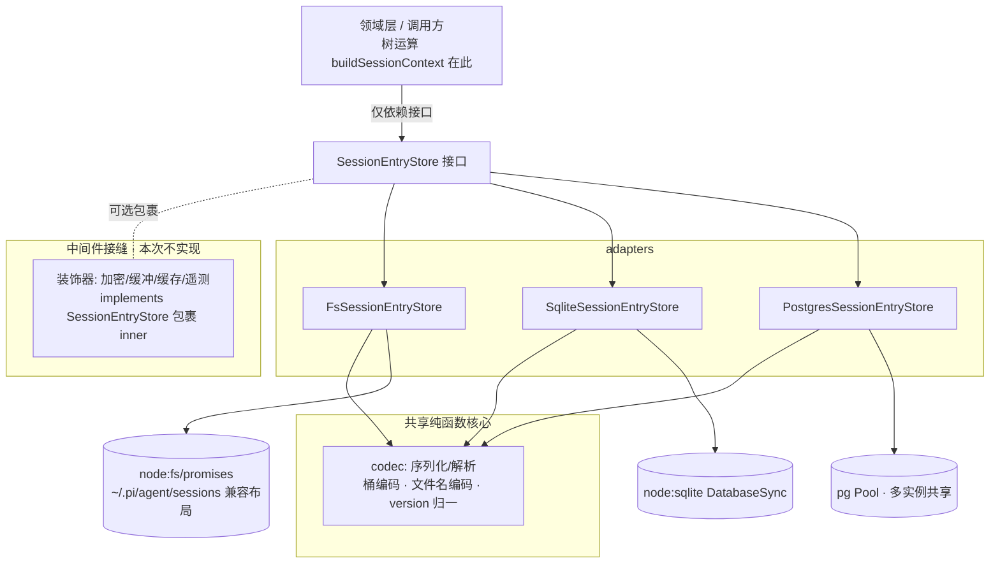
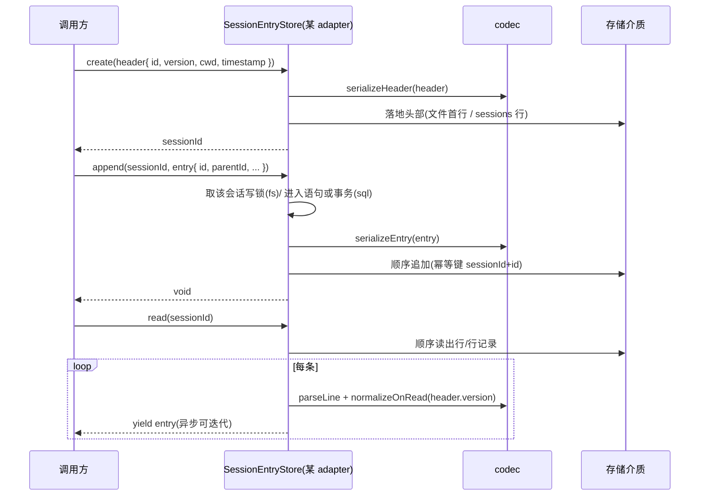
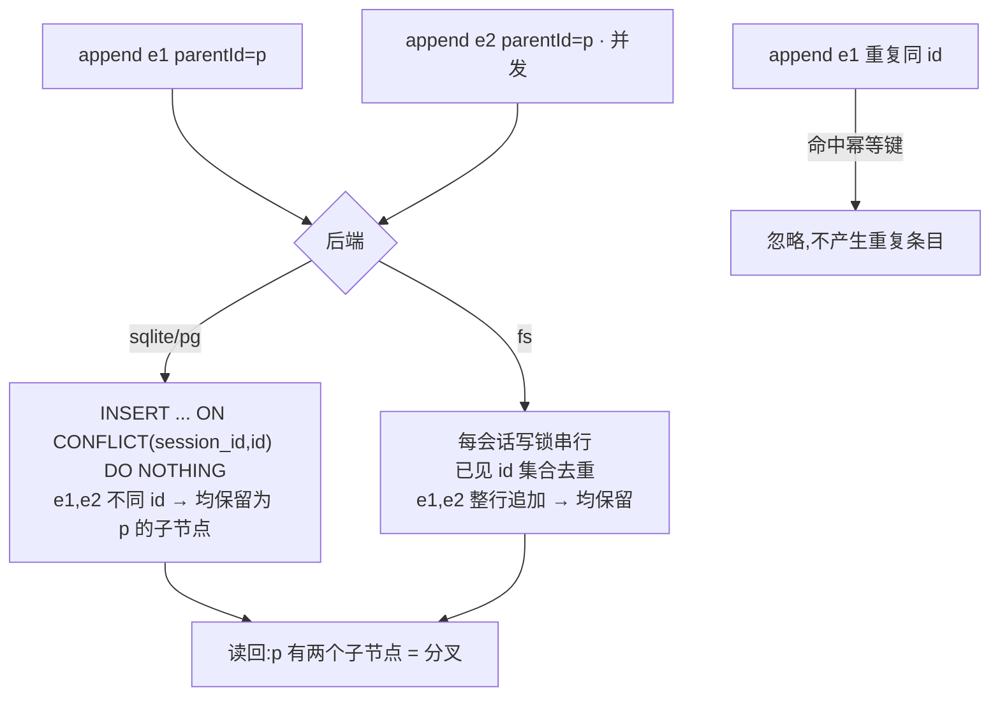

# Design Document

## Overview

**Purpose**:本特性为 `@blksails/server` 交付一个**可插拔的会话事件存储 `SessionEntryStore`**:把 pi 会话的 "append-only 事件树" 持久化能力从存储介质中解耦,并提供 **fs / sqlite / postgres** 三种 adapter。它只承担**条目存取(IO)**,把「从叶子回溯重建上下文、分支选择」等树运算留给调用方(领域层)。

**Users**:`@blksails/server` 内的会话领域层(及未来的 http-api/会话引擎)经 `SessionEntryStore` 接口创建会话、追加条目、读回条目(在内存重建树)、按工作目录或全局检索会话、整会话删除。三种 adapter 覆盖单机文件兼容(fs)、单机结构化(sqlite)、多实例共享(postgres)三类部署。

**Impact**:在 `packages/server/src/session-store/` 新增一个独立模块;**不修改**第三方 `@earendil-works/pi-coding-agent` 任何代码,仅把其 JSONL 布局/version 语义作为兼容目标。新增运行时依赖 `pg`(仅 postgres adapter 惰性引用)、测试依赖 `pg-mem`;sqlite 用 Node 内置 `node:sqlite`,无新增运行时依赖。

### Goals
- 定义与介质无关的异步接口 `SessionEntryStore`(create/append/appendBatch/read/readHeader/list/listAll/delete)。
- 交付 fs(与 `~/.pi/agent/sessions` 布局兼容)、sqlite、postgres 三个行为一致的 adapter。
- append-only 不可变、`(sessionId, id)` 幂等、并发同父=树分叉、version v1/v2/v3 读路径归一。
- 一套与 adapter 无关的契约测试,三后端共用以保证一致性。

### Non-Goals
- 修改第三方 `pi-coding-agent`。
- 树运算本身(`buildSessionContext`、分支算法)。
- 活跃会话注册表(`session-engine` 的 `SessionStore`,持有活 `PiSession`)。
- HTTP/UI、远程网络 adapter、任何具体中间件实现(加密/缓冲/缓存/遥测,仅留接缝)。

## Boundary Commitments

### This Spec Owns
- `SessionEntryStore` 接口契约与其错误类型(`SessionNotFoundError` / `SessionAlreadyExistsError` / `UnknownSessionVersionError` / `SessionEntryParseError`)。
- entry/header 的序列化与解析纯函数(`codec`),含桶编码、文件名编码、version 读路径归一。
- fs / sqlite / postgres 三个 adapter 实现及其持久化形态(JSONL 文件布局、sqlite/pg 表结构)。
- 跨 adapter 契约测试套件。

### Out of Boundary
- 第三方 `pi-coding-agent` 源码(只读其格式,不改其代码)。
- 树运算与 LLM 上下文构建(调用方领域层基于 `read()` 自理)。
- 活跃会话注册、HTTP 端点、UI、远程 adapter、具体中间件。

### Allowed Dependencies
- Node 内置:`node:fs/promises`、`node:path`、`node:os`、`node:sqlite`。
- 新增运行时依赖:`pg`(仅 `postgres-store.ts` 惰性 `import`)。
- 测试依赖:`pg-mem`、`vitest`(既有)。
- 包依赖方向遵循 structure.md:`server` 仅依赖 `protocol`;本模块不反向依赖上层。

### Revalidation Triggers
- `SessionEntryStore` 方法签名/语义变更(影响所有调用方)。
- entry/header 数据形态或 version 语义变更。
- fs 文件布局/桶编码变更(影响与 pi 既有工具的互通)。
- sqlite/pg 表结构变更(影响已落库数据)。

## Architecture

### Existing Architecture Analysis
- `@blksails/server` 已确立 "传输/隔离用接口隔开" 原则(`PiRpcChannel`、`SessionStore` 等接缝),本模块沿用同一范式新增 `SessionEntryStore` 接缝。
- 第三方 `SessionManager` 的存储收口(写口 `_persist`、读口 `loadEntriesFromFile`、桶编码、文件名编码)是 fs adapter 的格式参照;领域树逻辑(`buildSessionContext`)证明 "只抽 IO" 切法成立。
- 测试遵循既有 `packages/server/test/<feature>/*.{unit,integration,e2e}.test.ts` 约定;源码在 `src/`。

### Architecture Pattern & Boundary Map

模式:**Ports & Adapters(端口-适配器)**。`SessionEntryStore` 是端口;`codec` 是三 adapter 共享的纯函数核心;fs/sqlite/postgres 是适配器。中间件以装饰器形式包裹端口(本次仅留接缝)。



**Architecture Integration**:
- Selected pattern:Ports & Adapters —— 接口稳定、核心可单测、换后端零侵入。
- Domain/feature boundaries:`codec`(纯函数)/ `types`(契约)/ 三 adapter(IO)职责分离;树运算在模块外。
- Existing patterns preserved:接口接缝(structure.md)、kebab-case 文件名、按 feature 分目录的测试布局。
- New components rationale:`types`(契约单一落点)、`codec`(格式逻辑唯一实现,三 adapter 复用)、三 adapter(各后端 IO)、`contract`(一致性验证)。
- Steering compliance:TypeScript strict、禁 `any`;Node ≥22;`server` 依赖方向不破坏;每 adapter 带测试 + 新鲜证据。

### Technology Stack

| Layer | Choice / Version | Role in Feature | Notes |
|-------|------------------|-----------------|-------|
| Backend / Services | TypeScript strict,Node ≥22.19 | 接口 + codec + 三 adapter | 禁 `any` |
| Data / Storage (fs) | `node:fs/promises` | 每会话一个 JSONL,按 cwd 分桶 | 与 pi 布局兼容 |
| Data / Storage (sqlite) | `node:sqlite` `DatabaseSync`(内置,experimental) | sessions+entries 表 | 零新增运行时依赖 |
| Data / Storage (postgres) | `pg`(新增,惰性 import) | 同 schema,多实例共享 | 仅 pg adapter 引用 |
| Test | `vitest`(既有)、`pg-mem`(新增 devDep) | 契约测试 + 内存 PG | 真实 PG 经 `TEST_POSTGRES_URL` 可选 |

## File Structure Plan

### Directory Structure
```
packages/server/src/session-store/
├── types.ts            # SessionHeader / SessionEntry(判别联合)/ SessionMeta / SessionEntryStore 接口 / 错误类型
├── codec.ts            # 纯函数:serializeEntry/serializeHeader/parseLine、桶编码 bucketDirName、文件名 sessionFileName、version 归一 normalizeOnRead
├── fs-store.ts         # FsSessionEntryStore(node:fs/promises,每会话锁,append-only)
├── sqlite-store.ts     # SqliteSessionEntryStore(node:sqlite DatabaseSync,同步→异步包装)
├── postgres-store.ts   # PostgresSessionEntryStore(pg Pool 注入,惰性 import pg)
└── index.ts            # 模块导出(接口、错误、三 adapter、codec 公共纯函数)

packages/server/test/session-store/
├── contract.ts                 # runStoreContract(makeStore):与 adapter 无关的契约用例工厂
├── codec.unit.test.ts          # 桶编码/文件名/序列化/version 归一 纯函数单测
├── fs-store.test.ts            # fs adapter 跑契约 + pi 布局兼容/并发分叉/串行写
├── sqlite-store.test.ts        # sqlite adapter 跑契约 + 重启持久化
└── postgres-store.test.ts      # pg adapter 跑契约(pg-mem)+ 可选真实 PG(TEST_POSTGRES_URL)
```

### Modified Files
- `packages/server/src/index.ts` — 增补 `export * from "./session-store"`(或具名再导出)。
- `packages/server/package.json` — `dependencies` 增 `pg`;`devDependencies` 增 `pg-mem`、`@types/pg`。

> 每文件单一职责;`codec` 是三 adapter 共享的唯一格式逻辑落点,避免语义漂移。

## System Flows

### create → append → read(单会话写读)


### 并发同父 = 分叉 + 幂等


## Requirements Traceability

| Requirement | Summary | Components | Interfaces | Flows |
|-------------|---------|------------|------------|-------|
| 1.1–1.5 | 统一异步接口、只抽 IO | types.ts | `SessionEntryStore` | create→append→read |
| 2.1–2.4 | 创建与头部元数据 | 三 adapter, codec | `create`/`readHeader` | create |
| 3.1–3.5 | append-only 不可变/幂等/不存在拒绝/不交错 | 三 adapter | `append` | 并发分叉 |
| 4.1–4.3 | 批量追加、批次可见性、顺序 | 三 adapter | `appendBatch` | — |
| 5.1–5.5 | 顺序流式读、readHeader、未找到、解析错误 | 三 adapter, codec | `read`/`readHeader` | create→append→read |
| 6.1–6.4 | 按 cwd / 全局列举、空清单、可定位 | 三 adapter | `list`/`listAll` | — |
| 7.1–7.3 | 整会话删除、未找到、互不影响 | 三 adapter | `delete` | — |
| 8.1–8.3 | 并发同父=分叉、`(sessionId,id)` 幂等、不交错 | 三 adapter | `append` | 并发分叉 |
| 9.1–9.3 | version v1/v2/v3 识别、不回写、未知报错 | codec | `normalizeOnRead` | read |
| 10.1–10.5 | fs JSONL/桶/顺序追加/读 pi 文件/不改三方 | fs-store, codec | `bucketDirName`/`sessionFileName` | — |
| 11.1–11.3 | sqlite 语义一致/顺序/重启持久 | sqlite-store | `SessionEntryStore` | — |
| 12.1–12.3 | pg 语义一致/多实例可见/并发分叉幂等 | postgres-store | `SessionEntryStore` | 并发分叉 |
| 13.1–13.2 | 跨 adapter 一致、契约测试 | contract.ts | `runStoreContract` | — |
| 14.1–14.2 | 可装饰接缝、不实现中间件 | types.ts(接口) | `SessionEntryStore` | — |
| 15.1–15.4 | 不改三方/落 server/strict/测试 | 全模块 | — | — |

## Components and Interfaces

| Component | Domain/Layer | Intent | Req Coverage | Key Dependencies (P0/P1) | Contracts |
|-----------|--------------|--------|--------------|--------------------------|-----------|
| types.ts | 契约 | 接口 + 数据类型 + 错误 | 1,2,3,5,7,9,14 | — | Service, State |
| codec.ts | 纯函数核心 | 序列化/解析/编码/version 归一 | 2,5,9,10 | types (P0) | Batch(纯函数) |
| fs-store.ts | adapter | 文件 IO + pi 布局兼容 | 2–10 | codec (P0), node:fs (P0) | Service, State |
| sqlite-store.ts | adapter | sqlite IO | 2–9,11,13 | codec (P0), node:sqlite (P0) | Service, State |
| postgres-store.ts | adapter | pg IO + 多实例 | 2–9,12,13 | codec (P0), pg (P0) | Service, State |
| contract.ts(test) | 测试 | 跨 adapter 契约 | 13 | 三 adapter (P0) | Batch |

### 契约层

#### SessionEntryStore(types.ts)

| Field | Detail |
|-------|--------|
| Intent | 与介质无关的会话条目存取端口 |
| Requirements | 1.1–1.5, 2, 3, 4, 5, 6, 7 |

**Responsibilities & Constraints**
- 只承担存取 IO,不含树运算。
- `sessionId` 唯一标识会话;entry 以 `id` 在会话内唯一。
- 所有方法异步(Promise / AsyncIterable)。

##### Service Interface
```typescript
/** 会话头部:会话起始元数据,不入 id/parentId 树 */
export interface SessionHeader {
  type: "session";
  id: string;                 // = sessionId(uuidv7,调用方生成)
  version: 1 | 2 | 3;
  cwd: string;
  timestamp: string;          // ISO
  parentSession?: string;     // fork/clone 来源
  name?: string;
}

/** entry 判别联合的公共基:除 header 外所有条目 */
export interface SessionEntryBase {
  id: string;                 // 8-char hex,会话内唯一
  parentId: string | null;    // null = 首条
  timestamp: string;          // ISO
}
export type SessionEntry =
  | ({ type: "message" } & SessionEntryBase & { message: AgentMessage })
  | ({ type: "model_change" } & SessionEntryBase & { provider: string; modelId: string })
  | ({ type: "thinking_level_change" } & SessionEntryBase & { thinkingLevel: string })
  | ({ type: "compaction" } & SessionEntryBase & { summary: string; firstKeptEntryId: string; tokensBefore: number; details?: unknown; fromHook?: boolean })
  | ({ type: "branch_summary" } & SessionEntryBase & { summary: string; fromId: string; details?: unknown; fromHook?: boolean })
  | ({ type: "label" } & SessionEntryBase & { targetId: string; label?: string })
  | ({ type: "session_info" } & SessionEntryBase & { name: string })
  | ({ type: "custom" } & SessionEntryBase & { customType: string; data?: unknown })
  | ({ type: "custom_message" } & SessionEntryBase & { customType: string; content: unknown; display: boolean; details?: unknown });

/** 列举条目:可据以排序与定位 */
export interface SessionMeta {
  sessionId: string;
  cwd: string;
  name?: string;
  version: 1 | 2 | 3;
  createdAt: string;          // ISO,来自 header.timestamp
  updatedAt?: string;         // 最近一次 append 时间(可得则填)
  entryCount?: number;
}

export interface SessionEntryStore {
  create(header: SessionHeader): Promise<string>;          // 返回 sessionId
  append(sessionId: string, entry: SessionEntry): Promise<void>;
  appendBatch(sessionId: string, entries: SessionEntry[]): Promise<void>;
  read(sessionId: string): AsyncIterable<SessionEntry>;    // 迭代起始即校验存在性
  readHeader(sessionId: string): Promise<SessionHeader>;
  list(cwd: string): Promise<SessionMeta[]>;
  listAll(): Promise<SessionMeta[]>;
  delete(sessionId: string): Promise<void>;
}
```
- Preconditions:`create` 的 `header.id` 已由调用方生成且全局唯一。
- Postconditions:`append` 后 `read` 必能按追加序读回该条目。
- Invariants:已写入 entry 不可变;header 不入树;`(sessionId, id)` 幂等。

**错误类型(types.ts)**
- `SessionNotFoundError(sessionId)` — `append`/`read`/`readHeader`/`delete` 命中不存在会话(R3.3/5.4/7.2)。
- `SessionAlreadyExistsError(sessionId)` — `create` 重复 id(R2.3)。
- `UnknownSessionVersionError(version)` — header version 非 1/2/3(R9.3)。
- `SessionEntryParseError(sessionId, position, cause)` — 已写入条目无法解析(R5.5)。

> `AgentMessage` 复用 `protocol`/第三方 `session-format` 的消息形态;若 `protocol` 未导出,则在 `types.ts` 内以判别联合本地定义(禁 `any`,未知负载用 `unknown`)。具体来源在实现首个任务核定。

### 纯函数核心

#### codec.ts

| Field | Detail |
|-------|--------|
| Intent | 三 adapter 共享的格式逻辑唯一实现 |
| Requirements | 2.2, 5.1, 5.5, 9.1–9.3, 10.1, 10.2 |

**Contracts**: Batch(纯函数)

```typescript
export function serializeHeader(h: SessionHeader): string;         // → JSON 行(不含换行)
export function serializeEntry(e: SessionEntry): string;           // → JSON 行
export function parseLine(line: string): SessionHeader | SessionEntry; // 解析失败抛 SessionEntryParseError 携带定位
export function bucketDirName(cwd: string): string;                // `--${cwd.replace(/^[/\\]/,"").replace(/[/\\:]/g,"-")}--`
export function sessionFileName(timestampISO: string, id: string): string; // `${ts.replace(/[:.]/g,"-")}_${id}.jsonl`
export function normalizeOnRead(version: 1|2|3, raw: unknown): SessionEntry; // v<3: hookMessage→custom;v1: 合成 parentId 链
```

**Implementation Notes**
- 桶编码/文件名严格复刻第三方规则(research.md 已记录原始正则),保证 R10 互通。
- `normalizeOnRead` 不修改存储原始字节,仅在读路径产出当前 version 语义(R9.2)。
- v1 合成 `parentId`:按行序把每条指向前一条;header 之后首条 `parentId=null`。

### adapters(三者实现同一接口,差异见下)

#### FsSessionEntryStore(fs-store.ts)

**Responsibilities & Constraints**
- 每会话一个 `<bucket>/<sessionFileName>.jsonl`;首行 header,其后逐行 entry。
- 每会话一把 promise 链锁:`append` 整行、`appendBatch` 整缓冲一次 `fs.appendFile` 写,保证不交错(R3.5/4.2/8.3)。
- 进程内维护 `sessionId → Set<entryId>`(首次访问时由文件加载),`append` 命中则跳过(R3.4 幂等);跨进程并发重复 id 为 best-effort(research.md 标注)。
- `read` 用逐行流式读(避免一次性载入,R5.2),逐行 `parseLine`+`normalizeOnRead`。
- `list(cwd)` 读对应 bucket 目录;`listAll` 遍历 sessions 根下所有 bucket;空目录返回 `[]`(R6.3)。
- 根目录默认兼容 `~/.pi/agent/sessions`(可由构造参数覆盖,便于测试用 tmpdir)。

**State Management**:状态=文件系统;并发=每会话写锁;一致性=append-only + 整行写。

#### SqliteSessionEntryStore(sqlite-store.ts)

**Responsibilities & Constraints**
- 经构造注入 `DatabaseSync` 实例(或 db 路径);同步 API 以 `Promise.resolve(...)` 包装为异步。
- schema 见 Data Models;`append` 用 `INSERT ... ON CONFLICT(session_id,id) DO NOTHING`(R3.4/8.2 幂等);`appendBatch` 包一个事务(R4.2)。
- `read` 用 `SELECT ... ORDER BY seq` 配合 `iterate()` 流式产出(R5.1/5.2)。
- 不存在会话:`append`/`read`/`readHeader`/`delete` 校验 `sessions` 行存在,缺失抛 `SessionNotFoundError`。

#### PostgresSessionEntryStore(postgres-store.ts)

**Responsibilities & Constraints**
- 经构造注入 `pg` 的 `Pool`;`pg` 用惰性/动态 `import`,未用 PG 的部署不加载(research.md 决策)。
- schema 同 sqlite;`append` 用 `ON CONFLICT (session_id, id) DO NOTHING`;`appendBatch` 包事务。
- 多实例:同一库下,一个实例写入经 `read`/`list` 对其他实例可见(R12.2)。
- 并发同父=分叉 + `(session_id,id)` 幂等(R12.3/8)。
- 首次连接执行幂等建表(`CREATE TABLE IF NOT EXISTS` + 索引)。

## Data Models

### Logical Data Model
- 一个 **session**(header)1—N 条 **entry**;entry 经 `parentId` 自引用构成**树**(同一 `parentId` 可有多个子=分叉)。
- 自然键:session 用 `sessionId`;entry 用 `(sessionId, id)`(幂等键)。
- 顺序:用 `seq`(SQL 自增 / 文件行序)表达「追加序」,等价于 JSONL 行号。

### Physical Data Model(sqlite / postgres 共用形态)
```sql
-- sessions:每会话一行(header)
CREATE TABLE IF NOT EXISTS sessions (
  session_id   TEXT PRIMARY KEY,
  cwd          TEXT NOT NULL,
  name         TEXT,
  version      INTEGER NOT NULL,
  created_at   TEXT NOT NULL,          -- header.timestamp(ISO)
  parent_session TEXT,
  header_json  TEXT NOT NULL           -- 原始 header 整体(回放/兼容)
);

-- entries:每条 entry 一行
CREATE TABLE IF NOT EXISTS entries (
  session_id   TEXT NOT NULL REFERENCES sessions(session_id) ON DELETE CASCADE,
  id           TEXT NOT NULL,          -- entry.id
  parent_id    TEXT,                   -- entry.parentId(null=首条)
  seq          BIGINT NOT NULL,        -- 追加序(每会话单调递增)
  type         TEXT NOT NULL,          -- 判别字段
  payload_json TEXT NOT NULL,          -- entry 整体序列化
  created_at   TEXT NOT NULL,
  PRIMARY KEY (session_id, id)         -- 幂等键
);
CREATE INDEX IF NOT EXISTS idx_entries_seq    ON entries(session_id, seq);
CREATE INDEX IF NOT EXISTS idx_entries_parent ON entries(session_id, parent_id);
```
- sqlite:`BIGINT`→`INTEGER`;`seq` 由 `MAX(seq)+1`(会话内)或自增分配,实现需保证会话内单调。
- postgres:可用 `BIGSERIAL` 全局序列,会话内顺序仍由 `(session_id, seq)` 排序保证。
- `ON DELETE CASCADE` 实现 R7.1 整会话删除;`delete` 先校验存在性以满足 R7.2 未找到语义。

### fs 物理布局(与 pi 兼容)
```
<root,默认 ~/.pi/agent/sessions>/
└── --<cwd 编码>--/                         # bucketDirName(cwd)
    └── <ISO时间戳,:.→->_<uuidv7>.jsonl     # sessionFileName(header.timestamp, header.id)
        # 第 1 行: {"type":"session","version":3,"cwd":...}
        # 第 N 行: {"type":"message"|"model_change"|...,"id":...,"parentId":...}
```

## Error Handling

### Error Strategy
统一以**具名错误类**表达可识别失败,调用方可 `instanceof` 区分;不返回不可区分的通用错误。

### Error Categories and Responses
- **未找到**(R3.3/5.4/7.2):`SessionNotFoundError` —— `append`/`read`/`readHeader`/`delete` 命中不存在会话。`read` 在迭代起始即抛。
- **冲突**(R2.3):`SessionAlreadyExistsError` —— `create` 重复 `sessionId`,不覆盖既有条目。
- **数据/解析**(R5.5/9.3):`SessionEntryParseError`(携带会话与行/位置)、`UnknownSessionVersionError`(携带非法 version);均不静默丢弃或误解析。
- **批次**(R4.2):`appendBatch` 失败时,SQL 后端回滚事务;fs 后端因单次整缓冲写而不残留部分行。

### Monitoring
- 错误经抛出交由调用方处理;模块自身不吞错。
- 中间件接缝(R14)预留遥测装饰器位置(本次不实现)。

## Testing Strategy

### Unit Tests(codec.unit.test.ts)
- `bucketDirName`:绝对路径/含 `:`(Windows 盘符)/根路径 → 编码与 pi 规则一致。
- `sessionFileName`:ISO 时间戳 `:`/`.` → `-`,拼接 uuid 与 `.jsonl`。
- `parseLine`:合法 header/各类 entry 往返;非法行 → `SessionEntryParseError` 携带定位。
- `normalizeOnRead`:v<3 `hookMessage`→`custom`;v1 合成 `parentId` 链;未知 version → `UnknownSessionVersionError`。

### Integration / 契约 Tests(contract.ts,三 adapter 各跑一遍)
- `create`→`append`→`read`:顺序一致(R5.1)、`readHeader` 回读头部(R2.2)。
- `appendBatch`:批次顺序与可见性(R4.1/4.3)。
- 未找到:对不存在会话 `append`/`read`/`readHeader`/`delete` → `SessionNotFoundError`/未找到语义(R3.3/5.4/7.2)。
- 幂等:重复 `(sessionId,id)` `append` 不产生重复(R3.4/8.2)。
- 并发分叉:同 `parentId` 两次不同 id `append` → 读回两个子节点(R8.1)。
- 列举:`list(cwd)`/`listAll`/空目录 `[]`(R6)。
- 删除:`delete` 后不再出现在 `list`/`listAll`,且不影响其余会话(R7.1/7.3)。

### Adapter 专项
- `fs-store.test.ts`:读由 "pi 既有布局" 预置的 JSONL 文件(R10.4);串行写不交错(R8.3);桶目录命名(R10.2)。
- `sqlite-store.test.ts`:重启(重开同库)后数据仍在(R11.3)。
- `postgres-store.test.ts`:用 `pg-mem` 跑契约(R12.1);模拟两个 Pool 共享同库的可见性(R12.2);`TEST_POSTGRES_URL` 存在时附跑真实 PG。

### 证据要求
- 每 adapter 以 `vitest` 实际运行输出为通过证据(tech.md 硬性要求 + R15.3),参考 `kiro-verify-completion`。

## Security Considerations
- 会话内容可能含源码/密钥;**加密**作为中间件接缝预留(R14),本次不实现,但文档提示生产环境在数据离开本机前应叠加加密装饰器。
- postgres 连接凭证由调用方经注入的 `Pool` 提供,本模块不持久化凭证。

## Performance & Scalability
- `read` 全程流式(fs 逐行 / sqlite `iterate` / pg cursor 或分页),避免大会话一次性载入(R5.2)。
- append-only + 顺序写,写入为顺序 IO / 单 INSERT,无原地更新与写放大。
- postgres adapter 支持多实例共享以横向扩容(R12);sticky routing 等部署策略归上层(out of boundary)。
